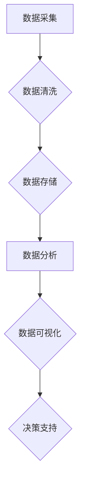

> 人工智能、数据管理、创业、策略、方法、数据安全、数据隐私、数据治理、数据可视化

## 1. 背景介绍

在当今数据爆炸的时代，数据已成为企业最重要的资产之一。人工智能（AI）技术的快速发展，为数据挖掘、分析和应用提供了强大的工具，推动着各行各业的数字化转型。对于创业公司而言，数据管理策略和方法的制定尤为重要，它直接关系到企业的竞争力、可持续发展和未来前景。

然而，创业公司往往面临着资源有限、技术团队相对薄弱等挑战，如何有效地管理和利用数据，成为创业公司面临的一大难题。本文将深入探讨人工智能创业数据管理的策略与方法，为创业公司提供参考和指导。

## 2. 核心概念与联系

**2.1 数据管理的核心概念**

数据管理是指企业对数据进行规划、收集、存储、处理、分析、保护和利用的整个过程。它涵盖了数据生命周期的各个阶段，从数据的采集和存储，到数据的分析和应用，再到数据的安全和隐私保护。

**2.2 人工智能与数据管理的联系**

人工智能技术可以有效地提升数据管理的效率和智能化水平。例如：

* **数据自动分类和标签化:** AI算法可以自动识别和分类数据，并为其添加标签，提高数据可搜索性和可分析性。
* **数据异常检测和预警:** AI模型可以学习数据模式，识别异常数据，并及时发出预警，帮助企业及时发现和解决数据问题。
* **数据分析和预测:** AI算法可以对海量数据进行分析，挖掘隐藏的价值，并进行预测，为企业决策提供支持。

**2.3 数据管理策略与方法**

数据管理策略是指企业根据自身业务需求和数据特点，制定的一系列数据管理原则、目标和方法。数据管理方法是指用于实现数据管理策略的具体技术和工具。

**2.4 数据管理架构**

数据管理架构是指企业数据管理系统的整体设计和组织结构，它通常包括以下几个关键组件：

* **数据仓库:** 用于存储企业内部来自不同来源的数据的集中式存储库。
* **数据湖:** 用于存储各种格式、结构和类型的原始数据的存储库。
* **数据管道:** 用于将数据从源系统传输到数据仓库或数据湖的系统。
* **数据分析平台:** 用于对数据进行分析、挖掘和可视化的平台。
* **数据安全和隐私保护系统:** 用于保护数据安全和隐私的系统。

**2.5 Mermaid 流程图**



## 3. 核心算法原理 & 具体操作步骤

**3.1 算法原理概述**

本文将重点介绍以下几个常用的数据管理算法：

* **K-Means聚类算法:** 用于将数据点划分为若干个簇，每个簇中的数据点彼此相似。
* **Apriori算法:** 用于发现频繁项集，即在数据集中的频繁出现的项组合。
* **PageRank算法:** 用于计算网页的重要性，是Google搜索引擎的核心算法之一。

**3.2 算法步骤详解**

* **K-Means聚类算法:**

    1. 随机选择K个数据点作为初始聚类中心。
    2. 将每个数据点分配到距离其最近的聚类中心所属的簇。
    3. 计算每个簇的中心点，并将其作为新的聚类中心。
    4. 重复步骤2和步骤3，直到聚类中心不再发生变化。

* **Apriori算法:**

    1. 从数据集的最小项集开始，计算每个项集的支持度。
    2. 选择支持度高于阈值的项集作为频繁项集。
    3. 将频繁项集组合成更大的项集，并计算其支持度。
    4. 重复步骤2和步骤3，直到不再发现新的频繁项集。

* **PageRank算法:**

    1. 将网页视为节点，链接视为边，构建一个有向图。
    2. 每个网页的PageRank值初始设置为1/N，其中N为网页总数。
    3. 计算每个网页的入度，即指向该网页的链接数。
    4. 更新每个网页的PageRank值，公式为：PageRank(A) = (1-d) + d * (PageRank(T1)/C(T1) + PageRank(T2)/C(T2) + ... + PageRank(Tn)/C(Tn))，其中d为阻尼系数，T1, T2, ..., Tn为指向网页A的链接网页，C(Ti)为网页Ti的出度。
    5. 重复步骤3和步骤4，直到PageRank值不再发生变化。

**3.3 算法优缺点**

* **K-Means聚类算法:**

    优点: 简单易实现，计算效率高。
    缺点: 对初始聚类中心的选择敏感，容易陷入局部最优解。

* **Apriori算法:**

    优点: 能够发现任意长度的频繁项集。
    缺点: 计算复杂度高，不适合处理海量数据。

* **PageRank算法:**

    优点: 能够准确地反映网页的重要性。
    缺点: 容易受到恶意链接的影响。

**3.4 算法应用领域**

* **K-Means聚类算法:**

    应用于客户画像分析、市场细分、异常检测等领域。

* **Apriori算法:**

    应用于市场篮分析、推荐系统、关联规则挖掘等领域。

* **PageRank算法:**

    应用于搜索引擎排名、社交网络分析、知识图谱构建等领域。

## 4. 数学模型和公式 & 详细讲解 & 举例说明

**4.1 数学模型构建**

数据管理的数学模型通常基于概率论、统计学和机器学习等理论。例如，K-Means聚类算法的数学模型可以表示为：

$$
min \sum_{i=1}^{n} \sum_{j=1}^{k} \delta(i,j) * ||x_i - c_j||^2
$$

其中：

* $n$ 为数据点的数量。
* $k$ 为聚类中心的个数。
* $x_i$ 为第i个数据点。
* $c_j$ 为第j个聚类中心。
* $\delta(i,j)$ 为指示函数，当数据点 $x_i$ 属于第j个簇时取值为1，否则取值为0。
* $||x_i - c_j||^2$ 为数据点 $x_i$ 与聚类中心 $c_j$ 之间的欧氏距离平方。

**4.2 公式推导过程**

K-Means聚类算法的目标是找到最优的聚类中心，使得每个数据点到其所属聚类中心的距离最小。

**4.3 案例分析与讲解**

假设我们有一组数据点，需要将其聚类成两个簇。我们可以使用K-Means算法进行聚类。首先，随机选择两个数据点作为初始聚类中心。然后，将每个数据点分配到距离其最近的聚类中心所属的簇。计算每个簇的中心点，并将其作为新的聚类中心。重复以上步骤，直到聚类中心不再发生变化。

**4.4 其他数学模型和公式**

除了K-Means聚类算法，还有许多其他的数据管理算法，它们也基于不同的数学模型和公式。例如，Apriori算法的频繁项集挖掘基于支持度和置信度等概念，PageRank算法的网页重要性计算基于图论和概率论等理论。

## 5. 项目实践：代码实例和详细解释说明

**5.1 开发环境搭建**

* 操作系统: Ubuntu 20.04 LTS
* Python 版本: 3.8.10
* 必要的库: pandas, numpy, scikit-learn

**5.2 源代码详细实现**

```python
import pandas as pd
from sklearn.cluster import KMeans

# 加载数据
data = pd.read_csv('data.csv')

# 训练K-Means模型
kmeans = KMeans(n_clusters=2)
kmeans.fit(data)

# 获取聚类结果
labels = kmeans.labels_

# 将聚类结果添加到数据中
data['cluster'] = labels

# 保存结果
data.to_csv('data_clustered.csv', index=False)
```

**5.3 代码解读与分析**

* 首先，我们使用pandas库加载数据。
* 然后，我们使用scikit-learn库中的KMeans算法训练模型，并指定聚类中心个数为2。
* 训练完成后，我们可以使用`kmeans.labels_`属性获取每个数据点的聚类结果。
* 最后，我们将聚类结果添加到数据中，并保存结果到CSV文件。

**5.4 运行结果展示**

运行上述代码后，我们将得到一个新的CSV文件，其中包含了原始数据和聚类结果。我们可以使用可视化工具，例如matplotlib或seaborn，将数据可视化，观察不同簇的数据分布情况。

## 6. 实际应用场景

**6.1 客户画像分析**

通过对客户数据的聚类分析，可以将客户划分为不同的群体，例如高价值客户、潜在客户、流失客户等。

**6.2 市场细分**

根据客户的特征和行为，可以将市场细分为不同的细分市场，为不同的市场群体提供个性化的产品和服务。

**6.3 异常检测**

通过对数据进行异常检测，可以识别出异常数据，例如欺诈交易、设备故障等，及时采取措施。

**6.4 推荐系统**

通过对用户行为数据的分析，可以构建推荐系统，为用户推荐感兴趣的产品或服务。

**6.5 未来应用展望**

随着人工智能技术的不断发展，数据管理的应用场景将更加广泛。例如，在医疗领域，可以利用人工智能技术对患者数据进行分析，辅助医生诊断和治疗；在金融领域，可以利用人工智能技术进行风险评估和欺诈检测。

## 7. 工具和资源推荐

**7.1 学习资源推荐**

* **书籍:**
    * 《数据科学实战》
    * 《机器学习》
    * 《Python数据分析手册》
* **在线课程:**
    * Coursera: 数据科学专业
    * edX: 机器学习专业
    * Udemy: 数据分析与可视化课程

**7.2 开发工具推荐**

* **Python:** 数据分析和机器学习的常用编程语言。
* **pandas:** 数据处理和分析的常用库。
* **numpy:** 数值计算的常用库。
* **scikit-learn:** 机器学习算法的常用库。
* **matplotlib:** 数据可视化的常用库。

**7.3 相关论文推荐**

* K-Means聚类算法的论文
* Apriori算法的论文
* PageRank算法的论文

## 8. 总结：未来发展趋势与挑战

**8.1 研究成果总结**

本文探讨了人工智能创业数据管理的策略与方法，介绍了常用的数据管理算法，并提供了代码实例和实际应用场景。

**8.2 未来发展趋势**

* 数据管理将更加智能化和自动化。
* 数据安全和隐私保护将更加重要。
* 数据管理将更加注重可解释性和透明度。

**8.3 面临的挑战**

* 数据量爆炸和数据质量问题。
* 数据安全和隐私保护的挑战。
* 数据管理人才短缺。

**8.4 研究展望**

未来，我们将继续研究人工智能在数据管理领域的应用，探索更智能、更安全、更有效的解决方案。

## 9. 附录：常见问题与解答

**9.1 如何选择合适的聚类算法？**

选择合适的聚类算法取决于数据的特点和应用场景。例如，对于高维数据，可以使用DBSCAN算法；对于离散数据，可以使用K-Means算法。

**9.2 如何评估聚类结果的质量？**

可以使用多种指标评估聚类结果的质量，例如Silhouette系数、Dunn指数等。

**9.