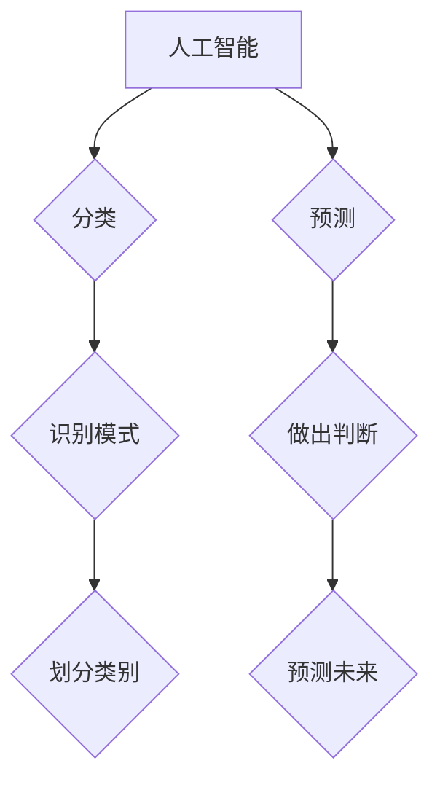

> 人工智能，机器学习，深度学习，分类，预测，算法，模型，应用

## 1. 背景介绍

人工智能（Artificial Intelligence，AI）作为一门跨学科领域，近年来发展迅速，并在各个领域取得了显著的成果。从自动驾驶汽车到智能语音助手，从医疗诊断到金融风险评估，AI技术正在深刻地改变着我们的生活。

人工智能的分类与预测能力是AI研究的核心议题之一。分类和预测是AI中最常见的应用场景，它们涉及到识别模式、做出判断和预测未来趋势。本文将深入探讨人工智能的分类与预测能力，包括其核心概念、算法原理、数学模型、项目实践以及实际应用场景。

## 2. 核心概念与联系

**2.1  人工智能的分类**

人工智能可以根据其智能水平和功能特点进行分类：

* **狭义人工智能 (ANI)：** 能够执行特定任务的人工智能，例如玩象棋、识别图像或翻译语言。
* **通用人工智能 (AGI)：** 能够像人类一样进行思考、学习和解决各种问题的人工智能。
* **超人工智能 (ASI)：** 拥有超越人类智能的人工智能。

**2.2  分类与预测能力的联系**

分类和预测能力是人工智能的核心功能，它们密切相关。

* **分类**是指将数据划分为不同的类别。例如，将电子邮件分类为“垃圾邮件”或“正常邮件”。
* **预测**是指根据历史数据预测未来事件的发生概率。例如，预测股票价格的涨跌或客户的购买行为。

分类算法可以用于构建预测模型。例如，可以使用分类算法将客户分为不同的风险等级，然后根据这些风险等级预测客户的违约概率。



## 3. 核心算法原理 & 具体操作步骤

**3.1  算法原理概述**

常见的分类算法包括：

* **逻辑回归 (Logistic Regression)：** 使用 sigmoid 函数将线性模型的输出映射到0到1之间，用于二分类问题。
* **支持向量机 (Support Vector Machine，SVM)：** 在高维空间中寻找最佳的分隔超平面，用于分类问题。
* **决策树 (Decision Tree)：** 使用树状结构来表示决策规则，用于分类和回归问题。
* **随机森林 (Random Forest)：** 结合多个决策树，提高分类精度。
* **k-最近邻 (k-Nearest Neighbors，k-NN)：** 根据训练数据中与新数据点最近的k个邻居进行分类。

**3.2  算法步骤详解**

以逻辑回归为例，其具体操作步骤如下：

1. **数据预处理：** 对数据进行清洗、转换和特征工程，例如处理缺失值、编码类别变量和提取特征。
2. **模型训练：** 使用训练数据训练逻辑回归模型，学习参数。
3. **模型评估：** 使用测试数据评估模型的性能，例如计算准确率、召回率和F1-score。
4. **模型调参：** 根据评估结果调整模型参数，例如学习率和正则化参数，以提高模型性能。
5. **模型部署：** 将训练好的模型部署到生产环境中，用于预测新数据。

**3.3  算法优缺点**

不同的分类算法具有不同的优缺点，需要根据具体应用场景选择合适的算法。

* **逻辑回归：** 优点：易于理解和实现，训练速度快；缺点：对非线性数据拟合能力较弱。
* **支持向量机：** 优点：对高维数据具有较好的泛化能力；缺点：训练时间较长，参数选择较复杂。
* **决策树：** 优点：易于理解和解释，可以处理非线性数据；缺点：容易过拟合，对数据噪声敏感。
* **随机森林：** 优点：鲁棒性强，可以处理高维数据；缺点：训练时间较长，解释性较差。
* **k-最近邻：** 优点：简单易行，无需训练；缺点：计算复杂度高，对数据规模敏感。

**3.4  算法应用领域**

分类算法广泛应用于各个领域，例如：

* **图像识别：** 将图像分类为不同的类别，例如人脸识别、物体检测和场景理解。
* **自然语言处理：** 将文本分类为不同的类别，例如情感分析、主题分类和垃圾邮件过滤。
* **医疗诊断：** 根据患者的症状和检查结果进行疾病诊断。
* **金融风险评估：** 根据客户的信用记录和交易行为进行风险评估。

## 4. 数学模型和公式 & 详细讲解 & 举例说明

**4.1  数学模型构建**

逻辑回归模型的数学模型如下：

$$
p(y=1|x) = \frac{1}{1 + e^{-(w^T x + b)}}
$$

其中：

* $p(y=1|x)$ 是给定输入 $x$ 时，预测输出 $y$ 为1的概率。
* $w$ 是模型参数，代表特征的权重。
* $x$ 是输入特征向量。
* $b$ 是模型参数，代表偏置项。
* $e$ 是自然对数的底数。

**4.2  公式推导过程**

逻辑回归模型的损失函数是交叉熵损失函数，其目标是最小化模型预测结果与真实结果之间的差异。

$$
L(w,b) = -\frac{1}{n} \sum_{i=1}^{n} [y_i \log(p(y_i=1|x_i)) + (1-y_i) \log(1-p(y_i=1|x_i))]
$$

其中：

* $n$ 是训练样本的数量。
* $y_i$ 是第 $i$ 个样本的真实标签。
* $p(y_i=1|x_i)$ 是模型预测第 $i$ 个样本输出为1的概率。

使用梯度下降算法可以最小化损失函数，从而学习模型参数 $w$ 和 $b$。

**4.3  案例分析与讲解**

假设我们有一个二分类问题，需要判断邮件是否为垃圾邮件。我们可以使用逻辑回归模型进行分类。

* **特征：** 邮件的主题、内容、发送者等。
* **标签：** 垃圾邮件或正常邮件。

我们可以使用训练数据训练逻辑回归模型，学习特征的权重和偏置项。然后，我们可以使用测试数据评估模型的性能，例如计算准确率和召回率。

## 5. 项目实践：代码实例和详细解释说明

**5.1  开发环境搭建**

可以使用 Python 语言和 scikit-learn 库进行逻辑回归模型的开发。

**5.2  源代码详细实现**

```python
from sklearn.linear_model import LogisticRegression
from sklearn.model_selection import train_test_split
from sklearn.metrics import accuracy_score

# 加载数据
data = ...

# 将数据分为特征和标签
X = data.drop('label', axis=1)
y = data['label']

# 将数据分为训练集和测试集
X_train, X_test, y_train, y_test = train_test_split(X, y, test_size=0.2, random_state=42)

# 创建逻辑回归模型
model = LogisticRegression()

# 训练模型
model.fit(X_train, y_train)

# 预测测试集
y_pred = model.predict(X_test)

# 计算准确率
accuracy = accuracy_score(y_test, y_pred)
print(f'准确率: {accuracy}')
```

**5.3  代码解读与分析**

* 首先，我们加载数据并将其分为特征和标签。
* 然后，我们将数据分为训练集和测试集。
* 接下来，我们创建逻辑回归模型并使用训练集进行训练。
* 训练完成后，我们使用测试集进行预测，并计算模型的准确率。

**5.4  运行结果展示**

运行代码后，会输出模型的准确率。

## 6. 实际应用场景

**6.1  医疗诊断**

逻辑回归模型可以用于辅助医生进行疾病诊断。例如，根据患者的症状、检查结果和病史，预测患者患有特定疾病的概率。

**6.2  金融风险评估**

逻辑回归模型可以用于评估客户的信用风险。例如，根据客户的信用记录、收入和支出，预测客户是否会违约。

**6.3  广告推荐**

逻辑回归模型可以用于推荐用户感兴趣的广告。例如，根据用户的浏览历史、购买记录和兴趣爱好，预测用户是否会点击特定广告。

**6.4  未来应用展望**

随着人工智能技术的不断发展，分类和预测能力将在更多领域得到应用，例如：

* **自动驾驶汽车：** 识别道路上的障碍物、行人和其他车辆。
* **智能家居：** 根据用户的行为模式，自动调节灯光、温度和安全系统。
* **个性化教育：** 根据学生的学习进度和能力，提供个性化的学习内容和辅导。

## 7. 工具和资源推荐

**7.1  学习资源推荐**

* **书籍：**
    * 《机器学习》 by 周志华
    * 《深入理解机器学习》 by 彭明
* **在线课程：**
    * Coursera: Machine Learning by Andrew Ng
    * edX: Artificial Intelligence by Columbia University

**7.2  开发工具推荐**

* **Python:** 
    * scikit-learn: 机器学习库
    * TensorFlow: 深度学习库
    * PyTorch: 深度学习库

**7.3  相关论文推荐**

* **Logistic Regression:**
    * Cox, D. R. (1958). The regression analysis of binary sequences. Journal of the Royal Statistical Society, Series B, 20(2), 173-200.
* **Support Vector Machine:**
    * Cortes, C., & Vapnik, V. (1995). Support-vector networks. Machine learning, 20(3), 273-297.
* **Decision Tree:**
    * Breiman, L., Friedman, J. H., Olshen, R. A., & Stone, C. J. (1984). Classification and regression trees. Wadsworth & Brooks/Cole Advanced Books & Software.

## 8. 总结：未来发展趋势与挑战

**8.1  研究成果总结**

近年来，人工智能的分类与预测能力取得了显著的进展，例如：

* 深度学习算法的出现，大幅提高了分类和预测的精度。
* 迁移学习和联邦学习等新技术，使得模型能够在更少数据的情况下进行训练。

**8.2  未来发展趋势**

未来，人工智能的分类与预测能力将朝着以下方向发展：

* **更强大的模型：** 研究更深、更复杂的深度学习模型，提高分类和预测的精度。
* **更有效的训练方法：** 研究更有效的训练方法，例如自监督学习和强化学习，降低模型训练成本。
* **更广泛的应用场景：** 将人工智能的分类与预测能力应用到更多领域，例如医疗、教育、金融等。

**8.3  面临的挑战**

人工智能的分类与预测能力也面临着一些挑战：

* **数据质量问题：** 训练模型需要大量高质量的数据，而现实世界的数据往往存在噪声、缺失和偏差。
* **模型解释性问题：** 深度学习模型的内部机制复杂，难以解释模型的决策过程。
* **伦理问题：** 人工智能的分类与预测能力可能带来一些伦理问题，例如歧视和隐私泄露。

**8.4  研究展望**

未来，我们需要继续研究人工智能的分类与预测能力，解决上述挑战，并将其应用于更多领域，造福人类社会。

## 9. 附录：常见问题与解答

**9.1  如何选择合适的分类算法？**

选择合适的分类算法需要根据具体应用场景和数据特点进行考虑。例如，对于高