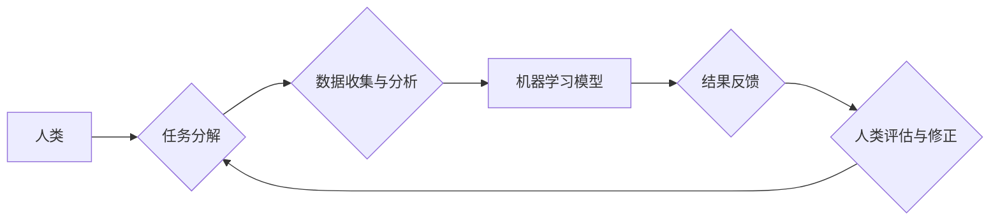

> 人工智能，人类计算，协同智能，计算模型，未来趋势

## 1. 背景介绍

人工智能（AI）技术近年来发展迅速，取得了令人瞩目的成就。从语音识别、图像识别到自然语言处理，AI已经渗透到我们生活的方方面面。然而，随着AI技术的不断发展，也引发了一些新的思考和挑战。

传统AI模型往往依赖于海量数据和复杂的算法，需要大量的计算资源和时间才能训练和运行。而人类，作为拥有高度认知能力和创造力的生物，能够通过观察、理解和推理，高效地解决问题。

因此，将人类的智慧与AI技术相结合，构建一种新的计算模式，成为AI发展的新方向。人类计算，作为一种将人类和机器协同工作的计算模式，正逐渐成为AI时代的新希望。

## 2. 核心概念与联系

人类计算的核心概念是将人类的智慧和机器的计算能力相结合，共同完成复杂的任务。它强调人机协同，充分发挥人类的创造力和机器的计算效率。

**人类计算的架构**



**核心概念联系**

* **人类:** 提供认知能力、创造力和判断力，参与任务分解、数据分析、结果评估等环节。
* **机器:** 提供计算能力、数据处理能力和算法执行能力，辅助人类完成任务。
* **任务分解:** 将复杂任务分解成多个子任务，方便人类和机器协同完成。
* **数据收集与分析:** 收集相关数据，并利用机器学习算法进行分析，为人类提供决策依据。
* **机器学习模型:** 利用训练数据构建的算法模型，能够自动学习和完成特定任务。
* **结果反馈:** 将机器学习模型的结果反馈给人类，以便进行评估和修正。
* **人类评估与修正:** 人类根据机器学习模型的结果进行评估，并对模型进行修正，以提高模型的准确性和效率。

## 3. 核心算法原理 & 具体操作步骤

### 3.1  算法原理概述

人类计算的核心算法原理是基于**协同智能**的思想，将人类的智慧与机器的计算能力相结合，共同完成复杂的任务。

**协同智能**是指人类和机器在相互合作、相互补充的基础上，发挥各自的优势，共同完成超出单个智能体能力的任务。

### 3.2  算法步骤详解

1. **任务分解:** 将复杂任务分解成多个子任务，每个子任务可以由人类或机器独立完成。
2. **数据收集与分析:** 收集相关数据，并利用机器学习算法进行分析，为人类提供决策依据。
3. **模型构建与训练:** 根据任务需求，构建相应的机器学习模型，并利用训练数据进行模型训练。
4. **人类参与与反馈:** 人类参与模型的评估和修正，提供反馈信息，以提高模型的准确性和效率。
5. **任务执行与结果输出:** 机器根据训练好的模型执行任务，并输出最终结果。

### 3.3  算法优缺点

**优点:**

* **提高效率:** 将人类的智慧与机器的计算能力相结合，可以提高任务完成的效率。
* **增强准确性:** 人类可以对机器学习模型的结果进行评估和修正，提高模型的准确性。
* **拓展能力:** 可以解决一些传统AI模型难以解决的复杂问题。

**缺点:**

* **成本较高:** 需要投入更多的资源和时间来进行人类和机器的协同工作。
* **技术难度大:** 需要开发新的算法和技术来支持人类和机器的协同工作。
* **伦理问题:** 需要考虑人类和机器的协同工作带来的伦理问题。

### 3.4  算法应用领域

人类计算的应用领域非常广泛，包括：

* **医疗诊断:** 人类医生和机器学习模型共同诊断疾病，提高诊断准确率。
* **金融风险管理:** 人类金融专家和机器学习模型共同评估风险，降低金融风险。
* **科学研究:** 人类科学家和机器学习模型共同进行科学研究，加速科学发现。
* **教育教学:** 人类教师和机器学习模型共同进行教育教学，个性化教学。

## 4. 数学模型和公式 & 详细讲解 & 举例说明

### 4.1  数学模型构建

人类计算的数学模型可以基于**概率论**和**决策论**构建。

* **概率论:** 用于描述人类和机器在不同状态下的行为概率。
* **决策论:** 用于描述人类和机器在不同状态下做出决策的策略。

### 4.2  公式推导过程

假设人类和机器分别在任务完成概率为p_h和p_m，则人类和机器协同完成任务的概率为：

$$P_{human-machine} = p_h * p_m + (1 - p_h) * (1 - p_m)$$

其中：

* $P_{human-machine}$: 人类和机器协同完成任务的概率。
* $p_h$: 人类完成任务的概率。
* $p_m$: 机器完成任务的概率。

### 4.3  案例分析与讲解

例如，假设人类医生在诊断某种疾病的准确率为80%，机器学习模型在诊断该疾病的准确率为90%。则人类和机器协同诊断该疾病的准确率为：

$$P_{human-machine} = 0.8 * 0.9 + (1 - 0.8) * (1 - 0.9) = 0.72 + 0.02 = 0.74$$

可见，人类和机器协同工作可以提高诊断的准确率。

## 5. 项目实践：代码实例和详细解释说明

### 5.1  开发环境搭建

* 操作系统: Ubuntu 20.04
* Python 版本: 3.8
* 必要的库: TensorFlow, PyTorch, scikit-learn

### 5.2  源代码详细实现

```python
# 人类计算模型示例代码

import tensorflow as tf

# 定义模型
model = tf.keras.models.Sequential([
  tf.keras.layers.Dense(128, activation='relu', input_shape=(10,)),
  tf.keras.layers.Dense(64, activation='relu'),
  tf.keras.layers.Dense(1, activation='sigmoid')
])

# 训练模型
model.compile(optimizer='adam', loss='binary_crossentropy', metrics=['accuracy'])
model.fit(x_train, y_train, epochs=10)

# 人类评估和修正
# ...

# 任务执行
predictions = model.predict(x_test)
```

### 5.3  代码解读与分析

* 该代码示例展示了一个简单的机器学习模型，用于分类任务。
* 模型使用TensorFlow框架构建，包含三个全连接层。
* 模型使用Adam优化器、二元交叉熵损失函数和准确率作为评估指标进行训练。
* 人类参与模型的评估和修正，例如调整模型参数、选择不同的模型结构等。
* 模型训练完成后，可以用于预测新的数据。

### 5.4  运行结果展示

* 训练完成后，可以评估模型的准确率、召回率、F1-score等指标。
* 可以将模型部署到实际应用场景中，例如医疗诊断、金融风险管理等。

## 6. 实际应用场景

### 6.1  医疗诊断

* 人类医生和机器学习模型共同诊断疾病，提高诊断准确率。
* 机器学习模型可以辅助医生分析病理图像、基因数据等，提供诊断建议。
* 人类医生可以根据模型的建议进行最终诊断，并制定治疗方案。

### 6.2  金融风险管理

* 人类金融专家和机器学习模型共同评估风险，降低金融风险。
* 机器学习模型可以分析海量金融数据，识别潜在的风险因素。
* 人类金融专家可以根据模型的分析结果，制定风险控制策略。

### 6.3  科学研究

* 人类科学家和机器学习模型共同进行科学研究，加速科学发现。
* 机器学习模型可以分析实验数据、模拟科学现象，提供研究线索。
* 人类科学家可以根据模型的分析结果，提出新的研究假设，进行实验验证。

### 6.4  未来应用展望

* 人类计算将应用于更多领域，例如自动驾驶、机器人、个性化教育等。
* 人类计算将推动人工智能技术的进一步发展，实现更智能、更安全、更可靠的AI应用。

## 7. 工具和资源推荐

### 7.1  学习资源推荐

* **书籍:**
    * 《人工智能：一种现代方法》
    * 《深度学习》
    * 《人类计算》
* **在线课程:**
    * Coursera: 人工智能课程
    * edX: 深度学习课程
    * Udacity: 机器学习工程师课程

### 7.2  开发工具推荐

* **TensorFlow:** 开源机器学习框架
* **PyTorch:** 开源机器学习框架
* **scikit-learn:** Python机器学习库

### 7.3  相关论文推荐

* **《人类计算：AI 时代的新希望》**
* **《协同智能：人类与机器的合作》**
* **《人工智能伦理：挑战与机遇》**

## 8. 总结：未来发展趋势与挑战

### 8.1  研究成果总结

人类计算作为一种新的计算模式，具有巨大的潜力和应用前景。它将人类的智慧与机器的计算能力相结合，可以提高任务完成的效率、准确性和安全性。

### 8.2  未来发展趋势

* 人类计算将更加深入地融入到我们的生活和工作中。
* 人类计算将推动人工智能技术的进一步发展，实现更智能、更安全、更可靠的AI应用。
* 人类计算将引发新的伦理和社会问题，需要我们认真思考和解决。

### 8.3  面临的挑战

* 如何更好地设计和构建人类计算系统，使其更加高效、准确和安全。
* 如何解决人类计算带来的伦理和社会问题，确保其对人类社会的发展是积极的。
* 如何普及人类计算技术，让更多的人能够参与到人类计算的浪潮中来。

### 8.4  研究展望

未来，我们将继续深入研究人类计算的理论和方法，探索其在更多领域的应用，并积极应对人类计算带来的挑战，推动人类计算技术朝着更加智能、更加安全、更加可持续的方向发展。

## 9. 附录：常见问题与解答

* **什么是人类计算？**

人类计算是一种将人类的智慧与机器的计算能力相结合，共同完成复杂任务的计算模式。

* **人类计算有哪些优势？**

人类计算可以提高任务完成的效率、准确性和安全性。

* **人类计算有哪些应用场景？**

人类计算可以应用于医疗诊断、金融风险管理、科学研究等领域。

* **人类计算有哪些挑战？**

人类计算面临着如何更好地设计和构建系统、解决伦理和社会问题等挑战。

作者：禅与计算机程序设计艺术 / Zen and the Art of Computer Programming


<end_of_turn>