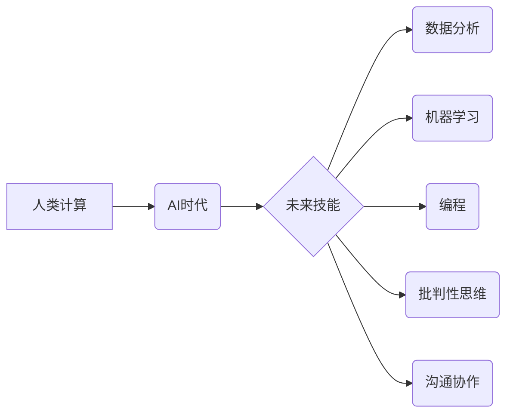

> 人工智能，未来技能，人类计算，数据分析，机器学习，深度学习，编程

## 1. 背景介绍

人工智能（AI）正在以惊人的速度发展，它正在改变着我们生活的方方面面。从自动驾驶汽车到智能家居，从医疗诊断到金融交易，AI的应用场景日益广泛。然而，随着AI技术的进步，也引发了人们对未来工作和技能需求的担忧。

传统的工作模式正在被颠覆，许多重复性、规则性工作将被自动化取代。因此，在AI时代，我们需要培养新的技能，以适应不断变化的职场环境。

## 2. 核心概念与联系

**2.1 人类计算**

人类计算是指利用人类的智慧、创造力和解决问题的能力，结合计算机技术，共同完成复杂的任务。它强调人与机器的协同合作，发挥各自的优势，实现更高效、更智能的计算。

**2.2 AI时代的未来技能**

在AI时代，未来技能不再局限于传统的技术技能，而是更加注重跨学科的综合能力。以下是一些关键的未来技能：

* **数据分析和可视化:** AI算法需要大量的数据进行训练和优化，因此数据分析和可视化能力将变得越来越重要。
* **机器学习和深度学习:** 了解机器学习和深度学习的基本原理，能够帮助我们更好地理解AI技术，并应用于实际问题。
* **编程和软件开发:** 即使AI技术不断发展，编程和软件开发仍然是未来不可或缺的技能。
* **批判性思维和解决问题的能力:** AI可以提供大量的信息和建议，但最终的决策权仍然掌握在人类手中。因此，批判性思维和解决问题的能力将更加重要。
* **沟通和协作能力:** 在AI时代，人与人之间的沟通和协作将更加重要。

**2.3 核心概念关系图**



## 3. 核心算法原理 & 具体操作步骤

**3.1 算法原理概述**

机器学习算法是一种能够从数据中学习并不断改进的算法。它通过训练模型，识别数据中的模式和规律，从而实现预测、分类、聚类等功能。

**3.2 算法步骤详解**

1. **数据收集和预处理:** 收集相关数据，并进行清洗、转换、特征工程等预处理操作。
2. **模型选择:** 根据具体任务选择合适的机器学习算法，例如线性回归、逻辑回归、决策树、支持向量机等。
3. **模型训练:** 使用训练数据训练模型，调整模型参数，使模型能够准确地预测或分类数据。
4. **模型评估:** 使用测试数据评估模型的性能，例如准确率、召回率、F1-score等指标。
5. **模型调优:** 根据评估结果，调整模型参数或选择其他算法，进一步提高模型性能。
6. **模型部署:** 将训练好的模型部署到实际应用场景中，用于预测或分类新的数据。

**3.3 算法优缺点**

**优点:**

* 自动化学习：无需人工编程，算法可以自动从数据中学习。
* 适应性强：可以适应不断变化的数据分布和任务需求。
* 性能优越：在某些任务上，机器学习算法可以比传统算法取得更好的性能。

**缺点:**

* 数据依赖：机器学习算法需要大量的数据进行训练，否则性能会下降。
* 黑盒效应：一些机器学习算法的内部工作机制难以理解，难以解释模型的决策结果。
* 算法选择困难：不同的机器学习算法适用于不同的任务，选择合适的算法需要经验和技巧。

**3.4 算法应用领域**

机器学习算法广泛应用于各个领域，例如：

* **图像识别:** 人脸识别、物体检测、图像分类等。
* **自然语言处理:** 文本分类、情感分析、机器翻译等。
* **推荐系统:** 商品推荐、内容推荐、用户画像等。
* **医疗诊断:** 疾病预测、影像分析、药物研发等。
* **金融风险控制:** 欺诈检测、信用评分、投资决策等。

## 4. 数学模型和公式 & 详细讲解 & 举例说明

**4.1 数学模型构建**

机器学习算法通常基于数学模型，例如线性回归模型、逻辑回归模型、决策树模型等。这些模型通过数学公式来描述数据之间的关系，并进行预测或分类。

**4.2 公式推导过程**

例如，线性回归模型的目标是找到一条直线，能够最佳地拟合数据点。模型的数学公式如下：

$$y = w_0 + w_1x_1 + w_2x_2 + ... + w_nx_n$$

其中：

* $y$ 是预测值
* $w_0, w_1, w_2, ..., w_n$ 是模型参数
* $x_1, x_2, ..., x_n$ 是输入特征

模型参数可以通过最小化预测误差来求解，常用的优化算法包括梯度下降法、随机梯度下降法等。

**4.3 案例分析与讲解**

假设我们有一个数据集，包含房屋面积和房屋价格的信息。我们可以使用线性回归模型来预测房屋价格。

* 输入特征：房屋面积
* 输出特征：房屋价格

通过训练模型，我们可以得到模型参数 $w_0$ 和 $w_1$。然后，我们可以使用这些参数来预测新房屋的价格。

例如，如果新房屋的面积为 100 平方米，我们可以使用以下公式进行预测：

$$y = w_0 + w_1 * 100$$

其中 $w_0$ 和 $w_1$ 是训练得到的模型参数。

## 5. 项目实践：代码实例和详细解释说明

**5.1 开发环境搭建**

可以使用 Python 语言和相关的机器学习库，例如 scikit-learn、TensorFlow、PyTorch 等，进行机器学习项目实践。

**5.2 源代码详细实现**

```python
from sklearn.linear_model import LinearRegression
from sklearn.model_selection import train_test_split
import pandas as pd

# 加载数据
data = pd.read_csv('house_data.csv')

# 分割数据
X = data[['area']]
y = data['price']
X_train, X_test, y_train, y_test = train_test_split(X, y, test_size=0.2, random_state=42)

# 创建线性回归模型
model = LinearRegression()

# 训练模型
model.fit(X_train, y_train)

# 预测测试数据
y_pred = model.predict(X_test)

# 评估模型性能
from sklearn.metrics import mean_squared_error
mse = mean_squared_error(y_test, y_pred)
print(f'Mean Squared Error: {mse}')
```

**5.3 代码解读与分析**

* 首先，我们加载数据并将其分割成训练集和测试集。
* 然后，我们创建线性回归模型并使用训练集进行训练。
* 训练完成后，我们可以使用模型对测试数据进行预测。
* 最后，我们使用均方误差 (MSE) 来评估模型的性能。

**5.4 运行结果展示**

运行代码后，会输出模型的均方误差值。

## 6. 实际应用场景

**6.1 医疗诊断**

机器学习算法可以用于分析患者的医疗影像数据，例如 X 光片、CT 扫描、MRI 扫描等，辅助医生进行疾病诊断。

**6.2 金融风险控制**

机器学习算法可以用于分析客户的财务数据，识别潜在的欺诈行为或信用风险。

**6.3 个性化推荐**

机器学习算法可以根据用户的历史行为数据，推荐个性化的商品、内容或服务。

**6.4 未来应用展望**

随着AI技术的不断发展，机器学习算法将在更多领域得到应用，例如自动驾驶、机器人、智能家居等。

## 7. 工具和资源推荐

**7.1 学习资源推荐**

* **在线课程:** Coursera、edX、Udacity 等平台提供丰富的机器学习课程。
* **书籍:** 《机器学习》 (周志华)、《深度学习》 (Ian Goodfellow) 等书籍是机器学习学习的经典教材。
* **开源库:** scikit-learn、TensorFlow、PyTorch 等开源库提供了丰富的机器学习工具和算法。

**7.2 开发工具推荐**

* **Python:** Python 语言是机器学习开发的常用语言。
* **Jupyter Notebook:** Jupyter Notebook 是一个交互式编程环境，方便机器学习开发和调试。
* **云计算平台:** AWS、Azure、GCP 等云计算平台提供了丰富的机器学习服务和工具。

**7.3 相关论文推荐**

* **《机器学习》 (周志华)**
* **《深度学习》 (Ian Goodfellow)**
* **《Pattern Recognition and Machine Learning》 (Christopher Bishop)**

## 8. 总结：未来发展趋势与挑战

**8.1 研究成果总结**

近年来，机器学习算法取得了显著的进展，在图像识别、自然语言处理、语音识别等领域取得了突破性成果。

**8.2 未来发展趋势**

* **模型更加复杂:** 未来机器学习模型将更加复杂，例如 Transformer 模型、生成对抗网络 (GAN) 等。
* **数据更加丰富:** 未来机器学习算法将需要处理更加丰富的数据，例如文本、图像、视频、音频等多模态数据。
* **应用更加广泛:** 未来机器学习算法将应用于更多领域，例如医疗、教育、金融、交通等。

**8.3 面临的挑战**

* **数据隐私和安全:** 机器学习算法需要大量的数据进行训练，如何保护数据隐私和安全是一个重要的挑战。
* **算法可解释性:** 许多机器学习算法的内部工作机制难以理解，如何提高算法的可解释性是一个重要的研究方向。
* **算法公平性:** 机器学习算法可能会存在偏见，导致不公平的结果，如何确保算法的公平性是一个重要的伦理问题。

**8.4 研究展望**

未来，机器学习研究将继续朝着更加智能、更加安全、更加公平的方向发展。


## 9. 附录：常见问题与解答

**9.1 如何选择合适的机器学习算法？**

选择合适的机器学习算法取决于具体的任务和数据特点。例如，对于分类任务，可以考虑逻辑回归、决策树、支持向量机等算法；对于回归任务，可以考虑线性回归、支持向量回归等算法。

**9.2 如何评估机器学习模型的性能？**

常用的机器学习模型性能评估指标包括准确率、召回率、F1-score、均方误差等。

**9.3 如何处理机器学习算法中的过拟合问题？**

过拟合是指模型对训练数据过拟合，导致在测试数据上性能下降。常用的处理过拟合的方法包括正则化、交叉验证、数据增强等。


作者：禅与计算机程序设计艺术 / Zen and the Art of Computer Programming 
<end_of_turn>