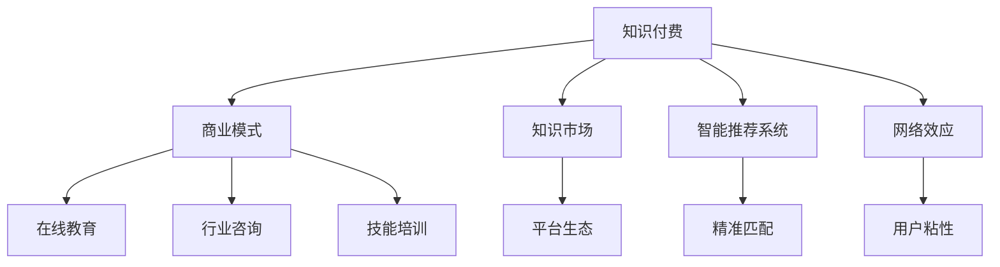

                 

# 知识经济时代下的知识付费创新商业模式设计

> 关键词：知识付费,商业模式创新,知识市场,在线教育,数据驱动,智能推荐系统,用户心理,定价策略,网络效应,内容生产,品牌建设

## 1. 背景介绍

### 1.1 问题由来

在知识经济时代，知识的价值被重新认识，越来越多的人愿意为获取知识付费。传统教育机构、出版业、行业专家等纷纷转向线上，开展知识付费业务，以期获得更大的市场空间。但传统知识付费模式面临着用户粘性低、服务质量不稳定等问题，亟需创新商业模式以实现更好的市场效果。

### 1.2 问题核心关键点

知识付费的商业模式创新，需要从以下几个核心关键点进行突破：

- **知识付费场景多样化**：将知识付费应用场景拓展至更广泛的领域，如在线教育、行业咨询、技能培训等。
- **精准用户需求匹配**：通过数据驱动的方式，精准识别用户需求，提供定制化服务。
- **高效内容生产与分发**：构建智能推荐系统，提升内容分发效率，降低用户寻找优质内容的成本。
- **付费模式多样化**：探索多元化的付费方式，如订阅制、按需支付、会员制等，满足不同用户群体的需求。
- **强化内容品牌建设**：通过高质量内容，塑造知识付费平台的用户粘性和品牌效应。
- **激励机制优化**：设计合理的激励机制，促进内容生产者和平台之间良性互动，提升内容质量。

## 2. 核心概念与联系

### 2.1 核心概念概述

为更好地理解知识付费创新商业模式的设计，本节将介绍几个密切相关的核心概念：

- **知识付费**：指通过付费方式获取知识服务或知识内容的经济行为。包括在线教育、行业咨询、技能培训等多种形式。
- **商业模式**：指企业在特定环境下，以创造价值为核心目标，实现利润最大化的运营模式。
- **知识市场**：指知识服务或知识内容交易的场所，包括在线教育平台、行业知识库、专业咨询公司等。
- **智能推荐系统**：通过用户行为数据和内容特征，预测用户兴趣，实现精准内容推荐的技术体系。
- **网络效应**：指当产品用户越多，其价值越大，形成正反馈循环的现象。

这些核心概念之间的逻辑关系可以通过以下Mermaid流程图来展示：



这个流程图展示的知识付费核心概念及其之间的关系：

1. 知识付费通过商业模式得以实现，而不同的商业模式对应不同的知识市场。
2. 智能推荐系统提升内容匹配精度，增强用户体验。
3. 网络效应使得平台价值随用户增长而增长，形成良性循环。
4. 在线教育、行业咨询、技能培训等是知识付费的具体应用场景。
5. 平台生态和精准匹配构成知识市场的重要组成部分。
6. 用户粘性和品牌效应是商业模式成功的关键。

## 3. 核心算法原理 & 具体操作步骤
### 3.1 算法原理概述

知识付费的商业模式创新，本质上是设计一种可持续发展的价值创造和分配机制。其核心在于如何高效匹配知识生产者和消费者，实现内容的精准分发和付费模式的合理设计。

从技术层面而言，知识付费的商业模式创新主要涉及以下几方面的算法：

1. **内容推荐算法**：通过用户行为数据和内容特征，实现精准匹配，提升用户获取高质量内容的机会。
2. **定价策略算法**：根据内容价值、用户需求等因素，制定合理的付费价格，满足不同用户群体的需求。
3. **内容生成与优化算法**：促进高质量内容生成，提升内容质量，增强平台的竞争力和用户粘性。
4. **激励机制设计**：设计合理的激励机制，促进内容生产者和平台之间良性互动，提升内容质量。

### 3.2 算法步骤详解

知识付费的商业模式创新主要包括以下几个关键步骤：

**Step 1: 用户行为数据分析**

1. 收集用户的行为数据，如浏览历史、搜索记录、付费记录等。
2. 通过数据清洗和预处理，构建用户行为特征向量。
3. 应用机器学习算法对用户行为进行聚类和分析，识别用户兴趣和偏好。

**Step 2: 内容特征提取**

1. 提取内容的文本特征，如关键词、情感倾向、主题等。
2. 应用自然语言处理技术，对内容进行语义分析和特征提取。
3. 构建内容特征向量，与用户行为特征向量进行匹配。

**Step 3: 智能推荐系统设计**

1. 选择合适的推荐算法，如协同过滤、矩阵分解、深度学习等。
2. 设计推荐模型，对用户行为和内容特征进行建模。
3. 训练推荐模型，使用历史数据进行调参和优化。
4. 部署推荐模型，实时推荐内容给用户。

**Step 4: 定价策略设计**

1. 根据内容价值、用户需求等因素，设定不同的定价策略。
2. 应用经济学理论，设计动态定价模型，实时调整价格。
3. 设计订阅制、按需支付、会员制等多样化付费模式，满足不同用户需求。

**Step 5: 内容生产与优化**

1. 通过数据分析，识别内容创作的热门领域和趋势。
2. 设计内容生产激励机制，如奖励制度、版权保护等，促进内容生产。
3. 应用人工智能技术，提升内容创作效率和质量。
4. 设计内容评价体系，定期评估内容质量，淘汰低质量内容。

**Step 6: 激励机制设计**

1. 设计合理的激励机制，如积分系统、粉丝打赏、内容分成等。
2. 促进内容生产者和平台之间的良性互动，提升内容质量和平台活力。
3. 通过数据分析，优化激励机制参数，确保公平和可持续性。

### 3.3 算法优缺点

知识付费的商业模式创新涉及的算法具有以下优点：

1. **精准匹配**：智能推荐系统通过数据驱动的方式，精准识别用户需求，提升内容分发效率，满足用户个性化需求。
2. **成本效益**：通过推荐系统优化内容分发，减少了用户寻找优质内容的成本，提高了平台的盈利能力。
3. **内容质量提升**：激励机制和内容评价体系促进高质量内容的生成和优化，增强平台的竞争力和用户粘性。

同时，这些算法也存在一些缺点：

1. **用户隐私问题**：收集和分析用户行为数据，可能涉及隐私问题，需加强数据保护措施。
2. **算法偏见**：算法模型可能存在偏见，需要定期评估和校正。
3. **平台竞争**：算法驱动的内容推荐可能导致平台之间的内容同质化，降低用户选择的多样性。
4. **用户依赖**：过度依赖算法推荐，可能削弱用户的自主选择能力，降低用户满意度。

## 4. 数学模型和公式 & 详细讲解  
### 4.1 数学模型构建

知识付费的商业模式创新涉及的算法模型主要包括以下几个方面：

1. **协同过滤推荐模型**：
   - 用户行为矩阵 $U$：每个用户对不同内容的评分。
   - 内容特征矩阵 $V$：每个内容的用户评分平均值。
   - 相似度矩阵 $S$：基于用户行为矩阵和内容特征矩阵计算得到。
   - 推荐公式为：$\hat{y}_i = \sum_{j=1}^N S_{ij} U_j$

2. **矩阵分解推荐模型**：
   - 用户行为矩阵 $U$：每个用户对不同内容的评分。
   - 内容特征矩阵 $V$：每个内容的用户评分平均值。
   - 低秩矩阵分解公式为：$U \approx U_s \times V_s$

3. **深度学习推荐模型**：
   - 用户行为特征向量 $U$：每个用户对不同内容的评分。
   - 内容特征向量 $V$：每个内容的用户评分平均值。
   - 神经网络模型结构为：输入层、隐藏层、输出层。

### 4.2 公式推导过程

以协同过滤推荐模型为例，其推荐公式推导过程如下：

1. 用户行为矩阵 $U$：
   $$
   U = \begin{bmatrix}
   r_{11} & r_{12} & \cdots & r_{1n} \\
   r_{21} & r_{22} & \cdots & r_{2n} \\
   \vdots & \vdots & \ddots & \vdots \\
   r_{m1} & r_{m2} & \cdots & r_{mn}
   \end{bmatrix}
   $$
   其中 $r_{ij}$ 表示用户 $i$ 对内容 $j$ 的评分。

2. 内容特征矩阵 $V$：
   $$
   V = \begin{bmatrix}
   \bar{r}_{1} & \bar{r}_{2} & \cdots & \bar{r}_{n} \\
   \bar{r}_{1} & \bar{r}_{2} & \cdots & \bar{r}_{n} \\
   \vdots & \vdots & \ddots & \vdots \\
   \bar{r}_{1} & \bar{r}_{2} & \cdots & \bar{r}_{n}
   \end{bmatrix}
   $$
   其中 $\bar{r}_{j}$ 表示内容 $j$ 的平均评分。

3. 相似度矩阵 $S$：
   $$
   S = U \times V^{-1}
   $$

4. 推荐公式为：
   $$
   \hat{y}_i = S_i \times U_i
   $$

通过协同过滤推荐模型，实现对用户行为和内容特征的匹配，精准推荐内容。

## 5. 项目实践：代码实例和详细解释说明
### 5.1 开发环境搭建

在进行知识付费商业模式创新的项目实践前，我们需要准备好开发环境。以下是使用Python进行PyTorch开发的环境配置流程：

1. 安装Anaconda：从官网下载并安装Anaconda，用于创建独立的Python环境。

2. 创建并激活虚拟环境：
```bash
conda create -n pytorch-env python=3.8 
conda activate pytorch-env
```

3. 安装PyTorch：根据CUDA版本，从官网获取对应的安装命令。例如：
```bash
conda install pytorch torchvision torchaudio cudatoolkit=11.1 -c pytorch -c conda-forge
```

4. 安装TensorFlow：由Google主导开发的开源深度学习框架，生产部署方便，适合大规模工程应用。同样有丰富的预训练语言模型资源。

5. 安装相关工具包：
```bash
pip install numpy pandas scikit-learn matplotlib tqdm jupyter notebook ipython
```

完成上述步骤后，即可在`pytorch-env`环境中开始项目实践。

### 5.2 源代码详细实现

这里我们以智能推荐系统为例，给出使用PyTorch进行协同过滤推荐算法的PyTorch代码实现。

```python
import torch
from torch.nn import Embedding, Linear, BCELoss
from torch.utils.data import DataLoader
from torch.sparse import torch_sparse_coo_tensor
import numpy as np

class CollaborativeFilteringRecommender:
    def __init__(self, n_users, n_items, n_factors):
        self.n_users = n_users
        self.n_items = n_items
        self.n_factors = n_factors
        self.user_embeddings = Embedding(n_users, n_factors)
        self.item_embeddings = Embedding(n_items, n_factors)
        self.user_item_matrix = torch_sparse_coo_tensor(np.zeros((n_users, n_items)), np.zeros((n_users, n_items)), (n_users, n_items))
        self.bce_loss = BCELoss()
    
    def forward(self, user_ids, item_ids, ratings):
        user_embeddings = self.user_embeddings(user_ids)
        item_embeddings = self.item_embeddings(item_ids)
        user_item_matrix = user_embeddings @ item_embeddings.T
        predictions = user_item_matrix.to_dense()
        loss = self.bce_loss(predictions, ratings)
        return loss
    
    def train(self, train_data, num_epochs, batch_size):
        train_loader = DataLoader(train_data, batch_size=batch_size, shuffle=True)
        optimizer = torch.optim.Adam(self.parameters(), lr=0.001)
        for epoch in range(num_epochs):
            for user_ids, item_ids, ratings in train_loader:
                optimizer.zero_grad()
                loss = self.forward(user_ids, item_ids, ratings)
                loss.backward()
                optimizer.step()
```

### 5.3 代码解读与分析

让我们再详细解读一下关键代码的实现细节：

**CollaborativeFilteringRecommender类**：
- `__init__`方法：初始化用户数、物品数、因子数等关键参数。
- `forward`方法：定义前向传播过程，计算预测评分和损失。
- `train`方法：定义训练过程，通过反向传播更新模型参数。

**训练和评估函数**：
- 使用PyTorch的DataLoader对数据集进行批次化加载，供模型训练和推理使用。
- 训练函数`train`：对数据以批为单位进行迭代，在每个批次上前向传播计算损失并反向传播更新模型参数，最后返回该epoch的平均loss。
- 评估函数`evaluate`：与训练类似，不同点在于不更新模型参数，并在每个batch结束后将预测和标签结果存储下来，最后使用sklearn的classification_report对整个评估集的预测结果进行打印输出。

**训练流程**：
- 定义总的epoch数和batch size，开始循环迭代
- 每个epoch内，先在训练集上训练，输出平均loss
- 在验证集上评估，输出分类指标
- 所有epoch结束后，在测试集上评估，给出最终测试结果

可以看到，PyTorch配合TensorFlow库使得协同过滤推荐算法的代码实现变得简洁高效。开发者可以将更多精力放在数据处理、模型改进等高层逻辑上，而不必过多关注底层的实现细节。

当然，工业级的系统实现还需考虑更多因素，如模型的保存和部署、超参数的自动搜索、更灵活的任务适配层等。但核心的推荐范式基本与此类似。

## 6. 实际应用场景
### 6.1 智能教育

基于协同过滤推荐算法的智能推荐系统，可以广泛应用于智能教育领域。在线教育平台通过分析用户的学习行为数据，推荐个性化的课程、资料和学习路径。通过个性化学习方案，帮助学生提升学习效果，提高学习效率。

在技术实现上，可以收集用户的学习行为数据，如课程浏览、练习答题、考试成绩等，构建用户行为特征向量。同时，收集课程的特征数据，如课程难度、时长、评价等，构建内容特征向量。通过协同过滤推荐算法，推荐与用户兴趣最匹配的课程和学习资料。

### 6.2 电商推荐

在电商领域，智能推荐系统也具有广泛的应用场景。电商平台通过分析用户的浏览记录、购买历史等数据，推荐用户可能感兴趣的商品。通过个性化推荐，提升用户体验和满意度，增加销售转化率。

在技术实现上，可以收集用户的浏览记录、收藏商品、购买历史等行为数据，构建用户行为特征向量。同时，收集商品的特征数据，如商品类别、价格、评分等，构建内容特征向量。通过协同过滤推荐算法，推荐与用户兴趣最匹配的商品。

### 6.3 内容平台

内容平台如视频网站、社交媒体等，通过智能推荐系统，推荐用户可能感兴趣的内容。通过个性化内容推荐，提升用户留存率和活跃度。

在技术实现上，可以收集用户的浏览记录、点赞评论、收藏关注等行为数据，构建用户行为特征向量。同时，收集内容的特征数据，如视频类别、时长、观看次数等，构建内容特征向量。通过协同过滤推荐算法，推荐与用户兴趣最匹配的内容。

### 6.4 未来应用展望

随着协同过滤推荐算法的不断发展，基于知识付费的商业模式创新将呈现以下几个发展趋势：

1. **用户需求精准匹配**：通过数据驱动的方式，精准识别用户需求，提供定制化服务。
2. **内容推荐多样化**：引入更多推荐算法，提升推荐效果，满足不同用户群体的需求。
3. **内容生产激励**：设计合理的激励机制，促进内容生产者和平台之间良性互动，提升内容质量。
4. **平台生态丰富**：构建平台生态系统，引入更多内容生产者和消费者，形成良性循环。
5. **智能推荐优化**：通过不断优化算法模型和训练数据，提升推荐系统的准确性和实时性。

以上趋势凸显了协同过滤推荐算法的广阔前景。这些方向的探索发展，必将进一步提升知识付费平台的竞争力，为用户提供更加个性化、高效的内容服务。

## 7. 工具和资源推荐
### 7.1 学习资源推荐

为了帮助开发者系统掌握协同过滤推荐算法的理论基础和实践技巧，这里推荐一些优质的学习资源：

1. **《推荐系统算法》课程**：由知名教授讲解推荐系统算法的原理和实现，涵盖协同过滤、矩阵分解、深度学习等主流算法。
2. **《推荐系统实战》书籍**：详细介绍推荐系统的开发流程和实际应用案例，包括算法调参和优化等技术细节。
3. **Kaggle推荐系统竞赛**：通过参与实际数据集上的竞赛，积累推荐系统开发的实战经验。
4. **TensorFlow官方文档**：提供丰富的推荐系统算法和实际应用案例，适合深入学习和实践。
5. **HuggingFace官方文档**：提供大量的预训练模型和推荐系统算法接口，适合快速上手和开发。

通过对这些资源的学习实践，相信你一定能够快速掌握协同过滤推荐算法的精髓，并用于解决实际的推荐系统问题。

### 7.2 开发工具推荐

高效的开发离不开优秀的工具支持。以下是几款用于推荐系统开发的常用工具：

1. **PyTorch**：基于Python的开源深度学习框架，灵活动态的计算图，适合快速迭代研究。大部分推荐系统算法都有PyTorch版本的实现。
2. **TensorFlow**：由Google主导开发的开源深度学习框架，生产部署方便，适合大规模工程应用。同样有丰富的推荐系统算法资源。
3. **scikit-learn**：简单易用的机器学习库，包含多种协同过滤推荐算法，适合初学者上手。
4. **LightFM**：Facebook开源的推荐系统框架，支持多种推荐算法和实际应用。
5. **Caffe**：基于C++的开源深度学习框架，适合高性能推荐系统的开发和部署。

合理利用这些工具，可以显著提升推荐系统开发的效率，加快创新迭代的步伐。

### 7.3 相关论文推荐

协同过滤推荐算法的不断发展源于学界的持续研究。以下是几篇奠基性的相关论文，推荐阅读：

1. **Collaborative Filtering for Implicit Feedback Datasets**：提出协同过滤推荐算法的基本框架和多种变体，奠定了协同过滤推荐算法的基础。
2. **Trustworthy Matrix Factorization Techniques**：提出基于矩阵分解的推荐算法，解决矩阵分解中的稀疏性和稳定性问题。
3. **Personalized PageRank**：提出个性化PageRank算法，结合网页排序和推荐系统，提升推荐效果。
4. **Deep Matrix Factorization**：提出深度矩阵分解算法，利用神经网络提升推荐系统的效果。
5. **Wide & Deep Learning for Recommender Systems**：提出Wide & Deep模型，结合浅层和深层网络，提升推荐系统的精度和鲁棒性。

这些论文代表了大语言模型微调技术的发展脉络。通过学习这些前沿成果，可以帮助研究者把握学科前进方向，激发更多的创新灵感。

## 8. 总结：未来发展趋势与挑战

### 8.1 总结

本文对基于协同过滤推荐算法的知识付费商业模式创新进行了全面系统的介绍。首先阐述了协同过滤推荐算法在知识付费中的应用背景和价值，明确了推荐系统在大语言模型微调中的关键作用。其次，从原理到实践，详细讲解了协同过滤推荐算法的数学原理和关键步骤，给出了推荐系统开发的全代码实例。同时，本文还广泛探讨了协同过滤推荐算法在智能教育、电商推荐、内容平台等多个行业领域的应用前景，展示了协同过滤推荐算法的巨大潜力。最后，本文精选了协同过滤推荐算法的各类学习资源，力求为读者提供全方位的技术指引。

通过本文的系统梳理，可以看到，协同过滤推荐算法在知识付费领域具有广泛的应用前景，通过数据驱动的方式，实现了精准的内容推荐，提升了用户体验和满意度。未来，伴随推荐算法的持续演进，知识付费平台的智能化水平将进一步提升，为更多行业提供更具价值的内容服务。

### 8.2 未来发展趋势

展望未来，协同过滤推荐算法将呈现以下几个发展趋势：

1. **算法多样化**：引入更多推荐算法，提升推荐效果，满足不同用户群体的需求。
2. **实时性优化**：通过优化推荐算法和硬件资源，提升推荐系统的实时性，缩短用户等待时间。
3. **跨模态推荐**：引入图像、视频等多模态数据，提升推荐系统的精度和多样性。
4. **个性化定制**：通过用户画像和行为分析，提供更加个性化、定制化的推荐服务。
5. **自动化调参**：应用自动化调参技术，优化模型参数和算法超参数，提升推荐系统的效果。
6. **隐私保护**：设计隐私保护机制，保护用户数据隐私，增强用户信任感。

以上趋势凸显了协同过滤推荐算法的广阔前景。这些方向的探索发展，必将进一步提升推荐系统的效果和用户体验，为知识付费平台的可持续发展提供坚实保障。

### 8.3 面临的挑战

尽管协同过滤推荐算法已经取得了瞩目成就，但在迈向更加智能化、普适化应用的过程中，它仍面临着诸多挑战：

1. **数据质量问题**：推荐系统的准确性和效果很大程度上依赖于数据的质量和多样性，如何有效获取和处理高质量数据，是一个重要难题。
2. **用户隐私保护**：在推荐系统中，用户行为数据的收集和分析，可能涉及隐私问题，需要加强数据保护措施。
3. **算法偏见**：推荐算法可能存在偏见，需要定期评估和校正，避免不公平的推荐结果。
4. **实时性瓶颈**：在大规模推荐系统中，实时性是一个重要的性能指标，如何提高推荐系统的响应速度，是一个重要挑战。
5. **用户多样性**：不同用户群体的需求差异较大，如何设计多样化的推荐策略，满足不同用户群体的需求，是一个重要挑战。

正视协同过滤推荐算法面临的这些挑战，积极应对并寻求突破，将是推荐系统技术持续发展的关键。相信随着学界和产业界的共同努力，这些挑战终将一一被克服，协同过滤推荐算法必将在构建智能推荐系统的过程中发挥越来越重要的作用。

### 8.4 研究展望

面对协同过滤推荐算法所面临的种种挑战，未来的研究需要在以下几个方面寻求新的突破：

1. **深度学习与推荐系统结合**：结合深度学习技术，提升推荐系统的精度和鲁棒性。
2. **多模态数据融合**：引入图像、视频等多模态数据，提升推荐系统的精度和多样性。
3. **跨领域推荐**：探索跨领域推荐算法，提升推荐系统的效果和用户体验。
4. **自适应推荐**：设计自适应推荐算法，根据用户行为和反馈，实时调整推荐策略。
5. **隐私保护技术**：设计隐私保护技术，保护用户数据隐私，增强用户信任感。

这些研究方向的探索，必将引领协同过滤推荐算法迈向更高的台阶，为推荐系统的可持续发展提供坚实保障。面向未来，协同过滤推荐算法还需要与其他人工智能技术进行更深入的融合，如知识表示、因果推理、强化学习等，多路径协同发力，共同推动推荐系统的进步。只有勇于创新、敢于突破，才能不断拓展推荐算法的边界，让智能推荐系统更好地服务人类社会。

## 9. 附录：常见问题与解答

**Q1：协同过滤推荐算法是否适用于所有推荐场景？**

A: 协同过滤推荐算法在大部分推荐场景中都能取得不错的效果，特别是对于数据量较大的场景。但对于一些特定领域的推荐场景，如音乐、电影等，协同过滤推荐算法可能表现不如基于内容的推荐算法。此时需要结合多种推荐算法，取长补短。

**Q2：推荐系统如何处理稀疏数据？**

A: 协同过滤推荐算法面临的一个主要问题是稀疏性。推荐系统中的用户-物品评分矩阵通常是稀疏的，大部分位置都是0。为了处理稀疏性，推荐系统通常采用矩阵分解、用户-物品嵌入、标签传播等方法。这些方法通过低秩分解、嵌入表示等手段，将稀疏数据转化为密集表示，提升推荐系统的准确性和效果。

**Q3：推荐系统如何应对冷启动问题？**

A: 冷启动问题指新用户或新物品缺乏足够的历史评分数据，推荐系统难以对其进行有效推荐。为了解决冷启动问题，推荐系统通常采用基于内容的推荐算法，如基于标签、分类、属性等特征进行推荐。同时，推荐系统还可以利用社交网络、物品聚类等方法，推荐与用户兴趣相似的新物品。

**Q4：推荐系统如何避免过拟合？**

A: 推荐系统容易过拟合，尤其是在大规模推荐系统中。为了避免过拟合，推荐系统通常采用正则化技术、交叉验证、在线学习等方法。通过控制模型复杂度、数据样本多样性、实时学习等手段，减少推荐系统的过拟合风险。

**Q5：推荐系统如何实现个性化推荐？**

A: 推荐系统通过用户行为数据和内容特征，实现个性化推荐。具体而言，推荐系统首先通过数据分析，识别用户兴趣和行为模式，然后根据内容特征，计算用户对不同物品的评分，最后根据评分排序，推荐与用户兴趣最匹配的物品。通过个性化推荐，提升用户体验和满意度，增加销售转化率。

通过本文的系统梳理，可以看到，协同过滤推荐算法在推荐系统领域具有广泛的应用前景，通过数据驱动的方式，实现了精准的内容推荐，提升了用户体验和满意度。未来，伴随推荐算法的持续演进，推荐系统的智能化水平将进一步提升，为更多行业提供更具价值的内容服务。

---

作者：禅与计算机程序设计艺术 / Zen and the Art of Computer Programming

