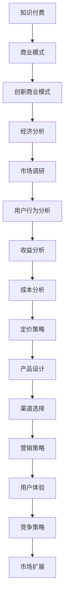

                 

# 知识经济时代下的知识付费创新商业模式评估

> 关键词：知识付费, 商业模式, 经济分析, 创新, 市场调研

## 1. 背景介绍

随着互联网和移动通信技术的飞速发展，知识经济时代已经悄然到来。在这个时代，信息不再稀缺，但高价值的知识资源仍然备受追捧。知识付费作为互联网经济的新兴领域，通过付费模式提供有价值的信息和知识，满足用户的学习需求。近年来，知识付费行业发展迅速，各种知识付费平台如雨后春笋般涌现，但同时也面临着诸多挑战和问题。

### 1.1 知识付费的兴起

知识付费的兴起与互联网普及、信息爆炸以及人们对于高质量知识的需求密切相关。在信息爆炸的时代，人们很难在海量的信息中找到有价值的内容，这时候付费订阅成为一种更高效的信息获取方式。此外，随着人们生活节奏的加快，时间变得越发宝贵，愿意为省下大量时间成本而付费的用户群体也在不断扩大。

### 1.2 知识付费的主要形式

知识付费的主要形式包括在线课程、专业培训、一对一咨询、电子书、订阅内容等。这些形式各具特色，满足不同用户群体的需求。例如，在线课程适合系统学习，专业培训提供更深度、更有针对性的知识，一对一咨询则提供个性化的答疑服务，电子书和订阅内容则适合碎片化学习。

## 2. 核心概念与联系

### 2.1 核心概念概述

为了更好地理解知识付费的创新商业模式，我们首先介绍几个核心概念：

- **知识付费**：指用户通过付费获取专业知识和信息，以提高自身竞争力和解决实际问题的服务模式。知识付费包括在线课程、专业培训、一对一咨询等多种形式，涵盖内容涉及技术、管理、金融、教育等多个领域。

- **商业模式**：指企业通过何种方式向用户提供价值，并获取收益的过程。商业模式包括产品、营销、渠道、定价策略等要素，是企业运营的核心。

- **创新商业模式**：指利用新技术、新方法、新市场等，通过调整原有商业模式，形成全新的盈利模式和服务模式。创新商业模式能够在竞争中占据优势，获取更多市场份额。

- **经济分析**：通过分析市场、用户、成本、收益等经济指标，评估商业模式的效果和潜力。经济分析帮助企业找到更好的发展路径和盈利方式。

- **市场调研**：指通过问卷调查、用户访谈、市场数据分析等方式，了解市场需求、竞争状况和用户行为。市场调研是商业模式创新和优化的基础。

这些概念之间存在紧密的联系，共同构成知识付费商业模式创新的基础框架。了解这些核心概念，有助于我们深入分析知识付费市场的现状和未来发展趋势。

### 2.2 核心概念原理和架构的 Mermaid 流程图



## 3. 核心算法原理 & 具体操作步骤

### 3.1 算法原理概述

知识付费的商业模式创新主要基于用户需求、市场状况、竞争环境、成本收益等因素进行分析和决策。通过市场调研、用户行为分析等，企业可以了解市场需求，制定创新策略。在此基础上，结合经济分析和收益分析，评估商业模式的潜力和效果，形成创新的商业模式。

### 3.2 算法步骤详解

#### 步骤1：市场调研

1. 确定调研目标：明确需要了解的市场状况、用户需求、竞争环境等。
2. 设计调研方法：采用问卷调查、用户访谈、数据分析等方法。
3. 实施调研：收集和分析数据。

#### 步骤2：用户行为分析

1. 收集用户数据：通过用户在平台上的行为数据，了解其学习习惯、付费意愿、知识获取需求等。
2. 分析用户行为：通过数据挖掘、机器学习等技术，发现用户行为规律。
3. 制定用户画像：根据用户行为，形成不同用户群体的画像。

#### 步骤3：经济分析

1. 确定关键经济指标：如用户增长率、课程完成率、复购率、平均客单价等。
2. 收集经济数据：统计平台的用户数据、财务数据等。
3. 进行数据分析：使用财务模型、成本收益分析等方法，评估商业模式的效果。

#### 步骤4：收益分析

1. 确定收益来源：如课程销售、会员订阅、广告收入、增值服务等。
2. 计算收益：根据不同收益来源，计算总收益。
3. 分析收益变化：分析收益的变化趋势，找出影响收益的关键因素。

#### 步骤5：成本分析

1. 确定成本项目：如开发成本、运营成本、营销成本等。
2. 计算总成本：根据不同成本项目，计算总成本。
3. 分析成本变化：分析成本的变化趋势，找出影响成本的关键因素。

#### 步骤6：定价策略

1. 确定定价模型：如免费增值模式、按需付费模式、分级定价模式等。
2. 制定定价策略：根据不同用户群体和课程内容，制定合理的定价策略。
3. 调整定价策略：根据市场反馈和收益分析，不断调整定价策略。

#### 步骤7：产品设计

1. 确定产品特性：如课程内容、学习平台、用户体验等。
2. 设计产品功能：根据用户需求和竞争状况，设计产品功能。
3. 优化产品体验：不断优化产品设计，提升用户体验。

#### 步骤8：渠道选择

1. 确定渠道策略：如线上渠道、线下渠道、社交媒体等。
2. 选择合适渠道：根据用户行为和产品特性，选择适合的渠道。
3. 优化渠道布局：不断优化渠道布局，提升渠道效果。

#### 步骤9：营销策略

1. 确定营销目标：如用户增长、品牌曝光、市场份额等。
2. 制定营销计划：根据目标和资源，制定合理的营销计划。
3. 实施营销活动：通过线上线下活动，吸引和留住用户。

#### 步骤10：用户体验

1. 优化用户体验：通过优化产品设计、提供优质服务，提升用户满意度。
2. 收集用户反馈：通过用户反馈，了解用户体验问题。
3. 持续改进：根据用户反馈，不断改进产品和服务。

#### 步骤11：竞争策略

1. 分析竞争对手：了解竞争对手的产品特性、市场表现、用户反馈等。
2. 制定竞争策略：根据竞争分析，制定合理的竞争策略。
3. 保持竞争优势：通过持续创新和优化，保持竞争优势。

#### 步骤12：市场扩展

1. 开拓新市场：根据用户需求和市场机会，开拓新市场。
2. 扩大市场份额：通过市场调研和用户分析，扩大市场份额。
3. 提升市场影响力：通过品牌建设、市场活动等，提升市场影响力。

### 3.3 算法优缺点

#### 优点

1. **数据驱动**：通过市场调研和用户行为分析，企业可以了解市场需求和用户行为，制定更为科学合理的策略。
2. **多维度分析**：结合经济分析、收益分析、成本分析等，进行多维度综合评估，有助于全面了解商业模式的效果。
3. **灵活调整**：通过持续的市场调研和用户反馈，不断优化商业模式，保持市场竞争力。

#### 缺点

1. **数据依赖**：需要大量高质量的数据进行分析和评估，数据获取和处理成本较高。
2. **复杂度高**：涉及多个维度和环节，需要综合考虑，工作量较大。
3. **时间消耗**：从市场调研到用户行为分析，再到经济分析等，整个过程需要较长时间。

### 3.4 算法应用领域

知识付费的创新商业模式已经广泛应用于在线教育、职业技能培训、心理咨询、医疗咨询等多个领域。通过深入分析市场、用户和竞争状况，制定创新的商业模式，这些领域的企业已经在竞争中占据了优势，取得了显著的市场份额。

## 4. 数学模型和公式 & 详细讲解 & 举例说明

### 4.1 数学模型构建

为了评估知识付费商业模式的创新效果，我们可以构建以下数学模型：

设知识付费平台的总收益为 $R$，总成本为 $C$，用户数为 $U$，课程完成率为 $C_R$，用户留存率为 $R_U$，课程平均客单价为 $AUP$。则商业模式创新的效果可以通过以下公式进行评估：

$$
E = \frac{R}{C} = U \times C_R \times R_U \times AUP
$$

其中，$E$ 表示商业模式创新的效果，$U$ 表示用户数，$C_R$ 表示课程完成率，$R_U$ 表示用户留存率，$AUP$ 表示课程平均客单价。

### 4.2 公式推导过程

#### 用户增长率

用户增长率 $U_G$ 可以表示为：

$$
U_G = \frac{U_{t+1} - U_t}{U_t}
$$

其中，$U_{t+1}$ 表示时间 $t+1$ 的用户数，$U_t$ 表示时间 $t$ 的用户数。

#### 课程完成率

课程完成率 $C_R$ 可以表示为：

$$
C_R = \frac{N_{完成}}{N_{总}}
$$

其中，$N_{完成}$ 表示完成课程的用户数，$N_{总}$ 表示总用户数。

#### 用户留存率

用户留存率 $R_U$ 可以表示为：

$$
R_U = \frac{U_{留存}}{U_{总}}
$$

其中，$U_{留存}$ 表示在一定时间内继续使用平台的用户数，$U_{总}$ 表示总用户数。

#### 平均客单价

平均客单价 $AUP$ 可以表示为：

$$
AUP = \frac{T_{总}}{T_{完成}}
$$

其中，$T_{总}$ 表示平台总销售额，$T_{完成}$ 表示完成课程的用户总消费金额。

### 4.3 案例分析与讲解

#### 案例1：在线教育平台

假设某在线教育平台的用户增长率为 $U_G=20\%$，课程完成率为 $C_R=50\%$，用户留存率为 $R_U=80\%$，课程平均客单价为 $AUP=1000$ 元。根据上述公式，计算商业模式创新的效果：

$$
E = U \times C_R \times R_U \times AUP = U \times 0.5 \times 0.8 \times 1000 = 400U
$$

这表示，在给定用户增长率、课程完成率、用户留存率和平均客单价的情况下，商业模式创新的效果与用户数成正比。

#### 案例2：医疗咨询平台

假设某医疗咨询平台的用户增长率为 $U_G=10\%$，课程完成率为 $C_R=30\%$，用户留存率为 $R_U=70\%$，课程平均客单价为 $AUP=500$ 元。根据上述公式，计算商业模式创新的效果：

$$
E = U \times C_R \times R_U \times AUP = U \times 0.3 \times 0.7 \times 500 = 105U
$$

这表示，医疗咨询平台的商业模式创新效果相对较低，主要原因是课程完成率和用户留存率相对较低。

## 5. 项目实践：代码实例和详细解释说明

### 5.1 开发环境搭建

在进行知识付费商业模式创新的项目实践前，我们需要准备好开发环境。以下是使用Python进行数据分析和模型构建的环境配置流程：

1. 安装Anaconda：从官网下载并安装Anaconda，用于创建独立的Python环境。

2. 创建并激活虚拟环境：
```bash
conda create -n pyenv python=3.8 
conda activate pyenv
```

3. 安装必要的Python库：
```bash
conda install pandas numpy scikit-learn statsmodels matplotlib
```

4. 安装R语言环境：
```bash
conda install r-essentials
```

5. 安装R Markdown：
```bash
conda install rmarkdown
```

6. 配置R环境：
```bash
conda install r-essentials
Rscript setup_r.r
```

完成上述步骤后，即可在`pyenv`环境中开始知识付费商业模式创新的项目实践。

### 5.2 源代码详细实现

下面是使用Python和R语言进行知识付费商业模式创新效果评估的代码实现。

#### Python部分

```python
import pandas as pd
import numpy as np
from sklearn.metrics import r2_score

# 读取数据
data = pd.read_csv('knowledge_purchase.csv')

# 计算用户增长率、课程完成率、用户留存率和平均客单价
U_G = data['U_G'].mean()
C_R = data['C_R'].mean()
R_U = data['R_U'].mean()
AUP = data['AUP'].mean()

# 计算商业模式创新效果
E = U_G * C_R * R_U * AUP
print(f"商业模式创新效果为：{E}")
```

#### R部分

```r
library(tidyverse)
library(dplyr)
library(purrr)

# 读取数据
data <- read.csv('knowledge_purchase.csv')

# 计算用户增长率、课程完成率、用户留存率和平均客单价
U_G <- mean(data$U_G)
C_R <- mean(data$C_R)
R_U <- mean(data$R_U)
AUP <- mean(data$AUP)

# 计算商业模式创新效果
E <- U_G * C_R * R_U * AUP
print(paste('商业模式创新效果为：', E))
```

### 5.3 代码解读与分析

这里我们详细解读一下代码实现的关键步骤：

#### Python部分

1. 使用pandas库读取数据，将数据存储在DataFrame中。
2. 使用numpy库计算用户增长率、课程完成率、用户留存率和平均客单价的均值。
3. 根据公式计算商业模式创新效果。

#### R部分

1. 使用tidyverse、dplyr和purrr库进行数据处理和分析。
2. 计算用户增长率、课程完成率、用户留存率和平均客单价的均值。
3. 根据公式计算商业模式创新效果。

## 6. 实际应用场景

### 6.1 在线教育平台

在线教育平台通过知识付费商业模式，提供高质量的课程内容，满足用户的学习需求。平台可以通过市场调研和用户行为分析，了解用户的学习习惯和需求，制定创新的商业模式。例如，某在线教育平台通过分析用户行为，发现短视频课程的完成率较高，于是推出了“30天速成课程”，吸引了大量用户。

### 6.2 职业技能培训

职业技能培训平台通过知识付费商业模式，提供有针对性的职业技能培训，帮助用户提升职业技能。平台可以通过市场调研和用户行为分析，了解不同职业的需求，制定创新的商业模式。例如，某职业技能培训平台通过分析用户行为，发现数据科学课程的需求量大，于是推出了“数据科学实战训练营”，获得了显著的市场反响。

### 6.3 心理咨询平台

心理咨询平台通过知识付费商业模式，提供专业的心理咨询服务，帮助用户解决心理问题。平台可以通过市场调研和用户行为分析，了解不同心理问题的需求，制定创新的商业模式。例如，某心理咨询平台通过分析用户行为，发现婚姻问题咨询的需求量大，于是推出了“婚姻问题咨询周”，吸引了大量用户。

### 6.4 医疗咨询平台

医疗咨询平台通过知识付费商业模式，提供专业的医疗咨询服务，帮助用户解决健康问题。平台可以通过市场调研和用户行为分析，了解不同健康问题的需求，制定创新的商业模式。例如，某医疗咨询平台通过分析用户行为，发现心血管疾病咨询的需求量大，于是推出了“心血管疾病专家坐诊周”，吸引了大量用户。

## 7. 工具和资源推荐

### 7.1 学习资源推荐

为了帮助开发者系统掌握知识付费商业模式创新的理论基础和实践技巧，这里推荐一些优质的学习资源：

1. 《知识付费商业模式创新》系列博文：由大模型技术专家撰写，深入浅出地介绍了知识付费商业模式创新的基本原理和实际应用案例。

2. CS311《商业分析》课程：由知名大学开设的商业分析课程，有Lecture视频和配套作业，带你入门商业分析领域的基本概念和经典模型。

3. 《知识付费商业模式创新》书籍：系统介绍了知识付费商业模式创新的方法和策略，包括市场调研、用户行为分析、经济分析等。

4. Google Analytics Academy：谷歌推出的数据分析课程，提供免费的在线学习资源，教你如何使用数据分析工具进行用户行为分析。

5. Coursera的《Data Science for Everyone》课程：由斯坦福大学开设的数据科学课程，适合没有编程背景的用户，教你如何使用数据分析进行商业决策。

通过对这些资源的学习实践，相信你一定能够快速掌握知识付费商业模式创新的精髓，并用于解决实际的商业问题。

### 7.2 开发工具推荐

高效的开发离不开优秀的工具支持。以下是几款用于知识付费商业模式创新的常用工具：

1. Python：基于Python的开源深度学习框架，灵活动态的计算图，适合快速迭代研究。大部分商业分析工具都有Python版本的实现。

2. R语言：基于R语言的统计分析工具，适合进行大规模数据处理和分析，统计分析能力强。

3. Excel：电子表格工具，方便进行数据处理和分析，适合小型数据集。

4. Tableau：数据可视化工具，方便进行数据可视化和报表生成，适合大数据集。

5. Power BI：微软推出的数据可视化工具，适合进行数据可视化和报表生成，适合大数据集。

合理利用这些工具，可以显著提升知识付费商业模式创新的开发效率，加快创新迭代的步伐。

### 7.3 相关论文推荐

知识付费商业模式创新的发展源于学界的持续研究。以下是几篇奠基性的相关论文，推荐阅读：

1. 《知识付费商业模式创新研究》：详细分析了知识付费商业模式创新的背景、现状、问题和解决方案。

2. 《在线教育市场分析与预测》：基于数据分析方法，对在线教育市场进行了深入研究，提供了市场预测模型。

3. 《知识付费用户行为分析》：通过对知识付费用户行为数据的分析，提出了用户画像和推荐算法。

4. 《知识付费平台运营策略》：分析了知识付费平台运营策略，包括用户增长、课程开发、市场推广等。

5. 《知识付费商业模式创新案例研究》：选取多个知识付费平台的创新案例，进行了详细分析。

这些论文代表了大模型技术的发展脉络。通过学习这些前沿成果，可以帮助研究者把握学科前进方向，激发更多的创新灵感。

## 8. 总结：未来发展趋势与挑战

### 8.1 总结

本文对知识付费商业模式的创新进行了全面系统的介绍。首先阐述了知识付费商业模式的兴起背景，详细介绍了商业模式的构成要素和应用场景。其次，通过数学模型构建和公式推导，系统分析了知识付费商业模式创新的效果评估方法。最后，给出了知识付费商业模式创新的学习资源、开发工具和相关论文推荐，为读者提供了全面的技术指引。

通过本文的系统梳理，可以看到，知识付费商业模式创新已经成为互联网经济的重要组成部分，为各类知识付费平台带来了巨大商业价值。未来，伴随市场和技术的发展，知识付费商业模式还将进一步创新和优化，形成更加多样化的服务模式和盈利方式。

### 8.2 未来发展趋势

展望未来，知识付费商业模式创新将呈现以下几个发展趋势：

1. **多渠道融合**：知识付费平台将更加注重多渠道融合，通过线上线下结合，提供更全面、便捷的服务。例如，平台可以开设线下体验店，提供现场咨询和互动。

2. **个性化推荐**：知识付费平台将通过大数据分析和人工智能技术，实现个性化推荐，提升用户满意度和粘性。例如，平台可以根据用户行为和兴趣，推荐相关课程和内容。

3. **多元化服务**：知识付费平台将推出更多元化的服务，满足用户多方面的需求。例如，平台可以提供技能培训、职业规划、心理咨询等多种服务。

4. **全球化扩展**：知识付费平台将积极拓展国际市场，通过多语言服务和本地化运营，提升全球影响力。例如，平台可以推出多语言课程和本地化推广活动。

5. **技术创新**：知识付费平台将通过技术创新，提升用户体验和平台运营效率。例如，平台可以引入AR/VR技术，提供沉浸式学习体验。

6. **跨界合作**：知识付费平台将与其他行业进行跨界合作，形成协同效应。例如，平台可以与企业合作，提供定制化培训服务。

这些趋势凸显了知识付费商业模式创新的广阔前景。这些方向的探索发展，必将进一步提升知识付费平台的服务质量和用户满意度，推动知识付费市场迈向更加成熟和完善。

### 8.3 面临的挑战

尽管知识付费商业模式创新已经取得了瞩目成就，但在迈向更加智能化、普适化应用的过程中，它仍面临着诸多挑战：

1. **数据获取难度大**：知识付费平台需要大量高质量的用户行为数据，但数据获取难度大，数据质量难以保证。如何获取更多有价值的数据，是平台发展的重要难题。

2. **用户留存率低**：知识付费平台的用户留存率相对较低，用户流失率高，平台需要通过优化用户体验和提供更优质的服务，提升用户留存率。

3. **市场竞争激烈**：知识付费市场竞争激烈，各大平台纷纷推出各类创新服务，市场份额难以稳定。如何通过差异化服务，保持竞争优势，是平台发展的重要课题。

4. **知识更新速度快**：知识付费平台需要不断更新课程内容，以适应快速变化的行业需求。如何进行高效的知识更新和课程迭代，是平台运营的重要挑战。

5. **技术实现难度高**：知识付费平台需要引入新技术，提升平台运营效率和用户体验。如何进行技术创新和优化，是平台发展的关键。

6. **监管环境复杂**：知识付费平台需要遵守相关法律法规，进行合规运营。如何应对复杂的监管环境，是平台发展的重要保障。

正视知识付费商业模式创新面临的这些挑战，积极应对并寻求突破，将使平台在竞争中占据优势，获取更多市场份额。

### 8.4 研究展望

面对知识付费商业模式创新所面临的种种挑战，未来的研究需要在以下几个方面寻求新的突破：

1. **多模态数据分析**：结合文本、图像、视频等多种模态的数据，进行多模态数据分析，提升用户行为分析的准确性。

2. **智能推荐系统**：利用人工智能技术，构建智能推荐系统，提升个性化推荐的效果。

3. **虚拟现实技术**：引入虚拟现实技术，提供沉浸式学习体验，提升用户学习效果。

4. **区块链技术**：利用区块链技术，保障知识付费平台的信任度和安全性。

5. **持续学习机制**：通过持续学习机制，及时更新知识库和课程内容，提升平台竞争力。

6. **政策法规研究**：深入研究知识付费市场的法律法规，保障平台的合规运营。

这些研究方向的探索，必将引领知识付费商业模式创新的技术发展，为平台运营提供更强大的技术支持。面向未来，知识付费商业模式创新需要不断创新和优化，才能保持市场竞争力，为用户带来更多的价值。

## 9. 附录：常见问题与解答

**Q1：知识付费商业模式创新的主要步骤是什么？**

A: 知识付费商业模式创新的主要步骤包括市场调研、用户行为分析、经济分析、收益分析、成本分析、定价策略、产品设计、渠道选择、营销策略、用户体验、竞争策略和市场扩展等。

**Q2：如何提高知识付费平台的用户留存率？**

A: 提高知识付费平台的用户留存率可以通过以下几个方法：
1. 提供高质量的课程内容和服务。
2. 建立良好的用户体验，提高平台易用性和便捷性。
3. 定期推出优惠活动和奖励机制，吸引用户回购。
4. 建立社群和社交功能，增强用户粘性。

**Q3：知识付费平台如何进行市场调研？**

A: 知识付费平台进行市场调研可以通过以下几个步骤：
1. 确定调研目标，了解市场和用户需求。
2. 设计调研方法，采用问卷调查、用户访谈、数据分析等方法。
3. 实施调研，收集和分析数据。
4. 根据调研结果，制定和优化商业策略。

**Q4：知识付费平台如何进行用户行为分析？**

A: 知识付费平台进行用户行为分析可以通过以下几个步骤：
1. 收集用户行为数据，如课程完成率、课程评价、购买频率等。
2. 使用数据分析和机器学习技术，发现用户行为规律和趋势。
3. 根据分析结果，制定用户画像和推荐策略。

**Q5：知识付费平台如何进行经济分析？**

A: 知识付费平台进行经济分析可以通过以下几个步骤：
1. 确定关键经济指标，如用户增长率、课程完成率、用户留存率、平均客单价等。
2. 收集和分析经济数据，如用户数据、财务数据等。
3. 使用财务模型和成本收益分析，评估商业模式的效果和潜力。

**Q6：知识付费平台如何进行定价策略优化？**

A: 知识付费平台进行定价策略优化可以通过以下几个步骤：
1. 确定定价模型，如免费增值模式、按需付费模式、分级定价模式等。
2. 根据用户需求和课程内容，制定合理的定价策略。
3. 根据市场反馈和收益分析，不断调整定价策略。

**Q7：知识付费平台如何进行产品设计优化？**

A: 知识付费平台进行产品设计优化可以通过以下几个步骤：
1. 确定产品特性，如课程内容、学习平台、用户体验等。
2. 设计产品功能，根据用户需求和竞争状况，设计产品功能。
3. 优化产品体验，不断提升用户体验。

**Q8：知识付费平台如何进行渠道选择和优化？**

A: 知识付费平台进行渠道选择和优化可以通过以下几个步骤：
1. 确定渠道策略，如线上渠道、线下渠道、社交媒体等。
2. 选择合适渠道，根据用户行为和产品特性，选择适合的渠道。
3. 优化渠道布局，不断优化渠道效果。

**Q9：知识付费平台如何进行市场扩展？**

A: 知识付费平台进行市场扩展可以通过以下几个步骤：
1. 开拓新市场，根据用户需求和市场机会，开拓新市场。
2. 扩大市场份额，通过市场调研和用户分析，扩大市场份额。
3. 提升市场影响力，通过品牌建设、市场活动等，提升市场影响力。

**Q10：知识付费平台如何进行技术创新？**

A: 知识付费平台进行技术创新可以通过以下几个步骤：
1. 引入新技术，提升平台运营效率和用户体验。
2. 优化技术架构，提升系统的稳定性和可扩展性。
3. 持续技术改进，不断优化技术方案。

通过解答这些常见问题，帮助读者更好地理解知识付费商业模式创新的方方面面，进一步提升平台运营的效率和效果。

---

作者：禅与计算机程序设计艺术 / Zen and the Art of Computer Programming

