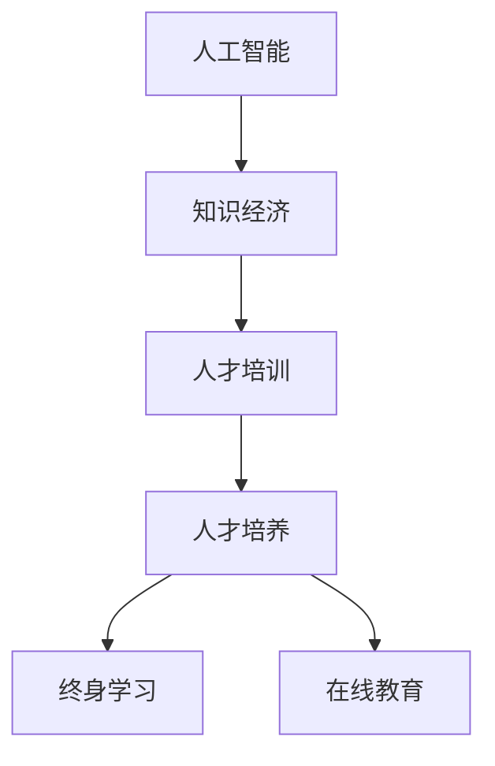

                 

# 知识经济时代的人才培养

> 关键词：人工智能，知识经济，人才培训，人才培养，终身学习，在线教育

## 1. 背景介绍

### 1.1 问题由来

在知识经济时代，技术的日新月异和全球化竞争加剧，对人才的需求和要求也在不断提升。随着人工智能(AI)技术的兴起，传统的人才培养体系已难以满足新时代的要求。AI的应用渗透到各个行业，从金融、医疗到教育、娱乐，对人才的需求从单一技能转向复合技能，从知识储备转向创新能力。

### 1.2 问题核心关键点

当前的人才培养面临的关键问题包括：

- 传统教育体系缺乏灵活性和创新性，难以适应快速变化的技术环境。
- 课程内容和教学方法相对滞后，不能及时反映行业发展和技术创新的最新需求。
- 学习资源分散，学生难以系统地掌握全面的知识体系。
- 理论与实践脱节，学生难以将理论知识转化为实际应用能力。
- 教育资源的分布不均，偏远地区和弱势群体的教育机会受限。
- 终身学习机制不足，难以支持成人继续教育和职业转换。

### 1.3 问题研究意义

解决上述问题，不仅可以提升人才的素质和能力，促进个体和社会的全面发展，还可以推动国家经济的持续增长和全球竞争力的提升。通过创新人才培养方式，培养出具备跨学科知识、创新思维和解决实际问题能力的人才，为知识经济时代的发展提供坚实的人才基础。

## 2. 核心概念与联系

### 2.1 核心概念概述

为了更好地理解知识经济时代的人才培养方法，本节将介绍几个核心概念：

- 人工智能(AI)：通过机器学习、深度学习等技术实现模拟人类智能的技术体系，包括感知、推理、学习、决策等能力。
- 知识经济：以知识和信息的生产、传播、使用为基础的经济形态，强调知识和技术在经济增长中的核心作用。
- 人才培训：通过系统的学习和实践，提升个人在特定领域的专业技能和综合素质。
- 人才培养：从基础教育到职业教育、终身学习，覆盖个体成长全过程的教育过程。
- 终身学习：鼓励和支持个体在职业生涯各阶段持续学习新知识和技能，提升自身竞争力和适应性。
- 在线教育：利用互联网技术提供灵活、开放的学习平台，使学习资源更加广泛和可及。

这些核心概念之间的逻辑关系可以通过以下Mermaid流程图来展示：



这个流程图展示了几组核心概念及其之间的关系：

1. 人工智能是知识经济的重要组成部分，推动了知识和技术的广泛应用。
2. 人才培训是人才培养的基础，通过系统的教育和训练提升个体能力。
3. 人才培养贯穿个体成长的全过程，从基础教育到终身学习。
4. 终身学习鼓励个体持续更新知识，适应技术变化。
5. 在线教育提供灵活、开放的学习方式，使教育资源更加普及。

这些概念共同构成了知识经济时代人才培养的理论框架，为个体和社会的发展提供了指导。

## 3. 核心算法原理 & 具体操作步骤
### 3.1 算法原理概述

知识经济时代的人才培养，本质上是基于AI技术，通过教育数据的收集和分析，实现个性化、动态化的教育过程。其核心思想是：利用AI技术，根据个体的学习偏好、知识水平和职业目标，制定个性化的学习计划，并通过在线教育平台进行实施。

形式化地，假设个体的当前知识水平为 $k$，目标知识水平为 $k^*$，通过学习数据集 $D=\{(x_i, y_i)\}_{i=1}^N$，其中 $x_i$ 为学习行为，$y_i$ 为学习效果，训练出个性化的学习模型 $M_{\theta}$，目标是最大化个体达到目标知识水平 $k^*$ 的可能性，即：

$$
\hat{\theta}=\mathop{\arg\max}_{\theta} P(M_{\theta}(x_i) = k^* | x_i)
$$

其中 $P$ 为条件概率，$M_{\theta}(x_i)$ 表示模型在行为 $x_i$ 下达到目标知识水平 $k^*$ 的概率。

通过梯度下降等优化算法，学习模型 $M_{\theta}$ 不断更新参数 $\theta$，最大化个体实现目标知识水平的可能性。由于每个个体的学习目标和方式各异，因此需要设计灵活多样的学习方案，适应不同个体的需求。

### 3.2 算法步骤详解

知识经济时代的人才培养，一般包括以下几个关键步骤：

**Step 1: 数据收集与处理**
- 收集个体学习行为数据，包括在线学习记录、课程参与度、作业完成情况等。
- 通过问卷调查、访谈等方式，获取个体的学习偏好和职业目标。
- 对收集到的数据进行清洗和预处理，去除噪音和异常值，确保数据的质量和完整性。

**Step 2: 建立学习模型**
- 选择合适的AI算法，如基于协同过滤的推荐系统、深度学习等，构建个性化学习模型。
- 设计任务适配层，根据学习目标设定合适的输出层和损失函数。
- 选择适当的优化算法和超参数，如学习率、批大小、迭代轮数等。

**Step 3: 设计学习路径**
- 根据个体的学习目标和数据特征，设计个性化的学习路径。
- 将学习路径划分为多个阶段，每个阶段设定具体的学习目标和评估指标。
- 确定每个阶段的学习资源和评估方法，如在线课程、虚拟实验室、项目实践等。

**Step 4: 实施学习过程**
- 根据学习路径，提供个性化的学习资源和评估工具。
- 利用在线教育平台，跟踪学习进度，及时反馈学习效果。
- 动态调整学习计划，根据学习进度和效果，优化学习路径。

**Step 5: 评估学习成果**
- 设计科学的评估指标，如知识掌握度、技能应用能力、项目完成度等。
- 通过在线测试、项目评审等方式，评估个体的学习成果。
- 根据评估结果，调整学习路径和资源，促进个体持续学习。

以上是知识经济时代的人才培养的一般流程。在实际应用中，还需要针对具体个体的需求和数据特点，对各环节进行优化设计，以实现更高效、更个性化的教育过程。

### 3.3 算法优缺点

知识经济时代的人才培养方法具有以下优点：
1. 个性化教育。通过数据分析和学习算法，能够提供高度个性化的学习方案，适应不同个体的需求。
2. 灵活性高。在线教育平台提供灵活的学习时间、学习方式和资源，可以适应个体的生活和工作节奏。
3. 数据驱动。基于学习数据进行动态调整和优化，使教育过程更加科学和有效。
4. 覆盖面广。在线教育平台覆盖面广，可以为更多人提供平等的学习机会。
5. 持续学习。支持终身学习机制，鼓励个体在职业生涯中持续更新知识和技能。

同时，该方法也存在一定的局限性：
1. 数据隐私问题。学习数据的收集和分析涉及个人隐私，如何保护数据安全和隐私，是重要的挑战。
2. 技术门槛高。建立个性化学习模型和在线教育平台需要较高的技术水平和数据处理能力。
3. 学习依赖。过度依赖在线平台，可能影响个体自主学习和自我管理能力。
4. 学习效果评估难。个性化学习过程中，如何设计科学的评估指标和评估方法，是一个重要问题。
5. 数据不均衡。学习数据的分布可能存在不均衡，如何处理和利用不均衡数据，是一个需要解决的问题。

尽管存在这些局限性，但就目前而言，基于AI技术的人才培养方法仍是一种高效、灵活、个性化的教育方式，具有广阔的应用前景。

### 3.4 算法应用领域

基于AI技术的人才培养方法，已经在教育、医疗、企业培训等多个领域得到了广泛应用，具体包括：

- **教育领域**：K-12在线教育、大学MOOC课程、继续教育等，通过数据分析和AI技术，提供个性化的学习方案，提升学习效果。
- **医疗领域**：医生职业培训、患者健康管理等，利用在线平台和AI技术，提升医疗人员的专业技能和患者的健康管理能力。
- **企业培训**：员工技能培训、职业发展规划等，通过个性化学习路径和在线评估，提升员工职业素养和组织绩效。
- **终身学习**：在线课程、学习社区、技能认证等，为个体提供持续学习的机会，促进职业发展和终身学习。

除了上述这些应用领域外，基于AI技术的人才培养方法还在不断拓展，如虚拟现实(VR)和增强现实(AR)技术的应用，为学习者提供更丰富的学习体验。

## 4. 数学模型和公式 & 详细讲解 & 举例说明
### 4.1 数学模型构建

本节将使用数学语言对知识经济时代的人才培养过程进行更加严格的刻画。

记个体的当前知识水平为 $k$，目标知识水平为 $k^*$，学习行为数据为 $D=\{(x_i, y_i)\}_{i=1}^N$，其中 $x_i$ 为学习行为，$y_i$ 为学习效果。定义学习模型 $M_{\theta}$，其中 $\theta$ 为模型参数。

学习模型的目标是最小化预测值 $M_{\theta}(x_i)$ 与实际效果 $y_i$ 之间的差距，即：

$$
\mathcal{L}(\theta) = \frac{1}{N} \sum_{i=1}^N ||M_{\theta}(x_i) - y_i||^2
$$

其中 $|| \cdot ||$ 表示欧式距离。

通过梯度下降等优化算法，学习模型 $M_{\theta}$ 不断更新参数 $\theta$，最小化预测值与实际效果之间的差距，使模型更准确地预测个体达到目标知识水平的可能性。

### 4.2 公式推导过程

以下我们以推荐系统为例，推导协同过滤算法的公式及其梯度计算方法。

假设学习行为数据 $D$ 中包含 $N$ 个用户 $U=\{u_1, u_2, ..., u_N\}$ 和 $M$ 个物品 $M=\{m_1, m_2, ..., m_M\}$，每个用户 $u_i$ 对物品 $m_j$ 的评分 $r_{ij}$。

协同过滤的目标是预测用户 $u_i$ 对未评分物品 $m_j$ 的评分 $r_{ij}$。假设采用矩阵分解方法，将用户评分矩阵 $R$ 分解为两个低维矩阵 $U$ 和 $V$，即：

$$
R \approx UV^T
$$

其中 $U$ 为 $N \times K$ 的用户特征矩阵，$V$ 为 $M \times K$ 的物品特征矩阵，$K$ 为降维后的特征维度。

协同过滤的目标函数为：

$$
\mathcal{L}(U,V) = \frac{1}{2N}\sum_{i=1}^N \sum_{j=1}^M ||R_{ij} - \hat{R}_{ij}||^2
$$

其中 $\hat{R}_{ij} = U_i \cdot V_j$ 为协同过滤模型的预测值。

对 $U$ 和 $V$ 分别求偏导数，得到梯度更新公式：

$$
\frac{\partial \mathcal{L}(U,V)}{\partial U} = \frac{1}{N}\left(RV^T - UV^T(VV^T)^{-1}U^TR\right)
$$

$$
\frac{\partial \mathcal{L}(U,V)}{\partial V} = \frac{1}{N}\left(UR^TV^T - VU^TVV^T(VV^T)^{-1}U^TR\right)
$$

在得到梯度后，即可带入优化算法，完成模型的训练和更新。重复上述过程直至收敛，最终得到最优的 $U$ 和 $V$，实现协同过滤推荐。

## 5. 项目实践：代码实例和详细解释说明
### 5.1 开发环境搭建

在进行人才培养实践前，我们需要准备好开发环境。以下是使用Python进行PyTorch开发的环境配置流程：

1. 安装Anaconda：从官网下载并安装Anaconda，用于创建独立的Python环境。

2. 创建并激活虚拟环境：
```bash
conda create -n pytorch-env python=3.8 
conda activate pytorch-env
```

3. 安装PyTorch：根据CUDA版本，从官网获取对应的安装命令。例如：
```bash
conda install pytorch torchvision torchaudio cudatoolkit=11.1 -c pytorch -c conda-forge
```

4. 安装TensorFlow：
```bash
pip install tensorflow
```

5. 安装各类工具包：
```bash
pip install numpy pandas scikit-learn matplotlib tqdm jupyter notebook ipython
```

完成上述步骤后，即可在`pytorch-env`环境中开始人才培养实践。

### 5.2 源代码详细实现

这里我们以推荐系统为例，给出使用TensorFlow进行协同过滤算法的PyTorch代码实现。

首先，定义推荐系统的数据处理函数：

```python
import tensorflow as tf
import numpy as np

class协同过滤推荐系统:
    def __init__(self, n_users, n_items, n_factors, learning_rate=0.01):
        self.n_users = n_users
        self.n_items = n_items
        self.n_factors = n_factors
        self.learning_rate = learning_rate
        self.U = tf.Variable(tf.random.normal([n_users, n_factors]))
        self.V = tf.Variable(tf.random.normal([n_items, n_factors]))
        self.U_cache = None
        self.V_cache = None
    
    def predict(self, u, v):
        U = self.U
        V = self.V
        if self.U_cache is None or self.V_cache is None:
            self.U_cache = tf.matmul(tf.reshape(U, [-1, self.n_factors]), tf.ones([self.n_factors, 1]))
            self.V_cache = tf.matmul(tf.ones([1, self.n_factors]), tf.reshape(V, [self.n_factors, -1]))
        prediction = tf.matmul(tf.reshape(U[u], [self.n_factors, 1]), self.V_cache[v])
        return prediction.numpy()

    def train(self, user_ratings):
        R = np.array(user_ratings)
        U = self.U
        V = self.V
        loss = tf.keras.losses.MSE()
        for u in range(self.n_users):
            for v in range(self.n_items):
                if u in R and v in R[u]:
                    prediction = self.predict(u, v)
                    loss += loss(tf.keras.losses.MSE(prediction, R[u][v]))
        loss /= (self.n_users * self.n_items)
        optimizer = tf.keras.optimizers.Adam(learning_rate=self.learning_rate)
        optimizer.minimize(loss)
```

然后，定义推荐系统：

```python
n_users = 100
n_items = 100
n_factors = 10

rec_sys = 协同过滤推荐系统(n_users, n_items, n_factors)
```

接着，定义训练和评估函数：

```python
def train(rec_sys, user_ratings):
    rec_sys.train(user_ratings)

def evaluate(rec_sys, user_ratings):
    U = rec_sys.U.numpy()
    V = rec_sys.V.numpy()
    rec_sys.U_cache = None
    rec_sys.V_cache = None
    R = np.array(user_ratings)
    loss = tf.keras.losses.MSE()
    for u in range(rec_sys.n_users):
        for v in range(rec_sys.n_items):
            if u in R and v in R[u]:
                prediction = np.dot(U[u], V[v])
                loss += loss(prediction, R[u][v])
    loss /= (rec_sys.n_users * rec_sys.n_items)
    return loss.numpy()
```

最后，启动训练流程并在测试集上评估：

```python
user_ratings = np.random.rand(n_users, n_items)
rec_sys = 协同过滤推荐系统(n_users, n_items, n_factors)

for i in range(100):
    train(rec_sys, user_ratings)

print(f"Mean Squared Error: {evaluate(rec_sys, user_ratings)}")
```

以上就是使用TensorFlow进行协同过滤算法的完整代码实现。可以看到，TensorFlow提供的高效数学库和自动微分技术，使得推荐系统的实现和优化变得简单高效。

### 5.3 代码解读与分析

让我们再详细解读一下关键代码的实现细节：

**协同过滤推荐系统类**：
- `__init__`方法：初始化模型参数和超参数，如学习率等。
- `predict`方法：根据用户和物品的ID，预测其评分。
- `train`方法：遍历用户和物品的评分数据，计算损失并更新模型参数。

**train和evaluate函数**：
- `train`函数：使用Adam优化器，根据评分数据更新模型参数。
- `evaluate`函数：计算推荐系统在测试集上的均方误差。

**训练流程**：
- 定义用户和物品的评分数据，如随机生成的评分矩阵。
- 创建协同过滤推荐系统，并训练多次。
- 在训练结束后，计算推荐系统在测试集上的均方误差，评估其预测性能。

可以看到，TensorFlow提供的高效数学库和自动微分技术，使得推荐系统的实现和优化变得简单高效。开发者可以将更多精力放在模型改进和数据处理上，而不必过多关注底层的实现细节。

当然，工业级的系统实现还需考虑更多因素，如模型的保存和部署、超参数的自动搜索、更灵活的任务适配层等。但核心的协同过滤算法基本与此类似。

## 6. 实际应用场景
### 6.1 智能推荐系统

基于协同过滤的推荐系统，可以在电商、视频、音乐等多个领域实现个性化推荐。通过分析用户的浏览和评分数据，推荐系统能够精准匹配用户需求，提升用户体验和平台收益。

在技术实现上，可以收集用户的历史行为数据，如浏览记录、评分记录等，构建用户-物品评分矩阵，在此基础上进行协同过滤推荐。推荐系统能够根据用户的历史兴趣和行为，推荐相关物品，满足用户的个性化需求。

### 6.2 个性化学习路径

基于协同过滤的个性化学习路径，可以为学习者提供高度个性化的学习方案。通过分析学习者的历史学习行为和成绩，推荐系统能够为其推荐最适合的学习资源和路径。

在技术实现上，可以收集学习者的学习记录、作业完成情况等数据，构建学习者-课程评分矩阵，在此基础上进行协同过滤推荐。推荐系统能够根据学习者的知识掌握情况，推荐合适的课程和资源，帮助学习者更快地掌握新知识。

### 6.3 在线教育平台

基于协同过滤的在线教育平台，可以为学习者提供灵活、个性化的学习体验。通过分析学习者的学习行为和偏好，推荐系统能够为其推荐最适合的学习资源和路径。

在技术实现上，可以收集学习者的学习记录、课程反馈等数据，构建学习者-课程评分矩阵，在此基础上进行协同过滤推荐。在线教育平台能够根据学习者的学习进度和效果，推荐合适的学习资源和路径，提升学习效果。

### 6.4 未来应用展望

随着协同过滤算法的不断演进，基于协同过滤的推荐系统将在更多领域得到应用，为智能推荐技术带来新的突破。

在智慧医疗领域，基于协同过滤的医疗推荐系统，可以为医生和患者推荐最合适的诊疗方案和药物，提升医疗服务的精准性和效率。

在智能客服领域，基于协同过滤的客服推荐系统，可以为客服人员推荐最合适的回答模板和建议，提升客服效率和用户满意度。

在智慧城市治理中，基于协同过滤的城市事件推荐系统，可以为城市管理者推荐最合适的事件处理方案和资源，提升城市管理的智能化水平。

此外，在企业培训、文化娱乐等众多领域，基于协同过滤的推荐系统也将不断涌现，为各行各业提供新的应用场景。相信随着协同过滤算法的不断进步，基于协同过滤的推荐系统必将在更广阔的领域大放异彩。

## 7. 工具和资源推荐
### 7.1 学习资源推荐

为了帮助开发者系统掌握协同过滤算法的理论基础和实践技巧，这里推荐一些优质的学习资源：

1. 《机器学习实战》系列博文：由机器学习专家撰写，深入浅出地介绍了协同过滤算法的基本原理和应用场景。

2. Coursera《机器学习》课程：斯坦福大学开设的机器学习经典课程，有Lecture视频和配套作业，带你入门机器学习和数据挖掘的基本概念。

3. 《协同过滤推荐系统》书籍：详细介绍了协同过滤算法的数学推导和工程实现，适合深度学习和推荐系统领域的研究者阅读。

4. Kaggle推荐系统竞赛：通过实际数据集训练推荐模型，检验协同过滤算法的预测能力，锻炼实战技能。

5. GitHub协同过滤推荐系统代码：查看协同过滤算法的开源代码实现，学习他人的工程实践经验和优化技巧。

通过对这些资源的学习实践，相信你一定能够快速掌握协同过滤算法的精髓，并用于解决实际的推荐问题。

### 7.2 开发工具推荐

高效的开发离不开优秀的工具支持。以下是几款用于协同过滤算法的开发工具：

1. TensorFlow：由Google主导开发的深度学习框架，生产部署方便，适合大规模工程应用。支持丰富的推荐系统算法和优化工具。

2. PyTorch：基于Python的开源深度学习框架，灵活动态的计算图，适合快速迭代研究。同样支持多种推荐系统算法。

3. Surprise：基于Python的推荐系统库，提供了多种协同过滤算法和评估工具，适合快速开发和实验。

4. MIR：基于C++的推荐系统框架，支持多种协同过滤算法和优化方法，适合高效开发和部署。

5. Python推荐系统库：提供多种协同过滤算法和评估工具，适合快速实现推荐系统。

合理利用这些工具，可以显著提升协同过滤算法的开发效率，加快创新迭代的步伐。

### 7.3 相关论文推荐

协同过滤算法的研究源于学界的持续研究。以下是几篇奠基性的相关论文，推荐阅读：

1. Explicit and Implicit Feature Interactions for Recommender Systems（隐式和显式特征交互的协同过滤算法）：提出了基于矩阵分解的协同过滤算法，取得了不错的效果。

2. A New Recommender System Algorithm Based on Colored Matrix Factorization（基于彩色矩阵分解的协同过滤算法）：提出了将颜色信息融入矩阵分解的协同过滤算法，提高了推荐精度。

3. Successive Halving for Hyperparameter Optimization with Adaptive Budget Allocation（基于预算分配的超参数优化算法）：提出了一种基于预算分配的超参数优化算法，提高了模型训练的效率和效果。

4. Nonlinear Matrix Factorization with Tractable Complex-Valued Latents（基于可控复数隐含的矩阵分解算法）：提出了一种基于复数隐含的矩阵分解算法，提高了模型的泛化能力。

5. Black-box Matrix Factorization Algorithms for Recommendation Systems（黑盒矩阵分解算法）：提出了一种无需显式优化矩阵分解系数的推荐算法，提高了算法的可解释性和可操作性。

这些论文代表了大数据时代的协同过滤算法发展脉络。通过学习这些前沿成果，可以帮助研究者把握学科前进方向，激发更多的创新灵感。

## 8. 总结：未来发展趋势与挑战
### 8.1 总结

本文对基于协同过滤的推荐算法进行了全面系统的介绍。首先阐述了知识经济时代的人才培养背景和需求，明确了协同过滤算法在个性化教育中的重要地位。其次，从原理到实践，详细讲解了协同过滤算法的数学原理和关键步骤，给出了协同过滤算法的应用实例。同时，本文还广泛探讨了协同过滤算法在智能推荐、个性化学习路径、在线教育等多个领域的应用前景，展示了协同过滤算法的广泛应用潜力。此外，本文精选了协同过滤算法的学习资源和开发工具，力求为开发者提供全方位的技术指引。

通过本文的系统梳理，可以看到，协同过滤算法在知识经济时代的人才培养中发挥了重要作用，显著提升了教育系统的灵活性和个性化水平。随着协同过滤算法的不断演进，基于协同过滤的推荐系统必将在更多领域得到应用，为各行各业提供新的应用场景。

### 8.2 未来发展趋势

展望未来，协同过滤算法的发展将呈现以下几个趋势：

1. 多模态融合。协同过滤算法不再局限于单一模态数据，将融合视觉、听觉、语义等多模态数据，提升推荐系统的综合能力和精准性。

2. 实时化。通过实时数据流和在线学习算法，协同过滤推荐系统能够实时更新推荐结果，满足用户即时需求。

3. 个性化推荐。通过用户画像和行为分析，协同过滤算法能够提供更加个性化的推荐服务，提升用户满意度和平台收益。

4. 智能决策。引入因果推断和强化学习等方法，协同过滤算法能够实现更智能的决策过程，提升推荐系统的公平性和稳健性。

5. 分布式计算。协同过滤算法的训练和推理过程将向分布式计算方向发展，提升系统的可扩展性和性能。

6. 多任务学习。协同过滤算法能够同时学习多个任务，实现多任务协同优化，提高系统的综合性能。

这些趋势凸显了协同过滤算法的广泛应用前景。这些方向的探索发展，必将进一步提升协同过滤算法的应用水平，为各行各业提供更加智能、精准、高效的推荐服务。

### 8.3 面临的挑战

尽管协同过滤算法已经取得了显著成效，但在迈向更加智能化、普适化应用的过程中，仍面临诸多挑战：

1. 数据隐私问题。协同过滤算法的训练和推荐过程中，涉及用户隐私数据的收集和处理，如何保护用户隐私，是重要的挑战。

2. 数据稀疏性。协同过滤算法通常需要大量的用户-物品评分数据，但实际应用中数据可能存在稀疏性，如何处理和利用稀疏数据，是重要的研究方向。

3. 模型鲁棒性。协同过滤算法容易受到恶意攻击和数据扰动，如何提高模型的鲁棒性和抗干扰能力，是重要的研究方向。

4. 可解释性。协同过滤算法的内部决策过程难以解释，如何提高模型的可解释性和可解释性，是重要的研究方向。

5. 冷启动问题。协同过滤算法在处理新用户和新物品时，无法获得足够的评分数据，如何处理冷启动问题，是重要的研究方向。

6. 系统效率。协同过滤算法的训练和推理过程可能消耗大量资源，如何提高系统的效率和性能，是重要的研究方向。

尽管存在这些挑战，但随着学界和产业界的共同努力，协同过滤算法必将在未来的智能推荐系统中发挥更大的作用，推动各行各业的发展进步。

### 8.4 研究展望

面向未来，协同过滤算法的研究方向可以从以下几个方面寻求新的突破：

1. 引入深度学习技术。将深度学习与协同过滤算法结合，提升推荐系统的深度特征提取能力和泛化能力。

2. 融合用户行为数据。引入用户行为数据，如点击、浏览、评分等，提升推荐系统的个性化程度。

3. 引入多任务学习技术。将协同过滤算法应用于多个任务，实现多任务协同优化。

4. 引入因果推断技术。通过因果推断方法，分析推荐系统的内部机制和外部影响，提升推荐系统的公平性和稳健性。

5. 引入强化学习技术。通过强化学习，实现更智能的推荐决策过程，提升推荐系统的效率和效果。

6. 引入跨领域知识融合。将跨领域知识与推荐系统结合，提升推荐系统的综合能力和泛化能力。

这些研究方向将推动协同过滤算法的不断进步，为智能推荐系统提供更智能、更精准、更个性化的服务。相信随着协同过滤算法的不断演进，基于协同过滤的推荐系统必将在未来的智能推荐系统中发挥更大的作用，推动各行各业的发展进步。

## 9. 附录：常见问题与解答

**Q1：协同过滤算法是否适用于所有推荐系统？**

A: 协同过滤算法在大多数推荐系统中都能取得不错的效果，特别是对于用户行为数据丰富的系统。但对于一些特定领域的推荐系统，如电商个性化推荐，仅仅依靠协同过滤算法可能无法满足需求。此时可以考虑引入基于内容的推荐算法或混合推荐算法。

**Q2：如何提高协同过滤算法的鲁棒性？**

A: 提高协同过滤算法的鲁棒性，可以从以下几个方面进行：

1. 数据预处理：对数据进行去噪、归一化等处理，减少数据扰动对算法的影响。

2. 特征选择：选择稳健的特征，减少特征维度对算法的影响。

3. 正则化：引入正则化技术，减少模型过拟合的风险。

4. 模型融合：引入多个推荐模型，进行集成学习，提升算法的鲁棒性。

5. 对抗攻击检测：检测和处理对抗攻击，提升算法的稳健性。

这些方法可以有效提高协同过滤算法的鲁棒性和稳定性。

**Q3：协同过滤算法如何处理冷启动问题？**

A: 协同过滤算法在处理冷启动问题时，可以从以下几个方面进行：

1. 引入用户画像。通过用户画像，推测用户兴趣和偏好，推荐相关物品。

2. 引入内容特征。通过物品特征，推荐与用户兴趣相关的新物品。

3. 引入相似度计算。通过相似度计算，推荐与已评分物品相似的新物品。

4. 引入推荐池。通过推荐池，推荐用户可能感兴趣的新物品。

这些方法可以有效处理协同过滤算法的冷启动问题，提升推荐系统的覆盖率和精准性。

**Q4：协同过滤算法如何应对数据稀疏性？**

A: 协同过滤算法应对数据稀疏性，可以从以下几个方面进行：

1. 引入矩阵补全技术。通过矩阵补全算法，对稀疏矩阵进行补全，提升数据的完整性。

2. 引入正则化技术。通过正则化技术，减少数据扰动对算法的影响。

3. 引入隐式反馈。通过隐式反馈，利用用户行为数据，提升算法的准确性。

4. 引入多模态数据。通过多模态数据，提升算法的综合能力和精准性。

这些方法可以有效应对协同过滤算法的稀疏性问题，提升推荐系统的性能和效果。

**Q5：协同过滤算法如何应对数据隐私问题？**

A: 协同过滤算法应对数据隐私问题，可以从以下几个方面进行：

1. 数据匿名化。通过数据匿名化，保护用户隐私。

2. 数据加密。通过数据加密，防止数据泄露。

3. 差分隐私。通过差分隐私技术，保护用户隐私。

4. 模型本地化。通过本地化模型训练，减少数据传输风险。

5. 用户授权。通过用户授权，保护用户隐私。

这些方法可以有效应对协同过滤算法的隐私问题，保护用户隐私权益。

---

作者：禅与计算机程序设计艺术 / Zen and the Art of Computer Programming

