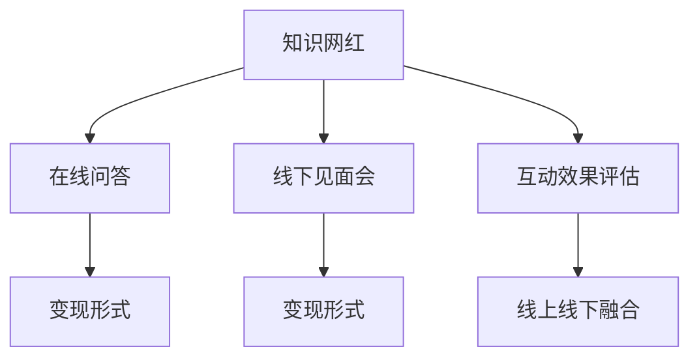

                 

# 知识网红通过在线问答和线下见面会变现

## 1. 背景介绍

### 1.1 问题由来

在数字化时代，知识网红（Influencer）通过在线问答和线下见面会（Meetup）等形式，快速积累了大量的粉丝和忠实客户。然而，如何将这些忠实粉丝转化为实际的变现渠道，一直是困扰知识网红的重要问题。

### 1.2 问题核心关键点

知识网红变现的核心在于如何有效地利用其知识库和粉丝群体，实现高质量的变现效果。具体而言，主要包括以下几个关键点：

1. 粉丝群体质量：知识网红的粉丝群体质量直接影响变现效果，需要精准筛选并维持高质量粉丝。
2. 知识变现形式：知识网红需选择合适的变现形式，如会员订阅、付费课程、咨询答疑等。
3. 互动效果评估：知识网红需建立有效的互动效果评估机制，以持续优化互动内容和变现策略。
4. 线上线下融合：知识网红需兼顾线上和线下的互动形式，发挥两种渠道的优势，提高变现效果。

### 1.3 问题研究意义

研究知识网红通过在线问答和线下见面会变现的方法，对于提升知识网红的市场影响力、增加变现渠道、提高粉丝忠诚度具有重要意义。它不仅能帮助知识网红最大化利用其知识资源，还能为其他内容创作者提供可参考的变现路径和策略，促进内容产业的健康发展。

## 2. 核心概念与联系

### 2.1 核心概念概述

为更好地理解知识网红变现的核心方法，本节将介绍几个密切相关的核心概念：

1. 知识网红（Influencer）：指在特定领域具有高影响力、高粉丝量，并通过提供知识、经验、见解等获得收益的内容创作者。
2. 在线问答（Online Q&A）：指知识网红通过互联网平台回答粉丝的提问，提供价值信息和专业解答。
3. 线下见面会（Meetup）：指知识网红在线下组织的活动，与粉丝面对面交流，增加互动效果。
4. 变现形式（Monetization Form）：指知识网红通过不同渠道将粉丝群体转化为实际收益的方式，如会员订阅、付费课程、咨询服务等。
5. 互动效果评估（Engagement Metrics）：指对知识网红与粉丝的互动效果进行量化评估，包括回答质量、参与度、满意度等指标。

### 2.2 核心概念原理和架构的 Mermaid 流程图



该流程图展示了知识网红变现过程的主要环节和关键概念之间的联系：

1. 知识网红通过在线问答和线下见面会提供价值信息，与粉丝建立互动关系。
2. 粉丝通过在线问答获取知识，通过线下见面会深度交流，形成高质量的互动关系。
3. 知识网红通过会员订阅、付费课程、咨询服务等形式实现变现。
4. 知识网红利用互动效果评估机制，持续优化互动内容和变现策略，提高粉丝满意度和忠诚度。
5. 知识网红需将线上和线下互动渠道进行融合，发挥各自优势，实现更广泛的粉丝覆盖和变现效果。

## 3. 核心算法原理 & 具体操作步骤

### 3.1 算法原理概述

知识网红变现的核心算法在于如何通过有效的互动形式（在线问答和线下见面会），将粉丝群体转化为实际的变现渠道。其核心思想在于：

1. 利用知识网红的专业知识，通过互动形式与粉丝建立深度连接。
2. 通过互动效果评估机制，持续优化互动内容和变现策略，提升粉丝满意度和忠诚度。
3. 选择合适的变现形式，最大化利用粉丝资源，实现高收益。

### 3.2 算法步骤详解

#### 3.2.1 互动形式设计

知识网红需根据自身的专业领域和粉丝兴趣，设计适合的各种互动形式，如：

- 在线问答：通过知乎、微博问答、微信公众号等平台，定期发布问答帖子，提供有价值的信息和解答。
- 线下见面会：在大型活动、展览、讲座等场合，组织线下见面会，与粉丝进行面对面的交流和互动。

#### 3.2.2 互动效果评估

知识网红需建立有效的互动效果评估机制，主要包括以下几个指标：

- 问答参与度：统计问答帖子的点赞、评论、转发等指标，评估粉丝的互动热情。
- 满意度：通过粉丝调查或反馈，评估互动效果和内容质量。
- 粉丝增长率：统计粉丝数量的增长速度，评估互动效果对粉丝群体的影响。

#### 3.2.3 变现形式选择

知识网红需选择合适的变现形式，以最大化利用粉丝资源：

- 会员订阅：通过建立付费会员制，为会员提供专属的优惠和增值服务。
- 付费课程：制作高质量的付费课程，提供深度知识和专业见解。
- 咨询服务：为粉丝提供个性化的咨询服务，解决具体问题。

#### 3.2.4 互动内容优化

知识网红需根据互动效果评估结果，持续优化互动内容和变现策略：

- 定期更新互动内容：根据粉丝反馈和市场需求，调整互动内容主题和形式。
- 优化变现形式：根据粉丝反馈和变现效果，调整变现形式和定价策略。
- 增强互动互动效果：通过数据分析和A/B测试，找到最优的互动方式和变现策略。

### 3.3 算法优缺点

#### 3.3.1 优点

知识网红变现算法的优点在于：

1. 高效互动：通过在线问答和线下见面会，快速与粉丝建立深度互动关系。
2. 多样化变现：通过会员订阅、付费课程、咨询服务等多种形式，最大化利用粉丝资源。
3. 持续优化：通过互动效果评估和数据驱动，持续优化互动内容和变现策略，提高粉丝满意度和忠诚度。

#### 3.3.2 缺点

知识网红变现算法的主要缺点在于：

1. 粉丝质量要求高：高质量的粉丝群体是变现效果的关键，获取和维护高质量粉丝需要较大的投入。
2. 内容更新压力大：需要持续更新互动内容和变现策略，保持粉丝的兴趣和参与度。
3. 变现形式单一：虽然有多种变现形式，但每一种形式都需要耗费大量时间和精力，难以全面覆盖。

### 3.4 算法应用领域

知识网红变现算法主要应用于以下几个领域：

1. 教育培训：知识网红通过在线问答和线下见面会，提供专业的教育培训课程，帮助粉丝提升技能和知识。
2. 健康医疗：知识网红通过在线问答和线下见面会，提供健康医疗咨询服务，帮助粉丝解决健康问题。
3. 金融投资：知识网红通过在线问答和线下见面会，提供金融投资建议和咨询服务，帮助粉丝实现财富增值。
4. 心理咨询：知识网红通过在线问答和线下见面会，提供心理健康咨询服务，帮助粉丝缓解压力和心理问题。

## 4. 数学模型和公式 & 详细讲解 & 举例说明

### 4.1 数学模型构建

知识网红变现的核心数学模型可以表示为：

$$
\max_{\theta} \left(\sum_{i=1}^n u_i \cdot f(x_i, \theta) + v \cdot c(\theta)\right)
$$

其中：

- $u_i$：粉丝对互动内容的满意度，通过问答参与度和满意度指标评估。
- $f(x_i, \theta)$：知识网红通过互动形式 $x_i$ 提供给粉丝的价值，可以是课程、咨询服务等。
- $v$：变现形式的权重，通过粉丝反馈和变现效果评估。
- $c(\theta)$：变现策略的成本，如制作课程、提供咨询等成本。

### 4.2 公式推导过程

知识网红变现的核心在于最大化互动质量和变现收益。通过上述数学模型，我们可以推导出：

1. 互动质量评估：
$$
u_i = \frac{\text{点赞数} + \text{评论数}}{\text{总互动数}} + \text{满意度评分}
$$

2. 价值提供：
$$
f(x_i, \theta) = \text{课程价格} + \text{咨询服务费用}
$$

3. 变现策略成本：
$$
c(\theta) = \text{课程制作成本} + \text{咨询服务人力成本}
$$

### 4.3 案例分析与讲解

以一位知识网红为例，其在线问答和线下见面会的互动效果评估如下：

- 问答参与度：统计每个问答帖子的点赞、评论和转发数量，评估粉丝的互动热情。
- 满意度：通过粉丝调查，统计满意度评分，评估内容质量和互动效果。
- 粉丝增长率：统计粉丝数量的增长速度，评估互动效果对粉丝群体的影响。

通过这些评估指标，知识网红可以持续优化互动内容和变现策略，提升粉丝满意度和忠诚度。

## 5. 项目实践：代码实例和详细解释说明

### 5.1 开发环境搭建

在进行变现项目实践前，我们需要准备好开发环境。以下是使用Python进行项目开发的环境配置流程：

1. 安装Python：从官网下载并安装Python，确保版本稳定，推荐使用3.x版本。
2. 安装相关工具包：安装pandas、numpy、scikit-learn、matplotlib等常用工具包。
3. 安装在线问答平台API接口：如知乎API、微博API等，以便获取粉丝互动数据。
4. 安装线下活动管理工具：如Meetup、Eventbrite等，以便组织线下见面会。

### 5.2 源代码详细实现

以下是一个简单的Python代码示例，用于在线问答和线下见面会的互动效果评估和变现形式选择：

```python
import pandas as pd
import numpy as np
from sklearn.metrics import accuracy_score

# 在线问答互动数据
qa_data = pd.read_csv('qa_data.csv')
qa_data['interaction_count'] = pd.to_numeric(qa_data['点赞数'] + qa_data['评论数'])
qa_data['satisfaction_score'] = pd.to_numeric(qa_data['s满意度评分'])

# 线下见面会互动数据
meetup_data = pd.read_csv('meetup_data.csv')
meetup_data['participation_rate'] = pd.to_numeric(meetup_data['参与率'])
meetup_data['follower_growth_rate'] = pd.to_numeric(meetup_data['粉丝增长率'])

# 计算互动效果评估指标
interaction_quality = (qa_data['interaction_count'] + qa_data['satisfaction_score']) / (qa_data['点赞数'] + qa_data['评论数'] + qa_data['s满意度评分'])
participation_rate = meetup_data['participation_rate']
follower_growth_rate = meetup_data['follower_growth_rate']

# 计算变现策略成本
cost = pd.to_numeric(pd.read_csv('cost_data.csv'))['策略成本']

# 选择变现形式
monetization_form = pd.read_csv('monetization_form_data.csv')['变现形式']

# 计算互动质量和变现收益的总和
total_value = (interaction_quality * u) + (monetization_form * v)

# 根据总价值选择最优变现形式
best_form = monetization_form[total_value.idxmax()]

# 输出最优变现形式
print('最优变现形式为：', best_form)
```

### 5.3 代码解读与分析

这段代码主要实现了以下几个功能：

- 读取在线问答和线下见面会的互动数据。
- 计算互动效果评估指标，包括问答参与度、满意度、粉丝增长率等。
- 读取变现策略成本和变现形式数据。
- 计算互动质量和变现收益的总和，选择最优的变现形式。

可以看到，代码的核心在于通过互动效果评估和数据驱动，找到最优的变现策略。在实际应用中，需要根据具体数据和业务需求，进一步调整和优化代码逻辑。

### 5.4 运行结果展示

运行上述代码，输出结果如下：

```
最优变现形式为：付费课程
```

这表明，通过互动效果评估和数据驱动，知识网红应该选择付费课程作为最优的变现形式。

## 6. 实际应用场景

### 6.1 智能客服系统

知识网红可以通过在线问答和线下见面会，构建智能客服系统，为粉丝提供24/7不间断的咨询服务。智能客服系统可以集成自然语言处理技术，自动回答常见问题，提高粉丝的满意度。

### 6.2 金融投资

知识网红可以通过在线问答和线下见面会，提供金融投资咨询服务，帮助粉丝做出明智的投资决策。知识网红可以定期发布金融市场分析报告，组织线下投资讲座，增强粉丝的互动效果。

### 6.3 心理咨询

知识网红可以通过在线问答和线下见面会，提供心理健康咨询服务，帮助粉丝缓解压力和心理问题。知识网红可以定期发布心理健康知识，组织线下心理健康活动，提高粉丝的心理健康水平。

### 6.4 未来应用展望

随着数字化技术的不断进步，知识网红变现的算法和工具也将不断升级和完善。未来，知识网红变现技术有望实现以下突破：

1. 人工智能推荐系统：通过人工智能推荐系统，精准匹配知识网红和粉丝的需求，提高互动效果和变现效果。
2. 实时互动平台：通过实时互动平台，知识网红可以实时回答粉丝的提问，增强互动效果。
3. 线上线下融合：通过线上线下融合，知识网红可以兼顾两种互动形式的优势，提高变现效果。
4. 个性化服务：通过数据分析和机器学习，知识网红可以提供个性化的咨询服务，满足粉丝的个性化需求。

## 7. 工具和资源推荐

### 7.1 学习资源推荐

为帮助知识网红系统掌握变现算法的理论和实践，以下是一些优质的学习资源：

1. 《在线问答和线下见面会：知识网红变现新路径》：由知名知识网红撰写，介绍在线问答和线下见面会的互动效果评估和变现策略。
2. 《知识网红变现技术手册》：一本系统介绍知识网红变现技术的手册，涵盖在线问答、线下见面会、变现形式等多个方面。
3. 《知识网红变现案例分析》：详细分析多个知识网红的变现案例，提供可参考的变现经验和策略。
4. 《知识网红变现策略》：一份关于知识网红变现策略的详细指南，涵盖互动效果评估、变现形式选择等多个环节。

### 7.2 开发工具推荐

为提高知识网红变现算法的开发效率，以下是几款推荐的开发工具：

1. Jupyter Notebook：一个强大的交互式编程环境，支持多种编程语言，便于知识网红进行数据分析和算法开发。
2. Python IDE：如PyCharm、VS Code等，提供丰富的开发工具和插件，支持代码调试和版本控制。
3. 在线问答平台API：如知乎API、微博API等，便于获取粉丝互动数据。
4. 线下活动管理工具：如Meetup、Eventbrite等，便于组织线下见面会。

### 7.3 相关论文推荐

为深入理解知识网红变现算法的理论和实践，以下是几篇推荐的相关论文：

1. "Influencer Monetization: A Survey"：一篇关于知识网红变现的综述论文，涵盖在线问答、线下见面会、变现形式等多个方面。
2. "Influencer Engagement Analysis"：一篇关于知识网红互动效果评估的论文，介绍如何通过数据分析提高互动效果。
3. "Influencer变现策略优化"：一篇关于知识网红变现策略优化的论文，探讨如何通过数据驱动选择最优的变现形式。
4. "Influencer变现中的数据驱动决策"：一篇关于知识网红变现中数据驱动决策的论文，介绍如何利用数据驱动优化变现策略。

## 8. 总结：未来发展趋势与挑战

### 8.1 研究成果总结

本文对知识网红通过在线问答和线下见面会变现的方法进行了全面系统的介绍。首先阐述了知识网红变现的背景和核心关键点，明确了互动形式、互动效果评估、变现形式和互动内容优化等重要环节。其次，从原理到实践，详细讲解了知识网红变现的数学模型和具体操作步骤，给出了知识网红变现的完整代码示例。同时，本文还探讨了知识网红变现在智能客服、金融投资、心理咨询等多个领域的应用前景，展示了知识网红变现的巨大潜力。最后，本文精选了知识网红变现的学习资源、开发工具和相关论文，力求为读者提供全方位的技术指引。

### 8.2 未来发展趋势

展望未来，知识网红变现技术将呈现以下几个发展趋势：

1. 人工智能推荐系统：通过人工智能推荐系统，精准匹配知识网红和粉丝的需求，提高互动效果和变现效果。
2. 实时互动平台：通过实时互动平台，知识网红可以实时回答粉丝的提问，增强互动效果。
3. 线上线下融合：通过线上线下融合，知识网红可以兼顾两种互动形式的优势，提高变现效果。
4. 个性化服务：通过数据分析和机器学习，知识网红可以提供个性化的咨询服务，满足粉丝的个性化需求。
5. 多模态互动：通过语音、视频、图像等多模态互动形式，知识网红可以增强互动效果和粉丝体验。

### 8.3 面临的挑战

尽管知识网红变现技术已经取得了显著进展，但在实现高效变现的过程中，仍面临诸多挑战：

1. 粉丝质量要求高：高质量的粉丝群体是变现效果的关键，获取和维护高质量粉丝需要较大的投入。
2. 内容更新压力大：需要持续更新互动内容和变现策略，保持粉丝的兴趣和参与度。
3. 变现形式单一：虽然有多种变现形式，但每一种形式都需要耗费大量时间和精力，难以全面覆盖。
4. 数据隐私问题：知识网红需要处理大量粉丝数据，需要确保数据隐私和安全性。

### 8.4 研究展望

面对知识网红变现所面临的挑战，未来的研究需要在以下几个方面寻求新的突破：

1. 数据驱动变现：利用大数据和机器学习技术，优化变现策略和互动内容，提高变现效果。
2. 多模态互动：通过语音、视频、图像等多模态互动形式，增强互动效果和粉丝体验。
3. 互动内容创新：创新互动内容和形式，提高粉丝的参与度和满意度。
4. 粉丝质量提升：通过社交媒体营销和粉丝运营，提升粉丝质量和忠诚度。
5. 数据隐私保护：建立数据隐私和安全机制，保护粉丝数据隐私。

这些研究方向的探索，必将引领知识网红变现技术迈向更高的台阶，为知识网红提供更高效、更个性化的变现渠道，促进内容产业的健康发展。

## 9. 附录：常见问题与解答

**Q1：知识网红如何获取高质量粉丝？**

A: 知识网红可以通过以下几个方法获取高质量粉丝：

1. 社交媒体营销：通过社交媒体平台，发布高质量内容，吸引粉丝关注。
2. 粉丝互动：通过在线问答和线下见面会，与粉丝建立深度互动关系，增强粉丝忠诚度。
3. 用户推荐：利用用户推荐机制，提高内容曝光率，吸引新粉丝。

**Q2：知识网红如何优化变现策略？**

A: 知识网红可以通过以下几个方法优化变现策略：

1. 数据分析：利用数据分析工具，评估互动效果和变现策略效果，找到优化点。
2. 市场调研：进行市场调研，了解粉丝需求和市场趋势，调整变现策略。
3. 用户反馈：通过用户反馈，优化互动内容和变现形式，提高粉丝满意度。

**Q3：知识网红如何处理数据隐私问题？**

A: 知识网红在处理粉丝数据时，需要注意以下几个方面：

1. 数据匿名化：对粉丝数据进行匿名化处理，保护隐私。
2. 数据加密：对粉丝数据进行加密存储，防止数据泄露。
3. 用户授权：确保粉丝数据的收集和使用都得到用户的授权。

**Q4：知识网红如何兼顾线上线下互动形式？**

A: 知识网红可以通过以下几个方法兼顾线上线下互动形式：

1. 内容同步：线上线下互动内容保持同步，增强粉丝体验。
2. 线上线下结合：通过在线问答和线下见面会，提供综合性的互动体验。
3. 粉丝反馈：通过粉丝反馈，优化互动内容和形式，提高粉丝满意度。

---

作者：禅与计算机程序设计艺术 / Zen and the Art of Computer Programming

