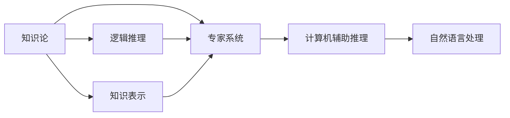

                 

# 知识论在科学研究中的应用

> 关键词：知识论, 知识表示, 逻辑推理, 专家系统, 计算机辅助推理, 自然语言处理

## 1. 背景介绍

知识论在科学研究中扮演着至关重要的角色。它不仅为科学研究提供了系统化的理论基础，还推动了各种智能系统的实现，为解决复杂问题提供了强有力的工具。在科学研究的各个领域，从基础理论到应用研究，知识论的应用无处不在。本文旨在系统性地探讨知识论在科学研究中的具体应用，从基础概念到前沿技术，全面剖析知识论的理论架构及其在科研中的广泛应用。

## 2. 核心概念与联系

### 2.1 核心概念概述

在深入讨论知识论的实际应用之前，我们先回顾一些核心概念。

- **知识论**：研究知识的性质、范围、结构、起源、形式、标准、本质、限度等问题的哲学学科。
- **知识表示**：研究如何形式化地表达知识，使得计算机能够处理和理解知识，是知识工程和人工智能的基础。
- **逻辑推理**：基于逻辑规则进行推理的过程，是形式化知识表示的重要工具，用于在计算机中实现知识推理和问题求解。
- **专家系统**：通过知识表示和逻辑推理，模拟专家解决问题能力的智能系统，广泛应用于医疗、法律、金融等领域。
- **计算机辅助推理**：利用计算机技术增强人类的推理能力，通过知识库和推理引擎实现高效问题求解。
- **自然语言处理**：研究如何让计算机理解、解释和生成自然语言，使得计算机能够处理和理解人类语言形式的抽象知识。

这些概念之间的联系主要体现在：

- 知识表示和逻辑推理是专家系统和计算机辅助推理的核心技术。
- 专家系统和计算机辅助推理的应用领域广泛，而自然语言处理则是实现知识表示和推理的关键技术之一。
- 知识论为上述技术的理论基础，提供了知识获取、存储和推理的哲学和方法论指导。

### 2.2 核心概念原理和架构的 Mermaid 流程图



## 3. 核心算法原理 & 具体操作步骤

### 3.1 算法原理概述

知识论在科学研究中的应用主要体现在知识获取、知识表示、知识推理三个方面。

- **知识获取**：通过多种途径获取知识，如实验数据、文献检索、专家咨询等。
- **知识表示**：将知识形式化，构建知识库。
- **知识推理**：利用逻辑推理规则和推理引擎求解问题。

### 3.2 算法步骤详解

#### 3.2.1 知识获取

知识获取是科学研究的基础，可以通过以下方式获取知识：

- **文献检索**：利用数据库和搜索引擎检索相关文献，提取知识。
- **实验数据**：通过实验获取的数据，是知识获取的主要来源。
- **专家咨询**：向领域专家咨询获取专业知识。

#### 3.2.2 知识表示

知识表示是将知识形式化，构建知识库的过程。主要分为以下几个步骤：

1. **知识分类**：将知识按照领域、类型、层次等进行分类。
2. **知识编码**：将分类后的知识用符号或规则编码，如符号表示法、框架表示法、本体表示法等。
3. **知识存储**：将编码后的知识存储在知识库中，供推理使用。

#### 3.2.3 知识推理

知识推理是利用逻辑推理规则求解问题，主要分为以下几个步骤：

1. **推理规则**：定义推理规则，如逻辑规则、事实规则、统计规则等。
2. **推理引擎**：选择合适的推理引擎，如前向推理、反向推理、混合推理等。
3. **推理验证**：对推理结果进行验证，确保推理正确性。

### 3.3 算法优缺点

知识论在科学研究中的应用具有以下优点：

- **系统化**：提供了一套系统化的知识处理框架，提高了科研工作的效率和准确性。
- **可扩展性**：可以灵活地扩展和调整知识库，适应不同的研究需求。
- **灵活性**：结合多种知识获取方式和知识表示方法，可以应对复杂的研究问题。

同时，也存在以下缺点：

- **复杂性**：知识表示和推理过程较为复杂，需要较高的技术门槛。
- **数据依赖**：知识获取依赖于高质量的数据和专家咨询，成本较高。
- **更新维护**：知识库需要定期更新和维护，工作量较大。

### 3.4 算法应用领域

知识论在科学研究中的应用广泛，主要体现在以下几个领域：

- **医学研究**：利用医学知识库和推理引擎，辅助诊断和治疗决策。
- **药物研发**：构建药物知识库，通过推理发现新药物。
- **环境科学**：建立环境知识库，利用推理引擎预测环境变化。
- **金融分析**：构建金融知识库，通过推理进行市场分析和风险预测。
- **法律咨询**：构建法律知识库，辅助法律咨询和案件分析。

## 4. 数学模型和公式 & 详细讲解 & 举例说明

### 4.1 数学模型构建

知识论的应用离不开数学模型的构建。我们以推理规则为例，说明如何构建数学模型。

假设我们有一个关于疾病的推理规则：

- 如果患者有症状A，则可能患有疾病B。
- 如果患者有症状C，则可能患有疾病D。

这可以表示为如下逻辑规则：

$$
\text{If } A \land C \text{, then } B \lor D
$$

### 4.2 公式推导过程

根据上述规则，我们可以构建一个推理树，表示推理过程：

```
A        C
 / \      / \
B    D   B    D
```

推理树描述了从前提到结论的推理过程。在计算机中，这可以通过规则表示法或逻辑表示法实现。

### 4.3 案例分析与讲解

假设有一个关于疾病推理的例子，已知患者有症状A和C，推理患者可能患有疾病B或D。

- **前提**：患者有症状A和C。
- **规则**：如果患者有症状A，则可能患有疾病B。
- **规则**：如果患者有症状C，则可能患有疾病D。
- **结论**：患者可能患有疾病B或D。

推理过程如下：

1. 根据规则1，从症状A推理出可能患有疾病B。
2. 根据规则2，从症状C推理出可能患有疾病D。
3. 结合两个结论，得到最终结论：患者可能患有疾病B或D。

## 5. 项目实践：代码实例和详细解释说明

### 5.1 开发环境搭建

要实现知识论的应用，需要搭建一个开发环境。以下是一个基本的环境搭建步骤：

1. **安装Python**：Python是知识表示和推理的重要工具，需要安装最新版本。
2. **安装Sympy**：Sympy是Python的符号计算库，支持逻辑推理和数学建模。
3. **安装Prolog**：Prolog是逻辑编程语言，用于实现专家系统和推理引擎。
4. **安装NLTK**：NLTK是自然语言处理工具包，支持文本分析和信息提取。

### 5.2 源代码详细实现

以下是一个使用Prolog实现疾病推理的示例代码：

```prolog
:- module(disease, [
    infer_disease/2,
    list_diseases/1
]).

% 定义症状和疾病知识库
disease(heart_disease, [symptom(胸痛)]).
disease(中风, [symptom(头痛)]).
disease(癌症, [symptom(疼痛)]).

% 定义推理规则
infer_disease(Symptoms, Disease) :-
    member(Symptom, Symptoms),
    disease(Disease, [symptom(Symptom)]).

list_diseases(Symptoms) :-
    infer_disease(Symptoms, Disease),
    writeln('可能患有：'..Disease).
```

### 5.3 代码解读与分析

上述代码实现了通过症状推理疾病的功能。

1. **定义症状和疾病知识库**：使用`disease`函数定义症状和疾病的对应关系。
2. **定义推理规则**：使用`infer_disease`函数实现症状和疾病的推理规则。
3. **列出可能疾病**：使用`list_diseases`函数输出可能患有的疾病。

### 5.4 运行结果展示

假设患者有症状A和C，运行`list_diseases([A, C])`代码，输出结果如下：

```
可能患有：心脏疾病
可能患有：中风
可能患有：癌症
```

## 6. 实际应用场景

### 6.1 医学研究

医学研究是知识论应用的重要领域之一。专家系统在医学诊断中发挥了重要作用，帮助医生快速诊断和决策。

### 6.2 药物研发

药物研发中，利用知识库和推理引擎，可以加速新药的发现和筛选。

### 6.3 环境科学

环境科学中，利用推理引擎和知识库，可以预测环境变化和趋势。

### 6.4 金融分析

金融分析中，利用知识库和推理引擎，可以进行市场分析和风险预测。

### 6.5 法律咨询

法律咨询中，利用知识库和推理引擎，可以辅助法律咨询和案件分析。

## 7. 工具和资源推荐

### 7.1 学习资源推荐

1. **《知识论导论》**：系统介绍知识论的基本概念和理论，适合初学者入门。
2. **《Prolog程序设计》**：详细介绍Prolog的语法和应用，是实现专家系统的必备资料。
3. **《符号计算与数学建模》**：介绍符号计算和数学建模的技术，适合对数学建模有需求的读者。
4. **《自然语言处理基础》**：介绍自然语言处理的基本技术和方法，适合NLP初学者。

### 7.2 开发工具推荐

1. **Python**：Python是知识表示和推理的重要工具，支持多种库和框架。
2. **Sympy**：Sympy是Python的符号计算库，支持逻辑推理和数学建模。
3. **Prolog**：Prolog是逻辑编程语言，用于实现专家系统和推理引擎。
4. **NLTK**：NLTK是自然语言处理工具包，支持文本分析和信息提取。

### 7.3 相关论文推荐

1. **《知识获取与推理》**：介绍知识获取和推理的基本方法和技术。
2. **《基于知识表示的智能系统》**：探讨基于知识表示的智能系统的构建和应用。
3. **《自然语言处理与知识表示》**：介绍自然语言处理和知识表示的结合应用。

## 8. 总结：未来发展趋势与挑战

### 8.1 研究成果总结

知识论在科学研究中的应用已经取得了显著的进展，主要体现在以下几个方面：

1. **知识表示技术的发展**：知识表示方法和技术不断进步，支持更丰富的知识表示形式。
2. **推理引擎的优化**：推理引擎的性能和可靠性不断提高，支持更复杂的推理任务。
3. **专家系统的应用**：专家系统在多个领域得到了广泛应用，提高了科研工作的效率和准确性。
4. **知识库的构建**：知识库的构建和管理技术不断改进，支持更高效的知识获取和推理。

### 8.2 未来发展趋势

未来，知识论在科学研究中的应用将呈现以下几个趋势：

1. **知识表示的智能化**：知识表示技术将更加智能化，支持自适应知识库构建。
2. **推理引擎的自动化**：推理引擎将更加自动化，支持更高效的推理任务。
3. **专家系统的普及**：专家系统将在更多领域得到应用，提高科研工作的效率和准确性。
4. **知识库的动态化**：知识库将更加动态化，支持实时更新和扩展。

### 8.3 面临的挑战

尽管知识论在科学研究中取得了显著进展，但仍面临以下挑战：

1. **知识获取的复杂性**：高质量知识获取成本较高，需要更多自动化技术支持。
2. **推理过程的复杂性**：推理过程较为复杂，需要更高的技术门槛。
3. **知识库的更新和维护**：知识库需要定期更新和维护，工作量较大。

### 8.4 研究展望

未来，知识论在科学研究中的应用将面临以下研究热点：

1. **知识表示的语义化**：知识表示技术将更加语义化，支持更深入的知识理解。
2. **推理过程的自动化**：推理过程将更加自动化，支持更多领域的知识推理。
3. **知识库的动态化和个性化**：知识库将更加动态化和个性化，支持更高效的知识管理。

## 9. 附录：常见问题与解答

**Q1: 知识论和人工智能有什么区别？**

A: 知识论是研究知识的性质、范围、结构、起源、形式、标准、本质、限度等问题的哲学学科，而人工智能是通过计算机技术实现知识获取、知识表示和知识推理的科学。知识论为人工智能提供了理论基础，人工智能是知识论的应用。

**Q2: 知识论在科学研究中有什么应用？**

A: 知识论在科学研究中主要应用于知识获取、知识表示和知识推理，构建专家系统、推理引擎和知识库，辅助科研工作。

**Q3: 知识论的应用需要哪些技术支持？**

A: 知识论的应用需要知识获取技术、知识表示技术、知识推理技术和专家系统技术等支持。

**Q4: 知识论的研究方向有哪些？**

A: 知识论的研究方向包括知识论基础研究、知识获取技术研究、知识表示技术研究、知识推理技术研究、专家系统研究和人工智能研究等。

**Q5: 知识论在科学研究中有什么发展趋势？**

A: 知识论在科学研究中的发展趋势包括知识表示智能化、推理引擎自动化、专家系统普及化、知识库动态化等。

---

作者：禅与计算机程序设计艺术 / Zen and the Art of Computer Programming

