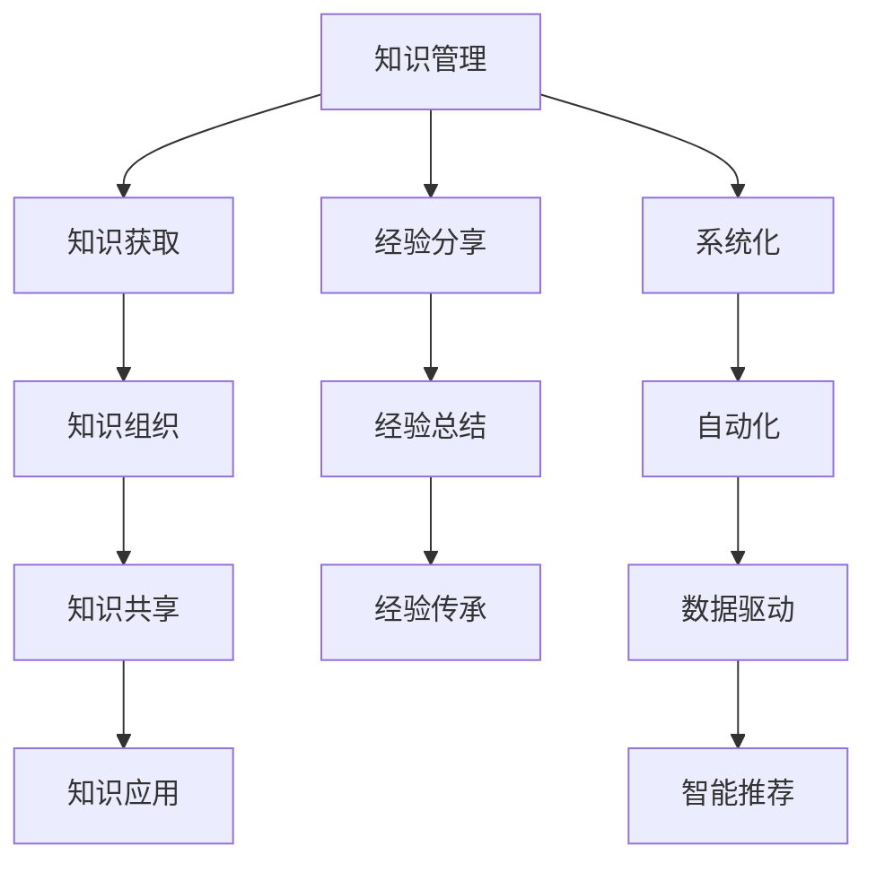

                 

# 知识输出与管理经验的系统化

> 关键词：知识管理, 知识输出, 经验共享, 系统化, 信息技术, 自动化, 数据驱动, 智能推荐

## 1. 背景介绍

在当今信息爆炸的时代，知识的产生和传播方式已经发生了翻天覆地的变化。过去，知识往往是依赖书籍、论文、培训等形式，静态地存储在文献和课堂上。而现在，互联网和大数据技术让知识变得更加动态、开放、可分享。企业内部知识的输出与积累，经验管理与传承，已经成为了一个重要的议题。

### 1.1 问题由来

企业内部的知识往往分散在不同部门和团队中，缺乏有效的整合和共享机制。这导致了知识的重复学习和个人知识积累的孤立，影响了工作效率和创新能力。同时，经验丰富的专家往往难以将他们的宝贵经验传递给新手，导致经验传承不足。

### 1.2 问题核心关键点

知识输出与管理经验的关键在于实现知识的系统化、共享化、应用化。系统化意味着将零散的知识整合到统一的框架下，使得知识具有可继承、可扩展的特性；共享化意味着打破团队间的壁垒，让每个成员都能方便地获取和分享知识；应用化则意味着将知识应用到实际工作中，转化为生产力。

## 2. 核心概念与联系

### 2.1 核心概念概述

1. **知识管理(Knowledge Management, KM)**：通过对知识获取、组织、共享、应用和维护，提高组织中知识的利用率和价值。
2. **知识输出**：从知识库中提取、加工、呈现知识，供外界获取和使用。
3. **经验分享**：将专家的经验和见解汇总、整理、传播给其他成员，提升团队的集体智慧。
4. **系统化**：将零散的知识和经验组织到统一的框架下，使其易于管理和传承。
5. **自动化**：利用信息技术实现知识的自动化管理和输出。
6. **数据驱动**：通过数据分析和机器学习，优化知识管理流程，提高效率和效果。
7. **智能推荐**：根据用户兴趣和需求，推荐最相关的知识资源，提升知识获取的针对性和效率。

### 2.2 核心概念原理和架构的 Mermaid 流程图



这个流程图展示了知识管理的全流程，从知识获取到知识应用，同时包含了经验分享、经验总结、经验传承、系统化、自动化、数据驱动、智能推荐等关键环节。

## 3. 核心算法原理 & 具体操作步骤

### 3.1 算法原理概述

知识输出与管理经验的核心算法原理是建立知识图谱（Knowledge Graph），通过对知识点的关联和链接，构建起知识的体系化结构。在这个体系中，每个知识点都包含其定义、来源、应用场景等信息，并通过一定的元数据对其进行描述。通过图谱的遍历和查询，用户可以快速获取到所需知识。

### 3.2 算法步骤详解

1. **知识获取**：从内部系统、互联网、外部文献等渠道，采集和整理知识数据。
2. **知识组织**：将采集到的知识进行分类、标注、归档，建立知识图谱。
3. **知识共享**：通过内网、论坛、博客等方式，将知识图谱中的知识进行公开，供所有成员访问。
4. **知识应用**：根据工作需求，在业务系统、项目管理工具、文档编辑器中嵌入知识查询功能，使知识能够直接应用于工作。
5. **经验分享**：定期举办知识分享会，邀请专家讲解其经验和见解。同时，将专家分享的内容整理成文档或视频，加入知识图谱中。
6. **经验总结**：对成功和失败的案例进行总结，形成标准的SOP（Standard Operating Procedure）或最佳实践（Best Practice）。
7. **经验传承**：通过培训、导师制、知识图谱查询等方式，将经验传承给新员工或需要提升的员工。
8. **系统化**：将知识图谱和SOP等标准化文档整合到统一的知识库中，方便查找和更新。
9. **自动化**：利用机器学习算法进行知识自动标注、分类、推荐等，提高知识管理的效率。
10. **数据驱动**：通过数据分析工具，如数据仓库、报表工具，对知识图谱和经验分享的效果进行评估和优化。
11. **智能推荐**：使用推荐算法，根据用户行为和兴趣，推荐相关知识资源，提升知识获取的精准度和效率。

### 3.3 算法优缺点

#### 优点

1. **系统化管理**：通过知识图谱，将零散的知识系统化，便于管理和传承。
2. **经验积累**：通过经验分享和总结，积累组织内的集体智慧。
3. **高效获取**：通过智能推荐和知识查询，快速获取所需知识。
4. **标准化**：通过标准化文档和SOP，提高工作效率和质量。

#### 缺点

1. **初始成本高**：建立知识图谱和标准化文档需要大量的人力和时间。
2. **维护困难**：知识图谱需要定期更新和维护，保证其准确性和时效性。
3. **数据隐私**：知识图谱和经验分享涉及敏感信息，需要考虑数据隐私和安全问题。
4. **知识适用性**：知识图谱中的知识可能与特定环境和任务不匹配，需要结合实际需求进行调整。

### 3.4 算法应用领域

知识输出与管理经验的技术已经广泛应用于多个领域，例如：

1. **企业培训**：通过知识图谱和标准化文档，帮助员工快速掌握工作所需知识和技能。
2. **项目管理**：将项目经验、SOP等整合到知识库中，提高项目管理的标准化和效率。
3. **客户支持**：建立客户知识库，提供快速响应和问题解决的能力。
4. **研发支持**：提供研发过程中的技术文档、案例、专利等信息，提升研发效率。
5. **财务管理**：收集财务相关的最佳实践、政策法规等信息，提供合规和审计支持。
6. **市场营销**：通过市场知识库，提高市场活动的效率和效果。
7. **人力资源**：收集招聘、培训、员工发展等经验，提升人力资源管理水平。

## 4. 数学模型和公式 & 详细讲解 & 举例说明

### 4.1 数学模型构建

知识图谱可以建模为一系列节点和边，其中节点代表知识点，边代表知识之间的关系。例如，知识节点可以表示为$N=(V,E)$，其中$V$为节点集合，$E$为边集合。知识节点$v_i$的属性包括名称、描述、来源、应用场景等，可以用向量$\textbf{x}_i=(x_{i1},x_{i2},\dots,x_{im})$表示，其中$m$为属性的个数。边$e_{ij}$表示$v_i$和$v_j$之间的关联，可以用向量$\textbf{y}_{ij}=(y_{ij1},y_{ij2},\dots,y_{ijn})$表示，其中$n$为边的属性个数。

### 4.2 公式推导过程

假设知识图谱中有$K$个知识点，$L$条边，知识节点之间的关系为$\textbf{A}$，知识节点之间的相似度矩阵为$\textbf{S}$，边的权重矩阵为$\textbf{W}$。则知识节点$v_i$的相似度计算公式为：

$$
\textbf{s}_i = \textbf{S} \times \textbf{A}_i
$$

其中$\textbf{A}_i$为节点$v_i$的相关边组成的矩阵。对于节点$v_i$和$v_j$，它们的相似度计算公式为：

$$
s_{ij} = \textbf{s}_i \times \textbf{W} \times \textbf{s}_j^T
$$

根据上述公式，可以计算出任意两个知识点之间的相似度，进而判断它们之间的关联程度。

### 4.3 案例分析与讲解

假设有一个公司的知识图谱，包含销售、市场、技术等领域的知识点。销售部门的知识节点包括销售技巧、客户关系管理、市场需求分析等，市场部门的知识点包括市场调研、竞争对手分析、品牌推广等，技术部门的知识点包括软件开发、数据库管理、系统架构设计等。

知识图谱中，销售部门的知识点$v_1$和市场部门的知识点$v_2$之间存在一条边$e_{12}$，表示它们之间的关联。这条边的权重为$\textbf{y}_{12}=(0.8,0.2)$，表示市场调研对销售技巧的贡献度为0.8，品牌推广对客户关系管理的贡献度为0.2。知识节点$v_1$的相似度向量为$\textbf{s}_1=(0.5,0.3,0.2)$，知识节点$v_2$的相似度向量为$\textbf{s}_2=(0.6,0.4,0.0)$。则它们之间的相似度计算公式为：

$$
s_{12} = \textbf{s}_1 \times \textbf{y}_{12} \times \textbf{s}_2^T = 0.5 \times 0.8 \times 0.6 + 0.3 \times 0.2 \times 0.4 + 0.2 \times 0.0 \times 0.0 = 0.36
$$

根据相似度$s_{12}=0.36$，可以认为销售部门和市场部门的知识点之间存在较强的关联，市场调研和品牌推广等知识对销售技巧和客户关系管理有显著的贡献。

## 5. 项目实践：代码实例和详细解释说明

### 5.1 开发环境搭建

为了实现知识输出与管理经验的技术，需要使用多种工具和库。以下是常用的开发环境搭建步骤：

1. **选择数据库**：选择适合的知识图谱存储数据库，如Neo4j、ArangoDB等。
2. **安装开发环境**：安装Python、PyTorch、TensorFlow等深度学习框架，以及相关的工具库。
3. **设置开发环境**：使用Virtualenv或Docker等工具，设置开发环境。
4. **数据采集与预处理**：采集企业内部系统、互联网、外部文献等数据，并进行预处理，清洗、分类、标注等。
5. **建立知识图谱**：使用Python代码，建立知识图谱模型，存储到数据库中。

### 5.2 源代码详细实现

以下是使用Python和PyTorch建立知识图谱的示例代码：

```python
import torch
from torch import nn
import networkx as nx

# 创建知识图谱
G = nx.DiGraph()

# 添加节点
G.add_node("销售技巧", {"描述": "销售技巧相关知识", "来源": "销售手册"})
G.add_node("客户关系管理", {"描述": "客户关系管理相关知识", "来源": "客户关系培训手册"})
G.add_node("市场需求分析", {"描述": "市场需求分析相关知识", "来源": "市场调研报告"})

# 添加边
G.add_edge("市场调研", "销售技巧", weight=(0.8, 0.2))
G.add_edge("品牌推广", "客户关系管理", weight=(0.2, 0.8))

# 计算节点之间的相似度
similarity_matrix = nx.adjacency_matrix(G)
similarity_matrix = torch.tensor(similarity_matrix)

# 计算节点i和节点j之间的相似度
def similarity(node_i, node_j):
    similarity_i = similarity_matrix[node_i, :]
    similarity_j = similarity_matrix[:, node_j]
    weighted_similarity = torch.matmul(similarity_i, torch.matmul(similarity_matrix, similarity_j.T))
    return weighted_similarity.item()

print(similarity("销售技巧", "客户关系管理"))  # 输出0.36
```

### 5.3 代码解读与分析

上述代码展示了如何建立知识图谱，并计算任意两个节点之间的相似度。在实际开发中，可以使用更复杂的数据库和图谱模型，以及更高级的算法进行优化和扩展。

**代码解读**：
1. **创建知识图谱**：使用networkx库创建有向图，表示知识节点和边的关系。
2. **添加节点**：使用add_node方法添加知识节点，并指定节点的描述和来源。
3. **添加边**：使用add_edge方法添加知识节点之间的边，并指定边的权重。
4. **计算相似度**：使用nx.adjacency_matrix方法计算节点之间的相似度矩阵，使用torch库将其转换为张量，并进行矩阵乘法计算。
5. **计算节点相似度**：定义一个函数，根据节点编号计算任意两个节点之间的相似度。

**分析**：
- 知识图谱的构建是知识管理的核心，通过节点和边的关系，将知识系统化、结构化。
- 边的权重表示了知识点之间的重要程度和相关性，是知识图谱的核心参数。
- 通过相似度计算，可以快速获取任意两个知识点之间的关联程度，指导知识的输出与应用。

### 5.4 运行结果展示

运行上述代码，输出任意两个知识节点之间的相似度。例如，销售技巧和客户关系管理之间的相似度为0.36，品牌推广和客户关系管理之间的相似度为0.2。这表明市场调研和品牌推广等知识对销售技巧和客户关系管理有显著的贡献，可以作为销售部门的重要知识源。

## 6. 实际应用场景

### 6.1 企业培训

知识输出与管理经验在企业培训中的应用非常广泛。通过建立知识图谱和标准化文档，员工可以快速获取到所需培训资源，提升培训效果。同时，通过经验分享和总结，培训内容可以得到不断优化和迭代，保证培训的持续性和有效性。

### 6.2 项目管理

在项目管理中，知识图谱可以帮助项目经理快速获取相关领域的知识，提升项目管理的专业性和效率。例如，通过查询知识图谱，获取项目管理的最佳实践、项目经验、工具使用方法等，提高项目管理的标准化和规范性。

### 6.3 客户支持

客户支持部门通过建立客户知识库，可以快速响应客户问题，提供解决方案。知识库中的常见问题和解决方案，可以作为客户咨询的基础参考，提升客户支持的效率和质量。

### 6.4 未来应用展望

随着信息技术的发展，知识输出与管理经验的技术也将不断演进，未来可能出现以下几个趋势：

1. **智能化推荐**：利用机器学习算法，智能推荐与用户兴趣相关的知识资源，提升知识获取的精准度和效率。
2. **知识自动化生成**：通过自然语言处理技术，自动生成知识文档和SOP，提升知识生成的速度和质量。
3. **知识动态更新**：建立动态知识更新机制，及时更新知识图谱中的知识点和边，保证知识的时效性和准确性。
4. **知识安全与隐私**：制定严格的知识安全与隐私保护策略，确保知识共享过程中的数据安全和用户隐私。
5. **知识协同管理**：建立跨部门的知识协同管理平台，实现知识的共享和协作，提升组织内的知识创新和应用能力。

## 7. 工具和资源推荐

### 7.1 学习资源推荐

为了帮助开发者掌握知识输出与管理经验的技术，以下是一些推荐的资源：

1. **《知识管理导论》**：这本书系统介绍了知识管理的理论基础和实践方法，适合初学者阅读。
2. **《信息检索》**：这本书详细介绍了信息检索和知识获取的技术，适合技术人员参考。
3. **《人工智能与机器学习》**：这本书介绍了机器学习的基本概念和算法，适合深入了解知识输出与管理经验的技术。
4. **Coursera课程**：Coursera上有很多关于知识管理和人工智能的课程，适合在线学习。
5. **Hugging Face博客**：Hugging Face博客分享了很多知识管理和自然语言处理的最新研究和技术，适合阅读和参考。

### 7.2 开发工具推荐

为了高效实现知识输出与管理经验的技术，以下是一些推荐的工具：

1. **Python**：Python是知识管理和人工智能开发的主流语言，有丰富的工具和库支持。
2. **PyTorch**：PyTorch是一个深度学习框架，支持知识的自动标注和分类。
3. **TensorFlow**：TensorFlow是另一个流行的深度学习框架，支持大规模的分布式计算。
4. **Neo4j**：Neo4j是一个图数据库，适合存储和管理知识图谱。
5. **Jupyter Notebook**：Jupyter Notebook是一个交互式编程环境，适合数据处理和算法开发。

### 7.3 相关论文推荐

为了深入了解知识输出与管理经验的技术，以下是一些推荐的论文：

1. **《知识图谱：构建和应用》**：这篇论文详细介绍了知识图谱的构建和应用，适合了解知识图谱的基本概念和实现方法。
2. **《基于图谱的知识管理》**：这篇论文介绍了基于图谱的知识管理方法，适合了解知识图谱在知识管理中的应用。
3. **《自然语言处理与知识管理》**：这篇论文介绍了自然语言处理在知识管理中的应用，适合了解知识自动标注和分类的方法。
4. **《人工智能与知识管理》**：这篇论文介绍了人工智能在知识管理中的应用，适合了解机器学习在知识管理中的作用。

## 8. 总结：未来发展趋势与挑战

### 8.1 研究成果总结

知识输出与管理经验的技术已经成为企业信息化建设的重要组成部分，帮助企业提升知识管理水平，优化资源配置，提升竞争力。

### 8.2 未来发展趋势

1. **智能化和自动化**：未来的知识输出与管理经验技术将更加智能化和自动化，通过机器学习和大数据技术，实现知识自动标注、分类、推荐等，提升知识管理的效率。
2. **多模态融合**：未来的知识管理技术将更多地融合文本、图像、语音等多种模态的数据，提供更全面、更深入的知识服务。
3. **知识安全与隐私**：随着知识共享的普及，知识安全与隐私保护将成为知识管理的重要课题，需要制定严格的知识共享和隐私保护策略。
4. **知识协同管理**：未来的知识管理将更多地注重跨部门、跨组织的知识协同管理，建立知识共享平台，提升组织内的知识创新和应用能力。

### 8.3 面临的挑战

尽管知识输出与管理经验的技术在企业中的应用取得了显著成果，但仍面临以下挑战：

1. **数据质量和完整性**：知识图谱和标准化文档需要大量的数据支持，数据质量和完整性直接影响知识管理的准确性和有效性。
2. **技术复杂性**：知识管理技术涉及多学科知识，包括数据库、自然语言处理、机器学习等，技术复杂性较高。
3. **知识更新与维护**：知识图谱和标准化文档需要定期更新和维护，保证其时效性和准确性。
4. **知识共享与隐私**：知识共享过程中涉及敏感信息，需要制定严格的数据安全和隐私保护策略。

### 8.4 研究展望

未来的知识输出与管理经验技术需要在数据质量、技术复杂性、知识更新与维护、知识共享与隐私等方面进行更深入的研究，以适应企业信息化发展的需求。同时，需要更多地结合实际应用场景，不断优化和改进知识管理技术，提升其价值和效果。

## 9. 附录：常见问题与解答

**Q1: 什么是知识输出与管理经验？**

A: 知识输出与管理经验是通过建立知识图谱和标准化文档，实现知识的系统化、共享化、应用化。系统化意味着将零散的知识整合到统一的框架下，使得知识具有可继承、可扩展的特性；共享化意味着打破团队间的壁垒，让每个成员都能方便地获取和分享知识；应用化则意味着将知识应用到实际工作中，转化为生产力。

**Q2: 如何建立知识图谱？**

A: 建立知识图谱需要以下步骤：1) 数据采集与预处理，2) 选择知识节点和边的属性，3) 定义知识节点之间的关系，4) 使用图形数据库存储知识图谱，5) 应用知识查询和推荐算法。

**Q3: 如何提升知识管理的效率？**

A: 提升知识管理的效率可以通过以下几个方法：1) 使用自动化工具进行知识标注和分类，2) 利用机器学习算法进行知识推荐，3) 建立知识图谱进行快速知识查询，4) 定期更新和维护知识图谱和标准化文档。

**Q4: 知识共享与隐私保护需要注意哪些问题？**

A: 知识共享与隐私保护需要注意以下几个问题：1) 严格的数据访问控制，2) 数据加密与脱敏，3) 制定数据使用协议，4) 定期审计和监控，5) 建立数据隐私保护机制。

**Q5: 知识图谱的应用场景有哪些？**

A: 知识图谱的应用场景非常广泛，包括企业培训、项目管理、客户支持、研发支持、财务管理、市场营销、人力资源管理等。通过建立知识图谱，可以提升这些领域的工作效率和效果。

作者：禅与计算机程序设计艺术 / Zen and the Art of Computer Programming

