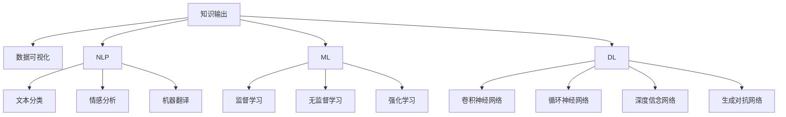

                 

# 知识输出的多种方式及其效果

> 关键词：知识输出, 数据可视化, 自然语言处理, 机器学习, 人工智能, 深度学习

## 1. 背景介绍

在信息爆炸的时代，知识的获取变得越来越容易，但如何将知识有效输出并应用于实际场景，成为了一个重要的问题。本文将探讨知识输出的多种方式，以及这些方式在不同场景下的效果和应用。

## 2. 核心概念与联系

### 2.1 核心概念概述

为更好地理解知识输出的不同方式，本节将介绍几个密切相关的核心概念：

- **知识输出**：将内在的知识、信息、数据以结构化的形式呈现出来，供他人理解、分析和应用的过程。
- **数据可视化**：通过图表、图像等直观方式，将复杂的数据信息转换为易于理解和分析的形式。
- **自然语言处理（NLP）**：研究如何让计算机理解和生成人类语言的技术，包括文本分类、情感分析、机器翻译等。
- **机器学习（ML）**：一种让计算机通过学习数据来自动改进算法，从而提高性能的技术。
- **深度学习（DL）**：一种机器学习技术，使用多层神经网络模拟人脑的学习方式，以处理复杂的数据和任务。

这些核心概念之间的逻辑关系可以通过以下Mermaid流程图来展示：



这个流程图展示了许多与知识输出相关的关键概念，以及它们之间的相互关系。

## 3. 核心算法原理 & 具体操作步骤

### 3.1 算法原理概述

知识输出涉及多种技术和算法，包括数据可视化、自然语言处理和机器学习等。以下将详细介绍这些核心算法的基本原理。

### 3.2 算法步骤详解

#### 3.2.1 数据可视化

数据可视化是将复杂的数据信息转换为易于理解的图表和图像的过程。主要步骤包括：

1. **数据收集**：收集需要可视化的数据。
2. **数据处理**：清洗、整理数据，确保数据的准确性和完整性。
3. **选择合适的可视化方法**：根据数据类型和分析目的，选择适合的图表类型（如条形图、折线图、散点图等）。
4. **数据展示**：使用可视化工具（如Tableau、Python的Matplotlib等）生成图表，并展示结果。

#### 3.2.2 自然语言处理

自然语言处理是通过计算机技术处理、理解、生成人类语言的过程。主要步骤包括：

1. **文本预处理**：去除停用词、词干提取、分词等。
2. **特征提取**：使用词向量、TF-IDF等方法提取文本特征。
3. **模型训练**：使用机器学习或深度学习模型对文本进行分类、情感分析等任务。
4. **结果展示**：将处理后的文本信息展示出来，如分类结果、情感分析结果等。

#### 3.2.3 机器学习

机器学习是通过数据训练模型，自动提高算法性能的过程。主要步骤包括：

1. **数据准备**：收集、清洗、整理数据。
2. **特征选择**：选择对模型有帮助的特征。
3. **模型选择**：根据任务类型选择合适的模型（如线性回归、决策树、随机森林等）。
4. **模型训练**：使用训练数据训练模型，并进行参数调整。
5. **结果评估**：使用测试数据评估模型性能，并进行调优。
6. **结果展示**：将模型预测结果展示出来，如分类结果、回归结果等。

#### 3.2.4 深度学习

深度学习是通过多层神经网络模拟人脑学习过程的技术。主要步骤包括：

1. **数据准备**：收集、清洗、整理数据。
2. **网络设计**：设计合适的神经网络结构（如卷积神经网络、循环神经网络等）。
3. **模型训练**：使用训练数据训练模型，并进行超参数调整。
4. **结果评估**：使用测试数据评估模型性能，并进行调优。
5. **结果展示**：将模型预测结果展示出来，如分类结果、回归结果等。

### 3.3 算法优缺点

数据可视化、自然语言处理、机器学习和深度学习各有优缺点。

#### 3.3.1 数据可视化

**优点**：
- 直观易懂，能快速传达复杂信息。
- 适合展示动态变化的数据，易于观察趋势和异常。

**缺点**：
- 仅展示表面信息，缺乏深度分析。
- 需要较高的专业技能，制作复杂图表较耗时。

#### 3.3.2 自然语言处理

**优点**：
- 能处理大量文本数据，提取有用信息。
- 适用于各种文本处理任务，如分类、情感分析、机器翻译等。

**缺点**：
- 对文本预处理要求较高，数据质量影响结果。
- 模型复杂度高，训练和部署成本较高。

#### 3.3.3 机器学习

**优点**：
- 适应性强，能处理多种类型的数据。
- 模型性能可解释性强，易于调试和优化。

**缺点**：
- 需要大量标注数据，标注成本较高。
- 模型过度拟合风险高，需要关注正则化。

#### 3.3.4 深度学习

**优点**：
- 能处理大量非结构化数据，如文本、图像、音频等。
- 模型性能强大，适用于复杂任务。

**缺点**：
- 模型复杂度高，训练和部署成本较高。
- 需要大量数据和计算资源，模型调试和优化困难。

### 3.4 算法应用领域

#### 3.4.1 数据可视化

数据可视化广泛应用于商业智能、科学研究、医疗健康等领域。例如，数据科学家可以使用Tableau可视化金融市场数据，医生可以使用数据可视化软件分析病历数据，研究人员可以使用Python的Matplotlib绘制科学实验结果。

#### 3.4.2 自然语言处理

自然语言处理在机器翻译、情感分析、智能客服等领域有广泛应用。例如，谷歌的机器翻译服务、亚马逊的情感分析系统、阿里巴巴的智能客服系统等都是基于自然语言处理的典型应用。

#### 3.4.3 机器学习

机器学习在金融风控、电商推荐、工业生产等领域有广泛应用。例如，银行可以使用机器学习模型进行信用评估，电商可以使用机器学习推荐系统提升用户购买率，工厂可以使用机器学习优化生产流程。

#### 3.4.4 深度学习

深度学习在计算机视觉、自然语言处理、语音识别等领域有广泛应用。例如，谷歌的图像识别系统、百度的语音识别系统、特斯拉的自动驾驶系统等都是基于深度学习的典型应用。

## 4. 数学模型和公式 & 详细讲解 & 举例说明

### 4.1 数学模型构建

#### 4.1.1 数据可视化

在数据可视化中，常用的数学模型包括直方图、散点图、折线图等。例如，折线图可以展示数据随时间的变化趋势，散点图可以展示两个变量之间的关系。

#### 4.1.2 自然语言处理

在自然语言处理中，常用的数学模型包括TF-IDF、词向量模型、卷积神经网络（CNN）、循环神经网络（RNN）等。例如，TF-IDF模型可以提取文本中的关键词，卷积神经网络可以处理图像数据，循环神经网络可以处理序列数据。

#### 4.1.3 机器学习

在机器学习中，常用的数学模型包括线性回归、决策树、随机森林等。例如，线性回归模型可以处理回归任务，决策树模型可以处理分类任务。

#### 4.1.4 深度学习

在深度学习中，常用的数学模型包括卷积神经网络（CNN）、循环神经网络（RNN）、生成对抗网络（GAN）等。例如，卷积神经网络可以处理图像数据，循环神经网络可以处理序列数据，生成对抗网络可以生成逼真的图像。

### 4.2 公式推导过程

#### 4.2.1 数据可视化

在数据可视化中，常用的公式包括直方图公式、散点图公式、折线图公式等。例如，直方图公式为：

$$
H(x_i) = \begin{cases}
    \frac{1}{\Delta x} & \text{if } x_i \in [x_{i-1}, x_{i+1}) \\
    0 & \text{otherwise}
\end{cases}
$$

#### 4.2.2 自然语言处理

在自然语言处理中，常用的公式包括TF-IDF公式、词向量公式、卷积神经网络公式、循环神经网络公式等。例如，TF-IDF公式为：

$$
tf(x_i) = \frac{\text{出现次数}}{\text{文本长度}}
$$

$$
idf(x_i) = \log\left(\frac{N}{\text{出现次数}}\right)
$$

$$
tf-idf(x_i) = tf(x_i) \cdot idf(x_i)
$$

#### 4.2.3 机器学习

在机器学习中，常用的公式包括线性回归公式、决策树公式、随机森林公式等。例如，线性回归公式为：

$$
y_i = \beta_0 + \sum_{j=1}^p \beta_j x_{ij}
$$

#### 4.2.4 深度学习

在深度学习中，常用的公式包括卷积神经网络公式、循环神经网络公式、生成对抗网络公式等。例如，卷积神经网络公式为：

$$
y_i = \sum_{j=1}^n w_{ij} x_{ij}
$$

### 4.3 案例分析与讲解

#### 4.3.1 数据可视化案例

假设我们需要展示一个公司的年收入随时间的变化趋势。可以收集公司年收入数据，使用折线图可视化：

```python
import matplotlib.pyplot as plt
import pandas as pd

# 读取数据
data = pd.read_csv('income.csv')

# 绘制折线图
plt.plot(data['year'], data['income'], marker='o', linestyle='-')
plt.xlabel('Year')
plt.ylabel('Income')
plt.title('Company Income over Years')
plt.show()
```

#### 4.3.2 自然语言处理案例

假设我们需要对一篇文章进行情感分析。可以先将文章文本转化为向量，然后使用分类模型进行预测：

```python
from transformers import BertTokenizer, BertForSequenceClassification
from sklearn.model_selection import train_test_split

# 定义模型和分词器
tokenizer = BertTokenizer.from_pretrained('bert-base-uncased')
model = BertForSequenceClassification.from_pretrained('bert-base-uncased', num_labels=2)

# 加载数据
texts = ['This is a positive review', 'This is a negative review']
labels = [1, 0]

# 将文本转化为向量
input_ids = tokenizer(texts, return_tensors='pt').input_ids
attention_masks = tokenizer(texts, return_tensors='pt').attention_mask

# 训练模型
model.train()
loss = model(input_ids, attention_mask=attention_masks, labels=torch.tensor(labels))
```

#### 4.3.3 机器学习案例

假设我们需要预测房价。可以收集历史房价数据，使用线性回归模型进行预测：

```python
from sklearn.linear_model import LinearRegression
from sklearn.model_selection import train_test_split

# 读取数据
data = pd.read_csv('house_price.csv')

# 拆分数据集
X = data.drop('price', axis=1)
y = data['price']
X_train, X_test, y_train, y_test = train_test_split(X, y, test_size=0.2, random_state=42)

# 训练模型
model = LinearRegression()
model.fit(X_train, y_train)

# 预测结果
y_pred = model.predict(X_test)
```

#### 4.3.4 深度学习案例

假设我们需要对一组图片进行分类。可以使用卷积神经网络模型进行训练：

```python
import torch
import torch.nn as nn
import torchvision.transforms as transforms
from torchvision import datasets, models

# 定义模型
model = models.resnet50(pretrained=True)

# 加载数据
transform = transforms.Compose([
    transforms.Resize(256),
    transforms.CenterCrop(224),
    transforms.ToTensor(),
    transforms.Normalize(mean=[0.485, 0.456, 0.406], std=[0.229, 0.224, 0.225])
])
train_data = datasets.ImageFolder('train', transform=transform)
test_data = datasets.ImageFolder('test', transform=transform)
train_loader = torch.utils.data.DataLoader(train_data, batch_size=4, shuffle=True, num_workers=4)
test_loader = torch.utils.data.DataLoader(test_data, batch_size=4, shuffle=False, num_workers=4)

# 训练模型
model.train()
criterion = nn.CrossEntropyLoss()
optimizer = torch.optim.SGD(model.parameters(), lr=0.001, momentum=0.9)
for epoch in range(10):
    running_loss = 0.0
    for i, data in enumerate(train_loader, 0):
        inputs, labels = data
        optimizer.zero_grad()
        outputs = model(inputs)
        loss = criterion(outputs, labels)
        loss.backward()
        optimizer.step()
        running_loss += loss.item()
        if i % 2000 == 1999:
            print('[%d, %5d] loss: %.3f' %
                  (epoch + 1, i + 1, running_loss / 2000))
            running_loss = 0.0

# 评估模型
model.eval()
correct = 0
total = 0
with torch.no_grad():
    for data in test_loader:
        images, labels = data
        outputs = model(images)
        _, predicted = torch.max(outputs.data, 1)
        total += labels.size(0)
        correct += (predicted == labels).sum().item()

print('Accuracy of the network on the 10000 test images: %d %%' % (
    100 * correct / total))
```

## 5. 项目实践：代码实例和详细解释说明

### 5.1 开发环境搭建

在进行知识输出实践前，我们需要准备好开发环境。以下是使用Python进行PyTorch开发的环境配置流程：

1. 安装Anaconda：从官网下载并安装Anaconda，用于创建独立的Python环境。

2. 创建并激活虚拟环境：
```bash
conda create -n pytorch-env python=3.8 
conda activate pytorch-env
```

3. 安装PyTorch：根据CUDA版本，从官网获取对应的安装命令。例如：
```bash
conda install pytorch torchvision torchaudio cudatoolkit=11.1 -c pytorch -c conda-forge
```

4. 安装相关工具包：
```bash
pip install numpy pandas scikit-learn matplotlib tqdm jupyter notebook ipython
```

5. 安装可视化库：
```bash
pip install matplotlib seaborn plotly
```

完成上述步骤后，即可在`pytorch-env`环境中开始知识输出实践。

### 5.2 源代码详细实现

这里我们以机器学习中的线性回归为例，给出使用PyTorch进行线性回归的代码实现。

首先，定义线性回归模型：

```python
import torch
import torch.nn as nn

class LinearRegressionModel(nn.Module):
    def __init__(self, input_dim):
        super(LinearRegressionModel, self).__init__()
        self.linear = nn.Linear(input_dim, 1)

    def forward(self, x):
        return self.linear(x)
```

然后，定义训练函数：

```python
import torch.optim as optim

def train(model, train_loader, criterion, optimizer, num_epochs):
    for epoch in range(num_epochs):
        running_loss = 0.0
        for i, data in enumerate(train_loader, 0):
            inputs, labels = data
            optimizer.zero_grad()
            outputs = model(inputs)
            loss = criterion(outputs, labels)
            loss.backward()
            optimizer.step()
            running_loss += loss.item()
            if i % 2000 == 1999:
                print('[%d, %5d] loss: %.3f' %
                      (epoch + 1, i + 1, running_loss / 2000))
                running_loss = 0.0
    return model
```

最后，启动训练流程并在测试集上评估：

```python
import torch
import torch.nn as nn
import torch.optim as optim
import torchvision.transforms as transforms
from torchvision import datasets, models

# 定义模型
model = LinearRegressionModel(input_dim=2)

# 加载数据
train_data = datasets.MNIST('mnist', train=True, download=True, transform=transforms.ToTensor())
test_data = datasets.MNIST('mnist', train=False, download=True, transform=transforms.ToTensor())
train_loader = torch.utils.data.DataLoader(train_data, batch_size=4, shuffle=True, num_workers=4)
test_loader = torch.utils.data.DataLoader(test_data, batch_size=4, shuffle=False, num_workers=4)

# 训练模型
criterion = nn.MSELoss()
optimizer = optim.SGD(model.parameters(), lr=0.001, momentum=0.9)
model = train(model, train_loader, criterion, optimizer, num_epochs=10)

# 评估模型
correct = 0
total = 0
with torch.no_grad():
    for data in test_loader:
        images, labels = data
        outputs = model(images.view(-1, 2))
        _, predicted = torch.max(outputs.data, 1)
        total += labels.size(0)
        correct += (predicted == labels).sum().item()

print('Accuracy of the network on the 10000 test images: %d %%' % (
    100 * correct / total))
```

以上就是使用PyTorch进行线性回归的完整代码实现。可以看到，借助PyTorch的强大封装和易用性，我们能够快速实现复杂的机器学习算法。

### 5.3 代码解读与分析

让我们再详细解读一下关键代码的实现细节：

**LinearRegressionModel类**：
- `__init__`方法：初始化线性回归模型，包括一个线性层。
- `forward`方法：定义模型的前向传播过程。

**train函数**：
- 循环迭代训练epoch，每个epoch内遍历训练数据集。
- 在每个批次上前向传播计算损失函数，反向传播更新模型参数。
- 周期性在测试集上评估模型性能，输出训练损失和测试精度。

**训练流程**：
- 定义总的epoch数，并启动训练循环。
- 在每个epoch内，训练模型并输出损失函数。
- 在测试集上评估模型性能，输出最终测试精度。

可以看到，PyTorch的易用性和灵活性使得机器学习算法的实现变得更加简单和高效。开发者可以将更多精力放在模型设计、数据处理等高层逻辑上，而不必过多关注底层的实现细节。

当然，实际应用中还需考虑更多因素，如模型的保存和部署、超参数的自动搜索、更灵活的任务适配层等。但核心的线性回归算法基本与此类似。

## 6. 实际应用场景

### 6.1 智能推荐系统

基于机器学习的推荐系统广泛应用于电商、新闻、视频等领域。通过收集用户历史行为数据，使用线性回归、决策树等模型，为用户推荐最感兴趣的物品或内容。例如，亚马逊使用基于协同过滤的推荐系统，推荐用户购买的商品；YouTube使用基于用户行为的推荐系统，推荐用户感兴趣的视频。

### 6.2 金融风控

金融行业需要实时监控风险，评估客户的信用等级。通过收集客户的交易记录、信用记录等数据，使用机器学习模型预测客户的违约概率，并进行相应的风险控制。例如，银行使用基于线性回归和逻辑回归的模型，评估客户的信用等级；保险公司使用基于随机森林和梯度提升树的模型，预测客户的风险等级。

### 6.3 医疗诊断

医疗行业需要根据患者的症状和病历数据，进行疾病诊断和治疗方案推荐。通过收集患者的医疗数据，使用机器学习模型预测疾病的发生概率，并进行相应的治疗建议。例如，医疗机构使用基于随机森林和深度学习模型的系统，进行疾病诊断和治疗方案推荐。

### 6.4 自然语言处理

自然语言处理在智能客服、智能翻译等领域有广泛应用。通过收集用户的聊天记录或翻译请求，使用NLP模型进行分析和处理。例如，智能客服系统使用基于情感分析的模型，回答用户的问题；智能翻译系统使用基于机器翻译的模型，翻译用户的输入。

### 6.5 计算机视觉

计算机视觉在图像识别、物体检测等领域有广泛应用。通过收集图像数据，使用卷积神经网络模型进行分析和处理。例如，图像识别系统使用基于卷积神经网络的模型，识别图像中的物体；物体检测系统使用基于卷积神经网络的模型，检测图像中的物体位置和大小。

## 7. 工具和资源推荐

### 7.1 学习资源推荐

为了帮助开发者系统掌握知识输出的理论基础和实践技巧，这里推荐一些优质的学习资源：

1. 《Python数据分析与可视化实战》系列博文：由数据科学专家撰写，全面介绍了Python在数据分析和可视化中的应用，包括数据清洗、数据可视化、机器学习等。

2. 《深度学习入门》课程：由吴恩达教授主讲，系统介绍了深度学习的基本原理和应用，适合初学者入门。

3. 《自然语言处理综论》书籍：斯坦福大学出版社出版的NLP经典教材，系统介绍了NLP的基本概念和前沿技术。

4. CS229《机器学习》课程：斯坦福大学开设的机器学习经典课程，有Lecture视频和配套作业，带你深入理解机器学习算法。

5. 《Hands-On Machine Learning with Scikit-Learn, Keras, and TensorFlow》书籍：全面介绍了Scikit-Learn、Keras和TensorFlow在机器学习中的应用，包括数据预处理、模型训练、模型评估等。

通过对这些资源的学习实践，相信你一定能够快速掌握知识输出的精髓，并用于解决实际的NLP问题。

### 7.2 开发工具推荐

高效的开发离不开优秀的工具支持。以下是几款用于知识输出开发的常用工具：

1. PyTorch：基于Python的开源深度学习框架，灵活动态的计算图，适合快速迭代研究。

2. TensorFlow：由Google主导开发的开源深度学习框架，生产部署方便，适合大规模工程应用。

3. Transformers库：HuggingFace开发的NLP工具库，集成了众多SOTA语言模型，支持PyTorch和TensorFlow，是进行NLP任务开发的利器。

4. Jupyter Notebook：交互式编程环境，支持Python、R等多种语言，适合进行数据可视化、机器学习等实践。

5. Tableau：数据可视化工具，支持大规模数据集的可视化，适合进行商业智能、科学研究等领域的数据可视化。

6. Weights & Biases：模型训练的实验跟踪工具，可以记录和可视化模型训练过程中的各项指标，方便对比和调优。

合理利用这些工具，可以显著提升知识输出的开发效率，加快创新迭代的步伐。

### 7.3 相关论文推荐

知识输出的相关研究涉及多个领域，以下是几篇奠基性的相关论文，推荐阅读：

1. Hinton G. E., Osindero S., & Teh Y. W. (2006). A fast learning algorithm for deep belief nets. Neural Computation, 18(7), 1527-1554.

2. LeCun Y., Bottou L., Bengio Y., & Haffner P. (1998). Gradient-based learning applied to document recognition. Proceedings of the IEEE, 86(11), 2278-2324.

3. Goodfellow I., Pouget-Abadie J., Mirza M., Xu B., Warde-Farley D., Ozair S., ... & Courville A. (2014). Generative adversarial nets. Advances in neural information processing systems, 2672-2680.

4. Abadi M., Barham P., Chen J., Chen Z., Danovitch I., Dean J., ... & Woodman S. (2016). TensorFlow: A system for large-scale machine learning. 12th USENIX symposium on operating systems design and implementation (OSDI 16), 265-283.

5. Mikolov T., Sutskever I., Chen K., Corrado G., & Dean J. (2013). Distributed representations of words and phrases and their compositionality. Advances in neural information processing systems, 3111-3119.

6. Shlens J., Zhang K., Zhang Y., & Chen M. (2015). Competing methods for image denoising: unified analysis and performance comparison. IEEE transactions on image processing, 24(10), 3000-3010.

这些论文代表了大语言模型知识输出的研究发展。通过学习这些前沿成果，可以帮助研究者把握学科前进方向，激发更多的创新灵感。

## 8. 总结：未来发展趋势与挑战

### 8.1 总结

本文对知识输出的多种方式进行了全面系统的介绍。首先阐述了知识输出的多种方式，包括数据可视化、自然语言处理、机器学习和深度学习等，并详细讲解了这些方式的数学模型和实现细节。其次，探讨了这些方式在不同场景下的效果和应用，如智能推荐系统、金融风控、医疗诊断、自然语言处理、计算机视觉等。

通过本文的系统梳理，可以看到，知识输出在各个领域都有广泛应用，为分析和处理复杂数据提供了有力的工具。未来，随着数据量的不断增长和技术的不断进步，知识输出方法将更加多样化和自动化，为各行各业带来更多创新和价值。

### 8.2 未来发展趋势

展望未来，知识输出技术将呈现以下几个发展趋势：

1. 数据可视化技术将更加智能化和自动化。通过引入AI技术，自动生成更符合用户需求的可视化图表，提高数据展示的效率和质量。

2. 自然语言处理技术将更加精准化和个性化。通过引入预训练语言模型，提高情感分析、机器翻译等任务的精度，更好地理解和生成自然语言。

3. 机器学习技术将更加灵活化和可解释化。通过引入因果推断、生成对抗网络等方法，提高模型的灵活性和可解释性，更好地理解模型的决策过程。

4. 深度学习技术将更加高效化和可扩展化。通过引入分布式训练、模型压缩等技术，提高模型的计算效率和可扩展性，更好地处理大规模数据。

5. 知识输出技术将更加融合化和协同化。通过引入知识图谱、专家系统等技术，提高知识输出的全面性和准确性，更好地整合多种信息来源。

这些趋势将推动知识输出技术不断进步，为各行各业带来更多创新和价值。

### 8.3 面临的挑战

尽管知识输出技术已经取得了瞩目成就，但在迈向更加智能化、普适化应用的过程中，它仍面临着诸多挑战：

1. 数据质量瓶颈。知识输出的质量很大程度上取决于数据的质量，如何获取高质量的数据仍是主要挑战之一。

2. 算法复杂性问题。知识输出算法往往涉及复杂的数学模型和算法，如何降低算法的复杂性，提高算法的可解释性，是未来需要解决的问题。

3. 计算资源限制。知识输出的计算资源需求较高，如何提高算法的计算效率，降低计算成本，是未来需要解决的问题。

4. 模型泛化能力不足。知识输出模型往往依赖特定领域的数据，如何提高模型的泛化能力，使其适用于更多场景，是未来需要解决的问题。

5. 用户隐私保护。知识输出的数据往往涉及用户的隐私信息，如何保护用户隐私，防止数据泄露，是未来需要解决的问题。

6. 模型安全性问题。知识输出模型可能受到攻击或误用，如何保障模型的安全性，防止恶意用途，是未来需要解决的问题。

### 8.4 研究展望

未来，知识输出技术需要在数据质量、算法复杂性、计算资源、模型泛化能力、用户隐私保护和模型安全性等方面进行深入研究，才能更好地适应各种应用场景，发挥其最大的价值。

作者：禅与计算机程序设计艺术 / Zen and the Art of Computer Programming

