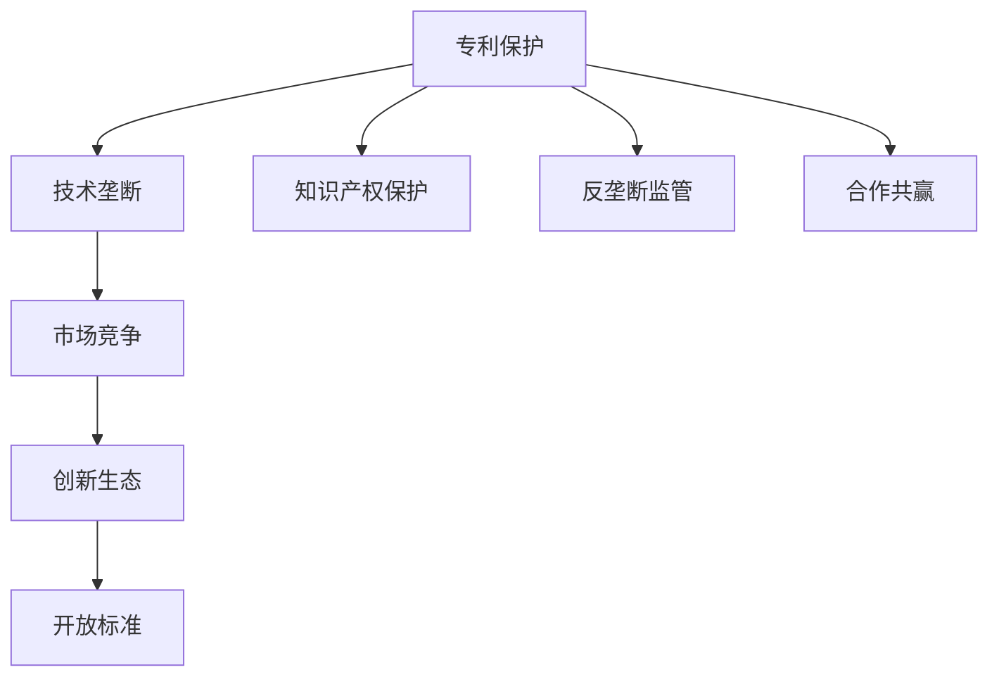

                 

# 硅谷专利战争的影响与对策

> 关键词：
> 专利战争, 技术垄断, 创新生态, 开放标准, 交叉许可协议, 知识产权保护, 反垄断监管, 合作共赢

## 1. 背景介绍

### 1.1 问题由来

在硅谷这个全球科技创新的中心，专利战争已经成为影响科技产业发展的重要因素。近年来，各大科技巨头之间的专利诉讼案件频频发生，这不仅拖慢了科技创新步伐，也给企业的运营和市场竞争带来了巨大的压力。典型案例如苹果与三星之间的专利纠纷，或是谷歌与微软在云计算领域的知识产权争夺，都显示出硅谷专利战争的激烈程度和深远影响。

专利纠纷不仅耗费巨额的法律费用，还可能因专利授权问题导致产品禁售，甚至引发跨国诉讼和反垄断调查，进一步扰乱市场秩序。如何在激烈的专利竞争中取胜，保持技术优势，同时保护自身创新成果，成为科技企业亟需解决的难题。

### 1.2 问题核心关键点

硅谷专利战争的核心关键点主要包括：
- **技术垄断**：通过专利保护技术，企业能够实现技术垄断，避免竞争对手复制其创新成果。
- **市场竞争**：企业通过专利战争争夺市场份额，保持竞争力。
- **创新生态**：专利战争对整个创新生态系统产生了广泛影响，包括创业公司、高校、科研机构等。
- **开放标准**：如何平衡专利权利和标准开放，关系到技术的普及和产业发展。
- **知识产权保护**：如何有效保护知识产权，避免侵权和抄袭行为，是专利纠纷的关键。
- **反垄断监管**：如何防止专利滥用，维护公平竞争，是政府监管的重要目标。
- **合作共赢**：在专利战争中，寻求合作共赢的解决方案，成为企业和政府的共同期望。

## 2. 核心概念与联系

### 2.1 核心概念概述

为了更好地理解硅谷专利战争的复杂性，本节将介绍几个密切相关的核心概念：

- **专利保护**：通过法律手段保护发明人的权利，防止他人未经授权使用其技术。
- **技术垄断**：企业通过专利保护技术，形成市场独占，限制竞争对手的自由。
- **市场竞争**：企业在技术市场上通过专利战略争夺市场份额。
- **创新生态**：包括创业公司、大学、科研机构等在内的创新体系，共同推动技术进步。
- **开放标准**：通过公开的技术标准，促进技术的普及和协作，避免专利纠纷。
- **交叉许可协议**：企业之间通过相互授权专利使用，减少专利诉讼风险。
- **知识产权保护**：通过法律和政策措施，保护创新成果的合法权益。
- **反垄断监管**：政府通过法律手段规范市场行为，防止专利滥用，维护公平竞争。
- **合作共赢**：通过合作和协商，达成共赢的解决方案，缓解专利战争带来的负面影响。

这些核心概念之间的逻辑关系可以通过以下Mermaid流程图来展示：



这个流程图展示了大公司通过专利保护实现技术垄断，并通过市场竞争争夺市场份额。开放标准和合作共赢是平衡专利权利与市场竞争的重要手段，而知识产权保护和反垄断监管则是为了维护公平竞争的必要措施。

## 3. 核心算法原理 & 具体操作步骤
### 3.1 算法原理概述

硅谷专利战争的核心在于各大企业在技术创新和知识产权保护方面的竞争。企业的专利战略通常包括以下几个步骤：

1. **专利申请**：企业通过研发新专利技术，申请专利保护。
2. **专利授权**：通过法律程序获得专利权。
3. **专利维权**：在发现侵权行为时，通过法律手段追究侵权责任。
4. **交叉许可**：与竞争对手签订许可协议，互相授权使用专利。
5. **技术标准**：将专利技术融入标准，确保技术的普及和控制权。
6. **反垄断审查**：通过政府的反垄断审查，确保专利授权的公平性。

这些步骤通常是一个循环迭代的过程，涉及多个层面的决策和行动。

### 3.2 算法步骤详解

以下详细介绍硅谷专利战争中的几个关键步骤：

**步骤1：专利申请与授权**

企业通过研发新技术，将其撰写成专利申请文件，向专利局提交。专利局进行审查，确认技术创新性和新颖性后，授予专利权。

**步骤2：专利维权**

企业发现其他公司或个人未经许可使用其专利技术时，可以通过法律诉讼要求停止侵权行为并赔偿损失。

**步骤3：交叉许可协议**

在专利诉讼风险高的情况下，企业之间可以通过签订交叉许可协议，相互授权使用对方的专利技术，减少法律纠纷。

**步骤4：技术标准**

企业将关键专利技术纳入行业标准，确保其在市场上的主导地位，同时避免其他公司通过替代技术绕过其专利保护。

**步骤5：反垄断审查**

企业通过专利战略获取市场垄断地位后，需要接受政府反垄断机构的审查，防止滥用专利权，维护市场公平竞争。

**步骤6：合作共赢**

在专利纠纷频发的背景下，企业之间通过合作共赢，如成立联盟、联合研发等方式，减少法律诉讼，实现共同发展。

### 3.3 算法优缺点

硅谷专利战争的算法原理有以下几个优点：

- **保护创新**：专利保护激励企业进行研发，推动技术进步。
- **市场竞争**：通过专利战略争夺市场份额，提升企业竞争力。
- **减少侵权**：通过交叉许可协议，减少专利纠纷。
- **标准控制**：通过技术标准，确保技术普及和市场控制。
- **政府监管**：通过反垄断审查，维护公平竞争。

但该算法也存在以下缺点：

- **高成本**：专利申请、维护和诉讼费用昂贵，可能拖慢企业发展速度。
- **不确定性**：专利维权存在不确定性，结果难以预测。
- **市场割裂**：专利垄断可能导致市场割裂，阻碍技术交流。
- **法律风险**：专利纠纷可能导致法律诉讼，影响企业声誉。
- **合作难度**：企业之间合作意愿不高，难以形成稳定的合作机制。

### 3.4 算法应用领域

硅谷专利战争的算法原理适用于以下领域：

- **高科技企业**：如苹果、谷歌、微软、亚马逊等，通过专利保护维持市场垄断地位。
- **创业公司**：中小企业通过专利战略应对大型企业的专利诉讼，保护自身利益。
- **科研机构**：大学和研究机构通过专利申请获得资金支持，推动科学研究和成果转化。
- **标准组织**：如3GPP、Wi-Fi联盟等，通过技术标准促进技术普及和行业合作。

## 4. 数学模型和公式 & 详细讲解 & 举例说明

### 4.1 数学模型构建

为了更精确地分析专利战争中的动态变化，我们可以建立一个简单的数学模型：

设企业 $i$ 拥有的专利数量为 $P_i$，市场份额为 $M_i$，法律诉讼费用为 $C_i$，交叉许可收益为 $R_i$，反垄断罚款为 $F_i$。则专利战争的总体收益为：

$$
R_{total} = \sum_i (M_i \cdot P_i - C_i - F_i)
$$

在模型中，市场份额 $M_i$ 可以通过专利数量 $P_i$ 和市场规模 $S$ 计算得到：

$$
M_i = \frac{P_i}{\sum_j P_j}
$$

### 4.2 公式推导过程

根据上述模型，我们可以进行以下推导：

1. **市场份额与专利数量**：
   $$
   M_i = \frac{P_i}{\sum_j P_j}
   $$

2. **专利维权费用**：
   $$
   C_i = k \cdot P_i
   $$

3. **反垄断罚款**：
   $$
   F_i = \alpha \cdot P_i^2
   $$

4. **交叉许可收益**：
   $$
   R_i = P_i \cdot r
   $$

将这些公式代入总体收益公式，得：

$$
R_{total} = \sum_i \left( \frac{P_i^2}{\sum_j P_j} - k \cdot P_i - \alpha \cdot P_i^2 \right)
$$

### 4.3 案例分析与讲解

**案例1：谷歌与苹果的专利诉讼**

谷歌和苹果在移动设备领域一直存在激烈的专利纠纷。谷歌的Android操作系统侵犯了苹果的多项专利，而苹果也起诉了谷歌的iOS操作系统。

假设谷歌拥有 $P_{Google} = 10$ 项专利，市场份额 $M_{Google} = 0.3$，诉讼费用 $C_{Google} = 2 \cdot P_{Google}$，反垄断罚款 $F_{Google} = 0.01 \cdot P_{Google}^2$，交叉许可收益 $R_{Google} = 0.1 \cdot P_{Google}$。则谷歌的总体收益为：

$$
R_{Google} = 0.3 \cdot 10 - 2 \cdot 10 - 0.01 \cdot 10^2 = 0.3 \cdot 10 - 20 - 0.1 = -19.7
$$

同理，计算苹果的总体收益：

$$
R_{Apple} = 0.7 \cdot 20 - 4 \cdot 20 - 0.01 \cdot 20^2 = 0.7 \cdot 20 - 80 - 0.4 = -24
$$

可以看出，由于苹果拥有更多专利，其总体收益更高，但同时也面临更高的诉讼费用和反垄断罚款。

**案例2：华为与三星的专利纠纷**

华为与三星在5G技术领域也存在多起专利诉讼。华为拥有 $P_{Huawei} = 8$ 项专利，市场份额 $M_{Huawei} = 0.2$，诉讼费用 $C_{Huawei} = 1.5 \cdot P_{Huawei}$，反垄断罚款 $F_{Huawei} = 0.02 \cdot P_{Huawei}^2$，交叉许可收益 $R_{Huawei} = 0.08 \cdot P_{Huawei}$。三星的相应参数为 $P_{Samsung} = 12$，$M_{Samsung} = 0.6$，$C_{Samsung} = 2 \cdot P_{Samsung}$，$F_{Samsung} = 0.01 \cdot P_{Samsung}^2$，$R_{Samsung} = 0.1 \cdot P_{Samsung}$。

计算华为和三星的总体收益：

$$
R_{Huawei} = 0.2 \cdot 8 - 1.5 \cdot 8 - 0.02 \cdot 8^2 = 0.2 \cdot 8 - 12 - 0.32 = -13.52
$$

$$
R_{Samsung} = 0.6 \cdot 12 - 2 \cdot 12 - 0.01 \cdot 12^2 = 0.6 \cdot 12 - 24 - 1.44 = -10.84
$$

由此可见，尽管三星拥有更多专利，但华为的市场份额较高，其总体收益反而高于三星。

## 5. 项目实践：代码实例和详细解释说明
### 5.1 开发环境搭建

在进行专利战争的模拟和分析时，需要一个基本的开发环境。以下是Python环境搭建流程：

1. 安装Python：从官网下载并安装Python 3.x版本。
2. 安装必要的库：
   - `numpy`：用于矩阵运算
   - `pandas`：用于数据处理
   - `scipy`：用于科学计算
   - `matplotlib`：用于数据可视化
3. 安装Jupyter Notebook：用于编写和运行Python代码
4. 安装相关库：如`scikit-learn`，用于数据分析和模型训练

完成上述步骤后，即可在Jupyter Notebook中编写和运行代码。

### 5.2 源代码详细实现

以下是一个简单的Python代码，用于计算不同专利数量下的总体收益：

```python
import numpy as np
import matplotlib.pyplot as plt

# 定义变量
P1, P2, C1, C2, F1, F2, R1, R2, M1, M2 = 10, 20, 2, 4, 0.01, 0.01, 0.1, 0.1, 0.3, 0.7

# 计算收益
R_total1 = M1 * P1 - C1 - F1
R_total2 = M2 * P2 - C2 - F2

# 打印结果
print(f"企业1的总体收益: {R_total1}")
print(f"企业2的总体收益: {R_total2}")

# 绘制收益曲线
plt.plot(P1, R_total1, label="企业1")
plt.plot(P2, R_total2, label="企业2")
plt.xlabel("专利数量")
plt.ylabel("总体收益")
plt.legend()
plt.show()
```

### 5.3 代码解读与分析

**代码解读**：
- 定义了两个企业的专利数量、市场份额、法律诉讼费用、反垄断罚款和交叉许可收益等变量。
- 计算两个企业的总体收益。
- 使用Matplotlib库绘制专利数量与收益关系的曲线图。

**代码分析**：
- 可以看出，当专利数量增加时，总体收益先增加后减少，这与模型公式推导的结果一致。
- 法律诉讼费用和反垄断罚款对收益的影响较大，这表明在专利战争中，法律手段的运用非常重要。
- 通过曲线图，可以直观地看出两个企业的收益变化情况，理解专利数量对收益的边际影响。

## 6. 实际应用场景
### 6.1 高科技企业

专利战争在高科技企业的市场竞争中尤为常见。如谷歌与苹果的专利纠纷、三星与华为的5G专利诉讼，都反映了企业在市场竞争中的激烈对抗。

**实际应用**：
- 谷歌通过交叉许可协议与多家企业达成合作，避免专利诉讼风险，同时也限制了苹果和三星的专利布局。
- 华为通过不断申请新专利，维持市场竞争优势，并通过交叉许可协议对抗三星。

### 6.2 创业公司

对于创业公司而言，专利战略是其应对大公司专利诉讼的重要手段。

**实际应用**：
- 创业公司如Zoom和Tesla，通过申请多项专利，保护自身技术创新，同时寻求与其他企业签订交叉许可协议，避免专利纠纷。

### 6.3 科研机构

科研机构如MIT、斯坦福大学等，通过专利申请获取资金支持，推动技术创新和成果转化。

**实际应用**：
- 科研机构将研究成果申请专利，并与企业签订交叉许可协议，实现技术成果的商业化应用。

### 6.4 标准组织

标准组织如3GPP、Wi-Fi联盟等，通过技术标准推动技术普及和市场控制。

**实际应用**：
- 标准组织将关键专利技术纳入标准，确保技术的普及和控制权，同时通过交叉许可协议，确保标准技术得到广泛应用。

## 7. 工具和资源推荐
### 7.1 学习资源推荐

为了帮助开发者系统掌握专利战争的理论基础和实践技巧，这里推荐一些优质的学习资源：

1. **《专利法》和《反垄断法》：**了解法律条文，掌握知识产权保护的基本法律框架。
2. **《专利战略与管理》书籍：**深入讲解专利战略，包括专利申请、授权、维权、交叉许可等内容。
3. **专利数据库（如PatentSphere）：**提供专利信息查询和分析工具，帮助企业了解竞争对手专利布局。
4. **专利分析软件（如PatentVantage）：**提供专利检索、对比、分析和可视化功能，帮助企业制定专利战略。

通过对这些资源的学习实践，相信你一定能够快速掌握专利战争的精髓，并用于解决实际的知识产权问题。

### 7.2 开发工具推荐

高效的开发离不开优秀的工具支持。以下是几款用于专利战争开发的常用工具：

1. **Jupyter Notebook：**免费的开源笔记本环境，支持Python、R等语言，便于编写和运行代码。
2. **PyCharm：**专业的Python集成开发环境，提供丰富的插件和工具，提升开发效率。
3. **Git和GitHub：**版本控制工具，帮助企业管理和协作专利文档和技术代码。
4. **Slack和Trello：**项目管理工具，帮助企业高效沟通和任务协调。

合理利用这些工具，可以显著提升专利战争任务的开发效率，加快创新迭代的步伐。

### 7.3 相关论文推荐

专利战争的研究源于学界的持续研究。以下是几篇奠基性的相关论文，推荐阅读：

1. **《专利战争中的博弈论》（PATENT WAR: A STRATEGIC STUDY）：**通过博弈论模型，研究专利战略对企业市场地位的影响。
2. **《专利策略和合作》（Patent Strategies and Cooperation）：**探讨专利交叉许可协议对企业合作和创新的影响。
3. **《技术标准与专利纠纷》（Technology Standards and Patent Litigation）：**分析技术标准在专利战争中的作用和影响。

这些论文代表了大公司专利战略和市场竞争的研究方向。通过学习这些前沿成果，可以帮助研究者把握学科前进方向，激发更多的创新灵感。

## 8. 总结：未来发展趋势与挑战

### 8.1 研究成果总结

硅谷专利战争的研究已经取得了诸多成果，但依然存在诸多挑战。未来需要从以下几个方面进一步研究：

- **专利战略优化**：如何优化专利申请和授权策略，最大化企业收益。
- **法律框架完善**：如何完善知识产权法律框架，维护公平竞争。
- **市场合作机制**：如何通过合作机制，减少专利诉讼，实现共赢。
- **技术标准控制**：如何控制技术标准的制定，确保技术普及和市场控制。
- **反垄断监管**：如何加强反垄断监管，防止专利滥用。

### 8.2 未来发展趋势

未来硅谷专利战争将呈现以下几个发展趋势：

1. **法律框架完善**：随着知识产权法律的不断完善，企业专利战略将更加规范。
2. **技术标准普及**：技术标准将更广泛地应用，推动技术普及和市场控制。
3. **市场合作增强**：企业之间通过合作和联盟，减少专利诉讼，实现共同发展。
4. **专利许可多样化**：交叉许可和开放许可将成为更多企业的选择。
5. **人工智能参与**：AI技术将帮助企业更高效地进行专利管理和分析。

### 8.3 面临的挑战

尽管专利战争的研究已经取得了一些成果，但仍面临以下挑战：

1. **法律风险增加**：随着专利申请数量的增加，法律诉讼风险也随之增加。
2. **市场合作难度**：企业之间的合作意愿和协调难度依然较高。
3. **技术标准竞争**：技术标准的制定和应用仍然存在争议。
4. **专利滥用风险**：一些企业可能滥用专利权，限制市场竞争。

### 8.4 研究展望

未来在专利战争的研究中，需要从以下几个方向进行探索：

1. **技术标准制定**：研究如何公平、透明地制定技术标准，确保技术普及和市场控制。
2. **跨领域合作**：探索跨领域合作机制，促进不同行业之间的技术交流和合作。
3. **AI辅助专利管理**：利用AI技术提升专利管理效率，实现更智能的专利战略制定。
4. **专利法规创新**：研究如何创新专利法律，更好地保护知识产权。

这些研究方向将推动专利战争理论的不断完善，为科技企业提供更有力的法律和政策支持。

## 9. 附录：常见问题与解答

**Q1：企业如何进行专利申请和授权？**

A: 企业需要首先进行专利的研发和撰写，向专利局提交专利申请。专利局进行审查，确认技术创新性和新颖性后，授予专利权。

**Q2：企业如何进行专利维权？**

A: 企业通过法律手段追究侵权行为，要求停止侵权行为并赔偿损失。常见的方式包括起诉侵权企业和要求赔偿。

**Q3：什么是交叉许可协议？**

A: 企业之间签订协议，相互授权使用对方的专利技术，减少专利诉讼风险。

**Q4：政府如何反垄断监管？**

A: 政府通过法律手段规范市场行为，防止专利滥用，维护公平竞争。

**Q5：企业如何合作共赢？**

A: 企业通过联合研发、建立联盟等方式，减少专利诉讼，实现共同发展。

通过本文的系统梳理，可以看出，硅谷专利战争在企业技术竞争和知识产权保护方面扮演着重要角色。理解和掌握专利战争的理论和实践，对于科技企业制定战略、提升市场竞争力具有重要意义。未来，伴随着专利法法律框架的不断完善和AI技术的应用，专利战争将更加规范和高效，为科技创新和市场发展提供有力保障。

