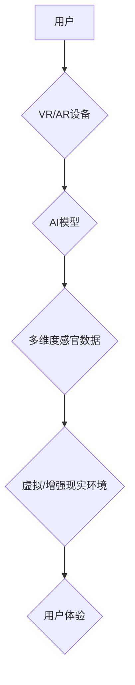

> 多维度体验，AI生成，感官世界，交互设计，虚拟现实，增强现实，神经网络，深度学习

## 1. 背景介绍

随着人工智能技术的飞速发展，我们正处于一个前所未有的时代。AI不再是科幻小说中的幻想，而是日益融入我们生活的现实。从智能手机的语音助手到自动驾驶汽车，AI正在改变着我们的生活方式。而在这场科技革命的浪潮中，一个全新的领域正在崛起：AI创造的感官世界。

传统的数字体验主要集中在视觉和听觉两个维度，而AI技术的加入，让我们能够构建更加沉浸式、多维度的感官体验。想象一下，你戴上VR头盔，进入一个由AI生成的虚拟世界，不仅能够看到和听到，还能感受到触觉、嗅觉甚至味觉的刺激。这种多维度的感官体验将彻底改变我们与数字世界的互动方式，为我们带来前所未有的沉浸感和参与度。

## 2. 核心概念与联系

**2.1 多维度体验**

多维度体验是指超越传统的视觉和听觉，融合触觉、嗅觉、味觉等多种感官刺激，创造出更加真实、沉浸式的体验。

**2.2 AI生成**

AI生成是指利用人工智能算法，从数据中学习并生成新的内容，例如图像、音频、文本、甚至虚拟环境。

**2.3 感官世界设计**

感官世界设计是指利用多维度体验和AI生成技术，构建虚拟或增强现实环境，并通过对感官刺激的精心设计，创造出更加逼真、沉浸式的体验。

**2.4 架构图**



## 3. 核心算法原理 & 具体操作步骤

**3.1 算法原理概述**

构建AI创造的感官世界，需要多种算法协同工作。其中，深度学习算法在感官数据生成和处理方面发挥着关键作用。

* **生成对抗网络 (GAN)**：GAN由两个网络组成，一个是生成器，负责生成感官数据；另一个是鉴别器，负责判断数据是否真实。两者相互竞争，最终生成逼真的感官数据。
* **变分自编码器 (VAE)**：VAE通过学习数据的潜在表示，能够生成新的数据，并控制生成的数据的属性。
* **强化学习 (RL)**：RL可以训练AI模型，使其能够根据用户的反馈调整感官刺激，从而提供更加个性化的体验。

**3.2 算法步骤详解**

1. **数据收集和预处理**: 收集大量真实感官数据，例如图像、音频、触觉、嗅觉等，并进行预处理，例如降噪、格式转换等。
2. **模型训练**: 利用深度学习算法，训练生成模型，使其能够生成逼真的感官数据。
3. **环境构建**: 利用生成的感官数据，构建虚拟或增强现实环境。
4. **交互设计**: 设计用户与虚拟环境的交互方式，例如手势控制、语音识别等。
5. **体验测试**: 进行用户体验测试，收集用户反馈，并根据反馈调整模型和环境。

**3.3 算法优缺点**

* **优点**: 能够生成逼真的感官体验，提升用户沉浸感和参与度。
* **缺点**: 需要大量的数据进行训练，训练过程复杂且耗时。

**3.4 算法应用领域**

* **游戏**: 创建更加沉浸式的游戏体验。
* **教育**: 提供更加生动的学习体验。
* **医疗**: 用于治疗恐惧症、创伤后应激障碍等。
* **娱乐**: 创建新的娱乐体验，例如虚拟音乐会、虚拟博物馆等。

## 4. 数学模型和公式 & 详细讲解 & 举例说明

**4.1 数学模型构建**

构建AI创造的感官世界，需要建立数学模型来描述感官数据和用户体验。例如，我们可以使用以下模型来描述用户的视觉体验：

* **颜色空间**: 使用RGB或HSV等颜色空间来描述颜色。
* **光照模型**: 使用Phong模型或Blinn-Phong模型来模拟光照效果。
* **透视投影**: 使用透视投影变换来模拟用户的视角。

**4.2 公式推导过程**

例如，我们可以使用以下公式来计算物体在屏幕上的颜色：

$$
C = I * L + A
$$

其中：

* $C$ 是物体在屏幕上的颜色。
* $I$ 是物体的颜色。
* $L$ 是光源的颜色。
* $A$ 是环境光。

**4.3 案例分析与讲解**

例如，我们可以使用上述模型来模拟一个球体在不同光照条件下的颜色变化。

* 当球体处于均匀光照下时，其颜色将与物体的颜色一致。
* 当球体处于阴影下时，其颜色将变暗。
* 当球体处于光源的直接照射下时，其颜色将更加明亮。

## 5. 项目实践：代码实例和详细解释说明

**5.1 开发环境搭建**

* 操作系统：Windows/macOS/Linux
* 编程语言：Python
* 深度学习框架：TensorFlow/PyTorch
* 虚拟现实/增强现实框架：Unity/Unreal Engine

**5.2 源代码详细实现**

```python
# 使用TensorFlow生成图像数据
import tensorflow as tf

# 定义生成器模型
generator = tf.keras.Sequential([
    # ...
])

# 定义判别器模型
discriminator = tf.keras.Sequential([
    # ...
])

# 训练模型
for epoch in range(num_epochs):
    # ...
```

**5.3 代码解读与分析**

* 代码首先定义了生成器和判别器模型。
* 然后，使用训练数据训练模型。
* 训练过程中，生成器试图生成逼真的图像数据，而判别器试图区分真实图像和生成图像。
* 通过不断的训练，生成器能够生成越来越逼真的图像数据。

**5.4 运行结果展示**

运行代码后，可以生成一系列逼真的图像数据。

## 6. 实际应用场景

**6.1 游戏**

AI创造的感官世界可以为游戏带来更加沉浸式的体验。例如，游戏中的角色可以根据玩家的情绪做出不同的反应，游戏环境可以根据玩家的行动发生变化。

**6.2 教育**

AI创造的感官世界可以为教育提供更加生动的学习体验。例如，学生可以身临其境地体验历史事件，或者探索宇宙的奥秘。

**6.3 医疗**

AI创造的感官世界可以用于治疗恐惧症、创伤后应激障碍等。例如，患者可以身临其境地体验虚拟环境，并逐渐克服恐惧。

**6.4 未来应用展望**

随着AI技术的不断发展，AI创造的感官世界将应用于更多领域，例如：

* **社交互动**: 创建更加真实的虚拟社交环境。
* **艺术创作**: 帮助艺术家创作更加富有创意的作品。
* **产品设计**: 帮助设计师更加直观地体验产品。

## 7. 工具和资源推荐

**7.1 学习资源推荐**

* **书籍**:
    * 《深度学习》
    * 《Generative Deep Learning》
* **在线课程**:
    * Coursera: Deep Learning Specialization
    * Udacity: Deep Learning Nanodegree

**7.2 开发工具推荐**

* **深度学习框架**: TensorFlow, PyTorch
* **虚拟现实/增强现实框架**: Unity, Unreal Engine

**7.3 相关论文推荐**

* 《Generative Adversarial Networks》
* 《Variational Autoencoders for Generation》

## 8. 总结：未来发展趋势与挑战

**8.1 研究成果总结**

AI创造的感官世界是一个充满潜力的领域，已经取得了一些令人瞩目的成果。例如，GAN能够生成逼真的图像和视频，VAE能够生成新的数据，RL能够训练AI模型，使其能够根据用户的反馈调整感官刺激。

**8.2 未来发展趋势**

未来，AI创造的感官世界将朝着以下方向发展：

* **更加逼真的感官体验**: 通过改进算法和硬件，创造更加逼真的触觉、嗅觉和味觉体验。
* **更加个性化的体验**: 利用用户数据，为每个用户提供个性化的感官体验。
* **更加交互性的体验**: 允许用户与虚拟环境进行更加自然的交互。

**8.3 面临的挑战**

AI创造的感官世界也面临一些挑战：

* **数据获取**: 需要大量真实感官数据进行训练。
* **算法复杂度**: 训练AI模型需要强大的计算能力。
* **伦理问题**: 需要考虑AI创造的感官世界可能带来的伦理问题，例如虚拟现实成瘾、虚假信息传播等。

**8.4 研究展望**

尽管面临挑战，但AI创造的感官世界仍然是一个充满希望的领域。未来，我们将继续探索新的算法和技术，创造更加逼真、沉浸式和个性化的感官体验。

## 9. 附录：常见问题与解答

**9.1 如何获取真实感官数据？**

可以从以下几个方面获取真实感官数据：

* **公开数据集**: 许多研究机构和公司已经发布了公开的感官数据。
* **传感器采集**: 使用传感器采集用户的感官数据，例如触觉传感器、嗅觉传感器、味觉传感器等。
* **用户生成内容**: 鼓励用户生成感官数据，例如上传照片、视频、音频等。

**9.2 如何训练AI模型？**

训练AI模型需要以下步骤：

* **数据预处理**: 对数据进行清洗、格式转换等预处理。
* **模型选择**: 选择合适的深度学习算法，例如GAN、VAE、RL等。
* **模型训练**: 使用训练数据训练模型，并调整模型参数。
* **模型评估**: 使用测试数据评估模型的性能。

**9.3 AI创造的感官世界有哪些伦理问题？**

AI创造的感官世界可能带来以下伦理问题：

* **虚拟现实成瘾**: 用户沉迷于虚拟世界，忽略现实生活。
* **虚假信息传播**: AI生成的虚假感官数据可能被用于传播虚假信息。
* **隐私泄露**: 用户的感官数据可能被收集和利用，侵犯用户的隐私。


作者：禅与计算机程序设计艺术 / Zen and the Art of Computer Programming 
<end_of_turn>