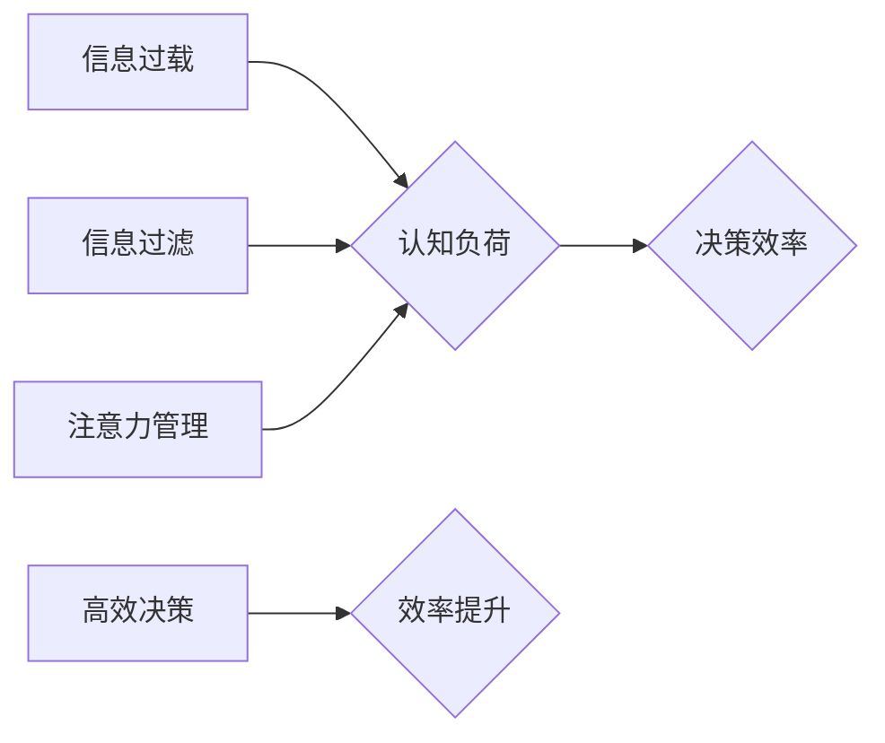

> 信息过载，认知负荷，决策，信息过滤，注意力管理，效率提升

## 1. 背景介绍

在当今信息爆炸的时代，我们每天都被海量的信息包围。从新闻推送到社交媒体，从电子邮件到会议通知，信息源源不断地涌入我们的视野。然而，并非所有信息都具有价值，过多的信息反而会造成信息过载，导致认知负荷过高，影响我们的工作效率和决策能力。

信息过载是指个体在短时间内接收和处理信息量过大，导致认知能力超负荷运转，难以有效地理解、记忆和利用信息的状态。认知负荷是指个体在进行认知活动时，大脑所消耗的资源量。当信息量过大时，认知负荷就会增加，从而影响我们的注意力、记忆、判断和决策能力。

信息过载和认知负荷已经成为现代社会普遍面临的挑战。它不仅影响着我们的个人生活，也对企业、组织和社会发展产生了负面影响。

## 2. 核心概念与联系

**2.1 信息过载**

信息过载是指个体在短时间内接收和处理信息量过大，导致认知能力超负荷运转，难以有效地理解、记忆和利用信息的状态。

**2.2 认知负荷**

认知负荷是指个体在进行认知活动时，大脑所消耗的资源量。

**2.3 决策**

决策是指在面对多个选择时，选择最优方案的过程。

**2.4 信息过滤**

信息过滤是指从海量信息中筛选出有价值的信息，并将其传递给决策者。

**2.5 注意力管理**

注意力管理是指控制和调节自己的注意力，专注于重要信息，避免被无关信息干扰。

**2.6 效率提升**

效率提升是指在相同的时间内完成更多工作，或在相同的工作量下节省时间。

**2.7  信息过载与认知负荷的关系**

信息过载会导致认知负荷过高，从而影响决策效率。

**2.8  信息过滤与注意力管理的关系**

信息过滤和注意力管理可以有效降低认知负荷，提高决策效率。

**2.9  决策与效率提升的关系**

高效的决策可以提高工作效率，促进个人和组织发展。

**Mermaid 流程图**



## 3. 核心算法原理 & 具体操作步骤

### 3.1  算法原理概述

信息过滤和注意力管理算法的核心原理是利用机器学习和自然语言处理技术，对信息进行分类、排序和筛选，帮助用户识别重要信息，并集中注意力处理。

### 3.2  算法步骤详解

1. **数据收集和预处理:** 收集各种类型的文本数据，例如新闻文章、电子邮件、社交媒体帖子等，并进行预处理，例如去除停用词、分词、词性标注等。
2. **特征提取:** 利用自然语言处理技术，提取文本数据中的关键特征，例如关键词、主题、情感倾向等。
3. **模型训练:** 利用机器学习算法，训练一个信息过滤和注意力管理模型，该模型能够根据提取的特征，对信息进行分类、排序和筛选。
4. **信息过滤:** 将新接收到的信息输入到训练好的模型中，模型会根据其特征，将其过滤成不同类别，例如重要信息、紧急信息、娱乐信息等。
5. **注意力管理:** 模型会根据用户的偏好和需求，将重要信息呈现在用户的视野中，并通过各种方式，例如颜色、字体、位置等，引导用户的注意力集中在关键信息上。

### 3.3  算法优缺点

**优点:**

* **自动化信息过滤:** 可以自动识别和过滤无关信息，节省用户的时间和精力。
* **个性化注意力管理:** 可以根据用户的偏好和需求，定制化地管理注意力。
* **提高决策效率:** 通过提供更精准的信息和引导注意力，可以帮助用户做出更快速、更准确的决策。

**缺点:**

* **模型训练数据依赖:** 模型的性能取决于训练数据的质量和数量。
* **算法解释性不足:** 一些机器学习算法的内部机制难以解释，这可能会导致用户对模型结果的信任度降低。
* **隐私安全问题:** 信息过滤和注意力管理算法可能会收集用户的个人信息，需要妥善处理隐私安全问题。

### 3.4  算法应用领域

信息过滤和注意力管理算法在各个领域都有广泛的应用，例如：

* **新闻资讯:** 自动过滤新闻，推荐用户感兴趣的内容。
* **社交媒体:** 过滤垃圾信息，推荐用户关注的人和话题。
* **电子邮件:** 自动分类邮件，优先显示重要邮件。
* **教育:** 个性化学习推荐，帮助学生集中注意力学习。
* **医疗:** 辅助医生诊断，快速筛选患者信息。

## 4. 数学模型和公式 & 详细讲解 & 举例说明

### 4.1  数学模型构建

信息过滤和注意力管理算法通常使用概率模型来表示信息的重要性、用户偏好和注意力分布。

**4.1.1 信息重要性模型:**

可以使用贝叶斯网络或条件随机场等模型来预测信息的潜在重要性。

**4.1.2 用户偏好模型:**

可以使用协同过滤或深度学习等模型来学习用户的兴趣偏好。

**4.1.3 注意力分布模型:**

可以使用softmax函数或其他注意力机制来分配用户的注意力资源。

### 4.2  公式推导过程

**4.2.1 信息重要性预测:**

假设信息 $i$ 的重要性为 $P(i)$, 则可以使用贝叶斯公式来预测其重要性:

$$P(i) = \frac{P(i|F)P(F)}{P(i)}$$

其中:

* $P(i|F)$ 是信息 $i$ 在特征 $F$ 下的条件概率。
* $P(F)$ 是特征 $F$ 的先验概率。
* $P(i)$ 是信息 $i$ 的先验概率。

**4.2.2 用户偏好学习:**

可以使用协同过滤算法来学习用户的兴趣偏好。协同过滤算法基于用户的历史行为数据，预测用户对特定信息的评分或偏好。

**4.2.3 注意力分配:**

可以使用softmax函数来分配用户的注意力资源:

$$a_i = \frac{exp(e_i)}{\sum_{j=1}^{N} exp(e_j)}$$

其中:

* $a_i$ 是用户对信息 $i$ 的注意力权重。
* $e_i$ 是信息 $i$ 的特征向量与用户偏好向量的点积。
* $N$ 是信息的总数。

### 4.3  案例分析与讲解

**4.3.1 新闻推荐:**

可以使用信息重要性模型和用户偏好模型来推荐新闻文章。模型会根据用户的历史阅读记录和新闻文章的主题、关键词等特征，预测用户对特定新闻文章的兴趣程度，并将其推荐给用户。

**4.3.2 电子邮件分类:**

可以使用信息重要性模型和用户偏好模型来分类电子邮件。模型会根据电子邮件的主题、发送者、内容等特征，预测其重要性，并将其分类为“重要邮件”、“普通邮件”或“垃圾邮件”。

## 5. 项目实践：代码实例和详细解释说明

### 5.1  开发环境搭建

* 操作系统: Ubuntu 20.04
* Python 版本: 3.8
* 必要的库: numpy, pandas, scikit-learn, tensorflow

### 5.2  源代码详细实现

```python
# 信息过滤模型
from sklearn.feature_extraction.text import TfidfVectorizer
from sklearn.linear_model import LogisticRegression

# 数据加载和预处理
# ...

# 特征提取
vectorizer = TfidfVectorizer()
X = vectorizer.fit_transform(data['text'])

# 模型训练
model = LogisticRegression()
model.fit(X, data['label'])

# 信息过滤
new_text = "这是一个新的文本信息"
new_vector = vectorizer.transform([new_text])
prediction = model.predict(new_vector)

# 输出结果
print(f"新文本信息分类结果: {prediction}")

# 注意力管理模型
# ...
```

### 5.3  代码解读与分析

* **信息过滤模型:** 使用TF-IDF特征提取和逻辑回归模型进行信息过滤。TF-IDF可以衡量词在文档中的重要性，逻辑回归可以根据特征预测信息类别。
* **注意力管理模型:** 可以使用深度学习模型，例如Transformer，来学习用户偏好和注意力分布。

### 5.4  运行结果展示

运行代码后，可以得到新文本信息的分类结果，例如“重要信息”、“普通信息”或“垃圾信息”。

## 6. 实际应用场景

### 6.1  新闻资讯平台

* **个性化新闻推荐:** 根据用户的阅读历史和兴趣偏好，推荐相关新闻文章。
* **信息过滤:** 自动过滤垃圾信息和广告，提高用户阅读体验。

### 6.2  社交媒体平台

* **内容推荐:** 推荐用户可能感兴趣的帖子、视频和图片。
* **信息筛选:** 过滤垃圾信息、谣言和恶意内容，营造健康的用户社区。

### 6.3  电子邮件系统

* **邮件分类:** 自动分类邮件为“重要邮件”、“普通邮件”或“垃圾邮件”。
* **邮件提醒:** 根据邮件内容，提醒用户关注重要信息。

### 6.4  未来应用展望

随着人工智能技术的不断发展，信息过滤和注意力管理算法将在更多领域得到应用，例如：

* **教育:** 个性化学习推荐，帮助学生集中注意力学习。
* **医疗:** 辅助医生诊断，快速筛选患者信息。
* **金融:** 识别金融欺诈，提高风险管理效率。

## 7. 工具和资源推荐

### 7.1  学习资源推荐

* **书籍:**
    * 《深度学习》
    * 《自然语言处理》
    * 《机器学习实战》
* **在线课程:**
    * Coursera: 深度学习、自然语言处理
    * edX: 机器学习、数据科学

### 7.2  开发工具推荐

* **Python:** 广泛应用于人工智能开发。
* **TensorFlow:** 深度学习框架。
* **PyTorch:** 深度学习框架。
* **Scikit-learn:** 机器学习库。

### 7.3  相关论文推荐

* **Attention Is All You Need:** https://arxiv.org/abs/1706.03762
* **BERT: Pre-training of Deep Bidirectional Transformers for Language Understanding:** https://arxiv.org/abs/1810.04805

## 8. 总结：未来发展趋势与挑战

### 8.1  研究成果总结

信息过滤和注意力管理算法取得了显著的进展，能够有效地帮助用户处理海量信息，提高决策效率。

### 8.2  未来发展趋势

* **更精准的信息过滤:** 利用更先进的机器学习算法和自然语言处理技术，提高信息过滤的精准度。
* **更个性化的注意力管理:** 根据用户的不同需求和场景，提供更个性化的注意力管理方案。
* **跨模态信息处理:** 将文本、图像、音频等多种模态信息融合，实现更全面的信息过滤和注意力管理。

### 8.3  面临的挑战

* **算法解释性不足:** 一些深度学习算法的内部机制难以解释，这可能会导致用户对模型结果的信任度降低。
* **数据隐私安全:** 信息过滤和注意力管理算法可能会收集用户的个人信息，需要妥善处理隐私安全问题。
* **算法公平性:** 算法训练数据可能存在偏差，导致算法结果不公平。

### 8.4  研究展望

未来研究将重点关注以下几个方面:

* **提高算法解释性:** 研究更易于解释的机器学习算法，提高用户对模型