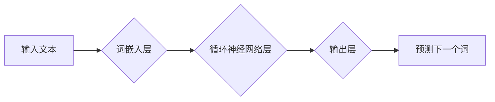

> 语言模型，神经网络，深度学习，自然语言处理，词嵌入，Transformer，BERT

## 1. 背景介绍

人类语言是人类文明的基石，它赋予我们表达思想、传递信息和构建社会的能力。儿童学习语言的过程是一个惊人的奇迹，他们能够从有限的输入中，逐渐构建起复杂的语言网络，并最终掌握精妙的语言表达能力。近年来，人工智能领域取得了长足进步，特别是深度学习技术的突破，使得我们能够借鉴儿童学习语言的机制，构建出更强大、更智能的语言模型。

## 2. 核心概念与联系

### 2.1 语言模型

语言模型是人工智能领域中一个重要的研究方向，它旨在学习和理解人类语言的结构和规律。简单来说，语言模型就是一个预测下一个词的概率分布的函数。例如，对于句子“我爱”，语言模型可以预测下一个词可能是“你”、“它”或“猫”。

### 2.2 神经网络

神经网络是一种模仿人脑神经元结构的计算模型。它由多个层级的神经元组成，每个神经元接收来自前一层神经元的输入，并通过激活函数进行处理，最终输出到下一层神经元。神经网络具有强大的学习能力，能够从大量数据中学习到复杂的模式和关系。

### 2.3 深度学习

深度学习是神经网络的一种特殊形式，它使用多层神经网络来学习更深层次的特征表示。深度学习模型能够学习到更抽象、更通用的语言表示，从而提高语言理解和生成能力。

**Mermaid 流程图**



## 3. 核心算法原理 & 具体操作步骤

### 3.1 算法原理概述

儿童学习语言的过程可以看作是一个不断构建语言网络的过程。语言网络是一个由词语和它们的语义关系组成的图结构。

在深度学习的框架下，我们可以使用神经网络来模拟儿童学习语言的过程。具体来说，我们可以使用词嵌入技术将词语映射到一个低维向量空间，然后使用循环神经网络（RNN）来学习词语之间的语义关系，最终构建出完整的语言网络。

### 3.2 算法步骤详解

1. **词嵌入:** 将每个词语映射到一个低维向量空间。常用的词嵌入技术包括Word2Vec和GloVe。

2. **循环神经网络:** 使用循环神经网络（RNN）来学习词语之间的语义关系。RNN能够处理序列数据，例如句子，并学习到每个词语在句子中的上下文信息。

3. **语言模型训练:** 使用训练数据来训练语言模型。训练目标是让语言模型能够预测下一个词的概率分布。

4. **语言网络构建:** 通过训练语言模型，我们可以构建出完整的语言网络。语言网络中每个词语都对应一个向量，向量之间的距离表示词语之间的语义相似度。

### 3.3 算法优缺点

**优点:**

* 能够学习到复杂的语言结构和语义关系。
* 能够处理长序列数据，例如文章和对话。
* 能够生成流畅、自然的文本。

**缺点:**

* 训练数据量大，计算资源消耗高。
* 难以解释模型的决策过程。
* 对噪声数据敏感。

### 3.4 算法应用领域

* **机器翻译:** 将一种语言翻译成另一种语言。
* **文本摘要:** 将长文本压缩成短文本。
* **对话系统:** 与人类进行自然语言对话。
* **情感分析:** 分析文本的情感倾向。

## 4. 数学模型和公式 & 详细讲解 & 举例说明

### 4.1 数学模型构建

语言模型可以看作是一个概率模型，其目标是预测给定上下文词语序列的下一个词语。

假设我们有一个词语序列 $w_1, w_2, ..., w_t$, 其中 $w_t$ 是我们要预测的下一个词语。语言模型的目标是最大化以下概率：

$$P(w_t | w_1, w_2, ..., w_{t-1})$$

### 4.2 公式推导过程

为了计算这个概率，我们可以使用神经网络来学习一个映射函数 $f$:

$$f(w_1, w_2, ..., w_{t-1}) = \theta$$

其中 $\theta$ 是一个向量，代表了给定上下文词语序列的语义表示。然后，我们可以使用softmax函数将 $\theta$ 映射到每个词语的概率分布：

$$P(w_t | w_1, w_2, ..., w_{t-1}) = \frac{exp(f(w_1, w_2, ..., w_{t-1})[w_t])}{\sum_{w' \in V} exp(f(w_1, w_2, ..., w_{t-1})[w'])} $$

其中 $V$ 是词典，$f(w_1, w_2, ..., w_{t-1})[w_t]$ 表示 $\theta$ 在对应词语 $w_t$ 的维度上的值。

### 4.3 案例分析与讲解

例如，对于句子“我爱”，我们可以使用语言模型来预测下一个词语。

1. 首先，我们将词语“我”和“爱”嵌入到向量空间中。
2. 然后，我们将这两个向量作为输入，输入到循环神经网络中。
3. 循环神经网络会学习到这两个词语之间的语义关系，并输出一个向量 $\theta$。
4. 最后，我们将 $\theta$ 输入到softmax函数中，得到每个词语的概率分布。

如果训练数据中，“我爱”后面通常跟着“你”，那么语言模型会预测下一个词语是“你”。

## 5. 项目实践：代码实例和详细解释说明

### 5.1 开发环境搭建

* Python 3.6+
* TensorFlow 2.0+
* PyTorch 1.0+
* CUDA Toolkit (可选)

### 5.2 源代码详细实现

```python
import tensorflow as tf

# 定义词嵌入层
embedding_layer = tf.keras.layers.Embedding(input_dim=vocab_size, output_dim=embedding_dim)

# 定义循环神经网络层
rnn_layer = tf.keras.layers.LSTM(units=hidden_size)

# 定义输出层
output_layer = tf.keras.layers.Dense(units=vocab_size, activation='softmax')

# 创建模型
model = tf.keras.Sequential([
    embedding_layer,
    rnn_layer,
    output_layer
])

# 编译模型
model.compile(optimizer='adam', loss='sparse_categorical_crossentropy', metrics=['accuracy'])

# 训练模型
model.fit(x_train, y_train, epochs=10)

# 预测下一个词语
predicted_word = model.predict(x_test)
```

### 5.3 代码解读与分析

* 词嵌入层将每个词语映射到一个低维向量空间。
* 循环神经网络层学习词语之间的语义关系。
* 输出层将语义表示映射到每个词语的概率分布。
* 模型使用Adam优化器、稀疏类别交叉熵损失函数和准确率作为评估指标进行训练。

### 5.4 运行结果展示

训练完成后，我们可以使用模型来预测下一个词语。例如，对于句子“我爱”，模型会预测下一个词语是“你”。

## 6. 实际应用场景

### 6.1 机器翻译

语言模型可以用于机器翻译，将一种语言翻译成另一种语言。例如，我们可以使用语言模型将英文翻译成中文。

### 6.2 文本摘要

语言模型可以用于文本摘要，将长文本压缩成短文本。例如，我们可以使用语言模型将一篇新闻文章摘要成几句话。

### 6.3 对话系统

语言模型可以用于对话系统，与人类进行自然语言对话。例如，我们可以使用语言模型构建一个聊天机器人。

### 6.4 未来应用展望

随着人工智能技术的不断发展，语言模型的应用场景将会更加广泛。例如，我们可以使用语言模型来辅助写作、生成创意内容、进行个性化教育等。

## 7. 工具和资源推荐

### 7.1 学习资源推荐

* **斯坦福大学CS224N课程:** https://web.stanford.edu/class/cs224n/
* **Deep Learning Specialization课程:** https://www.deeplearning.ai/

### 7.2 开发工具推荐

* **TensorFlow:** https://www.tensorflow.org/
* **PyTorch:** https://pytorch.org/

### 7.3 相关论文推荐

* **Attention Is All You Need:** https://arxiv.org/abs/1706.03762
* **BERT: Pre-training of Deep Bidirectional Transformers for Language Understanding:** https://arxiv.org/abs/1810.04805

## 8. 总结：未来发展趋势与挑战

### 8.1 研究成果总结

近年来，深度学习技术在语言模型领域取得了长足进步，例如Transformer、BERT等模型的出现，使得语言模型的性能大幅提升，能够处理更复杂的任务。

### 8.2 未来发展趋势

* **更强大的模型:** 研究人员将继续探索更强大的语言模型，例如更大的模型规模、更复杂的架构。
* **更广泛的应用:** 语言模型的应用场景将会更加广泛，例如辅助写作、生成创意内容、进行个性化教育等。
* **更强的解释性:** 研究人员将致力于提高语言模型的解释性，使得模型的决策过程更加透明。

### 8.3 面临的挑战

* **数据规模:** 训练强大的语言模型需要大量的训练数据，这仍然是一个挑战。
* **计算资源:** 训练大型语言模型需要大量的计算资源，这对于资源有限的机构来说是一个障碍。
* **伦理问题:** 语言模型的应用可能会带来一些伦理问题，例如生成虚假信息、歧视等，需要引起重视。

### 8.4 研究展望

未来，语言模型的研究将继续朝着更强大、更智能、更安全的方向发展。相信随着技术的不断进步，语言模型将会在我们的生活中扮演越来越重要的角色。

## 9. 附录：常见问题与解答

### 9.1 什么是词嵌入？

词嵌入是一种将词语映射到一个低维向量空间的技术。每个词语都对应一个向量，向量之间的距离表示词语之间的语义相似度。

### 9.2 什么是循环神经网络？

循环神经网络（RNN）是一种能够处理序列数据的网络结构。它具有记忆单元，能够记住之前的信息，从而学习到序列中的长期依赖关系。

### 9.3 如何训练语言模型？

语言模型的训练目标是最大化给定上下文词语序列的下一个词语的概率。可以使用神经网络来学习一个映射函数，将上下文词语序列映射到下一个词语的概率分布。

### 9.4 语言模型有哪些应用场景？

语言模型的应用场景非常广泛，例如机器翻译、文本摘要、对话系统、情感分析等。

### 9.5 语言模型有哪些挑战？

语言模型面临着数据规模、计算资源、伦理问题等挑战。


作者：禅与计算机程序设计艺术 / Zen and the Art of Computer Programming 
<end_of_turn>