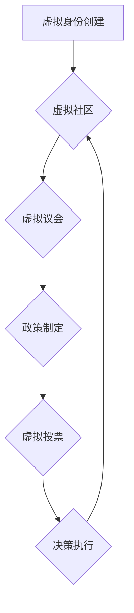

> 元宇宙、政党、虚拟组织、政治参与、数字身份、去中心化、区块链、人工智能

## 1. 背景介绍

随着科技的飞速发展，元宇宙概念逐渐从科幻小说走向现实。元宇宙，一个由虚拟现实、增强现实和互联网相互融合构建的沉浸式数字世界，正在为我们提供全新的生活、工作和社交方式。在这个虚拟世界中，人们可以创建虚拟身份，参与虚拟活动，并与他人进行互动。

然而，元宇宙的出现也引发了人们对虚拟世界政治组织形式的思考。传统政治组织的模式能否适应元宇宙环境？新的政治组织形式又会如何运作？本文将探讨元宇宙政党的概念、运作机制、技术基础以及未来发展趋势，并分析其对传统政治体系的影响。

## 2. 核心概念与联系

元宇宙政党是指在元宇宙环境中运作的虚拟政治组织。它们利用元宇宙的特性，例如虚拟身份、沉浸式体验、去中心化等，构建新的政治参与模式。

**元宇宙政党的核心概念包括：**

* **虚拟身份:** 元宇宙政党成员可以通过创建虚拟身份参与政治活动，不受地域和现实身份的限制。
* **沉浸式体验:** 元宇宙政党可以利用虚拟现实技术创造沉浸式的政治活动场景，例如虚拟议会、虚拟集会等，增强成员的参与感和互动性。
* **去中心化:** 元宇宙政党可以采用去中心化的组织架构，例如区块链技术，实现成员对决策的参与和监督。
* **数据驱动:** 元宇宙政党可以收集和分析成员的虚拟行为数据，了解他们的政治诉求和偏好，从而制定更精准的政策。

**元宇宙政党与传统政党的联系:**

| 特征 | 元宇宙政党 | 传统政党 |
|---|---|---|
| 组织形式 | 虚拟、去中心化 | 实体、中心化 |
| 成员构成 | 虚拟身份 | 现实身份 |
| 政治活动 | 虚拟会议、投票 | 线下集会、投票 |
| 决策机制 | 数据驱动、去中心化投票 | 领导层决策 |
| 参与方式 | 沉浸式体验、虚拟互动 | 线下参与、媒体传播 |

**元宇宙政党架构流程图:**



## 3. 核心算法原理 & 具体操作步骤

元宇宙政党的运作需要依赖于一系列核心算法，例如虚拟身份认证、去中心化投票、数据分析等。

### 3.1  算法原理概述

* **虚拟身份认证:** 利用区块链技术生成不可篡改的虚拟身份，确保成员身份的唯一性和安全性。
* **去中心化投票:** 通过加密算法和智能合约，实现成员对政策的匿名投票，保证投票结果的公正性和透明度。
* **数据分析:** 利用机器学习算法分析成员的虚拟行为数据，例如参与度、投票记录、意见表达等，预测他们的政治倾向和政策偏好。

### 3.2  算法步骤详解

**虚拟身份认证算法步骤:**

1. 用户注册并提交身份信息。
2. 系统利用区块链技术生成用户的虚拟身份标识符。
3. 用户使用标识符登录元宇宙平台，验证身份。

**去中心化投票算法步骤:**

1. 元宇宙政党发布投票提案。
2. 成员使用虚拟身份投票，选择支持或反对。
3. 智能合约自动计算投票结果，并公布最终结果。

**数据分析算法步骤:**

1. 收集成员的虚拟行为数据，例如参与活动、投票记录、论坛发言等。
2. 利用机器学习算法对数据进行分析，识别成员的政治倾向和政策偏好。
3. 生成数据报告，为政党决策提供参考。

### 3.3  算法优缺点

**优点:**

* **安全性:** 区块链技术确保身份和投票结果的不可篡改性。
* **透明度:** 所有投票记录和数据分析结果公开透明。
* **参与度:** 虚拟身份和沉浸式体验提高成员的参与度和互动性。

**缺点:**

* **技术门槛:** 元宇宙政党的运作需要一定的技术基础和支持。
* **监管挑战:** 如何监管元宇宙政党的活动，防止虚假信息和恶意攻击，是一个需要解决的难题。
* **现实世界影响:** 元宇宙政党的决策是否能够有效地影响现实世界，还需要进一步观察和研究。

### 3.4  算法应用领域

元宇宙政党的核心算法可以应用于其他领域，例如：

* **在线社区管理:** 利用去中心化投票机制，提高社区决策的民主性和透明度。
* **数据分析和预测:** 利用机器学习算法，分析用户行为数据，预测用户需求和市场趋势。
* **数字身份认证:** 利用区块链技术，构建安全可靠的数字身份认证系统。

## 4. 数学模型和公式 & 详细讲解 & 举例说明

元宇宙政党的运作可以抽象为一个数学模型，其中涉及到成员数量、投票权重、决策阈值等因素。

### 4.1  数学模型构建

假设元宇宙政党有N个成员，每个成员拥有不同的投票权重，记为w1, w2, ..., wN。决策阈值设定为T，即需要超过T的投票权重才能通过决策。

### 4.2  公式推导过程

* **投票权重计算:** 每个成员的投票权重可以根据其参与度、贡献度、资历等因素进行计算。例如，可以采用以下公式计算成员的投票权重：

$$w_i = a \cdot p_i + b \cdot c_i + d \cdot t_i$$

其中：

* $w_i$：成员i的投票权重
* $p_i$：成员i的参与度
* $c_i$：成员i的贡献度
* $t_i$：成员i的资历
* $a$, $b$, $d$：权重系数

* **决策阈值设定:** 决策阈值可以根据政党的规模和决策机制进行设定。例如，可以采用以下公式计算决策阈值：

$$T = \frac{N}{2} \cdot w_{avg}$$

其中：

* $T$：决策阈值
* $N$：成员总数
* $w_{avg}$：平均投票权重

### 4.3  案例分析与讲解

假设一个元宇宙政党有100个成员，平均投票权重为0.5。根据公式计算，决策阈值为50。这意味着，只要超过50个成员的投票权重支持一项决策，该决策就能够通过。

## 5. 项目实践：代码实例和详细解释说明

为了更好地理解元宇宙政党的运作机制，我们可以通过代码实例进行实践。以下是一个简单的虚拟投票系统代码示例，使用Python语言实现。

### 5.1  开发环境搭建

* Python 3.x
* Flask web framework

### 5.2  源代码详细实现

```python
from flask import Flask, render_template, request

app = Flask(__name__)

# 存储投票结果
votes = {}

@app.route('/')
def index():
    return render_template('index.html')

@app.route('/vote', methods=['POST'])
def vote():
    choice = request.form['choice']
    member_id = request.form['member_id']

    if member_id not in votes:
        votes[member_id] = {'support': 0, 'against': 0}

    if choice == 'support':
        votes[member_id]['support'] += 1
    else:
        votes[member_id]['against'] += 1

    return '投票成功!'

if __name__ == '__main__':
    app.run(debug=True)
```

### 5.3  代码解读与分析

* **index.html:** 负责展示投票页面，包含两个选项：支持和反对。
* **vote:** 处理投票请求，将投票结果存储在votes字典中。
* **app.run(debug=True):** 启动Flask web服务器。

### 5.4  运行结果展示

运行代码后，访问http://127.0.0.1:5000/，即可看到投票页面。选择支持或反对选项，并提交投票，投票结果将被记录在votes字典中。

## 6. 实际应用场景

元宇宙政党可以应用于以下场景：

* **虚拟社区治理:** 元宇宙政党可以帮助虚拟社区制定规则、管理资源、解决冲突，提高社区的自治性和活力。
* **跨国合作:** 元宇宙政党可以打破地域限制，连接不同国家的成员，促进跨国合作和交流。
* **公民参与:** 元宇宙政党可以为公民提供更便捷、更直观的参与政治的方式，提高公民的政治意识和参与度。

### 6.4  未来应用展望

随着元宇宙技术的不断发展，元宇宙政党将发挥越来越重要的作用。未来，元宇宙政党可能会：

* **更加智能化:** 利用人工智能技术，自动分析数据、预测趋势、制定政策。
* **更加去中心化:** 采用更先进的去中心化技术，实现成员对政党决策的更大参与和控制。
* **更加多元化:** 出现各种类型的元宇宙政党，满足不同成员的需求和诉求。

## 7. 工具和资源推荐

### 7.1  学习资源推荐

* **元宇宙技术基础:**
    * 《元宇宙：虚拟世界与现实世界的融合》
    * 《元宇宙：未来世界的构建》
* **区块链技术:**
    * 《区块链：从原理到应用》
    * 《区块链技术入门》
* **人工智能技术:**
    * 《深度学习》
    * 《机器学习》

### 7.2  开发工具推荐

* **虚拟现实开发平台:** Unity、Unreal Engine
* **区块链开发框架:** Ethereum、Hyperledger Fabric
* **人工智能开发库:** TensorFlow、PyTorch

### 7.3  相关论文推荐

* **元宇宙政党:**
    * "The Metaverse Party: A New Form of Political Organization"
    * "Decentralized Governance in the Metaverse"
* **区块链技术在政治领域的应用:**
    * "Blockchain for Democracy: A Survey"
    * "Using Blockchain to Enhance Transparency and Accountability in Government"

## 8. 总结：未来发展趋势与挑战

元宇宙政党是一个新兴的政治组织形式，它具有独特的优势和挑战。未来，元宇宙政党将随着元宇宙技术的不断发展而演进，并对传统政治体系产生深远的影响。

### 8.1  研究成果总结

* 元宇宙政党可以利用虚拟身份、沉浸式体验、去中心化等特性，构建新的政治参与模式。
* 元宇宙政党的运作需要依赖于一系列核心算法，例如虚拟身份认证、去中心化投票、数据分析等。
* 元宇宙政党可以应用于虚拟社区治理、跨国合作、公民参与等场景。

### 8.2  未来发展趋势

* 元宇宙政党将更加智能化、去中心化、多元化。
* 元宇宙政党将与其他技术融合，例如人工智能、物联网、大数据等。
* 元宇宙政党将成为未来政治组织的重要组成部分。

### 8.3  面临的挑战

* 如何监管元宇宙政党的活动，防止虚假信息和恶意攻击。
* 如何确保元宇宙政党的决策能够有效地影响现实世界。
* 如何提高元宇宙政党的可信度和公信力。

### 8.4  研究展望

* 深入研究元宇宙政党的运作机制和影响因素。
* 开发更安全、更可靠的元宇宙政党技术平台。
* 探讨元宇宙政党与传统政治体系的融合模式。

## 9. 附录：常见问题与解答

**Q1: 元宇宙政党是否会取代传统政党？**

**A1:** 元宇宙政党和传统政党各有优缺点，它们