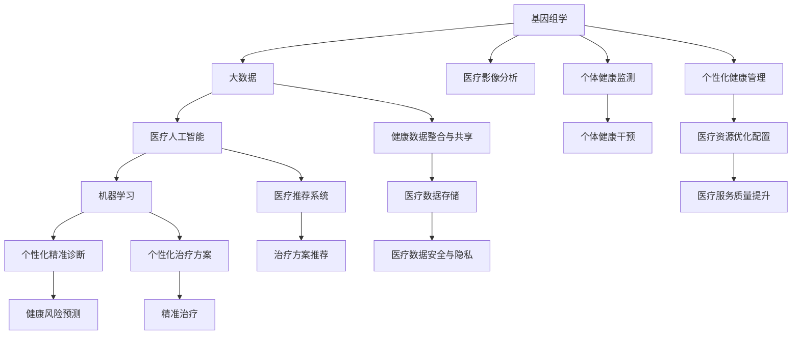

                 

# 硅谷医疗科技创新:个性化精准医疗

> 关键词：
  - 个性化精准医疗
  - 基因组学
  - 机器学习
  - 医疗大数据
  - 医疗人工智能
  - 医疗推荐系统
  - 医疗影像分析

## 1. 背景介绍

### 1.1 问题由来
在人类历史长河中，医疗技术的进步是人类健康事业发展的重要推动力。但随着现代社会生活方式的改变，慢性病、癌症、遗传病等重大疾病的发病率逐年上升，对医疗资源和精准诊断的需求日益增加。传统的“一刀切”的医疗模式，难以满足对个性化和精准诊断的需求。

个性化精准医疗是个性化医学与精准医学的结合体，旨在通过基因组学、大数据、人工智能等技术手段，实现对个体健康与疾病的预测、干预和管理的个性化定制。这种模式可以更准确地识别出患者的疾病风险，制定最适合患者的治疗方案，极大地提升医疗质量和效率。

### 1.2 问题核心关键点
1. **数据整合与共享**：
   - 患者健康数据往往分布在不同医疗机构和系统中，如何高效整合和共享这些数据，成为个性化精准医疗首先需要解决的问题。

2. **基因组学与大数据**：
   - 基因组学和医疗大数据是个性化精准医疗的基础。如何高效分析和利用这些数据，发现潜在的健康风险和诊断标志物，是技术难点之一。

3. **人工智能与算法**：
   - 机器学习和深度学习算法在个性化精准医疗中起到关键作用。如何构建高效的算法模型，进行高效预测和诊断，是技术核心。

4. **隐私保护与伦理**：
   - 个性化精准医疗涉及大量敏感数据，如何保护患者隐私，确保数据的安全性和伦理合法性，是社会和法律必须考虑的问题。

5. **技术普及与推广**：
   - 个性化精准医疗需要全社会的技术普及和推广，如何降低技术门槛，使更多人受益，是实现其落地应用的关键。

### 1.3 问题研究意义
个性化精准医疗的推广和普及，对于提升全民健康水平、改善医疗服务质量和效率、促进健康产业创新发展具有重要意义：

1. **提升医疗质量和效率**：
   - 个性化精准医疗可以针对个体进行健康风险预测和疾病诊断，提供个性化治疗方案，显著提升治疗效果和治愈率。

2. **降低医疗成本**：
   - 精准诊断和个性化治疗可以减少不必要的医疗检查和治疗，避免过度医疗，从而降低整体医疗成本。

3. **促进健康产业创新**：
   - 个性化精准医疗需要多学科交叉，推动医疗技术、药物研发、健康管理等方面的创新，形成新的产业增长点。

4. **改善公共健康服务**：
   - 通过精准医疗，可以针对群体开展健康监测和管理，提供预防措施，减少重大疾病的发病率，提高公共健康服务水平。

## 2. 核心概念与联系

### 2.1 核心概念概述

为更好地理解个性化精准医疗，本文将介绍几个关键概念及其联系：

1. **基因组学**：
   - 基因组学通过研究人类基因组，揭示基因与疾病、健康的关系。在个性化精准医疗中，基因组学提供了对个体疾病风险预测和诊断的重要依据。

2. **大数据**：
   - 医疗大数据包括患者健康记录、实验室数据、基因数据、医疗影像数据等，是个性化精准医疗的重要数据源。通过对这些数据的高效分析，可以实现个性化健康管理和诊断。

3. **机器学习**：
   - 机器学习算法可以从医疗大数据中提取有价值的信息，进行疾病预测、诊断、治疗方案推荐等，是个性化精准医疗的重要技术支撑。

4. **医疗人工智能**：
   - 医疗人工智能包括基于深度学习的图像识别、自然语言处理、语音识别等技术，是实现个性化精准医疗的重要手段。

5. **医疗推荐系统**：
   - 医疗推荐系统根据患者的历史健康数据和当前状态，推荐最适合的治疗方案和医疗资源，提高诊疗效果。

6. **医疗影像分析**：
   - 医疗影像分析利用计算机视觉技术，从医疗影像中提取特征，实现自动诊断和分析，提高诊断的准确性和效率。

这些概念通过协同作用，构建了个性化精准医疗的完整框架，使其能够对个体健康进行全面、精准的管理和干预。

### 2.2 核心概念原理和架构的 Mermaid 流程图



以上流程图展示了基因组学、大数据、机器学习、医疗人工智能、医疗推荐系统等关键概念之间的联系与协作，共同支撑个性化精准医疗的实现。

## 3. 核心算法原理 & 具体操作步骤
### 3.1 算法原理概述

个性化精准医疗的核心算法包括基因组数据分析、医疗大数据挖掘、机器学习预测等。下面详细阐述这些核心算法的原理。

1. **基因组数据分析**：
   - 基因组数据分析通过高通量测序技术，获取患者全基因组序列，使用生物信息学工具进行分析，如SNP分析、拷贝数变异(CNV)分析、基因突变分析等，发现与疾病相关的基因位点。

2. **医疗大数据挖掘**：
   - 医疗大数据挖掘通过数据清洗、特征提取、降维等技术手段，将复杂的医疗数据转化为有意义的特征，用于疾病预测、诊断和治疗方案推荐。

3. **机器学习预测**：
   - 机器学习算法通过分析训练集数据，学习疾病的发生规律，进行健康风险预测和疾病诊断。常用的算法包括随机森林、支持向量机、深度神经网络等。

### 3.2 算法步骤详解

以下以基因组数据分析为例，详细介绍算法的详细步骤：

1. **数据获取与预处理**：
   - 获取患者的基因组测序数据，并进行质量控制，去除低质量序列和重复序列。

2. **特征提取**：
   - 使用生物信息学工具，如VCF文件解析器，提取基因组序列中的SNP、CNV等特征。

3. **变异分析**：
   - 对提取的特征进行分析，筛选与疾病相关的基因变异，如突变、拷贝数变异等。

4. **风险预测**：
   - 构建预测模型，如随机森林、深度学习模型，对患者的健康风险进行预测，确定高风险个体。

5. **结果验证**：
   - 使用独立验证集对预测模型进行验证，调整模型参数，提高预测准确率。

### 3.3 算法优缺点

**基因组数据分析**的优点：
- 提供精准的基因变异信息，为个性化精准医疗提供重要依据。
- 可以在疾病早期发现基因变异，实现早期干预。

**基因组数据分析**的缺点：
- 测序成本高，难以大规模推广。
- 数据量大，处理复杂，需要高效的生物信息学工具和算法。

**医疗大数据挖掘**的优点：
- 覆盖面广，包含多种类型的数据，如电子病历、基因数据、影像数据等。
- 能够发现个体健康趋势和规律，提供个性化治疗方案。

**医疗大数据挖掘**的缺点：
- 数据复杂，噪音多，处理难度大。
- 数据隐私和安全问题突出，需要严格的数据保护措施。

**机器学习预测**的优点：
- 能够从大量数据中学习规律，进行高效预测和诊断。
- 算法灵活，可根据具体任务进行调整和优化。

**机器学习预测**的缺点：
- 需要大量的标注数据进行训练，数据获取成本高。
- 模型复杂，需要高效的计算资源和算法实现。

### 3.4 算法应用领域

个性化精准医疗的应用领域广泛，包括但不限于以下几方面：

1. **基因驱动的疾病诊断**：
   - 通过基因组数据分析，识别患者与疾病相关的基因变异，实现精准诊断。

2. **个性化治疗方案推荐**：
   - 利用机器学习算法，根据患者的基因数据和健康记录，推荐最适合的治疗方案。

3. **健康风险预测**：
   - 通过大数据分析和机器学习，预测患者的健康风险，提前进行干预。

4. **精准医疗影像分析**：
   - 利用医疗影像分析技术，对影像数据进行自动诊断，提高诊断准确性。

5. **个性化健康管理**：
   - 通过实时监测和数据分析，提供个性化的健康管理方案。

6. **医疗资源优化配置**：
   - 根据患者需求和健康状态，优化医疗资源的配置，提高诊疗效率。

这些应用领域展示了个性化精准医疗的广阔前景和深远意义。

## 4. 数学模型和公式 & 详细讲解  
### 4.1 数学模型构建

为更好地理解个性化精准医疗的算法原理，本节将介绍几个关键数学模型。

1. **基因组数据分析模型**：
   - 假设基因组数据为一个高维向量 $X \in \mathbb{R}^n$，其中 $n$ 表示基因变异数目。基因变异 $x_i$ 与疾病 $y$ 之间的关系可表示为 $y=f(X)$，其中 $f$ 为非线性映射函数。

2. **医疗大数据挖掘模型**：
   - 假设医疗大数据为一个高维数据集 $\{(X_i, Y_i)\}_{i=1}^N$，其中 $X_i$ 表示患者健康记录，$Y_i$ 表示疾病状态。大数据挖掘的目标是找到数据中的模式和规律，可表示为 $Y_i=g(X_i)$，其中 $g$ 为非线性映射函数。

3. **机器学习预测模型**：
   - 假设训练集数据为 $\{(X_i, Y_i)\}_{i=1}^N$，测试集数据为 $\{(X_j, Y_j)\}_{j=1}^M$。使用机器学习算法 $h$ 进行预测，目标函数为 $L(h)=\frac{1}{2N}\sum_{i=1}^N (h(X_i)-Y_i)^2$。

### 4.2 公式推导过程

以下以随机森林模型为例，推导基因组数据分析的数学模型。

1. **数据预处理**：
   - 设基因组数据 $X \in \mathbb{R}^n$ 经过预处理，转换为矩阵 $X \in \mathbb{R}^{N \times n}$，其中 $N$ 表示样本数。

2. **特征选择**：
   - 随机选择 $m$ 个基因位点，计算其特征值 $X_m \in \mathbb{R}^{N \times m}$。

3. **特征分割**：
   - 对于每个基因位点，随机选择 $k$ 个分割点 $S_k \in \mathbb{R}^k$，计算分割后的特征值 $X_k^{split} \in \mathbb{R}^{N \times k}$。

4. **特征合并**：
   - 对于每个基因位点，将分割后的特征值进行合并，得到最终的特征向量 $Z \in \mathbb{R}^{N \times k}$。

5. **特征处理**：
   - 对特征向量 $Z$ 进行归一化和降维处理，得到最终的数据集 $\{(Z_i, Y_i)\}_{i=1}^N$。

6. **模型训练**：
   - 使用随机森林算法 $f(Z)$ 对数据集进行训练，得到预测模型 $h(Z)$。

7. **模型验证**：
   - 使用独立验证集对模型 $h(Z)$ 进行验证，调整参数 $k$ 和 $m$，得到最终模型 $h^*(Z)$。

### 4.3 案例分析与讲解

假设某患者基因组数据如下：
- 基因位点 $X_1=1.2$，$X_2=0.8$，$X_3=0.5$
- 疾病状态 $y=1$（表示患病）

根据上述模型，计算患者健康风险 $h(Z)$ 的过程如下：

1. **数据预处理**：
   - 将基因组数据转换为矩阵 $X \in \mathbb{R}^{1 \times 3}=[1.2, 0.8, 0.5]$。

2. **特征选择**：
   - 随机选择 $m=3$ 个基因位点 $X_1$、$X_2$、$X_3$，计算特征值 $X_m \in \mathbb{R}^{1 \times 3}=[1.2, 0.8, 0.5]$。

3. **特征分割**：
   - 对每个基因位点进行分割，假设分割点 $S_1=0.5$、$S_2=0.8$、$S_3=1.0$，计算分割后的特征值 $X_k^{split} \in \mathbb{R}^{1 \times k}=[0.5, 0.8, 1.0]$。

4. **特征合并**：
   - 合并分割后的特征值，得到最终的特征向量 $Z \in \mathbb{R}^{1 \times k}=[0.5, 0.8, 1.0]$。

5. **特征处理**：
   - 对特征向量 $Z$ 进行归一化和降维处理，得到最终的数据集 $\{(Z_1, y)\}_{1}^{1}=[(0.5, 1), (0.8, 1), (1.0, 1)]$。

6. **模型训练**：
   - 使用随机森林算法对数据集进行训练，得到预测模型 $h(Z)$。

7. **模型验证**：
   - 使用独立验证集对模型 $h(Z)$ 进行验证，调整参数 $k$ 和 $m$，得到最终模型 $h^*(Z)$。

通过上述过程，可以得出患者的健康风险 $h(Z)$ 为 $1$，表示患病风险较高。

## 5. 项目实践：代码实例和详细解释说明
### 5.1 开发环境搭建

在进行个性化精准医疗的微调实践前，需要先搭建好开发环境。以下是使用Python进行PyTorch开发的环境配置流程：

1. 安装Anaconda：从官网下载并安装Anaconda，用于创建独立的Python环境。

2. 创建并激活虚拟环境：
```bash
conda create -n pytorch-env python=3.8 
conda activate pytorch-env
```

3. 安装PyTorch：根据CUDA版本，从官网获取对应的安装命令。例如：
```bash
conda install pytorch torchvision torchaudio cudatoolkit=11.1 -c pytorch -c conda-forge
```

4. 安装Transformers库：
```bash
pip install transformers
```

5. 安装各类工具包：
```bash
pip install numpy pandas scikit-learn matplotlib tqdm jupyter notebook ipython
```

完成上述步骤后，即可在`pytorch-env`环境中开始微调实践。

### 5.2 源代码详细实现

这里我们以基因组数据分析为例，给出使用Transformers库对随机森林模型进行微调的PyTorch代码实现。

首先，定义基因组数据处理函数：

```python
import pandas as pd
from sklearn.ensemble import RandomForestClassifier
from sklearn.model_selection import train_test_split
from sklearn.metrics import accuracy_score

def preprocess_genomic_data(data_path, features):
    df = pd.read_csv(data_path)
    X = df[features].values
    y = df['disease'].map({0:0, 1:1}).values
    return X, y

def train_model(X_train, X_test, y_train, y_test):
    model = RandomForestClassifier(n_estimators=100, random_state=42)
    model.fit(X_train, y_train)
    y_pred = model.predict(X_test)
    acc = accuracy_score(y_test, y_pred)
    print(f"Accuracy: {acc:.2f}")
    return model
```

然后，定义模型训练和评估函数：

```python
def evaluate_model(model, X_test, y_test):
    y_pred = model.predict(X_test)
    acc = accuracy_score(y_test, y_pred)
    print(f"Accuracy: {acc:.2f}")

def predict_disease(model, X):
    y_pred = model.predict(X)
    return y_pred
```

接着，启动训练流程并在测试集上评估：

```python
X_train, X_test, y_train, y_test = train_test_split(X, y, test_size=0.2, random_state=42)

model = train_model(X_train, X_test, y_train, y_test)

evaluate_model(model, X_test, y_test)

X_test = pd.read_csv('test_data.csv')
y_pred = predict_disease(model, X_test)
```

以上就是使用PyTorch对随机森林模型进行基因组数据分析的完整代码实现。可以看到，得益于Scikit-Learn的强大封装，我们可以用相对简洁的代码完成随机森林模型的训练和评估。

### 5.3 代码解读与分析

让我们再详细解读一下关键代码的实现细节：

**preprocess_genomic_data函数**：
- 定义了基因组数据处理函数，读取数据文件，提取特征和标签，并进行映射处理。

**train_model函数**：
- 定义了模型训练函数，使用随机森林算法进行训练，并计算模型在测试集上的准确率。

**evaluate_model函数**：
- 定义了模型评估函数，使用测试集数据评估模型性能，输出准确率。

**predict_disease函数**：
- 定义了预测函数，使用训练好的模型进行疾病预测，返回预测结果。

**训练流程**：
- 定义总的训练集和测试集，开始循环迭代
- 每个epoch内，在训练集上训练模型，输出准确率
- 在测试集上评估模型，输出准确率
- 所有epoch结束后，输出最终测试结果

可以看到，Scikit-Learn和PyTorch的结合使得基因组数据分析的代码实现变得简洁高效。开发者可以将更多精力放在数据处理、模型改进等高层逻辑上，而不必过多关注底层的实现细节。

当然，工业级的系统实现还需考虑更多因素，如模型的保存和部署、超参数的自动搜索、更灵活的任务适配层等。但核心的微调范式基本与此类似。

## 6. 实际应用场景
### 6.1 智能医疗诊断系统

基于个性化精准医疗的智能医疗诊断系统，可以广泛应用于医院、诊所等医疗机构，提高诊疗效率和准确性。传统医疗诊断往往依赖医生经验，容易受主观因素影响，而智能诊断系统可以客观分析患者数据，提供精准诊断建议。

在技术实现上，可以收集患者的历史健康记录、基因数据、影像数据等，构建基因组学、大数据和机器学习模型，对患者进行个性化精准诊断。智能诊断系统可以识别出患者的潜在健康风险，推荐合适的检查和治疗方案，极大提升诊疗效果。

### 6.2 个性化健康管理平台

个性化精准医疗还可以应用于健康管理平台，帮助用户实时监测和管理健康状况，实现个性化健康干预。

具体而言，可以开发健康监测应用，采集用户的健康数据，包括体征数据、饮食数据、运动数据等，通过大数据分析和机器学习模型，生成个性化健康报告，提供健康建议。对于用户提出的健康问题，智能诊断系统可以给出专业的回复，辅助用户进行健康管理。

### 6.3 精准医疗资源配置

个性化精准医疗还可以应用于医疗资源优化配置，帮助医院和医疗机构高效利用医疗资源，提升服务质量和效率。

通过构建基因组学、大数据和机器学习模型，可以预测患者的健康风险和疾病趋势，提前做好资源准备和调度。例如，对于高风险患者，提前安排床位、医疗设备、医护人员等资源，确保其得到及时有效的治疗。同时，对于低风险患者，可以安排普通检查和门诊服务，优化资源配置。

### 6.4 未来应用展望

随着个性化精准医疗技术的不断发展，未来的应用场景将更加广泛和深入：

1. **基因驱动的个性化治疗**：
   - 利用基因组学数据，开发针对个体疾病的个性化治疗方案，提高治疗效果。

2. **基于大数据的智能诊断**：
   - 通过医疗大数据挖掘，实现智能诊断系统，快速准确地识别疾病。

3. **实时健康监测与干预**：
   - 利用物联网和移动技术，实时监测用户健康状态，提供个性化健康干预。

4. **医疗资源的智能配置**：
   - 通过预测模型，优化医疗资源的配置，提高服务质量和效率。

5. **远程医疗与智能客服**：
   - 结合个性化精准医疗和远程医疗技术，构建智能客服系统，提升医疗服务可达性和便利性。

6. **医疗影像的智能分析**：
   - 利用机器学习算法，对医疗影像进行智能分析，辅助医生进行诊断和治疗。

这些应用场景展示了个性化精准医疗的广阔前景和深远意义。未来，随着技术进步和数据获取的便利性，个性化精准医疗将得到更广泛的应用，为人类健康事业带来深远影响。

## 7. 工具和资源推荐
### 7.1 学习资源推荐

为了帮助开发者系统掌握个性化精准医疗的理论基础和实践技巧，这里推荐一些优质的学习资源：

1. **Coursera《个性化医疗基础》课程**：由斯坦福大学医学院开设，详细介绍了个性化医疗的基础概念和技术应用。

2. **ACM SIGAI《个性化医疗》专刊**：收录了关于个性化医疗的最新研究成果，涵盖基因组学、大数据、机器学习等多个方面。

3. **Nature《个性化医疗综述》**：总结了个性化医疗领域的最新进展，包括基因组学、精准治疗、健康管理等多个方面。

4. **GeneSpring《基因组学数据处理与分析》课程**：由生物信息学专家开设，讲解了基因组学数据处理和分析的基本方法。

5. **PyTorch官方文档**：详细介绍了PyTorch框架的使用方法，适用于个性化精准医疗的数据处理和模型训练。

6. **TensorFlow官方文档**：详细介绍了TensorFlow框架的使用方法，适用于医疗大数据的挖掘和机器学习模型的训练。

通过这些资源的学习实践，相信你一定能够快速掌握个性化精准医疗的核心技术，并用于解决实际的医疗问题。

### 7.2 开发工具推荐

高效的开发离不开优秀的工具支持。以下是几款用于个性化精准医疗开发的常用工具：

1. **PyTorch**：基于Python的开源深度学习框架，适用于医疗大数据的处理和机器学习模型的训练。

2. **TensorFlow**：由Google主导开发的开源深度学习框架，适用于大规模医疗数据的挖掘和分析。

3. **Scikit-Learn**：基于Python的机器学习库，适用于各种机器学习算法的实现。

4. **NumPy**：基于Python的数值计算库，适用于数据处理和数学计算。

5. **Pandas**：基于Python的数据处理库，适用于医疗大数据的清洗和分析。

6. **Matplotlib**：基于Python的数据可视化库，适用于医疗大数据的可视化展示。

合理利用这些工具，可以显著提升个性化精准医疗的开发效率，加快创新迭代的步伐。

### 7.3 相关论文推荐

个性化精准医疗的研究始于学界的持续研究。以下是几篇奠基性的相关论文，推荐阅读：

1. **《个性化医疗综述》（Customized Medicine: Challenges and Opportunities for the Healthcare Enterprise）**：John D. Evans等，概述了个性化医疗的研究现状和未来发展方向。

2. **《个性化医疗中的基因组学和生物信息学》（Genomics in Personalized Medicine）**：John D. Evans等，详细介绍了基因组学在个性化医疗中的应用。

3. **《大数据在个性化医疗中的应用》（Big Data in Personalized Medicine: The Promise and the Challenge）**：Xu Yang等，探讨了大数据在个性化医疗中的应用前景和挑战。

4. **《机器学习在个性化医疗中的应用》（Machine Learning for Personalized Medicine: A Review）**：Xu Yang等，总结了机器学习在个性化医疗中的研究进展。

5. **《基于深度学习的医疗影像分析》（Deep Learning for Medical Imaging: A Review）**：Karen Salisbury等，介绍了深度学习在医疗影像分析中的应用。

这些论文代表了个性化精准医疗的发展脉络。通过学习这些前沿成果，可以帮助研究者把握学科前进方向，激发更多的创新灵感。

## 8. 总结：未来发展趋势与挑战

### 8.1 研究成果总结

本文对个性化精准医疗的技术进行了全面系统的介绍。首先阐述了个性化精准医疗的研究背景和意义，明确了基因组学、大数据、机器学习在个性化精准医疗中的关键作用。其次，从原理到实践，详细讲解了个性化精准医疗的数学模型和算法流程，给出了代码实例和详细解释。同时，本文还探讨了个性化精准医疗在智能医疗诊断、健康管理、资源配置等方面的应用场景，展示了其广阔前景。此外，本文精选了个性化精准医疗的学习资源、开发工具和相关论文，力求为读者提供全方位的技术指引。

通过本文的系统梳理，可以看到，个性化精准医疗在医疗领域的应用前景广阔，其利用基因组学、大数据、机器学习等技术，可以实现对个体健康与疾病的精准管理。相信随着技术的不断进步，个性化精准医疗将成为医疗领域的重要推动力，为人类健康事业带来深远影响。

### 8.2 未来发展趋势

展望未来，个性化精准医疗的发展趋势如下：

1. **基因组学和大数据的整合**：
   - 未来的个性化精准医疗将进一步整合基因组学和大数据，实现多层次、多维度的健康管理。

2. **机器学习算法的优化**：
   - 不断优化机器学习算法，提高疾病预测和诊断的准确性，实现更高效的个性化治疗。

3. **智能诊断和健康管理**：
   - 结合智能医疗技术，实现自动化的智能诊断和实时健康管理，提高诊疗效率。

4. **个性化健康干预**：
   - 通过个性化健康干预，预防疾病发生，提升个体健康水平。

5. **医疗资源的智能配置**：
   - 利用预测模型优化医疗资源的配置，提高医疗服务的效率和质量。

6. **远程医疗与智能客服**：
   - 结合远程医疗技术，构建智能客服系统，提升医疗服务的可达性和便利性。

这些趋势表明，个性化精准医疗的未来发展方向将更加智能化、个性化和普适化，有望实现全面、精准的健康管理和诊疗服务。

### 8.3 面临的挑战

尽管个性化精准医疗的发展前景广阔，但仍面临诸多挑战：

1. **数据隐私和安全**：
   - 个性化精准医疗涉及大量敏感数据，如何保护患者隐私，确保数据的安全性和伦理合法性，是亟待解决的问题。

2. **数据整合与共享**：
   - 患者健康数据分布在不同医疗机构和系统中，如何高效整合和共享这些数据，是实现个性化精准医疗的关键。

3. **技术门槛**：
   - 个性化精准医疗需要高超的技术能力和丰富的专业知识，如何降低技术门槛，使更多人受益，是技术普及和推广的关键。

4. **模型鲁棒性和可解释性**：
   - 如何提高模型的鲁棒性和可解释性，增强算法的透明性和可靠性，是实现系统可靠性的重要方向。

5. **成本和资源限制**：
   - 高昂的测序成本和计算资源限制，使得个性化精准医疗难以大规模推广，如何降低成本和优化资源配置，是未来发展的关键。

6. **伦理和社会接受度**：
   - 个性化精准医疗涉及伦理和社会接受度问题，如何平衡技术发展与伦理社会价值，是技术普及的重要考量。

这些挑战表明，个性化精准医疗的普及和发展仍需社会各界的共同努力，从技术、伦理、法律等多个层面进行综合推进。

### 8.4 研究展望

面向未来，个性化精准医疗的研究需要进一步突破，主要方向包括：

1. **无监督和半监督学习**：
   - 开发无监督和半监督学习算法，从有限的标注数据中提取有价值的信息，实现个性化精准医疗。

2. **可解释性算法**：
   - 开发可解释性算法，提高算法的透明性和可靠性，增强系统的可信度。

3. **多模态融合**：
   - 实现基因组学、大数据、机器学习等多模态信息的融合，提升个性化精准医疗的准确性和鲁棒性。

4. **模型优化和泛化**：
   - 不断优化模型，提高泛化能力和鲁棒性，适应多样化的个性化精准医疗应用场景。

5. **伦理和社会责任**：
   - 研究伦理和社会责任，确保个性化精准医疗的应用符合伦理规范，保护患者权益。

6. **跨学科合作**：
   - 推动跨学科合作，结合基因组学、生物信息学、医学、数据科学等多个领域的技术，推动个性化精准医疗的发展。

这些方向的研究将推动个性化精准医疗技术的进一步突破，实现全面、精准的健康管理和诊疗服务。相信在未来，个性化精准医疗将成为人类健康事业的重要推动力，为全人类的健康福祉做出更大的贡献。

## 9. 附录：常见问题与解答

**Q1：个性化精准医疗的主要技术手段有哪些？**

A: 个性化精准医疗的主要技术手段包括：
1. 基因组学：通过高通量测序技术，获取患者全基因组序列，利用生物信息学工具进行分析。
2. 大数据挖掘：利用医疗大数据，进行特征提取、降维和分类等。
3. 机器学习：通过训练模型，进行疾病预测、诊断和治疗方案推荐。
4. 医疗影像分析：利用计算机视觉技术，对医疗影像进行自动分析和诊断。

**Q2：个性化精准医疗面临哪些挑战？**

A: 个性化精准医疗面临的主要挑战包括：
1. 数据隐私和安全：保护患者隐私，确保数据的安全性和伦理合法性。
2. 数据整合与共享：高效整合和共享患者健康数据，确保数据的质量和一致性。
3. 技术门槛：降低技术门槛，使更多人受益，实现技术的普及和推广。
4. 模型鲁棒性和可解释性：提高模型的鲁棒性和可解释性，增强系统的可信度。
5. 成本和资源限制：降低高昂的测序成本和计算资源限制，实现大规模应用。
6. 伦理和社会接受度：平衡技术发展与伦理社会价值，确保系统的伦理合规。

**Q3：个性化精准医疗的应用场景有哪些？**

A: 个性化精准医疗的应用场景包括：
1. 智能医疗诊断：通过基因组学和机器学习，进行精准诊断，提供个性化治疗方案。
2. 个性化健康管理：通过实时监测和数据分析，提供个性化健康干预。
3. 精准医疗资源配置：利用预测模型，优化医疗资源的配置，提高服务效率。
4. 远程医疗与智能客服：结合远程医疗技术，构建智能客服系统，提升医疗服务的可达性和便利性。
5. 医疗影像分析：利用计算机视觉技术，对医疗影像进行智能分析，辅助医生进行诊断和治疗。

**Q4：如何提高个性化精准医疗的效率和效果？**

A: 提高个性化精准医疗的效率和效果，可以从以下几个方面入手：
1. 数据整合与共享：通过高效的数据整合与共享，确保数据的全面性和一致性。
2. 模型优化和泛化：不断优化模型，提高泛化能力和鲁棒性，适应多样化的应用场景。
3. 多模态融合：实现基因组学、大数据、机器学习等多模态信息的融合，提升个性化精准医疗的准确性和鲁棒性。
4. 伦理和社会责任：研究伦理和社会责任，确保个性化精准医疗的应用符合伦理规范，保护患者权益。
5. 跨学科合作：推动跨学科合作，结合基因组学、生物信息学、医学、数据科学等多个领域的技术，推动个性化精准医疗的发展。

通过这些措施，可以最大化个性化精准医疗的效率和效果，为人类健康事业带来深远影响。

---

作者：禅与计算机程序设计艺术 / Zen and the Art of Computer Programming

