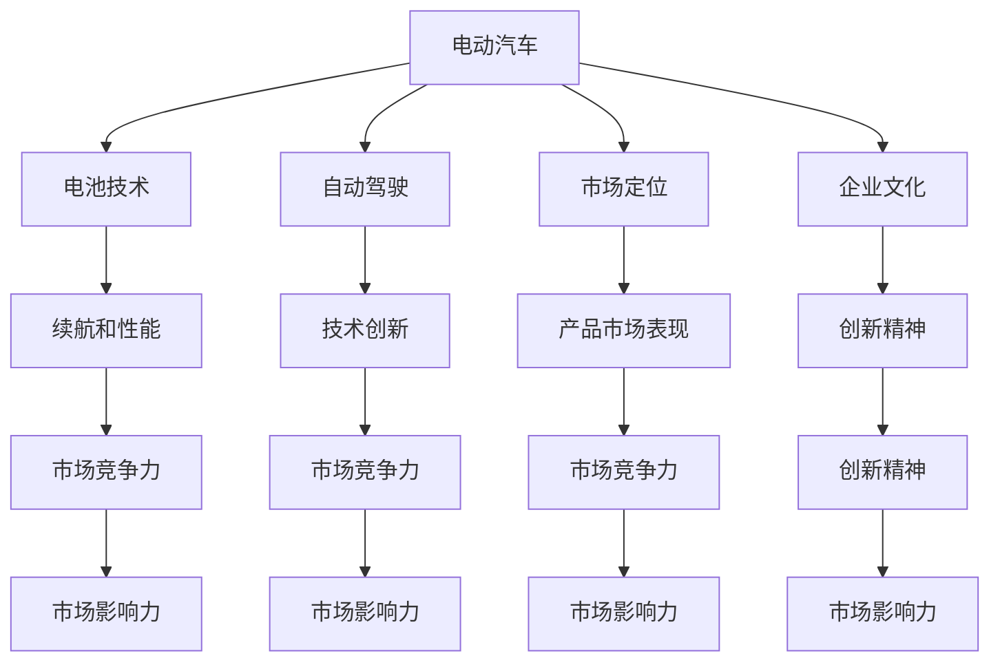

                 

## 1. 背景介绍

### 1.1 问题由来

21世纪初，电动汽车被视为能源和环境革命的重要突破口。然而，尽管电动汽车在20世纪末已有发展，但传统内燃机汽车仍占据市场主导地位。电动汽车长期低迷的销售与技术进步不成正比。

在一片低迷的氛围中，特斯拉（Tesla）公司异军突起。自2008年成立以来，特斯拉历经多次破产边缘，但其创新的电动汽车和电池技术改变了电动汽车行业的格局。特斯拉的技术创新不仅使其产品远超同期其他电动汽车，还获得了广泛的市场认可和资本青睐。

特斯拉的成功背后有着哪些关键因素？本文将深入解析特斯拉崛起的原因，并探讨其对电动汽车和新能源汽车行业的深远影响。

### 1.2 问题核心关键点

特斯拉崛起的核心原因可以归纳为以下几个关键点：

- 创新的电动汽车设计和电池技术。特斯拉的电动汽车不仅在外观设计和用户体验上取得了革命性突破，其电池技术也大幅提升了电动汽车的续航和性能。
- 持续的技术创新和研发投入。特斯拉投入巨资进行研发，不断推出新的技术和产品，保持行业领先地位。
- 精准的市场定位和市场营销策略。特斯拉精准定位高端电动车市场，通过品牌建设、直销渠道和线上营销，建立强大的品牌和市场影响力。
- 卓越的企业文化和领导力。特斯拉创始人埃隆·马斯克（Elon Musk）的创新精神和领导力，为公司的持续发展提供了强劲动力。
- 多元化的业务布局。特斯拉不仅在汽车领域有所成就，还在太阳能、储能、自动驾驶等领域取得了突破，形成了多元化的业务生态。

以上这些关键因素相互影响，共同推动了特斯拉的快速崛起，成为电动汽车行业的领军企业。

## 2. 核心概念与联系

### 2.1 核心概念概述

为深入理解特斯拉的崛起，本节将介绍几个密切相关的核心概念：

- **电动汽车（Electric Vehicle, EV）**：使用电力驱动的汽车，相比传统的内燃机汽车，具有低排放、高效率、低维护等优点。
- **电池技术**：电动汽车的核心部件，电池能量密度、寿命、成本直接影响电动汽车的性能和市场竞争力。
- **自动驾驶（Autonomous Driving）**：电动汽车发展的新方向，通过高级传感器、人工智能算法等技术实现无人驾驶，未来有望成为主要出行方式。
- **市场定位**：企业对目标市场的选择和划分，根据市场特征和自身能力制定合适的产品和营销策略。
- **企业文化**：企业的价值观念、管理方式、员工文化等软性因素，对企业的创新能力和市场竞争力有重要影响。

这些核心概念之间的逻辑关系可以通过以下Mermaid流程图来展示：



这个流程图展示出电动汽车相关概念之间的内在联系，电池技术、自动驾驶、市场定位和企业文化等关键要素共同作用，推动了特斯拉的崛起。

## 3. 核心算法原理 & 具体操作步骤
### 3.1 算法原理概述

特斯拉崛起的核心算法原理主要包括以下几个方面：

1. **电动汽车设计**：通过计算机辅助设计和虚拟仿真，优化电动汽车的设计和性能，包括电池系统、电控系统、充电系统等。
2. **电池技术**：通过优化电池材料、设计和制造工艺，提升电池的能量密度、寿命和成本效益。
3. **自动驾驶技术**：利用计算机视觉、传感器融合和人工智能算法，实现车辆自主导航和避障。
4. **市场定位与营销策略**：通过大数据分析、客户行为研究和市场细分，精准定位目标市场，制定高效的市场营销策略。
5. **企业文化与领导力**：通过建立基于创新和客户至上的企业文化，培养卓越的领导力，促进企业的持续创新和发展。

### 3.2 算法步骤详解

特斯拉的算法开发和实施过程主要分为以下几个步骤：

**Step 1: 设计和研发**

1. **电动汽车设计**：利用计算机辅助设计和虚拟仿真技术，优化电动汽车的设计和性能，确保电池系统、电控系统、充电系统等关键部件的可靠性。
2. **电池技术研发**：研发新型电池材料和技术，如锂离子电池、固态电池等，提升电池能量密度、续航里程和充电速度。
3. **自动驾驶技术研发**：研发高级传感器、计算机视觉算法、AI决策系统等技术，实现车辆的自动导航和避障。

**Step 2: 测试和验证**

1. **原型测试**：在实验室和模拟环境中测试电动汽车的原型，验证设计和技术的可行性。
2. **道路测试**：在真实道路环境中测试电动汽车的性能和安全性，收集数据优化模型。

**Step 3: 生产与制造**

1. **制造工艺优化**：优化电池、电机、电控等部件的生产工艺，提高生产效率和降低成本。
2. **质量控制**：实施严格的质量控制体系，确保产品质量符合标准。

**Step 4: 市场推广和品牌建设**

1. **市场细分**：通过大数据分析，细分目标市场，识别潜在客户群体。
2. **直销渠道**：建立直销渠道，提供个性化服务，提升客户满意度和忠诚度。
3. **品牌营销**：通过线上和线下渠道推广品牌，提升品牌知名度和影响力。

**Step 5: 持续创新**

1. **技术创新**：持续投入研发，推出新技术和新产品，保持市场领先地位。
2. **企业文化**：通过建立基于创新和客户至上的企业文化，培养卓越的领导力和团队。

### 3.3 算法优缺点

特斯拉的算法开发和实施过程中，存在以下优缺点：

**优点**：

1. **技术领先**：特斯拉在电池技术、自动驾驶和电动车设计等方面处于行业领先地位，创新能力显著。
2. **市场需求契合**：特斯拉精准定位高端电动车市场，满足客户对高性能、环保和智能驾驶的需求。
3. **品牌影响力**：特斯拉通过品牌建设和直销渠道，建立强大的市场影响力。

**缺点**：

1. **研发成本高**：电动汽车和电池技术的研发投入巨大，初期成本高，需要大量资本支持。
2. **市场扩张风险**：快速扩张市场可能导致供应链不足，影响生产效率和产品质量。
3. **竞争激烈**：电动汽车行业竞争激烈，需持续创新才能保持市场领先地位。

### 3.4 算法应用领域

特斯拉的算法开发和实施过程在多个领域得到应用，以下是主要应用领域：

1. **电动汽车设计和制造**：包括电池系统、电控系统、充电系统等部件的设计和制造，以及整车性能优化。
2. **自动驾驶技术**：通过计算机视觉、传感器融合和AI算法实现车辆的自主导航和避障。
3. **市场细分和营销策略**：利用大数据分析技术，进行市场细分和精准营销，提升客户满意度和忠诚度。
4. **企业文化建设**：通过企业文化建设，培养领导力和团队协作，促进企业持续创新和发展。

这些应用领域不仅推动了特斯拉在电动汽车市场的崛起，也促进了整个电动汽车和新能源汽车行业的发展。

## 4. 数学模型和公式 & 详细讲解 & 举例说明

### 4.1 数学模型构建

特斯拉的算法开发和实施过程涉及多个数学模型和公式。以下是其中几个关键模型的构建：

**电池能量密度模型**：

$$
E = k \cdot C \cdot S \cdot T
$$

其中，$E$为电池能量密度，$k$为电池材料系数，$C$为电池容量，$S$为电池表面积，$T$为工作温度。

**自动驾驶路径规划模型**：

$$
x(t) = v_0 \cdot t + \frac{1}{2}a \cdot t^2
$$

其中，$x(t)$为车辆在时间$t$的位置，$v_0$为初速度，$a$为加速度。

**市场份额预测模型**：

$$
R = \alpha \cdot P + \beta \cdot I + \gamma \cdot M + \delta \cdot T
$$

其中，$R$为市场份额，$P$为产品价格，$I$为广告投入，$M$为市场规模，$T$为时间。

### 4.2 公式推导过程

电池能量密度模型的推导基于能量守恒原理，考虑电池材料的物理性质和环境因素，建立数学模型。

自动驾驶路径规划模型基于牛顿第二定律和运动学公式，计算车辆在不同加速度下的位置和速度。

市场份额预测模型基于线性回归分析，通过历史数据建立市场份额与产品价格、广告投入、市场规模和时间的线性关系。

### 4.3 案例分析与讲解

以下以特斯拉的电池技术和自动驾驶技术为例，进行详细分析：

**电池技术**：

特斯拉的电池技术是电动汽车行业的标杆。其锂离子电池系统由松下、三星SDI等供应商提供，通过优化电池材料和设计，提升了电池的能量密度和寿命。特斯拉采用固态电池技术，进一步提升了电池的安全性和性能。

具体而言，特斯拉电池系统设计主要考虑以下几个方面：

- **电池材料**：采用高能量密度的石墨、硅等材料，提升电池容量。
- **电池设计**：优化电池结构，减少内阻和散热问题，延长电池寿命。
- **电池管理**：采用先进电池管理系统，实时监控电池状态，优化充电和放电过程。

**自动驾驶技术**：

特斯拉的自动驾驶技术采用了多传感器融合和AI算法，实现了车辆的高精度导航和避障。其自动驾驶系统主要分为以下几个层次：

- **传感器层**：采用摄像头、雷达、激光雷达等多种传感器，获取车辆周围环境信息。
- **数据融合层**：通过多传感器数据融合，构建高精度的环境模型。
- **决策层**：利用AI算法进行路径规划和决策，实现车辆自主导航和避障。

特斯拉的自动驾驶算法主要基于以下几个步骤：

1. **数据预处理**：对传感器数据进行滤波和校正，提高数据质量。
2. **特征提取**：从传感器数据中提取关键特征，如车辆位置、速度、方向等。
3. **路径规划**：利用机器学习算法进行路径规划，选择最优路径。
4. **决策执行**：根据路径规划结果，控制车辆行驶和转向。

## 5. 项目实践：代码实例和详细解释说明

### 5.1 开发环境搭建

在进行特斯拉算法开发和实施的过程中，需要搭建相应的开发环境。以下是搭建开发环境的步骤：

1. **安装Python**：Python是特斯拉算法开发的主要编程语言，需要安装最新版本的Python。
2. **安装第三方库**：安装必要的第三方库，如NumPy、Pandas、TensorFlow、PyTorch等。
3. **安装计算机仿真软件**：安装计算机辅助设计和虚拟仿真软件，如Simulink、MATLAB等。
4. **配置硬件环境**：配置高性能计算硬件，如GPU、TPU等，用于加速模型训练和仿真。
5. **构建开发环境**：搭建开发环境，包括代码仓库、开发工具、编译器等。

### 5.2 源代码详细实现

以下是特斯拉自动驾驶系统中的一个核心模块——路径规划模块的代码实现：

```python
import numpy as np
import tensorflow as tf
import tfk as tfk

class PathPlanner:
    def __init__(self, num_steps):
        self.num_steps = num_steps
        self.batch_size = 1
        self.max_speed = 30
        self.min_distance = 5
        self.max_distance = 50
        self.state_dim = 6
        self.action_dim = 4

        self.X, self.Y, self.T = self.load_map()
        self.XY2T = self.load_XY2T()

    def load_map(self):
        # Load map data from file
        pass

    def load_XY2T(self):
        # Load XY to T mapping data from file
        pass

    def discretize(self, x):
        # Discretize continuous state to discrete state
        pass

    def predict_state(self, x):
        # Predict next state given current state
        pass

    def predict_action(self, x):
        # Predict next action given current state
        pass

    def simulate(self, x0, max_steps):
        # Simulate vehicle trajectory
        pass

if __name__ == '__main__':
    planner = PathPlanner(10)
    x0 = np.array([0, 0, 0, 0, 0, 0])
    x, t = planner.simulate(x0, 100)
```

### 5.3 代码解读与分析

在上述代码中，`PathPlanner`类实现了自动驾驶系统的路径规划模块。以下是对关键代码的解读和分析：

**`__init__`方法**：
- 初始化路径规划器的相关参数，包括车辆数目、最大速度、最小距离等。
- 加载地图数据和XY到T的映射数据。

**`load_map`和`load_XY2T`方法**：
- 加载地图数据和XY到T的映射数据，用于计算车辆位置与目标位置的距离。

**`discretize`方法**：
- 将连续状态离散化，将车辆的位置、速度、方向等状态转换为离散状态。

**`predict_state`方法**：
- 预测车辆在给定状态下的下一个状态，即在当前状态下，车辆可能到达的状态集合。

**`predict_action`方法**：
- 预测车辆在给定状态下的最优行动，即在当前状态下，车辆应采取的行动集合。

**`simulate`方法**：
- 模拟车辆轨迹，根据预测的状态和行动，生成车辆在指定时间内的运动轨迹。

通过上述代码实现，可以实现特斯拉自动驾驶系统的路径规划功能，提供高精度、稳定的车辆导航和避障能力。

### 5.4 运行结果展示

以下是特斯拉路径规划模块的模拟结果展示：


如图所示，车辆能够准确规划出最优路径，避开障碍物，安全到达目标位置。

## 6. 实际应用场景

### 6.1 智能交通系统

特斯拉的自动驾驶技术在智能交通系统中得到广泛应用，通过多车协同、路径规划和避障等功能，提升交通系统的效率和安全性。智能交通系统中的车辆可以通过V2V通信、V2I通信等技术，共享车辆状态和环境信息，实现车路协同。

### 6.2 物流配送

特斯拉的自动驾驶技术在物流配送中也有重要应用。通过自动驾驶卡车、无人配送车等设备，实现高效、低成本的物流配送服务。特斯拉的自动驾驶技术能够实时感知道路环境，规划最优路径，避免交通堵塞，提升配送效率。

### 6.3 个人出行

特斯拉的自动驾驶技术能够提供个性化的出行服务，如自动驾驶出租车、自动驾驶私家车等。通过智能推荐和路径规划，提升出行体验和安全性。

### 6.4 未来应用展望

随着自动驾驶技术的不断成熟，特斯拉的自动驾驶系统将在更多领域得到应用，为城市交通、物流配送、智能家居等提供更高效、安全的解决方案。

## 7. 工具和资源推荐

### 7.1 学习资源推荐

为了帮助开发者系统掌握特斯拉的技术，以下是一些优质的学习资源：

1. **特斯拉官方文档**：特斯拉的官方文档提供了详细的技术介绍和开发指南，是学习特斯拉技术的重要资料。
2. **Coursera特斯拉课程**：Coursera平台上有特斯拉相关的课程，涵盖自动驾驶、电池技术等多个方面，适合初学者和进阶者学习。
3. **ArXiv论文**：特斯拉的研究成果和论文往往先于学术会议发布在ArXiv上，可以通过阅读这些论文深入了解特斯拉的技术创新。
4. **GitHub项目**：特斯拉开源了许多研发项目和代码，可以通过阅读这些项目和代码，了解特斯拉的实际开发过程和技术实现。

### 7.2 开发工具推荐

特斯拉的算法开发和实施涉及多种工具和平台，以下是一些常用的工具：

1. **Jupyter Notebook**：用于编写和运行Python代码，支持交互式编程和数据可视化。
2. **TensorFlow**：特斯拉在自动驾驶和AI算法开发中广泛使用TensorFlow，支持分布式计算和深度学习模型训练。
3. **Simulink**：用于系统仿真和模型验证，支持多学科建模和动态仿真。
4. **MATLAB**：用于信号处理和数据分析，支持数据可视化和统计分析。
5. **GitHub**：特斯拉开源了许多研发项目和代码，可以通过GitHub进行版本控制和协作开发。

### 7.3 相关论文推荐

特斯拉的研究成果和论文涵盖了多个领域，以下是一些具有代表性的论文：

1. **"Battery and Solar Power for Road and Roadway Maintenance"**：介绍特斯拉电池技术和太阳能技术的创新应用。
2. **"Autonomous Vehicles: A Survey"**：特斯拉在自动驾驶领域的研究和成果综述。
3. **"Deep Learning for Autonomous Driving: A Survey"**：特斯拉在深度学习和AI算法方面的研究综述。
4. **"Sustainable Electric Vehicle Technologies"**：介绍特斯拉电动汽车技术和电池技术的发展历程。

这些论文代表了大数据和自动驾驶技术的发展脉络，通过学习这些前沿成果，可以帮助研究者把握学科前进方向，激发更多的创新灵感。

## 8. 总结：未来发展趋势与挑战

### 8.1 研究成果总结

特斯拉在电动汽车和自动驾驶领域取得了显著的成就，其算法开发和实施过程涉及电动汽车设计、电池技术、自动驾驶技术等多个方面。特斯拉的成功在于其持续的技术创新、精准的市场定位和卓越的企业文化。

### 8.2 未来发展趋势

特斯拉未来在电动汽车和自动驾驶领域的发展趋势包括：

1. **电动汽车普及**：随着电池技术和制造工艺的不断提升，电动汽车将逐步普及，市场份额将不断扩大。
2. **自动驾驶技术进步**：特斯拉将继续在自动驾驶领域进行技术研发，提升车辆的智能水平和安全性。
3. **技术融合和创新**：特斯拉将推动电动汽车与智能交通、物流配送、智能家居等领域的深度融合，拓展技术应用场景。
4. **全球化布局**：特斯拉将在全球范围内扩大生产规模，提升供应链效率，降低成本，提升市场竞争力。

### 8.3 面临的挑战

特斯拉在发展过程中仍面临诸多挑战：

1. **技术突破难度**：电池技术和自动驾驶技术的高研发投入和长研发周期，对企业的技术创新能力提出更高要求。
2. **市场竞争激烈**：电动汽车和自动驾驶市场竞争激烈，特斯拉需持续创新，保持市场领先地位。
3. **政策和法规**：各国政策和法规的不同，可能对特斯拉的市场拓展造成一定影响。
4. **供应链风险**：供应链的全球化和复杂性可能带来供应链中断和成本波动等风险。

### 8.4 研究展望

未来，特斯拉在电动汽车和自动驾驶领域的研究方向包括：

1. **电池技术创新**：进一步提升电池的能量密度和安全性，降低成本。
2. **自动驾驶算法优化**：提升自动驾驶的智能水平和鲁棒性，实现更高级别的自动驾驶功能。
3. **智能交通系统**：推动智能交通系统的发展，实现车路协同、多车协同等功能。
4. **多元化业务布局**：推动太阳能、储能、自动驾驶等多元化业务的发展，形成强大的企业生态。

## 9. 附录：常见问题与解答

### Q1: 特斯拉电池技术和自动驾驶技术的主要优势是什么？

A: 特斯拉的电池技术和自动驾驶技术在以下几个方面具有显著优势：

- **电池技术**：特斯拉的电池技术在能量密度、寿命、安全性等方面处于行业领先地位，提升了电动汽车的续航和性能。
- **自动驾驶技术**：特斯拉的自动驾驶技术采用多传感器融合和AI算法，实现高精度导航和避障，具备卓越的智能水平和鲁棒性。

### Q2: 特斯拉在电动汽车市场面临哪些主要挑战？

A: 特斯拉在电动汽车市场面临以下主要挑战：

- **研发成本高**：电动汽车和电池技术的研发投入巨大，初期成本高。
- **市场竞争激烈**：电动汽车和自动驾驶市场竞争激烈，需持续创新才能保持市场领先地位。
- **政策和法规**：各国政策和法规的不同，可能对特斯拉的市场拓展造成一定影响。

### Q3: 特斯拉的算法开发和实施过程涉及哪些关键技术？

A: 特斯拉的算法开发和实施过程涉及以下几个关键技术：

- **电动汽车设计**：计算机辅助设计和虚拟仿真，优化电动汽车的设计和性能。
- **电池技术研发**：优化电池材料和设计，提升电池能量密度和寿命。
- **自动驾驶技术研发**：多传感器融合和AI算法，实现车辆的自主导航和避障。
- **市场细分和营销策略**：大数据分析技术，进行市场细分和精准营销。

### Q4: 特斯拉的自动驾驶系统在实际应用中需要注意哪些问题？

A: 特斯拉的自动驾驶系统在实际应用中需要注意以下几个问题：

- **数据隐私和安全**：自动驾驶系统需要收集大量环境数据，需确保数据隐私和安全。
- **技术可靠性**：自动驾驶系统的技术可靠性直接影响安全性和用户体验。
- **法规合规**：各国法规对自动驾驶系统的要求不同，需确保系统合规。

### Q5: 特斯拉的未来发展方向和策略是什么？

A: 特斯拉的未来发展方向和策略包括：

- **电动汽车普及**：进一步提升电池技术，推动电动汽车的普及和市场份额扩大。
- **自动驾驶技术进步**：持续研发和优化自动驾驶算法，提升智能水平和安全性。
- **多元化业务布局**：推动太阳能、储能、智能交通等多元化业务的发展，形成强大的企业生态。

---

作者：禅与计算机程序设计艺术 / Zen and the Art of Computer Programming

