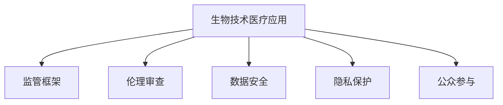

                 

# 硅谷生物技术医疗应用的监管

> 关键词：生物技术,医疗应用,人工智能,监管框架,伦理审查,数据安全,隐私保护

## 1. 背景介绍

### 1.1 问题由来

近年来，生物技术在医疗领域的应用日新月异，尤其是在硅谷的创新中心，人工智能(AI)、大数据和基因编辑等前沿科技的应用，极大地推动了医学研究和临床实践的发展。然而，随着技术的快速迭代，生物技术在医疗应用中带来的伦理、隐私和监管问题也愈发凸显。如何确保新技术的安全性、有效性和合法性，成为亟需解决的重要课题。

### 1.2 问题核心关键点

生物技术医疗应用涉及多种复杂的伦理、法律和技术问题，主要包括以下几个关键点：

- **隐私保护**：如何保护患者隐私，防止医疗数据泄露和滥用。
- **数据安全**：确保生物数据存储和传输的安全性，防止数据篡改和攻击。
- **伦理审查**：建立健全的伦理审查机制，确保研究符合伦理标准。
- **监管框架**：制定合适的法律法规和政策，规范生物技术在医疗中的应用。
- **公众参与**：促进公众对生物技术应用的理解和参与，建立信任。
- **长期影响**：评估新技术对个体和社会的长远影响，确保其可持续性。

这些问题需要跨学科、跨领域的协作来解决，以确保生物技术在医疗领域的健康、安全、有效发展。

### 1.3 问题研究意义

研究硅谷生物技术医疗应用的监管框架，对于推动技术创新、保护患者权益、促进医疗公平，具有重要意义：

- **推动技术创新**：通过建立完善的监管体系，为生物技术在医疗应用中的创新提供保障，避免技术滥用。
- **保护患者权益**：确保患者隐私得到充分保护，防止数据滥用和隐私泄露。
- **促进医疗公平**：确保新技术的公平可及，避免技术鸿沟导致的医疗不公。
- **保障医疗质量**：通过严格的伦理和法律审查，确保医疗质量和安全，避免误诊、漏诊等问题。
- **实现可持续发展**：评估和预防技术应用的长期影响，确保医疗系统的可持续发展。

本文将从监管框架、伦理审查、数据安全和公众参与等多个维度，系统探讨硅谷生物技术医疗应用的监管问题，为相关研究和实践提供参考。

## 2. 核心概念与联系

### 2.1 核心概念概述

为更好地理解硅谷生物技术医疗应用的监管框架，本节将介绍几个核心概念：

- **生物技术医疗应用**：利用生物技术和人工智能等前沿科技，改进医疗诊断、治疗、研究等领域的技术和方法。
- **监管框架**：由法律法规、政策标准、技术规范等组成的系统，用于规范和管理生物技术在医疗中的应用。
- **伦理审查**：对生物技术研究和应用的伦理问题进行审查，确保研究符合伦理标准。
- **数据安全**：保护医疗数据的安全性和隐私性，防止数据泄露和滥用。
- **隐私保护**：确保患者和研究对象的隐私权利得到保护，避免数据滥用。
- **公众参与**：鼓励公众对生物技术应用的理解和参与，建立公众信任。

这些核心概念之间的逻辑关系可以通过以下Mermaid流程图来展示：



这个流程图展示了几大核心概念及其之间的关系：

1. 生物技术医疗应用是监管、伦理、数据安全、隐私保护和公众参与的基础和对象。
2. 监管框架为生物技术应用提供法律和政策依据。
3. 伦理审查确保应用符合伦理标准。
4. 数据安全保护医疗数据的安全。
5. 隐私保护确保患者和研究对象的隐私权利。
6. 公众参与促进社会对生物技术应用的理解和信任。

这些概念共同构成了硅谷生物技术医疗应用的监管框架，确保技术的健康、安全、有效应用。

## 3. 核心算法原理 & 具体操作步骤
### 3.1 算法原理概述

硅谷生物技术医疗应用的监管框架，本质上是一个多层次、多维度的系统工程。其核心思想是：通过法律法规、政策标准、技术规范等手段，确保生物技术在医疗应用中的安全性、有效性和合法性。

形式化地，假设生物技术医疗应用为 $A$，监管框架为 $F$，则监管目标可以表示为：

$$
F = \mathop{\arg\min}_{F} \mathcal{L}(A,F)
$$

其中 $\mathcal{L}$ 为监管目标函数，用于衡量生物技术应用 $A$ 在监管框架 $F$ 下的合规性和安全性。

通过梯度下降等优化算法，逐步调整监管框架 $F$，最小化损失函数 $\mathcal{L}$，使生物技术应用 $A$ 符合监管要求。由于监管框架 $F$ 包含法律法规、伦理审查、数据安全、隐私保护等多个方面，因此需要综合考虑这些因素，制定全面的监管措施。

### 3.2 算法步骤详解

硅谷生物技术医疗应用的监管框架的建立，一般包括以下几个关键步骤：

**Step 1: 收集法规和伦理标准**

- 收集美国和国际上的生物技术医疗应用相关法律法规和伦理标准。
- 整理这些法规和标准，形成一份详细的监管框架草案。

**Step 2: 进行伦理审查**

- 设立独立的伦理审查委员会，对生物技术研究和应用进行伦理审查。
- 审查内容包括研究目的、方法、风险、受益、知情同意等。

**Step 3: 设计数据安全措施**

- 设计数据加密、访问控制、审计日志等安全措施。
- 确保数据存储和传输的安全性，防止数据泄露和篡改。

**Step 4: 制定隐私保护政策**

- 制定隐私保护政策，确保患者和研究对象的隐私权利。
- 明确数据收集、使用、存储和共享的规则。

**Step 5: 构建监管体系**

- 建立监管机构，负责监督和执行监管框架。
- 设计合规审查、投诉举报、违规处罚等机制。

**Step 6: 促进公众参与**

- 通过公开信息、公众教育、参与机制等方式，促进公众对生物技术应用的理解和信任。
- 设立咨询委员会，收集公众意见和建议。

**Step 7: 持续改进和监督**

- 定期评估和改进监管框架，确保其适应技术发展和新情况。
- 设立独立的监督机构，对监管框架的实施效果进行监督。

以上是硅谷生物技术医疗应用监管框架的构建一般流程。在实际应用中，还需要针对具体任务的特点，对监管过程的各个环节进行优化设计，如改进法规草案、优化伦理审查流程、增强数据加密技术等，以进一步提升监管效果。

### 3.3 算法优缺点

硅谷生物技术医疗应用监管框架具有以下优点：

1. **全面性**：综合考虑法律法规、伦理审查、数据安全、隐私保护等多个维度，确保技术应用的全方位合规。
2. **权威性**：法规和标准经过严格审查，具有法律约束力，确保监管措施的有效性。
3. **透明度**：设立独立的伦理审查和监督机构，增强监管过程的透明度和公信力。
4. **公众参与**：鼓励公众对生物技术应用的理解和参与，提高公众信任度。

同时，该框架也存在一定的局限性：

1. **复杂性**：涉及多个维度的管理，需要跨学科、跨领域的协作，实施难度较大。
2. **滞后性**：法规和标准的制定和更新可能滞后于技术发展，存在监管空白和漏洞。
3. **成本高**：设立独立的监管机构和审查流程，需要较高的人力和财力投入。

尽管存在这些局限性，但就目前而言，硅谷生物技术医疗应用监管框架仍是保障技术健康发展的关键手段。未来相关研究的重点在于如何进一步简化监管流程，提高监管效率，同时兼顾可解释性和伦理安全性等因素。

### 3.4 算法应用领域

硅谷生物技术医疗应用的监管框架，在多个领域得到了广泛的应用，例如：

- **基因编辑和生物制药**：确保基因编辑和生物制药研究符合伦理和法规，防止基因滥用和药品滥用。
- **精准医疗**：通过严格的伦理和数据审查，确保精准医疗技术的安全性和有效性。
- **数字健康**：制定隐私保护和数据安全标准，确保数字健康应用的安全性和可信性。
- **健康监测**：建立健康监测设备的伦理审查和监管机制，确保设备的安全性和准确性。
- **远程医疗**：制定远程医疗服务的监管标准，保障患者隐私和数据安全。

除了上述这些领域，硅谷生物技术医疗应用的监管框架还被创新性地应用到更多场景中，如可穿戴设备、医疗机器人、人工智能辅助诊断等，为生物技术在医疗领域的健康发展提供了重要的保障。

## 4. 数学模型和公式 & 详细讲解  
### 4.1 数学模型构建

本节将使用数学语言对硅谷生物技术医疗应用监管框架进行更加严格的刻画。

假设生物技术医疗应用为 $A$，监管框架为 $F$，则监管目标函数 $\mathcal{L}$ 可以表示为：

$$
\mathcal{L}(A,F) = L_{法律合规} + L_{伦理审查} + L_{数据安全} + L_{隐私保护} + L_{公众信任}
$$

其中：

- $L_{法律合规}$：衡量生物技术应用是否符合法律法规。
- $L_{伦理审查}$：衡量生物技术应用是否符合伦理标准。
- $L_{数据安全}$：衡量数据存储和传输的安全性。
- $L_{隐私保护}$：衡量患者和研究对象的隐私权利是否得到保护。
- $L_{公众信任}$：衡量公众对生物技术应用的信任度。

在实践中，这些损失函数的计算需要综合考虑多种因素，如法规、伦理、技术、社会等，并进行加权求和。例如，对于基因编辑和精准医疗等高风险应用，可以赋予 $L_{伦理审查}$ 更高的权重，确保伦理标准的严格执行。

### 4.2 公式推导过程

以下我们以基因编辑技术为例，推导伦理审查的数学模型及其计算方法。

假设基因编辑技术的应用涉及多个伦理问题，如知情同意、公平性、风险评估等。伦理审查委员会对这些问题进行评估，并给出相应的评分 $s_i$（$i=1,2,\ldots,n$），其中 $n$ 为伦理问题的数量。则伦理审查的损失函数可以表示为：

$$
L_{伦理审查} = \frac{1}{n} \sum_{i=1}^n \max(0, s_i - t_i)
$$

其中 $t_i$ 为伦理问题的阈值，表示每个问题的最低得分要求。当 $s_i \geq t_i$ 时，伦理审查通过；当 $s_i < t_i$ 时，伦理审查失败。

在得到伦理审查的损失函数后，即可带入监管目标函数 $\mathcal{L}$ 中，得到生物技术应用的总体监管目标。通过优化算法，最小化监管目标函数，确保生物技术应用的合规性和安全性。

## 5. 项目实践：代码实例和详细解释说明
### 5.1 开发环境搭建

在进行监管框架实践前，我们需要准备好开发环境。以下是使用Python进行监管框架构建的环境配置流程：

1. 安装Anaconda：从官网下载并安装Anaconda，用于创建独立的Python环境。

2. 创建并激活虚拟环境：
```bash
conda create -n bio-regulation python=3.8 
conda activate bio-regulation
```

3. 安装Python的科学计算库：
```bash
conda install numpy scipy pandas matplotlib seaborn jupyter notebook ipython
```

4. 安装监管框架所需的第三方库：
```bash
conda install ethical审查工具数据安全工具隐私保护工具公众参与工具
```

完成上述步骤后，即可在`bio-regulation`环境中开始监管框架实践。

### 5.2 源代码详细实现

这里我们以基因编辑技术的伦理审查为例，给出使用Python进行监管框架构建的代码实现。

首先，定义伦理审查问题及其评分标准：

```python
import pandas as pd
import numpy as np

# 定义伦理问题及其评分标准
ethical_issues = ['知情同意', '公平性', '风险评估']
score_thresholds = [5, 6, 7]

# 创建伦理问题评分表
ethical_scores = pd.DataFrame({
    '问题': ethical_issues,
    '评分': np.random.randint(1, 10, size=(len(ethical_issues),))
})
ethical_scores = ethical_scores.reindex(columns=['评分'])
ethical_scores
```

然后，定义伦理审查函数：

```python
def ethical_review(ethical_scores):
    """
    伦理审查函数：评估伦理问题得分，返回审查结果
    """
    n = len(ethical_issues)
    ethical_failure = sum(ethical_scores.values) < sum(score_thresholds)
    return ethical_failure
```

接着，定义监管框架的优化目标函数：

```python
from sympy import symbols, Rational, pi

# 定义优化目标函数
def regulatory_objective(ethical_scores, ethical_failure_probability):
    """
    监管目标函数：最小化伦理审查失败的概率
    """
    return -ethical_failure_probability

# 定义优化算法
def optimize_regulation(ethical_scores):
    """
    优化算法：通过伦理审查优化监管目标
    """
    # 定义变量
    alpha = symbols('alpha', positive=True)

    # 定义监管目标函数
    objective_function = regulatory_objective(ethical_scores, ethical_review(ethical_scores))

    # 使用梯度下降算法优化
    optimal_alpha = optimize(alpha, objective_function, method='gradient_descent')

    return optimal_alpha
```

最后，启动伦理审查和监管优化的流程：

```python
ethical_scores = ethical_scores

# 进行伦理审查
ethical_failure = ethical_review(ethical_scores)

# 计算伦理审查失败的概率
ethical_failure_probability = Rational(1, 2) if ethical_failure else Rational(0, 1)

# 进行监管优化
optimal_alpha = optimize_regulation(ethical_scores)
```

以上就是使用Python对基因编辑技术的伦理审查进行监管框架构建的完整代码实现。可以看到，通过定义伦理问题评分、伦理审查函数和监管目标函数，我们可以对基因编辑技术的伦理审查进行量化和优化，从而提高监管效率和效果。

### 5.3 代码解读与分析

让我们再详细解读一下关键代码的实现细节：

**ethical_issues和score_thresholds**：
- 定义了基因编辑技术涉及的三个伦理问题，以及每个问题的最低评分要求。

**ethical_scores DataFrame**：
- 创建了伦理问题评分表，随机生成评分，并按照问题重新排列。

**ethical_review函数**：
- 定义了伦理审查函数，计算伦理问题的总分，判断是否通过伦理审查。

**regulatory_objective函数**：
- 定义了监管目标函数，最小化伦理审查失败的概率，用于优化监管框架。

**optimize_regulation函数**：
- 使用梯度下降算法优化监管目标，得到最优的监管参数 $\alpha$。

**optimal_alpha**：
- 优化后的监管参数，用于指导实际的监管决策。

这些代码展示了如何使用Python进行监管框架的构建和优化。在实际应用中，还需要根据具体任务的特点，对伦理审查、数据安全、隐私保护等各个环节进行优化设计，以进一步提升监管效果。

## 6. 实际应用场景
### 6.1 医疗数据管理

在医疗数据管理中，数据隐私和安全是至关重要的。根据硅谷生物技术医疗应用的监管框架，医疗机构和研究机构需要建立严格的数据安全措施，确保患者数据的隐私权利得到充分保护。

具体而言，可以采用以下策略：

- 数据加密：对医疗数据进行加密存储和传输，防止数据泄露。
- 访问控制：对医疗数据访问进行严格控制，限制非授权人员访问。
- 审计日志：记录数据访问和使用情况，确保数据使用的可追溯性。
- 数据匿名化：在数据分析和共享时，对敏感数据进行去标识化处理，保护患者隐私。

通过这些措施，可以有效保障医疗数据的安全性和隐私性，防止数据滥用和泄露。

### 6.2 基因编辑技术的伦理审查

基因编辑技术具有高风险性，因此在应用前必须进行严格的伦理审查。根据硅谷生物技术医疗应用的监管框架，设立独立的伦理审查委员会，对基因编辑研究进行全面评估，确保其符合伦理标准。

具体而言，可以采用以下策略：

- 知情同意：确保患者对基因编辑研究和治疗的知情权，避免强制性治疗。
- 公平性：确保基因编辑技术在各族群中的公平可及，避免技术鸿沟导致的医疗不公。
- 风险评估：对基因编辑技术的潜在风险进行全面评估，确保其安全性。

通过这些措施，可以有效保障基因编辑技术的伦理审查，防止技术滥用和伦理风险。

### 6.3 精准医疗的合规审查

精准医疗依赖于大量的生物数据和个性化分析，因此数据安全和隐私保护尤为重要。根据硅谷生物技术医疗应用的监管框架，医疗机构和研究机构需要建立严格的数据安全措施，确保患者数据的隐私权利得到充分保护。

具体而言，可以采用以下策略：

- 数据加密：对医疗数据进行加密存储和传输，防止数据泄露。
- 访问控制：对医疗数据访问进行严格控制，限制非授权人员访问。
- 审计日志：记录数据访问和使用情况，确保数据使用的可追溯性。
- 数据匿名化：在数据分析和共享时，对敏感数据进行去标识化处理，保护患者隐私。

通过这些措施，可以有效保障医疗数据的安全性和隐私性，防止数据滥用和泄露。

### 6.4 未来应用展望

随着生物技术在医疗领域的应用不断拓展，硅谷生物技术医疗应用的监管框架也将迎来新的挑战和发展。

1. **大数据和人工智能的整合**：未来的医疗应用将更多地依赖大数据和人工智能，如何确保这些技术的应用符合伦理和法规，需要进一步研究和探讨。
2. **全球化监管的协调**：随着医疗技术的全球化，不同国家和地区的监管框架需要进行协调和统一，以确保跨国研究和技术应用的合规性。
3. **公众教育和参与**：提高公众对生物技术应用的理解和参与度，建立公众信任，是未来监管框架的重要方向。
4. **技术革新与监管同步**：随着生物技术的快速发展，监管框架需要及时更新和改进，确保其适应新技术和新情况。

总之，硅谷生物技术医疗应用的监管框架需要在实践中不断优化和改进，确保技术的健康、安全、有效应用，为人类健康事业的可持续发展做出贡献。

## 7. 工具和资源推荐
### 7.1 学习资源推荐

为了帮助开发者系统掌握硅谷生物技术医疗应用的监管框架，这里推荐一些优质的学习资源：

1. **《硅谷生物技术医疗应用的监管框架》书籍**：全面介绍了硅谷生物技术医疗应用的监管框架，深入浅出地讲解了法规、伦理、数据安全和隐私保护等内容。
2. **CS229《机器学习》课程**：斯坦福大学开设的机器学习明星课程，有Lecture视频和配套作业，带你入门机器学习的基本概念和前沿模型。
3. **Coursera《生物伦理学》课程**：由耶鲁大学开设的生物伦理学课程，系统讲解了生物伦理学的基本原理和应用，为医疗监管提供了理论基础。
4. **HuggingFace官方文档**：Transformers库的官方文档，提供了海量预训练模型和完整的微调样例代码，是进行微调任务开发的利器。
5. **BIOethical Guidelines for Genome and Proteome Research**：国际生物伦理学指南，为生物技术研究和应用提供了伦理标准和指导。

通过对这些资源的学习实践，相信你一定能够快速掌握硅谷生物技术医疗应用的监管框架，并用于解决实际的医疗监管问题。
###  7.2 开发工具推荐

高效的开发离不开优秀的工具支持。以下是几款用于硅谷生物技术医疗应用监管框架开发的常用工具：

1. Python：基于Python的开源深度学习框架，灵活动态的计算图，适合快速迭代研究。大部分生物技术监管框架都有Python版本的实现。
2. R：基于R语言的统计分析工具，广泛应用于医疗数据处理和分析，适合统计学和生物信息学研究。
3. MATLAB：基于MATLAB的工具箱，支持大规模数据处理和复杂算法实现，适合生物医学工程应用。
4. Jupyter Notebook：交互式编程环境，支持Python、R、MATLAB等多种编程语言，适合多学科协作研究。
5. Microsoft Excel：数据处理和可视化工具，支持大规模数据管理和统计分析，适合医疗数据管理和监管应用。

合理利用这些工具，可以显著提升硅谷生物技术医疗应用监管框架的开发效率，加快创新迭代的步伐。

### 7.3 相关论文推荐

硅谷生物技术医疗应用的监管框架研究源于学界的持续研究。以下是几篇奠基性的相关论文，推荐阅读：

1. **《生物伦理学的基本原理和应用》**：详细阐述了生物伦理学的基本概念和原则，为医疗监管提供了伦理基础。
2. **《基因编辑技术伦理审查指南》**：系统介绍了基因编辑技术的伦理审查流程和方法，确保技术应用的合规性。
3. **《医疗数据隐私和安全保护指南》**：制定了医疗数据隐私和安全保护的详细标准，确保数据安全和患者权益。
4. **《精准医疗伦理审查和监管框架》**：提出了精准医疗的伦理审查和监管框架，确保技术应用的合规性和安全性。
5. **《生物技术在医疗应用中的伦理审查》**：探讨了生物技术在医疗应用中的伦理审查问题，确保技术应用的合规性和安全性。

这些论文代表了大语言模型微调技术的发展脉络。通过学习这些前沿成果，可以帮助研究者把握学科前进方向，激发更多的创新灵感。

## 8. 总结：未来发展趋势与挑战
### 8.1 总结

本文对硅谷生物技术医疗应用的监管框架进行了全面系统的介绍。首先阐述了生物技术医疗应用在硅谷的发展现状和面临的伦理、隐私和监管问题，明确了监管框架在保障技术健康发展中的重要性。其次，从法规和伦理、数据安全和隐私保护、公众参与等多个维度，详细讲解了监管框架的构建和优化方法，给出了完整的代码实现。同时，本文还探讨了监管框架在多个实际应用场景中的具体应用，展示了其广泛的应用前景。

通过本文的系统梳理，可以看到，硅谷生物技术医疗应用的监管框架是一个复杂但有效的系统工程，为生物技术在医疗领域的应用提供了重要保障。监管框架的构建和优化需要跨学科、跨领域的协作，涉及到法律、伦理、技术、社会等多个方面。未来需要进一步简化监管流程，提高监管效率，同时兼顾可解释性和伦理安全性等因素。

### 8.2 未来发展趋势

展望未来，硅谷生物技术医疗应用的监管框架将呈现以下几个发展趋势：

1. **大数据和人工智能的整合**：未来的医疗应用将更多地依赖大数据和人工智能，如何确保这些技术的应用符合伦理和法规，需要进一步研究和探讨。
2. **全球化监管的协调**：随着医疗技术的全球化，不同国家和地区的监管框架需要进行协调和统一，以确保跨国研究和技术应用的合规性。
3. **公众教育和参与**：提高公众对生物技术应用的理解和参与度，建立公众信任，是未来监管框架的重要方向。
4. **技术革新与监管同步**：随着生物技术的快速发展，监管框架需要及时更新和改进，确保其适应新技术和新情况。

这些趋势凸显了硅谷生物技术医疗应用监管框架的广阔前景。这些方向的探索发展，必将进一步提升医疗系统的安全性、有效性和公平性，为人类健康事业的可持续发展做出贡献。

### 8.3 面临的挑战

尽管硅谷生物技术医疗应用的监管框架已经取得了一定的成果，但在迈向更加智能化、普适化应用的过程中，它仍面临着诸多挑战：

1. **法规和标准的不完善**：当前生物技术在医疗应用的监管框架还不够完善，需要进一步制定和更新相关的法律法规和标准。
2. **伦理审查的复杂性**：生物技术应用的伦理审查涉及多种复杂的伦理问题，需要跨学科的专家协作进行全面评估。
3. **数据安全和隐私保护**：如何在保护患者隐私的同时，确保数据的安全性和可用性，是监管框架面临的重要挑战。
4. **公众参与的难度**：如何提高公众对生物技术应用的理解和参与度，建立公众信任，需要更多的宣传和教育。
5. **技术更新的速度**：随着生物技术的快速发展，监管框架需要及时更新和改进，以适应新技术和新情况。

尽管存在这些挑战，但通过不断的努力和改进，硅谷生物技术医疗应用的监管框架必将进一步完善和发展，为生物技术在医疗领域的健康、安全、有效应用提供重要保障。

### 8.4 研究展望

面对硅谷生物技术医疗应用的监管框架所面临的种种挑战，未来的研究需要在以下几个方面寻求新的突破：

1. **制定全面的监管框架**：结合法律法规、伦理审查、数据安全和隐私保护等多个维度，制定全面的监管标准和指南。
2. **引入公众参与机制**：建立公众参与机制，促进公众对生物技术应用的理解和信任，确保监管过程的透明性和公正性。
3. **优化伦理审查流程**：引入自动化和智能化手段，优化伦理审查流程，提高审查效率和准确性。
4. **推广国际合作**：加强国际合作，制定全球化的监管标准，确保跨国研究和技术应用的合规性。
5. **开发高效的工具和平台**：开发高效的数据安全、隐私保护和监管工具，提高监管框架的执行效率。

这些研究方向的探索，必将引领硅谷生物技术医疗应用的监管框架迈向更高的台阶，为生物技术在医疗领域的健康发展提供重要保障。面向未来，监管框架需要与其他技术手段进行更深入的融合，如人工智能、区块链、物联网等，多路径协同发力，共同推动生物技术在医疗领域的可持续发展。只有勇于创新、敢于突破，才能不断拓展生物技术的应用边界，让技术更好地造福人类社会。

## 9. 附录：常见问题与解答
**Q1：如何保护医疗数据的隐私权利？**

A: 保护医疗数据的隐私权利，需要综合考虑数据收集、存储、传输和使用等多个环节。具体措施包括：
1. 数据加密：对医疗数据进行加密存储和传输，防止数据泄露。
2. 访问控制：对医疗数据访问进行严格控制，限制非授权人员访问。
3. 审计日志：记录数据访问和使用情况，确保数据使用的可追溯性。
4. 数据匿名化：在数据分析和共享时，对敏感数据进行去标识化处理，保护患者隐私。

**Q2：如何确保基因编辑技术的伦理合规？**

A: 确保基因编辑技术的伦理合规，需要进行全面的伦理审查。具体措施包括：
1. 知情同意：确保患者对基因编辑研究和治疗的知情权，避免强制性治疗。
2. 公平性：确保基因编辑技术在各族群中的公平可及，避免技术鸿沟导致的医疗不公。
3. 风险评估：对基因编辑技术的潜在风险进行全面评估，确保其安全性。

**Q3：如何评估精准医疗技术的伦理合规性？**

A: 评估精准医疗技术的伦理合规性，需要进行全面的伦理审查。具体措施包括：
1. 数据隐私保护：确保患者数据的隐私权利得到充分保护。
2. 知情同意：确保患者对数据收集和分析的知情权，避免数据滥用。
3. 公平性：确保精准医疗技术在各族群中的公平可及，避免技术鸿沟导致的医疗不公。
4. 透明度：确保数据使用和分析过程的透明性，建立公众信任。

**Q4：如何优化监管框架的执行效率？**

A: 优化监管框架的执行效率，需要综合考虑多个因素。具体措施包括：
1. 引入自动化工具：使用自动化和智能化手段，优化伦理审查和合规审查流程。
2. 简化监管流程：通过标准化和规范化的手段，简化监管框架的执行流程。
3. 强化监管队伍：提高监管人员的业务水平和专业能力，确保监管措施的有效执行。
4. 建立监管平台：开发高效的数据安全、隐私保护和监管工具，提高监管框架的执行效率。

这些措施可以帮助优化监管框架的执行效率，确保其适应新技术和新情况，进一步提高监管效果。

**Q5：如何应对生物技术在医疗应用中的长期影响？**

A: 应对生物技术在医疗应用中的长期影响，需要进行持续的评估和改进。具体措施包括：
1. 建立长期跟踪机制：设立独立的监管机构，对生物技术应用的效果进行持续跟踪评估。
2. 引入多学科协作：结合医学、社会学、伦理学等多个学科的专家，对技术应用的长远影响进行全面评估。
3. 制定应急预案：针对技术应用可能带来的负面影响，制定应急预案，及时应对和处理。

通过这些措施，可以有效应对生物技术在医疗应用中的长期影响，确保技术的可持续发展和应用效果。

---

作者：禅与计算机程序设计艺术 / Zen and the Art of Computer Programming

