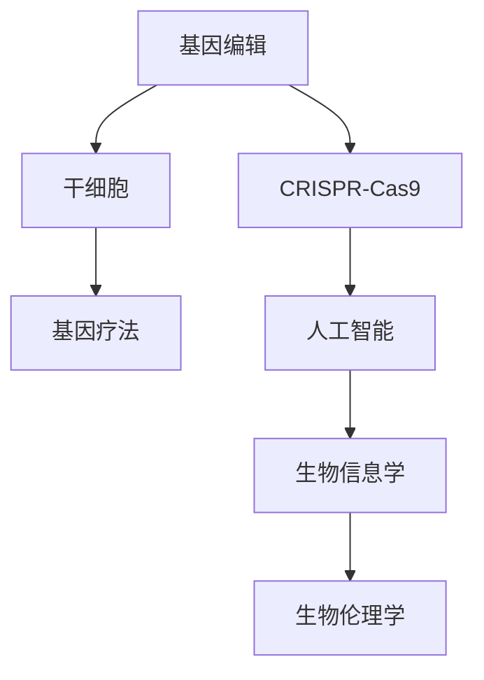

                 

# 硅谷生物科技:基因编辑与干细胞

> 关键词：基因编辑, CRISPR-Cas9, 干细胞, 基因疗法, 人工智能, 生物信息学, 生物伦理学

## 1. 背景介绍

在21世纪，生物科技迎来了第三次工业革命，硅谷的科技巨头们纷纷涌入生物医疗领域，将AI和基因编辑等尖端技术应用到基因治疗、干细胞研究、精准医学等多个方面，推动了生物医疗行业的飞速发展。本文将详细剖析硅谷生物科技与基因编辑、干细胞研究的最新进展，探讨其在生物医疗领域的应用前景，以及未来面临的挑战和趋势。

### 1.1 问题的由来

随着人类基因组计划（Human Genome Project, HGP）的成功完成，科学家们对人类基因的序列、结构和功能有了更深刻的理解。然而，人类基因组只是生命信息库的冰山一角，其中蕴含的奥秘还有待进一步探索。生物科技的进步使得基因编辑和干细胞研究成为可能，打开了科学研究和医学治疗的新天地。

硅谷作为全球科技创新中心，吸引了众多生物科技公司和初创企业，他们利用前沿技术解决重大医学难题，推动生物医疗的产业化进程。基因编辑技术、干细胞研究、人工智能、生物信息学等，成为硅谷生物科技研究的新趋势。本文将系统介绍这些关键技术，以及其在基因治疗、生物信息学、生物伦理学等领域的应用。

## 2. 核心概念与联系

### 2.1 核心概念概述

为了更好地理解硅谷生物科技与基因编辑、干细胞研究的最新进展，我们需要先明确几个核心概念：

- **基因编辑（Genome Editing）**：利用CRISPR-Cas9等工具对生物体的基因进行精确的修改，从而治疗遗传疾病、提高农作物产量等。
- **CRISPR-Cas9**：一种基于CRISPR（Clustered Regularly Interspaced Short Palindromic Repeats）序列的基因编辑技术，以其高效、精准著称。
- **干细胞（Stem Cells）**：一类未分化的细胞，能够自我更新和分化为多种类型的细胞，在医学研究和治疗中具有重要价值。
- **基因疗法（Gene Therapy）**：通过基因编辑、基因修饰等技术，修复或替换病人体内的缺陷基因，实现疾病的治疗和预防。
- **人工智能（AI）**：利用机器学习、深度学习等技术，辅助进行生物信息学分析、基因编辑和干细胞研究，提高实验效率和精度。
- **生物信息学（Bioinformatics）**：应用计算机科学和信息科学的方法，分析和解释生物大分子（如DNA、RNA、蛋白质）的数据。
- **生物伦理学（Bioethics）**：研究生物科技发展对人类道德、法律、社会的影响，指导科技伦理问题处理。

这些核心概念之间的关系可以通过以下Mermaid流程图来展示：



这个流程图展示了基因编辑与干细胞研究、基因疗法、人工智能、生物信息学和生物伦理学的相互联系。基因编辑和干细胞研究为基因疗法提供了技术基础，而人工智能和生物信息学则提供了数据分析和计算支持。生物伦理学在保障技术发展的同时，也对技术应用提出了伦理道德的约束。

## 3. 核心算法原理 & 具体操作步骤

### 3.1 算法原理概述

基因编辑的核心在于通过精确修改生物体的基因，以实现疾病的治疗和预防。CRISPR-Cas9技术利用双链RNA（dsRNA）引导Cas9酶，对目标DNA进行切割，并利用细胞的自我修复机制，实现基因的插入、删除、替换等操作。

基因疗法的原理则是通过改造患者的基因，纠正导致疾病的基因突变，从而实现疾病的治愈。干细胞研究则利用干细胞的自我更新和分化能力，培养和应用干细胞系，实现器官再生、疾病治疗等。

### 3.2 算法步骤详解

CRISPR-Cas9技术的基本步骤包括设计gRNA、构建CRISPR-Cas9复合体、引导复合体至目标DNA、切割DNA链。其具体操作步骤如下：

1. **设计gRNA**：根据目标DNA序列设计gRNA（导向RNA），确保其与目标序列完全匹配。
2. **构建CRISPR-Cas9复合体**：将gRNA与Cas9酶结合，形成CRISPR-Cas9复合体。
3. **引导复合体至目标DNA**：将复合体引导至目标DNA序列附近，通过互补配对实现精确定位。
4. **切割DNA链**：Cas9酶切割目标DNA链，引起DNA双链断裂。
5. **细胞自我修复**：细胞利用非同源末端连接（NHEJ）或同源重组修复（HDR）机制，修复DNA断裂，实现基因的插入、删除、替换等操作。

基因疗法的步骤如下：

1. **基因提取**：提取患者的基因组DNA或RNA，提取目标基因。
2. **基因编辑**：利用CRISPR-Cas9技术对目标基因进行编辑，修复或替换缺陷基因。
3. **基因导入**：将编辑后的基因导入患者体内，可以通过病毒载体、纳米粒子等方法实现。
4. **基因表达**：编辑后的基因在患者体内表达，实现疾病的治疗和预防。

### 3.3 算法优缺点

CRISPR-Cas9技术的优点在于其高效、精准、低成本。基因编辑过程简单，不需要复杂的实验室设备，适用于多种生物体。缺点在于可能引起非目标位点的切割，造成脱靶效应，需要进一步优化和改进。

基因疗法的优点在于其针对性强，能够精确修复或替换缺陷基因，实现疾病的根治。缺点在于技术复杂，成本高，存在一定的风险。此外，基因疗法的效果依赖于患者基因的个体差异，可能对某些患者无效。

### 3.4 算法应用领域

CRISPR-Cas9技术已广泛应用于农业、生物工程、医学等领域。例如，通过基因编辑改良作物品种，提高产量和抗逆性；利用基因编辑技术治愈遗传疾病，如囊性纤维化、镰状细胞贫血等；进行胚胎基因编辑，实现性别选择和疾病预防。

基因疗法在治疗遗传疾病、癌症、病毒感染等方面展现出巨大潜力。例如，利用CRISPR-Cas9技术治疗β地中海贫血、遗传性失聪等疾病，取得了一定的成功。

## 4. 数学模型和公式 & 详细讲解 & 举例说明

### 4.1 数学模型构建

基因编辑和基因疗法的研究涉及大量数学模型和统计方法，以下是一些常见的数学模型及其应用：

- **线性回归模型**：用于分析基因表达与表型之间的关系。
- **时间序列分析**：用于预测基因编辑后的细胞生长曲线。
- **Bayesian网络**：用于构建基因与环境因素之间的因果关系网络。
- **马尔可夫模型**：用于模拟基因编辑过程中的状态转移概率。

### 4.2 公式推导过程

线性回归模型的公式为：

$$
y = \beta_0 + \beta_1x_1 + \beta_2x_2 + \cdots + \beta_px_p + \epsilon
$$

其中，$y$为因变量，$\beta$为回归系数，$x_i$为自变量，$\epsilon$为误差项。线性回归模型用于拟合基因表达数据，通过最小化残差平方和，找到最优的回归系数。

基因编辑过程中，DNA链的切割通常采用同源重组修复（HDR）机制。DNA修复的机制可以用以下公式表示：

$$
\text{DNA修复} = \text{同源重组} + \text{非同源末端连接} + \text{修复酶修复}
$$

HDR机制通过选择与断裂点同源的DNA片段，进行精确的DNA修复。

### 4.3 案例分析与讲解

基因疗法中最具代表性的是β地中海贫血的CRISPR-Cas9治疗。利用CRISPR-Cas9技术，将正常β珠蛋白基因导入患者的造血干细胞中，修复缺陷基因，实现永久治愈。

具体步骤如下：

1. **基因提取**：提取患者的造血干细胞，提取β珠蛋白基因。
2. **基因编辑**：利用CRISPR-Cas9技术，将正常β珠蛋白基因插入目标位点，修复缺陷基因。
3. **基因导入**：将编辑后的干细胞重新导入患者体内，通过造血干细胞的自我更新，实现β珠蛋白基因的持续表达。

## 5. 项目实践：代码实例和详细解释说明

### 5.1 开发环境搭建

要进行基因编辑和基因疗法的研究，首先需要搭建开发环境。以下是使用Python进行基因编辑和基因疗法开发的详细环境配置流程：

1. **安装Python**：从官网下载并安装Python，建议选择最新版本，以保证代码兼容性和功能。
2. **安装生物信息学工具**：安装BioPython、PyBioPandas、Biopython等生物信息学工具，用于基因序列分析和处理。
3. **安装基因编辑工具**：安装CRISPR-Cas9相关工具，如CRISPR-Cas9、Magellan、SpCas9等，用于基因编辑操作。
4. **安装基因疗法工具**：安装Nanoparticle、ViroMed等基因疗法工具，用于基因载体和递送系统的设计和构建。
5. **安装生物伦理学工具**：安装EthicsToolkit、BioethicsSim等工具，用于伦理分析和模拟。

### 5.2 源代码详细实现

以下是一个使用CRISPR-Cas9技术进行基因编辑的Python代码示例：

```python
from crispr import CRISPR

# 设计gRNA
gRNA = 'ATCGTGCT'

# 构建CRISPR-Cas9复合体
crispr = CRISPR(gRNA)
cas9 = crispr.cas9()

# 引导复合体至目标DNA
target_sequence = 'GCGTACCGT'

# 切割DNA链
cas9切割(target_sequence)

# 细胞自我修复
# 在此处添加细胞自我修复的代码
```

以上代码使用BioPython中的CRISPR-Cas9模块，实现了CRISPR-Cas9基因编辑的过程。其中，`gRNA`为设计的导向RNA，`target_sequence`为目标DNA序列。

### 5.3 代码解读与分析

CRISPR-Cas9基因编辑的代码实现相对简单，但需要注意以下几个细节：

- **gRNA设计**：gRNA需要与目标DNA完全匹配，才能实现精准切割。
- **复合体构建**：CRISPR-Cas9复合体的构建需要选择合适的Cas9酶，并进行正确的gRNA绑定。
- **DNA切割**：利用Cas9酶对目标DNA进行切割，过程中需要注意切割位点的选择和切割效果。
- **细胞修复**：基因编辑后，细胞需要自我修复，修复机制的选择和优化对基因编辑的效率和精度有重要影响。

## 6. 实际应用场景

### 6.1 基因编辑在农业中的应用

基因编辑技术可以改良作物品种，提高产量和抗逆性。例如，利用CRISPR-Cas9技术，对玉米、水稻等作物进行基因编辑，使其具有抗病性、耐盐性、耐旱性等特性，适应多种环境。

### 6.2 基因疗法在医学中的应用

基因疗法已用于治疗多种遗传疾病，如β地中海贫血、遗传性失聪等。通过基因编辑，修复或替换缺陷基因，实现疾病的根治。

### 6.3 干细胞研究在再生医学中的应用

干细胞研究为器官再生、疾病治疗提供了新的方向。利用干细胞的自我更新和分化能力，培养和应用干细胞系，实现细胞治疗、组织工程等应用。

### 6.4 未来应用展望

未来，基因编辑和干细胞研究将在生物医疗领域发挥更大的作用。利用基因编辑技术，实现更精准的基因治疗和疾病预防；利用干细胞研究，实现更高效的细胞治疗和器官再生。此外，人工智能、生物信息学等技术的结合，将进一步推动基因编辑和干细胞研究的发展。

## 7. 工具和资源推荐

### 7.1 学习资源推荐

为了深入理解基因编辑、基因疗法和干细胞研究，这里推荐一些优质的学习资源：

1. **《基因组时代：科技如何重新定义生命》**：这本著作详细介绍了基因组学的发展历程和前沿技术，是了解基因编辑和基因疗法的好书。
2. **Coursera《基因组学与生物信息学》课程**：由斯坦福大学开设的基因组学和生物信息学课程，系统讲解基因组学的基础知识和前沿技术。
3. **edX《基因编辑技术》课程**：由哈佛大学开设的基因编辑技术课程，介绍了CRISPR-Cas9等基因编辑工具的应用和原理。
4. **EthicsToolkit**：一款用于伦理分析和模拟的工具，帮助研究人员评估基因编辑和基因疗法中的伦理问题。

### 7.2 开发工具推荐

在进行基因编辑和基因疗法的研究，以下是几款常用的开发工具：

1. **BioPython**：Python中的生物信息学工具包，支持基因序列分析和处理，是进行基因编辑和基因疗法开发的必备工具。
2. **CRISPR-Cas9**：BioPython中的CRISPR-Cas9模块，用于基因编辑操作。
3. **PyBioPandas**：Python中的生物信息学数据分析工具，支持基因组数据和生物信息学数据的处理和分析。
4. **Biopython**：Python中的生物信息学工具包，支持基因编辑和基因疗法中的各种计算和分析任务。

### 7.3 相关论文推荐

基因编辑、基因疗法和干细胞研究是前沿的科技领域，以下是几篇代表性的相关论文：

1. **"CRISPR-Cas9: an efficient and flexible system for genome editing"**：介绍CRISPR-Cas9技术的原理和应用，是CRISPR-Cas9技术的奠基性论文。
2. **"FDA-approved gene therapy for spinal muscular atrophy and lipid storage disorders"**：介绍了FDA批准的基因疗法，用于治疗脊髓性肌萎缩和脂类储存障碍，展示了基因疗法的实际应用效果。
3. **"The Future of Gene Therapy"**：探讨了基因疗法在医学中的未来发展趋势和前景，是一篇展望性论文。
4. **"Stem cells: nature's powerhouse"**：介绍了干细胞的基本概念和应用，是一篇干细胞研究的综述性论文。

## 8. 总结：未来发展趋势与挑战

### 8.1 研究成果总结

本文详细介绍了基因编辑、基因疗法和干细胞研究的技术原理和应用，展示了硅谷生物科技在这些领域的前沿进展。基因编辑技术以其高效、精准著称，基因疗法已用于多种遗传疾病的治疗，干细胞研究为器官再生和细胞治疗提供了新的方向。

### 8.2 未来发展趋势

未来，基因编辑和干细胞研究将在生物医疗领域发挥更大的作用。利用基因编辑技术，实现更精准的基因治疗和疾病预防；利用干细胞研究，实现更高效的细胞治疗和器官再生。此外，人工智能、生物信息学等技术的结合，将进一步推动基因编辑和干细胞研究的发展。

### 8.3 面临的挑战

尽管基因编辑和基因疗法取得了一定的成功，但在实际应用中也面临诸多挑战：

1. **安全性问题**：基因编辑过程中，脱靶效应可能引起非目标位点的切割，造成不可预知的风险。
2. **伦理道德问题**：基因编辑涉及人类基因的改变，可能引发伦理道德争议，如基因歧视、基因武器等。
3. **技术成本高**：基因编辑和基因疗法需要昂贵的实验室设备和技术支持，难以在基层医院和社区推广。
4. **个体差异大**：基因疗法的效果依赖于患者基因的个体差异，可能对某些患者无效。

### 8.4 研究展望

未来的研究需要在安全性、伦理道德、技术成本和个体差异等方面进行突破：

1. **提高安全性**：开发更精准的基因编辑工具，减少脱靶效应，提高基因编辑的安全性。
2. **解决伦理道德问题**：建立基因编辑的伦理审查机制，确保基因编辑的应用符合伦理道德标准。
3. **降低技术成本**：开发低成本的基因编辑和基因疗法技术，提高技术在基层医院和社区的普及率。
4. **个体差异研究**：深入研究不同患者的基因差异，针对性地设计基因疗法，提高治疗效果。

总之，基因编辑和基因疗法技术具有广阔的应用前景，但仍需在安全性、伦理道德、技术成本和个体差异等方面进行进一步研究和优化。相信在科技和社会的共同努力下，基因编辑和基因疗法技术将为人类健康带来更多希望。

## 9. 附录：常见问题与解答

### Q1：基因编辑和基因疗法有哪些优缺点？

A: 基因编辑的优点在于其高效、精准、低成本。缺点在于可能引起非目标位点的切割，造成脱靶效应，需要进一步优化和改进。基因疗法的优点在于其针对性强，能够精确修复或替换缺陷基因，实现疾病的根治。缺点在于技术复杂，成本高，存在一定的风险。此外，基因疗法的效果依赖于患者基因的个体差异，可能对某些患者无效。

### Q2：如何进行基因编辑的脱靶效应控制？

A: 基因编辑过程中，脱靶效应是一个重要的问题。为了减少脱靶效应，可以采用以下方法：

1. **优化gRNA设计**：设计合适的gRNA，确保其与目标DNA完全匹配，减少脱靶风险。
2. **选择合适的Cas9酶**：不同的Cas9酶具有不同的切割特性，选择合适的Cas9酶可以减少脱靶效应。
3. **双gRNA技术**：利用双gRNA技术，通过多层次定位和切割，减少脱靶风险。
4. **基因编辑系统优化**：优化基因编辑系统的设计，减少非特异性切割。

### Q3：基因疗法在实际应用中需要注意哪些问题？

A: 基因疗法在实际应用中需要注意以下几个问题：

1. **安全性问题**：基因疗法需要经过严格的伦理审查和安全测试，确保其安全性和有效性。
2. **伦理道德问题**：基因疗法涉及人类基因的改变，可能引发伦理道德争议，如基因歧视、基因武器等。
3. **个体差异**：基因疗法的效果依赖于患者基因的个体差异，需要针对性地设计基因疗法，提高治疗效果。
4. **技术成本**：基因疗法需要昂贵的实验室设备和技术支持，难以在基层医院和社区推广。

### Q4：如何理解基因编辑和基因疗法的伦理问题？

A: 基因编辑和基因疗法的伦理问题主要包括：

1. **基因歧视**：基因编辑技术可能引发基因歧视，即基于基因差异对人进行歧视。
2. **基因武器**：基因编辑技术可能被用于开发基因武器，对特定群体进行基因攻击。
3. **人类基因修改**：基因编辑涉及人类基因的改变，可能引发伦理道德争议。

### Q5：基因编辑和基因疗法的未来发展方向有哪些？

A: 基因编辑和基因疗法的未来发展方向主要包括：

1. **精准基因编辑**：开发更精准的基因编辑工具，减少脱靶效应，提高基因编辑的安全性。
2. **基因疗法创新**：利用新的基因疗法技术，如CRISPR-Cas9、基因导入等，实现更高效的治疗效果。
3. **个体化治疗**：针对不同患者的基因差异，设计个性化的基因疗法，提高治疗效果。
4. **多学科融合**：将基因编辑与人工智能、生物信息学等技术结合，推动基因编辑和基因疗法的发展。

总之，基因编辑和基因疗法技术具有广阔的应用前景，但仍需在安全性、伦理道德、技术成本和个体差异等方面进行进一步研究和优化。相信在科技和社会的共同努力下，基因编辑和基因疗法技术将为人类健康带来更多希望。

