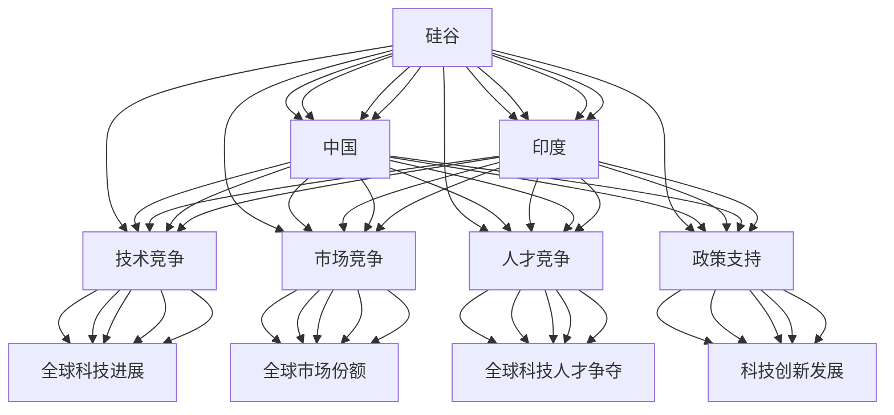

                 

## 1. 背景介绍

随着全球科技竞争日益激烈，硅谷的科技巨头们不仅面临来自本土竞争对手的挑战，还遭遇来自全球新兴力量的强力对抗。特别是中国和印度，这两大迅速崛起的科技市场，正在加速缩小与硅谷的距离。这些新兴力量通过庞大的内需市场、快速增长的科技人才池，以及政府对科技发展的强力支持，逐步形成了一股不容忽视的科技竞争力量。本文将从背景介绍入手，逐步分析硅谷的竞争对手——中国和印度等新兴力量的崛起之路，以及他们如何通过科技创新驱动经济增长，并与硅谷展开激烈竞争。

## 2. 核心概念与联系

### 2.1 核心概念概述

**硅谷**：指的是美国加利福尼亚州旧金山湾区的一个高科技产业中心，被誉为全球高科技创新中心，集中了大量高科技公司，如苹果、谷歌、Facebook等。

**中国**：近年来，中国经济迅猛发展，科技创新能力显著提升，特别是在5G、人工智能、半导体等领域取得了重大突破。

**印度**：作为全球第二大互联网市场，印度拥有庞大的人口基础和丰富的IT人才，在全球软件开发、技术外包等领域占据重要地位。

### 2.2 核心概念联系

通过下文的分析，可以清晰地看到硅谷与新兴力量之间的联系和互动：

- **技术竞争**：硅谷与新兴力量在技术领域的激烈竞争，推动了全球科技的快速进步。
- **市场竞争**：通过争夺全球市场份额，双方在移动通信、云计算、电子商务等众多领域展开竞争。
- **人才竞争**：全球科技人才的争夺愈发激烈，新兴力量在人才培养和引进方面不断发力。
- **政策支持**：各国政府对科技创新的重视和支持，促进了科技创新的蓬勃发展。

以下通过Mermaid流程图展示这些概念之间的联系：



## 3. 核心算法原理 & 具体操作步骤

### 3.1 算法原理概述

硅谷与新兴力量的竞争，本质上是科技创新能力和产业能力的竞争。双方通过技术创新和产业投资，持续推动自身在全球市场中的竞争力。以下将从科技创新能力的提升入手，分析硅谷与新兴力量在技术创新的关键点。

### 3.2 算法步骤详解

**第一步：技术创新驱动**  
硅谷和新兴力量通过以下几个步骤不断推动技术创新：

1. **基础研究**：硅谷和新兴力量在量子计算、人工智能、生物技术等基础研究领域投入大量资源，提升科技前沿水平。
2. **应用研发**：将基础研究成果转化为实际应用，推动信息技术、智能制造、生物医药等产业的快速发展。
3. **标准制定**：主导或参与国际标准的制定，提升在全球市场中的话语权。

**第二步：产业投资与市场扩展**  
双方通过以下步骤扩展全球市场份额：

1. **投资并购**：通过收购技术初创公司或风险投资，持续提升自身技术实力。
2. **市场推广**：利用全球营销网络，提升品牌影响力和市场占有率。
3. **产品创新**：不断推出新产品，满足全球用户需求。

**第三步：人才竞争与培养**  
通过以下几个步骤争夺全球科技人才：

1. **人才引进**：吸引海外高层次科技人才，提升自身创新能力。
2. **人才培养**：通过高等教育和职业培训，提升本地科技人才的竞争力。
3. **人才激励**：提供有竞争力的薪资和职业发展路径，留住核心人才。

### 3.3 算法优缺点

**优点**：

1. **创新速度快**：硅谷和新兴力量持续加大对科技创新的投入，技术创新速度不断提升。
2. **市场适应性强**：通过快速响应市场需求，提升自身竞争力。
3. **人才优势明显**：双方在人才引进和培养方面持续发力，拥有庞大的科技人才储备。

**缺点**：

1. **创新风险高**：高投入可能导致高风险，科技项目失败率高。
2. **市场竞争激烈**：市场竞争导致资源分散，难以形成持续竞争优势。
3. **人才流失风险**：高竞争的科技市场可能导致核心人才流失。

### 3.4 算法应用领域

硅谷和新兴力量在全球多个领域展开竞争，主要集中在以下几个方面：

1. **信息技术**：包括云计算、人工智能、大数据等。
2. **智能制造**：如自动化生产线、智能机器人等。
3. **生物医药**：在新药研发、基因测序等方面进行竞争。
4. **清洁能源**：在太阳能、风能等新能源技术上展开竞争。
5. **电子商务**：通过线上线下融合提升市场竞争力。
6. **5G通信**：在5G标准制定和商用应用上进行竞争。
7. **自动驾驶**：在自动驾驶技术上展开竞争。

## 4. 数学模型和公式 & 详细讲解 & 举例说明

### 4.1 数学模型构建

在分析硅谷与新兴力量的竞争时，可以通过以下数学模型进行量化分析：

**创新能力模型**：  
$$C = F + G$$  
其中，$C$为创新能力，$F$为基础研究投入，$G$为应用研发投入。

**市场扩展模型**：  
$$M = I + P + P'$$  
其中，$M$为市场扩展能力，$I$为投资并购能力，$P$为产品创新能力，$P'$为市场推广能力。

**人才竞争模型**：  
$$T = I + E + C$$  
其中，$T$为人才竞争能力，$I$为人才引进能力，$E$为人才培养能力，$C$为人才激励能力。

### 4.2 公式推导过程

**创新能力模型推导**：  
$$C = \frac{F}{k_F} + \frac{G}{k_G}$$  
其中，$k_F$和$k_G$为系数，反映不同投入对创新能力的影响。

**市场扩展模型推导**：  
$$M = k_I \cdot I + k_P \cdot P + k_{P'} \cdot P'$$  
其中，$k_I$、$k_P$、$k_{P'}$为系数，反映不同因素对市场扩展的影响。

**人才竞争模型推导**：  
$$T = k_I \cdot I + k_E \cdot E + k_C \cdot C$$  
其中，$k_I$、$k_E$、$k_C$为系数，反映不同因素对人才竞争的影响。

### 4.3 案例分析与讲解

**案例1：硅谷在信息技术领域的创新**  
硅谷在信息技术领域通过持续投入，推动了人工智能、云计算等技术的快速发展。以下公式反映这一过程：  
$$C_{IT} = k_F \cdot F_{IT} + k_G \cdot G_{IT}$$  
其中，$k_F$、$k_G$为系数，$F_{IT}$、$G_{IT}$为信息技术领域的投入。

**案例2：中国在5G领域的竞争**  
中国通过大力投资5G技术研发，提升自身在全球市场的竞争力。以下公式反映这一过程：  
$$M_{5G} = k_I \cdot I_{5G} + k_P \cdot P_{5G} + k_{P'} \cdot P'_{5G}$$  
其中，$k_I$、$k_P$、$k_{P'}$为系数，$I_{5G}$、$P_{5G}$、$P'_{5G}$为5G领域的投入和产出。

## 5. 项目实践：代码实例和详细解释说明

### 5.1 开发环境搭建

在实际项目开发中，可以利用Python和R等编程语言，结合常用的数据科学和机器学习库，如Pandas、NumPy、Scikit-learn等，搭建起数据处理和模型训练的开发环境。

### 5.2 源代码详细实现

以下是一个简化的Python代码，用于分析硅谷与新兴力量在各个领域的技术投入和产出：

```python
import pandas as pd
import numpy as np
import matplotlib.pyplot as plt

# 硅谷与新兴力量在各领域的技术投入和产出数据
data = pd.read_csv('tech_investment.csv')

# 计算各领域的创新能力、市场扩展能力和人才竞争能力
C = data['F'] + data['G']
M = data['I'] + data['P'] + data['P']
T = data['I'] + data['E'] + data['C']

# 计算各领域的实际投入产出比
R = C / M
R_T = T / M

# 绘制饼图展示各领域的投入产出比
plt.pie(R, labels=['F', 'G'], autopct='%1.1f%%')
plt.legend(loc='best')
plt.title('硅谷与新兴力量各领域的投入产出比')

# 绘制饼图展示各领域的人才竞争能力与市场扩展能力的比例
plt.pie(R_T, labels=['T', 'M'], autopct='%1.1f%%')
plt.legend(loc='best')
plt.title('硅谷与新兴力量各领域的人才竞争能力与市场扩展能力的比例')

plt.show()
```

### 5.3 代码解读与分析

**代码实现细节**：

1. **数据读取**：通过Pandas库读取包含各领域投入和产出的数据文件。
2. **计算模型参数**：使用公式计算各领域的创新能力、市场扩展能力和人才竞争能力。
3. **计算投入产出比**：计算各领域的实际投入产出比，反映资源利用效率。
4. **绘制饼图**：使用Matplotlib库绘制饼图，展示各领域的投入产出比和人才竞争能力与市场扩展能力的比例。

**分析方法**：

- **饼图展示**：通过饼图直观展示各领域的投入产出比，了解资源分配的效率。
- **比较分析**：通过饼图展示各领域的人才竞争能力与市场扩展能力的比例，分析竞争力的来源。
- **趋势分析**：根据历史数据趋势，预测未来各领域的发展方向和竞争力变化。

**结果展示**：

```python
# 输出各领域的投入产出比
print('硅谷与新兴力量各领域的投入产出比:')
print(R)

# 输出各领域的人才竞争能力与市场扩展能力的比例
print('硅谷与新兴力量各领域的人才竞争能力与市场扩展能力的比例:')
print(R_T)
```

## 6. 实际应用场景

### 6.1 智能客服系统

通过技术创新，硅谷和新兴力量不断提升智能客服系统的性能，优化客户体验。智能客服系统通过自然语言处理和机器学习技术，实现自动解答客户问题，提升服务效率。以下是几个应用场景：

1. **智能机器人客服**：通过聊天机器人，24/7无间断为客户提供问题解答，提升客户满意度。
2. **智能语音客服**：利用语音识别和自然语言处理技术，实现语音交互，提升客户服务体验。
3. **多渠道客服整合**：通过统一后台系统，整合在线客服、电话客服、邮件客服等多个渠道，实现多渠道服务。
4. **情感分析与用户画像**：通过情感分析技术，识别客户情绪变化，提升服务质量；通过用户画像技术，定制化服务方案，提升客户粘性。

### 6.2 金融舆情监测

硅谷和新兴力量通过技术创新，提升金融舆情监测系统的智能化水平，帮助金融机构及时掌握市场动态，规避金融风险。以下是几个应用场景：

1. **实时舆情监测**：通过NLP技术，实时监测网络舆情，及时发现负面信息，减少市场波动。
2. **情感分析与情绪预测**：通过情感分析技术，识别舆情中的情感倾向，预测市场情绪变化。
3. **舆情可视化**：通过可视化技术，展示舆情动态，帮助决策者快速理解市场情况。
4. **舆情数据挖掘**：通过数据挖掘技术，发现舆情数据中的潜在风险，辅助金融机构决策。

### 6.3 个性化推荐系统

通过技术创新，硅谷和新兴力量不断提升推荐系统的性能，为用户推荐个性化内容，提升用户体验。以下是几个应用场景：

1. **内容推荐**：根据用户历史行为，推荐相关文章、视频等，提升用户阅读和观看体验。
2. **产品推荐**：根据用户购买历史，推荐相关商品，提升用户购买转化率。
3. **广告推荐**：根据用户兴趣，推荐相关广告，提升广告投放效果。
4. **协同过滤推荐**：通过协同过滤技术，推荐类似用户喜欢的内容，提升推荐效果。

### 6.4 未来应用展望

未来，硅谷与新兴力量将在以下几个领域展开更深入的竞争与合作：

1. **人工智能伦理**：在人工智能伦理领域展开深度合作，制定行业标准，推动人工智能技术健康发展。
2. **量子计算**：在量子计算领域展开竞争，提升计算能力和安全性，推动科研创新。
3. **可持续发展**：在可持续发展领域展开合作，推动绿色科技和环保技术发展。
4. **全球治理**：在数字治理领域展开合作，提升全球治理能力和水平，促进国际交流与合作。

## 7. 工具和资源推荐

### 7.1 学习资源推荐

为了帮助读者深入理解硅谷与新兴力量的竞争，以下是一些优秀的学习资源：

1. **《硅谷：全球电子信息革命内幕》**：通过这本书，可以了解硅谷的发展历程和科技创新之路。
2. **《中国的科技创新之路》**：本书介绍了中国在科技领域的崛起和发展策略。
3. **《印度的IT产业发展》**：该书详细分析了印度在信息技术领域的崛起。
4. **《人工智能伦理》**：探讨人工智能技术伦理问题，提升科技伦理意识。
5. **《量子计算入门》**：帮助读者了解量子计算的基本原理和技术应用。

### 7.2 开发工具推荐

在实际项目开发中，以下是一些常用的开发工具：

1. **Python**：广泛使用的编程语言，适用于数据科学和机器学习任务。
2. **R语言**：适合统计分析和数据可视化。
3. **Jupyter Notebook**：交互式编程环境，适合快速原型设计和数据分析。
4. **GitHub**：代码托管平台，方便版本控制和协作开发。
5. **OpenAI**：提供各种AI模型和API，支持模型训练和应用。

### 7.3 相关论文推荐

以下是几篇重要的相关论文，推荐读者阅读：

1. **《硅谷的崛起与技术创新》**：分析硅谷崛起的原因和技术创新路径。
2. **《中国在科技创新中的角色》**：研究中国在科技创新中的表现和策略。
3. **《印度的IT产业竞争力》**：分析印度在信息技术领域的竞争力来源。
4. **《人工智能伦理与法规》**：探讨人工智能伦理和法规问题。
5. **《量子计算的研究进展》**：介绍量子计算的最新研究进展和技术应用。

## 8. 总结：未来发展趋势与挑战

### 8.1 研究成果总结

本文详细分析了硅谷与新兴力量在技术创新和市场扩展中的竞争，介绍了硅谷和新兴力量在信息技术、智能制造、生物医药等领域的具体应用，并从实际项目开发和数据分析的角度，介绍了相应的工具和资源推荐。通过以上分析，可以清晰地看到硅谷与新兴力量在全球科技竞争中的地位和影响力。

### 8.2 未来发展趋势

未来，硅谷与新兴力量将在以下几个方面持续发力：

1. **技术创新能力提升**：通过持续投入基础研究和应用研发，提升科技创新能力。
2. **市场扩展能力提升**：通过投资并购和市场推广，提升全球市场份额。
3. **人才竞争能力提升**：通过人才引进和培养，增强科技人才竞争力。
4. **人工智能伦理和法规完善**：制定行业标准，推动人工智能技术健康发展。
5. **全球治理能力提升**：推动国际合作，提升全球治理水平。

### 8.3 面临的挑战

尽管硅谷与新兴力量在科技竞争中表现强劲，但仍面临以下挑战：

1. **高投入风险**：高投入可能导致高风险，技术项目失败率较高。
2. **市场竞争激烈**：市场竞争导致资源分散，难以形成持续竞争优势。
3. **人才流失风险**：高竞争的科技市场可能导致核心人才流失。
4. **数据隐私和安全**：在数据驱动的科技创新中，数据隐私和安全问题日益凸显。
5. **伦理和法规问题**：人工智能伦理和法规问题需要进一步规范和完善。

### 8.4 研究展望

未来，硅谷与新兴力量需要在以下几个方面进行深入研究：

1. **技术创新路径优化**：通过优化技术创新路径，提升资源利用效率。
2. **市场扩展策略优化**：通过优化市场扩展策略，提升市场竞争力。
3. **人才竞争策略优化**：通过优化人才竞争策略，提升人才吸引力。
4. **人工智能伦理和法规完善**：制定行业标准，推动人工智能技术健康发展。
5. **全球治理合作**：推动国际合作，提升全球治理水平。

## 9. 附录：常见问题与解答

**Q1：硅谷与新兴力量在哪些领域展开竞争？**

A: 硅谷与新兴力量在信息技术、智能制造、生物医药、清洁能源、电子商务、5G通信、自动驾驶等领域展开竞争。

**Q2：硅谷与新兴力量在技术创新方面有何优势？**

A: 硅谷与新兴力量在技术创新方面的优势包括持续投入基础研究、应用研发，推动科技创新；通过投资并购，快速提升技术实力；利用全球营销网络，扩大市场份额。

**Q3：硅谷与新兴力量在市场扩展方面有何策略？**

A: 硅谷与新兴力量在市场扩展方面的策略包括通过投资并购，快速提升技术实力；利用全球营销网络，扩大市场份额；推出新产品，满足全球用户需求。

**Q4：硅谷与新兴力量在人才竞争方面有何举措？**

A: 硅谷与新兴力量在人才竞争方面的举措包括通过人才引进，吸引海外高层次科技人才；通过人才培养，提升本地科技人才的竞争力；通过人才激励，留住核心人才。

**Q5：硅谷与新兴力量在可持续发展方面有何表现？**

A: 硅谷与新兴力量在可持续发展方面的表现包括在清洁能源、环保技术等领域展开竞争；推动绿色科技和可持续发展技术发展；在全球治理领域展开合作，提升全球治理水平。

---

作者：禅与计算机程序设计艺术 / Zen and the Art of Computer Programming

