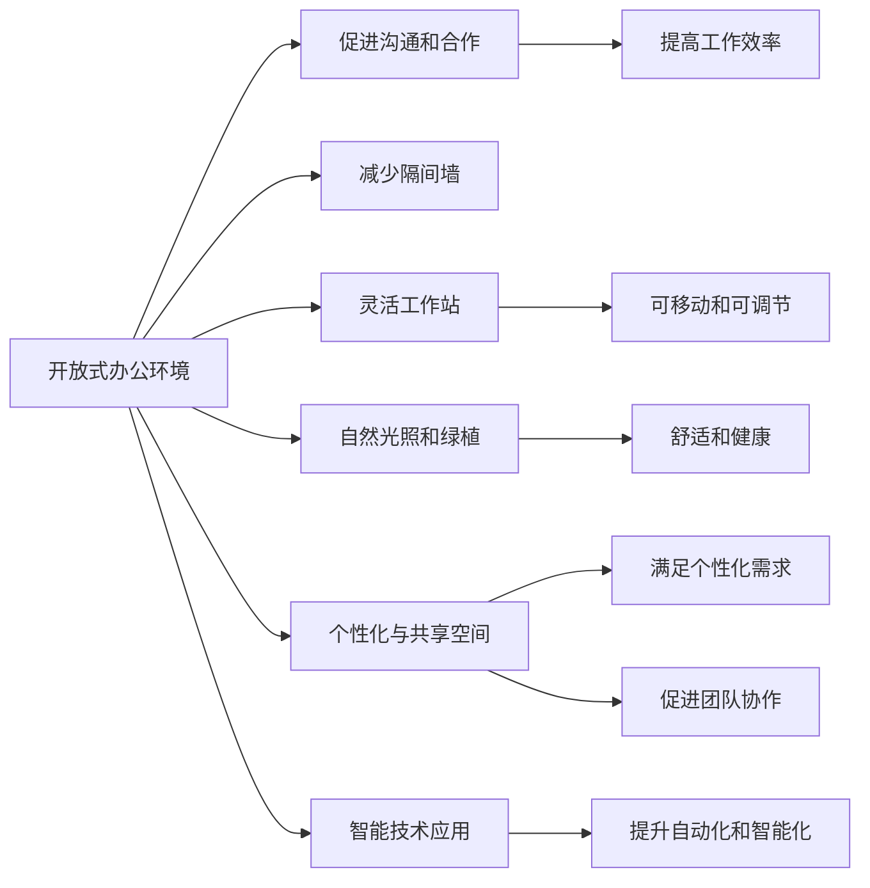

                 

# 硅谷科技公司的极简主义办公环境

在现代科技行业中，办公环境的设计和布局越来越受到重视。它不仅影响着员工的工作效率和团队协作，更塑造了企业的文化和价值观。在硅谷，科技公司如Google、Apple、Facebook等，以其独特的极简主义设计理念闻名于世。本文将深入探讨这些科技公司办公环境的极简主义设计原理、实践步骤、优缺点及其应用领域，以及未来的发展趋势和面临的挑战。

## 1. 背景介绍

### 1.1 问题由来

科技公司的办公环境设计一直是创新和提升员工满意度的重要途径。传统的开放式办公室设计曾一度流行，旨在鼓励员工间的交流与合作。但随着工作方式的变迁，越来越多的科技公司开始探索更符合现代工作需求的极简主义办公环境。这种设计理念倡导简洁、高效、舒适，旨在创造一个更加灵活、个性化的工作空间，同时兼顾团队的协作与个人的专注。

### 1.2 问题核心关键点

极简主义办公环境的核心关键点主要包括：

- 简洁的空间布局：减少不必要的装饰和家具，通过开放式空间布局促进沟通和合作。
- 灵活的工作站：提供可移动和可调整的工作站，满足不同工作模式的需求。
- 自然光照和绿植：引入自然光照和植物，营造舒适、健康的工作环境。
- 个性化与共享空间的平衡：在工作站设置个性化区域，同时在公共空间提供共享资源和交流机会。
- 智能技术的应用：引入智能照明、温控和声控系统，提升办公环境的自动化和智能化。

这些关键点共同构成了科技公司极简主义办公环境的设计原则，旨在提升员工的工作效率和幸福感，同时塑造企业的创新文化和价值观。

## 2. 核心概念与联系

### 2.1 核心概念概述

为了更好地理解硅谷科技公司极简主义办公环境的设计理念，我们首先介绍几个核心概念：

- **开放式办公环境**：打破传统的隔间墙，通过开放式设计促进员工之间的交流和合作。
- **灵活工作站**：提供可移动和可调节的工作站，适应不同工作需求和团队组成。
- **自然光照和绿植**：通过自然光照和室内植物，营造健康、舒适的工作环境。
- **个性化与共享空间的平衡**：结合个性化的工作站和公共的共享空间，支持个性化需求和团队协作。
- **智能技术应用**：通过智能系统提升办公环境的自动化和智能化，如智能照明、温控、声控等。

这些概念通过互相结合，共同构成了硅谷科技公司极简主义办公环境的设计框架。

### 2.2 核心概念原理和架构的 Mermaid 流程图



## 3. 核心算法原理 & 具体操作步骤

### 3.1 算法原理概述

极简主义办公环境的设计并非依赖于算法，而是一种基于人本主义的设计理念。核心原理是通过简约、实用和科技的融合，创造一个既高效又舒适的工作空间。

### 3.2 算法步骤详解

#### Step 1: 需求分析
- 评估公司的文化、团队规模、工作类型和员工偏好，确定极简主义办公环境的设计需求。

#### Step 2: 空间规划
- 根据需求分析结果，规划开放式的空间布局，确保有足够的空间供员工自由移动和交流。
- 设计灵活的工作站，提供可调节的桌椅和储物空间，满足不同工作需求。

#### Step 3: 引入自然光照和绿植
- 优化建筑设计，最大化自然光照的利用，减少对人工照明的依赖。
- 在室内引入植物，改善空气质量和员工的心理健康。

#### Step 4: 个性化与共享空间平衡
- 在工作站设计中提供个性化区域，满足员工对隐私和舒适的需求。
- 设置共享空间，如休息区、会议室和咖啡区，促进团队交流和合作。

#### Step 5: 智能技术应用
- 引入智能照明系统，根据自然光的变化自动调节，减少能源消耗。
- 应用智能温控系统，根据员工偏好和外部环境自动调整温度。
- 使用智能声控系统，优化噪音管理和会议体验。

#### Step 6: 测试与调整
- 在办公环境设计完成后，邀请员工反馈使用体验，根据反馈调整设计细节。

### 3.3 算法优缺点

#### 优点：
- **提高工作效率**：开放式设计促进沟通和合作，提高团队协作效率。
- **降低成本**：简洁的空间布局和灵活的工作站减少了不必要的装饰和家具，降低了装修和维护成本。
- **提升员工满意度**：自然光照和绿植营造舒适健康的工作环境，个性化和共享空间的平衡满足员工的不同需求。

#### 缺点：
- **隐私问题**：开放式设计可能影响员工的隐私和工作专注度。
- **设备维护**：智能技术的引入增加了设备的维护和故障处理负担。
- **设计复杂性**：极简主义设计需要综合考虑多方面因素，设计复杂度较高。

### 3.4 算法应用领域

极简主义办公环境的设计理念不仅适用于科技公司，同样适用于各种类型的企业和机构。它可以应用于初创公司、创意工作室、教育机构和公共办公空间等，提升工作效率和员工满意度，塑造积极的企业文化。

## 4. 数学模型和公式 & 详细讲解 & 举例说明

### 4.1 数学模型构建

本节通过数学语言对极简主义办公环境的设计过程进行更加严格的刻画。

假设办公空间的面积为 $A$，员工人数为 $N$，设计要求为 $D$（如开放性、灵活性、舒适性等）。设计目标函数为：

$$
\min_{设计} \sum_{i=1}^N \text{距离}_i^2
$$

其中，$\text{距离}_i$ 表示第 $i$ 个员工与其理想工作站之间的距离。

### 4.2 公式推导过程

通过距离平方和最小化的目标函数，我们希望找到最优的工作站布局。在实际设计中，可以通过启发式算法或优化算法进行求解。

### 4.3 案例分析与讲解

以Google公司为例，其办公室设计采用了大量的自然光照和开放空间。Google总部在Mountain View的办公空间，面积达22.5万平方米，其中大部分为开放式办公区域。Google通过设计灵活的工作站和共享空间，促进团队协作和员工个性化需求。同时，应用智能照明和温控系统，提升办公环境的自动化和智能化。

## 5. 项目实践：代码实例和详细解释说明

### 5.1 开发环境搭建

在进行极简主义办公环境设计实践前，我们需要准备好开发环境。以下是使用Python进行办公环境模拟的开发环境配置流程：

1. 安装Anaconda：从官网下载并安装Anaconda，用于创建独立的Python环境。

2. 创建并激活虚拟环境：
```bash
conda create -n office-design python=3.8 
conda activate office-design
```

3. 安装必要的Python库：
```bash
pip install numpy pandas matplotlib
```

完成上述步骤后，即可在`office-design`环境中开始设计实践。

### 5.2 源代码详细实现

以下是一个简单的Python代码示例，用于计算办公空间的布局和员工工作站的分布。

```python
import numpy as np
import matplotlib.pyplot as plt

# 定义办公空间的大小和员工数量
office_area = 5000  # 平方米
num_employees = 200

# 定义员工在工作空间中的位置
employee_positions = np.random.uniform(0, office_area, size=(num_employees, 2))

# 定义工作站的大小和位置
workspace_size = 5  # 平方米
num_workspaces = 100
workspaces = []
for i in range(num_workspaces):
    workspace_x = np.random.uniform(0, office_area)
    workspace_y = np.random.uniform(0, office_area)
    workspaces.append((workspace_x, workspace_y))

# 计算每个员工到每个工作站的距离
distances = []
for position in employee_positions:
    min_distance = np.inf
    closest_workspace = None
    for workspace in workspaces:
        distance = np.sqrt((workspace[0] - position[0])**2 + (workspace[1] - position[1])**2)
        if distance < min_distance:
            min_distance = distance
            closest_workspace = workspace
    distances.append(min_distance)

# 计算距离平方和
distance_sum = np.sum(distances**2)

# 可视化布局
plt.figure(figsize=(10, 8))
plt.scatter(employee_positions[:, 0], employee_positions[:, 1], color='blue', alpha=0.5)
for workspace in workspaces:
    plt.scatter(workspace[0], workspace[1], color='red', marker='x', s=100)
plt.title(f'Employee Positions and Workspaces')
plt.xlabel('X Position')
plt.ylabel('Y Position')
plt.show()

print(f'Distance Sum: {distance_sum:.2f}')

# 根据距离平方和最小化的目标函数，优化工作站布局
# 此处为简化示例，实际设计需考虑更多因素
```

### 5.3 代码解读与分析

让我们再详细解读一下关键代码的实现细节：

**EmployeePositions和Workspaces**：
- `employee_positions` 数组模拟了200名员工在办公空间中的随机分布位置。
- `workspaces` 数组模拟了100个工作站的随机位置。

**计算距离**：
- 使用欧几里得距离公式计算每个员工到每个工作站的距离，存入 `distances` 数组。
- 最终计算所有距离的平方和。

**可视化布局**：
- 使用 `matplotlib` 库绘制员工位置和工作站位置的散点图，直观展示布局。

**输出结果**：
- 打印出所有员工到工作站的距离平方和，用于评估设计效果。

**优化工作站布局**：
- 根据距离平方和最小化的目标函数，可以进一步使用启发式算法或优化算法进行工作站布局的优化。

## 6. 实际应用场景

### 6.1 科技公司办公环境

硅谷的科技公司如Google、Apple、Facebook等，通过极简主义办公环境设计，显著提升了员工的幸福感和工作效率。例如，Google的办公室设计不仅注重开放性，还通过引入自然光照、灵活工作站和智能技术，创造了一个既高效又舒适的工作空间。

### 6.2 初创公司办公环境

初创公司通常资源有限，极简主义办公环境设计可以提供灵活、高效的空间解决方案。例如，一家初创公司可以在有限的办公空间内，通过开放式设计和可移动工作站，最大化利用空间，促进团队协作。

### 6.3 教育机构办公环境

教育机构如大学、学校等，可以通过极简主义办公环境设计，提升教学质量和学生满意度。例如，通过引入自然光照和植物，营造健康、舒适的学习环境，同时提供共享空间促进师生互动和交流。

### 6.4 公共办公环境

公共办公空间如图书馆、咖啡厅等，通过极简主义设计理念，可以提供灵活、多功能的空间，满足不同人群的需求。例如，图书馆可以在开放空间中设置安静的阅读区和灵活的讨论区，提升空间利用率。

## 7. 工具和资源推荐

### 7.1 学习资源推荐

为了帮助设计师系统掌握极简主义办公环境的设计理念和实践技巧，这里推荐一些优质的学习资源：

1. 《Less Is More: The Origins and Future of Minimalism in Design》：一本关于极简主义设计的经典著作，详细介绍了极简主义的历史和理论。
2. 《The Architecture of Minimalism: Designing Less》：一本关于极简主义建筑设计的专业书籍，提供了大量案例和设计指南。
3. 《The Minimalist Handbook》：一本简明的极简主义生活指南，涵盖设计、生活和工作各个方面的建议。

通过对这些资源的学习实践，相信你可以系统掌握极简主义办公环境的设计方法和实践技巧。

### 7.2 开发工具推荐

高效的开发离不开优秀的工具支持。以下是几款用于办公环境设计的常用工具：

1. SketchUp：一个强大的3D设计软件，适合绘制和展示办公空间的设计方案。
2. AutoCAD：一款功能强大的二维和三维设计软件，适合进行精确的布局和渲染。
3. Revit：一个建筑信息模型软件，适合进行建筑物的详细设计和施工管理。

这些工具可以帮助设计师进行更精确和高效的设计工作。

### 7.3 相关论文推荐

极简主义办公环境的设计理念和实践已经吸引了众多学者的关注，以下是几篇奠基性的相关论文，推荐阅读：

1. "Minimalist Design: Theories, Principles, and Applications in Architecture and Urban Planning"：探讨极简主义在设计中的理论和应用。
2. "The Future of Work: Designing for Remote, Flex, and Fixed"：介绍如何在现代工作环境中设计极简主义办公空间。
3. "Minimalist Office Design: A Comprehensive Guide"：一本关于极简主义办公环境设计的详细指南，涵盖设计原则和案例分析。

这些论文代表了大语言模型微调技术的发展脉络。通过学习这些前沿成果，可以帮助研究者把握学科前进方向，激发更多的创新灵感。

## 8. 总结：未来发展趋势与挑战

### 8.1 总结

本文对硅谷科技公司极简主义办公环境的设计理念进行了全面系统的介绍。首先阐述了极简主义办公环境的设计背景和意义，明确了其设计目标和关键点。其次，从原理到实践，详细讲解了极简主义办公环境的设计过程和具体步骤，给出了设计实践的完整代码实例。同时，本文还探讨了极简主义办公环境在科技公司、初创公司、教育机构和公共办公空间等场景中的应用前景，展示了其巨大的潜力。此外，本文精选了极简主义办公环境的设计资源，力求为读者提供全方位的指导。

通过本文的系统梳理，可以看到，硅谷科技公司极简主义办公环境设计理念为现代办公空间提供了新的方向，极大地提升了员工的工作效率和满意度。未来，伴随技术的不断进步和设计理念的深入探索，极简主义办公环境必将在更多领域得到应用，推动办公空间设计的不断创新和进步。

### 8.2 未来发展趋势

展望未来，硅谷科技公司的极简主义办公环境设计将继续呈现以下几个发展趋势：

1. **智能技术的融合**：未来办公环境将更加注重智能技术的融合，如AI、物联网、自动化系统等，提升办公环境的智能化和自动化水平。
2. **个性化与共享空间的结合**：通过更灵活的空间布局和智能系统，实现个性化和共享空间的无缝结合，满足不同员工的需求。
3. **健康和可持续性**：更加注重办公环境的健康和可持续性，如采用绿色建材、智能温控和照明系统等，实现节能减排。
4. **远程和混合工作模式**：随着远程和混合工作模式的普及，办公环境设计将更多地考虑远程协作和灵活办公的需求。
5. **文化多样性**：为适应全球化的趋势，办公环境设计将更加注重文化多样性和包容性，提供多语言、多文化的支持。

以上趋势凸显了硅谷科技公司极简主义办公环境设计的广阔前景。这些方向的探索发展，必将进一步提升办公环境的设计水平，为员工创造更加舒适、高效的工作空间。

### 8.3 面临的挑战

尽管极简主义办公环境设计理念已经取得了显著成效，但在迈向更加智能化、普适化应用的过程中，它仍面临诸多挑战：

1. **隐私和安全问题**：开放式的办公环境可能带来隐私和安全问题，需要设计更多的隐私保护措施。
2. **设备维护成本**：智能设备的引入增加了设备的维护和故障处理负担，需要完善的技术支持和维护方案。
3. **设计和实施复杂性**：极简主义办公环境的设计和实施需要综合考虑多方面因素，设计复杂度较高，需要专业的设计和施工团队。
4. **文化适应性**：不同文化背景的企业和员工对办公环境的需求可能存在差异，需要灵活调整设计方案。

这些挑战凸显了硅谷科技公司极简主义办公环境设计的多样性和复杂性。唯有在设计和实施过程中不断优化和调整，才能确保设计方案的有效性和可持续性。

### 8.4 研究展望

面对硅谷科技公司极简主义办公环境设计所面临的挑战，未来的研究需要在以下几个方面寻求新的突破：

1. **隐私和安全保护**：研究如何在开放式办公环境中保护员工的隐私和数据安全，如引入智能监控和隐私保护技术。
2. **智能设备的维护和管理**：开发更加智能和可靠的办公设备，降低维护和管理成本。
3. **多文化设计方案**：设计更多适应不同文化背景的企业和员工的需求，提供多语言、多文化的支持。
4. **数据驱动的设计优化**：利用数据分析和人工智能技术，优化办公环境的布局和设计，提高设计效率和质量。

这些研究方向的探索，必将引领硅谷科技公司极简主义办公环境设计走向更高的台阶，为员工创造更加舒适、高效和可持续的工作空间。面向未来，我们需要在设计和实施过程中不断创新和优化，确保设计方案的普适性和有效性。

## 9. 附录：常见问题与解答

**Q1: 极简主义办公环境如何影响员工的工作效率？**

A: 极简主义办公环境通过开放式设计、自然光照、绿植和个性化空间，营造了一个更加舒适、健康的工作环境，有助于提升员工的工作满意度和专注度，从而提高工作效率。

**Q2: 在实现极简主义办公环境时，有哪些设计要点需要注意？**

A: 在实现极简主义办公环境时，需要注意以下几点设计要点：
1. 确保开放性，促进团队协作和沟通。
2. 提供灵活的工作站，满足不同工作需求和团队组成。
3. 引入自然光照和绿植，改善空气质量和员工的心理健康。
4. 平衡个性化和共享空间，满足员工的不同需求。
5. 应用智能技术，提升办公环境的自动化和智能化。

**Q3: 极简主义办公环境设计需要考虑哪些因素？**

A: 极简主义办公环境设计需要考虑以下几个因素：
1. 公司的文化、团队规模和工作类型。
2. 员工的需求和偏好，如隐私、舒适和灵活性。
3. 办公空间的大小和布局，如开放式设计、灵活工作站和共享空间。
4. 自然光照和绿植的引入，营造健康的工作环境。
5. 智能技术的融合，提升办公环境的自动化和智能化。

**Q4: 如何评估极简主义办公环境设计的效果？**

A: 评估极简主义办公环境设计的效果可以从以下几个方面进行：
1. 员工满意度调查，了解员工对工作环境的反馈。
2. 工作效率和生产力的数据，评估工作环境对工作表现的影响。
3. 健康和心理指标，如办公室空气质量、噪音水平和员工压力指数。
4. 设备维护和故障率，评估智能技术的应用效果。

---

作者：禅与计算机程序设计艺术 / Zen and the Art of Computer Programming

