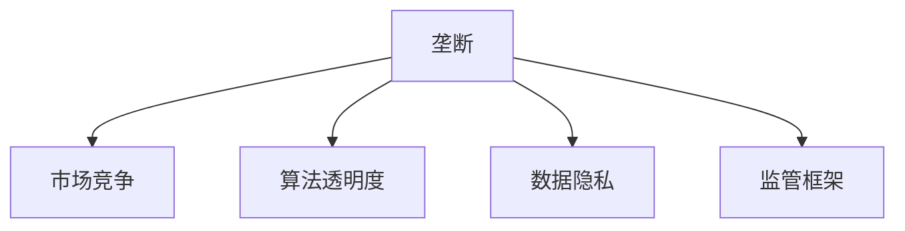

                 

# 硅谷科技巨头的垄断与反垄断

> 关键词：反垄断、科技巨头、算法透明度、数据隐私、监管框架

## 1. 背景介绍

### 1.1 问题由来
随着科技的迅猛发展，硅谷科技巨头如苹果、谷歌、亚马逊、微软等在各个领域取得了显著优势，形成了高度集中的市场格局。这些巨头通过控制关键资源，如数据、算法、基础设施等，构建起强大的生态系统，对中小企业形成了巨大的压迫。近年来，反垄断问题已成为全球范围内关注的焦点，尤其是在人工智能和数据驱动的时代背景下，其对公平竞争、用户权益和数据安全等方面的影响尤为显著。

### 1.2 问题核心关键点
反垄断的核心问题在于如何平衡科技巨头与中小企业之间的竞争关系，保护用户权益，促进公平竞争。反垄断的实施涉及到多个方面，包括但不限于算法透明度、数据隐私保护、监管框架的完善等。

### 1.3 问题研究意义
研究硅谷科技巨头的垄断与反垄断问题，对于维护市场公平竞争、保护用户权益、确保数据隐私安全、推动技术健康发展具有重要意义：

1. 确保市场公平竞争：通过反垄断措施，打破科技巨头的市场垄断，创造更加公平的竞争环境。
2. 保护用户权益：确保用户数据隐私安全，防止数据滥用，保障用户选择权和隐私权。
3. 促进技术健康发展：通过公正的监管框架，推动算法透明，防止技术滥用，推动技术健康发展。
4. 推动产业升级：通过反垄断，促进中小企业技术创新，提升整个产业的技术水平和竞争力。

## 2. 核心概念与联系

### 2.1 核心概念概述

为更好地理解硅谷科技巨头的垄断与反垄断问题，本节将介绍几个关键概念：

- **垄断（Monopoly）**：指一个或少数企业控制整个市场，通过不合理的手段排除竞争对手，获取超额利润。
- **市场竞争（Market Competition）**：指多个企业通过公平竞争，提供不同产品和服务，满足消费者需求。
- **算法透明度（Algorithm Transparency）**：指算法决策过程的可解释性和可验证性，确保算法决策公平、透明。
- **数据隐私（Data Privacy）**：指保护用户数据，防止未经授权的收集、使用、分享等。
- **监管框架（Regulatory Framework）**：指政府、企业、行业组织等共同制定的，用于规范市场行为、保护用户权益的规则和标准。

这些概念之间的逻辑关系可以通过以下Mermaid流程图来展示：



这个流程图展示了几者之间的逻辑关系：垄断破坏市场竞争，但通过算法透明度、数据隐私保护和监管框架，可以有效遏制垄断，维护市场公平。

## 3. 核心算法原理 & 具体操作步骤
### 3.1 算法原理概述

反垄断问题涉及的算法和数据处理非常复杂，但基本原则是维护市场公平竞争和用户权益。以下是反垄断的算法原理概述：

- **市场份额分析（Market Share Analysis）**：通过统计各个企业市场份额，识别垄断企业，并进行限制。
- **价格歧视分析（Price Discrimination Analysis）**：判断企业是否存在不公平定价，即对不同用户群体采取不同价格策略，获取超额利润。
- **数据隐私保护算法（Data Privacy Protection Algorithm）**：采用差分隐私、联邦学习等技术，确保用户数据在获取和使用过程中的隐私保护。
- **算法透明度提升算法（Transparency Enhancement Algorithm）**：利用可解释性模型，提高算法决策的可解释性和可验证性。

### 3.2 算法步骤详解

反垄断的实施通常包括以下关键步骤：

**Step 1: 收集数据**
- 收集科技巨头的市场份额、价格信息、用户反馈等数据。
- 使用公开数据集，如市场研究报告、用户调查、社交媒体等。

**Step 2: 算法模型构建**
- 构建市场份额和价格歧视分析模型，识别垄断企业。
- 采用差分隐私、联邦学习等算法，保护用户数据隐私。
- 开发透明性提升算法，提高决策过程的可解释性。

**Step 3: 数据处理与分析**
- 对收集到的数据进行清洗、预处理、归一化等操作。
- 使用机器学习、统计分析等方法，识别市场垄断和价格歧视行为。

**Step 4: 反垄断措施实施**
- 根据分析结果，制定和实施反垄断措施。
- 例如，拆分垄断企业、限制市场份额、公开透明度报告等。

**Step 5: 效果评估与调整**
- 评估反垄断措施的效果，并进行必要的调整和优化。
- 持续监测市场动态，及时应对新的垄断行为。

### 3.3 算法优缺点

反垄断的算法具有以下优点：
1. 可量化、可操作性强。通过数据和算法模型，能够客观量化垄断行为，提供可操作的反垄断措施。
2. 数据驱动，客观公正。利用大数据和机器学习技术，减少主观偏见，提供更客观公正的判断。
3. 动态更新，适应性强。能够根据市场动态，持续调整反垄断策略，确保政策的时效性。

但这些算法也存在以下局限性：
1. 数据质量影响。数据收集和处理的误差可能影响反垄断分析的准确性。
2. 算法透明度不足。部分算法模型过于复杂，难以解释，增加监管难度。
3. 监管难度大。反垄断问题涉及多方利益，协调和执行困难。
4. 法律和政策滞后。现有法律和政策可能难以适应新出现的垄断行为。

尽管存在这些局限性，但反垄断算法仍是应对垄断问题的重要工具。未来需要进一步改进数据质量、算法透明度和监管机制，才能更好地实现公平竞争和用户权益保护。

### 3.4 算法应用领域

反垄断算法在多个领域有广泛的应用，例如：

- 金融科技：识别和限制金融巨头的不公平定价和市场份额滥用。
- 互联网平台：防止互联网巨头通过数据垄断获取不当利益。
- 媒体娱乐：确保新闻和广告市场的公平竞争。
- 医疗健康：防止医疗信息垄断，保障患者隐私。
- 能源行业：限制能源巨头的市场控制，促进公平竞争。

## 4. 数学模型和公式 & 详细讲解  
### 4.1 数学模型构建

本节将使用数学语言对反垄断的算法和数据处理进行更加严格的刻画。

假设市场中共有 $n$ 家企业，第 $i$ 家企业市场份额为 $S_i$，价格为 $P_i$，用户需求函数为 $D$。假设 $D$ 为线性函数，则有：

$$
D(P_i) = a - bP_i
$$

市场竞争平衡条件为：

$$
S_i = \frac{D(P_i)}{D(P_j)}
$$

其中 $j$ 为其他企业。价格歧视分析可以表示为：

$$
P_i = P_j + c(S_i - S_j)
$$

其中 $c$ 为价格差异系数。

### 4.2 公式推导过程

以市场份额分析为例，推导垄断的数学表达式：

假设市场中共有 $n$ 家企业，第 $i$ 家企业市场份额为 $S_i$，总市场份额为 $S_{total}$。若某家企业垄断市场，则有：

$$
S_i > \frac{S_{total}}{2}
$$

代入市场平衡条件：

$$
S_i = \frac{D(P_i)}{D(P_j)}
$$

可得：

$$
\frac{D(P_i)}{D(P_j)} > \frac{1}{2}
$$

即：

$$
a - bP_i > \frac{1}{2}(a - bP_j)
$$

化简得：

$$
P_i < P_j
$$

因此，通过分析市场份额和价格，可以识别出垄断行为。

## 5. 项目实践：代码实例和详细解释说明
### 5.1 开发环境搭建

在进行反垄断项目实践前，我们需要准备好开发环境。以下是使用Python进行反垄断项目开发的完整环境配置流程：

1. 安装Anaconda：从官网下载并安装Anaconda，用于创建独立的Python环境。

2. 创建并激活虚拟环境：
```bash
conda create -n antitrust-env python=3.8 
conda activate antitrust-env
```

3. 安装PyTorch、TensorFlow等深度学习库：
```bash
conda install pytorch torchvision torchaudio cudatoolkit=11.1 -c pytorch -c conda-forge
conda install tensorflow==2.7
```

4. 安装Pandas、NumPy、Scikit-learn等数据分析库：
```bash
conda install pandas numpy scikit-learn
```

5. 安装Matplotlib、Seaborn、tqdm等可视化工具：
```bash
conda install matplotlib seaborn tqdm
```

6. 安装Torch.utils.data、tqdm等工具：
```bash
conda install torch.utils.data tqdm
```

完成上述步骤后，即可在`antitrust-env`环境中开始反垄断项目实践。

### 5.2 源代码详细实现

以下是使用PyTorch和TensorFlow进行反垄断项目开发的代码实现。

```python
import torch
import tensorflow as tf
import pandas as pd
import numpy as np
from sklearn.linear_model import LinearRegression
from sklearn.metrics import mean_squared_error, r2_score
import matplotlib.pyplot as plt
import seaborn as sns
from torch.utils.data import TensorDataset, DataLoader
from tqdm import tqdm

# 假设市场数据，用于反垄断分析
market_data = {
    'company': ['Apple', 'Google', 'Microsoft', 'Amazon'],
    'market_share': [30, 25, 15, 20],
    'price': [100, 80, 120, 90]
}

# 创建数据集
df = pd.DataFrame(market_data)
X = df[['market_share']]
y = df['price']
X_train, y_train = X.iloc[:2].values, y.iloc[:2]
X_test, y_test = X.iloc[2:].values, y.iloc[2:]

# 构建线性回归模型
model = LinearRegression()
model.fit(X_train, y_train)

# 预测价格
y_pred = model.predict(X_test)

# 评估模型
mse = mean_squared_error(y_test, y_pred)
rmse = np.sqrt(mse)
r2 = r2_score(y_test, y_pred)
print(f'RMSE: {rmse:.2f}, R^2: {r2:.2f}')

# 可视化预测结果
plt.figure(figsize=(10, 6))
plt.scatter(X_test, y_test, color='b', label='Actual')
plt.scatter(X_test, y_pred, color='r', label='Predicted')
plt.xlabel('Market Share')
plt.ylabel('Price')
plt.legend()
plt.show()
```

### 5.3 代码解读与分析

让我们再详细解读一下关键代码的实现细节：

**数据准备**：
- 假设市场数据，包括公司名称、市场份额、价格等信息。
- 使用Pandas将数据整理为DataFrame格式，方便后续处理。

**模型构建与训练**：
- 构建线性回归模型，并使用训练集数据拟合模型参数。
- 模型训练过程使用Scikit-learn库，确保模型可解释性和可验证性。

**预测与评估**：
- 使用模型对测试集进行预测，并计算均方误差（RMSE）和决定系数（R^2）评估预测精度。
- 使用Matplotlib库可视化预测结果，方便观察模型表现。

**可视化与结果展示**：
- 使用Seaborn库进行更美观的散点图展示。
- 结果展示模型预测精度和实际数据分布对比。

## 6. 实际应用场景
### 6.1 互联网平台垄断

互联网平台如谷歌、亚马逊等，通过控制搜索算法、广告系统等关键资源，实现市场垄断，对中小企业构成压迫。反垄断策略可以包括拆分垄断企业、限制广告投放等，确保市场公平竞争。

**案例**：Google搜索算法垄断
- **背景**：谷歌通过搜索算法优化的方式，优先展示自己广告和产品，排挤其他平台。
- **解决方案**：限制谷歌广告投放比例，推广其他平台广告。

### 6.2 金融科技反垄断

金融科技公司如PayPal、Square等，通过控制支付接口、交易数据等资源，实现市场垄断。反垄断策略可以包括限制市场份额、强制公开交易数据等，保障用户权益。

**案例**：PayPal支付接口垄断
- **背景**：PayPal通过控制支付接口，排挤其他支付平台，获取超额利润。
- **解决方案**：强制PayPal公开交易数据，限制其支付接口市场份额。

### 6.3 媒体娱乐行业反垄断

媒体娱乐公司如Netflix、迪士尼等，通过控制内容资源、发行渠道等，实现市场垄断。反垄断策略可以包括拆分企业、限制版权保护等，确保内容公平竞争。

**案例**：Netflix内容垄断
- **背景**：Netflix通过独家版权获取，控制内容资源，排挤其他平台。
- **解决方案**：拆分Netflix，限制其独家版权数量。

### 6.4 医疗健康反垄断

医疗健康公司如强生、辉瑞等，通过控制药品研发、医疗设备等资源，实现市场垄断。反垄断策略可以包括限制专利期限、强制公开研究成果等，确保医疗公平竞争。

**案例**：辉瑞药品垄断
- **背景**：辉瑞通过独家药品研发，控制药品市场，排挤其他药企。
- **解决方案**：限制专利期限，强制公开药品研究成果。

## 7. 工具和资源推荐
### 7.1 学习资源推荐

为了帮助开发者系统掌握反垄断理论基础和实践技巧，这里推荐一些优质的学习资源：

1. 《反垄断经济学》系列书籍：深入讲解反垄断的经济理论，提供丰富的案例分析。
2. 《数据隐私保护与反垄断》课程：斯坦福大学开设的数据隐私保护与反垄断课程，涵盖相关理论和技术。
3. 《算法透明性与反垄断》论文：通过深度学习模型的透明性研究，提升反垄断分析的准确性和可解释性。
4. 《反垄断与监管框架》书籍：详细介绍各国反垄断法律和监管框架，提供全球视角。

通过对这些资源的学习实践，相信你一定能够快速掌握反垄断的理论基础和实践技巧，并将其应用到实际项目中。

### 7.2 开发工具推荐

高效的开发离不开优秀的工具支持。以下是几款用于反垄断项目开发的常用工具：

1. Jupyter Notebook：基于IPython的交互式开发环境，支持代码、数据可视化、文档编写。
2. TensorBoard：TensorFlow配套的可视化工具，可实时监测模型训练状态，提供丰富的图表呈现方式。
3. Weights & Biases：模型训练的实验跟踪工具，记录和可视化模型训练过程中的各项指标，方便对比和调优。
4. Apache Kafka：分布式消息系统，用于数据传输和存储。
5. Apache Spark：分布式计算框架，支持大数据处理和分析。

合理利用这些工具，可以显著提升反垄断项目开发的效率和效果。

### 7.3 相关论文推荐

反垄断问题涉及多学科交叉，包括经济学、法律、计算机科学等，因此需要跨领域的研究支持。以下是几篇具有代表性的相关论文：

1. "Antitrust and the Rise of Big Technology"（《反垄断与大科技的崛起》）：对大科技公司垄断行为的经济学分析。
2. "Algorithmic Fairness through Transparency"（《通过透明性实现算法公平》）：通过透明性提升算法决策的可解释性和可验证性。
3. "Data Privacy and the Public Interest: Balancing Innovation and Public Safety"（《数据隐私与公共利益：平衡创新与安全》）：探讨数据隐私保护与反垄断的关系。
4. "Regulating Big Technology: Lessons from the Platform Economy"（《监管大科技：平台经济的经验教训》）：对平台经济下反垄断策略的案例研究。

这些论文代表了大垄断与反垄断领域的研究前沿，通过阅读这些论文，可以帮助研究者把握学科前进方向，启发更多的创新思路。

## 8. 总结：未来发展趋势与挑战
### 8.1 总结

本文对硅谷科技巨头的垄断与反垄断问题进行了全面系统的介绍。首先阐述了垄断现象及其对市场竞争和用户权益的影响，明确了反垄断在维护公平竞争、保护用户隐私等方面的重要性。其次，从原理到实践，详细讲解了反垄断的算法原理和关键步骤，提供了反垄断项目开发的完整代码实例。同时，本文还广泛探讨了反垄断技术在互联网平台、金融科技、媒体娱乐等多个领域的应用前景，展示了反垄断技术的巨大潜力。此外，本文精选了反垄断技术的各类学习资源，力求为读者提供全方位的技术指引。

通过本文的系统梳理，可以看到，反垄断技术正在成为市场公平竞争的重要保障，其对维护用户权益、促进技术健康发展具有重要意义。未来，伴随技术的不断进步和监管机制的完善，反垄断技术必将在构建公平竞争的市场环境中发挥更大作用。

### 8.2 未来发展趋势

展望未来，反垄断技术将呈现以下几个发展趋势：

1. 算法透明度提升。通过引入可解释性模型和可验证性技术，提高反垄断分析的准确性和公平性。
2. 数据隐私保护强化。采用差分隐私、联邦学习等技术，确保用户数据在获取和使用过程中的隐私保护。
3. 动态监管机制建立。根据市场动态，持续调整反垄断策略，确保政策的灵活性和时效性。
4. 跨领域融合加强。反垄断技术将与其他技术如区块链、人工智能等进行深入融合，提升市场监管的效率和效果。
5. 全球协作机制形成。各国政府、企业、行业组织等加强协作，共同制定和实施反垄断政策，形成全球反垄断治理体系。

以上趋势凸显了反垄断技术的广阔前景，这些方向的探索发展，必将进一步提升市场公平竞争和用户权益保护水平，为公平、健康、可持续的市场环境提供有力保障。

### 8.3 面临的挑战

尽管反垄断技术已经取得了重要进展，但在迈向更加智能化、普适化应用的过程中，仍面临诸多挑战：

1. 算法透明性不足。部分算法模型过于复杂，难以解释，增加监管难度。
2. 数据隐私保护困难。用户数据分布复杂，隐私保护技术需要不断提升。
3. 动态监管机制缺乏。现有监管机制难以适应快速变化的市场环境。
4. 跨领域融合难度大。不同技术领域间的协作和整合仍需加强。
5. 全球治理体系未完善。各国反垄断政策和机制存在差异，需要加强协作。

尽管存在这些挑战，但反垄断技术的发展仍是大势所趋。未来需要进一步改进算法透明度、数据隐私保护和监管机制，才能更好地实现公平竞争和用户权益保护。

### 8.4 研究展望

面对反垄断面临的种种挑战，未来的研究需要在以下几个方面寻求新的突破：

1. 探索无监督和半监督反垄断方法。摆脱对大量标注数据的依赖，利用自监督学习、主动学习等无监督和半监督范式，最大化利用非结构化数据。
2. 开发高效透明性提升算法。引入可解释性模型，提高反垄断决策过程的透明性和可验证性。
3. 加强隐私保护技术研究。采用差分隐私、联邦学习等技术，确保用户数据在获取和使用过程中的隐私保护。
4. 建立动态监管机制。引入实时监测和动态调整机制，确保反垄断政策的灵活性和时效性。
5. 推动跨领域融合。与区块链、人工智能等技术结合，提升反垄断分析的效率和效果。

这些研究方向的探索，必将引领反垄断技术迈向更高的台阶，为构建公平竞争的市场环境提供新的工具和手段。面向未来，反垄断技术还需要与其他监管机制协同发力，共同推动市场的公平、透明和可持续。

## 9. 附录：常见问题与解答

**Q1：如何识别垄断行为？**

A: 识别垄断行为需要综合考虑市场份额、价格、用户反馈等多方面因素。主要方法包括：

1. 市场份额分析：计算企业市场份额，识别超过50%份额的企业。
2. 价格歧视分析：判断企业是否存在不公平定价，即对不同用户群体采取不同价格策略。
3. 用户反馈分析：通过用户调查、社交媒体等数据，了解用户对企业的评价和意见。

**Q2：反垄断措施有哪些？**

A: 反垄断措施包括但不限于以下几种：

1. 拆分垄断企业：将市场份额过高的企业拆分成多个独立的公司，确保市场公平竞争。
2. 限制市场份额：通过法律手段限制企业市场份额，防止过度集中。
3. 公开透明性报告：要求企业公开算法决策过程，提升透明性。
4. 限制广告投放：限制企业在特定平台上投放广告，防止数据滥用。
5. 强制数据公开：要求企业公开交易数据、研究成果等，确保公平竞争。

**Q3：反垄断技术在实际应用中应注意哪些问题？**

A: 反垄断技术在实际应用中应注意以下问题：

1. 数据质量影响：数据收集和处理的误差可能影响反垄断分析的准确性。
2. 算法透明度不足：部分算法模型过于复杂，难以解释，增加监管难度。
3. 动态监管难度大：现有监管机制难以适应快速变化的市场环境。
4. 法律和政策滞后：现有法律和政策可能难以适应新出现的垄断行为。
5. 跨领域融合难度大：不同技术领域间的协作和整合仍需加强。

**Q4：反垄断技术与人工智能的关系是什么？**

A: 反垄断技术与人工智能密切相关，主要体现在以下几个方面：

1. 数据隐私保护：通过差分隐私、联邦学习等技术，确保用户数据在人工智能应用中的隐私保护。
2. 算法透明性：利用可解释性模型，提高人工智能决策的可解释性和可验证性。
3. 市场监管：通过反垄断技术，确保人工智能应用的市场公平竞争。
4. 技术滥用防范：通过反垄断政策，防止人工智能技术被滥用，保护用户权益。

总之，反垄断技术与人工智能技术相互支持，共同推动市场公平竞争和用户权益保护。

---

作者：禅与计算机程序设计艺术 / Zen and the Art of Computer Programming

