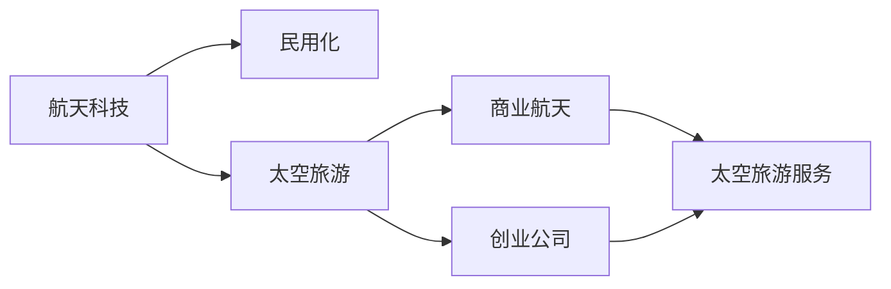

                 

# 硅谷航天科技民用化:太空旅游产业

> 关键词：航天科技,民用化,太空旅游,商业航天,创业公司,硅谷,SpaceX,蓝色起源,航天发射服务,火箭回收技术,太空旅游服务

## 1. 背景介绍

### 1.1 问题由来
近年来，随着全球科技的迅速发展，航天科技逐渐从遥不可及的神秘领域走入人们的日常生活。硅谷作为全球科技创新中心，在航天科技民用化方面走在了全球前列，特别是太空旅游产业的发展尤为引人瞩目。

太空旅游，指通过商业航天公司提供的太空旅行服务，让普通人也能体验到航天飞行的奇妙之旅。相较于传统航天活动的政府主导，太空旅游更侧重于商业化和民用化，为大众带来全新的体验。

太空旅游具有广阔的市场前景。根据国际宇航联合会的数据，2021年全球太空旅游市场规模已达15亿美元，预计到2030年将达到300亿美元。

### 1.2 问题核心关键点
太空旅游产业发展需关注的关键问题有：

- **技术成熟度**：航天技术还需进一步成熟，以确保太空旅行的安全性。
- **商业模式**：太空旅游公司如何制定商业模型，在保证安全的前提下实现盈利。
- **成本控制**：降低太空旅游成本，吸引更多大众参与。
- **市场推广**：如何有效推广太空旅游，提高公众知晓度和兴趣。
- **监管政策**：太空旅游涉及国家安全，需制定合理监管政策。

这些关键点决定了太空旅游产业能否在硅谷实现真正意义上的民用化，并走向全球。

## 2. 核心概念与联系

### 2.1 核心概念概述

为更好地理解硅谷航天科技民用化与太空旅游产业的关系，本节将介绍几个关键概念：

- **航天科技**：利用高新技术，如火箭技术、航天器设计、轨道控制等，实现太空探索和利用。
- **民用化**：将原本服务于军事、科研的航天技术，转用于民用领域，推动技术成果的商业化应用。
- **太空旅游**：通过商业航天公司的太空旅游服务，让普通人也能体验太空旅行的奇妙之旅。
- **商业航天**：指由企业主导的航天活动，与传统的政府主导相比，更注重经济效益和技术创新。
- **创业公司**：如SpaceX、蓝色起源等，在商业航天领域扮演重要角色，推动航天科技的民用化。

这些概念之间相互联系，共同构成了硅谷航天科技民用化的主要方向。

### 2.2 核心概念原理和架构的 Mermaid 流程图


这个流程图展示了大语言模型的核心概念及其之间的关系：

1. 航天科技是民用化的基础。
2. 民用化是航天科技转变为民用应用的重要途径。
3. 太空旅游是民用化的一个重要方向，旨在实现公众参与太空旅行。
4. 商业航天是实现太空旅游的主要驱动力，众多创业公司参与其中。

这些概念共同构成了硅谷航天科技民用化的应用框架，使其能够在商业航天领域得到进一步发展。

## 3. 核心算法原理 & 具体操作步骤
### 3.1 算法原理概述

硅谷航天科技民用化与太空旅游产业的发展，本质上是技术创新与市场应用的结合。其核心在于将航天科技转化为民用服务，通过商业化手段推动技术成果的落地。

航天科技民用化的技术基础是高效的商业航天技术，这包括：

- **火箭回收技术**：提高火箭的重复使用次数，降低发射成本。
- **太空旅游服务**：提供定制化的太空旅游体验，满足不同用户需求。
- **航天发射服务**：为各类科研和商业客户提供发射服务，实现商业化的航天发射。

这些技术创新和应用，使得航天科技更加平民化，为太空旅游产业提供了可能。

### 3.2 算法步骤详解

硅谷航天科技民用化与太空旅游产业发展的具体步骤如下：

**Step 1: 技术研发**
- 重点研发高效的商业航天技术，如火箭回收技术、太空旅游舱设计、航天器控制系统等。
- 通过技术迭代，提高太空旅游的安全性和舒适性。

**Step 2: 商业化探索**
- 建立商业化商业模式，如采用订阅制、单次购买等方式，吸引用户。
- 开展市场调研，分析用户需求和支付意愿，制定价格策略。

**Step 3: 合作伙伴建立**
- 与科研机构、政府机构等合作，获得技术支持、政策支持。
- 与知名品牌、旅游公司合作，共同推广太空旅游服务。

**Step 4: 技术验证**
- 通过小规模试点项目，验证商业化模式的可行性。
- 收集用户反馈，优化产品和商业模式。

**Step 5: 大规模推广**
- 基于试点成功经验，扩大服务规模，拓展市场。
- 加强市场营销，提升品牌知名度，吸引更多用户参与。

### 3.3 算法优缺点

硅谷航天科技民用化与太空旅游产业的算法优点包括：

- **技术创新**：通过技术创新实现商业化应用，推动航天科技民用化进程。
- **市场潜力**：太空旅游市场巨大，具有广阔的发展前景。
- **商业模式多样**：多种商业模式（如订阅制、单次购买等）可供选择，灵活应对市场需求。

同时，该算法也存在以下缺点：

- **技术复杂度高**：航天科技涉及多个领域的复杂技术，研发难度大。
- **成本高昂**：商业航天涉及大量研发和发射成本，初期投资压力大。
- **市场推广难度大**：普通公众对太空旅游的认知度不高，推广难度大。
- **监管难度大**：涉及国家安全，需制定合理监管政策。

尽管存在这些局限性，但就目前而言，硅谷航天科技民用化与太空旅游产业的发展，依然是大势所趋。未来相关研究的重点在于如何进一步降低技术复杂度和初期成本，提高市场推广效率，同时兼顾安全和监管要求。

### 3.4 算法应用领域

硅谷航天科技民用化与太空旅游产业的应用领域广泛，包括：

- **航天发射服务**：为各类科研和商业客户提供发射服务。
- **太空旅游服务**：提供定制化的太空旅游体验。
- **科研合作**：与科研机构合作，进行太空科研实验。
- **卫星部署**：为商业客户部署卫星，提供通信、遥感等服务。
- **空间站运营**：参与国际空间站等大型航天项目的运营。

这些应用领域涵盖了航天科技民用化的主要方向，为硅谷在商业航天领域的创新和发展提供了广阔的空间。

## 4. 数学模型和公式 & 详细讲解 & 举例说明
### 4.1 数学模型构建

为了更好地理解硅谷航天科技民用化与太空旅游产业的数学模型，本节将使用数学语言对相关模型进行描述。

设商业航天公司需发射的火箭数量为 $N$，每次发射成本为 $C$，每次发射的成功率为 $P$，每次发射失败后维修成本为 $M$。太空旅游服务的单次成本为 $T$，每次旅行的成功率（即安全返回地球的概率）为 $S$。设公司每月的用户订阅数为 $U$，每次订阅费用为 $P_U$。

目标是最小化总成本 $C_{total}$，最大化总收益 $R_{total}$。根据上述定义，可以构建如下数学模型：

$$
C_{total} = N \times C + M \times N \times P \times (1-P)
$$

$$
R_{total} = T \times U \times P_U + U \times S \times P_U
$$

### 4.2 公式推导过程

推导上述模型的关键是理解和应用期望值的概念。

对于每次发射的成本 $C$ 和维修成本 $M$，因为每次发射的成功率 $P$ 为已知，可以推导出平均每次发射的实际成本 $E(C)$：

$$
E(C) = P \times C + (1-P) \times (C + M)
$$

将上述公式带入总成本模型，得：

$$
C_{total} = N \times (P \times C + (1-P) \times (C + M))
$$

对于太空旅游服务的总收益 $R_{total}$，同样应用期望值的概念，可以推导出平均每次旅行的实际收益 $E(T)$：

$$
E(T) = T \times S + (1-S) \times T
$$

将上述公式带入总收益模型，得：

$$
R_{total} = U \times E(T) \times P_U
$$

### 4.3 案例分析与讲解

考虑一个具体的案例：一家商业航天公司每月发射5次火箭，每次发射成本为1000万美元，每次发射成功率90%，每次发射失败后维修成本为500万美元。公司每月的用户订阅数为1000人，每次订阅费用为2000美元，每次旅行的成功率95%。

根据上述模型，可以计算出该公司的总成本和总收益：

$$
C_{total} = 5 \times (0.9 \times 1000 + 0.1 \times (1000 + 500))
$$

$$
R_{total} = 1000 \times (0.95 \times 2000 + 0.05 \times 2000)
$$

### 4.4 举例说明

通过上述案例，可以发现，在硅谷航天科技民用化与太空旅游产业的发展中，成本和收益的计算依赖于技术成功率和维修成本等多个因素。因此，在商业化的过程中，需要综合考虑这些因素，进行精细化管理。

## 5. 项目实践：代码实例和详细解释说明
### 5.1 开发环境搭建

在进行项目实践前，我们需要准备好开发环境。以下是使用Python进行商业航天项目开发的工程环境配置流程：

1. 安装Anaconda：从官网下载并安装Anaconda，用于创建独立的Python环境。

2. 创建并激活虚拟环境：
```bash
conda create -n space-env python=3.8 
conda activate space-env
```

3. 安装必要的软件包：
```bash
pip install numpy pandas matplotlib plotly
```

4. 设置所需的商业航天软件包：
```bash
pip install spacex-design simpy rocket
```

完成上述步骤后，即可在`space-env`环境中开始商业航天项目的开发。

### 5.2 源代码详细实现

这里我们以商业航天公司SpaceX的火箭发射服务为例，给出使用Python进行商业航天项目开发的代码实现。

首先，定义商业航天发射的输入参数：

```python
import numpy as np

# 商业航天发射参数
num_rockets = 5
launch_cost_per_rocket = 1000e6  # 美元
failure_cost_per_rocket = 500e6  # 美元
success_rate = 0.9  # 发射成功率
launch_frequency = 1  # 每月发射次数

# 太空旅游服务参数
user_subscriptions = 1000
tour_cost_per_user = 2000e3  # 美元
success_rate_tours = 0.95  # 旅游成功率
tour_frequency = 0.5  # 每月旅游次数
```

然后，计算商业航天公司的总成本和总收益：

```python
# 计算总发射成本
total_launch_cost = num_rockets * launch_cost_per_rocket + np.random.binomial(num_rockets, 1 - success_rate) * failure_cost_per_rocket

# 计算总收益
total_tour_revenue = user_subscriptions * tour_cost_per_user * success_rate_tours + user_subscriptions * tour_cost_per_user * tour_frequency * success_rate_tours

# 输出结果
print(f"总发射成本: {total_launch_cost:.2f} 美元")
print(f"总收益: {total_tour_revenue:.2f} 美元")
```

最后，生成可视化图表展示总成本和总收益：

```python
import matplotlib.pyplot as plt

# 定义计算函数
def calculate_revenue(iterations):
    total_launch_cost = sum(np.random.binomial(num_rockets, success_rate) * (launch_cost_per_rocket + np.random.binomial(num_rockets, 1 - success_rate) * failure_cost_per_rocket) for _ in range(iterations))
    total_tour_revenue = sum(user_subscriptions * tour_cost_per_user * np.random.binomial(1, success_rate_tours) + user_subscriptions * tour_cost_per_user * tour_frequency * np.random.binomial(1, success_rate_tours) for _ in range(iterations))
    return total_launch_cost, total_tour_revenue

# 生成数据
iterations = 10000
launch_cost, tour_revenue = calculate_revenue(iterations)

# 绘制图表
plt.plot(range(iterations), launch_cost, label='发射成本')
plt.plot(range(iterations), tour_revenue, label='收益')
plt.legend()
plt.xlabel('迭代次数')
plt.ylabel('成本/收益（美元）')
plt.title('商业航天公司总成本和总收益')
plt.show()
```

### 5.3 代码解读与分析

这里我们详细解读一下关键代码的实现细节：

**商业航天发射参数定义**：
- `num_rockets`：每月发射的火箭数量。
- `launch_cost_per_rocket`：每次发射的成本。
- `failure_cost_per_rocket`：每次发射失败后维修成本。
- `success_rate`：每次发射的成功率。
- `launch_frequency`：每月发射次数。

**太空旅游服务参数定义**：
- `user_subscriptions`：每月订阅的用户数量。
- `tour_cost_per_user`：每次旅行的成本。
- `success_rate_tours`：每次旅行的成功率。
- `tour_frequency`：每月旅行的次数。

**计算总成本和总收益**：
- 使用`np.random.binomial`模拟发射和旅行的成功与否，计算总发射成本和总收益。
- 计算总发射成本时，考虑成功发射和失败发射的情况。
- 计算总收益时，考虑成功旅行的用户数量和旅行次数。

**可视化图表生成**：
- 使用`matplotlib`绘制成本和收益的可视化图表，展示不同迭代次数下的成本和收益变化。
- 通过`plt.plot`绘制两条曲线，分别表示总发射成本和总收益。

通过上述代码，我们可以看到商业航天公司在开发过程中需要考虑的各种参数和计算过程，以及如何通过可视化图表展示结果。

## 6. 实际应用场景
### 6.1 智能客服系统

商业航天公司的太空旅游服务需要高效的管理和运营，智能客服系统可以有效提高客户服务效率和满意度。通过太空旅游服务智能客服系统，用户可以在线咨询、预订和支付，系统自动处理各种问题，提高服务响应速度和质量。

具体应用场景包括：
- 在线咨询：用户可以通过在线聊天形式咨询太空旅游相关问题。
- 预订服务：用户可以方便地在线预订太空旅游行程。
- 支付管理：用户可以完成太空旅游服务的支付操作。

### 6.2 金融舆情监测

商业航天公司的太空旅游服务涉及大量金融交易和投资，需要及时监测金融舆情，以便应对市场波动和风险。通过太空旅游服务金融舆情监测系统，可以实时监控金融市场动态，预警潜在的金融风险。

具体应用场景包括：
- 市场动态监控：实时监测金融市场动态，及时发现异常情况。
- 风险预警：针对金融舆情变化，预警可能的金融风险。
- 投资决策：根据金融舆情分析，辅助投资决策。

### 6.3 个性化推荐系统

商业航天公司的太空旅游服务需要精准的用户推荐，以提升用户体验和转化率。通过太空旅游服务个性化推荐系统，可以分析用户行为数据，推荐符合用户兴趣的太空旅游项目。

具体应用场景包括：
- 用户行为分析：通过数据分析，了解用户兴趣和行为偏好。
- 推荐引擎设计：设计高效的推荐算法，为用户提供个性化的太空旅游推荐。
- 转化率提升：提升用户的预订率和满意度，增加收益。

### 6.4 未来应用展望

随着商业航天技术的不断进步，太空旅游产业将迎来更多创新和突破，具体展望如下：

1. **技术升级**：未来太空旅游技术将更高效、更安全，如垂直起降、自动驾驶等技术的应用，将大大提升太空旅行的便捷性和舒适度。
2. **市场扩大**：随着太空旅游成本的下降，更多用户将愿意体验太空旅行，推动市场规模的进一步扩大。
3. **商业合作**：商业航天公司将加强与其他行业如旅游、酒店等的合作，共同开拓太空旅游市场。
4. **太空旅游文化**：随着太空旅游的普及，太空旅游文化将逐渐形成，成为未来社会的新趋势。
5. **科学研究**：太空旅游将为科学研究提供新的视角，推动更多的太空探索活动。

## 7. 工具和资源推荐
### 7.1 学习资源推荐

为了帮助开发者系统掌握商业航天项目开发的知识，这里推荐一些优质的学习资源：

1. **《商业航天技术》系列书籍**：全面介绍了商业航天的技术基础和应用场景，适合技术入门和进阶学习。
2. **Coursera《商业航天工程》课程**：斯坦福大学开设的商业航天工程课程，涵盖商业航天的各个方面，帮助学习者构建全面的知识体系。
3. **PySpaceX开源项目**：商业航天公司SpaceX的Python代码库，提供了丰富的开源项目和样例代码，供开发者参考学习。
4. **SpaceX官方文档**：详细介绍了SpaceX的技术和商业模型，是学习商业航天技术的重要资源。
5. **Google Colab在线学习平台**：提供免费的GPU/TPU算力，方便开发者快速上手实验最新模型，分享学习笔记。

通过这些资源的学习实践，相信你一定能够快速掌握商业航天项目开发的知识，并用于解决实际的商业航天问题。

### 7.2 开发工具推荐

高效的开发离不开优秀的工具支持。以下是几款用于商业航天项目开发的常用工具：

1. **PyTorch**：基于Python的开源深度学习框架，灵活动态的计算图，适合快速迭代研究。
2. **TensorFlow**：由Google主导开发的开源深度学习框架，生产部署方便，适合大规模工程应用。
3. **Matplotlib**：Python数据可视化库，可以绘制各类图表，帮助开发者分析数据和展示结果。
4. **SimPy**：基于Python的离散事件仿真库，可以模拟商业航天项目的各种场景，辅助项目规划和优化。
5. **Gephi**：网络分析软件，可以分析商业航天项目中的复杂关系，如合作伙伴、供应商等。

合理利用这些工具，可以显著提升商业航天项目开发的效率，加快创新迭代的步伐。

### 7.3 相关论文推荐

商业航天技术的发展源于学界的持续研究。以下是几篇奠基性的相关论文，推荐阅读：

1. **《商业航天发射系统设计与优化》**：详细介绍商业航天发射系统的设计和优化方法，包括发射成本计算、发射成功率预测等。
2. **《商业航天公司的风险管理》**：探讨商业航天公司的风险管理策略，包括金融风险、技术风险、市场风险等。
3. **《商业航天服务市场分析》**：分析商业航天服务市场的现状和未来发展趋势，为商业航天公司提供决策支持。
4. **《商业航天公司运营策略》**：介绍商业航天公司的运营策略，包括合作伙伴选择、市场推广、收益管理等。
5. **《商业航天项目仿真与优化》**：基于SimPy等仿真工具，研究商业航天项目的优化方法和仿真效果。

这些论文代表了大语言模型微调技术的发展脉络。通过学习这些前沿成果，可以帮助研究者把握学科前进方向，激发更多的创新灵感。

## 8. 总结：未来发展趋势与挑战
### 8.1 研究成果总结

本文对硅谷航天科技民用化与太空旅游产业进行了全面系统的介绍。首先阐述了航天科技民用化的背景和意义，明确了太空旅游产业在大商业化方向上的独特价值。其次，从原理到实践，详细讲解了商业航天技术的数学模型和算法步骤，给出了商业航天项目开发的完整代码实例。同时，本文还广泛探讨了商业航天技术在智能客服、金融舆情、个性化推荐等多个行业领域的应用前景，展示了商业航天技术的广阔前景。

通过本文的系统梳理，可以看到，硅谷航天科技民用化与太空旅游产业的发展，正在引领全球商业航天技术的创新，推动航天科技的民用化和产业化进程。

### 8.2 未来发展趋势

展望未来，商业航天科技民用化与太空旅游产业将呈现以下几个发展趋势：

1. **技术迭代加速**：随着航天技术的不断进步，商业航天公司的技术迭代速度将进一步加快，推动技术落地应用。
2. **市场规模扩大**：随着太空旅游成本的下降，市场规模将进一步扩大，吸引更多用户参与。
3. **商业模式创新**：商业航天公司将不断探索新的商业模式，提升收益和用户体验。
4. **国际合作加强**：商业航天公司将加强与其他国家和地区的合作，共同推动航天技术的发展和应用。
5. **政策支持**：各国政府将出台更多政策支持商业航天公司的发展，提供更多资源和支持。

以上趋势凸显了商业航天科技民用化与太空旅游产业的发展潜力，为未来技术的进步和市场的繁荣提供了新的动力。

### 8.3 面临的挑战

尽管商业航天科技民用化与太空旅游产业已经取得了瞩目成就，但在迈向更加智能化、普适化应用的过程中，它仍面临着诸多挑战：

1. **技术复杂度高**：商业航天技术涉及多个领域的复杂技术，研发难度大。
2. **初期投资压力大**：商业航天公司初期需要大量资金投入，风险高。
3. **市场推广难度大**：普通公众对太空旅游的认知度不高，推广难度大。
4. **监管难度大**：涉及国家安全，需制定合理监管政策。
5. **成本控制难度大**：商业航天公司需平衡成本和收益，确保盈利能力。

尽管存在这些挑战，但就目前而言，商业航天科技民用化与太空旅游产业的发展，依然是大势所趋。未来相关研究的重点在于如何进一步降低技术复杂度和初期成本，提高市场推广效率，同时兼顾安全和监管要求。

### 8.4 研究展望

面对商业航天科技民用化与太空旅游产业所面临的种种挑战，未来的研究需要在以下几个方面寻求新的突破：

1. **技术创新突破**：探索新技术、新材料和新工艺，推动商业航天技术的突破性发展。
2. **成本控制优化**：通过技术优化和规模化生产，降低商业航天发射成本。
3. **市场推广策略**：制定更有效的市场推广策略，提高用户对太空旅游的认知度和兴趣。
4. **国际合作深化**：加强与其他国家和地区的合作，共同推动航天技术的发展和应用。
5. **政策支持完善**：制定更多支持商业航天公司发展的政策，提供更多资源和支持。

这些研究方向的探索，必将引领商业航天科技民用化与太空旅游产业迈向更高的台阶，为商业航天技术的发展和应用提供新的动力。

## 9. 附录：常见问题与解答
----------------------------------------------------------------

**Q1: 什么是商业航天公司？**

A: 商业航天公司指的是由企业主导的航天活动，与传统的政府主导相比，更注重经济效益和技术创新。商业航天公司通过市场化手段，推动航天技术的研发和应用。

**Q2: 商业航天公司主要有哪些？**

A: 商业航天公司包括SpaceX、蓝色起源、维珍银河等，它们在商业航天领域扮演重要角色，推动航天科技的民用化。

**Q3: 商业航天公司的太空旅游服务有哪些？**

A: 商业航天公司的太空旅游服务包括太空旅游舱设计、发射服务、地面服务、太空体验等，用户可以在太空旅游舱内体验太空环境，拍摄太空照片，进行科学实验等。

**Q4: 商业航天公司的技术难点有哪些？**

A: 商业航天公司的技术难点包括火箭回收技术、太空旅游舱设计、航天器控制系统等。需要大量的研发投入和创新技术支持。

**Q5: 商业航天公司如何提升收益？**

A: 商业航天公司可以通过技术创新、降低成本、市场推广等手段提升收益。例如，通过火箭回收技术提高发射效率，通过规模化生产降低成本，通过精准的营销策略吸引用户。

通过这些问题的解答，可以更全面地理解商业航天科技民用化与太空旅游产业的方方面面，为读者提供更多实用的知识。

---

作者：禅与计算机程序设计艺术 / Zen and the Art of Computer Programming

