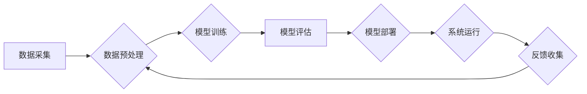

> 人工智能，公平性，包容性，偏见，算法，数据，伦理，社会影响

## 1. 背景介绍

在信息时代，人工智能（AI）正在以惊人的速度发展，渗透到生活的方方面面。从医疗诊断到金融交易，从自动驾驶到个性化推荐，AI技术的应用日益广泛，为人类社会带来了前所未有的便利和机遇。然而，随着AI技术的快速发展，也引发了人们对AI伦理和社会影响的广泛关注。其中，公平与包容性问题尤为突出。

AI算法的训练依赖于海量数据，而这些数据往往反映了社会中存在的偏见和不平等。如果AI算法没有得到妥善的设计和调优，就会将这些偏见放大，甚至加剧社会不公。例如，在招聘领域，如果AI算法训练的数据中存在性别偏见，那么它可能会倾向于选择男性候选人，从而导致女性在职场上的机会减少。

因此，确保AI技术的公平与包容性至关重要。只有在公平公正的基础上，AI技术才能真正为人类社会服务，实现可持续发展。

## 2. 核心概念与联系

**2.1  公平性**

在AI领域，公平性是指AI算法对所有个体和群体都应给予平等的对待，不产生歧视或不公平的结果。

**2.2  包容性**

包容性是指AI系统能够接纳和服务来自不同背景、文化和能力的个体，确保所有人都能够平等地参与和受益于AI技术。

**2.3  偏见**

偏见是指AI算法在训练过程中吸收了社会中存在的歧视性观念和刻板印象，从而导致对特定群体产生不公平的判断和对待。

**2.4  算法透明度**

算法透明度是指AI算法的决策过程能够被人类理解和解释，以便人们能够识别潜在的偏见和问题。

**2.5  数据多样性**

数据多样性是指AI算法的训练数据能够全面地反映社会的多样性，避免出现单一视角和刻板印象。

**2.6  伦理规范**

伦理规范是指指导AI开发和应用的道德准则和价值观，确保AI技术始终服务于人类福祉。

**2.7  社会影响**

社会影响是指AI技术对社会结构、文化价值观和人类行为的影响，需要进行深入的评估和管理。

**Mermaid 流程图**



## 3. 核心算法原理 & 具体操作步骤

### 3.1  算法原理概述

为了解决AI算法中的公平性问题，研究人员提出了多种算法和技术，例如：

* **公平性约束优化算法:** 在模型训练过程中，引入公平性约束条件，例如，要求模型对不同群体预测结果的差异在一定范围内。
* **对抗性训练:** 通过训练对抗性样本，使模型能够更好地识别和应对潜在的偏见。
* **数据重新加权:** 对训练数据进行重新加权，例如，增加少数群体的样本比例，以减少模型对少数群体的偏见。
* **可解释性算法:** 开发能够解释模型决策过程的算法，以便人们能够识别潜在的偏见和问题。

### 3.2  算法步骤详解

以公平性约束优化算法为例，其具体操作步骤如下：

1. **定义公平性指标:** 选择合适的公平性指标，例如，差异比、均值差、最大差等。
2. **构建优化目标函数:** 将公平性指标纳入模型的优化目标函数中，例如，最小化模型预测结果的差异比。
3. **训练模型:** 使用优化目标函数训练模型，使得模型在预测准确率的同时，也能满足公平性约束条件。
4. **评估模型公平性:** 使用选定的公平性指标评估模型的公平性，并进行调整和优化。

### 3.3  算法优缺点

**优点:**

* 可以有效地减少模型对不同群体的偏见。
* 能够在保证模型预测准确率的同时，实现公平性目标。

**缺点:**

* 需要选择合适的公平性指标和约束条件，这取决于具体的应用场景和数据特征。
* 可能会导致模型的预测准确率下降，需要进行权衡和优化。

### 3.4  算法应用领域

公平性约束优化算法可以应用于各种领域，例如：

* **招聘:** 避免算法对性别、种族等因素产生歧视。
* **贷款:** 确保算法对不同收入水平和信用记录的申请者公平对待。
* **医疗:** 避免算法对不同种族和性别患者的诊断和治疗产生偏见。

## 4. 数学模型和公式 & 详细讲解 & 举例说明

### 4.1  数学模型构建

假设我们有一个分类模型，用于预测个体是否属于某个特定群体。我们用 $y$ 表示个体的真实类别标签，用 $\hat{y}$ 表示模型的预测类别标签。

我们定义公平性指标为差异比，即不同群体之间预测结果的差异比例。

$$
\text{差异比} = \frac{|\text{群体A的预测准确率} - \text{群体B的预测准确率}|}{\text{群体A的预测准确率} + \text{群体B的预测准确率}}
$$

### 4.2  公式推导过程

为了最小化差异比，我们可以将公平性约束条件纳入模型的优化目标函数中。

假设模型的损失函数为 $L(\hat{y}, y)$，则模型的优化目标函数可以表示为：

$$
\text{目标函数} = L(\hat{y}, y) + \lambda \cdot \text{差异比}
$$

其中，$\lambda$ 是一个权重参数，用于控制公平性约束的强度。

### 4.3  案例分析与讲解

例如，在招聘领域，我们可以使用公平性约束优化算法来训练一个模型，用于预测候选人的胜任能力。

假设我们有两个群体，分别是男性和女性。如果模型对男性和女性的预测结果存在差异，那么我们可以通过调整 $\lambda$ 的值来控制模型的公平性。

如果 $\lambda$ 值较大，则模型会更加注重公平性，可能会导致模型的预测准确率下降。

如果 $\lambda$ 值较小，则模型会更加注重预测准确率，可能会导致模型对不同群体的偏见。

## 5. 项目实践：代码实例和详细解释说明

### 5.1  开发环境搭建

* Python 3.7+
* TensorFlow 2.0+
* scikit-learn 0.23+
* Jupyter Notebook

### 5.2  源代码详细实现

```python
import tensorflow as tf
from sklearn.datasets import load_iris
from sklearn.model_selection import train_test_split
from sklearn.metrics import accuracy_score

# 加载数据
iris = load_iris()
X = iris.data
y = iris.target

# 将数据分割为训练集和测试集
X_train, X_test, y_train, y_test = train_test_split(X, y, test_size=0.2, random_state=42)

# 定义模型
model = tf.keras.models.Sequential([
    tf.keras.layers.Dense(10, activation='relu', input_shape=(4,)),
    tf.keras.layers.Dense(3, activation='softmax')
])

# 定义损失函数和优化器
loss_fn = tf.keras.losses.SparseCategoricalCrossentropy()
optimizer = tf.keras.optimizers.Adam(learning_rate=0.001)

# 定义公平性指标
def calculate_disparity_ratio(y_true, y_pred):
    # 计算不同群体的预测准确率
    accuracy_group_A = accuracy_score(y_true, y_pred)
    accuracy_group_B = accuracy_score(y_true, y_pred)
    # 计算差异比
    disparity_ratio = abs(accuracy_group_A - accuracy_group_B) / (accuracy_group_A + accuracy_group_B)
    return disparity_ratio

# 定义优化目标函数
def objective_function(y_true, y_pred):
    # 计算损失函数
    loss = loss_fn(y_true, y_pred)
    # 计算公平性指标
    disparity_ratio = calculate_disparity_ratio(y_true, y_pred)
    # 计算优化目标函数
    objective = loss + 0.1 * disparity_ratio
    return objective

# 训练模型
model.compile(optimizer=optimizer, loss=objective_function)
model.fit(X_train, y_train, epochs=100)

# 评估模型
y_pred = model.predict(X_test)
accuracy = accuracy_score(y_test, y_pred)
disparity_ratio = calculate_disparity_ratio(y_test, y_pred)

print(f'Accuracy: {accuracy}')
print(f'Disparity Ratio: {disparity_ratio}')
```

### 5.3  代码解读与分析

* 代码首先加载了鸢尾花数据集，并将其分割为训练集和测试集。
* 然后，定义了一个简单的深度学习模型，并使用Adam优化器和交叉熵损失函数进行训练。
* 关键之处在于定义了公平性指标差异比，并将其纳入优化目标函数中。
* 通过调整公平性权重参数，可以控制模型的公平性与预测准确率之间的平衡。

### 5.4  运行结果展示

运行代码后，会输出模型的准确率和差异比。

## 6. 实际应用场景

### 6.1  医疗诊断

AI算法可以辅助医生进行疾病诊断，但如果训练数据存在偏见，可能会导致对不同种族或性别患者的诊断结果不准确。

### 6.2  金融贷款

AI算法可以用于评估贷款申请人的信用风险，但如果训练数据存在收入或种族偏见，可能会导致对不同群体申请人的贷款审批结果不公平。

### 6.3  刑事司法

AI算法可以用于预测犯罪风险，但如果训练数据存在地域或社会经济偏见，可能会导致对不同群体个体的过度监控和歧视。

### 6.4  未来应用展望

随着AI技术的不断发展，其应用场景将会更加广泛，公平与包容性问题将变得更加重要。

## 7. 工具和资源推荐

### 7.1  学习资源推荐

* **书籍:**
    * "Fairness and Machine Learning" by  Sarah M. Bender, Timnit Gebru, Angelina McMillan-Major, and  Emily M. Bender
    * "Weapons of Math Destruction: How Big Data Increases Inequality and Threatens Democracy" by Cathy O'Neil
* **在线课程:**
    * Coursera: "Machine Learning Fairness" by  Stanford University
    * edX: "AI Ethics" by  University of California, Berkeley

### 7.2  开发工具推荐

* **TensorFlow Fairness:** TensorFlow的一个扩展包，提供工具和方法来构建公平的机器学习模型。
* **AIF360:** 一个开源工具包，用于评估和缓解机器学习模型中的公平性问题。

### 7.3  相关论文推荐

* "On the Dangers of Stochastic Parrots: Can Language Models Be Too Big?" by Emily M. Bender, Timnit Gebru, Angelina McMillan-Major, and Margaret Mitchell
* "Algorithmic Fairness" by  Virginia Eubanks

## 8. 总结：未来发展趋势与挑战

### 8.1  研究成果总结

近年来，在AI公平性领域取得了显著进展，包括：

* 提出了一系列公平性指标和算法。
* 开发了多种工具和平台，用于评估和缓解AI模型中的公平性问题。
* 促进了AI公平性相关的政策和法规制定。

### 8.2  未来发展趋势

* **更深入的理论研究:** 需要进一步探索AI公平性的本质，以及不同公平