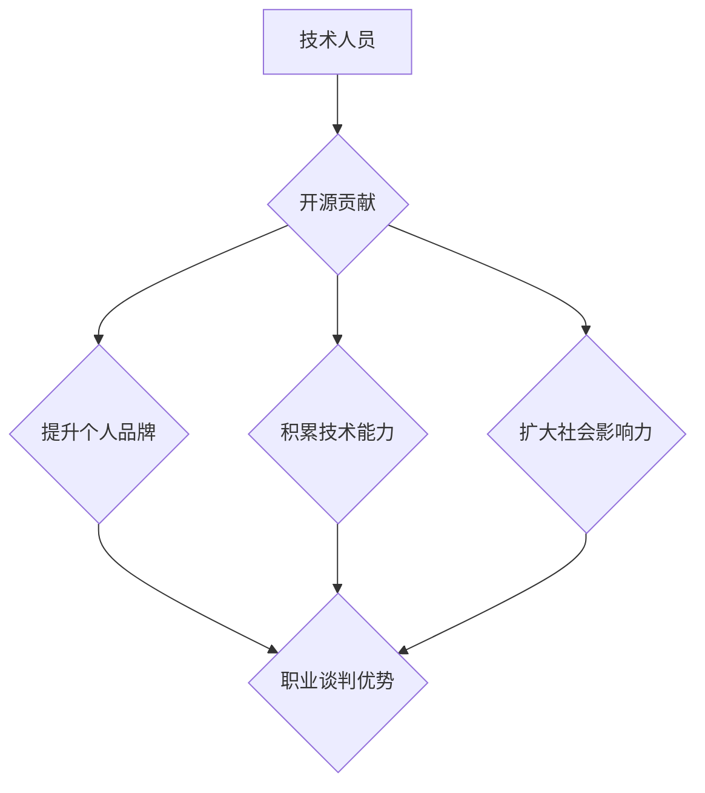

> 开源贡献, 职业谈判, 个人品牌, 社区影响力, 技术能力, 价值评估

## 1. 背景介绍

在当今科技行业，技术人才竞争日益激烈。想要在职业生涯中取得成功，除了具备扎实的技术能力外，还需要掌握有效的职业谈判技巧。开源软件社区为技术人员提供了独特的平台，可以利用开源贡献积累个人品牌、提升技术能力和扩大社会影响力，从而在职业谈判中占据主动地位。

## 2. 核心概念与联系

### 2.1 开源贡献与职业谈判

开源贡献和职业谈判看似两个不同的领域，但它们之间存在着密切的联系。开源贡献可以被视为一种“软实力”的积累，它可以帮助技术人员提升个人品牌、建立专业网络和展现技术能力。这些积累最终转化为在职业谈判中的优势，例如：

* **提升个人价值:** 开源贡献证明了技术人员的专业能力和解决问题的能力，使其在求职市场上更有竞争力。
* **扩大社会影响力:** 开源项目通常拥有庞大的用户群体和活跃的社区，参与开源贡献可以帮助技术人员获得更广泛的认可和关注。
* **建立专业网络:** 开源社区是一个充满活力和互助的平台，参与开源贡献可以帮助技术人员建立广泛的专业网络，为未来的职业发展提供更多机会。

### 2.2 开源社区与个人品牌建设

开源社区是一个开放、透明和协作的平台，它为技术人员提供了展示自我、积累经验和建立个人品牌的绝佳机会。通过积极参与开源项目，技术人员可以：

* **展示技术能力:** 开源贡献可以展示技术人员的代码编写能力、问题解决能力和团队合作能力。
* **积累项目经验:** 开源项目通常规模较大，涉及多个模块和技术领域，参与开源贡献可以帮助技术人员积累丰富的项目经验。
* **建立个人品牌:** 开源贡献可以帮助技术人员建立个人品牌，使其在技术社区中获得认可和尊重。

### 2.3 社区影响力与职业谈判

开源社区的影响力不容忽视。技术人员在开源社区中的贡献和声誉可以转化为职业谈判中的优势。例如：

* **提升谈判筹码:** 开源贡献可以作为谈判筹码，帮助技术人员争取更高的薪资、更好的工作条件和更丰富的职业发展机会。
* **获得社区支持:** 开源社区的成员通常乐于帮助彼此，技术人员在职业谈判中遇到困难时，可以寻求社区的支持和建议。
* **扩大职业网络:** 开源社区是一个充满活力和互助的平台，参与开源贡献可以帮助技术人员建立广泛的职业网络，为未来的职业发展提供更多机会。

**Mermaid 流程图**



## 3. 核心算法原理 & 具体操作步骤

### 3.1 算法原理概述

开源贡献是一个迭代的过程，需要技术人员不断学习、实践和改进。以下是一些常用的开源贡献算法：

* **Forking:** 从现有项目创建一个副本，进行修改和开发。
* **Pull Request:** 将修改提交到原项目，等待作者 review 和合并。
* **Issue Tracking:** 跟踪项目中的 bug 和需求，并提交解决方案。
* **Documentation:** 编写项目文档，帮助用户理解和使用项目。

### 3.2 算法步骤详解

1. **选择项目:** 找到符合自身兴趣和技能的开源项目。
2. **学习项目:** 仔细阅读项目文档和代码，了解项目的架构、功能和开发规范。
3. **贡献想法:** 在项目 Issue Tracker 中提出新的功能需求或 bug 报告。
4. **提交代码:** 根据项目规范，编写代码并提交到项目 Fork 中。
5. **发起 Pull Request:** 将修改提交到原项目，并撰写详细的描述和测试用例。
6. **等待 review:** 项目作者会 review 提交的代码，并提出修改建议。
7. **修改代码:** 根据 review 建议修改代码，并重新提交 Pull Request。
8. **合并代码:** 如果代码通过 review，项目作者会合并代码到主分支。

### 3.3 算法优缺点

**优点:**

* **提升技术能力:** 通过参与开源项目，可以学习新技术、掌握最佳实践和积累项目经验。
* **建立个人品牌:** 开源贡献可以展示技术能力和专业素养，提升个人品牌知名度。
* **扩大社会影响力:** 开源项目通常拥有庞大的用户群体，参与开源贡献可以扩大个人影响力。

**缺点:**

* **时间成本:** 开源贡献需要投入大量时间和精力，可能影响个人生活和工作安排。
* **沟通成本:** 与项目作者和社区成员进行沟通需要花费时间和精力，并需要具备良好的沟通能力。
* **技术门槛:** 一些开源项目的技术门槛较高，需要具备一定的技术基础才能参与贡献。

### 3.4 算法应用领域

开源贡献的应用领域非常广泛，包括：

* **软件开发:** 参与开源软件项目的开发、维护和改进。
* **数据科学:** 贡献数据分析工具、算法和模型。
* **人工智能:** 参与人工智能项目的开发和研究。
* **硬件设计:** 贡献开源硬件设计和驱动程序。

## 4. 数学模型和公式 & 详细讲解 & 举例说明

### 4.1 数学模型构建

开源贡献可以被视为一个网络效应模型，其核心是贡献者之间的互动和协作。我们可以用以下数学模型来描述开源贡献的增长趋势：

$$
\frac{dC}{dt} = kC^2
$$

其中：

* $C$ 代表开源贡献的数量
* $t$ 代表时间
* $k$ 代表一个常数，表示贡献者之间的互动强度

### 4.2 公式推导过程

该模型假设开源贡献的增长速度与贡献数量的平方成正比。这意味着，随着开源贡献数量的增加，增长速度也会越来越快。

### 4.3 案例分析与讲解

例如，一个开源项目刚开始时，只有几个贡献者。随着时间的推移，这些贡献者会吸引更多的人加入，并共同贡献代码和文档。随着贡献者的数量增加，项目的功能和质量也会不断提升，吸引更多用户使用和贡献。最终，这个开源项目会形成一个庞大的社区，持续发展和壮大。

## 5. 项目实践：代码实例和详细解释说明

### 5.1 开发环境搭建

为了方便演示，我们以一个简单的开源项目为例，展示如何进行代码贡献。

**项目选择:**  选择一个名为 "Hello World" 的开源项目，该项目是一个简单的文本输出程序。

**开发环境:** 使用 Linux 系统，并安装 Git、Python 和相关开发工具。

### 5.2 源代码详细实现

1. **Fork 项目:** 使用 Git 命令克隆项目到本地仓库，并创建新的分支。

```
git clone https://github.com/username/HelloWorld.git
git checkout -b my-feature
```

2. **修改代码:** 在 `main.py` 文件中修改代码，将输出内容改为 "Hello, World from Zen!"。

```python
print("Hello, World from Zen!")
```

3. **提交代码:** 使用 Git 命令提交修改后的代码。

```
git add .
git commit -m "修改输出内容"
```

4. **发起 Pull Request:** 在 GitHub 上创建 Pull Request，将修改提交到原项目。

### 5.3 代码解读与分析

修改后的代码将输出新的文本内容，展示了对开源项目的贡献。

### 5.4 运行结果展示

运行修改后的代码，输出结果为 "Hello, World from Zen!"。

## 6. 实际应用场景

### 6.1 开源贡献与职业谈判

在职业谈判中，开源贡献可以作为重要的筹码，帮助技术人员争取更高的薪资、更好的工作条件和更丰富的职业发展机会。例如：

* **求职面试:** 在求职面试中，开源贡献可以展示技术人员的专业能力、解决问题的能力和团队合作能力，从而提升面试成功的概率。
* **薪资谈判:** 开源贡献可以证明技术人员的价值，使其在薪资谈判中占据主动地位。
* **职业发展:** 开源贡献可以帮助技术人员建立个人品牌，扩大社会影响力，从而获得更多职业发展机会。

### 6.2 开源社区与职业发展

开源社区是一个充满活力和互助的平台，参与开源贡献可以帮助技术人员获得以下职业发展优势：

* **学习新技术:** 开源项目通常采用最新的技术和框架，参与开源贡献可以帮助技术人员学习新技术，提升自身竞争力。
* **积累项目经验:** 开源项目通常规模较大，涉及多个模块和技术领域，参与开源贡献可以帮助技术人员积累丰富的项目经验。
* **建立专业网络:** 开源社区拥有庞大的用户群体和活跃的成员，参与开源贡献可以帮助技术人员建立广泛的专业网络，为未来的职业发展提供更多机会。

### 6.4 未来应用展望

随着开源软件的普及和发展，开源贡献将越来越成为技术人员职业发展的关键因素。未来，开源贡献将更加注重以下方面：

* **跨领域合作:** 开源项目将更加注重跨领域合作，例如将人工智能技术应用于开源软件开发。
* **社区治理:** 开源社区将更加注重社区治理，建立更加完善的贡献机制和社区规范。
* **商业化模式:** 开源软件将更加注重商业化模式，例如通过开源软件提供服务和支持。

## 7. 工具和资源推荐

### 7.1 学习资源推荐

* **GitHub:** https://github.com/
* **GitLab:** https://gitlab.com/
* **Bitbucket:** https://bitbucket.org/
* **开源中国:** https://www.oschina.net/

### 7.2 开发工具推荐

* **Git:** https://git-scm.com/
* **Python:** https://www.python.org/
* **Java:** https://www.java.com/
* **C++:** https://isocpp.org/

### 7.3 相关论文推荐

* **The Cathedral and the Bazaar** by Eric S. Raymond
* **Open Source Software Development** by Karl Fogel
* **The Linux Kernel Development** by Robert Love

## 8. 总结：未来发展趋势与挑战

### 8.1 研究成果总结

开源贡献已经成为技术人员职业发展的关键因素，它可以帮助技术人员提升技术能力、建立个人品牌和扩大社会影响力。

### 8.2 未来发展趋势

未来，开源贡献将更加注重跨领域合作、社区治理和商业化模式。

### 8.3 面临的挑战

开源贡献也面临着一些挑战，例如如何提高贡献者的参与度、如何建立更加完善的贡献机制和如何应对开源软件的商业化挑战。

### 8.4 研究展望

未来研究将更加关注开源贡献的社会影响、开源软件的商业化模式和开源社区的治理机制。

## 9. 附录：常见问题与解答

### 9.1 如何开始开源贡献？

* 选择一个符合自身兴趣和技能的开源项目。
* 阅读项目文档和代码，了解项目的架构、功能和开发规范。
* 在项目 Issue Tracker 中提出新的功能需求或 bug 报告。
* 尝试修复简单的 bug 或编写简单的功能代码。

### 9.2 如何与开源项目作者沟通？

* 在项目 Issue Tracker 中留下详细的描述和问题。
* 使用项目指定的沟通方式，例如邮件列表或聊天室。
* 保持礼貌和尊重，并清晰地表达自己的想法。

### 9.3 开源贡献对职业发展有什么帮助？

* 提升技术能力和解决问题的能力。
* 建立个人品牌和扩大社会影响力。
* 获得更多职业发展机会。


作者：禅与计算机程序设计艺术 / Zen and the Art of Computer Programming 
<end_of_turn>