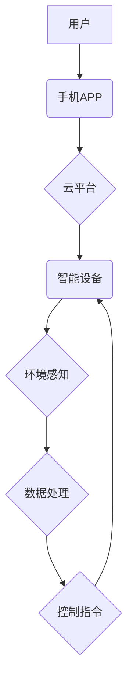

> 智能家居, Java, 场景模拟, 物联网, 软件架构, 算法设计, 数据处理

## 1. 背景介绍

智能家居已成为现代生活的重要组成部分，它通过将各种智能设备连接到网络，实现对家居环境的自动化控制和智能化管理。随着物联网技术的快速发展和智能设备的普及，智能家居市场呈现出爆发式增长趋势。

Java作为一种成熟、稳定、跨平台的编程语言，在智能家居领域发挥着重要作用。其丰富的库函数、强大的并发处理能力和完善的生态系统，为智能家居的开发和部署提供了坚实的基础。

## 2. 核心概念与联系

### 2.1 智能家居系统架构

智能家居系统通常由以下几个核心组件组成：

* **智能设备:** 包括传感器、执行器、控制中心等，负责感知环境、执行指令和控制家居设备。
* **网络通信:** 用于连接智能设备和控制中心，实现数据传输和信息交互。常见的网络协议包括Wi-Fi、蓝牙、Zigbee等。
* **云平台:** 提供数据存储、分析、管理和远程控制等服务，支持智能家居的云化部署和个性化定制。
* **用户界面:** 用于用户与智能家居系统交互，可以是手机APP、平板电脑、语音助手等。

**智能家居系统架构流程图:**



### 2.2 Java在智能家居中的应用

Java在智能家居系统中扮演着重要的角色，主要应用于以下方面：

* **设备驱动程序开发:** Java可以开发跨平台的设备驱动程序，方便与各种智能设备进行交互。
* **云平台服务端开发:** Java的稳定性和安全性使其成为云平台服务端开发的理想选择。
* **用户界面开发:** Java可以开发基于Web的智能家居用户界面，提供用户友好的交互体验。
* **数据处理和分析:** Java丰富的库函数和强大的并发处理能力，可以用于处理智能家居产生的海量数据，并进行分析和挖掘。

## 3. 核心算法原理 & 具体操作步骤

### 3.1  算法原理概述

智能家居场景模拟需要模拟用户行为、设备状态和环境变化等复杂因素，常用的算法包括：

* **状态机:** 用于描述智能设备的运行状态和状态转换规则。
* **有限状态机:** 是一种特殊的状态机，其状态和转换规则有限。
* **行为树:** 用于描述智能体行为的树形结构，可以实现复杂的决策和行为组合。
* **强化学习:** 通过奖励机制训练智能体，使其在智能家居环境中学习最佳行为策略。

### 3.2  算法步骤详解

以状态机为例，智能家居场景模拟的算法步骤如下：

1. **定义状态:** 确定智能设备可能存在的各种状态，例如“开”、“关”、“待机”等。
2. **定义事件:** 识别可能导致智能设备状态变化的事件，例如“用户指令”、“传感器数据”等。
3. **定义状态转换规则:** 根据事件和当前状态，确定智能设备状态转换的规则。
4. **模拟场景:** 根据预设的场景剧本，模拟用户行为和环境变化，并根据状态转换规则更新智能设备的状态。
5. **输出结果:** 输出模拟结果，例如智能设备的运行状态、控制指令等。

### 3.3  算法优缺点

**状态机算法:**

* **优点:** 结构简单、易于理解和实现。
* **缺点:** 难以处理复杂场景和动态变化，状态数量过多会导致状态机难以维护。

**行为树算法:**

* **优点:** 可以表示复杂的决策和行为组合，具有良好的可扩展性和可维护性。
* **缺点:** 设计行为树需要一定的经验和技巧，算法复杂度较高。

**强化学习算法:**

* **优点:** 可以学习到最优的行为策略，适应复杂和动态变化的场景。
* **缺点:** 训练过程复杂，需要大量的训练数据和计算资源。

### 3.4  算法应用领域

* **智能家居场景模拟:** 用于测试智能家居系统的功能和性能，以及验证智能家居场景的设计方案。
* **智能家居设备开发:** 用于开发智能家居设备的控制逻辑和行为模型。
* **智能家居应用开发:** 用于开发智能家居应用，例如智能照明、智能空调等。

## 4. 数学模型和公式 & 详细讲解 & 举例说明

### 4.1  数学模型构建

智能家居场景模拟可以利用数学模型来描述设备状态、用户行为和环境变化等因素。例如，可以利用状态转移矩阵来表示智能设备的状态转换概率，利用马尔科夫链来描述用户行为的随机性，利用概率论和统计学来分析环境变化的趋势。

### 4.2  公式推导过程

以状态转移矩阵为例，假设智能设备有三个状态：开、关、待机。状态转移矩阵可以表示为：

```latex
P = \begin{bmatrix}
0.8 & 0.1 & 0.1 \\
0.2 & 0.7 & 0.1 \\
0.1 & 0.2 & 0.7
\end{bmatrix}
```

其中，$P_{ij}$表示从状态$i$转移到状态$j$的概率。例如，$P_{12} = 0.1$表示从“开”状态转移到“关”状态的概率为0.1。

### 4.3  案例分析与讲解

假设智能设备初始状态为“开”，则经过一次状态转移后，设备状态的概率分布为：

```latex
\begin{bmatrix}
0.8 & 0.1 & 0.1 \\
0.2 & 0.7 & 0.1 \\
0.1 & 0.2 & 0.7
\end{bmatrix} \begin{bmatrix}
1 \\
0 \\
0
\end{bmatrix} = \begin{bmatrix}
0.8 \\
0.2 \\
0.1
\end{bmatrix}
```

可见，设备状态转移后，最有可能的状态为“开”，其次为“关”，最后为“待机”。

## 5. 项目实践：代码实例和详细解释说明

### 5.1  开发环境搭建

* **操作系统:** Windows、macOS、Linux
* **JDK:** Java Development Kit 11 或更高版本
* **IDE:** Eclipse、IntelliJ IDEA 或其他 Java IDE

### 5.2  源代码详细实现

```java
public class SmartHomeDevice {
    private String name;
    private String state;

    public SmartHomeDevice(String name) {
        this.name = name;
        this.state = "待机";
    }

    public String getName() {
        return name;
    }

    public String getState() {
        return state;
    }

    public void setState(String state) {
        this.state = state;
    }

    public void turnOn() {
        this.state = "开";
        System.out.println(name + "已打开");
    }

    public void turnOff() {
        this.state = "关";
        System.out.println(name + "已关闭");
    }
}
```

### 5.3  代码解读与分析

* **类定义:** `SmartHomeDevice`类代表一个智能家居设备，包含设备名称和设备状态两个属性。
* **构造函数:** `SmartHomeDevice`类的构造函数用于初始化设备名称和初始状态为“待机”。
* **属性访问方法:** `getName()`、`getState()`和`setState()`方法用于访问和修改设备名称和状态。
* **操作方法:** `turnOn()`和`turnOff()`方法用于控制设备的开/关状态。

### 5.4  运行结果展示

```
SmartHomeDevice device = new SmartHomeDevice("灯");
System.out.println(device.getName() + "的初始状态为:" + device.getState());
device.turnOn();
System.out.println(device.getName() + "的当前状态为:" + device.getState());
device.turnOff();
System.out.println(device.getName() + "的当前状态为:" + device.getState());
```

运行结果：

```
灯的初始状态为:待机
灯已打开
灯的当前状态为:开
灯已关闭
灯的当前状态为:关
```

## 6. 实际应用场景

### 6.1 智能照明

智能照明系统可以根据用户需求和环境变化自动调节灯光亮度和色彩，实现节能、舒适和安全的功能。

### 6.2 智能空调

智能空调系统可以根据用户设定和环境温度自动调节空调温度，实现节能、舒适和健康的功能。

### 6.3 智能家居安全

智能家居安全系统可以利用传感器和摄像头等设备，实现对家居环境的实时监控和报警，保障家居安全。

### 6.4  未来应用展望

随着物联网技术的不断发展，智能家居的应用场景将更加广泛，例如：

* **个性化定制:** 智能家居系统将能够根据用户的个性化需求和习惯，提供更加定制化的服务。
* **远程控制:** 用户可以通过手机、平板电脑等设备，远程控制智能家居设备，实现更加便捷的操控体验。
* **语音交互:** 智能家居系统将支持语音交互，用户可以通过语音指令控制智能家居设备，实现更加自然的人机交互。
* **人工智能:** 智能家居系统将融入人工智能技术，能够学习用户的行为模式，提供更加智能化的服务。

## 7. 工具和资源推荐

### 7.1  学习资源推荐

* **书籍:**
    * 《Java编程思想》
    * 《Head First Java》
    * 《Effective Java》
* **在线课程:**
    * Coursera: Java Programming
    * Udemy: Java for Beginners
    * edX: Introduction to Java Programming

### 7.2  开发工具推荐

* **IDE:** Eclipse、IntelliJ IDEA、NetBeans
* **物联网平台:** AWS IoT Core、Azure IoT Hub、Google Cloud IoT Core
* **数据库:** MySQL、PostgreSQL、MongoDB

### 7.3  相关论文推荐

* **智能家居场景模拟:**
    * A Survey on Smart Home Scenario Simulation
    * A Framework for Smart Home Scenario Simulation
* **Java在智能家居中的应用:**
    * Java-Based Smart Home System Design and Implementation
    * A Survey of Java-Based Smart Home Technologies

## 8. 总结：未来发展趋势与挑战

### 8.1  研究成果总结

本文介绍了基于Java的智能家居设计，包括智能家居系统架构、核心算法原理、代码实例和实际应用场景。

### 8.2  未来发展趋势

* **更加智能化:** 智能家居系统将更加智能化，能够学习用户的行为模式，提供更加个性化的服务。
* **更加安全可靠:** 智能家居系统将更加注重安全性和可靠性，能够有效防止网络攻击和设备故障。
* **更加生态化:** 智能家居系统将更加生态化，能够与其他智能设备和服务进行互联互通。

### 8.3  面临的挑战

* **技术复杂性:** 智能家居系统涉及多种技术领域，开发和维护难度较大。
* **数据安全:** 智能家居系统收集和处理大量用户数据，数据安全问题需要得到重视。
* **标准化问题:** 智能家居行业缺乏统一的标准，导致设备互联互通性差。

### 8.4  研究展望

未来，我们将继续研究智能家居系统的设计、开发和应用，致力于打造更加智能、安全、便捷和生态化的智能家居环境。

## 9. 附录：常见问题与解答

* **Q1: Java是否适合开发智能家居系统？**

A1: 由于Java具有丰富的库函数、强大的并发处理能力和完善的生态系统，因此非常适合开发智能家居系统。

* **Q2: 如何选择合适的智能家居