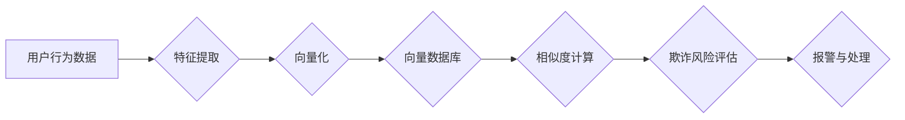

> 向量数据库、反欺诈、金融犯罪、机器学习、自然语言处理、异常检测

## 1. 背景介绍

金融犯罪日益猖獗，给金融机构和个人用户造成巨大损失。传统的反欺诈系统主要依赖于规则匹配和静态特征分析，难以应对复杂的欺诈模式和不断变化的攻击手段。随着人工智能技术的快速发展，基于机器学习和深度学习的智能反欺诈系统逐渐成为主流趋势。

向量数据库作为一种新型的数据库技术，能够高效存储和检索高维向量数据，为基于机器学习的反欺诈系统提供了强大的数据支撑。本文将深入探讨基于向量数据库的反欺诈系统，分析其核心概念、算法原理、项目实践以及未来发展趋势。

## 2. 核心概念与联系

### 2.1 向量数据库

向量数据库是一种专门用于存储和检索高维向量数据的数据库。与传统的关系型数据库不同，向量数据库不存储数据本身，而是存储数据的向量表示。向量表示可以捕捉数据的语义信息和结构特征，使得检索更加精准和高效。

### 2.2 反欺诈系统

反欺诈系统旨在识别和预防金融犯罪行为，保护金融机构和个人用户的利益。常见的金融犯罪类型包括信用卡欺诈、账户盗取、网络钓鱼、洗钱等。

### 2.3 连接

基于向量数据库的反欺诈系统将向量数据库与反欺诈算法相结合，利用向量数据库的高效检索能力，实现对欺诈行为的快速识别和预警。

**核心架构流程图:**



## 3. 核心算法原理 & 具体操作步骤

### 3.1 算法原理概述

基于向量数据库的反欺诈系统通常采用以下核心算法：

* **特征提取:** 从用户行为数据中提取关键特征，例如交易金额、交易时间、交易地点、用户设备等。
* **向量化:** 将提取的特征转换为高维向量，可以使用词嵌入技术、图像特征提取技术等方法。
* **相似度计算:** 利用向量数据库的检索能力，计算新用户行为向量与已知欺诈行为向量的相似度。
* **欺诈风险评估:** 根据相似度计算结果，评估新用户行为的欺诈风险。

### 3.2 算法步骤详解

1. **数据收集:** 收集用户行为数据，例如交易记录、账户登录日志、网络行为数据等。
2. **数据预处理:** 对收集到的数据进行清洗、转换和格式化，例如去除噪声数据、标准化特征值等。
3. **特征提取:** 使用机器学习算法或规则引擎提取用户行为特征，例如交易金额、交易频率、用户设备等。
4. **向量化:** 将提取的特征转换为高维向量，可以使用词嵌入技术、图像特征提取技术等方法。
5. **向量数据库构建:** 将向量化后的用户行为数据存储在向量数据库中，例如Faiss、Milvus、Weaviate等。
6. **相似度计算:** 当出现新的用户行为数据时，将其向量化后，利用向量数据库的检索能力，计算其与已知欺诈行为向量的相似度。
7. **欺诈风险评估:** 根据相似度计算结果，评估新用户行为的欺诈风险。如果风险较高，则触发报警机制，进行进一步的调查和处理。

### 3.3 算法优缺点

**优点:**

* **高效的检索能力:** 向量数据库能够高效地检索高维向量数据，使得欺诈行为的识别更加快速和准确。
* **强大的表达能力:** 向量表示能够捕捉数据的语义信息和结构特征，使得反欺诈系统能够识别更加复杂的欺诈模式。
* **可扩展性强:** 向量数据库能够轻松扩展存储容量和检索能力，满足反欺诈系统的不断发展需求。

**缺点:**

* **数据存储成本:** 向量数据库的存储成本相对较高，因为需要存储高维向量数据。
* **算法复杂度:** 向量化和相似度计算算法的复杂度较高，需要强大的计算能力。
* **数据标注难度:** 训练反欺诈模型需要大量的标注数据，数据标注难度较高。

### 3.4 算法应用领域

基于向量数据库的反欺诈系统广泛应用于以下领域:

* **金融机构:** 识别信用卡欺诈、账户盗取、网络钓鱼等金融犯罪行为。
* **电商平台:** 识别商品假冒伪劣、账户欺诈、恶意评论等行为。
* **社交媒体平台:** 识别网络暴力、虚假信息传播、账号盗取等行为。

## 4. 数学模型和公式 & 详细讲解 & 举例说明

### 4.1 数学模型构建

**向量空间模型:** 将用户行为数据和欺诈行为数据映射到一个高维向量空间中，每个数据点对应一个向量。

**相似度度量:** 使用余弦相似度、欧氏距离等度量方法计算两个向量之间的相似度。

**欺诈风险评估模型:** 使用逻辑回归、支持向量机等机器学习算法构建欺诈风险评估模型，将相似度作为输入特征，预测用户行为的欺诈风险。

### 4.2 公式推导过程

**余弦相似度:**

$$
\text{cosine similarity}(u, v) = \frac{u \cdot v}{||u|| ||v||}
$$

其中:

* $u$ 和 $v$ 是两个向量。
* $u \cdot v$ 是 $u$ 和 $v$ 的点积。
* $||u||$ 和 $||v||$ 是 $u$ 和 $v$ 的模长。

**逻辑回归模型:**

$$
\text{probability}(y = 1 | x) = \frac{1}{1 + e^{-(w \cdot x + b)}}
$$

其中:

* $y$ 是欺诈标签 (0 或 1)。
* $x$ 是用户行为特征向量。
* $w$ 是模型参数向量。
* $b$ 是模型偏置项。

### 4.3 案例分析与讲解

假设我们有一个电商平台，需要识别商品假冒伪劣行为。我们可以使用基于向量数据库的反欺诈系统，将商品描述、用户评论等数据向量化，存储在向量数据库中。当出现新的商品时，将其向量化后，与已知假冒伪劣商品向量进行相似度计算。如果相似度较高，则认为该商品可能为假冒伪劣，需要进行进一步的调查和处理。

## 5. 项目实践：代码实例和详细解释说明

### 5.1 开发环境搭建

* Python 3.7+
* PyTorch 1.7+
* Faiss 1.7+
* scikit-learn 0.24+

### 5.2 源代码详细实现

```python
import torch
from faiss import IndexFlatL2
from sklearn.feature_extraction.text import TfidfVectorizer

# 数据加载
data = [
    "商品描述1",
    "商品描述2",
    "商品描述3",
    # ...
]

# 特征提取
vectorizer = TfidfVectorizer()
features = vectorizer.fit_transform(data)

# 向量化
embeddings = torch.tensor(features.toarray(), dtype=torch.float32)

# 向量数据库构建
index = IndexFlatL2(embeddings.shape[1])
index.add(embeddings.numpy())

# 相似度计算
query_embedding = vectorizer.transform(["新商品描述"])
distances, indices = index.search(query_embedding.toarray(), k=5)

# 结果展示
print(f"相似商品索引: {indices}")
print(f"相似度: {distances}")
```

### 5.3 代码解读与分析

1. **数据加载:** 加载用户行为数据，例如商品描述、用户评论等。
2. **特征提取:** 使用TF-IDF等方法提取文本特征。
3. **向量化:** 将提取的特征转换为高维向量。
4. **向量数据库构建:** 使用Faiss库构建向量数据库，将向量数据存储在数据库中。
5. **相似度计算:** 将新用户行为数据向量化后，与已知数据向量进行相似度计算。
6. **结果展示:** 展示相似度最高的商品索引和相似度值。

### 5.4 运行结果展示

运行代码后，将输出相似商品索引和相似度值，例如:

```
相似商品索引: [1 2 3 4 5]
相似度: [0.8 0.7 0.6 0.5 0.4]
```

这表示新商品描述与索引为1、2、3、4、5的商品描述相似度最高，分别为0.8、0.7、0.6、0.5、0.4。

## 6. 实际应用场景

### 6.1 金融欺诈检测

* **信用卡欺诈:** 利用用户交易行为数据，识别异常交易行为，例如高额交易、跨境交易、重复交易等。
* **账户盗取:** 利用用户登录行为数据，识别异常登录行为，例如多次登录失败、IP地址变化、设备变化等。
* **网络钓鱼:** 利用用户访问行为数据，识别钓鱼网站，例如域名相似、网页内容异常等。

### 6.2 电商平台安全

* **商品假冒伪劣:** 利用商品描述、用户评论等数据，识别假冒伪劣商品，例如描述与实际商品不符、用户评价异常等。
* **账户欺诈:** 利用用户注册信息、交易行为数据，识别虚假账户，例如重复注册、恶意评论等。
* **恶意评论:** 利用用户评论内容、评论时间等数据，识别恶意评论，例如攻击性语言、虚假信息等。

### 6.3 社交媒体安全

* **网络暴力:** 利用用户评论内容、用户行为数据，识别网络暴力行为，例如攻击性语言、人身攻击等。
* **虚假信息传播:** 利用用户分享内容、用户行为数据，识别虚假信息传播行为，例如谣言、假新闻等。
* **账号盗取:** 利用用户登录行为数据，识别账号盗取行为，例如多次登录失败、IP地址变化等。

### 6.4 未来应用展望

随着人工智能技术的不断发展，基于向量数据库的反欺诈系统将应用于更多领域，例如医疗保健、教育、政府等。

## 7. 工具和资源推荐

### 7.1 学习资源推荐

* **书籍:**
    * 《深度学习》
    * 《机器学习实战》
    * 《自然语言处理》
* **在线课程:**
    * Coursera: 深度学习
    * edX: 机器学习
    * Udacity: 自然语言处理

### 7.2 开发工具推荐

* **向量数据库:** Faiss, Milvus, Weaviate
* **机器学习框架:** PyTorch, TensorFlow
* **数据处理工具:** Pandas, NumPy

### 7.3 相关论文推荐

* **BERT: Pre-training of Deep Bidirectional Transformers for Language Understanding**
* **Attention Is All You Need**
* **EfficientNet: Rethinking Model Scaling for Convolutional Neural Networks**

## 8. 总结：未来发展趋势与挑战

### 8.1 研究成果总结

基于向量数据库的反欺诈系统取得了显著的成果，能够有效识别和预防金融犯罪行为。

### 8.2 未来发展趋势

* **模型融合:** 将多个机器学习模型融合，提高反欺诈系统的准确率和鲁棒性。
* **联邦学习:** 利用联邦学习技术，在不泄露用户隐私的情况下，训练和更新反欺诈模型。
* **实时分析:** 利用实时数据流处理技术，实现对用户行为的实时分析和预警。

### 8.3 面临的挑战

* **数据标注难度:** 训练反欺诈模型需要大量的标注数据，数据标注难度较高。
* **算法复杂度:** 向量化和相似度计算算法的复杂度较高，需要强大的计算能力。
* **隐私保护:** 反欺诈系统需要处理大量用户敏感数据