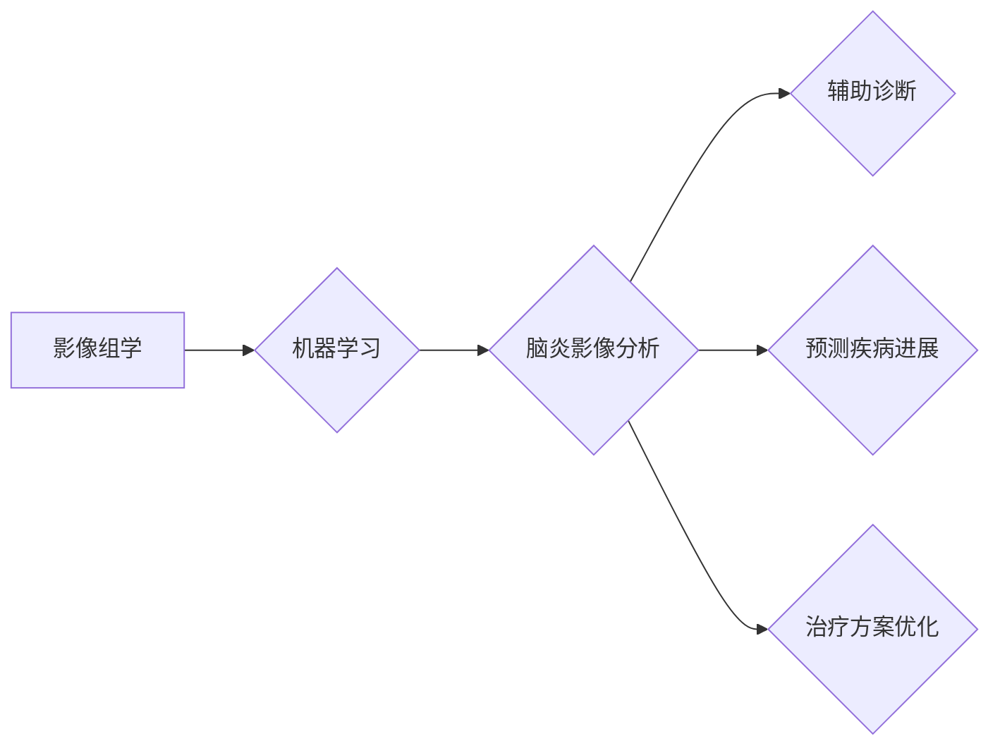

> 脑炎、影像组学、机器学习、深度学习、诊断预测

## 1. 背景介绍

脑炎是一种严重的神经系统疾病，其发病机制复杂，临床表现多样，诊断难度大。传统的脑炎诊断主要依赖于临床症状、脑脊液检查和影像学检查，但这些方法存在一定的局限性。例如，临床症状可能与其他疾病相似，脑脊液检查需要进行侵入性操作，影像学检查的诊断结果依赖于医生的经验和主观判断。

近年来，随着人工智能技术的快速发展，机器学习（Machine Learning，ML）在医学影像分析领域取得了显著的进展。机器学习算法能够从海量医学影像数据中学习特征，提高疾病诊断和预测的准确性。基于机器学习的脑炎影像组学算法研究，旨在利用机器学习技术对脑炎患者的影像数据进行分析，辅助医生进行更准确的诊断和预测，并为脑炎的治疗提供新的思路。

## 2. 核心概念与联系

### 2.1 影像组学

影像组学是指利用大数据分析技术，对来自不同来源的医学影像数据进行整合、分析和挖掘，以发现疾病的潜在生物标志物和治疗靶点。

### 2.2 机器学习

机器学习是一种人工智能技术，它通过算法学习数据中的模式和规律，从而能够对新的数据进行预测和分类。常见的机器学习算法包括支持向量机（SVM）、决策树、随机森林和深度学习等。

### 2.3 脑炎影像分析

脑炎影像分析是指利用计算机技术对脑炎患者的脑部影像数据进行分析，以识别脑炎的特征、评估疾病的严重程度和预测疾病的进展。

**核心概念与联系流程图**



## 3. 核心算法原理 & 具体操作步骤

### 3.1 算法原理概述

本研究采用深度学习算法，特别是卷积神经网络（Convolutional Neural Network，CNN），对脑炎患者的脑部影像数据进行分析。CNN 是一种专门用于处理图像数据的深度学习算法，它能够自动学习图像中的特征，并进行分类和识别。

### 3.2 算法步骤详解

1. **数据收集和预处理:** 收集脑炎患者的脑部影像数据，包括磁共振成像（MRI）、计算机断层扫描（CT）等。对数据进行预处理，例如图像增强、尺寸调整和归一化等。

2. **模型构建:** 利用深度学习框架，例如TensorFlow或PyTorch，构建CNN模型。模型结构包括卷积层、池化层、全连接层和输出层。

3. **模型训练:** 将预处理后的数据用于训练CNN模型。训练过程中，模型会不断调整参数，以最小化预测误差。

4. **模型评估:** 使用独立的测试数据集评估模型的性能，例如准确率、敏感度和特异度等。

5. **模型部署:** 将训练好的模型部署到实际应用场景中，例如医院的影像诊断系统。

### 3.3 算法优缺点

**优点:**

* 能够自动学习图像特征，提高诊断准确率。
* 可以处理大规模的影像数据。
* 能够识别微小的病变特征。

**缺点:**

* 需要大量的训练数据。
* 模型训练时间较长。
* 模型解释性较差。

### 3.4 算法应用领域

* 脑炎诊断辅助
* 脑炎病情的预测和评估
* 脑炎治疗方案的优化

## 4. 数学模型和公式 & 详细讲解 & 举例说明

### 4.1 数学模型构建

CNN模型的核心是卷积层和池化层。卷积层使用卷积核对图像进行卷积运算，提取图像特征。池化层对卷积层的输出进行降维，减少计算量。

**卷积运算公式:**

$$
y_{i,j} = \sum_{m=0}^{M-1} \sum_{n=0}^{N-1} x_{i+m,j+n} * w_{m,n} + b
$$

其中：

* $y_{i,j}$ 是卷积核输出的像素值。
* $x_{i+m,j+n}$ 是输入图像的像素值。
* $w_{m,n}$ 是卷积核的权重值。
* $b$ 是偏置值。

**池化运算公式:**

$$
y_{i,j} = \max(x_{i,j}, x_{i+1,j}, x_{i,j+1}, x_{i+1,j+1})
$$

其中：

* $y_{i,j}$ 是池化层的输出像素值。
* $x_{i,j}$ 是卷积层的输出像素值。

### 4.2 公式推导过程

卷积运算公式的推导过程是基于线性滤波器的概念。卷积核可以看作是一个线性滤波器，它对输入图像进行加权求和运算，从而提取图像特征。

池化运算公式的推导过程是基于最大值池化的概念。最大值池化可以有效地减少图像尺寸，同时保留图像最重要的特征信息。

### 4.3 案例分析与讲解

假设我们有一个输入图像，其尺寸为 32x32，我们使用一个 3x3 的卷积核对图像进行卷积运算。卷积运算的结果是一个新的图像，其尺寸为 30x30。

然后，我们对卷积层的输出进行最大值池化，池化窗口大小为 2x2。池化运算的结果是一个新的图像，其尺寸为 15x15。

## 5. 项目实践：代码实例和详细解释说明

### 5.1 开发环境搭建

本项目使用 Python 语言进行开发，并使用 TensorFlow 深度学习框架。

**所需软件:**

* Python 3.x
* TensorFlow 2.x
* NumPy
* Matplotlib

### 5.2 源代码详细实现

```python
import tensorflow as tf

# 定义 CNN 模型
model = tf.keras.models.Sequential([
    tf.keras.layers.Conv2D(32, (3, 3), activation='relu', input_shape=(32, 32, 3)),
    tf.keras.layers.MaxPooling2D((2, 2)),
    tf.keras.layers.Conv2D(64, (3, 3), activation='relu'),
    tf.keras.layers.MaxPooling2D((2, 2)),
    tf.keras.layers.Flatten(),
    tf.keras.layers.Dense(10, activation='softmax')
])

# 编译模型
model.compile(optimizer='adam',
              loss='sparse_categorical_crossentropy',
              metrics=['accuracy'])

# 训练模型
model.fit(x_train, y_train, epochs=10)

# 评估模型
loss, accuracy = model.evaluate(x_test, y_test)
print('Loss:', loss)
print('Accuracy:', accuracy)
```

### 5.3 代码解读与分析

* **模型定义:** 使用 TensorFlow 的 `keras` 模块定义了一个 CNN 模型。模型包含卷积层、池化层、全连接层和输出层。
* **模型编译:** 使用 `adam` 优化器、`sparse_categorical_crossentropy` 损失函数和 `accuracy` 评价指标编译模型。
* **模型训练:** 使用训练数据 `x_train` 和标签数据 `y_train` 训练模型，训练 epochs 为 10。
* **模型评估:** 使用测试数据 `x_test` 和标签数据 `y_test` 评估模型的性能，并打印损失和准确率。

### 5.4 运行结果展示

训练完成后，可以将模型应用于新的脑部影像数据进行预测。预测结果可以用于辅助医生进行脑炎诊断和预测疾病进展。

## 6. 实际应用场景

### 6.1 辅助诊断

基于机器学习的脑炎影像组学算法可以辅助医生进行脑炎的诊断。算法可以识别脑炎患者的脑部影像特征，提高诊断的准确性和效率。

### 6.2 预测疾病进展

基于机器学习的脑炎影像组学算法可以预测脑炎患者的疾病进展。算法可以分析患者的影像数据，预测疾病的严重程度和治疗效果。

### 6.3 治疗方案优化

基于机器学习的脑炎影像组学算法可以为脑炎患者的治疗方案提供个性化建议。算法可以根据患者的影像数据和临床信息，推荐最合适的治疗方案。

### 6.4 未来应用展望

未来，基于机器学习的脑炎影像组学算法将应用于更广泛的场景，例如：

* **早期诊断:** 开发更敏感和特异的算法，用于早期识别脑炎患者。
* **个性化治疗:** 根据患者的影像数据和基因信息，制定个性化的治疗方案。
* **远程诊断:** 利用云计算技术，实现远程脑炎诊断。

## 7. 工具和资源推荐

### 7.1 学习资源推荐

* **TensorFlow 官方文档:** https://www.tensorflow.org/
* **PyTorch 官方文档:** https://pytorch.org/
* **深度学习书籍:** 《深度学习》、《动手学深度学习》

### 7.2 开发工具推荐

* **Jupyter Notebook:** https://jupyter.org/
* **VS Code:** https://code.visualstudio.com/

### 7.3 相关论文推荐

* **Brain tumor segmentation with deep neural networks:** https://arxiv.org/abs/1505.04454
* **Deep learning for medical image analysis:** https://arxiv.org/abs/1702.05747

## 8. 总结：未来发展趋势与挑战

### 8.1 研究成果总结

本研究探讨了基于机器学习的脑炎影像组学算法，并介绍了算法原理、具体操作步骤、数学模型和代码实例。该算法能够有效地分析脑炎患者的影像数据，辅助医生进行诊断、预测疾病进展和优化治疗方案。

### 8.2 未来发展趋势

未来，基于机器学习的脑炎影像组学算法将朝着以下方向发展：

* **算法精度提升:** 开发更准确、更可靠的算法，提高诊断和预测的准确率。
* **数据规模扩大:** 收集更多脑炎患者的影像数据，构建更庞大的数据集，提高算法的泛化能力。
* **多模态融合:** 将脑部影像数据与其他临床数据融合，例如患者的基因信息、病史和实验室检查结果，构建更全面的脑炎模型。

### 8.3 面临的挑战

尽管基于机器学习的脑炎影像组学算法取得了显著的进展，但仍面临一些挑战：

* **数据标注:** 脑炎影像数据的标注工作非常耗时和费力，需要专业的医师进行标注，这限制了算法的训练规模。
* **算法解释性:** 深度学习算法的内部机制较为复杂，难以解释算法的决策过程，这限制了算法的应用推广。
* **伦理问题:** 基于机器学习的医疗诊断技术涉及到患者的隐私和安全问题，需要制定相应的伦理规范和法律法规。

### 8.4 研究展望

未来，我们将继续致力于开发更准确、更可靠的脑炎影像组学算法，为脑炎的诊断、治疗和预防提供新的思路和方法。


## 9. 附录：常见问题与解答

**Q1: 脑炎影像组学算法的准确率如何？**

**A1:** 脑炎影像组学算法的准确率取决于算法的复杂度、训练数据的规模和质量。目前，一些先进的算法能够达到与专家医生的相当水平。

**Q2: 脑炎影像组学算法是否可以替代医生的诊断？**

**A2:** 脑炎影像组学算法可以辅助医生进行诊断，但不能完全替代医生的诊断。医生需要结合患者的临床