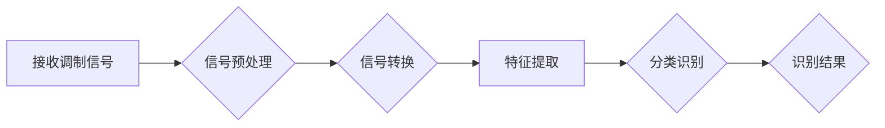

> 调制信号识别，计算机视觉，深度学习，卷积神经网络，信号处理

## 1. 背景介绍

调制信号识别是通信领域的重要研究课题，其目的是从接收到的混杂信号中提取出原始信息信号。传统的调制信号识别方法主要依赖于信号处理技术，例如匹配滤波、相关分析等。然而，随着通信技术的快速发展，调制信号的复杂度不断提高，传统的信号处理方法难以有效地识别出多种新型调制信号。

近年来，计算机视觉技术取得了长足的进步，特别是深度学习算法的出现，为调制信号识别带来了新的机遇。深度学习算法能够自动学习信号的特征，并对复杂信号进行有效的分类和识别。基于计算机视觉的调制信号识别方法，将图像处理和信号处理相结合，将调制信号转换为图像信号，并利用深度学习算法进行识别。

## 2. 核心概念与联系

### 2.1 调制信号与图像信号

调制信号是指将信息信号嵌入到载波信号中，以便通过信道传输的信息信号。常见的调制方式包括幅度调制（AM）、频率调制（FM）、相位调制（PM）等。

图像信号是指用像素表示的二维图像数据。每个像素代表图像中某一点的颜色或亮度信息。

### 2.2 计算机视觉与深度学习

计算机视觉是赋予计算机“看”的能力，使其能够理解和解释图像和视频信息。深度学习是机器学习的一种，它利用多层神经网络来学习数据的特征，并进行预测或分类。

### 2.3 调制信号识别流程

基于计算机视觉的调制信号识别流程如下：

1. **信号预处理:** 对接收到的调制信号进行预处理，例如去噪、滤波等，以提高信号质量。
2. **信号转换:** 将预处理后的调制信号转换为图像信号，例如将信号的幅度或频率信息映射到图像像素的亮度或颜色。
3. **特征提取:** 利用深度学习算法从图像信号中提取特征，例如边缘、纹理、形状等。
4. **分类识别:** 将提取的特征作为输入，利用分类器对调制信号进行识别，例如确定调制方式、识别调制参数等。



## 3. 核心算法原理 & 具体操作步骤

### 3.1 算法原理概述

基于计算机视觉的调制信号识别主要利用深度学习算法，特别是卷积神经网络（CNN）来实现。CNN具有强大的特征提取能力，能够自动学习调制信号的特征，并进行有效的分类识别。

### 3.2 算法步骤详解

1. **数据准备:** 收集大量的调制信号数据，并将其转换为图像信号。数据需要进行标注，即为每个图像信号指定对应的调制方式。
2. **模型构建:** 利用深度学习框架，例如TensorFlow或PyTorch，构建CNN模型。模型结构通常包括多个卷积层、池化层和全连接层。
3. **模型训练:** 将准备好的数据用于训练CNN模型。训练过程包括前向传播、反向传播和参数更新。
4. **模型评估:** 利用测试数据评估模型的性能，例如准确率、召回率、F1-score等。
5. **模型部署:** 将训练好的模型部署到实际应用场景中，用于识别未知的调制信号。

### 3.3 算法优缺点

**优点:**

* 自动学习特征，无需人工设计特征。
* 能够识别复杂调制信号，鲁棒性强。
* 识别精度高，性能优异。

**缺点:**

* 训练数据量大，需要大量的标注数据。
* 训练时间长，计算资源消耗大。
* 模型解释性差，难以理解模型的决策过程。

### 3.4 算法应用领域

基于计算机视觉的调制信号识别技术在以下领域具有广泛的应用前景：

* **无线通信:** 识别不同类型的无线通信信号，例如蜂窝网络、Wi-Fi、蓝牙等。
* **电子对抗:** 识别敌方通信信号，并进行干扰或压制。
* **信号监测:** 监测各种信号源，例如雷达、卫星、广播等。
* **网络安全:** 检测网络流量中的恶意信号，例如DDoS攻击、网络钓鱼等。

## 4. 数学模型和公式 & 详细讲解 & 举例说明

### 4.1 数学模型构建

调制信号识别可以看作是一个分类问题，目标是将输入的图像信号分类到不同的调制方式类别中。可以使用以下数学模型来描述调制信号识别的过程：

$$
y = f(W x + b)
$$

其中：

* $x$ 是输入的图像信号，是一个向量。
* $W$ 是权重矩阵，是一个矩阵。
* $b$ 是偏置向量，是一个向量。
* $f$ 是激活函数，例如ReLU、Sigmoid等。
* $y$ 是输出结果，是一个向量，每个元素代表对应调制方式的概率。

### 4.2 公式推导过程

CNN模型的训练过程是通过优化权重矩阵 $W$ 和偏置向量 $b$ 来实现的。常用的优化算法包括梯度下降法、Adam优化器等。

梯度下降法的基本思想是通过迭代更新权重和偏置，使模型的损失函数最小化。损失函数通常是交叉熵损失函数，用于衡量模型预测结果与真实标签之间的差异。

$$
L = -\sum_{i=1}^{N} y_i \log(\hat{y}_i)
$$

其中：

* $N$ 是样本数量。
* $y_i$ 是真实标签。
* $\hat{y}_i$ 是模型预测结果。

通过计算损失函数的梯度，并根据梯度方向更新权重和偏置，可以逐步降低损失函数的值，从而提高模型的识别精度。

### 4.3 案例分析与讲解

假设我们有一个调制信号识别任务，目标是识别AM、FM和PM三种调制方式。我们可以使用CNN模型来实现这个任务。

模型结构可以包括多个卷积层、池化层和全连接层。卷积层用于提取图像特征，池化层用于降低特征维度，全连接层用于分类。

训练过程中，我们将AM、FM和PM三种调制方式的图像信号作为训练数据，并使用交叉熵损失函数和Adam优化器进行训练。

经过训练，模型能够识别出不同类型的调制信号，并输出对应的概率。例如，对于一个输入的图像信号，模型可能输出以下结果：

* AM: 0.7
* FM: 0.2
* PM: 0.1

这表明模型认为该图像信号最可能是AM调制信号。

## 5. 项目实践：代码实例和详细解释说明

### 5.1 开发环境搭建

* **操作系统:** Ubuntu 18.04
* **Python版本:** 3.7
* **深度学习框架:** TensorFlow 2.0
* **其他库:** NumPy, Matplotlib, OpenCV

### 5.2 源代码详细实现

```python
import tensorflow as tf
from tensorflow.keras.models import Sequential
from tensorflow.keras.layers import Conv2D, MaxPooling2D, Flatten, Dense

# 定义CNN模型
model = Sequential()
model.add(Conv2D(32, (3, 3), activation='relu', input_shape=(64, 64, 1)))
model.add(MaxPooling2D((2, 2)))
model.add(Conv2D(64, (3, 3), activation='relu'))
model.add(MaxPooling2D((2, 2)))
model.add(Flatten())
model.add(Dense(10, activation='softmax'))

# 编译模型
model.compile(optimizer='adam',
              loss='sparse_categorical_crossentropy',
              metrics=['accuracy'])

# 训练模型
model.fit(x_train, y_train, epochs=10, batch_size=32)

# 评估模型
loss, accuracy = model.evaluate(x_test, y_test)
print('Test loss:', loss)
print('Test accuracy:', accuracy)
```

### 5.3 代码解读与分析

* **模型定义:** 代码定义了一个简单的CNN模型，包括两个卷积层、两个池化层和一个全连接层。
* **模型编译:** 使用Adam优化器、交叉熵损失函数和准确率作为评估指标编译模型。
* **模型训练:** 使用训练数据训练模型，设置训练轮数和批处理大小。
* **模型评估:** 使用测试数据评估模型的性能，输出测试损失和准确率。

### 5.4 运行结果展示

训练完成后，可以将模型应用于新的调制信号识别任务。

## 6. 实际应用场景

### 6.1 无线通信网络

基于计算机视觉的调制信号识别技术可以应用于无线通信网络的信号监测和管理。例如，可以识别不同类型的无线通信信号，例如蜂窝网络、Wi-Fi、蓝牙等，并进行流量分析和管理。

### 6.2 电子对抗系统

在电子对抗系统中，调制信号识别技术可以用于识别敌方通信信号，并进行干扰或压制。例如，可以识别敌方雷达信号，并进行干扰，以保护己方设备。

### 6.3 信号监测与分析

调制信号识别技术可以应用于各种信号监测和分析任务，例如监测雷达信号、卫星信号、广播信号等。可以识别不同类型的信号，并进行分析，以获取信号源、信号强度、信号类型等信息。

### 6.4 未来应用展望

随着计算机视觉和深度学习技术的不断发展，基于计算机视觉的调制信号识别技术将有更广泛的应用前景。例如，可以应用于智能电网、物联网、自动驾驶等领域。

## 7. 工具和资源推荐

### 7.1 学习资源推荐

* **书籍:**
    * 深度学习
    * 计算机视觉
* **在线课程:**
    * Coursera: 深度学习
    * Udacity: 计算机视觉
* **博客:**
    * TensorFlow博客
    * PyTorch博客

### 7.2 开发工具推荐

* **深度学习框架:** TensorFlow, PyTorch
* **图像处理库:** OpenCV
* **数据可视化库:** Matplotlib

### 7.3 相关论文推荐

* **基于深度学习的调制信号识别**
* **计算机视觉在通信信号处理中的应用**

## 8. 总结：未来发展趋势与挑战

### 8.1 研究成果总结

基于计算机视觉的调制信号识别技术取得了显著的进展，能够有效识别复杂调制信号，并具有较高的识别精度。

### 8.2 未来发展趋势

* **模型复杂度提升:** 探索更深、更复杂的CNN模型结构，以提高识别精度和鲁棒性。
* **数据增强技术:** 利用数据增强技术，例如图像旋转、翻转、缩放等，增加训练数据的多样性，提高模型泛化能力。
* **迁移学习:** 利用预训练模型，例如ImageNet模型，进行调制信号识别的迁移学习，减少训练数据需求。
* **实时识别:** 研究实时调制信号识别算法，满足实时通信系统的需求。

### 8.3 面临的挑战

* **数据标注:** 调制信号识别需要大量的标注数据，数据标注成本高，效率低。
* **模型解释性:** 深度学习模型的决策过程难以解释，难以理解模型的识别原理。
* **硬件资源:** 训练大型深度学习模型需要大量的计算资源，成本高昂。

### 8.4 研究展望

未来，基于计算机视觉的调制信号识别技术将继续发展，并应用于更广泛的领域。研究者将致力于解决上述挑战，开发更有效、更鲁棒、更易解释的调制信号识别算法。

## 9. 附录：常见问题与解答

### 9.1 如何选择合适的CNN模型结构？

选择合适的CNN模型结构取决于具体的