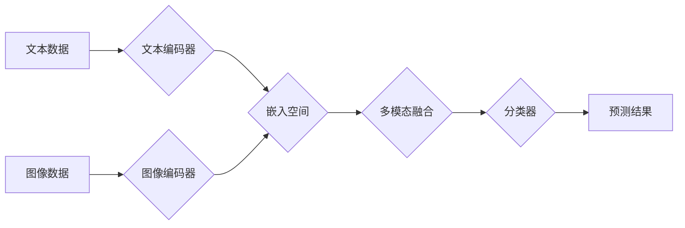

> 多模态AI, 视觉理解, 语音识别, 自然语言处理, 深度学习, Transformer, multimodal embedding, 跨模态检索

## 1. 背景介绍

人工智能（AI）近年来取得了令人瞩目的进展，尤其是在深度学习领域。传统的单模态AI模型主要专注于处理单一类型的数据，例如文本、图像或音频。然而，现实世界中信息往往是多模态的，例如一张图片配有文字描述、一段视频包含语音和字幕等。因此，开发能够理解和处理多种模态数据的多模态AI模型成为一个重要的研究方向。

多模态AI的目标是融合不同模态的信息，以获得更全面、更深入的理解。例如，在图像识别任务中，结合文本描述可以帮助模型更好地理解图像内容；在语音助手领域，结合文本信息可以使语音助手更准确地理解用户意图。

## 2. 核心概念与联系

多模态AI的核心概念是将不同模态的数据映射到一个共同的语义空间，以便模型能够进行跨模态的交互和理解。

**2.1 多模态嵌入**

多模态嵌入是指将不同模态的数据映射到一个低维向量空间，称为嵌入空间。每个嵌入向量都代表一个特定的数据点，并且相似的嵌入向量表示相似的概念。

**2.2 跨模态关联学习**

跨模态关联学习是指通过学习不同模态之间的关系，来提高模型对多模态数据的理解能力。

**2.3 多模态融合策略**

多模态融合策略是指将不同模态的嵌入信息融合在一起，以获得更丰富的语义表示。常见的融合策略包括：

* **早期融合:** 在特征提取阶段将不同模态的数据进行融合。
* **晚期融合:** 在分类阶段将不同模态的特征进行融合。
* **注意力机制:** 通过学习不同模态之间的权重，对重要信息进行加权融合。

**2.4 Mermaid 流程图**



## 3. 核心算法原理 & 具体操作步骤

### 3.1  算法原理概述

多模态AI算法通常基于深度学习框架，利用神经网络学习不同模态之间的关系和映射。常见的算法包括：

* **Transformer:** Transformer是一种强大的深度学习模型，能够有效地处理序列数据，例如文本和音频。它利用注意力机制学习不同位置之间的依赖关系，并能够捕捉长距离依赖。
* **多模态Transformer:** 多模态Transformer将Transformer模型扩展到多模态数据，例如Vision Transformer (ViT)和Audio-Visual Transformer (AVT)。

### 3.2  算法步骤详解

1. **数据预处理:** 将文本、图像和音频数据进行预处理，例如文本分词、图像裁剪和音频降噪。
2. **模态编码:** 使用不同的编码器对每个模态的数据进行编码，例如使用BERT对文本进行编码，使用ResNet对图像进行编码。
3. **多模态融合:** 将不同模态的编码结果进行融合，例如使用注意力机制学习不同模态之间的权重，或者使用拼接操作将编码结果连接起来。
4. **分类或预测:** 使用融合后的多模态表示进行分类或预测，例如使用分类器对图像进行识别，或者使用回归模型对语音进行识别。

### 3.3  算法优缺点

**优点:**

* 能够处理多种模态的数据，获得更丰富的语义信息。
* 能够学习不同模态之间的关系，提高模型的理解能力。
* 在许多应用场景中取得了优异的性能。

**缺点:**

* 训练数据量大，需要大量的标注数据。
* 模型复杂度高，训练时间长。
* 跨模态关联学习仍然是一个挑战。

### 3.4  算法应用领域

多模态AI算法在许多领域都有广泛的应用，例如：

* **计算机视觉:** 图像识别、目标检测、图像 Captioning
* **语音识别:** 语音转文本、语音情感分析
* **自然语言处理:** 文本摘要、机器翻译、问答系统
* **人机交互:** 语音助手、虚拟现实

## 4. 数学模型和公式 & 详细讲解 & 举例说明

### 4.1  数学模型构建

多模态AI模型通常使用以下数学模型进行构建：

* **嵌入层:** 将不同模态的数据映射到一个低维向量空间。
* **注意力层:** 学习不同模态之间的关系，并对重要信息进行加权融合。
* **分类层:** 将融合后的多模态表示进行分类或预测。

### 4.2  公式推导过程

**4.2.1  嵌入层公式:**

$$
\mathbf{h}_i = \mathbf{W}_i \mathbf{x}_i + \mathbf{b}_i
$$

其中，$\mathbf{h}_i$ 是第 $i$ 个数据点的嵌入向量，$\mathbf{x}_i$ 是第 $i$ 个数据点的原始输入，$\mathbf{W}_i$ 是嵌入层的权重矩阵，$\mathbf{b}_i$ 是嵌入层的偏置向量。

**4.2.2  注意力层公式:**

$$
\mathbf{a}_{ij} = \frac{\exp(\mathbf{h}_i^T \mathbf{h}_j)}{\sum_{k=1}^{N} \exp(\mathbf{h}_i^T \mathbf{h}_k)}
$$

其中，$\mathbf{a}_{ij}$ 是第 $i$ 个数据点对第 $j$ 个数据点的注意力权重，$\mathbf{h}_i$ 和 $\mathbf{h}_j$ 是第 $i$ 个和第 $j$ 个数据点的嵌入向量。

**4.2.3  融合层公式:**

$$
\mathbf{h}_{fused} = \sum_{i=1}^{N} \mathbf{a}_{ij} \mathbf{h}_i
$$

其中，$\mathbf{h}_{fused}$ 是融合后的多模态表示，$\mathbf{a}_{ij}$ 是第 $i$ 个数据点对第 $j$ 个数据点的注意力权重，$\mathbf{h}_i$ 是第 $i$ 个数据点的嵌入向量。

### 4.3  案例分析与讲解

**案例:**

假设我们有一个图像和文本描述的配对数据，我们需要使用多模态AI模型进行图像识别。

**分析:**

1. 将图像和文本描述分别进行编码，得到图像嵌入向量和文本嵌入向量。
2. 使用注意力机制学习图像嵌入向量和文本嵌入向量之间的关系，得到注意力权重。
3. 将注意力加权后的图像嵌入向量和文本嵌入向量进行融合，得到融合后的多模态表示。
4. 使用分类器对融合后的多模态表示进行分类，得到图像识别结果。

**讲解:**

通过注意力机制，模型可以学习到图像和文本描述之间的相关性，例如，如果文本描述中提到“猫”，那么模型会将注意力集中在图像中的猫身上。

## 5. 项目实践：代码实例和详细解释说明

### 5.1  开发环境搭建

* Python 3.7+
* PyTorch 1.7+
* CUDA 10.2+
* torchvision 0.10+
* transformers 4.0+

### 5.2  源代码详细实现

```python
import torch
import torch.nn as nn
from transformers import ViTFeatureExtractor, ViTForImageClassification

# 定义多模态模型
class MultimodalModel(nn.Module):
    def __init__(self, image_model, text_model):
        super(MultimodalModel, self).__init__()
        self.image_model = image_model
        self.text_model = text_model
        self.fusion_layer = nn.Linear(image_model.config.hidden_size + text_model.config.hidden_size, 1024)
        self.classifier = nn.Linear(1024, num_classes)

    def forward(self, image, text):
        image_features = self.image_model(image)
        text_features = self.text_model(text)
        fused_features = torch.cat((image_features, text_features), dim=1)
        fused_features = self.fusion_layer(fused_features)
        output = self.classifier(fused_features)
        return output

# 实例化模型
image_feature_extractor = ViTFeatureExtractor.from_pretrained("google/vit-base-patch16-224")
image_model = ViTForImageClassification.from_pretrained("google/vit-base-patch16-224")
text_model = BertForSequenceClassification.from_pretrained("bert-base-uncased")
model = MultimodalModel(image_model, text_model)

# 训练模型
# ...

```

### 5.3  代码解读与分析

* 该代码定义了一个多模态模型，包含图像编码器、文本编码器和融合层。
* 图像编码器使用预训练的ViT模型，文本编码器使用预训练的BERT模型。
* 融合层将图像和文本的特征进行拼接，然后使用全连接层进行分类。

### 5.4  运行结果展示

* 训练完成后，模型可以用于图像识别任务，例如，输入一张图片和它的文本描述，模型可以预测图片的类别。

## 6. 实际应用场景

### 6.1  医疗诊断

* 将病历文本和医学影像数据结合起来，辅助医生进行诊断。
* 例如，结合患者的病史和X光片，可以提高肺结核的诊断准确率。

### 6.2  教育培训

* 利用多模态数据创建更生动的学习体验。
* 例如，结合视频和文本，可以提高学生的学习兴趣和理解能力。

### 6.3  智能客服

* 使用语音和文本数据，构建更智能的客服系统。
* 例如，可以理解用户的语音指令，并提供相应的文本回复。

### 6.4  未来应用展望

* 多模态AI技术将应用于更多领域，例如自动驾驶、机器人、虚拟现实等。
* 未来，多模态AI模型将更加智能、更加通用，能够更好地理解和交互与人类世界。

## 7. 工具和资源推荐

### 7.1  学习资源推荐

* **书籍:**
    * 《深度学习》 by Ian Goodfellow, Yoshua Bengio, and Aaron Courville
    * 《多模态学习》 by  Subhashini Venugopalan
* **课程:**
    * Stanford CS230: Convolutional Neural Networks for Visual Recognition
    * MIT 6.S191: Introduction to Deep Learning

### 7.2  开发工具推荐

* **PyTorch:** 一个开源的深度学习框架。
* **TensorFlow:** 另一个开源的深度学习框架。
* **Hugging Face Transformers:** 一个用于加载和使用预训练 Transformer 模型的库。

### 7.3  相关论文推荐

* **Attention Is All You Need:** https://arxiv.org/abs/1706.03762
* **BERT: Pre-training of Deep Bidirectional Transformers for Language Understanding:** https://arxiv.org/abs/1810.04805
* **Vision Transformer:** https://arxiv.org/abs/2010.11929

## 8. 总结：未来发展趋势与挑战

### 8.1  研究成果总结

多模态AI技术取得了显著的进展，在图像识别、语音识别、自然语言处理等领域取得了优异的性能。

### 8.2  未来发展趋势

* **模型规模和能力的提升:** 未来，多模态AI模型将更加大规模、更加复杂，能够处理更多模态的数据，并进行更复杂的推理。
* **跨模态关联学习的深入研究:** 如何更好地学习不同模