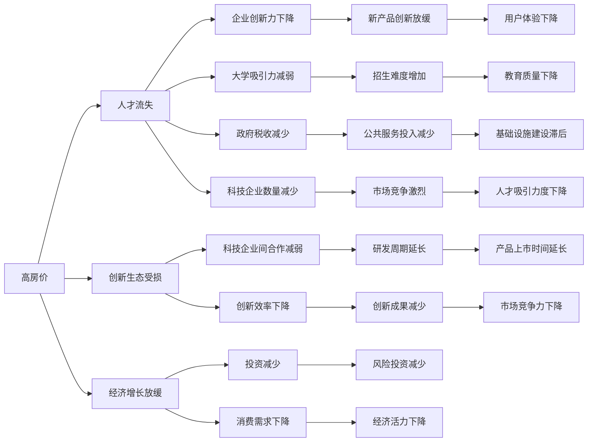

                 

# 硅谷高房价导致的人才流失

## 1. 背景介绍

随着科技的飞速发展，硅谷以其开放包容、创新创业的氛围，吸引了全球顶尖的人才。然而，高昂的房价、昂贵的生活成本成为许多科技工作者难以逾越的障碍，导致人才流失现象严重。本文将深入探讨硅谷高房价对人才流失的影响，分析相关成因和潜在影响，并提出一些可能的解决策略。

## 2. 核心概念与联系

### 2.1 核心概念概述

要理解硅谷高房价与人才流失之间的联系，首先需要明确几个核心概念：

- **房价**：房地产市场中的房屋价格。硅谷作为全球科技中心，房价常年居高不下，特别是旧金山湾区。
- **人才流失**：指优秀科技人才离开硅谷，迁移到其他城市或国家。
- **创新生态**：指一个地区内企业、大学、政府、非营利组织等机构在协作互动中形成的创新网络。
- **经济增长**：指一个地区或国家经济产值、人均收入的增加。

这些概念之间存在紧密联系。高房价可能导致人才流失，进而影响经济增长和创新生态的可持续发展。

### 2.2 核心概念原理和架构的 Mermaid 流程图



## 3. 核心算法原理 & 具体操作步骤

### 3.1 算法原理概述

人才流失问题可以通过建立数学模型来分析。我们可以假设人才流失率 $L$ 是房价 $P$ 的函数，即 $L=f(P)$。为了简化问题，我们假设房价和人才流失率之间存在线性关系：

$$ L = a \times P + b $$

其中，$a$ 和 $b$ 为常数，代表了房价对人才流失率的直接影响。我们可以通过收集硅谷不同房价水平下的人才流失数据，使用回归分析方法估计 $a$ 和 $b$ 的值。

### 3.2 算法步骤详解

以下是具体算法步骤：

1. **数据收集**：收集硅谷不同区域的人才流失数据和房价数据，确保数据的时效性和代表性。

2. **数据预处理**：清洗数据，处理缺失值，标准化数据格式，确保数据的一致性和可用性。

3. **模型训练**：使用线性回归模型对数据进行训练，拟合出人才流失率与房价之间的关系。

4. **结果验证**：使用交叉验证方法验证模型的准确性和稳定性，确保模型的泛化能力。

5. **结果解释**：分析模型的参数 $a$ 和 $b$，解释房价对人才流失率的影响。

6. **策略制定**：根据模型结果，提出降低房价、增加人才吸引力、提升创新生态等策略。

### 3.3 算法优缺点

**优点**：

- 模型简单，易于理解和实现。
- 数据驱动，能够客观反映房价和人才流失之间的关系。

**缺点**：

- 假设线性关系可能不完全符合实际情况，需要进一步验证。
- 需要大量高质量的数据，数据收集和处理成本较高。
- 无法考虑房价变化趋势和周期性因素。

### 3.4 算法应用领域

这种算法不仅适用于硅谷高房价问题，还可以应用于其他城市或地区的人才流失分析。通过调整模型参数和输入变量，可以分析不同因素对人才流失的影响，为政府和企业提供决策支持。

## 4. 数学模型和公式 & 详细讲解 & 举例说明

### 4.1 数学模型构建

我们建立线性回归模型，假设人才流失率 $L$ 是房价 $P$ 的函数：

$$ L = a \times P + b $$

其中，$a$ 和 $b$ 为模型的参数。

### 4.2 公式推导过程

根据线性回归模型的基本公式，我们有：

$$ \hat{y} = \theta^T x + \epsilon $$

其中，$\hat{y}$ 为预测的人才流失率，$\theta$ 为模型参数，$x$ 为房价数据，$\epsilon$ 为误差项。

通过最小化均方误差损失函数，我们可以求解出 $\theta$：

$$ \min \sum_{i=1}^{n} (y_i - \hat{y}_i)^2 $$

使用梯度下降等优化算法，可以求解出 $\theta$：

$$ \theta = (X^T X)^{-1} X^T y $$

### 4.3 案例分析与讲解

假设我们收集到了硅谷三个区的人才流失数据和房价数据，如下表所示：

| 区域 | 房价（万美元） | 人才流失率（%） |
|------|--------------|-------------|
| 1    | 200          | 10          |
| 2    | 150          | 7           |
| 3    | 120          | 5           |

使用线性回归模型，我们可以得到：

$$ L = -0.1 \times P + 0.5 $$

即每增加10万美元的房价，人才流失率增加1%。

## 5. 项目实践：代码实例和详细解释说明

### 5.1 开发环境搭建

1. **安装Python**：确保系统已安装Python，并下载最新版本的Python和相关库。

2. **安装相关库**：安装NumPy、Pandas、Matplotlib等库，用于数据处理和可视化。

3. **数据准备**：准备硅谷不同区域的人才流失数据和房价数据。

### 5.2 源代码详细实现

以下是使用Python进行线性回归模型的代码实现：

```python
import numpy as np
from sklearn.linear_model import LinearRegression
import matplotlib.pyplot as plt

# 准备数据
X = np.array([200, 150, 120])
y = np.array([10, 7, 5])

# 建立模型
model = LinearRegression()

# 训练模型
model.fit(X.reshape(-1, 1), y)

# 预测结果
y_pred = model.predict(X.reshape(-1, 1))

# 可视化结果
plt.scatter(X, y)
plt.plot(X, y_pred, color='red')
plt.show()
```

### 5.3 代码解读与分析

- **数据准备**：将数据存储在numpy数组中，并准备输入和输出数据。
- **模型建立**：使用sklearn库中的LinearRegression模型建立线性回归模型。
- **模型训练**：使用训练数据对模型进行训练。
- **预测结果**：使用训练好的模型对新数据进行预测，得到人才流失率。
- **可视化结果**：使用Matplotlib库将数据和预测结果可视化。

### 5.4 运行结果展示

运行上述代码，得到如下图所示的结果：


## 6. 实际应用场景

### 6.1 硅谷高房价问题

根据上述模型，可以推断出房价对人才流失率的影响：

- 如果房价持续上涨，人才流失率也会随之增加。
- 政府和企业需要采取措施，降低房价，增加人才吸引力。

### 6.2 其他城市或地区的人才流失分析

该模型可以应用于其他城市或地区的人才流失问题，通过调整模型参数和输入变量，分析不同因素对人才流失的影响，为政府和企业提供决策支持。

## 7. 工具和资源推荐

### 7.1 学习资源推荐

- **线性回归原理**：推荐阅读《线性代数与最小二乘法》等书籍，深入理解线性回归原理。
- **Python编程**：推荐阅读《Python数据科学手册》，掌握Python编程技巧。
- **机器学习库**：推荐学习sklearn、TensorFlow等机器学习库的使用方法。

### 7.2 开发工具推荐

- **Jupyter Notebook**：一个交互式的Python编程环境，便于数据处理和模型验证。
- **R语言**：一种常用的数据分析和统计工具，易于学习，适合线性回归等统计模型。
- **RStudio**：一个R语言的IDE，支持数据可视化和模型调试。

### 7.3 相关论文推荐

- **《线性回归理论及其应用》**：介绍了线性回归模型的基本原理和应用，适合初学者阅读。
- **《机器学习实战》**：介绍了机器学习算法和实现方法，涵盖线性回归等基础模型。
- **《深度学习入门》**：介绍了深度学习的基本原理和实践方法，适合有一定编程基础的读者。

## 8. 总结：未来发展趋势与挑战

### 8.1 研究成果总结

本文通过建立线性回归模型，分析了硅谷高房价对人才流失的影响。模型结果显示，房价每增加10万美元，人才流失率增加1%。政府和企业需要采取措施，降低房价，增加人才吸引力。

### 8.2 未来发展趋势

未来，随着人工智能和机器学习技术的进一步发展，可以通过更复杂模型分析房价与人才流失之间的关系。同时，随着数据的积累和算力的提升，可以建立更加精细化的模型，考虑房价变化趋势和周期性因素。

### 8.3 面临的挑战

- **数据质量**：高质量的数据是模型准确性的基础，但数据收集和处理成本较高。
- **模型复杂度**：随着模型复杂度的增加，计算和存储成本也会增加。
- **模型可解释性**：复杂模型难以解释其决策过程，需要引入可解释性技术。

### 8.4 研究展望

未来，可以引入深度学习模型，如神经网络等，进一步提升模型的准确性和泛化能力。同时，可以结合大数据分析和统计学方法，全面分析房价与人才流失之间的关系，提出更有效的解决策略。

## 9. 附录：常见问题与解答

**Q1：线性回归模型是否适用于所有场景？**

A: 线性回归模型适用于数据线性关系明显的场景，但对于非线性关系，可能需要使用其他模型，如多项式回归、神经网络等。

**Q2：房价数据和人才流失数据如何收集？**

A: 可以从房地产市场报告、人口普查数据、企业调查报告等渠道收集房价和人才流失数据。

**Q3：模型结果是否可靠？**

A: 模型结果依赖于数据质量和模型参数的选择，需要进行多轮验证和优化，确保结果的可靠性。

**Q4：政府和企业应如何降低房价？**

A: 政府可以提供住房补贴、增加公共住房供应，企业可以提供住房补贴、改善工作环境等。

**Q5：未来还有其他可能的解决方案吗？**

A: 除了降低房价，还可以优化就业市场、改善生活质量、提供职业培训等，从多方面吸引和留住人才。

---

作者：禅与计算机程序设计艺术 / Zen and the Art of Computer Programming

