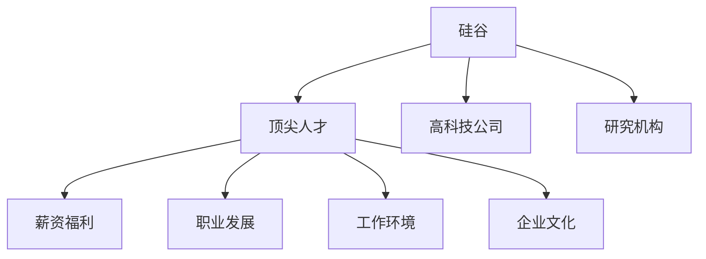

                 

# 硅谷高科技人才战争:争夺顶尖人才

## 1. 背景介绍

在当今的科技革命浪潮中，硅谷已经成为了全球高新技术的摇篮。这不仅仅是因为它拥有数不胜数的技术公司和创业公司，更因为它拥有顶尖的科技人才和创新生态。硅谷，作为全球科技创新的中心，其对顶尖人才的争夺已经成为了一场没有硝烟的战争。在这场战争中，人才成为了企业间竞争的核心，是推动创新、发展科技的关键。

### 1.1 问题由来

随着科技的发展，各行各业对技术创新的依赖越来越强。科技公司需要顶尖的人才来推动技术突破和产品创新。硅谷作为全球科技创新的中心，汇聚了大量的顶级科技人才，包括顶尖的计算机科学家、数据科学家、工程师等。

为了吸引这些顶尖人才，硅谷的企业和研究机构投入了大量的资源。然而，科技人才的争夺并不是一蹴而就的。企业需要提供优越的待遇、完善的福利、自由的工作环境、深厚的技术文化和丰富的职业发展机会，才能在这场人才战争中脱颖而出。

### 1.2 问题核心关键点

在这场人才战争中，企业需要关注以下几个核心关键点：

- **薪资福利**：提供具有竞争力的薪资和福利待遇，吸引和留住顶级科技人才。
- **职业发展**：提供职业发展的平台，让人才有更多的成长空间和晋升机会。
- **工作环境**：营造自由、开放、创新的工作环境，激发人才的创造力。
- **文化氛围**：建立积极向上的企业文化，吸引志同道合的科技人才。
- **资源配置**：合理配置资源，确保人才有充足的资源支持，进行技术创新和产品研发。

这些核心关键点共同构成了硅谷科技人才战争的核心内容。

### 1.3 问题研究意义

研究硅谷科技人才战争，对于企业来说，具有重要的现实意义：

- **提升竞争力**：吸引和留住顶尖人才，企业才能在科技创新的竞争中占据优势。
- **推动创新**：顶尖科技人才能够推动企业的技术突破和产品创新，提升企业市场竞争力。
- **构建团队**：吸引顶尖人才，构建强大的科技团队，增强企业技术实力。
- **培养人才**：建立完善的职业发展平台，培养出更多的科技人才，为企业的持续发展提供保障。
- **激励创新**：营造自由、创新的工作环境和文化氛围，激发科技人才的创新热情。

## 2. 核心概念与联系

### 2.1 核心概念概述

为了更好地理解硅谷科技人才战争的内涵，本节将介绍几个关键概念：

- **硅谷**：全球科技创新的中心，汇集了数不胜数的高科技公司和研究机构。
- **顶尖人才**：具有顶尖技术能力、创新思维和潜力的人才，是推动企业技术创新的关键。
- **薪资福利**：包括薪资、股票、期权、福利等，吸引和留住人才的重要手段。
- **职业发展**：提供职业晋升机会、培训机会、领导力培养等，推动人才成长。
- **工作环境**：工作场所的环境、设施、团队氛围等，影响人才的工作体验和创新能力。
- **企业文化**：公司价值观、工作态度、工作方式等，影响人才的工作动力和归属感。

这些核心概念之间的逻辑关系可以通过以下Mermaid流程图来展示：



这个流程图展示了硅谷科技人才战争的核心概念及其之间的联系：

1. 硅谷汇聚了全球顶尖科技人才，是科技创新的中心。
2. 这些顶尖人才需要吸引和留住，需要提供优厚的薪资福利、职业发展机会、舒适的工作环境和良好的企业文化。
3. 高科技公司和研究机构是硅谷的核心力量，需要投入资源争夺顶尖人才。

## 3. 核心算法原理 & 具体操作步骤
### 3.1 算法原理概述

硅谷科技人才战争的算法原理，可以简单概括为“人才吸引力”模型。该模型基于以下几个核心变量：

- **薪资福利吸引力**：用公式表示为 $A_{\text{salary}} = k_s \cdot \text{Salary} + c_s \cdot \text{Benefits}$，其中 $k_s$ 为薪资吸引力系数，$c_s$ 为福利吸引力系数。
- **职业发展吸引力**：用公式表示为 $A_{\text{career}} = k_c \cdot \text{Training} + c_c \cdot \text{Career\_Steps}$，其中 $k_c$ 为职业发展吸引力系数，$c_c$ 为职业晋升吸引力系数。
- **工作环境吸引力**：用公式表示为 $A_{\text{work}} = k_w \cdot \text{Culture} + c_w \cdot \text{Facilities}$，其中 $k_w$ 为工作环境吸引力系数，$c_w$ 为设施吸引力系数。
- **企业文化吸引力**：用公式表示为 $A_{\text{culture}} = k_cu \cdot \text{Values} + c_cu \cdot \text{Attitudes}$，其中 $k_cu$ 为企业文化吸引力系数，$c_cu$ 为工作态度吸引力系数。

这些变量共同构成了硅谷企业争夺人才的吸引因子，最终影响人才的决策。

### 3.2 算法步骤详解

基于“人才吸引力”模型，硅谷企业争夺顶尖人才的主要步骤如下：

**Step 1: 收集数据**

- 收集和分析市场上其他企业提供的薪资福利、职业发展、工作环境和文化等信息，作为基准数据。
- 根据这些数据，设定吸引力的标准系数 $k_s, c_s, k_c, c_c, k_w, c_w, k_cu, c_cu$。

**Step 2: 计算吸引力分数**

- 使用公式 $A_{\text{total}} = \sum A_{\text{item}}$ 计算企业的整体吸引力，其中 $A_{\text{item}}$ 代表各个吸引因子的吸引力分数。
- 比较不同企业的吸引力分数，找出在吸引力方面具有优势的企业。

**Step 3: 优化吸引策略**

- 根据吸引力分数，找出企业吸引力的短板，进行优化改进。
- 例如，通过提高薪资福利、加强职业发展培训、改善工作环境、建设企业文化等手段，提升企业的整体吸引力。

**Step 4: 实施人才引进策略**

- 通过高吸引力策略，吸引顶级人才加入企业。
- 持续优化人才引进策略，形成良性循环。

### 3.3 算法优缺点

硅谷科技人才战争的算法具有以下优点：

1. **系统性**：通过计算各吸引因子的综合吸引力分数，形成了系统化的人才引进策略。
2. **可操作性强**：吸引力分数可以量化，便于企业对策略进行优化和调整。
3. **全面性**：考虑了薪资福利、职业发展、工作环境和文化等多个方面的影响，全面性更强。

同时，该算法也存在一些缺点：

1. **数据获取难度大**：需要获取大量市场上其他企业的详细信息，获取难度较大。
2. **动态性差**：市场环境和人才需求不断变化，吸引力分数需要实时更新。
3. **模型复杂度**：涉及多个变量和系数，模型复杂度较高。

### 3.4 算法应用领域

硅谷科技人才战争的算法不仅适用于高科技企业的人才争夺，还适用于各种类型的企业和组织。

- **高科技公司**：如Google、Facebook、Apple等，通过优化的吸引力策略，吸引和留住顶尖人才。
- **研究机构**：如斯坦福大学、加州大学伯克利分校等，通过优化的研究环境和资源配置，吸引和培养顶级科研人员。
- **金融行业**：如高盛、摩根大通等，通过优化的薪资福利和职业发展机会，吸引和留住顶尖金融人才。
- **科技创业公司**：通过优化的吸引策略，快速招募和培养顶尖人才，推动产品和技术创新。
- **教育机构**：通过优化的教学环境和职业发展机会，吸引和留住顶尖教育人才。

## 4. 数学模型和公式 & 详细讲解  
### 4.1 数学模型构建

本节将使用数学语言对硅谷科技人才战争的算法进行更加严格的刻画。

假设某企业提供给顶尖人才的薪资为 $\text{Salary}$，福利为 $\text{Benefits}$，培训资源为 $\text{Training}$，职业晋升机会为 $\text{Career\_Steps}$，工作环境为 $\text{Culture}$，设施为 $\text{Facilities}$，企业文化为 $\text{Values}$，工作态度为 $\text{Attitudes}$。各吸引因子的吸引力系数分别为 $k_s, c_s, k_c, c_c, k_w, c_w, k_cu, c_cu$。

定义该企业对顶尖人才的整体吸引力为 $A_{\text{total}}$，则公式为：

$$
A_{\text{total}} = k_s \cdot \text{Salary} + c_s \cdot \text{Benefits} + k_c \cdot \text{Training} + c_c \cdot \text{Career\_Steps} + k_w \cdot \text{Culture} + c_w \cdot \text{Facilities} + k_cu \cdot \text{Values} + c_cu \cdot \text{Attitudes}
$$

### 4.2 公式推导过程

以下我们以计算薪资福利吸引力为例，推导公式。

薪资福利吸引力的计算公式为：

$$
A_{\text{salary}} = k_s \cdot \text{Salary} + c_s \cdot \text{Benefits}
$$

其中，$k_s$ 和 $c_s$ 分别为薪资和福利的吸引力系数，通常根据市场调研和调研问卷得出。例如，如果 $k_s=0.6$，$c_s=0.4$，则某企业提供的薪资为 $\text{Salary}=100,000$，福利为 $\text{Benefits}=10,000$，则该企业的薪资福利吸引力分数为：

$$
A_{\text{salary}} = 0.6 \cdot 100,000 + 0.4 \cdot 10,000 = 60,000
$$

通过类似的方式，可以计算出其他各个吸引因子的吸引力分数，并汇总得到整体吸引力分数 $A_{\text{total}}$。

### 4.3 案例分析与讲解

假设某企业A和B都在争夺同一个顶级人才。企业A提供的薪资为 $\text{Salary}_A=100,000$，福利为 $\text{Benefits}_A=10,000$，培训资源为 $\text{Training}_A=2,000$，职业晋升机会为 $\text{Career\_Steps}_A=5$，工作环境为 $\text{Culture}_A=4$，设施为 $\text{Facilities}_A=3$，企业文化为 $\text{Values}_A=3$，工作态度为 $\text{Attitudes}_A=4$。各吸引力系数的设置如下：

- $k_s=0.6$，$c_s=0.4$
- $k_c=0.5$，$c_c=0.5$
- $k_w=0.3$，$c_w=0.7$
- $k_cu=0.4$，$c_cu=0.6$

则企业A的整体吸引力分数为：

$$
A_{\text{total}} = 0.6 \cdot 100,000 + 0.4 \cdot 10,000 + 0.5 \cdot 2,000 + 0.5 \cdot 5 + 0.3 \cdot 4 + 0.7 \cdot 3 + 0.4 \cdot 3 + 0.6 \cdot 4 = 62,500
$$

企业B提供的数据和系数相同，但由于具体数值不同，最终计算出的吸引力分数也不同。例如，如果企业B的培训资源为 $\text{Training}_B=2,500$，职业晋升机会为 $\text{Career\_Steps}_B=6$，则企业B的整体吸引力分数为：

$$
A_{\text{total}} = 0.6 \cdot 100,000 + 0.4 \cdot 10,000 + 0.5 \cdot 2,500 + 0.5 \cdot 6 + 0.3 \cdot 4 + 0.7 \cdot 3 + 0.4 \cdot 3 + 0.6 \cdot 4 = 62,950
$$

由此可见，企业B的整体吸引力分数略高于企业A，因此有更大概率吸引到顶级人才。

## 5. 项目实践：代码实例和详细解释说明
### 5.1 开发环境搭建

在进行硅谷科技人才战争的算法实践前，我们需要准备好开发环境。以下是使用Python进行代码实现的开发环境配置流程：

1. 安装Anaconda：从官网下载并安装Anaconda，用于创建独立的Python环境。

2. 创建并激活虚拟环境：
```bash
conda create -n talent-war python=3.8 
conda activate talent-war
```

3. 安装PyTorch：根据CUDA版本，从官网获取对应的安装命令。例如：
```bash
conda install pytorch torchvision torchaudio cudatoolkit=11.1 -c pytorch -c conda-forge
```

4. 安装Pandas和NumPy：
```bash
pip install pandas numpy
```

5. 安装相关库：
```bash
pip install scikit-learn matplotlib seaborn
```

完成上述步骤后，即可在`talent-war`环境中开始代码实现。

### 5.2 源代码详细实现

下面我们以计算企业A和B的整体吸引力分数为例，给出硅谷科技人才战争的Python代码实现。

首先，定义各吸引因子的变量和系数：

```python
import pandas as pd
import numpy as np

# 设定各吸引力系数
salary_coefficient = 0.6
benefits_coefficient = 0.4
career_coefficient = 0.5
ccareer_coefficient = 0.5
work_coefficient = 0.3
wwork_coefficient = 0.7
culture_coefficient = 0.4
cculture_coefficient = 0.6

# 设定企业A和B的薪资福利、职业发展、工作环境、企业文化等数据
salary_A = 100000
benefits_A = 10000
career_steps_A = 5
training_A = 2000
culture_A = 4
facilities_A = 3
values_A = 3
attitudes_A = 4

salary_B = 100000
benefits_B = 10000
career_steps_B = 6
training_B = 2500
culture_B = 4
facilities_B = 3
values_B = 3
attitudes_B = 4

# 计算企业A和B的吸引力分数
A_total_A = salary_coefficient * salary_A + benefits_coefficient * benefits_A + career_coefficient * career_steps_A + ccareer_coefficient * training_A + work_coefficient * culture_A + wwork_coefficient * facilities_A + cculture_coefficient * values_A + cculture_coefficient * attitudes_A
A_total_B = salary_coefficient * salary_B + benefits_coefficient * benefits_B + career_coefficient * career_steps_B + ccareer_coefficient * training_B + work_coefficient * culture_B + wwork_coefficient * facilities_B + cculture_coefficient * values_B + cculture_coefficient * attitudes_B
```

然后，计算并输出企业A和B的整体吸引力分数：

```python
# 输出企业A和B的整体吸引力分数
print(f"企业A的整体吸引力分数：{A_total_A}")
print(f"企业B的整体吸引力分数：{A_total_B}")
```

### 5.3 代码解读与分析

让我们再详细解读一下关键代码的实现细节：

**各吸引力系数定义**：
- 各吸引力系数的设置决定了各因素对整体吸引力的贡献程度。
- 例如，`salary_coefficient` 设置了薪资的吸引力系数为0.6，表示薪资在整体吸引力中占据60%的权重。

**企业A和B的数据设定**：
- 设定企业A和B的薪资、福利、职业发展、培训资源、工作环境、企业文化等数据。
- 这些数据是计算吸引力分数的基础。

**吸引力分数计算**：
- 根据设定的系数和数据，计算企业A和B的整体吸引力分数。
- 公式为 $A_{\text{total}} = k_s \cdot \text{Salary} + c_s \cdot \text{Benefits} + k_c \cdot \text{Training} + c_c \cdot \text{Career\_Steps} + k_w \cdot \text{Culture} + c_w \cdot \text{Facilities} + k_cu \cdot \text{Values} + c_cu \cdot \text{Attitudes}$。

**结果输出**：
- 输出企业A和B的整体吸引力分数，供决策者参考。
- 比较两个企业的吸引力分数，决定优先吸引哪一家企业。

通过上述代码，可以清晰地看到硅谷科技人才战争的计算流程，进而指导企业制定更科学、合理的人才引进策略。

## 6. 实际应用场景
### 6.1 智能招聘平台

智能招聘平台可以利用硅谷科技人才战争的算法，帮助企业更高效地吸引和筛选顶尖人才。

首先，平台可以收集市场上各企业的薪资福利、职业发展、工作环境和文化等信息，构建数据集。然后，通过计算各企业的吸引力分数，帮助招聘人员选择吸引力最强的企业，并推荐给顶尖人才。

此外，平台还可以利用用户行为数据，预测不同企业对人才的吸引力变化，及时调整推荐策略，帮助企业保持竞争力。

### 6.2 人力资源管理系统

人力资源管理系统可以应用硅谷科技人才战争的算法，帮助企业进行人才管理。

企业可以利用该算法，计算各员工对公司的整体吸引力，识别出潜在的人才流失风险。根据计算结果，制定相应的激励措施，如薪资调整、职业晋升、培训机会等，降低人才流失率，提高人才留存率。

### 6.3 人才市场预测

通过收集和分析各企业的招聘信息、薪资福利、职业发展、工作环境和文化等信息，可以构建人才市场的数据集。然后，利用硅谷科技人才战争的算法，预测不同企业对人才的吸引力变化，帮助企业进行人才储备和市场预测。

## 7. 工具和资源推荐
### 7.1 学习资源推荐

为了帮助开发者系统掌握硅谷科技人才战争的理论基础和实践技巧，这里推荐一些优质的学习资源：

1. **《人才争夺战：硅谷与大公司》**：作者：尤里·拉夫罗夫。详细描述了硅谷科技公司的企业文化、团队建设、人才管理等，是了解硅谷科技人才战争的必读之作。

2. **《硅谷创业课》**：斯坦福大学的课程，讲解了硅谷创业文化、人才招聘、团队建设等，是了解硅谷创业生态的绝佳资源。

3. **《人才管理的未来》**：作者：哈瑞·查文特。讨论了人才管理的未来趋势、策略和实践，提供了丰富的案例和理论支持。

4. **《硅谷工作文化》**：作者：泰伦斯·维诺拉。详细描述了硅谷的企业文化、工作方式、创新氛围等，帮助理解硅谷的科技人才战争。

5. **《硅谷科技公司内幕》**：作者：大卫·达斯。通过实地调查和深度访谈，揭示了硅谷科技公司的内部运作和人才管理策略。

通过对这些资源的学习实践，相信你一定能够快速掌握硅谷科技人才战争的精髓，并用于解决实际的人才管理问题。

### 7.2 开发工具推荐

高效的开发离不开优秀的工具支持。以下是几款用于硅谷科技人才战争开发的常用工具：

1. **PyTorch**：基于Python的开源深度学习框架，灵活动态的计算图，适合快速迭代研究。

2. **TensorFlow**：由Google主导开发的开源深度学习框架，生产部署方便，适合大规模工程应用。

3. **Pandas**：用于数据分析和处理，适合处理表格数据。

4. **NumPy**：用于科学计算和数据分析，适合处理数值数据。

5. **Seaborn**：基于matplotlib的数据可视化库，适合绘制图表。

6. **Matplotlib**：用于绘制各种静态、动态和交互式图表。

7. **Jupyter Notebook**：交互式编程环境，支持Python、R等语言的开发和调试。

合理利用这些工具，可以显著提升硅谷科技人才战争的开发效率，加快创新迭代的步伐。

### 7.3 相关论文推荐

硅谷科技人才战争的研究源于学界的持续研究。以下是几篇奠基性的相关论文，推荐阅读：

1. **《人才管理：策略、技术和实践》**：作者：霍华德·查文特。全面介绍了人才管理的理论和实践，是人力资源管理的经典之作。

2. **《硅谷人才市场：竞争、合作与创新》**：作者：保罗·利维。详细描述了硅谷的人才市场竞争和合作，是了解硅谷科技人才战争的重要文献。

3. **《硅谷的企业文化与创新》**：作者：安迪·沃德。探讨了硅谷的企业文化、工作方式和创新机制，为理解硅谷的科技人才战争提供了理论支持。

4. **《人才吸引力的量化分析》**：作者：马克·霍林斯沃思。通过量化分析，研究了企业吸引力的影响因素，提供了实用的数据分析方法。

5. **《硅谷的创新与创业》**：作者：彼得·泰南。探讨了硅谷的创新机制、创业文化和人才管理，为理解硅谷的科技人才战争提供了案例支持。

这些论文代表了大规模人才管理的研究方向，通过学习这些前沿成果，可以帮助研究者把握学科前进方向，激发更多的创新灵感。

## 8. 总结：未来发展趋势与挑战
### 8.1 总结

本文对硅谷科技人才战争进行了全面系统的介绍。首先阐述了硅谷科技人才战争的背景和意义，明确了吸引和留住顶尖人才在科技竞争中的核心作用。其次，从原理到实践，详细讲解了“人才吸引力”模型的构建和计算方法，给出了硅谷科技人才战争的Python代码实现。同时，本文还广泛探讨了硅谷科技人才战争在智能招聘平台、人力资源管理系统和人才市场预测等多个领域的应用前景，展示了硅谷科技人才战争的巨大潜力。此外，本文精选了硅谷科技人才战争的学习资源、开发工具和相关论文，力求为读者提供全方位的技术指引。

通过本文的系统梳理，可以看到，硅谷科技人才战争不仅是一个企业间的竞争，更是一个技术、文化、生态的综合较量。未来，伴随科技人才争夺的不断深入，硅谷将继续引领全球科技创新的潮流，构建更加健康、开放、多元的科技生态。

### 8.2 未来发展趋势

展望未来，硅谷科技人才战争将呈现以下几个发展趋势：

1. **数据驱动化**：利用大数据和人工智能技术，对人才市场进行深度分析和预测，帮助企业制定更科学的人才引进策略。

2. **智能化**：引入机器学习、自然语言处理等技术，构建智能化的招聘平台和人力资源管理系统，提高人才管理的效率和精度。

3. **全球化**：随着科技的全球化，硅谷的科技人才战争将扩展到全球范围，形成全球人才竞争的新格局。

4. **多样化**：未来的科技人才战争将更加关注多样性和包容性，吸引不同背景、性别、种族的人才，构建多样化的科技团队。

5. **可持续化**：未来的企业将更加注重可持续人才管理，建立长期的激励机制，降低人才流失率，提高留存率。

6. **跨领域融合**：未来的科技人才战争将与教育、医疗、金融等跨领域领域进行深度融合，形成多学科交叉的创新生态。

以上趋势凸显了硅谷科技人才战争的未来方向，展示了硅谷科技人才战争的广阔前景。

### 8.3 面临的挑战

尽管硅谷科技人才战争取得了显著成就，但在迈向更加智能化、全球化、可持续化的过程中，它仍面临着诸多挑战：

1. **数据获取难度大**：企业需要获取大量市场数据和人才数据，数据获取难度大，成本高。

2. **数据质量问题**：数据质量问题，如数据不准确、不完整、不及时等，影响模型的准确性和稳定性。

3. **技术复杂度高**：硅谷科技人才战争涉及多种复杂技术，如机器学习、数据挖掘、自然语言处理等，技术复杂度高。

4. **模型更新频繁**：人才市场环境不断变化，模型需要频繁更新，维护成本高。

5. **人才流失风险**：企业面临人才流失风险，尤其是顶尖人才，如何制定长期激励机制，降低流失率，需要深入研究。

6. **伦理道德问题**：企业需要平衡人才吸引与伦理道德之间的关系，避免使用不当手段，维护企业形象和声誉。

7. **法律合规问题**：企业需要遵守相关法律法规，确保人才管理过程合法合规。

这些挑战需要企业、研究机构和政策制定者共同努力，才能在未来的人才战争中占据优势。

### 8.4 研究展望

未来的研究需要在以下几个方面寻求新的突破：

1. **数据采集与处理**：开发高效、自动化的人才数据采集和处理方法，降低数据获取和处理的成本。

2. **模型优化与改进**：引入更先进的机器学习算法和数据挖掘技术，优化人才吸引力计算模型，提高模型的准确性和稳定性。

3. **技术融合与创新**：将机器学习、自然语言处理、知识图谱等技术进行深度融合，提升人才管理的效果和精度。

4. **人才多样性研究**：研究多样性和包容性对人才吸引力的影响，制定更加公平、包容的人才管理策略。

5. **可持续人才管理**：研究长期激励机制和可持续人才管理方法，降低人才流失率，提高留存率。

6. **跨领域融合研究**：研究人才市场与教育、医疗、金融等跨领域的融合，构建多学科交叉的创新生态。

这些研究方向的探索，必将引领硅谷科技人才战争进入新的阶段，为构建安全、可靠、可控的智能系统铺平道路。面向未来，硅谷科技人才战争还需要与其他人工智能技术进行更深入的融合，如知识表示、因果推理、强化学习等，多路径协同发力，共同推动自然语言理解和智能交互系统的进步。只有勇于创新、敢于突破，才能不断拓展语言模型的边界，让智能技术更好地造福人类社会。

## 9. 附录：常见问题与解答

**Q1：如何设计一个有效的人才吸引力计算模型？**

A: 设计一个有效的人才吸引力计算模型，需要考虑以下几个关键点：

1. **选择合适的变量**：根据企业特点和需求，选择合适的变量进行计算。例如，薪资、福利、职业发展、培训资源、工作环境、企业文化等。

2. **确定吸引力系数**：设定各变量的吸引力系数，根据企业情况和市场调研结果确定。系数的选择和设置需要科学合理，避免主观偏见。

3. **数据采集与处理**：获取大量市场数据和人才数据，并进行数据清洗、处理和预处理，确保数据的准确性和完整性。

4. **模型计算与优化**：使用合适的算法和模型，计算各企业的吸引力分数，并根据计算结果进行优化改进。

5. **结果验证与调整**：对模型进行验证和调整，确保计算结果的可靠性和稳定性。

**Q2：硅谷科技人才战争的优势是什么？**

A: 硅谷科技人才战争的优势在于：

1. **多元化的生态系统**：硅谷拥有全球领先的高科技公司和研究机构，形成了一个多元化的生态系统，吸引了全球顶尖科技人才。

2. **丰富的资源和机会**：硅谷拥有大量的资本、技术、人才资源，为人才提供了丰富的机会和资源。

3. **开放、创新的文化**：硅谷的企业文化鼓励创新和创业，为人才提供了自由、开放的工作环境。

4. **完善的产业链**：硅谷的科技产业链完整，为人才提供了全面的支持和发展机会。

5. **强大的品牌影响力**：硅谷的知名企业如Google、Facebook、Apple等，具有强大的品牌影响力和吸引力。

6. **先进的技术和管理经验**：硅谷的企业拥有先进的技术和管理经验，为人才提供了良好的学习和成长环境。

这些优势使得硅谷成为全球科技人才竞争的中心，吸引了大量顶尖人才。

**Q3：人才吸引力计算模型的局限性是什么？**

A: 人才吸引力计算模型存在以下局限性：

1. **数据获取难度大**：模型需要获取大量市场数据和人才数据，数据获取难度大，成本高。

2. **数据质量问题**：数据质量问题，如数据不准确、不完整、不及时等，影响模型的准确性和稳定性。

3. **技术复杂度高**：模型涉及多种复杂技术，如机器学习、数据挖掘、自然语言处理等，技术复杂度高。

4. **模型更新频繁**：人才市场环境不断变化，模型需要频繁更新，维护成本高。

5. **人才流失风险**：模型不能完全避免人才流失风险，特别是顶尖人才，如何制定长期激励机制，降低流失率，需要深入研究。

6. **伦理道德问题**：模型需要平衡人才吸引与伦理道德之间的关系，避免使用不当手段，维护企业形象和声誉。

7. **法律合规问题**：模型需要遵守相关法律法规，确保人才管理过程合法合规。

这些局限性需要企业、研究机构和政策制定者共同努力，才能在未来的人才战争中占据优势。

**Q4：如何提高人才吸引力计算模型的准确性和稳定性？**

A: 提高人才吸引力计算模型的准确性和稳定性，需要从以下几个方面进行改进：

1. **数据采集与处理**：使用高效、自动化的方法，获取高质量的市场数据和人才数据，并进行数据清洗、处理和预处理，确保数据的准确性和完整性。

2. **变量选择与优化**：根据企业情况和市场调研结果，选择和优化变量，提高模型的准确性和稳定性。

3. **算法优化与改进**：使用先进的机器学习算法和数据挖掘技术，优化模型计算方法，提高模型的精度和稳定性。

4. **模型验证与调整**：对模型进行验证和调整，确保计算结果的可靠性和稳定性。

5. **跨领域融合研究**：将机器学习、自然语言处理、知识图谱等技术进行深度融合，提升人才管理的效果和精度。

6. **持续改进与优化**：随着市场环境的变化，持续改进和优化模型，确保其适应性和稳定性。

通过这些改进措施，可以显著提高人才吸引力计算模型的准确性和稳定性，帮助企业在人才竞争中占据优势。

---

作者：禅与计算机程序设计艺术 / Zen and the Art of Computer Programming

