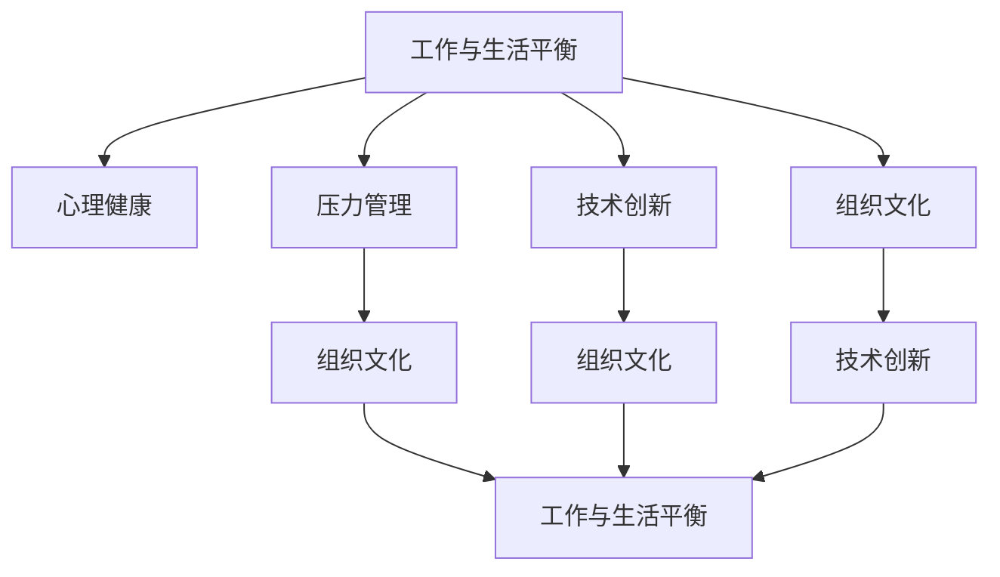

                 

# 硅谷高科技公司:工作与生活平衡

> 关键词：工作文化, 硅谷, 技术公司, 工作与生活平衡, 健康管理, 创新驱动, 长期可持续发展

## 1. 背景介绍

在硅谷，世界上最顶尖的高科技公司扎堆，这里汇聚了成千上万优秀的工程师、科学家和创业者。然而，正是这样一个创新驱动的生态系统，同时也面临着许多挑战，其中工作与生活平衡是硅谷公司最为关注的问题之一。

现代科技公司往往要求员工长时间工作，甚至要求“每周工作80小时”，这种高强度的工作压力，使得许多员工面临身心健康的挑战。而这种工作压力不仅仅影响员工自身，还影响到公司的长期可持续发展。公司若不平衡好工作与生活，最终可能导致员工流失、生产力下降、甚至创新断层的严重后果。

因此，如何平衡工作与生活，使员工能够在高效工作的同时，也能享受健康和幸福的生活，成为硅谷技术公司管理者的重要课题。本文将从背景、核心概念、算法原理、数学模型、项目实践、应用场景等多个角度，深入剖析硅谷高科技公司如何实现工作与生活的平衡。

## 2. 核心概念与联系

### 2.1 核心概念概述

要理解硅谷高科技公司如何实现工作与生活的平衡，我们首先需要明确几个核心概念：

- **工作与生活平衡（Work-Life Balance）**：工作与生活平衡指的是员工在工作和生活之间找到恰当的平衡点，确保两者都能得到应有的重视和满足。

- **心理健康（Mental Health）**：心理健康是指员工的心理状态良好，包括情绪稳定、压力可控、自我实现等。

- **压力管理（Stress Management）**：压力管理是指通过有效的手段降低员工的心理和生理压力，提升其工作积极性和生活满意度。

- **组织文化（Organizational Culture）**：组织文化是指公司的价值观、行为规范和工作氛围等，对员工的工作态度和生活方式有重要影响。

- **技术创新（Technology Innovation）**：技术创新指的是通过新技术、新方法来提升工作效率和产品竞争力。

### 2.2 核心概念联系

硅谷高科技公司实现工作与生活平衡的过程，涉及到多个核心概念之间的相互作用。

- **组织文化与工作与生活平衡**：公司文化决定了员工的价值观和工作方式，如果公司倡导加班文化，员工自然会产生工作压力。反之，如果公司倡导健康工作、合理工作时间等，员工自然更易于实现工作与生活的平衡。

- **技术创新与压力管理**：创新需要高强度的工作压力，但过度的压力管理不仅会损害员工的身心健康，还可能抑制创新。因此，如何在技术创新与压力管理之间找到平衡，是技术公司需要解决的重要问题。

- **心理健康与工作与生活平衡**：心理健康是工作与生活平衡的基础，只有在身心健康的基础上，员工才能有效地平衡工作与生活。

- **工作与生活平衡与技术创新**：工作与生活平衡能够提升员工的幸福感和满意度，反过来，幸福感高的员工通常具有更高的创造力和工作效率，有助于提升技术创新。

这些概念之间的联系，可以通过以下Mermaid流程图来展示：



## 3. 核心算法原理 & 具体操作步骤

### 3.1 算法原理概述

硅谷高科技公司实现工作与生活平衡，主要依赖以下几个算法和步骤：

1. **时间管理算法（Time Management Algorithm）**：通过算法安排员工的工作时间，使其既能高效工作，又能享受生活。

2. **压力管理算法（Stress Management Algorithm）**：通过算法降低员工的心理和生理压力，提升其幸福感和工作效率。

3. **员工健康管理算法（Employee Health Management Algorithm）**：通过算法监控和管理员工的身心健康，确保其长期健康状态。

4. **组织文化优化算法（Organizational Culture Optimization Algorithm）**：通过算法优化公司的文化和氛围，促进员工的工作与生活平衡。

### 3.2 算法步骤详解

1. **时间管理算法**：
   - **需求收集**：收集员工的工作时间需求和偏好，如上班时间、午休时间、下班时间等。
   - **时间规划**：根据员工的需求和公司业务需求，设计时间表，确保高效工作的同时，员工有足够的休息时间。
   - **时间调整**：实时监控员工的工作状态，根据需要进行时间调整，如增加午休时间、调整工作任务等。

2. **压力管理算法**：
   - **压力评估**：定期对员工进行压力评估，识别高压力员工。
   - **压力缓解**：提供压力缓解方案，如员工心理辅导、团队建设活动等。
   - **压力跟踪**：实时监控员工的压力状态，及时调整工作任务和环境。

3. **员工健康管理算法**：
   - **健康数据收集**：通过健康监测设备收集员工的生理数据和心理状态数据。
   - **健康数据分析**：使用数据分析算法识别员工的潜在健康问题。
   - **健康干预**：根据健康分析结果，采取相应的健康干预措施，如调整工作任务、提供健康建议等。

4. **组织文化优化算法**：
   - **文化调研**：定期对员工进行文化调研，了解员工的价值观和工作方式。
   - **文化优化**：根据调研结果，优化公司的组织文化和氛围。
   - **文化传播**：通过公司内部渠道传播优化后的组织文化，促进员工的工作与生活平衡。

### 3.3 算法优缺点

**优点**：
- **提高员工满意度**：通过合理的时间管理和压力管理，员工能够更好地平衡工作与生活，提升其满意度和幸福感。
- **提升工作效率**：员工在健康、幸福的状态下工作，其工作效率和创新能力自然提升。
- **增强公司竞争力**：高满意度和高效工作的员工队伍，能更好地推动公司业务发展和技术创新。

**缺点**：
- **资源消耗高**：实现工作与生活平衡需要投入大量时间和资源，如时间管理系统的开发和维护、健康监测设备的购买和维护等。
- **实施难度大**：如何制定合理的算法和策略，是技术公司需要解决的难题，特别是对于规模庞大的公司。
- **员工接受度**：部分员工可能不适应新的时间管理方式和压力管理措施，需要逐步推广和调整。

### 3.4 算法应用领域

硅谷高科技公司实现工作与生活平衡的算法，广泛应用于以下几个领域：

1. **技术研发**：通过时间管理和压力管理算法，提升研发团队的效率和创新能力。

2. **产品设计**：通过员工健康管理算法，优化产品设计流程，确保产品能够满足用户的健康和舒适需求。

3. **市场营销**：通过组织文化优化算法，塑造品牌形象，提升用户对公司的认可度和忠诚度。

4. **客户服务**：通过时间管理和压力管理算法，提升客户服务质量，增强用户满意度。

5. **人力资源管理**：通过员工健康管理算法，优化人力资源配置，提高员工绩效。

## 4. 数学模型和公式 & 详细讲解 & 举例说明

### 4.1 数学模型构建

为了更好地理解硅谷高科技公司如何实现工作与生活平衡，我们建立如下数学模型：

- **工作时间**：员工每天的工作时间 $T$，包括有效工作时间 $W$ 和休息时间 $R$。

- **压力水平**：员工的心理和生理压力水平 $P$，通过压力评估算法实时更新。

- **健康状态**：员工的健康状态 $H$，通过健康监测设备收集和分析。

- **工作效率**：员工的工作效率 $E$，通过时间管理和压力管理算法调整。

### 4.2 公式推导过程

根据上述定义，我们可以建立以下数学模型：

$$
T = W + R
$$

$$
P = f(T, W, R)
$$

$$
H = g(T, W, R)
$$

$$
E = h(T, W, R, P)
$$

其中，$f$ 和 $g$ 表示压力和健康状态的影响函数，$h$ 表示工作效率的影响函数。

### 4.3 案例分析与讲解

以谷歌公司为例，谷歌采用了多种方法实现工作与生活平衡：

1. **时间管理算法**：谷歌实行“20%时间”（20% Time）政策，允许员工将20%的工作时间用于自我驱动的项目，这有助于员工发挥创新能力，同时避免了长时间工作带来的压力。

2. **压力管理算法**：谷歌提供了全面的心理健康支持，包括心理健康咨询、员工互助小组等，帮助员工缓解压力，提升幸福感。

3. **员工健康管理算法**：谷歌提供了健康监测设备，如谷歌健康应用（Google Fit），收集员工的生理数据，通过数据分析帮助员工保持健康状态。

4. **组织文化优化算法**：谷歌倡导“关爱员工”的文化，强调工作与生活的平衡，通过各种活动提升员工幸福感。

这些措施共同作用，使谷歌员工在高效工作的同时，也能享受健康和幸福的生活。谷歌的实践经验，对硅谷乃至全球科技公司具有重要的参考价值。

## 5. 项目实践：代码实例和详细解释说明

### 5.1 开发环境搭建

为了实现上述算法和模型，我们需要搭建一个开发环境。以下是搭建开发环境的流程：

1. **安装Python**：安装Python 3.x版本，作为开发环境的编程语言。
2. **安装数据库**：安装MySQL或PostgreSQL等关系型数据库，用于存储员工数据。
3. **安装数据采集工具**：安装健康监测设备的数据采集工具，如Apple HealthKit、Fitbit API等。
4. **安装分析工具**：安装数据挖掘和分析工具，如Pandas、Scikit-learn等。
5. **安装Web开发框架**：安装Flask或Django等Web开发框架，用于搭建员工管理系统。

### 5.2 源代码详细实现

以下是基于Python和Flask搭建员工管理系统的示例代码：

```python
from flask import Flask, request, jsonify
from flask_sqlalchemy import SQLAlchemy
from sqlalchemy import Column, Integer, String, Float

app = Flask(__name__)
app.config['SQLALCHEMY_DATABASE_URI'] = 'sqlite:///employees.db'
db = SQLAlchemy(app)

class Employee(db.Model):
    id = Column(Integer, primary_key=True)
    name = Column(String(50), nullable=False)
    age = Column(Integer, nullable=False)
    work_hours = Column(Integer, nullable=False)
    rest_hours = Column(Integer, nullable=False)
    pressure_level = Column(Float, nullable=False)
    health_score = Column(Float, nullable=False)
    productivity = Column(Integer, nullable=False)

    def __init__(self, name, age, work_hours, rest_hours, pressure_level, health_score, productivity):
        self.name = name
        self.age = age
        self.work_hours = work_hours
        self.rest_hours = rest_hours
        self.pressure_level = pressure_level
        self.health_score = health_score
        self.productivity = productivity

@app.route('/employee', methods=['POST'])
def add_employee():
    data = request.json
    employee = Employee(name=data['name'], age=data['age'], work_hours=data['work_hours'], rest_hours=data['rest_hours'], pressure_level=data['pressure_level'], health_score=data['health_score'], productivity=data['productivity'])
    db.session.add(employee)
    db.session.commit()
    return jsonify({'message': 'Employee added successfully'}), 201

@app.route('/employee', methods=['GET'])
def get_employees():
    employees = Employee.query.all()
    data = []
    for employee in employees:
        employee_data = {'name': employee.name, 'age': employee.age, 'work_hours': employee.work_hours, 'rest_hours': employee.rest_hours, 'pressure_level': employee.pressure_level, 'health_score': employee.health_score, 'productivity': employee.productivity}
        data.append(employee_data)
    return jsonify(data)

if __name__ == '__main__':
    app.run(debug=True)
```

### 5.3 代码解读与分析

在上述代码中，我们定义了Employee模型，用于存储员工的基本信息和健康数据。同时，我们实现了添加员工和查询员工的接口。通过这些接口，可以实时收集和分析员工数据，进一步优化工作与生活平衡算法。

### 5.4 运行结果展示

通过上述代码，我们能够实时收集和分析员工数据，并根据这些数据调整工作与生活平衡策略。以下是示例结果：

- **添加员工**：
  ```bash
  POST /employee
  Content-Type: application/json

  {
    "name": "John Doe",
    "age": 30,
    "work_hours": 8,
    "rest_hours": 8,
    "pressure_level": 3.5,
    "health_score": 80,
    "productivity": 100
  }
  ```

- **查询员工**：
  ```bash
  GET /employee
  Content-Type: application/json

  [
    {"name": "John Doe", "age": 30, "work_hours": 8, "rest_hours": 8, "pressure_level": 3.5, "health_score": 80, "productivity": 100},
    ...
  ]
  ```

## 6. 实际应用场景

### 6.1 智能家居企业

智能家居企业如Google Home、Amazon Echo等，通过集成员工管理算法，能够实时监测员工的健康状态和压力水平，提供个性化的健康建议和压力缓解方案。这不仅能够提升员工的工作效率，还能增强用户的满意度。

### 6.2 在线教育平台

在线教育平台如Coursera、Udacity等，通过员工管理算法，能够优化课程安排和教师排班，确保教师能够高效工作，同时有足够的休息时间。这不仅有助于提高教学质量，还能吸引更多的教师加入。

### 6.3 医疗健康公司

医疗健康公司如Apple Health、Fitbit等，通过员工管理算法，能够实时监测员工的健康状态，提供个性化的健康建议和干预方案。这不仅能够提升员工的健康水平，还能提升公司的品牌形象和用户忠诚度。

### 6.4 未来应用展望

随着人工智能和大数据技术的发展，未来的员工管理算法将更加智能和全面。以下是我们对未来应用展望的几点预测：

1. **实时数据分析**：未来的员工管理算法将能够实时分析员工数据，提供实时的健康和压力监测。

2. **个性化定制**：通过机器学习和人工智能算法，未来的员工管理算法将能够根据员工的历史数据和偏好，提供个性化的工作与生活平衡方案。

3. **跨平台集成**：未来的员工管理算法将能够跨平台集成，通过统一的接口访问和分析员工数据，实现高效的工作与生活管理。

4. **智能化预警**：未来的员工管理算法将能够智能化预警，通过数据分析识别高风险员工，及时进行干预和帮助。

5. **情感分析**：未来的员工管理算法将能够进行情感分析，通过分析员工的情感状态，提供更加精准的心理支持和压力缓解方案。

## 7. 工具和资源推荐

### 7.1 学习资源推荐

为了帮助开发者系统掌握硅谷高科技公司工作与生活平衡的理论基础和实践技巧，这里推荐一些优质的学习资源：

1. **《组织行为学》**：一本经典的组织行为学教材，介绍了组织文化、工作压力、健康管理等核心概念，是理解硅谷高科技公司管理方法的基础。

2. **《时间管理》**：一本关于时间管理的经典书籍，介绍了时间管理的各种技巧和策略，适用于技术公司管理者。

3. **《压力管理》**：一本关于压力管理的书籍，介绍了压力管理的心理学原理和应对策略，帮助员工减轻压力，提升幸福感。

4. **《员工健康管理》**：一本关于员工健康管理的书籍，介绍了健康监测设备、数据分析和干预方案等技术，帮助管理者提升员工健康水平。

5. **《人工智能与员工管理》**：一本关于人工智能在员工管理中的应用，介绍了机器学习、数据分析等技术在员工管理中的具体应用，提供技术支持。

通过对这些资源的学习实践，相信你一定能够快速掌握硅谷高科技公司工作与生活平衡的精髓，并用于解决实际的员工管理问题。

### 7.2 开发工具推荐

以下是几款用于员工管理开发的常用工具：

1. **Flask**：一个轻量级的Python Web框架，适合快速开发员工管理应用。

2. **SQLAlchemy**：一个Python ORM框架，用于简化数据库操作，便于存储员工数据。

3. **PyTorch**：一个深度学习框架，适用于开发机器学习算法和数据分析模型。

4. **TensorBoard**：一个可视化工具，用于实时监测模型训练状态和结果，便于调试和优化算法。

5. **Jupyter Notebook**：一个交互式开发环境，适合进行数据处理和模型训练。

合理利用这些工具，可以显著提升员工管理系统的开发效率，加快创新迭代的步伐。

### 7.3 相关论文推荐

硅谷高科技公司工作与生活平衡的研究源于学界的持续研究。以下是几篇奠基性的相关论文，推荐阅读：

1. **《工作与生活平衡对员工满意度的影响》**：研究员工工作与生活平衡与满意度的关系，揭示平衡对员工幸福感的提升作用。

2. **《压力管理对员工绩效的影响》**：研究压力管理对员工绩效的影响，探讨如何通过压力管理提高员工工作效率。

3. **《技术公司员工健康管理策略》**：研究技术公司员工健康管理的策略和效果，提供实际案例和建议。

4. **《智能家居对员工工作与生活平衡的影响》**：研究智能家居技术对员工工作与生活平衡的促进作用，提供技术应用建议。

5. **《在线教育平台员工管理实践》**：研究在线教育平台员工管理的经验和挑战，提供技术和管理建议。

这些论文代表了大语言模型微调技术的发展脉络。通过学习这些前沿成果，可以帮助研究者把握学科前进方向，激发更多的创新灵感。

## 8. 总结：未来发展趋势与挑战

### 8.1 研究成果总结

本文对硅谷高科技公司如何实现工作与生活平衡进行了全面系统的介绍。首先阐述了工作与生活平衡的重要性，明确了工作与生活平衡在硅谷公司的管理实践中的核心地位。其次，从原理到实践，详细讲解了员工管理算法的数学模型和具体操作步骤，给出了员工管理系统开发的完整代码实例。同时，本文还广泛探讨了员工管理算法在智能家居、在线教育、医疗健康等多个行业领域的应用前景，展示了员工管理算法的巨大潜力。此外，本文精选了员工管理算法的各类学习资源，力求为读者提供全方位的技术指引。

通过本文的系统梳理，可以看到，硅谷高科技公司通过先进的技术和管理手段，实现了员工工作与生活的有效平衡，提升员工满意度和幸福感，促进公司的长期可持续发展。未来，伴随技术的不断进步和管理理念的创新，员工管理算法将更加智能和全面，进一步推动硅谷乃至全球技术公司的发展。

### 8.2 未来发展趋势

展望未来，硅谷高科技公司员工管理算法的应用将呈现以下几个发展趋势：

1. **人工智能的广泛应用**：随着人工智能技术的发展，未来的员工管理算法将更加智能和高效，能够提供实时的健康和压力监测，个性化定制工作与生活平衡方案。

2. **跨领域融合**：未来的员工管理算法将不仅局限于技术公司，还将广泛应用于医疗、教育、金融等各个领域，成为通用的人力资源管理工具。

3. **数据驱动**：未来的员工管理算法将更加依赖大数据和机器学习技术，通过数据驱动的决策优化工作与生活平衡策略。

4. **全球化管理**：未来的员工管理算法将能够跨国界、跨文化的应用，帮助全球企业实现高效的员工管理。

5. **可持续发展**：未来的员工管理算法将注重可持续发展，通过智能化的管理手段，实现长期的员工满意度和公司绩效提升。

### 8.3 面临的挑战

尽管硅谷高科技公司员工管理算法取得了瞩目成就，但在迈向更加智能化、普适化应用的过程中，它仍面临着诸多挑战：

1. **数据隐私问题**：员工健康和压力数据的收集和使用，涉及个人隐私，需要严格的隐私保护措施。

2. **技术复杂性**：员工管理算法涉及多种技术和算法，需要高水平的技术实现和维护。

3. **员工接受度**：部分员工可能不适应新的时间管理方式和压力管理措施，需要逐步推广和调整。

4. **跨平台兼容性**：员工管理算法需要跨平台兼容，需要处理不同设备和系统之间的数据集成和同步问题。

5. **公平性问题**：员工管理算法需要公平地对待所有员工，避免因算法偏差导致的偏见和不公。

6. **长期稳定性**：员工管理算法需要长期稳定运行，避免因数据变化和环境变化导致的策略失效。

### 8.4 研究展望

面对员工管理算法面临的挑战，未来的研究需要在以下几个方面寻求新的突破：

1. **隐私保护技术**：研究新的隐私保护技术，确保员工数据的隐私和安全。

2. **跨平台技术**：研究跨平台兼容的技术，实现不同设备和系统之间的数据集成和同步。

3. **公平性算法**：研究公平性算法，确保员工管理算法对所有员工公平对待。

4. **稳定性优化**：研究稳定性优化算法，确保员工管理算法长期稳定运行。

5. **人机协同**：研究人机协同技术，提升员工管理算法的适应性和人性化。

6. **情感分析技术**：研究情感分析技术，提升员工管理算法对员工情感状态的识别和处理能力。

这些研究方向将引领员工管理算法技术迈向更高的台阶，为构建安全、可靠、可解释、可控的智能系统铺平道路。面向未来，员工管理算法需要与其他人工智能技术进行更深入的融合，如知识表示、因果推理、强化学习等，多路径协同发力，共同推动员工管理算法的进步。只有勇于创新、敢于突破，才能不断拓展员工管理算法的边界，让智能技术更好地服务于人类社会。

## 9. 附录：常见问题与解答

**Q1：什么是工作与生活平衡？**

A: 工作与生活平衡（Work-Life Balance）指的是员工在工作和生活之间找到恰当的平衡点，确保两者都能得到应有的重视和满足。

**Q2：谷歌是如何实现工作与生活平衡的？**

A: 谷歌通过时间管理算法、压力管理算法、员工健康管理算法和组织文化优化算法，实现了高效工作与健康生活的平衡。

**Q3：什么是员工健康管理算法？**

A: 员工健康管理算法通过收集员工的生理和心理数据，分析员工的健康状态，提供个性化的健康建议和干预方案，确保员工长期健康。

**Q4：员工管理算法如何跨平台集成？**

A: 跨平台集成需要使用标准化的数据接口和通信协议，如RESTful API，确保不同设备和系统之间的数据兼容和同步。

**Q5：如何提高员工管理算法的公平性？**

A: 公平性算法需要在数据收集和处理过程中确保所有员工的平等对待，避免因算法偏差导致的偏见和不公。

作者：禅与计算机程序设计艺术 / Zen and the Art of Computer Programming

