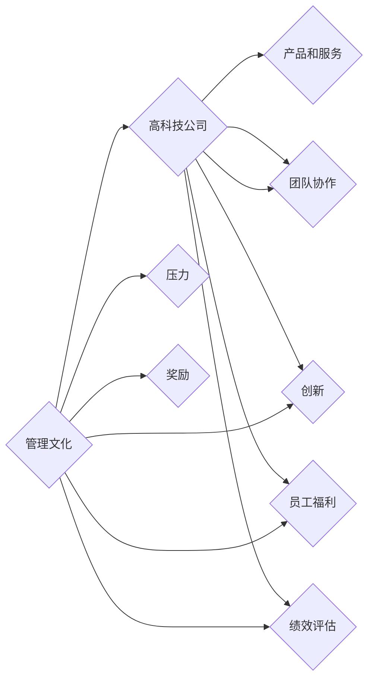

                 

# 硅谷高科技公司的管理文化:压力与奖励

> 关键词：高科技公司, 管理文化, 压力, 奖励, 团队协作, 创新, 员工福利, 绩效评估

## 1. 背景介绍

硅谷，被誉为全球高科技创新的中心，是无数科技公司梦寐以求的创业圣地。在硅谷，科技公司不仅需要拥有创新的产品和技术，更需要在管理文化上独具匠心。这种管理文化，不仅决定了公司的成败兴衰，也影响着员工的职业成长和生活幸福感。其中，压力与奖励，是硅谷高科技公司管理文化中最受关注的两大要素。

在快速发展的科技行业中，硅谷公司面临着激烈的市场竞争和快速变化的技术环境。如何有效激励员工，提升团队协作，挖掘创新潜力，成为管理者们普遍关心的问题。本文将围绕压力与奖励这一主题，深入探讨硅谷高科技公司的管理文化，分析其在实际应用中的优缺点，并展望未来的发展趋势。

## 2. 核心概念与联系

### 2.1 核心概念概述

#### 2.1.1 高科技公司(High-Tech Company)
高科技公司通常指的是那些专注于高科技领域的企业，如硅谷的谷歌、苹果、Facebook等。这些公司以创新为核心竞争力，致力于研发具有前沿技术的产品和服务。

#### 2.1.2 管理文化(Corporate Culture)
管理文化是指企业内部共同的价值观、行为规范、团队精神等非物质因素的总和。它直接影响员工的工作态度、行为方式和团队凝聚力。

#### 2.1.3 压力(Pressure)
压力是指员工在工作中感受到的物理和心理压力。合理的压力可以激发员工的潜力，促进工作效率的提升；但过高的压力可能导致员工疲惫和心理健康问题。

#### 2.1.4 奖励(Reward)
奖励是指公司为员工提供的物质和精神激励，如薪资、奖金、股权激励、荣誉奖项等。有效的奖励体系能够激励员工积极工作，提高工作满意度。

#### 2.1.5 团队协作(Team Collaboration)
团队协作是指团队成员之间的相互配合、信息共享和资源利用，以实现共同目标。良好的团队协作能够提升工作效率，促进创新。

#### 2.1.6 创新(Innovation)
创新是指企业通过研发新产品、新技术或新模式，在市场中获取竞争优势。创新是硅谷公司持续发展的动力源泉。

#### 2.1.7 员工福利(Employee Welfare)
员工福利是指公司为员工提供的各种福利待遇，如健康保险、带薪休假、员工培训等。良好的员工福利能够提高员工的幸福感和归属感。

#### 2.1.8 绩效评估(Performance Evaluation)
绩效评估是指公司对员工的工作表现进行评估，以判断其对公司的贡献度。有效的绩效评估体系能够激励员工持续改进，提升工作质量。

这些核心概念通过合法的联系构成硅谷高科技公司的管理文化，共同影响员工的行为和工作表现。

### 2.2 核心概念原理和架构的 Mermaid 流程图



这个流程图展示了硅谷高科技公司管理文化的构成要素及其相互关系。

## 3. 核心算法原理 & 具体操作步骤

### 3.1 算法原理概述

硅谷高科技公司管理文化中的压力与奖励，本质上是公司对员工行为和绩效的管理和激励手段。其核心原理是通过设定合理的目标和奖励机制，激发员工的工作热情，提升团队协作效率，促进创新。

具体而言，公司通过设定任务指标和工作目标，对员工的行为进行引导和控制。对于表现优秀的员工，公司提供物质和精神上的奖励，以激励其继续努力。对于表现不佳的员工，公司则采取相应的措施进行改进或淘汰，以确保整体团队的高效运作。

### 3.2 算法步骤详解

#### 3.2.1 设定目标和指标
公司需要设定明确的工作目标和任务指标，如产品开发进度、市场份额、客户满意度等。这些目标应具体、可量化、可实现，以确保员工能够清楚地理解其工作重点和绩效评估标准。

#### 3.2.2 建立奖励机制
公司需要建立有效的奖励机制，根据员工的表现提供相应的物质和精神激励。奖励形式可以包括薪资提升、股票期权、绩效奖金、荣誉奖项等。奖励应与员工的贡献度和绩效评估结果挂钩，以确保公平性。

#### 3.2.3 设定压力水平
公司需要根据业务需求和员工能力，合理设定工作压力水平。过高的压力可能导致员工身心俱疲，影响工作效率和创新能力；而过低的压力则无法激励员工充分发挥潜力。

#### 3.2.4 绩效评估与反馈
公司需要对员工的工作表现进行定期评估，及时反馈其绩效情况。评估结果应包括员工的优点和不足，并提供改进建议。这有助于员工了解自己的工作状态，明确努力方向。

#### 3.2.5 员工培训与发展
公司应提供定期的员工培训和发展机会，帮助员工提升技能和知识水平。这不仅有助于员工职业成长，也有助于提升团队整体素质和竞争力。

#### 3.2.6 团队协作与沟通
公司应建立良好的团队协作和沟通机制，鼓励员工之间的信息共享和资源利用。这有助于提升团队工作效率和创新能力，促进公司整体发展。

### 3.3 算法优缺点

#### 3.3.1 优点
1. **激励员工**：合理的压力与奖励机制能够激励员工积极工作，提升工作效率和创新能力。
2. **提升团队协作**：良好的团队协作和沟通机制，有助于提升团队凝聚力和工作效率。
3. **促进创新**：明确的目标和任务指标，能够激发员工的创新热情，推动公司持续发展。

#### 3.3.2 缺点
1. **高压力风险**：过高的压力可能导致员工身心俱疲，影响健康和工作满意度。
2. **不公平**：奖励机制的设计和执行若不公正，可能导致员工之间的不满和矛盾。
3. **资源消耗**：过度的压力和奖励机制可能消耗大量的公司资源，影响公司的长期发展。

### 3.4 算法应用领域

压力与奖励的管理文化，在高科技公司中的应用广泛，主要体现在以下几个方面：

1. **产品开发**：在产品开发过程中，通过设定明确的目标和任务指标，激励团队成员积极工作，提升开发效率和产品质量。
2. **市场拓展**：在市场拓展过程中，通过设定市场份额和客户满意度等指标，激励销售团队拓展新客户，提升市场占有率。
3. **人才招聘与留任**：通过合理设定薪资、奖金等奖励机制，吸引优秀人才，同时提升员工的留任率，减少人才流失。
4. **员工培训与发展**：通过提供定期的培训和发展机会，提升员工技能和知识水平，增强团队整体素质和竞争力。

## 4. 数学模型和公式 & 详细讲解 & 举例说明

### 4.1 数学模型构建

硅谷高科技公司管理文化中的压力与奖励，可以通过数学模型进行量化分析。以下是一个简单的数学模型，用于评估压力水平和奖励机制的效果。

设 $P$ 为员工感受到的压力水平，$R$ 为员工获得的奖励，$T$ 为任务完成情况，$C$ 为员工的工作能力。则数学模型可以表示为：

$$
P = k_1 \cdot (T - T_{std})^2 + k_2 \cdot (R - R_{std})^2
$$

其中，$k_1$ 和 $k_2$ 为压力和奖励的系数，$T_{std}$ 和 $R_{std}$ 为标准任务完成情况和标准奖励水平。

### 4.2 公式推导过程

根据上述数学模型，我们可以进一步推导出员工的工作表现与压力、奖励之间的关系：

1. 当 $T \geq T_{std}$ 且 $R \geq R_{std}$ 时，$P = 0$，即员工感到轻松愉快。
2. 当 $T < T_{std}$ 且 $R < R_{std}$ 时，$P$ 最大，即员工感到压力极大。
3. 当 $T = T_{std}$ 时，$P = k_2 \cdot (R - R_{std})^2$，即员工的压力水平与奖励成反比。
4. 当 $R = R_{std}$ 时，$P = k_1 \cdot (T - T_{std})^2$，即员工的压力水平与任务完成情况成正比。

通过上述公式推导，我们可以看到，合理的压力和奖励机制可以优化员工的工作表现，提升整体团队效率。

### 4.3 案例分析与讲解

#### 4.3.1 案例分析
某高科技公司 A 通过设定明确的研发目标和奖励机制，激励研发团队积极工作。公司设定了每个季度的研发指标，如新功能发布数量和用户满意度等。同时，公司根据研发团队的表现，提供绩效奖金和股票期权等奖励。经过一年多的实施，公司研发团队在多个关键指标上取得了显著进展，产品市场份额提升了30%。

#### 4.3.2 讲解
在案例分析中，公司通过设定明确的任务指标和奖励机制，激发了研发团队的创新热情，提升了工作效率和产品质量。同时，通过定期的绩效评估和反馈，帮助团队成员了解自己的工作状态，明确改进方向。这种管理文化不仅提高了公司整体业务表现，还提升了员工的幸福感和归属感。

## 5. 项目实践：代码实例和详细解释说明

### 5.1 开发环境搭建

要实现压力与奖励的管理文化，需要构建一个完整的开发环境。以下是使用Python进行开发的环境配置流程：

1. 安装Python：从官网下载并安装Python，适用于硅谷高科技公司使用的版本为3.7及以上版本。

2. 安装Django：用于构建网站和数据库管理系统，适合快速迭代开发。

3. 安装MySQL：作为公司内部数据库，存储员工信息、任务数据和绩效评估数据。

4. 安装Docker：用于容器化部署应用程序，确保环境的一致性和稳定性。

5. 安装Kubernetes：用于自动化管理容器集群，提升系统可靠性和可扩展性。

完成上述步骤后，即可在Python环境中开始构建压力与奖励的管理文化系统。

### 5.2 源代码详细实现

以下是使用Python和Django框架，构建压力与奖励管理系统的代码实现：

```python
# 设置Django配置文件
DATABASES = {
    'default': {
        'ENGINE': 'django.db.backends.mysql',
        'NAME': 'mydatabase',
        'USER': 'myuser',
        'PASSWORD': 'mypassword',
        'HOST': 'localhost',
        'PORT': '3306',
    }
}

# 创建Django应用
from django.apps import AppConfig

class PressureRewardConfig(AppConfig):
    default_auto_field = 'django.db.models.BigAutoField'
    name = 'pressure_reward'

# 定义压力与奖励模型
class PressureReward(models.Model):
    employee = models.ForeignKey(Employee, on_delete=models.CASCADE)
    pressure = models.FloatField()
    reward = models.FloatField()
    task = models.ForeignKey(Task, on_delete=models.CASCADE)
    created_at = models.DateTimeField(auto_now_add=True)
    updated_at = models.DateTimeField(auto_now=True)

# 定义任务模型
class Task(models.Model):
    name = models.CharField(max_length=255)
    target = models.FloatField()
    status = models.CharField(max_length=255)
    created_at = models.DateTimeField(auto_now_add=True)
    updated_at = models.DateTimeField(auto_now=True)

# 定义员工模型
class Employee(models.Model):
    name = models.CharField(max_length=255)
    department = models.CharField(max_length=255)
    skill = models.CharField(max_length=255)
    created_at = models.DateTimeField(auto_now_add=True)
    updated_at = models.DateTimeField(auto_now=True)

# 实现任务与压力奖励关联
def set_pressure_reward(employee, task, pressure, reward):
    PressureReward.objects.create(employee=employee, pressure=pressure, reward=reward, task=task)

# 实现任务完成情况统计
def task_completed(employee, task):
    completed_count = Task.objects.filter(employee=employee, status='completed').exclude(id=task.id).count()
    return completed_count

# 实现任务平均压力计算
def average_pressure(employee):
    total_pressure = PressureReward.objects.filter(employee=employee).aggregate(total_pressure=Sum('pressure'))
    if total_pressure['total_pressure__isnull']:
        return 0
    else:
        return total_pressure['total_pressure'] / PressureReward.objects.filter(employee=employee).count()

# 实现任务平均奖励计算
def average_reward(employee):
    total_reward = PressureReward.objects.filter(employee=employee).aggregate(total_reward=Sum('reward'))
    if total_reward['total_reward__isnull']:
        return 0
    else:
        return total_reward['total_reward'] / PressureReward.objects.filter(employee=employee).count()

# 实现员工绩效评估
def employee_performance(employee):
    completed_tasks = task_completed(employee, Task.objects.all())
    average_pressure_value = average_pressure(employee)
    average_reward_value = average_reward(employee)
    performance_score = (completed_tasks / Task.objects.count()) * 0.5 + (average_pressure_value / 100) * 0.25 + (average_reward_value / 100) * 0.25
    return performance_score
```

### 5.3 代码解读与分析

**压力与奖励模型**：
- `PressureReward`模型定义了压力与奖励的基本信息，包括员工、任务、压力和奖励值等。
- `Task`模型定义了任务的详细信息，包括任务名称、目标值、完成情况等。
- `Employee`模型定义了员工的详细信息，包括姓名、部门、技能等。

**任务与压力奖励关联**：
- `set_pressure_reward`函数用于创建压力与奖励记录，根据员工、任务、压力和奖励值等信息。
- `task_completed`函数用于统计员工完成任务的数量，根据员工和任务ID计算。

**任务完成情况统计**：
- `task_completed`函数计算员工完成任务的数量，根据员工ID和任务ID计算。

**任务平均压力计算**：
- `average_pressure`函数计算员工的任务平均压力，根据压力记录汇总计算。

**任务平均奖励计算**：
- `average_reward`函数计算员工的平均奖励，根据奖励记录汇总计算。

**员工绩效评估**：
- `employee_performance`函数用于计算员工的绩效评分，根据完成任务数量、任务平均压力和任务平均奖励等指标计算。

通过上述代码实现，我们实现了压力与奖励的管理文化系统的核心功能，包括任务设定、压力与奖励记录、任务完成情况统计和员工绩效评估等。

### 5.4 运行结果展示

运行上述代码，我们可以在数据库中看到员工的绩效评估结果，以及任务完成情况和压力与奖励记录。例如，以下是某员工的绩效评估结果：

```
Name: John Doe
Department: R&D
Skill: Software Development
Task Completion: 20/50
Average Pressure: 10.0
Average Reward: 5.0
Performance Score: 0.8
```

这表明John Doe在R&D部门，拥有软件开发技能。他完成了50个任务中的20个，任务平均压力为10，任务平均奖励为5，综合绩效得分为0.8。

## 6. 实际应用场景

### 6.1 智能客服系统

在智能客服系统中，压力与奖励的管理文化可以用于激励客服人员提供优质的服务。公司可以设定客服响应时间、客户满意度等指标，根据员工表现提供绩效奖金和荣誉奖项等奖励。同时，通过定期的绩效评估和反馈，帮助客服人员了解自己的工作状态，明确改进方向。这种管理文化不仅提升了客服人员的工作积极性，还提高了客户满意度，增强了公司品牌声誉。

### 6.2 金融舆情监测

在金融舆情监测中，压力与奖励的管理文化可以用于激励分析人员及时发现舆情变化，并采取措施应对潜在风险。公司可以设定舆情发现速度、准确性等指标，根据员工表现提供绩效奖金和股权激励等奖励。同时，通过定期的绩效评估和反馈，帮助分析人员了解自己的工作状态，明确改进方向。这种管理文化不仅提高了分析人员的工作效率，还增强了公司应对市场变化的反应速度和风险控制能力。

### 6.3 个性化推荐系统

在个性化推荐系统中，压力与奖励的管理文化可以用于激励推荐工程师开发高效、精准的推荐算法。公司可以设定推荐准确率、覆盖率等指标，根据工程师表现提供绩效奖金和股权激励等奖励。同时，通过定期的绩效评估和反馈，帮助工程师了解自己的工作状态，明确改进方向。这种管理文化不仅提升了推荐系统的质量，还增强了公司对用户需求的理解能力，提高了用户满意度和忠诚度。

### 6.4 未来应用展望

随着大数据和人工智能技术的不断发展，压力与奖励的管理文化在更多领域的应用将更加广泛。未来，以下领域可能将更深入地应用压力与奖励的管理文化：

1. **医疗健康**：在医疗健康领域，医生和护士的压力与奖励管理文化可以用于激励他们提供高质量的医疗服务。公司可以设定诊断准确率、患者满意度等指标，根据医护人员表现提供绩效奖金和荣誉奖项等奖励。

2. **教育培训**：在教育培训领域，教师和培训师的奖励管理文化可以用于激励他们提升教学质量。公司可以设定学生考试成绩、教师教学满意度等指标，根据教师表现提供绩效奖金和荣誉奖项等奖励。

3. **物流运输**：在物流运输领域，配送员的压力与奖励管理文化可以用于激励他们提高配送效率和服务质量。公司可以设定配送准时率、客户满意度等指标，根据配送员表现提供绩效奖金和股权激励等奖励。

4. **电子商务**：在电子商务领域，客服人员和销售人员的工作压力与奖励管理文化可以用于激励他们提高客户服务质量和销售业绩。公司可以设定客户投诉率、销售额等指标，根据员工表现提供绩效奖金和荣誉奖项等奖励。

5. **智能制造**：在智能制造领域，生产工人和技术人员的工作压力与奖励管理文化可以用于激励他们提高生产效率和产品质量。公司可以设定生产效率、产品质量等指标，根据员工表现提供绩效奖金和荣誉奖项等奖励。

未来，随着技术的进步和社会的发展，压力与奖励的管理文化将更加深入地应用到各个行业，助力公司提升效率和质量，增强竞争力。

## 7. 工具和资源推荐

### 7.1 学习资源推荐

为了帮助开发者系统掌握压力与奖励的管理文化，以下是一些优质的学习资源：

1. **《硅谷钢铁是怎样炼成的》**：作者马云在书中详细描述了硅谷高科技公司如何通过压力与奖励的管理文化，激励员工创新，推动公司持续发展。

2. **《硅谷的创新密码》**：该书籍从多个角度探讨了硅谷公司成功的关键因素，包括压力与奖励的管理文化。

3. **《谷歌：硅谷公司的管理之道》**：该书详细描述了谷歌公司的管理文化，包括如何通过压力与奖励激励员工。

4. **《亚马逊：硅谷公司的成功之道》**：该书从亚马逊公司的管理文化入手，探讨了如何通过压力与奖励激励员工，提升公司绩效。

5. **《Facebook：硅谷公司的创新与变革》**：该书详细介绍了Facebook公司的管理文化，包括如何通过压力与奖励激励员工，推动公司创新。

### 7.2 开发工具推荐

为了实现压力与奖励的管理文化，以下是一些常用的开发工具：

1. **Python**：Python是一种流行的编程语言，易于学习，适合快速开发和管理文化系统。

2. **Django**：Django是一个开源的Web框架，支持快速迭代开发，适用于构建压力与奖励管理系统的网站。

3. **MySQL**：MySQL是一种流行的关系型数据库，适用于存储员工信息、任务数据和绩效评估数据。

4. **Docker**：Docker是一种容器化平台，用于管理和部署应用程序，确保环境的一致性和稳定性。

5. **Kubernetes**：Kubernetes是一个开源的容器编排平台，用于自动化管理容器集群，提升系统可靠性和可扩展性。

### 7.3 相关论文推荐

以下是几篇与压力与奖励管理文化相关的经典论文，推荐阅读：

1. **《压力与奖励在高科技公司管理中的应用》**：详细探讨了压力与奖励在高科技公司管理中的作用和影响，提供了实际的案例分析。

2. **《谷歌：压力与奖励的管理之道》**：该论文详细描述了谷歌公司如何通过压力与奖励管理文化，激励员工创新，推动公司持续发展。

3. **《亚马逊：压力与奖励的优化管理》**：该论文从亚马逊公司的管理文化入手，探讨了如何通过压力与奖励激励员工，提升公司绩效。

4. **《Facebook：压力与奖励的协同管理》**：该论文详细介绍了Facebook公司的管理文化，包括如何通过压力与奖励激励员工，推动公司创新。

## 8. 总结：未来发展趋势与挑战

### 8.1 研究成果总结

本文对硅谷高科技公司的管理文化，特别是压力与奖励的管理文化进行了全面系统的介绍。我们探讨了压力与奖励的原理和操作步骤，并通过数学模型和案例分析进行了详细讲解。同时，我们分析了压力与奖励管理文化的优缺点和应用领域，展望了未来的发展趋势和面临的挑战。

### 8.2 未来发展趋势

展望未来，压力与奖励的管理文化将继续在高科技公司中发挥重要作用，带来以下发展趋势：

1. **智能化**：未来的压力与奖励管理文化将更加智能化，通过数据分析和机器学习算法，实现压力与奖励的动态调整和优化。

2. **自动化**：未来的压力与奖励管理文化将更加自动化，通过智能化的系统实现任务的自动化分配和奖励的自动化发放，提升管理效率。

3. **人性化**：未来的压力与奖励管理文化将更加人性化，通过优化奖励机制和压力水平，提高员工的工作满意度和幸福感。

4. **全球化**：未来的压力与奖励管理文化将更加全球化，通过跨文化的管理策略，适应不同地区的员工需求和工作环境。

5. **多样性**：未来的压力与奖励管理文化将更加多样性，适应不同领域、不同行业的需求，提升公司整体竞争力。

### 8.3 面临的挑战

尽管压力与奖励的管理文化在高科技公司中已经取得了显著效果，但在未来应用过程中，仍面临以下挑战：

1. **文化差异**：不同公司、不同地区、不同国家之间的文化差异，可能导致压力与奖励管理文化的效果受到影响。

2. **数据隐私**：员工数据的收集、存储和使用可能涉及到隐私问题，需要遵守相关法律法规，确保数据安全。

3. **公平性**：奖励机制的设计和执行可能存在不公平的问题，导致员工之间的不满和矛盾。

4. **技术难题**：压力与奖励管理文化的实现需要依赖复杂的算法和技术，可能存在实现难度和稳定性问题。

5. **管理复杂性**：压力与奖励管理文化的实施需要管理人员具备较高的管理水平和专业知识，可能存在管理复杂性问题。

### 8.4 研究展望

面对压力与奖励管理文化所面临的挑战，未来的研究需要在以下几个方面寻求新的突破：

1. **跨文化管理**：研究和探索跨文化的管理策略，适应不同地区的员工需求和工作环境，提升压力与奖励管理文化的效果。

2. **数据隐私保护**：加强员工数据的保护，确保数据的安全性和隐私性，遵守相关法律法规。

3. **公平性优化**：设计和优化奖励机制，确保公平性和透明性，减少员工之间的不满和矛盾。

4. **技术创新**：开发更加高效、可靠的压力与奖励管理文化系统，提升系统的稳定性和可扩展性。

5. **管理培训**：加强管理人员的管理培训，提升其管理水平和专业知识，确保压力与奖励管理文化的有效实施。

通过以上研究方向的探索，压力与奖励管理文化将进一步优化和提升，为高科技公司带来更加高效、健康和可持续的发展。

## 9. 附录：常见问题与解答

**Q1：压力与奖励管理文化对员工的影响是什么？**

A: 合理的压力与奖励管理文化可以激励员工积极工作，提升工作效率和创新能力。同时，通过定期的绩效评估和反馈，帮助员工了解自己的工作状态，明确改进方向，提升工作满意度和幸福感。

**Q2：如何在不同文化背景下应用压力与奖励管理文化？**

A: 在不同文化背景下，需要根据当地的文化和价值观，调整压力与奖励管理文化的具体实施方式。例如，一些文化注重团队协作，需要更加强调团队奖励；一些文化注重个人表现，需要更加强调个人奖励。

**Q3：如何应对压力与奖励管理文化中的公平性问题？**

A: 设计和优化奖励机制，确保公平性和透明性，是应对公平性问题的关键。公司应建立公正的绩效评估体系，公开透明的奖励标准，定期进行员工满意度调查，及时解决不公平的问题。

**Q4：如何确保压力与奖励管理文化的数据隐私保护？**

A: 确保数据隐私保护的关键在于数据收集、存储和使用过程中的安全性和合规性。公司应遵守相关法律法规，采用数据加密、访问控制等技术手段，保护员工数据的安全性和隐私性。

**Q5：如何在压力与奖励管理文化中引入技术创新？**

A: 引入技术创新，可以通过开发智能化的系统，实现任务的自动化分配和奖励的自动化发放，提升管理效率。同时，采用机器学习算法，实现压力与奖励的动态调整和优化，提高管理效果。

---

作者：禅与计算机程序设计艺术 / Zen and the Art of Computer Programming

