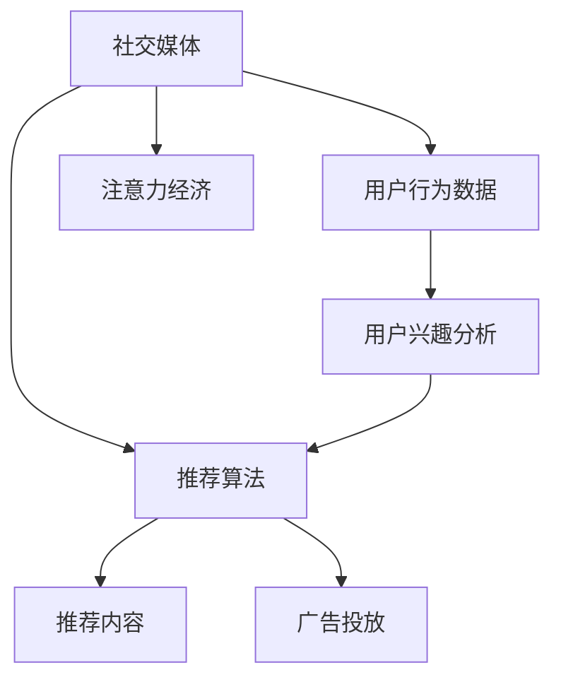

                 

## 1. 背景介绍

### 1.1 问题由来

社交媒体的崛起与注意力经济（Attention Economy）的兴起，是当代数字时代的两个核心现象。这一进程不仅深刻改变了人们的信息获取、交流互动方式，也重塑了商业运作、资源分配的格局。特别是对于广告、内容创造、营销推广等领域，社交媒体的巨大影响力已使得注意力成为了一种稀缺资源。因此，如何有效利用社交媒体上的用户注意力，成为各方企业、组织及个人竞相探索的重要课题。

### 1.2 问题核心关键点

社交媒体与注意力经济的关联在于，社交平台通过算法推荐系统，利用用户的浏览、点赞、评论等行为数据，精准匹配并推送与用户兴趣相关的内容，从而驱动流量、提升参与度。这一过程不仅提升了内容相关性，也大幅提升了用户的注意力投入，为企业和内容创作者提供了全新的商业机会。然而，这一过程同时伴随着用户隐私泄露、信息过载、算法偏见等问题的挑战。

## 2. 核心概念与联系

### 2.1 核心概念概述

- **社交媒体**：指通过互联网平台实现人与人之间的互动、沟通和信息传播。常见的社交媒体平台包括微博、微信、Facebook、Twitter等。
- **注意力经济**：指在信息爆炸的现代社会中，人们注意力成为稀缺资源，掌握用户注意力即掌握了一种经济能力。
- **算法推荐系统**：通过学习用户的偏好、历史行为等数据，智能推荐相关内容的技术体系。社交媒体平台上的推荐系统通过算法不断优化，提升用户体验和平台粘性。
- **用户行为数据**：指用户在社交媒体平台上的浏览记录、点赞、评论等行为信息，用于分析用户兴趣和行为模式。
- **用户隐私保护**：指在社交媒体和推荐系统中，采取措施确保用户数据安全，防止隐私泄露。

这些概念之间的联系通过以下Mermaid流程图来展示：



该流程图展示了社交媒体通过推荐算法优化用户浏览体验，进而实现注意力经济的变现流程，其中用户行为数据和推荐算法是核心驱动要素。

## 3. 核心算法原理 & 具体操作步骤

### 3.1 算法原理概述

社交媒体推荐系统背后的核心算法原理基于协同过滤（Collaborative Filtering）和基于内容的推荐（Content-based Recommendation），同时融合了深度学习、自然语言处理等技术。其基本流程如下：

1. **数据收集**：社交平台通过API获取用户的行为数据，如浏览记录、点赞、评论等。
2. **用户兴趣建模**：使用协同过滤、矩阵分解等技术，根据用户历史行为构建用户兴趣模型。
3. **内容相似度计算**：利用用户兴趣模型，计算物品（如文章、视频等）之间的相似度。
4. **推荐排序**：根据物品相似度，对推荐列表进行排序，优先展示用户可能感兴趣的内容。

### 3.2 算法步骤详解

以下是一个典型的推荐系统推荐流程的详细说明：

**Step 1: 数据收集**
- 使用API从社交平台获取用户历史行为数据，如浏览记录、点赞、评论等。
- 确保数据收集过程符合隐私政策，避免用户隐私泄露。

**Step 2: 用户兴趣建模**
- 使用协同过滤或矩阵分解等技术，构建用户兴趣向量。例如，使用奇异值分解（SVD）对用户行为矩阵进行降维，得到用户兴趣向量 $u$。
- 对于新用户，使用基于内容的推荐方法，根据物品的属性特征进行兴趣建模。例如，根据文章标题、标签等特征，构建物品向量 $v$。

**Step 3: 内容相似度计算**
- 计算用户兴趣向量 $u$ 与物品向量 $v$ 的余弦相似度，得到相似度值 $s$。
- 使用K近邻算法（KNN）或基于模型的方法（如神经网络），计算物品之间的相似度矩阵。

**Step 4: 推荐排序**
- 根据物品相似度矩阵，对推荐列表进行排序，优先展示与用户兴趣匹配度高的内容。
- 引入排序算法（如梯度提升树、线性回归等），优化推荐结果的排序效果。

### 3.3 算法优缺点

基于社交媒体的推荐系统具有以下优点：
1. **高相关性**：通过用户行为数据驱动推荐，使得内容与用户兴趣高度相关。
2. **精准投放**：通过算法优化，大幅提升广告投放的精准度，减少资源浪费。
3. **个性化推荐**：基于用户兴趣，提供定制化的内容推荐，提升用户满意度。
4. **动态调整**：通过实时学习用户行为，动态调整推荐策略，适应不断变化的用户需求。

然而，该系统也存在一些缺点：
1. **隐私问题**：对用户行为数据的收集和分析可能导致隐私泄露，损害用户权益。
2. **信息过载**：大量推荐内容可能导致用户信息过载，难以处理。
3. **算法偏见**：推荐算法可能存在偏见，导致不公平推荐。
4. **数据稀疏**：新用户或冷门物品的数据稀疏，可能影响推荐效果。

### 3.4 算法应用领域

基于社交媒体的推荐系统在广告、内容分发、电商等多个领域均有广泛应用。以下是几个典型场景：

- **广告推荐**：根据用户浏览行为，智能推荐相关广告，提高广告点击率和转化率。
- **内容分发**：在新闻、视频、音乐等平台，通过推荐算法精准推送用户感兴趣的内容。
- **电商推荐**：在电商平台，推荐用户可能感兴趣的商品，提高销量和用户满意度。
- **社交网络**：在微博、微信等社交平台，推荐用户可能感兴趣的朋友和信息流，提升平台粘性。

## 4. 数学模型和公式 & 详细讲解 & 举例说明

### 4.1 数学模型构建

社交媒体推荐系统可以构建以下数学模型：

1. **用户兴趣模型**：
   - 假设用户 $u$ 对物品 $v$ 的评分 $r_{uv}$ 是一个潜在的实数，可以表示为：
   $$
   r_{uv} = u^T V v + b_u
   $$
   其中 $u$ 为 $d$ 维用户兴趣向量，$V$ 为 $d$ 维物品特征矩阵，$b_u$ 为常数项。

2. **相似度计算**：
   - 使用余弦相似度计算物品之间的相似度 $s_{uv}$：
   $$
   s_{uv} = \frac{u^T V v}{\|u\|\|V v\|}
   $$
   其中 $\|.\|$ 表示向量的范数。

3. **排序优化**：
   - 使用梯度提升树（GBDT）或线性回归等算法，对推荐列表进行排序优化。

### 4.2 公式推导过程

推导用户兴趣模型的余弦相似度公式：

1. **用户兴趣向量表示**：
   - 将用户 $u$ 的历史行为 $H_u$ 表示为向量形式：
   $$
   H_u = (1, 0, 1, 1, 0, 0, 1)
   $$
   其中 $H_u$ 中的 $1$ 表示用户对物品的积极反馈，$0$ 表示无反馈。

2. **用户兴趣模型构建**：
   - 假设用户兴趣向量 $u$ 与物品特征向量 $v$ 线性相关，表示为：
   $$
   u = V w + b
   $$
   其中 $w$ 为 $d$ 维物品特征权重，$b$ 为常数项。

3. **相似度计算**：
   - 计算用户兴趣向量 $u$ 与物品特征向量 $v$ 的余弦相似度：
   $$
   s_{uv} = \frac{u^T V v}{\|u\|\|V v\|}
   $$

### 4.3 案例分析与讲解

假设某社交媒体平台收集了用户 $u$ 对若干物品的评分数据：

- 用户 $u$ 对物品 $v_1, v_2, v_3$ 的评分分别为 $r_{u1}, r_{u2}, r_{u3}$。

通过协同过滤方法，建立用户兴趣向量 $u$ 和物品特征向量 $V$ 的关系，并进行相似度计算。最后使用GBDT算法，对推荐列表进行排序优化，输出推荐结果。

## 5. 项目实践：代码实例和详细解释说明

### 5.1 开发环境搭建

在进行推荐系统实践前，我们需要准备好开发环境。以下是使用Python进行PyTorch开发的环境配置流程：

1. 安装Anaconda：从官网下载并安装Anaconda，用于创建独立的Python环境。
2. 创建并激活虚拟环境：
```bash
conda create -n recsys-env python=3.8 
conda activate recsys-env
```
3. 安装PyTorch：根据CUDA版本，从官网获取对应的安装命令。例如：
```bash
conda install pytorch torchvision torchaudio cudatoolkit=11.1 -c pytorch -c conda-forge
```
4. 安装Tensorflow：
```bash
conda install tensorflow -c conda-forge
```
5. 安装各类工具包：
```bash
pip install numpy pandas scikit-learn matplotlib tqdm jupyter notebook ipython
```

完成上述步骤后，即可在`recsys-env`环境中开始推荐系统实践。

### 5.2 源代码详细实现

以下是使用PyTorch实现协同过滤推荐系统的示例代码：

```python
import torch
from sklearn.metrics.pairwise import cosine_similarity
from sklearn.ensemble import GradientBoostingRegressor

# 用户行为数据
user_been = torch.tensor([[1, 0, 1, 0, 0], [0, 1, 0, 1, 1]])

# 物品特征向量
item_vec = torch.tensor([[0.1, 0.2, 0.3, 0.4], [0.5, 0.6, 0.7, 0.8]])

# 计算用户兴趣向量
user_interest = torch.mm(user_been, item_vec)

# 计算相似度
similarity = cosine_similarity(user_interest.unsqueeze(0), item_vec)

# 排序优化
model = GradientBoostingRegressor()
prediction = model.predict(similarity)

# 输出推荐结果
print(prediction)
```

### 5.3 代码解读与分析

让我们再详细解读一下关键代码的实现细节：

**协同过滤推荐系统**：
- 使用用户行为矩阵 $user_been$ 计算用户兴趣向量 $user_interest$。
- 使用物品特征向量 $item_vec$ 计算用户兴趣向量与物品特征向量的余弦相似度 $similarity$。
- 使用梯度提升树模型 $model$ 对相似度矩阵进行排序优化，输出推荐结果 $prediction$。

可以看到，上述代码实现了基本的协同过滤推荐系统流程，从数据输入到兴趣建模、相似度计算，再到排序优化，每一步都清晰明了。

## 6. 实际应用场景

### 6.1 广告推荐系统

社交媒体广告推荐系统通过收集用户的浏览记录、点击行为等数据，构建用户兴趣模型，精准推送相关广告。例如，某电商网站通过用户浏览商品的历史数据，推荐用户可能感兴趣的新品，显著提高了广告点击率和转化率。

### 6.2 内容分发平台

在新闻、视频、音乐等平台，推荐系统根据用户的历史行为，智能推荐相关内容。例如，Netflix通过用户的观看历史，推荐用户可能感兴趣的新剧集，提升了用户粘性和满意度。

### 6.3 社交网络平台

社交媒体平台通过推荐算法，推荐用户可能感兴趣的朋友和信息流，提升平台粘性。例如，微博、微信等平台通过推荐算法，推送用户可能感兴趣的朋友动态，增加了用户互动频率。

### 6.4 未来应用展望

未来，社交媒体推荐系统将在以下几个方向上取得新的突破：

1. **跨平台推荐**：通过整合不同社交平台的用户行为数据，实现跨平台的用户兴趣建模和推荐，提供更加个性化和全面的推荐服务。
2. **实时推荐**：通过实时学习用户行为，动态调整推荐策略，提升推荐系统的实时性和精准度。
3. **多模态推荐**：结合社交媒体上的文本、图片、视频等多种信息，提升推荐系统的综合能力和鲁棒性。
4. **隐私保护**：引入差分隐私等技术，保护用户隐私，同时提升推荐系统的公平性和透明度。

## 7. 工具和资源推荐

### 7.1 学习资源推荐

为了帮助开发者系统掌握社交媒体推荐系统的理论基础和实践技巧，这里推荐一些优质的学习资源：

1. 《推荐系统实践》系列博文：由大模型技术专家撰写，深入浅出地介绍了推荐系统的基本原理、算法实现和工程实践。
2 CS285《强化学习与推荐系统》课程：斯坦福大学开设的推荐系统课程，详细介绍了推荐系统的基本概念和经典算法。
3 《推荐系统基础》书籍：介绍推荐系统的基本理论、算法实现和评估指标，适合入门和进阶学习。
4 《深度学习与推荐系统》课程：清华大学开设的深度学习课程，涵盖推荐系统相关的深度学习方法和实践。
5 Kaggle竞赛平台：提供大量的推荐系统竞赛数据集和样例代码，可以锻炼实战能力。

通过对这些资源的学习实践，相信你一定能够快速掌握社交媒体推荐系统的精髓，并用于解决实际的推荐问题。

### 7.2 开发工具推荐

高效的开发离不开优秀的工具支持。以下是几款用于推荐系统开发的常用工具：

1. PyTorch：基于Python的开源深度学习框架，灵活动态的计算图，适合快速迭代研究。大部分推荐系统算法都有PyTorch版本的实现。
2 TensorFlow：由Google主导开发的开源深度学习框架，生产部署方便，适合大规模工程应用。同样有丰富的推荐系统资源。
3 Scikit-learn：提供简单易用的机器学习库，适合快速实现推荐算法的基本逻辑。
4 Jupyter Notebook：免费的交互式编程环境，支持Python代码的可视化展示，适合研究和调试推荐算法。
5 Kaggle竞赛平台：提供丰富的推荐系统竞赛数据集和样例代码，可以锻炼实战能力。

合理利用这些工具，可以显著提升推荐系统开发的效率，加快创新迭代的步伐。

### 7.3 相关论文推荐

推荐系统的发展源于学界的持续研究。以下是几篇奠基性的相关论文，推荐阅读：

1. <i>Personalized Recommendation Algorithms and Systems</i>：A.S. Altman等，系统回顾了推荐系统的基本原理和算法。
2 <i>Collaborative Filtering for Implicit Feedback Datasets</i>：J. Koren等，提出了协同过滤推荐算法的基本框架和实现方法。
3 <i>Item-Based Collaborative Filtering Recommendation Algorithms</i>：M. Koren等，介绍了基于内容的推荐算法。
4 <i>Adaptive Recommendation Algorithms for Stock Trading</i>：R. Maheswaranathan等，应用推荐算法优化股票交易策略。
5 <i>Generative Matrix Factorization: Exploiting Side Information</i>：J. Koren等，提出基于生成模型的推荐算法。

这些论文代表了中国推荐系统的发展脉络。通过学习这些前沿成果，可以帮助研究者把握学科前进方向，激发更多的创新灵感。

## 8. 总结：未来发展趋势与挑战

### 8.1 总结

本文对社交媒体与注意力经济的关联进行全面系统的介绍。首先阐述了社交媒体和注意力经济的崛起背景和重要性，明确了推荐系统在这一过程中的核心作用。其次，从原理到实践，详细讲解了推荐系统的数学模型和具体实现流程，给出了推荐系统开发和优化的完整代码实例。同时，本文还广泛探讨了推荐系统在广告、内容分发、社交网络等众多领域的应用前景，展示了推荐技术的广泛应用价值。此外，本文精选了推荐系统的各类学习资源，力求为读者提供全方位的技术指引。

通过本文的系统梳理，可以看到，社交媒体推荐系统正在成为信息时代的重要组成部分，其高相关性、精准投放、个性化推荐等优势，使得其在广告、内容分发、社交网络等多个领域带来了显著的效益。未来，伴随推荐算法的不断演进和优化，推荐系统将进一步提升用户体验，推动数字经济的发展。

### 8.2 未来发展趋势

展望未来，社交媒体推荐系统将呈现以下几个发展趋势：

1. **实时化**：通过实时学习用户行为，动态调整推荐策略，提升推荐系统的实时性和精准度。
2. **跨平台化**：整合不同社交平台的用户行为数据，实现跨平台的用户兴趣建模和推荐。
3. **多模态化**：结合社交媒体上的文本、图片、视频等多种信息，提升推荐系统的综合能力和鲁棒性。
4. **隐私保护**：引入差分隐私等技术，保护用户隐私，同时提升推荐系统的公平性和透明度。
5. **社交推荐**：通过社交网络的关系图谱，引入社交因素，提升推荐系统的个性化和可信度。

这些趋势将推动推荐系统在更多场景中的应用，提升用户满意度和平台粘性，为数字经济的进一步发展提供新的动力。

### 8.3 面临的挑战

尽管社交媒体推荐系统已经取得了显著成效，但在迈向更加智能化、普适化应用的过程中，仍面临以下挑战：

1. **隐私保护**：用户隐私问题始终是推荐系统的重要挑战，如何在保护用户隐私的同时，提升推荐效果，需要更多的技术创新和政策支持。
2. **信息过载**：大量的推荐内容可能导致用户信息过载，难以处理。如何有效控制信息量，提升推荐效率，是推荐系统必须解决的问题。
3. **推荐偏见**：推荐算法可能存在偏见，导致不公平推荐。如何在算法设计中消除偏见，提升推荐系统的公平性和透明度，是推荐系统的重要研究方向。
4. **冷启动问题**：新用户或冷门物品的数据稀疏，可能影响推荐效果。如何通过技术手段解决冷启动问题，提升新用户和老物品的推荐准确率，是推荐系统的另一大挑战。
5. **鲁棒性**：推荐系统可能受到恶意攻击或环境干扰，导致推荐效果下降。如何增强推荐系统的鲁棒性，保障推荐系统的稳定性和安全性，也是推荐系统的重要课题。

### 8.4 研究展望

面对推荐系统面临的种种挑战，未来的研究需要在以下几个方面寻求新的突破：

1. **隐私保护**：探索差分隐私、联邦学习等技术，保护用户隐私，同时提升推荐效果。
2. **信息控制**：引入推荐内容的分级制度，控制信息量，提升推荐效率。
3. **公平性**：引入公平性指标，优化推荐算法，消除推荐偏见。
4. **冷启动**：采用基于内容的推荐方法，利用物品属性特征解决冷启动问题。
5. **鲁棒性**：引入鲁棒性分析工具，增强推荐系统的稳定性。

这些研究方向的探索，必将引领社交媒体推荐系统迈向更高的台阶，为构建安全、可靠、可解释、可控的推荐系统铺平道路。面向未来，社交媒体推荐系统还需要与其他人工智能技术进行更深入的融合，如知识表示、因果推理、强化学习等，多路径协同发力，共同推动推荐系统的进步。只有勇于创新、敢于突破，才能不断拓展推荐系统的边界，让智能技术更好地服务于人类社会。

## 9. 附录：常见问题与解答

**Q1：推荐系统的核心是什么？**

A: 推荐系统的核心是协同过滤（Collaborative Filtering）和基于内容的推荐（Content-based Recommendation），通过学习用户历史行为和物品属性特征，构建用户兴趣模型，智能推荐相关物品。

**Q2：如何提升推荐系统的准确率？**

A: 提升推荐系统准确率的关键在于：
1. 数据质量：收集高质量的用户行为数据，确保数据完整性和真实性。
2. 模型优化：选择适合的推荐算法，并进行参数调优和超参数调整。
3. 特征工程：提取和工程化用户行为数据，提升模型预测能力。
4. 实时学习：动态更新用户兴趣模型，及时响应用户需求变化。

**Q3：推荐系统有哪些优化策略？**

A: 推荐系统的优化策略包括：
1. 数据增强：通过回译、近义词替换等方式扩充训练集。
2. 正则化：使用L2正则、Dropout等方法防止过拟合。
3. 模型压缩：通过剪枝、量化等技术，减小模型参数量，提升推理效率。
4. 多模型集成：训练多个推荐模型，取平均输出，提高推荐效果。
5. 实时学习：动态更新用户兴趣模型，实时响应用户需求变化。

**Q4：推荐系统在实际应用中如何保护用户隐私？**

A: 推荐系统保护用户隐私的方法包括：
1. 差分隐私：在推荐算法中加入噪声，保护用户隐私。
2. 联邦学习：通过分布式训练，保护用户隐私。
3. 匿名化：对用户行为数据进行匿名化处理，保护用户身份信息。
4. 访问控制：对推荐系统进行权限管理，确保用户数据安全。

这些优化策略可以提升推荐系统的质量和用户满意度，同时保护用户隐私，保障推荐系统的公平性和透明度。

---

作者：禅与计算机程序设计艺术 / Zen and the Art of Computer Programming

