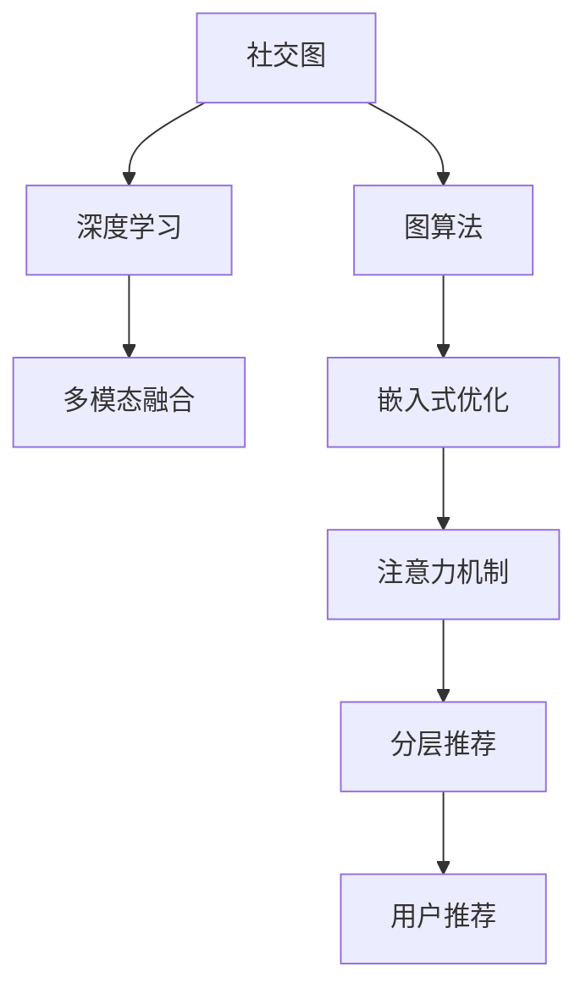

                 

# 社交网络推荐：连接用户

> 关键词：社交网络, 推荐算法, 社交图, 用户推荐, 图算法, 深度学习

## 1. 背景介绍

### 1.1 问题由来

在现代互联网时代，社交网络已成为人们获取信息、互动交流的重要平台。无论是微信、微博、Facebook还是Twitter，社交网络推荐系统都在个性化内容分发、好友关系构建等方面扮演着关键角色。如何构建高效精准的推荐系统，提升用户体验和平台粘性，成为各大社交平台关注的焦点。

传统推荐系统依赖于用户行为数据，如浏览记录、评分反馈、点击行为等。然而，用户行为数据量有限，且难以捕获真实兴趣。社交网络推荐系统可以整合丰富的社交图数据，帮助推荐算法更好地理解用户行为模式，推荐个性化内容。

### 1.2 问题核心关键点

社交网络推荐系统基于用户社交图数据，应用图算法和深度学习模型，实现个性化推荐。核心关键点包括：

- 构建社交图模型：将用户、关系、内容等要素构建成图结构。
- 设计图算法模型：利用图算法，挖掘社交图特征，生成推荐结果。
- 引入深度学习技术：通过深度学习模型，对用户兴趣进行预测和生成。
- 集成多种推荐算法：综合考虑基于内容的推荐、基于协同过滤的推荐、基于图算法的推荐等，构建多模态推荐系统。

## 2. 核心概念与联系

### 2.1 核心概念概述

为更好地理解社交网络推荐系统，本节将介绍几个密切相关的核心概念：

- **社交图**：由节点（user、content、tag）和边（follow、rate、view）构成，表示用户、内容等要素之间的关系网络。
- **推荐算法**：利用图结构、用户行为数据、深度学习模型等，推荐个性化内容的算法。
- **深度学习**：通过多层神经网络，学习用户兴趣和行为模式，实现推荐。
- **多模态融合**：结合不同模态的数据（如文本、图像、社交图等），构建多视角、多维度的推荐系统。
- **嵌入式优化**：将模型参数嵌入图结构中，实现高效的图卷积和分类。
- **注意力机制**：引入注意力机制，提升推荐模型的关注度和效果。
- **分层推荐**：将推荐系统分层设计，先做全局推荐，再做个性化推荐，提升系统效率和效果。

这些核心概念之间的逻辑关系可以通过以下Mermaid流程图来展示：



这个流程图展示了一些关键概念的逻辑关系：

1. 社交图通过图算法挖掘特征，生成推荐结果。
2. 深度学习模型从社交图、用户行为数据中学习用户兴趣和行为模式。
3. 多模态融合综合不同模态的数据，提升推荐系统的表现。
4. 嵌入式优化将模型参数嵌入图结构，提升推荐效率。
5. 注意力机制提升模型关注度，提高推荐效果。
6. 分层推荐先做全局推荐，再做个性化推荐，提升系统效率和效果。

这些概念共同构成了社交网络推荐系统的核心框架，使其能够在各种场景下提供精准推荐。

## 3. 核心算法原理 & 具体操作步骤
### 3.1 算法原理概述

社交网络推荐系统主要分为两个步骤：社交图构建和推荐算法实现。

社交图构建：将用户、内容、标签等要素构建为节点，其间的关注、互动、评分等关系定义为边，构成社交图。通过图算法挖掘社交图特征，生成用户兴趣和行为模式。

推荐算法实现：利用图算法和深度学习模型，对用户兴趣进行预测和生成。常用的推荐算法包括基于内容的推荐、基于协同过滤的推荐、基于图算法的推荐等。通过集成多种推荐算法，构建多模态推荐系统。

### 3.2 算法步骤详解

**Step 1: 构建社交图**
- 收集用户数据：包括用户的基本信息、关注列表、互动记录等。
- 提取内容数据：包括帖子、图片、视频等，提取文本、标签等信息。
- 建立用户-用户关系图：用户之间的关注、互动、评分等关系，构成用户社交图。
- 建立用户-内容关系图：用户与内容的关注、互动、评分等关系，构成用户内容图。
- 建立内容-内容关系图：内容之间的相似度、标签关系等，构成内容图。

**Step 2: 设计图算法**
- 定义图结构：节点为user、content、tag等，边为关注、互动、评分等关系。
- 设计图算法：如PageRank、GCN等，挖掘社交图特征，生成用户兴趣和行为模式。
- 特征嵌入：将社交图特征嵌入向量空间，用于后续的深度学习模型。

**Step 3: 实现深度学习模型**
- 定义深度学习模型：如GCN、RNN等，通过多层神经网络，学习用户兴趣和行为模式。
- 设计损失函数：如交叉熵损失、均方误差损失等，衡量推荐结果与用户真实行为之间的差异。
- 训练模型：使用社交图数据和用户行为数据，最小化损失函数，优化模型参数。

**Step 4: 集成推荐算法**
- 集成多种推荐算法：基于内容的推荐、基于协同过滤的推荐、基于图算法的推荐等。
- 设计推荐规则：结合不同推荐算法的结果，生成最终推荐结果。
- 反馈循环：根据用户反馈，调整推荐算法和模型参数，提升推荐效果。

### 3.3 算法优缺点

社交网络推荐算法具有以下优点：
1. 数据多样性：结合社交图、用户行为数据、深度学习模型等多种数据源，提升推荐效果。
2. 用户兴趣挖掘：通过深度学习模型，挖掘用户隐式行为和兴趣，提升推荐准确性。
3. 高效性：图算法和深度学习模型并行计算，提升推荐系统处理能力。
4. 可解释性：图算法和深度学习模型结合，生成可解释的推荐结果，提升用户信任。

同时，该算法也存在一定的局限性：
1. 数据稀疏性：社交网络中用户行为数据和互动关系数据往往较为稀疏，影响推荐效果。
2. 模型复杂性：社交网络推荐系统涉及图算法和深度学习模型，模型结构复杂，难以解释。
3. 算法多样性：不同推荐算法之间的融合方式较为复杂，需要仔细设计和调试。
4. 鲁棒性不足：社交网络推荐系统对数据缺失、噪声等较为敏感，需要鲁棒性强的算法。
5. 实时性不足：社交网络推荐系统需要实时更新用户行为数据，对实时性要求较高。

尽管存在这些局限性，但就目前而言，社交网络推荐算法仍是大数据时代下推荐系统的主流范式。未来相关研究的重点在于如何进一步提升推荐系统的可解释性、实时性和鲁棒性，同时兼顾推荐效果的多样性和个性化。

### 3.4 算法应用领域

社交网络推荐算法广泛应用于各类社交平台和推荐系统，例如：

- 微博推荐：推荐用户关注、帖子、评论等，提升平台活跃度和用户粘性。
- 微信朋友圈推荐：推荐好友动态、图文消息、商品等，增强用户互动和消费转化。
- 抖音推荐：推荐短视频、用户关注、商品等，提升用户粘性和平台收益。
- Netflix推荐：推荐电影、电视剧、音乐等，提升用户观看体验和平台留存率。

除了这些经典应用外，社交网络推荐算法还在电商、教育、旅游等领域得到广泛应用，为不同行业带来了新的增长点和价值提升。

## 4. 数学模型和公式 & 详细讲解  
### 4.1 数学模型构建

社交网络推荐系统涉及图算法和深度学习模型，因此需要使用图表示法和深度学习模型来构建推荐系统。

定义社交图 $G=(V,E)$，其中 $V$ 为节点集合，$E$ 为边集合。节点 $v_i$ 表示用户、内容等，边 $e_{ij}$ 表示 $v_i$ 与 $v_j$ 之间的关系，如关注、互动、评分等。

社交网络推荐系统通常采用如下深度学习模型进行用户兴趣和行为预测：

- 节点嵌入层：将节点表示为高维向量，用于后续的节点分类或回归任务。
- 图卷积层：通过图卷积操作，聚合节点的邻居信息，更新节点表示。
- 全连接层：将节点表示映射到预测结果，如点击率、评分等。

### 4.2 公式推导过程

以社交网络推荐系统为例，假设用户 $u_i$ 与内容 $c_j$ 之间的关系为 $e_{ij}$，社交图节点表示为 $X$，边表示为 $A$，则深度学习模型的前向传播过程可以表示为：

$$
\begin{aligned}
&H = \text{NodeEmbedding}(X) \\
&\hat{H} = \text{GCN}(H, A) \\
&\hat{Y} = \text{FullConnect}(\hat{H})
\end{aligned}
$$

其中，$\text{NodeEmbedding}$ 为节点嵌入层，将节点 $X$ 映射到高维向量 $H$；$\text{GCN}$ 为图卷积层，根据邻居节点信息更新节点表示；$\text{FullConnect}$ 为全连接层，将节点表示映射到预测结果 $\hat{Y}$。

### 4.3 案例分析与讲解

以Facebook News Feed推荐系统为例，该系统使用了基于协同过滤的推荐算法，通过用户行为数据和社交图数据进行推荐。具体步骤如下：

1. 数据预处理：收集用户行为数据和社交图数据，并进行清洗和特征工程。
2. 用户表示学习：使用社交图数据，学习用户节点表示 $X_u$。
3. 内容表示学习：使用社交图数据和内容图数据，学习内容节点表示 $X_c$。
4. 用户-内容关系预测：利用用户和内容节点表示，预测用户对内容的兴趣，生成推荐结果。

推荐系统不断迭代优化，根据用户反馈调整算法和模型参数，提升推荐效果。

## 5. 项目实践：代码实例和详细解释说明
### 5.1 开发环境搭建

在进行推荐系统开发前，我们需要准备好开发环境。以下是使用Python进行TensorFlow开发的环境配置流程：

1. 安装Anaconda：从官网下载并安装Anaconda，用于创建独立的Python环境。

2. 创建并激活虚拟环境：
```bash
conda create -n recomm-env python=3.8 
conda activate recomm-env
```

3. 安装TensorFlow：根据CUDA版本，从官网获取对应的安装命令。例如：
```bash
conda install tensorflow -c pytorch -c conda-forge
```

4. 安装其他库：
```bash
pip install pandas numpy scikit-learn tensorflow-hub
```

5. 安装GraphSAGE库：用于图卷积操作。
```bash
pip install graphsage
```

完成上述步骤后，即可在`recomm-env`环境中开始推荐系统开发。

### 5.2 源代码详细实现

下面以Facebook News Feed推荐系统为例，给出使用TensorFlow实现社交网络推荐系统的代码实现。

首先，定义社交图和节点嵌入层：

```python
import tensorflow as tf
from graphsage import GraphSAGE

# 定义社交图
graph = GraphSAGE(num_nodes=1000, num_edge_types=5, edge_probs=None)

# 定义节点嵌入层
embedding_size = 64
X = graph.placeholder(tf.float32, shape=[num_nodes, embedding_size])
H = tf.nn.dropout(tf.layers.dense(X, embedding_size, activation=tf.nn.relu), rate=0.5)
```

然后，定义图卷积层和全连接层：

```python
# 定义图卷积层
GCN_layer = graph.gcn(H, num_layers=2, hidden_dim=128)
G = graph.concat(GCN_layer, H)

# 定义全连接层
Y = tf.layers.dense(G, 1, activation=tf.nn.sigmoid)
```

最后，定义推荐系统的前向传播和损失函数：

```python
# 定义损失函数
y_true = graph.placeholder(tf.float32, shape=[num_nodes, 1])
loss = tf.losses.mean_squared_error(y_true, Y)

# 定义优化器
optimizer = tf.train.AdamOptimizer(learning_rate=0.001)
train_op = optimizer.minimize(loss)

# 定义评价指标
accuracy = tf.metrics.mean_squared_error(y_true, Y)
```

完成模型定义后，进行模型训练和评估：

```python
# 加载数据
data = graph.load_data(path='data.csv')

# 定义训练参数
batch_size = 128
num_epochs = 100

# 训练模型
with tf.Session() as sess:
    sess.run(tf.global_variables_initializer())
    for epoch in range(num_epochs):
        for i in range(0, len(data['X']), batch_size):
            X_batch = data['X'][i:i+batch_size]
            y_batch = data['Y'][i:i+batch_size]
            sess.run(train_op, feed_dict={graph.x: X_batch, graph.y: y_batch})
        accuracy_val = sess.run(accuracy, feed_dict={graph.x: data['X'], graph.y: data['Y']})
        print(f'Epoch {epoch+1}, accuracy: {accuracy_val:.4f}')
```

以上代码展示了使用TensorFlow实现社交网络推荐系统的完整流程。可以看到，TensorFlow提供了丰富的图结构操作和深度学习模型构建工具，可以方便地实现基于社交图的推荐系统。

### 5.3 代码解读与分析

让我们再详细解读一下关键代码的实现细节：

**定义社交图**：
- `GraphSAGE` 类定义了社交图的基本结构，包括节点数、边类型数和边概率。
- `placeholder` 定义了输入节点表示 $X$ 和真实标签 $Y$。

**节点嵌入层**：
- 使用 `tf.layers.dense` 层定义了节点嵌入层，将节点表示 $X$ 映射到高维向量 $H$。
- `tf.nn.dropout` 层用于添加dropout，防止过拟合。

**图卷积层**：
- `graph.gcn` 方法定义了图卷积操作，聚合节点的邻居信息，更新节点表示。
- `concat` 方法将更新后的节点表示与原始节点表示拼接，用于后续的全连接层。

**全连接层**：
- 使用 `tf.layers.dense` 层定义了全连接层，将节点表示映射到预测结果 $Y$。
- `tf.nn.sigmoid` 激活函数用于生成二分类结果。

**损失函数**：
- 使用 `tf.losses.mean_squared_error` 计算均方误差损失，衡量推荐结果与用户真实行为之间的差异。

**优化器**：
- `tf.train.AdamOptimizer` 定义了优化器，使用Adam算法更新模型参数。

**评价指标**：
- `tf.metrics.mean_squared_error` 计算均方误差，评估推荐模型的预测效果。

**训练流程**：
- 加载数据集，定义训练参数，进行模型训练。
- 每个epoch内，对每个批次的数据进行前向传播和反向传播，更新模型参数。
- 周期性在验证集上评估模型性能，根据评价指标调整模型参数。

可以看到，TensorFlow提供了丰富高效的图结构和深度学习模型工具，可以方便地实现基于社交图的推荐系统。通过合理设计模型结构和优化策略，可以提升推荐系统的效果和实时性。

## 6. 实际应用场景
### 6.1 推荐广告

社交网络推荐系统广泛应用于推荐广告中。广告平台可以通过用户的行为数据和社交图数据，推荐用户感兴趣的广告，提高广告投放效果和平台收益。

在技术实现上，可以收集用户的浏览、点击、购买等行为数据，并构建用户社交图。通过图算法和深度学习模型，预测用户对广告的兴趣，生成推荐结果。根据用户反馈，不断调整推荐算法和模型参数，提升广告点击率和转化率。

### 6.2 社交网络内容推荐

社交网络推荐系统也广泛应用于内容推荐中。用户可以通过社交网络获取个性化内容，提升用户体验和平台粘性。

在技术实现上，可以收集用户对内容的浏览、点赞、评论等行为数据，并构建用户社交图。通过图算法和深度学习模型，预测用户对内容的兴趣，生成推荐结果。根据用户反馈，不断调整推荐算法和模型参数，提升内容推荐效果。

### 6.3 社交网络好友推荐

社交网络推荐系统可以用于推荐用户关注的新好友，提升平台活跃度和用户粘性。

在技术实现上，可以收集用户的关注、互动数据，构建用户社交图。通过图算法和深度学习模型，预测用户对新好友的兴趣，生成推荐结果。根据用户反馈，不断调整推荐算法和模型参数，提升好友推荐效果。

### 6.4 未来应用展望

随着社交网络推荐系统的不断发展，未来将会在更多领域得到应用，为传统行业带来变革性影响。

在智慧医疗领域，推荐系统可以用于推荐个性化医疗方案，辅助医生诊疗，提升患者治疗效果。

在智能教育领域，推荐系统可以用于推荐个性化学习内容，因材施教，提高教学效果。

在智慧城市治理中，推荐系统可以用于推荐智能交通路线、智能安防等，提升城市管理智能化水平。

此外，在企业生产、金融、旅游等众多领域，基于社交网络的推荐系统也将不断涌现，为各行各业带来新的增长点和价值提升。相信随着技术的日益成熟，社交网络推荐系统必将在构建人机协同的智能时代中扮演越来越重要的角色。

## 7. 工具和资源推荐
### 7.1 学习资源推荐

为了帮助开发者系统掌握社交网络推荐系统的理论基础和实践技巧，这里推荐一些优质的学习资源：

1. 《推荐系统实战》系列博文：由大推荐系统技术专家撰写，深入浅出地介绍了推荐系统的发展历程、算法原理和工程实践。

2. CS229《机器学习》课程：斯坦福大学开设的机器学习经典课程，涵盖推荐系统、深度学习等内容，适合学习推荐系统的理论基础。

3. 《深度学习理论与实践》书籍：全面介绍了深度学习的基本原理和应用实践，包括社交网络推荐系统的相关内容。

4. KDD论文集：机器学习与数据挖掘领域的重要论文集，包含大量推荐系统的最新研究成果。

5. Apache Spark推荐系统：Apache Spark开源的推荐系统框架，提供了丰富的推荐算法和工具。

通过对这些资源的学习实践，相信你一定能够快速掌握社交网络推荐系统的精髓，并用于解决实际的推荐问题。

### 7.2 开发工具推荐

高效的开发离不开优秀的工具支持。以下是几款用于社交网络推荐系统开发的常用工具：

1. TensorFlow：由Google主导开发的开源深度学习框架，生产部署方便，适合大规模工程应用。
2. PyTorch：基于Python的开源深度学习框架，灵活动态的计算图，适合快速迭代研究。
3. Apache Spark：Apache基金会开源的分布式计算框架，支持大规模数据处理和推荐系统构建。
4. Hadoop：Apache基金会开源的大数据处理框架，适合处理海量社交网络数据。
5. Kafka：Apache基金会开源的消息队列系统，支持实时数据流处理和推荐系统。

合理利用这些工具，可以显著提升社交网络推荐系统的开发效率，加快创新迭代的步伐。

### 7.3 相关论文推荐

社交网络推荐系统的研究源于学界的持续研究。以下是几篇奠基性的相关论文，推荐阅读：

1. Node2Vec：提出了一种基于图的随机游走算法，用于学习节点嵌入表示。
2. GraphSAGE：提出了一种基于图卷积的操作，用于学习节点嵌入表示。
3. CNN-based Recommendation Systems：提出了一种基于卷积神经网络的推荐系统，用于处理推荐广告等任务。
4. Attention-based Recommender System：提出了一种基于注意力机制的推荐系统，用于提升推荐效果。
5. Multi-Task Learning for Recommendation System：提出了一种多任务学习的方法，用于优化推荐系统的效果。

这些论文代表了大推荐系统的发展脉络。通过学习这些前沿成果，可以帮助研究者把握学科前进方向，激发更多的创新灵感。

## 8. 总结：未来发展趋势与挑战

### 8.1 总结

本文对社交网络推荐系统进行了全面系统的介绍。首先阐述了社交网络推荐系统的背景和意义，明确了推荐算法在个性化内容分发、好友关系构建等方面扮演的关键角色。其次，从原理到实践，详细讲解了社交网络推荐系统的核心算法和具体操作步骤，给出了推荐系统开发的完整代码实例。同时，本文还广泛探讨了推荐系统在推荐广告、内容推荐、好友推荐等多个场景中的应用前景，展示了推荐算法的巨大潜力。此外，本文精选了推荐系统的各类学习资源，力求为读者提供全方位的技术指引。

通过本文的系统梳理，可以看到，社交网络推荐系统在大数据时代下推荐系统的推荐效果显著提升，能够更好地理解用户行为模式，推荐个性化内容。未来，伴随推荐算法的不断演进和优化，推荐系统必将在更多领域得到应用，为各行各业带来新的增长点和价值提升。

### 8.2 未来发展趋势

展望未来，社交网络推荐系统将呈现以下几个发展趋势：

1. 数据多样性提升：推荐系统将结合社交图、用户行为数据、深度学习模型等多种数据源，提升推荐效果。
2. 实时性增强：推荐系统需要实时更新用户行为数据，对实时性要求更高。
3. 多模态融合加强：推荐系统将融合视觉、语音、社交图等多种模态信息，提升推荐系统的表现。
4. 算法复杂性简化：推荐系统需要兼顾推荐效果和多模态融合的复杂性，简化算法结构，提升系统效率。
5. 鲁棒性增强：推荐系统需要具备更高的鲁棒性，避免因数据缺失、噪声等影响推荐效果。
6. 可解释性增强：推荐系统需要提供可解释的推荐理由，提升用户信任。

以上趋势凸显了社交网络推荐系统的广阔前景。这些方向的探索发展，必将进一步提升推荐系统的个性化程度和推荐效果，为各行各业带来新的增长点和价值提升。

### 8.3 面临的挑战

尽管社交网络推荐系统已经取得了瞩目成就，但在迈向更加智能化、普适化应用的过程中，它仍面临着诸多挑战：

1. 数据稀疏性：社交网络中用户行为数据和互动关系数据往往较为稀疏，影响推荐效果。
2. 模型复杂性：推荐系统涉及社交图和深度学习模型，模型结构复杂，难以解释。
3. 算法多样性：不同推荐算法之间的融合方式较为复杂，需要仔细设计和调试。
4. 鲁棒性不足：推荐系统对数据缺失、噪声等较为敏感，需要鲁棒性强的算法。
5. 实时性不足：推荐系统需要实时更新用户行为数据，对实时性要求较高。

尽管存在这些挑战，但通过不断的技术演进和优化，社交网络推荐系统必将在未来更加智能、高效、普适化地服务用户，成为各行各业的重要工具。

### 8.4 研究展望

面对社交网络推荐系统所面临的种种挑战，未来的研究需要在以下几个方面寻求新的突破：

1. 探索无监督和半监督推荐方法。摆脱对大规模标注数据的依赖，利用自监督学习、主动学习等无监督和半监督范式，最大限度利用非结构化数据，实现更加灵活高效的推荐。
2. 研究参数高效和计算高效的推荐范式。开发更加参数高效的推荐方法，在固定大部分预训练参数的情况下，只更新极少量的任务相关参数。同时优化推荐模型的计算图，减少前向传播和反向传播的资源消耗，实现更加轻量级、实时性的部署。
3. 融合因果和对比学习范式。通过引入因果推断和对比学习思想，增强推荐系统建立稳定因果关系的能力，学习更加普适、鲁棒的用户行为和兴趣。
4. 引入更多先验知识。将符号化的先验知识，如知识图谱、逻辑规则等，与神经网络模型进行巧妙融合，引导推荐过程学习更准确、合理的用户行为和兴趣。
5. 结合因果分析和博弈论工具。将因果分析方法引入推荐系统，识别出推荐过程中的关键特征，增强输出解释的因果性和逻辑性。借助博弈论工具刻画人机交互过程，主动探索并规避推荐系统的脆弱点，提高系统稳定性。

这些研究方向的探索，必将引领社交网络推荐系统技术迈向更高的台阶，为构建智能推荐系统铺平道路。面向未来，社交网络推荐系统还需要与其他人工智能技术进行更深入的融合，如知识表示、因果推理、强化学习等，多路径协同发力，共同推动推荐系统的进步。

## 9. 附录：常见问题与解答

**Q1：社交网络推荐系统是否适用于所有推荐任务？**

A: 社交网络推荐系统适用于需要融合社交图数据和用户行为数据的推荐任务。对于需要更多个性化推荐的任务，如电商推荐、新闻推荐等，社交网络推荐系统通常能够取得更好的效果。但对于一些不需要考虑社交关系的推荐任务，如新闻标题推荐、图片推荐等，社交网络推荐系统的效果可能不如基于内容的推荐系统。

**Q2：推荐算法如何选择？**

A: 推荐算法的选择需要根据具体的推荐任务和数据特征来决定。常用的推荐算法包括基于内容的推荐、基于协同过滤的推荐、基于图算法的推荐等。基于内容的推荐适用于内容相似性较强的推荐任务，如新闻推荐、商品推荐等；基于协同过滤的推荐适用于用户行为数据丰富的推荐任务，如电商推荐、社交推荐等；基于图算法的推荐适用于社交图数据丰富的推荐任务，如好友推荐、关系推荐等。在实际应用中，通常需要综合多种推荐算法，构建多模态推荐系统。

**Q3：如何处理数据稀疏性问题？**

A: 数据稀疏性是社交网络推荐系统面临的主要问题。处理数据稀疏性的方法包括：
1. 数据增强：通过回译、近义替换等方式扩充训练集。
2. 正则化：使用L2正则、Dropout等方法，防止模型过拟合。
3. 模型改进：引入嵌入式优化、注意力机制等，提升模型鲁棒性。
4. 实时更新：实时更新用户行为数据，保持数据的最新性。
5. 多模态融合：融合社交图、行为数据、内容数据等多种信息，提升推荐效果。

这些方法可以结合使用，综合提升推荐系统的鲁棒性和效果。

**Q4：推荐系统如何实时更新数据？**

A: 推荐系统需要实时更新用户行为数据和社交图数据，以便快速响应用户变化和需求。常用的方法包括：
1. 流式数据处理：使用流式数据处理框架，如Apache Kafka，实时处理和存储用户行为数据。
2. 分布式存储：使用分布式存储系统，如Hadoop、Apache Cassandra，存储大规模社交图数据。
3. 流式训练：使用流式训练框架，如TensorFlow Streaming，实时训练推荐模型。
4. 缓存优化：使用缓存技术，如Redis，减少数据读取延迟，提升实时性。

这些方法可以结合使用，综合提升推荐系统的实时性和效率。

**Q5：推荐系统如何提升可解释性？**

A: 推荐系统需要提供可解释的推荐理由，提升用户信任。常用的方法包括：
1. 特征工程：使用可解释的特征，如年龄、性别、兴趣爱好等，提升模型的可解释性。
2. 模型解释：使用模型解释技术，如LIME、SHAP等，解释推荐模型的输出。
3. 透明度：提供透明的推荐规则和流程，让用户了解推荐过程。
4. 用户反馈：收集用户反馈，调整推荐算法和模型参数，提升推荐效果和可解释性。

这些方法可以结合使用，综合提升推荐系统的可解释性和用户信任。

---

作者：禅与计算机程序设计艺术 / Zen and the Art of Computer Programming

