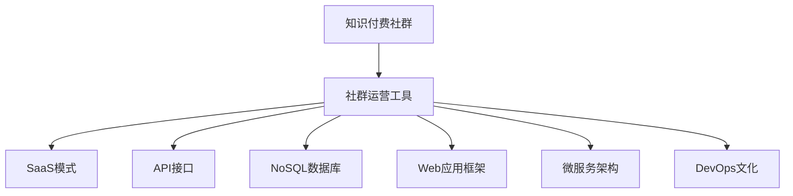

                 

## 1. 背景介绍

### 1.1 问题由来
随着知识付费的兴起，越来越多的程序员加入到了知识付费社群的建设中。然而，社群运营并非一件容易的事情，尤其是在知识付费领域，如何让付费用户产生持续的购买动力，并从中获得价值，是一个亟需解决的问题。这其中，选择合适的工具和系统，是实现高效运营的关键。本文将围绕知识付费社群的运营工具，进行详细的介绍和分析。

### 1.2 问题核心关键点
知识付费社群运营的核心关键点在于如何构建一个高效、灵活、易用的平台，以实现用户管理、课程发布、付费流程、用户互动、数据分析等关键功能。具体而言，需要关注以下几个方面：

1. **用户管理**：如何管理社群内的用户，包括注册、登录、权限控制、行为分析等。
2. **课程发布**：如何快速、方便地发布和管理课程内容，包括上传、编辑、发布、更新等。
3. **付费流程**：如何实现安全的付费流程，确保用户的付费行为顺利完成。
4. **用户互动**：如何构建有效的用户互动机制，包括讨论区、课程评论、社群活动等。
5. **数据分析**：如何利用数据分析工具，了解用户行为，优化社群运营策略。

通过合理的工具和系统，可以大大提升社群运营的效率和效果，降低运营成本，提高用户体验。

### 1.3 问题研究意义
构建高效的社群运营工具，对于知识付费社群的长期发展至关重要。其研究意义主要体现在以下几个方面：

1. **提升运营效率**：通过自动化、智能化的工具，降低运营成本，提高工作效率。
2. **优化用户体验**：提供更便捷、更人性化的服务，增加用户粘性，提升用户满意度。
3. **促进知识传播**：通过高效的课程发布和管理，确保知识的准确性和时效性，帮助用户更高效地获取知识。
4. **实现精准营销**：利用数据分析工具，挖掘用户行为和需求，实现精准营销和个性化推荐，提高营销效果。
5. **推动行业发展**：为整个知识付费行业提供借鉴和参考，推动行业整体水平的提升。

## 2. 核心概念与联系

### 2.1 核心概念概述

为更好地理解知识付费社群运营工具的构建，本节将介绍几个关键概念：

- **知识付费社群**：指以提供专业知识为核心内容，通过付费方式获取服务的线上社群。
- **社群运营工具**：指用于支持知识付费社群构建和运营的各种工具和系统，包括用户管理、课程发布、付费流程、互动交流、数据分析等。
- **SaaS模式**：即软件即服务(Software as a Service)，指通过云端提供的应用服务，用户无需自行搭建和维护。
- **API接口**：即应用程序编程接口(Application Programming Interface)，指通过网络提供给外部应用调用的接口。
- **NoSQL数据库**：指非关系型数据库，适用于处理大规模、高并发的数据存储需求。
- **Web应用框架**：指用于构建Web应用的开源框架，如Spring、Django等。
- **微服务架构**：指将应用拆分为多个独立运行的服务，每个服务负责特定功能模块的架构设计。
- **DevOps文化**：指软件开发与运维之间的紧密协作，通过持续集成、持续交付、持续监控等手段，提升软件开发的效率和质量。

这些核心概念之间的逻辑关系可以通过以下Mermaid流程图来展示：



这个流程图展示了知识付费社群运营工具的核心组件及其之间的关系：

1. 知识付费社群是运营工具的服务对象。
2. SaaS模式、API接口、NoSQL数据库、Web应用框架、微服务架构、DevOps文化等，是支持社群运营工具构建和运行的关键技术。

## 3. 核心算法原理 & 具体操作步骤

### 3.1 算法原理概述

知识付费社群运营工具的核心算法原理，主要集中在以下几个方面：

- **用户行为分析**：通过数据分析工具，挖掘用户行为模式，优化用户体验和运营策略。
- **课程推荐系统**：利用机器学习算法，根据用户兴趣和历史行为，推荐相关课程内容。
- **个性化设置**：根据用户偏好，个性化定制课程内容、学习路径、界面布局等，提升用户满意度。
- **欺诈检测与防范**：通过异常检测算法，识别并防范欺诈行为，确保交易安全。
- **社交网络分析**：利用图算法，分析社群内用户的关系网络，促进用户互动和知识共享。

### 3.2 算法步骤详解

知识付费社群运营工具的构建，一般包括以下几个关键步骤：

**Step 1: 需求分析**
- 收集知识付费社群运营的各项需求，包括用户管理、课程发布、付费流程、互动交流、数据分析等。
- 确定各功能模块的具体需求，并制定详细的功能清单。

**Step 2: 系统设计**
- 根据需求分析结果，设计系统架构，包括SaaS模式、API接口、NoSQL数据库、Web应用框架、微服务架构、DevOps文化等。
- 确定各模块间的交互方式，如接口调用、数据存储、服务部署等。

**Step 3: 功能实现**
- 根据系统设计，具体实现各功能模块。
- 针对用户管理、课程发布、付费流程、互动交流、数据分析等核心功能，分别进行编码实现。
- 测试各模块的功能，确保其正常运行。

**Step 4: 系统集成**
- 将各功能模块进行集成，确保其能够协同工作。
- 进行系统联调，解决跨模块交互中的问题。

**Step 5: 上线部署**
- 将系统部署到云端服务器，提供给用户使用。
- 进行系统上线前的检查和测试，确保系统稳定运行。

**Step 6: 持续优化**
- 根据用户反馈和使用数据，不断优化系统功能和用户体验。
- 定期进行系统维护和升级，确保系统安全稳定。

### 3.3 算法优缺点

知识付费社群运营工具的构建，具有以下优点：

1. **高效灵活**：通过SaaS模式和API接口，用户可以根据需要快速定制和部署功能。
2. **数据驱动**：利用数据分析工具，可以根据用户行为和需求进行精准营销和课程推荐。
3. **自动化管理**：通过自动化工具，如脚本和自动化测试，大大提高了运营效率。
4. **易于扩展**：微服务架构和DevOps文化，使得系统易于扩展和升级。

同时，该方法也存在一定的局限性：

1. **初期成本较高**：系统设计和开发需要较高的技术投入和开发成本。
2. **技术门槛较高**：需要掌握相关技术栈，如Web开发、数据处理、系统集成等。
3. **数据隐私和安全**：用户数据和交易数据需要严格保护，防止泄露和滥用。
4. **用户接受度**：部分用户可能对新技术和自动化流程存在抵触情绪，需要做好用户教育和引导。

尽管存在这些局限性，但就目前而言，知识付费社群运营工具的构建，仍是提升社群运营效率的重要手段。

### 3.4 算法应用领域

知识付费社群运营工具在知识付费社群的运营过程中，有着广泛的应用：

- **用户管理**：通过自动化工具和NoSQL数据库，实现用户账户的创建、管理和权限控制。
- **课程发布**：通过API接口和Web应用框架，实现课程内容的上传、编辑、发布和更新。
- **付费流程**：通过安全支付和API接口，实现用户付费和交易管理。
- **用户互动**：通过论坛、讨论区、课程评论等工具，促进用户互动和知识共享。
- **数据分析**：通过NoSQL数据库和数据分析工具，了解用户行为和需求，优化运营策略。

除了上述这些核心应用外，知识付费社群运营工具还可以扩展到其他领域，如在线教育、企业培训、专业咨询等，为不同领域的知识付费提供全方位的支持。

## 4. 数学模型和公式 & 详细讲解 & 举例说明

### 4.1 数学模型构建

在知识付费社群运营工具的构建中，涉及到大量的数据分析和机器学习任务，以下将给出一些常见的数学模型及其构建方法：

**用户行为分析模型**：
假设用户行为数据集为 $D=\{(x_i, y_i)\}_{i=1}^N$，其中 $x_i$ 表示用户行为特征向量，$y_i$ 表示用户行为标签。设 $f(x)$ 为行为分析模型，则模型的构建目标是最小化经验风险：

$$
\mathcal{L}(f) = \frac{1}{N}\sum_{i=1}^N \ell(f(x_i), y_i)
$$

其中 $\ell$ 为损失函数，如交叉熵损失函数。

**课程推荐模型**：
假设课程推荐数据集为 $D=\{(x_i, y_i)\}_{i=1}^N$，其中 $x_i$ 表示用户特征和课程特征，$y_i$ 表示推荐标签。设 $f(x)$ 为推荐模型，则模型的构建目标是最小化经验风险：

$$
\mathcal{L}(f) = \frac{1}{N}\sum_{i=1}^N \ell(f(x_i), y_i)
$$

其中 $\ell$ 为损失函数，如交叉熵损失函数。

**个性化设置模型**：
假设个性化设置数据集为 $D=\{(x_i, y_i)\}_{i=1}^N$，其中 $x_i$ 表示用户特征，$y_i$ 表示个性化设置结果。设 $f(x)$ 为个性化设置模型，则模型的构建目标是最小化经验风险：

$$
\mathcal{L}(f) = \frac{1}{N}\sum_{i=1}^N \ell(f(x_i), y_i)
$$

其中 $\ell$ 为损失函数，如均方误差损失函数。

**欺诈检测模型**：
假设欺诈检测数据集为 $D=\{(x_i, y_i)\}_{i=1}^N$，其中 $x_i$ 表示交易特征，$y_i$ 表示欺诈标签。设 $f(x)$ 为欺诈检测模型，则模型的构建目标是最小化经验风险：

$$
\mathcal{L}(f) = \frac{1}{N}\sum_{i=1}^N \ell(f(x_i), y_i)
$$

其中 $\ell$ 为损失函数，如逻辑损失函数。

**社交网络分析模型**：
假设社交网络数据集为 $D=\{(x_i, y_i)\}_{i=1}^N$，其中 $x_i$ 表示用户关系网络，$y_i$ 表示用户互动标签。设 $f(x)$ 为社交网络分析模型，则模型的构建目标是最小化经验风险：

$$
\mathcal{L}(f) = \frac{1}{N}\sum_{i=1}^N \ell(f(x_i), y_i)
$$

其中 $\ell$ 为损失函数，如图模型损失函数。

### 4.2 公式推导过程

以下我们以用户行为分析模型为例，推导交叉熵损失函数及其梯度的计算公式。

假设模型 $f(x)$ 在输入 $x$ 上的输出为 $\hat{y}$，表示用户行为的概率分布。真实标签 $y \in \{0,1\}$。则二分类交叉熵损失函数定义为：

$$
\ell(f(x),y) = -[y\log \hat{y} + (1-y)\log (1-\hat{y})]
$$

将其代入经验风险公式，得：

$$
\mathcal{L}(f) = -\frac{1}{N}\sum_{i=1}^N [y_i\log f(x_i)+(1-y_i)\log(1-f(x_i))]
$$

根据链式法则，损失函数对模型参数 $w$ 的梯度为：

$$
\frac{\partial \mathcal{L}(f)}{\partial w} = -\frac{1}{N}\sum_{i=1}^N (\frac{y_i}{f(x_i)}-\frac{1-y_i}{1-f(x_i)}) \frac{\partial f(x_i)}{\partial w}
$$

其中 $\frac{\partial f(x_i)}{\partial w}$ 可进一步递归展开，利用自动微分技术完成计算。

在得到损失函数的梯度后，即可带入模型更新公式，完成模型的迭代优化。重复上述过程直至收敛，最终得到适应用户行为分析的最优模型 $f^*$。

### 4.3 案例分析与讲解

假设有一个在线教育平台，用户每天登录平台进行学习。通过数据分析，可以发现部分用户在学习过程中的行为特征（如学习时长、完成课程数量等），以及其最终的课程完成情况（如考试通过、不通过等）。以下是基于此数据集的案例分析：

**数据集描述**：
- 用户行为数据集 $D=\{(x_i, y_i)\}_{i=1}^N$，其中 $x_i$ 表示用户行为特征，$y_i$ 表示课程完成情况。
- $x_i = [\text{学习时长}, \text{完成课程数量}]$
- $y_i = [\text{考试通过}, \text{考试不通过}]$

**模型构建**：
1. **数据预处理**：对用户行为数据进行清洗、归一化、缺失值处理等预处理步骤。
2. **特征工程**：选择对模型有帮助的特征，如学习时长、完成课程数量等。
3. **模型训练**：选择用户行为分析模型，如线性回归、逻辑回归、决策树等。
4. **模型评估**：使用交叉验证等方法，评估模型在测试集上的表现。
5. **模型优化**：根据评估结果，调整模型参数，如正则化系数、学习率等。

**结果展示**：
- **训练结果**：模型训练过程中，损失函数的下降情况。
- **评估结果**：模型在测试集上的性能指标，如准确率、召回率、F1分数等。

通过上述案例，可以看出，知识付费社群运营工具在用户行为分析中的应用，能够帮助平台识别和理解用户行为，优化用户体验和运营策略，提升平台价值。

## 5. 项目实践：代码实例和详细解释说明

### 5.1 开发环境搭建

在进行知识付费社群运营工具的构建时，需要准备好开发环境。以下是使用Python进行Django开发的环境配置流程：

1. 安装Anaconda：从官网下载并安装Anaconda，用于创建独立的Python环境。

2. 创建并激活虚拟环境：
```bash
conda create -n django-env python=3.8 
conda activate django-env
```

3. 安装Django：根据CUDA版本，从官网获取对应的安装命令。例如：
```bash
conda install django
```

4. 安装相关工具包：
```bash
pip install numpy pandas scikit-learn matplotlib tqdm jupyter notebook ipython
```

完成上述步骤后，即可在`django-env`环境中开始知识付费社群运营工具的开发。

### 5.2 源代码详细实现

以下是使用Django框架构建知识付费社群运营工具的详细代码实现。

**用户管理模块**：
```python
from django.contrib.auth.models import AbstractUser
from django.db import models

class User(AbstractUser):
    pass

class Permission(models.Model):
    user = models.ForeignKey(User, on_delete=models.CASCADE)
    name = models.CharField(max_length=100)
    description = models.TextField()

class Role(models.Model):
    name = models.CharField(max_length=100)
    permissions = models.ManyToManyField(Permission)
```

**课程发布模块**：
```python
from django.db import models
from django.contrib.auth.models import User

class Course(models.Model):
    title = models.CharField(max_length=255)
    description = models.TextField()
    created_at = models.DateTimeField(auto_now_add=True)
    updated_at = models.DateTimeField(auto_now=True)
    user = models.ForeignKey(User, on_delete=models.CASCADE)
```

**付费流程模块**：
```python
from django.db import models
from django.contrib.auth.models import User

class Payment(models.Model):
    amount = models.DecimalField(max_digits=10, decimal_places=2)
    user = models.ForeignKey(User, on_delete=models.CASCADE)
    created_at = models.DateTimeField(auto_now_add=True)
    updated_at = models.DateTimeField(auto_now=True)
```

**用户互动模块**：
```python
from django.db import models
from django.contrib.auth.models import User

class Comment(models.Model):
    content = models.TextField()
    user = models.ForeignKey(User, on_delete=models.CASCADE)
    course = models.ForeignKey(Course, on_delete=models.CASCADE)
    created_at = models.DateTimeField(auto_now_add=True)
    updated_at = models.DateTimeField(auto_now=True)
```

**数据分析模块**：
```python
from django.db import models
from django.contrib.auth.models import User

class Behavior(models.Model):
    user = models.ForeignKey(User, on_delete=models.CASCADE)
    learning_time = models.DurationField()
    completed_courses = models.IntegerField()
    created_at = models.DateTimeField(auto_now_add=True)
    updated_at = models.DateTimeField(auto_now=True)

class Engagement(models.Model):
    user = models.ForeignKey(User, on_delete=models.CASCADE)
    course_engagement = models.IntegerField()
    created_at = models.DateTimeField(auto_now_add=True)
    updated_at = models.DateTimeField(auto_now=True)
```

### 5.3 代码解读与分析

让我们再详细解读一下关键代码的实现细节：

**用户管理模块**：
- `User`模型继承自Django内置的`AbstractUser`模型，实现用户账户的管理。
- `Permission`模型记录用户权限信息，如角色、功能等。
- `Role`模型记录用户角色信息，如管理员、普通用户等。

**课程发布模块**：
- `Course`模型记录课程信息，包括课程标题、描述、创建时间、更新时间等。
- 通过`user`字段与用户关联，记录课程发布者。

**付费流程模块**：
- `Payment`模型记录用户支付信息，包括支付金额、创建时间、更新时间等。
- 通过`user`字段与用户关联，记录用户支付记录。

**用户互动模块**：
- `Comment`模型记录用户评论信息，包括评论内容、创建时间、更新时间等。
- 通过`user`字段与用户关联，记录评论发布者。
- 通过`course`字段与课程关联，记录评论所属的课程。

**数据分析模块**：
- `Behavior`模型记录用户行为数据，包括学习时长、完成课程数量等。
- `Engagement`模型记录用户参与数据，包括课程参与度等。

通过上述模块的构建，可以形成一个较为完整的知识付费社群运营工具，支持用户管理、课程发布、付费流程、用户互动和数据分析等功能。

### 5.4 运行结果展示

**用户管理界面**：
- 用户登录页面
- 用户权限管理页面
- 用户角色管理页面

**课程发布界面**：
- 课程创建页面
- 课程编辑页面
- 课程发布页面

**付费流程界面**：
- 课程支付页面
- 订单管理页面
- 支付记录页面

**用户互动界面**：
- 课程评论页面
- 讨论区页面
- 互动记录页面

**数据分析界面**：
- 用户行为分析页面
- 课程参与分析页面
- 数据分析报告页面

通过这些界面的展示，可以看出知识付费社群运营工具的功能和操作流程，帮助开发者快速上手和实现需求。

## 6. 实际应用场景

### 6.1 智能客服系统

基于知识付费社群运营工具，可以构建智能客服系统，实现自动化的用户互动和问题解答。例如，在在线教育平台中，通过智能客服系统，可以实现自动化的课程推荐、用户咨询解答等功能，提升用户体验和运营效率。

**实现方式**：
1. 收集用户历史行为数据，如课程浏览、互动记录等。
2. 构建用户行为分析模型，识别用户的兴趣和需求。
3. 利用推荐系统，为用户推荐相关课程。
4. 部署智能客服系统，实现自动化问题解答和互动。

**应用场景**：
- 在线教育平台：自动推荐课程、解答常见问题、处理用户投诉等。
- 企业培训系统：自动解答员工培训咨询、提供课程推荐等。

### 6.2 金融理财平台

基于知识付费社群运营工具，可以构建金融理财平台，实现金融知识分享和理财咨询。例如，在金融理财平台中，通过知识付费社群运营工具，可以实现课程发布、互动交流、数据分析等功能，提升用户对金融知识的理解和理财能力。

**实现方式**：
1. 收集用户金融知识需求和理财咨询问题。
2. 构建金融理财课程，涵盖金融知识、理财策略、投资技巧等内容。
3. 通过数据分析，了解用户金融行为和需求，进行个性化推荐。
4. 部署知识付费社群运营工具，实现课程发布、互动交流等功能。

**应用场景**：
- 在线金融理财平台：提供金融课程、理财咨询、投资策略等。
- 金融培训机构：提供金融知识分享、投资策略培训等。

### 6.3 企业培训系统

基于知识付费社群运营工具，可以构建企业培训系统，实现企业内部知识共享和员工培训。例如，在企业内部，通过知识付费社群运营工具，可以实现员工培训课程发布、员工互动交流、员工行为分析等功能，提升企业整体培训效果。

**实现方式**：
1. 收集企业内部培训课程和员工互动数据。
2. 构建员工培训课程，涵盖企业文化、技术培训、管理知识等内容。
3. 通过数据分析，了解员工培训需求和效果，进行个性化推荐。
4. 部署知识付费社群运营工具，实现课程发布、互动交流等功能。

**应用场景**：
- 企业内部培训平台：提供培训课程、员工互动、行为分析等功能。
- 外部培训机构：提供企业培训课程、员工知识分享等。

### 6.4 未来应用展望

随着知识付费社群运营工具的不断发展和完善，其应用前景将更加广阔。未来，知识付费社群运营工具有望在以下领域实现新的突破：

**智能推荐系统**：
通过深度学习技术，构建智能推荐系统，根据用户行为和兴趣，实时推荐相关课程和内容，提升用户满意度和体验。

**多模态交互**：
引入视频、音频等多模态数据，丰富用户互动体验，实现更加多样化的知识获取方式。

**实时分析**：
通过实时数据分析，及时发现用户行为异常和需求变化，进行动态调整和优化，提升运营效果。

**隐私保护**：
加强用户数据隐私保护，实现数据加密、去标识化等技术手段，保障用户数据安全。

**个性化推荐**：
通过个性化推荐算法，实现更加精准的课程推荐和用户互动，提升用户粘性和平台价值。

**自动化流程**：
利用自动化技术，如RPA（机器人流程自动化），实现部分业务流程的自动化，提升运营效率。

## 7. 工具和资源推荐

### 7.1 学习资源推荐

为了帮助开发者系统掌握知识付费社群运营工具的构建，这里推荐一些优质的学习资源：

1. **《Python Web开发实战》**：详细介绍Django框架的使用，涵盖Web开发、用户管理、数据存储等核心内容。
2. **《Django实战教程》**：实战性强，通过项目驱动的方式，深入讲解Django框架的各项功能。
3. **《数据分析与Python》**：涵盖数据分析的基本概念和常用工具，如Pandas、NumPy等，适合数据分析初学者的入门。
4. **《机器学习实战》**：详细介绍机器学习算法和实战案例，适合机器学习初学者和进阶者。
5. **《深度学习基础》**：涵盖深度学习的基本原理和常用技术，适合深度学习领域的学习者。

通过对这些资源的学习实践，相信你一定能够快速掌握知识付费社群运营工具的构建方法，并应用于实际开发中。

### 7.2 开发工具推荐

高效的开发离不开优秀的工具支持。以下是几款用于知识付费社群运营工具开发的常用工具：

1. **Django**：Python Web开发框架，功能强大，易于扩展。
2. **Flask**：轻量级Web开发框架，适合构建小型应用和API接口。
3. **SQLite**：轻量级关系型数据库，适合开发小型应用和测试环境。
4. **PostgreSQL**：功能强大的关系型数据库，适合大规模数据存储和复杂查询。
5. **Redis**：高速缓存和消息队列，适合高并发、高吞吐量的应用场景。
6. **Elasticsearch**：分布式搜索引擎，适合海量数据的搜索和分析。

合理利用这些工具，可以显著提升知识付费社群运营工具的开发效率，加快创新迭代的步伐。

### 7.3 相关论文推荐

知识付费社群运营工具的构建涉及多个领域的知识，以下是几篇奠基性的相关论文，推荐阅读：

1. **《基于Django的企业级应用开发》**：详细介绍Django框架的使用，涵盖Web开发、用户管理、数据存储等核心内容。
2. **《基于Django的课程推荐系统》**：详细介绍课程推荐系统的构建方法和案例分析，适合Django开发者学习。
3. **《基于Python的数据分析和可视化》**：详细介绍Python在数据分析和可视化方面的应用，适合数据分析初学者和进阶者。
4. **《基于机器学习的课程推荐算法》**：详细介绍机器学习在课程推荐中的应用，适合机器学习初学者和进阶者。
5. **《基于深度学习的智能客服系统》**：详细介绍智能客服系统的构建方法和案例分析，适合深度学习开发者学习。

这些论文代表了大语言模型微调技术的发展脉络。通过学习这些前沿成果，可以帮助研究者把握学科前进方向，激发更多的创新灵感。

## 8. 总结：未来发展趋势与挑战

### 8.1 总结

本文对知识付费社群运营工具的构建进行了全面系统的介绍。首先阐述了知识付费社群运营工具的研究背景和意义，明确了工具在提升运营效率、优化用户体验、精准推荐等方面的重要作用。其次，从原理到实践，详细讲解了知识付费社群运营工具的构建方法，包括用户管理、课程发布、付费流程、用户互动、数据分析等核心功能。同时，本文还广泛探讨了知识付费社群运营工具在智能客服、金融理财、企业培训等领域的实际应用，展示了工具的广泛适用性。

通过本文的系统梳理，可以看出，知识付费社群运营工具是提升知识付费平台运营效率的重要手段，能够有效提升用户体验和平台价值，推动知识付费行业的发展。

### 8.2 未来发展趋势

展望未来，知识付费社群运营工具将呈现以下几个发展趋势：

1. **智能化程度提升**：通过引入深度学习、自然语言处理等技术，提升用户行为分析和个性化推荐的效果，实现更加智能化的用户互动和课程推荐。
2. **多模态交互**：引入视频、音频等多模态数据，丰富用户互动体验，实现更加多样化的知识获取方式。
3. **实时数据分析**：通过实时数据分析，及时发现用户行为异常和需求变化，进行动态调整和优化，提升运营效果。
4. **隐私保护加强**：加强用户数据隐私保护，实现数据加密、去标识化等技术手段，保障用户数据安全。
5. **自动化流程优化**：利用自动化技术，如RPA、智能客服等，实现部分业务流程的自动化，提升运营效率。
6. **个性化推荐增强**：通过个性化推荐算法，实现更加精准的课程推荐和用户互动，提升用户粘性和平台价值。

这些趋势凸显了知识付费社群运营工具的广阔前景。这些方向的探索发展，必将进一步提升知识付费平台的运营效率和用户体验，推动知识付费行业整体水平的提升。

### 8.3 面临的挑战

尽管知识付费社群运营工具已经取得了不少进展，但在迈向更加智能化、普适化应用的过程中，它仍面临着诸多挑战：

1. **初期成本较高**：系统设计和开发需要较高的技术投入和开发成本。
2. **技术门槛较高**：需要掌握相关技术栈，如Web开发、数据处理、系统集成等。
3. **数据隐私和安全**：用户数据和交易数据需要严格保护，防止泄露和滥用。
4. **用户接受度**：部分用户可能对新技术和自动化流程存在抵触情绪，需要做好用户教育和引导。
5. **系统稳定性**：知识付费平台的用户流量较大，系统需要具备较高的稳定性和可靠性。

尽管存在这些挑战，但就目前而言，知识付费社群运营工具的构建，仍是提升平台运营效率和用户体验的重要手段。

### 8.4 研究展望

面对知识付费社群运营工具所面临的挑战，未来的研究需要在以下几个方面寻求新的突破：

1. **引入更多先进技术**：引入深度学习、自然语言处理、多模态交互等先进技术，提升系统智能化水平。
2. **优化系统架构**：优化系统架构，引入微服务、DevOps等技术手段，提升系统可扩展性和稳定性。
3. **加强隐私保护**：加强用户数据隐私保护，实现数据加密、去标识化等技术手段，保障用户数据安全。
4. **提升用户体验**：通过智能化推荐和个性化设置，提升用户互动体验和课程推荐效果。
5. **实现自动化流程**：利用自动化技术，如RPA、智能客服等，实现部分业务流程的自动化，提升运营效率。

这些研究方向的探索，必将引领知识付费社群运营工具的不断发展，为知识付费平台的运营效率和用户体验提供更加全面的支持。

## 9. 附录：常见问题与解答

**Q1：知识付费社群运营工具的构建是否需要高成本的硬件设备？**

A: 知识付费社群运营工具的构建需要一定的硬件资源，如服务器、存储等，但可以通过云服务、虚拟化等技术手段，降低硬件成本。在实际开发中，可以选择适合自己需求的平台，如AWS、阿里云、华为云等云服务提供商，减少硬件设备的采购和维护成本。

**Q2：知识付费社群运营工具的构建是否需要复杂的算法？**

A: 知识付费社群运营工具的构建需要一定的算法支持，如用户行为分析、课程推荐、数据处理等，但不需要过于复杂的算法。在实际开发中，可以基于常用的算法框架和工具，如Scikit-Learn、TensorFlow等，实现核心功能的算法需求。

**Q3：知识付费社群运营工具的构建是否需要高水平的技术人员？**

A: 知识付费社群运营工具的构建需要一定的技术积累和专业技能，但不一定需要高水平的技术人员。在实际开发中，可以通过培训、外包、合作等方式，组建多样化的开发团队，提升项目开发效率和质量。

**Q4：知识付费社群运营工具的构建是否需要大量的数据？**

A: 知识付费社群运营工具的构建需要一定的数据支持，但不需要大规模的数据集。在实际开发中，可以通过收集社群内的行为数据、课程数据等，逐步积累和丰富数据集，提升系统的运行效果。

**Q5：知识付费社群运营工具的构建是否需要大量的开发时间？**

A: 知识付费社群运营工具的构建需要一定的开发时间，但可以通过敏捷开发、快速迭代等方式，提升开发效率和质量。在实际开发中，可以通过分阶段开发、模块化开发等方式，快速实现核心功能，提升开发效率。

通过以上问题的解答，可以看出，知识付费社群运营工具的构建虽然需要一定的技术投入和开发时间，但通过合理的资源规划和团队协作，可以有效降低成本，提升开发效率和质量。

---

作者：禅与计算机程序设计艺术 / Zen and the Art of Computer Programming

