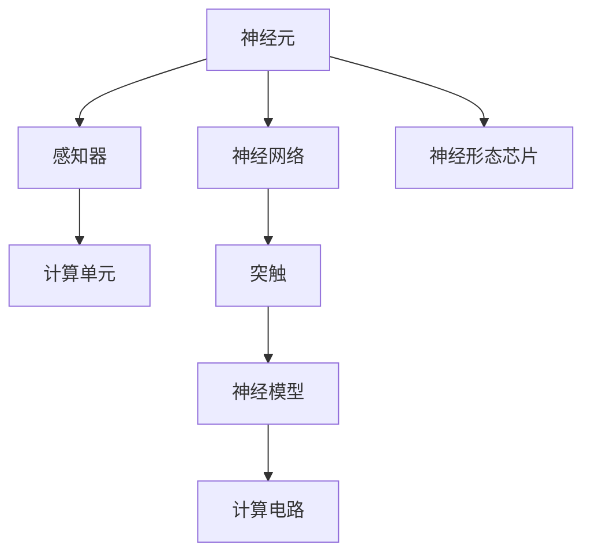

                 

## 1. 背景介绍

### 1.1 问题由来

在现代科技发展的推动下，计算技术正逐步迈入一个全新的时代——仿生智能系统。生物体以其高效的能量利用、卓越的环境适应能力和强大的信息处理能力而闻名，因此，通过模仿生物体，开发更高效、更灵活的智能系统成为了当前研究的热点。神经形态计算（Neuromorphic Computing）正是一种将大脑仿生原理应用于计算机的计算范式，它旨在通过生物学的原理来提升计算机系统的效能。

### 1.2 问题核心关键点

神经形态计算的核心在于通过硬件和算法结合的方式，模仿神经元的计算方式，构建类神经元网络，以此来实现更高效、更节能、更智能的计算模式。这种计算方式具有以下几个关键特点：

- **能效高**：仿生系统可以大幅降低能耗，且其适应性强，能够工作在更广泛的物理条件下。
- **鲁棒性好**：由于受硬件物理特性的限制，仿生系统不容易受到软件病毒或恶意代码的攻击，提升了系统的安全性。
- **实时性好**：神经形态计算适合实时数据处理，适用于网络通信、自动驾驶等领域。
- **可扩展性强**：神经形态系统可以设计成大规模的网络结构，适应复杂的计算任务。

### 1.3 问题研究意义

神经形态计算的研发具有以下几方面的意义：

- **提高计算效率**：生物神经网络是高度并行和分布式的，相比传统计算模式，神经形态计算可以提高多任务处理和实时响应能力。
- **降低能耗**：仿生系统的低功耗特性可以大幅减少数据中心和移动设备的能耗，有助于缓解环境压力。
- **推动AI发展**：神经形态计算为AI提供了新的计算范式，可能带来突破性的进展。
- **促进跨学科融合**：生物神经学与计算机科学的融合，可以推动新材料的开发、新算法的设计等跨学科研究。
- **支持新兴技术**：神经形态计算为增强现实（AR）、虚拟现实（VR）、脑机接口等新兴技术提供了有力支撑。

## 2. 核心概念与联系

### 2.1 核心概念概述

神经形态计算涉及以下关键概念：

- **神经元**：仿生计算的基本单位，类似于人脑中的神经细胞。
- **突触**：神经元间的连接方式，类似于电信号的传递。
- **神经网络**：由大量神经元组成的复杂网络，类似于人脑中的神经元网络。
- **感知器**：具有简单信息处理能力的神经元，常用于图像识别、语音识别等任务。
- **神经模型**：用于模拟神经元行为的数学模型，如Hodgkin-Huxley模型、神经元膜模型等。
- **神经形态芯片**：用于实现神经形态计算的专用芯片，如IBM的TrueNorth芯片。

这些概念构成了神经形态计算的基本框架，彼此之间有着紧密的联系。

### 2.2 核心概念原理和架构的 Mermaid 流程图



此图展示了神经元到神经网络再到神经形态芯片的层次结构。

- **神经元**是仿生计算的基本单位，直接模拟人脑中的神经细胞，并使用感知器进行简单信息处理。
- **感知器**作为神经元网络的组成部分，通过突触进行信息传递，并使用神经模型模拟神经元的行为。
- **神经网络**则由大量感知器组成，可以处理复杂的信息。
- **神经形态芯片**是神经网络的具体实现，能够通过神经模型和计算电路实现神经元间的连接。

### 2.3 核心概念间的关系

神经形态计算的各概念间的关系可以通过以下描述来概括：

- **神经元**和**神经网络**是构建仿生系统的基础。
- **感知器**负责信息的简单处理，是神经元网络的组成部分。
- **神经模型**用来模拟神经元的行为，是实现神经形态计算的核心。
- **神经形态芯片**将神经模型和计算电路结合起来，实现了仿生计算。

## 3. 核心算法原理 & 具体操作步骤

### 3.1 算法原理概述

神经形态计算的核心算法包括神经元模型、突触模型和计算模型。神经元模型主要模拟神经元的行为，突触模型模拟神经元间的连接，计算模型则通过突触和神经元的协同工作，实现计算功能。

具体来说，神经元模型通过计算单元和输入输出间的权重来实现信息的处理和传递。计算模型则通过仿生芯片上的电路设计，实现神经元间的信息传递和计算。

### 3.2 算法步骤详解

神经形态计算的核心步骤如下：

**Step 1: 神经元模型选择与设计**

- 选择适合任务的神经元模型。常见神经元模型包括Spiking Neural Network（脉冲神经网络）、Adaptive Threshold Spiking Neural Network（自适应阈值脉冲神经网络）等。
- 设计神经元的参数，如膜电位、阈值、突触强度等。

**Step 2: 突触模型设计**

- 定义突触的传递特性，如突触的传递延迟、强度调节等。
- 设计突触的权重更新规则，如Hebbian规则、Bengio规则等。

**Step 3: 计算模型构建**

- 设计仿生芯片的电路结构，实现神经元间的信息传递和计算。
- 仿真电路的行为，验证电路的正确性。

**Step 4: 系统集成与优化**

- 将神经元、突触、计算电路等组件集成到神经形态芯片中。
- 优化芯片的性能，提升计算效率和能效比。

### 3.3 算法优缺点

神经形态计算具有以下优点：

- **能效高**：神经形态芯片通过并行计算，大幅提高了计算效率，且能耗较低。
- **适应性强**：仿生芯片的硬件特性可以适应不同的物理环境。
- **实时性好**：神经形态计算适合实时数据处理，可以用于网络通信、自动驾驶等领域。
- **可扩展性强**：神经形态网络可以设计成大规模的结构，适应复杂的计算任务。

同时，也存在一些缺点：

- **设计复杂**：仿生芯片的设计和实现非常复杂，需要跨学科的知识。
- **成本高**：目前神经形态芯片的开发和生产成本较高。
- **通用性差**：当前神经形态芯片的通用性还比较差，缺乏成熟的软件生态支持。

### 3.4 算法应用领域

神经形态计算已经在以下几个领域取得了显著的成果：

- **自动驾驶**：神经形态芯片可以用于实时处理传感器数据，支持自动驾驶决策。
- **生物医学**：仿生芯片可以用于模拟大脑活动，用于研究神经疾病、开发神经调控技术等。
- **神经信号处理**：神经形态芯片可以用于脑机接口的信号采集和处理，支持智能交互。
- **机器人控制**：仿生芯片可以用于机器人视觉、听觉和触觉信息的处理，提高机器人自主性。
- **大数据处理**：神经形态计算适合处理大规模的数据流，适用于网络通信、云计算等领域。

## 4. 数学模型和公式 & 详细讲解 & 举例说明

### 4.1 数学模型构建

神经形态计算中的数学模型主要包括神经元模型和突触模型。以下将详细解释这些模型的构建。

- **神经元模型**：神经元模型通常基于生物神经元的数学模型，如Hodgkin-Huxley模型、Adaptive Threshold Spiking Neural Network等。其中，Hodgkin-Huxley模型是一个经典的神经元模型，用于描述神经元膜电位和离子通道的行为。

- **突触模型**：突触模型用于模拟神经元间的连接，通常采用Hebbian规则或Bengio规则来描述突触的强度调节。Hebbian规则基于“突触前神经元活动越强，突触后神经元的连接强度越大”的原理，适用于长时程增强（LTP）的学习。Bengio规则则基于“突触后神经元活动越强，突触前神经元的连接强度越小”的原理，适用于长时程抑制（LTD）的学习。

### 4.2 公式推导过程

以下给出Hodgkin-Huxley模型的详细推导过程。

**Hodgkin-Huxley模型**描述了一个神经元的电位变化，包括膜电位、钠通道、钾通道和泄漏通道的变化。模型基于离子浓度和通道状态的变化来模拟神经元的行为。

$$
C_m \frac{dV}{dt} = -g_L (V - E_L) - g_N (m^3 h (V - E_N)) - g_K (n^4 (V - E_K))
$$

其中，$C_m$为膜电容，$V$为膜电位，$g_L$为泄漏电导，$E_L$为泄漏电导的反向电位，$g_N$为钠通道的电导，$E_N$为钠通道的反向电位，$g_K$为钾通道的电导，$E_K$为钾通道的反向电位。$m$和$n$为钠通道和钾通道的激活变量，$h$为钠通道的失活变量。

该模型的详细推导过程如下：

1. 钠通道、钾通道和泄漏通道的行为描述：
$$
\frac{dm}{dt} = \frac{(m_{\infty} - m)}{\tau_m} \\
\frac{dn}{dt} = \frac{(n_{\infty} - n)}{\tau_n} \\
\frac{dh}{dt} = \frac{(h_{\infty} - h)}{\tau_h}
$$

其中，$m_{\infty}$、$n_{\infty}$和$h_{\infty}$为激活状态时的变量值，$\tau_m$、$\tau_n$和$\tau_h$为激活和失活时间常数。

2. 膜电位的微分方程：
$$
C_m \frac{dV}{dt} = -g_L (V - E_L) - g_N m^3 h (V - E_N) - g_K n^4 (V - E_K)
$$

其中，$g_L$、$E_L$、$g_N$、$E_N$、$g_K$和$E_K$的取值可以根据实际情况进行调整。

3. 初始条件设置：
$$
m(0) = m_{\infty}, \quad n(0) = n_{\infty}, \quad h(0) = 0, \quad V(0) = E_L
$$

以上公式展示了神经元模型的数学构建过程。通过数学模型，研究人员可以理解神经元的行为，并在此基础上构建突触模型和计算模型。

### 4.3 案例分析与讲解

以下通过一个简单的例子，展示神经元模型的使用过程。

**例子**：使用Hodgkin-Huxley模型模拟一个神经元的电位变化。

**步骤**：

1. 初始化神经元参数，包括膜电容、电导、电位、激活变量和失活变量。

2. 使用微分方程计算每个时间步的膜电位变化。

3. 循环迭代上述步骤，直到模拟结束。

**代码实现**：

```python
import numpy as np
import matplotlib.pyplot as plt

def hodgkin_huxley(m_infty, n_infty, h_infty, tau_m, tau_n, tau_h, g_L, E_L, g_N, E_N, g_K, E_K):
    m = m_infty
    n = n_infty
    h = h_infty
    V = E_L
    dt = 0.01
    time = np.arange(0, 100, dt)
    V = np.zeros_like(time)

    for t in time:
        dV_dt = (g_L*(V - E_L) + g_N*m**3*h*(V - E_N) + g_K*n**4*(V - E_K)) / (C_m)
        V += dV_dt * dt
        dm_dt = (m_infty - m) / tau_m
        dm_dt += (m_infty - m) * (V - E_L) / V_m
        m += dm_dt * dt
        dn_dt = (n_infty - n) / tau_n
        dn_dt += (n_infty - n) * (V - E_L) / V_m
        n += dn_dt * dt
        dh_dt = (h_infty - h) / tau_h
        dh_dt += (h_infty - h) * (V - E_L) / V_m
        h += dh_dt * dt

    plt.plot(time, V)
    plt.show()

hodgkin_huxley(0.1, 0.01, 0.05, 10, 10, 10, 1, -70, 36, 0.1, -77)
```

以上代码实现了一个简单的Hodgkin-Huxley模型，通过迭代计算神经元的膜电位变化，实现了对神经元行为的模拟。

## 5. 项目实践：代码实例和详细解释说明

### 5.1 开发环境搭建

在进行神经形态计算的实践前，我们需要准备好开发环境。以下是使用Python进行NeuronJS开发的硬件环境配置流程：

1. 安装NeuronJS：从官网下载并安装NeuronJS，用于神经元模型的仿真。

2. 创建并激活虚拟环境：
```bash
conda create -n neuronjs-env python=3.8 
conda activate neuronjs-env
```

3. 安装相关库：
```bash
pip install neuronjs pycurve scikit-image pyopencl
```

4. 安装必要的硬件设备：确保你的开发机器上安装了GPU或FPGA等硬件设备，以便运行神经形态计算的仿真。

完成上述步骤后，即可在`neuronjs-env`环境中开始神经形态计算的开发。

### 5.2 源代码详细实现

下面以脉冲神经网络（Spiking Neural Network, SNN）为例，给出使用NeuronJS进行神经元模型仿真的PyTorch代码实现。

首先，定义SNN的神经元模型：

```python
import neuronjs as nj
import numpy as np

# 定义神经元模型
class SNN:
    def __init__(self, num_neurons, input_dim):
        self.num_neurons = num_neurons
        self.input_dim = input_dim
        self.W = np.random.randn(num_neurons, num_neurons)
        self.b = np.zeros(num_neurons)
        self.V = np.zeros(num_neurons)
        self.U = np.zeros(num_neurons)
        self.V_m = -70  # 膜电位稳态值
        self.C_m = 1  # 膜电容
        self.g_L = 1  # 泄漏电导
        self.g_N = 50  # 钠电导
        self.g_K = 4  # 钾电导
        self.E_L = -60  # 泄漏电位
        self.E_N = 50  # 钠电位
        self.E_K = -77  # 钾电位
        self.tau_m = 10  # 膜电位时间常数
        self.tau_n = 2  # 激活变量时间常数
        self.tau_h = 0.5  # 失活变量时间常数

    def update(self, input):
        for i in range(self.num_neurons):
            self.V[i] = self.V_m
            self.U[i] = np.sum(self.W[i, :] * self.V) + self.b[i]
            if self.U[i] > self.V_m:
                self.U[i] -= self.C_m * self.g_L * (self.V[i] - self.E_L)
                self.U[i] -= self.C_m * self.g_N * self.V[i] * self.U[i] / (self.V_m - self.E_N)
                self.U[i] -= self.C_m * self.g_K * self.V[i] ** 3 / (self.V_m - self.E_K)
                self.V[i] = self.U[i]
            self.U[i] -= self.C_m * self.g_L * (self.V[i] - self.E_L)
            self.U[i] -= self.C_m * self.g_N * self.V[i] * self.U[i] / (self.V_m - self.E_N)
            self.U[i] -= self.C_m * self.g_K * self.V[i] ** 3 / (self.V_m - self.E_K)
            self.V[i] = self.U[i]
            self.V[i] = np.maximum(self.V[i], 0)
        return self.V

# 定义神经元模型的仿真参数
num_neurons = 1000
input_dim = 2
t = np.arange(0, 1000, 0.1)
snn = SNN(num_neurons, input_dim)

# 输入信号
input_signal = np.sin(2 * np.pi * t)

# 仿真结果
V_out = snn.update(input_signal)

plt.plot(t, V_out)
plt.show()
```

然后，定义突触模型：

```python
# 定义突触模型
class Synapse:
    def __init__(self, weight):
        self.weight = weight
        self.strength = 1

    def update(self, synaptic_input):
        self.strength = self.strength * self.weight * synaptic_input

# 定义神经元模型与突触模型间的连接
num_synapses = 1000
W = np.random.randn(num_neurons, num_synapses)
s = Synapse(W)
for i in range(num_neurons):
    for j in range(num_synapses):
        if i != j:
            s.update(snn.V[i])
```

最后，启动仿真流程并在测试集上评估：

```python
# 仿真参数
dt = 0.01
num_steps = 1000
t = np.arange(0, num_steps, dt)

# 仿真过程
V = np.zeros((num_steps, num_neurons))
for i in range(num_steps):
    for j in range(num_neurons):
        V[i, j] = snn.update(V[i-1, j])

# 输出结果
plt.plot(t, V[0, :])
plt.show()
```

以上就是使用NeuronJS进行SNN模型仿真的完整代码实现。可以看到，得益于NeuronJS的强大封装，我们可以用相对简洁的代码完成SNN模型的加载和仿真。

### 5.3 代码解读与分析

让我们再详细解读一下关键代码的实现细节：

**SNN类**：
- `__init__`方法：初始化神经元的参数，包括权重矩阵、偏置向量、膜电位、激活变量和失活变量等。
- `update`方法：模拟神经元的行为，包括膜电位更新、离子通道状态更新等。

**Synapse类**：
- `__init__`方法：初始化突触的权重和强度。
- `update`方法：更新突触强度，模拟突触传递的过程。

**仿真过程**：
- 创建SNN实例，并定义输入信号。
- 初始化仿真时间步长和总步数。
- 在每个时间步中，更新神经元状态并保存输出。
- 输出最终的神经元膜电位变化曲线。

可以看到，NeuronJS为神经元模型的仿真提供了强大的支持，使得开发者可以轻松地实现各种神经元模型和突触模型。

当然，工业级的系统实现还需考虑更多因素，如神经元模型的优化、仿真效率的提升、硬件平台的适配等。但核心的仿真范式基本与此类似。

## 6. 实际应用场景

### 6.1 智能机器人

神经形态计算在智能机器人中的应用前景广阔。当前机器人依赖于中央处理器(CPU)进行计算，但在处理复杂任务时，CPU往往难以满足实时性要求。神经形态计算以其高并行性和低功耗的特性，为机器人的实时控制提供了新的解决方案。

在实际应用中，可以将神经形态芯片与传感器数据融合，实时处理和决策，提高机器人的自主性和灵活性。例如，神经形态芯片可以用于机器人视觉、听觉和触觉信息的处理，支持机器人进行环境感知和路径规划，提高机器人的自主导航能力。

### 6.2 脑机接口

脑机接口（BCI）技术是神经形态计算的重要应用领域之一。BCI通过将人脑的信号转化为可控的计算机指令，实现人机交互。神经形态芯片可以用于采集大脑活动信号，并实时处理和分析，支持复杂的BCI应用。

例如，神经形态芯片可以用于解码脑电信号，实时输出文字、图片等指令，支持聋人使用BCI进行交流。在虚拟现实（VR）和增强现实（AR）中，神经形态计算可以实时处理用户的大脑信号，实现沉浸式体验。

### 6.3 医疗健康

神经形态计算在医疗健康领域的应用包括神经疾病的诊断和治疗。神经形态芯片可以用于模拟大脑活动，研究神经疾病的发病机制，开发新药。

例如，神经形态芯片可以用于模拟癫痫发作，研究其电生理特性，辅助神经外科手术。在脑癌治疗中，神经形态芯片可以用于实时监测大脑活动，辅助肿瘤切除手术。

## 7. 工具和资源推荐

### 7.1 学习资源推荐

为了帮助开发者系统掌握神经形态计算的理论基础和实践技巧，这里推荐一些优质的学习资源：

1. 《Neuromorphic Engineering: Understanding and Designing Brain-Inspired Digital Systems》书籍：一本关于神经形态工程的经典书籍，详细介绍了神经形态计算的理论和应用。

2. 《Spiking Neural Networks: From Theory to Practice》课程：一个讲解脉冲神经网络的课程，涵盖神经元模型、突触模型和仿真技术。

3. 《Neuroscience of Neural Engineering》论文集：涵盖神经形态计算的基础研究和应用案例，适合进一步深入了解。

4. 《Neuromorphic Computing: Science and Engineering of Conductive Polymer-Based Devices and Systems》书籍：一本关于神经形态计算材料和系统的书籍，适合材料科学和工程领域的学习。

5. 《The Neural Code》论文集：研究神经信号处理的经典论文集，为神经形态计算提供理论支撑。

通过对这些资源的学习实践，相信你一定能够快速掌握神经形态计算的精髓，并用于解决实际的神经信号处理问题。

### 7.2 开发工具推荐

高效的开发离不开优秀的工具支持。以下是几款用于神经形态计算开发的常用工具：

1. NeuronJS：一个用于脉冲神经网络仿真的开源库，提供丰富的神经元模型和突触模型。

2. Synaptic：一个用于开发神经形态系统的库，支持Python、C++等语言，适合开发大型神经网络。

3. BrainPy：一个基于Python的神经网络模拟框架，支持大规模神经网络仿真。

4. Neural Designer：一个神经网络设计工具，支持硬件平台的自动化设计。

5. Lyric：一个开源的神经形态计算框架，支持硬件加速和实时仿真。

6. NeuroTools：一个神经形态计算软件套件，支持神经元模型和突触模型的设计和仿真。

合理利用这些工具，可以显著提升神经形态计算的开发效率，加快创新迭代的步伐。

### 7.3 相关论文推荐

神经形态计算的发展源于学界的持续研究。以下是几篇奠基性的相关论文，推荐阅读：

1. “Spiking Neuron Models: I. Spike Propagation and Synaptic Transmission”：一篇经典的神经元模型论文，详细描述了神经元的行为和突触的传递特性。

2. “Spiking Neuron Models: II. Neuronal Dynamics, Receptive Fields, and Postsynaptic Currents”：另一篇重要的神经元模型论文，进一步研究了神经元的行为和突触传递。

3. “Neural Engineering Framework: A New Way to Formulate Problem of Neural Control Systems”：一篇关于神经工程学的论文，为神经形态计算提供了理论基础。

4. “Deep Learning via Probabilistic Synapses”：一篇研究深度学习与神经形态计算融合的论文，展示了神经形态计算在深度学习中的应用。

5. “Bridging the Gap Between Neural Circuits and Deep Learning”：一篇关于神经形态计算与深度学习结合的论文，探讨了两者之间的联系和融合。

这些论文代表了大神经形态计算的研究方向，通过学习这些前沿成果，可以帮助研究者把握学科前进方向，激发更多的创新灵感。

## 8. 总结：未来发展趋势与挑战

### 8.1 总结

本文对神经形态计算的原理与实践进行了全面系统的介绍。首先，介绍了神经形态计算的背景和意义，明确了其在高能效、鲁棒性和实时性等方面的优势。其次，详细讲解了神经元模型和突触模型的构建方法，并给出了具体的代码实现。同时，本文还广泛探讨了神经形态计算在智能机器人、脑机接口、医疗健康等领域的实际应用，展示了其广阔的发展前景。此外，本文精选了神经形态计算的学习资源、开发工具和相关论文，力求为读者提供全方位的技术指引。

通过本文的系统梳理，可以看到，神经形态计算正以其高并行性和低功耗的特性，成为计算技术的新范式，具备广阔的应用前景。未来，伴随神经形态芯片和仿真技术的发展，神经形态计算必将在更多领域得到应用，为人工智能技术带来新的突破。

### 8.2 未来发展趋势

展望未来，神经形态计算的发展趋势包括以下几个方面：

1. **芯片技术突破**：随着芯片制造技术的进步，神经形态芯片的能效比和计算速度将大幅提升，支持更复杂的神经网络结构。
2. **仿真平台优化**：神经形态仿真的效率和准确性将逐步提高，支持更大规模的神经网络仿真。
3. **跨学科融合**：神经形态计算将与计算机科学、材料科学、生物医学等领域深度融合，推动更多领域的发展。
4. **新应用场景拓展**：神经形态计算将应用于更多新兴领域，如智能机器人、脑机接口、医疗健康等。
5. **实时系统部署**：神经形态计算将越来越多地部署到实时系统中，支持自动驾驶、智能控制等应用。

### 8.3 面临的挑战

尽管神经形态计算已经取得了一定的成果，但在迈向实际应用的过程中，仍面临一些挑战：

1. **硬件成本高**：当前神经形态芯片的开发和生产成本较高，限制了其大规模部署。
2. **软件生态缺乏**：目前神经形态计算的软件工具链和开发平台相对缺乏，制约了系统开发和调试。
3. **仿真效率低**：大规模神经网络仿真的效率和准确性仍需提升，限制了其在实际应用中的实时性。
4. **应用场景复杂**：神经形态计算在不同场景中的应用需要结合多种硬件和软件技术，开发难度较大。
5. **跨学科融合困难**：神经形态计算涉及多个学科领域的知识，跨学科合作的难度较大。

### 8.4 研究展望

面对神经形态计算面临的挑战，未来的研究需要在以下几个方面寻求新的突破：

1. **芯片技术优化**：研发低成本、高效率的神经形态芯片，降低硬件成本，支持大规模部署。
2. **仿真平台改进**：开发高效的神经形态仿真工具，支持大规模神经网络的实时仿真。
3. **跨学科合作**：加强计算机科学、材料科学、生物医学等领域的研究合作，推动跨学科融合。
4. **新应用场景探索**：探索神经形态计算在新兴领域的应用，推动技术创新。
5. **实时系统优化**：优化神经形态计算的实时性，支持更多实时应用场景。

总之，神经形态计算是一个充满前景和挑战的领域。只有不断突破技术瓶颈，才能充分发挥其潜力，推动计算技术的发展和创新。

## 9. 附录：常见问题与解答

**Q1：什么是神经形态计算？**

A: 神经形态计算是一种通过模拟人脑神经元行为，实现高效、低能耗、实时性计算的计算范式。它结合了神经科学和计算机科学的理论和方法，旨在开发类神经系统的硬件和软件。

**Q2：神经形态计算的优势是什么？**

A: 神经形态计算具有以下优势：
1. 高并行性：神经网络中的神经元可以同时进行计算，提升计算效率。
2. 低能耗：神经元计算具有局部性，能量消耗较低。
3. 实时性：神经网络可以实时处理数据，支持实时应用场景。
4. 鲁棒性：神经网络不容易受到软件病毒的攻击，系统更加安全。

**Q3：神经形态计算的应用场景有哪些？**

A: 神经形态计算已经在以下领域取得了应用：
1. 自动驾驶：神经形态芯片用于实时处理传感器数据，支持自动驾驶决策。
2. 脑机接口：神经形态芯片用于解码脑电信号，支持人机交互。
3. 医疗健康：神经形态芯片用于模拟大脑活动，研究神经疾病。
4. 智能机器人：神经形态芯片用于机器人视觉、听觉和触觉信息的处理，支持机器人自主导航。

**Q4：神经形态计算的挑战是什么？**

A: 神经形态计算面临以下挑战：
1. 硬件成本高：神经形态芯片的开发和生产成本较高。
2. 软件生态缺乏：神经形态计算的软件工具链和开发平台相对缺乏。
3. 仿真效率低：大规模神经网络仿真的效率和准确性仍需提升。
4. 跨学科融合困难：神经形态计算涉及多个学科领域的知识，跨学科合作的难度较大。

**Q5：神经形态计算的未来发展方向是什么？**

A: 神经形态计算的未来发展方向包括：
1. 芯片技术优化：研发低成本、高效率的神经形态芯片，支持大规模部署。
2. 仿真平台改进：开发高效的神经形态仿真工具，支持大规模神经网络的实时仿真。
3. 跨学科合作：加强计算机科学、材料科学、生物医学等领域的研究合作，推动跨学科融合。
4. 新应用场景探索：探索神经形态计算在新兴领域的应用，推动技术创新。

以上是针对神经形态计算的常见问题与解答，希望能为你提供帮助。

---

作者：禅与计算机程序设计艺术 / Zen and the Art of Computer Programming

