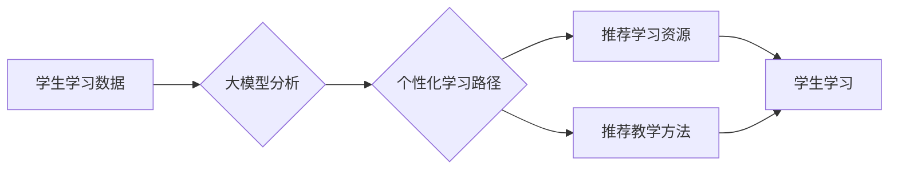

> 大模型，个性化学习，教育科技，深度学习，自然语言处理，推荐系统

## 1. 背景介绍

教育领域一直致力于为每个学生提供最佳的学习体验，但传统的教育模式往往难以满足个性化需求。随着人工智能技术的快速发展，大模型的出现为教育领域带来了新的机遇。大模型，指的是参数规模庞大、训练数据海量的人工智能模型，具备强大的学习和推理能力，能够理解和生成人类语言，并进行复杂的知识处理。

大模型在教育领域的应用潜力巨大，尤其是在个性化学习路径方面。个性化学习是指根据学生的学习风格、兴趣、能力和目标，定制专属的学习计划和内容，以提高学习效率和效果。大模型可以分析学生的学习数据，识别学生的知识掌握情况、学习偏好和学习障碍，并根据这些信息生成个性化的学习路径，推荐合适的学习资源和教学方法。

## 2. 核心概念与联系

### 2.1 大模型

大模型是指参数规模庞大、训练数据海量的人工智能模型，通常拥有数十亿甚至数千亿个参数。它们通过深度学习算法从海量数据中学习，能够理解和生成人类语言，并进行复杂的知识处理。

### 2.2 个性化学习

个性化学习是指根据学生的学习风格、兴趣、能力和目标，定制专属的学习计划和内容，以提高学习效率和效果。

### 2.3 学习路径

学习路径是指学生在学习过程中需要遵循的步骤和顺序，包括学习目标、学习内容、学习方法和评估方式等。

**大模型与个性化学习路径的联系：**

大模型可以分析学生的学习数据，识别学生的知识掌握情况、学习偏好和学习障碍，并根据这些信息生成个性化的学习路径，推荐合适的学习资源和教学方法。

**Mermaid 流程图：**



## 3. 核心算法原理 & 具体操作步骤

### 3.1 算法原理概述

个性化学习路径的构建主要依赖于推荐系统和自然语言处理技术。

* **推荐系统：** 基于学生的学习数据，预测学生可能感兴趣或需要学习的内容，并推荐相应的学习资源。常用的推荐算法包括协同过滤、内容过滤和基于知识的推荐。
* **自然语言处理：** 用于理解和生成自然语言，例如分析学生的学习日志、反馈和问题，识别学生的学习需求和难点。

### 3.2 算法步骤详解

1. **数据收集：** 收集学生的学习数据，包括学习记录、考试成绩、学习偏好、学习风格等。
2. **数据预处理：** 对收集到的数据进行清洗、转换和特征提取，以便于模型训练。
3. **模型训练：** 使用推荐算法和自然语言处理模型，对预处理后的数据进行训练，构建个性化学习路径模型。
4. **路径生成：** 根据学生的学习数据和模型预测，生成个性化的学习路径，包括学习目标、学习内容、学习方法和评估方式等。
5. **路径评估：** 对生成的学习路径进行评估，例如通过学生的学习效果和反馈来衡量路径的有效性。

### 3.3 算法优缺点

**优点：**

* **个性化：** 可以根据学生的具体情况定制学习路径，提高学习效率和效果。
* **效率提升：** 可以帮助学生更快地掌握知识，并减少重复学习的时间。
* **学习兴趣增强：** 可以根据学生的兴趣推荐学习内容，提高学习兴趣和积极性。

**缺点：**

* **数据依赖：** 需要大量的学习数据才能训练出准确的模型。
* **算法复杂度：** 个性化学习路径的构建算法比较复杂，需要专业的技术人员进行开发和维护。
* **伦理问题：** 需要考虑个性化学习路径可能带来的伦理问题，例如数据隐私和算法偏见。

### 3.4 算法应用领域

* **K-12 教育：** 为学生提供个性化的学习计划和内容，帮助他们更好地掌握知识和技能。
* **高等教育：** 为学生提供个性化的学习资源和教学方法，帮助他们更好地完成学业目标。
* **职业培训：** 为学员提供个性化的职业技能培训，帮助他们更快地进入职场。

## 4. 数学模型和公式 & 详细讲解 & 举例说明

### 4.1 数学模型构建

个性化学习路径的构建可以看作是一个推荐系统的构建过程，其中需要使用数学模型来预测学生可能感兴趣或需要学习的内容。常用的推荐算法包括协同过滤和内容过滤。

**协同过滤：**

协同过滤算法基于用户的行为相似性来进行推荐。假设有两个用户A和B，他们都对电影X和Y感兴趣，那么可以推测用户A可能也对用户B喜欢的电影感兴趣。协同过滤算法可以利用用户的历史行为数据，例如评分、购买记录等，来计算用户之间的相似度，并根据相似度推荐相关内容。

**内容过滤：**

内容过滤算法基于内容的相似性来进行推荐。假设有一个电影X，它属于动作片类型，那么可以推测用户喜欢动作片的用户可能也喜欢电影X。内容过滤算法可以利用电影的属性信息，例如类型、导演、演员等，来计算电影之间的相似度，并根据相似度推荐相关内容。

### 4.2 公式推导过程

**协同过滤算法中的余弦相似度公式：**

$$
\text{相似度}(u_i, u_j) = \frac{\sum_{k=1}^{n} r_{ik} \cdot r_{jk}}{\sqrt{\sum_{k=1}^{n} r_{ik}^2} \cdot \sqrt{\sum_{k=1}^{n} r_{jk}^2}}
$$

其中：

* $u_i$ 和 $u_j$ 是两个用户。
* $r_{ik}$ 和 $r_{jk}$ 是用户 $u_i$ 和 $u_j$ 对物品 $k$ 的评分。
* $n$ 是物品总数。

**内容过滤算法中的Jaccard相似度公式：**

$$
\text{相似度}(i, j) = \frac{|i \cap j|}{|i \cup j|}
$$

其中：

* $i$ 和 $j$ 是两个物品。
* $|i \cap j|$ 是 $i$ 和 $j$ 的交集大小。
* $|i \cup j|$ 是 $i$ 和 $j$ 的并集大小。

### 4.3 案例分析与讲解

**案例：**

假设有一个学生A，他喜欢数学和物理，并且在数学和物理的考试成绩都很好。

**协同过滤推荐：**

如果系统中有其他学生B和C，他们也喜欢数学和物理，并且在数学和物理的考试成绩都很好，那么系统可以根据协同过滤算法，将学生A推荐与学生B和C相同的学习资源和教学方法。

**内容过滤推荐：**

如果系统中有其他数学和物理相关的学习资源，例如数学教材、物理实验视频等，那么系统可以根据内容过滤算法，将这些学习资源推荐给学生A。

## 5. 项目实践：代码实例和详细解释说明

### 5.1 开发环境搭建

* **操作系统：** Ubuntu 20.04 LTS
* **编程语言：** Python 3.8
* **深度学习框架：** TensorFlow 2.0
* **其他工具：** Jupyter Notebook、Git

### 5.2 源代码详细实现

```python
# 导入必要的库
import tensorflow as tf
from tensorflow.keras.models import Sequential
from tensorflow.keras.layers import Dense

# 定义模型
model = Sequential()
model.add(Dense(64, activation='relu', input_shape=(10,)))
model.add(Dense(32, activation='relu'))
model.add(Dense(1, activation='sigmoid'))

# 编译模型
model.compile(optimizer='adam', loss='binary_crossentropy', metrics=['accuracy'])

# 训练模型
model.fit(X_train, y_train, epochs=10, batch_size=32)

# 评估模型
loss, accuracy = model.evaluate(X_test, y_test)
print('Loss:', loss)
print('Accuracy:', accuracy)
```

**代码解释：**

* 该代码示例展示了构建一个简单的深度学习模型进行个性化学习路径推荐。
* 模型输入是一个10维的特征向量，代表学生的学习数据。
* 模型输出是一个0或1的数值，表示学生是否需要学习某个特定的内容。
* 模型使用ReLU激活函数和Adam优化器进行训练。

### 5.3 代码解读与分析

* 该代码示例展示了构建一个简单的深度学习模型进行个性化学习路径推荐的基本步骤。
* 模型的结构和参数可以根据实际需求进行调整。
* 训练数据需要包含学生的学习数据和对应的学习路径信息。
* 模型的评估指标可以根据实际需求进行选择。

### 5.4 运行结果展示

* 运行结果包括模型的训练损失、准确率以及在测试集上的损失和准确率。
* 这些结果可以用来评估模型的性能。

## 6. 实际应用场景

### 6.1 在线教育平台

在线教育平台可以利用大模型构建个性化学习路径，为学生提供定制化的学习体验。例如，Khan Academy、Coursera 等平台可以根据学生的学习进度、学习风格和兴趣，推荐相应的学习资源和教学方法。

### 6.2 智能辅导系统

智能辅导系统可以利用大模型分析学生的学习数据，识别学生的学习障碍和难点，并提供个性化的辅导建议。例如，一些智能辅导系统可以根据学生的错题分析，推荐相关的练习题和学习资源。

### 6.3 教育游戏

教育游戏可以利用大模型生成个性化的游戏内容，提高学生的学习兴趣和参与度。例如，一些教育游戏可以根据学生的学习进度和表现，调整游戏难度和内容，以确保学生能够获得最佳的学习体验。

### 6.4 未来应用展望

* **更精准的个性化学习：** 未来，大模型可以更加精准地识别学生的学习需求和难点，并提供更加个性化的学习路径和辅导建议。
* **跨学科学习路径：** 大模型可以帮助学生构建跨学科的学习路径，例如，将数学、物理、化学等学科知识进行整合，帮助学生更好地理解和应用知识。
* **沉浸式学习体验：** 大模型可以与虚拟现实、增强现实等技术结合，为学生提供更加沉浸式的学习体验。

## 7. 工具和资源推荐

### 7.1 学习资源推荐

* **斯坦福大学CS224N自然语言处理课程：** https://web.stanford.edu/class/cs224n/
* **深度学习 Specialization (Coursera)：** https://www.coursera.org/specializations/deep-learning
* **Hugging Face Transformers 库：** https://huggingface.co/transformers/

### 7.2 开发工具推荐

* **TensorFlow：** https://www.tensorflow.org/
* **PyTorch：** https://pytorch.org/
* **Jupyter Notebook：** https://jupyter.org/

### 7.3 相关论文推荐

* **BERT: Pre-training of Deep Bidirectional Transformers for Language Understanding：** https://arxiv.org/abs/1810.04805
* **GPT-3: Language Models are Few-Shot Learners：** https://arxiv.org/abs/2005.14165
* **T5: Text-to-Text Transfer Transformer：** https://arxiv.org/abs/1910.10683

## 8. 总结：未来发展趋势与挑战

### 8.1 研究成果总结

大模型在教育领域的应用取得了显著的成果，例如，个性化学习路径、智能辅导系统、教育游戏等。大模型能够分析学生的学习数据，识别学生的学习需求和难点，并提供个性化的学习建议和辅导。

### 8.2 未来发展趋势

* **模型规模和能力的提升