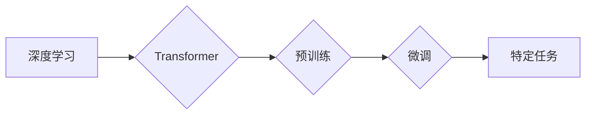

> 大模型、Transformer、深度学习、自然语言处理、计算机视觉、市场推广、商业应用

## 1. 背景介绍

近年来，人工智能（AI）技术取得了飞速发展，其中大模型（Large Language Model，LLM）作为人工智能领域的新兴热点，展现出强大的学习和推理能力，在自然语言处理（NLP）、计算机视觉（CV）、代码生成等领域取得了突破性进展。大模型的出现，标志着人工智能技术迈入了一个新的阶段，其强大的能力和广泛的应用前景，引发了学术界和产业界的广泛关注。

### 1.1  大模型的定义与特征

大模型是指参数规模庞大、训练数据海量的人工智能模型。通常，大模型的参数数量超过数十亿甚至数千亿，训练数据也达到数万亿甚至数千亿个样本。大模型的规模优势使其能够学习到更复杂的模式和知识，从而提升模型的性能和泛化能力。

### 1.2  大模型的兴起

大模型的兴起与以下几个因素密切相关：

* **计算能力的提升:**  近年来，GPU和TPU等高性能计算硬件的不断发展，为大模型的训练提供了强大的计算支撑。
* **数据量的爆炸式增长:**  互联网的普及和数字化转型，使得海量数据得以收集和存储，为大模型的训练提供了充足的数据资源。
* **算法的创新:**  Transformer等新型深度学习架构的出现，有效提升了大模型的训练效率和性能。

## 2. 核心概念与联系

大模型的核心概念包括：

* **深度学习:**  深度学习是一种基于多层神经网络的机器学习方法，能够学习到数据中的复杂特征。
* **Transformer:**  Transformer是一种新型的深度学习架构，其自注意力机制能够有效捕捉序列数据中的长距离依赖关系，为大模型的训练提供了强大的工具。
* **预训练:**  预训练是指在大量通用数据上训练大模型，使其学习到通用的语言表示和知识，为后续的特定任务训练提供基础。
* **微调:**  微调是指在特定任务数据上对预训练的大模型进行进一步训练，使其能够更好地完成特定任务。

**Mermaid 流程图:**



## 3. 核心算法原理 & 具体操作步骤

### 3.1  算法原理概述

大模型的核心算法是基于深度学习的Transformer架构。Transformer通过自注意力机制和多头注意力机制，能够有效捕捉序列数据中的长距离依赖关系，从而学习到更复杂的语言表示。

### 3.2  算法步骤详解

1. **输入编码:** 将输入序列转换为向量表示。
2. **多头注意力:** 使用多头注意力机制，计算每个词与其他词之间的注意力权重，从而捕捉序列数据中的上下文信息。
3. **前馈神经网络:** 对每个词的注意力表示进行进一步处理，提取更深层的特征。
4. **位置编码:** 添加位置信息，使模型能够理解词语在序列中的顺序。
5. **输出解码:** 将编码后的序列转换为输出序列。

### 3.3  算法优缺点

**优点:**

* 能够有效捕捉长距离依赖关系。
* 训练效率高，能够训练出规模庞大的模型。
* 泛化能力强，能够应用于多种自然语言处理任务。

**缺点:**

* 计算量大，需要强大的计算资源。
* 训练数据量大，需要海量数据进行训练。
* 模型参数量大，部署成本高。

### 3.4  算法应用领域

大模型的应用领域非常广泛，包括：

* **自然语言处理:**  文本生成、机器翻译、问答系统、文本摘要等。
* **计算机视觉:**  图像识别、目标检测、图像生成等。
* **代码生成:**  自动生成代码、代码修复等。
* **语音识别:**  语音转文本、语音合成等。

## 4. 数学模型和公式 & 详细讲解 & 举例说明

### 4.1  数学模型构建

大模型的数学模型通常基于深度神经网络，其核心是多层感知机（MLP）和注意力机制。

**多层感知机 (MLP):**

MLP由多个全连接层组成，每个层都有激活函数。

**注意力机制:**

注意力机制是一种机制，能够学习到输入序列中哪些部分对输出结果更重要。

### 4.2  公式推导过程

**自注意力机制公式:**

$$
Attention(Q, K, V) = softmax(\frac{QK^T}{\sqrt{d_k}})V
$$

其中：

* $Q$：查询矩阵
* $K$：键矩阵
* $V$：值矩阵
* $d_k$：键向量的维度
* $softmax$：softmax函数

### 4.3  案例分析与讲解

**举例说明:**

假设我们有一个句子 "The cat sat on the mat"，我们想要使用自注意力机制来计算每个词与其他词之间的注意力权重。

1. 将句子中的每个词转换为向量表示，作为查询矩阵 $Q$、键矩阵 $K$ 和值矩阵 $V$。
2. 计算 $QK^T$，得到每个词与其他词之间的相似度得分。
3. 使用 softmax 函数将相似度得分归一化，得到每个词与其他词之间的注意力权重。
4. 将注意力权重与值矩阵相乘，得到每个词的加权平均值，作为该词的上下文表示。

## 5. 项目实践：代码实例和详细解释说明

### 5.1  开发环境搭建

* Python 3.7+
* PyTorch 1.7+
* CUDA 10.2+

### 5.2  源代码详细实现

```python
import torch
import torch.nn as nn

class Transformer(nn.Module):
    def __init__(self, vocab_size, embedding_dim, num_heads, num_layers):
        super(Transformer, self).__init__()
        self.embedding = nn.Embedding(vocab_size, embedding_dim)
        self.transformer_layers = nn.ModuleList([
            nn.TransformerEncoderLayer(embedding_dim, num_heads)
            for _ in range(num_layers)
        ])
        self.linear = nn.Linear(embedding_dim, vocab_size)

    def forward(self, x):
        x = self.embedding(x)
        for layer in self.transformer_layers:
            x = layer(x)
        x = self.linear(x)
        return x
```

### 5.3  代码解读与分析

* `__init__` 方法初始化模型参数，包括词嵌入层、Transformer编码器层和输出层。
* `forward` 方法定义模型的正向传播过程，将输入序列转换为输出序列。

### 5.4  运行结果展示

运行代码并训练模型，可以得到模型的训练结果，例如准确率、损失值等。

## 6. 实际应用场景

### 6.1  自然语言处理

* **机器翻译:**  大模型能够学习到不同语言之间的语义关系，实现高质量的机器翻译。
* **文本摘要:**  大模型能够提取文本中的关键信息，生成简洁的文本摘要。
* **问答系统:**  大模型能够理解用户的问题，并从知识库中找到相应的答案。

### 6.2  计算机视觉

* **图像识别:**  大模型能够学习到图像中的特征，识别出图像中的物体。
* **目标检测:**  大模型能够定位图像中的目标，并识别出目标的类别。
* **图像生成:**  大模型能够生成逼真的图像，例如人脸、风景等。

### 6.3  代码生成

* **自动代码生成:**  大模型能够根据自然语言描述生成代码。
* **代码修复:**  大模型能够识别代码中的错误，并自动修复错误。

### 6.4  未来应用展望

大模型的应用前景广阔，未来将应用于更多领域，例如：

* **医疗保健:**  辅助医生诊断疾病、预测患者风险。
* **教育:**  个性化学习、智能辅导。
* **金融:**  风险评估、欺诈检测。

## 7. 工具和资源推荐

### 7.1  学习资源推荐

* **书籍:**
    * 《深度学习》
    * 《Transformer 详解》
* **在线课程:**
    * Coursera: 深度学习
    * fast.ai: 深度学习课程
* **博客:**
    * The Gradient
    * Towards Data Science

### 7.2  开发工具推荐

* **PyTorch:**  开源深度学习框架
* **TensorFlow:**  开源深度学习框架
* **Hugging Face Transformers:**  预训练大模型库

### 7.3  相关论文推荐

* **Attention Is All You Need:**  Transformer模型的提出论文
* **BERT: Pre-training of Deep Bidirectional Transformers for Language Understanding:**  BERT模型的提出论文
* **GPT-3: Language Models are Few-Shot Learners:**  GPT-3模型的提出论文

## 8. 总结：未来发展趋势与挑战

### 8.1  研究成果总结

大模型技术取得了显著进展，在自然语言处理、计算机视觉等领域取得了突破性成果。

### 8.2  未来发展趋势

* **模型规模的进一步扩大:**  随着计算能力的提升，大模型的规模将继续扩大，模型能力将进一步提升。
* **多模态大模型的开发:**  将文本、图像、音频等多种模态数据融合到一起，开发多模态大模型，实现更智能的应用。
* **可解释性研究的加强:**  研究大模型的决策过程，提高模型的可解释性，增强用户对模型的信任。

### 8.3  面临的挑战

* **计算资源的限制:**  训练大模型需要大量的计算资源，这对于资源有限的机构和个人来说是一个挑战。
* **数据安全和隐私问题:**  大模型的训练需要海量数据，如何保证数据的安全和隐私是一个重要问题。
* **模型偏见和公平性问题:**  大模型可能存在偏见和不公平性，需要进行相应的调优和改进。

### 8.4  研究展望

未来，大模型技术将继续发展，在更多领域发挥重要作用。我们需要加强对大模型技术的研究，解决其面临的挑战，推动大模型技术向更安全、更公平、更可解释的方向发展。

## 9. 附录：常见问题与解答

### 9.1  Q: 如何训练一个大模型？

A: 训练一个大模型需要大量的计算资源、海量数据和专业的技术团队。

### 9.2  Q: 大模型的应用有哪些？

A: 大模型的应用非常广泛，包括自然语言处理、计算机视觉、代码生成等领域。

### 9.3  Q: 大模型有哪些挑战？

A: 大模型面临的挑战包括计算资源的限制、数据安全和隐私问题、模型偏见和公平性问题等。

作者：禅与计算机程序设计艺术 / Zen and the Art of Computer Programming


<end_of_turn>