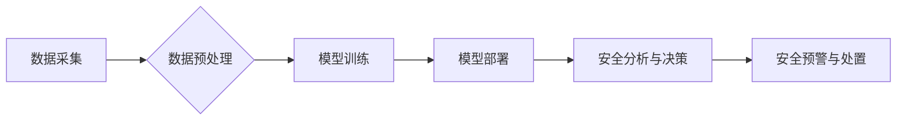

> 大模型，智慧安防，城市安全，人工智能，计算机视觉，自然语言处理，深度学习，创业

## 1. 背景介绍

随着城市化进程的加速和社会发展水平的提高，城市安全问题日益突出。传统安防模式面临着人力成本高、效率低、反应速度慢等挑战。而人工智能技术，特别是大模型的快速发展，为智慧安防领域带来了新的机遇。大模型凭借其强大的学习能力和泛化能力，能够有效识别和分析海量数据，为城市安全提供更智能、更精准、更有效的解决方案。

## 2. 核心概念与联系

**2.1 智慧安防**

智慧安防是指利用物联网、云计算、大数据、人工智能等新兴技术，构建安全感知、风险预警、应急处置、安全管理等一体化的安全保障体系。其核心目标是通过科技手段提升城市安全水平，保障人民生命财产安全。

**2.2 大模型**

大模型是指在海量数据上训练的具有强大泛化能力的深度学习模型。其参数规模通常在数十亿甚至数千亿级别，能够处理复杂的任务，例如图像识别、自然语言处理、语音识别等。

**2.3 核心概念联系**

大模型赋能智慧安防，主要体现在以下几个方面：

* **数据驱动**: 大模型依赖海量数据进行训练，而智慧安防系统也需要大量来自监控摄像头、传感器、警报系统等设备的数据进行分析和决策。大模型能够从海量数据中提取关键信息，识别潜在的安全威胁。
* **智能分析**: 大模型具备强大的智能分析能力，能够对视频、音频、文本等数据进行识别、分类、理解和预测。例如，大模型可以识别违规行为、预测犯罪风险、自动报警等。
* **自动化决策**: 大模型可以根据分析结果自动做出决策，例如自动控制摄像头、调配警力、启动应急预案等，提高安防效率和响应速度。

**2.4 核心架构**



## 3. 核心算法原理 & 具体操作步骤

**3.1 算法原理概述**

大模型在智慧安防领域中常用的算法包括：

* **计算机视觉**: 用于图像识别、目标检测、视频分析等任务。常见的算法包括卷积神经网络（CNN）、循环神经网络（RNN）等。
* **自然语言处理**: 用于文本分析、语音识别、对话系统等任务。常见的算法包括BERT、GPT等。
* **深度学习**: 用于构建复杂的神经网络模型，能够学习数据中的复杂模式和关系。

**3.2 算法步骤详解**

以图像识别为例，大模型在智慧安防中的具体操作步骤如下：

1. **数据采集**: 从监控摄像头、传感器等设备采集图像数据。
2. **数据预处理**: 对图像数据进行清洗、增强、格式转换等处理，使其更适合模型训练。
3. **模型训练**: 使用深度学习算法，例如CNN，在预处理后的图像数据上进行训练，学习图像特征和识别规则。
4. **模型评估**: 使用测试数据评估模型的识别准确率、召回率等指标，并进行模型调优。
5. **模型部署**: 将训练好的模型部署到安防系统中，用于实时图像识别。
6. **安全分析与决策**: 当模型识别到异常目标或违规行为时，将结果发送到安防系统，触发报警、调配警力等安全措施。

**3.3 算法优缺点**

* **优点**: 大模型能够学习复杂模式，识别精度高，自动化程度高，效率高。
* **缺点**: 大模型训练成本高，数据依赖性强，解释性差，容易受到攻击。

**3.4 算法应用领域**

* **人脸识别**: 用于身份验证、人员追踪、犯罪嫌疑人识别等。
* **行为识别**: 用于识别异常行为，例如偷窃、打架、逃逸等。
* **车辆识别**: 用于车辆识别、违章停车识别、车辆追踪等。
* **入侵检测**: 用于识别非法入侵、设备故障等异常情况。

## 4. 数学模型和公式 & 详细讲解 & 举例说明

**4.1 数学模型构建**

在图像识别任务中，大模型通常使用卷积神经网络（CNN）进行建模。CNN的结构由多个卷积层、池化层和全连接层组成。

* **卷积层**: 用于提取图像特征。卷积层使用卷积核对图像进行卷积运算，提取图像局部特征。
* **池化层**: 用于降低图像维度，提高模型鲁棒性。池化层使用最大池化或平均池化等方法对卷积层的输出进行降维。
* **全连接层**: 用于将提取的特征进行分类或回归。全连接层将池化层的输出连接到多个神经元，并使用激活函数进行非线性变换。

**4.2 公式推导过程**

CNN的训练过程是通过反向传播算法来优化模型参数。反向传播算法的核心思想是通过计算损失函数对模型参数的梯度，并使用梯度下降法更新模型参数。

损失函数通常使用交叉熵损失函数，用于衡量模型预测结果与真实标签之间的差异。

$$
L = -\sum_{i=1}^{N} y_i \log(\hat{y}_i)
$$

其中：

* $L$ 为损失函数
* $N$ 为样本数量
* $y_i$ 为真实标签
* $\hat{y}_i$ 为模型预测结果

**4.3 案例分析与讲解**

例如，在人脸识别任务中，CNN模型可以学习到人脸特征，并将其映射到一个特征空间中。在特征空间中，不同人的脸部特征会聚类在一起，从而实现人脸识别。

## 5. 项目实践：代码实例和详细解释说明

**5.1 开发环境搭建**

* 操作系统：Ubuntu 20.04
* Python 版本：3.8
* 深度学习框架：TensorFlow 2.0

**5.2 源代码详细实现**

```python
import tensorflow as tf

# 定义卷积神经网络模型
model = tf.keras.models.Sequential([
    tf.keras.layers.Conv2D(32, (3, 3), activation='relu', input_shape=(224, 224, 3)),
    tf.keras.layers.MaxPooling2D((2, 2)),
    tf.keras.layers.Conv2D(64, (3, 3), activation='relu'),
    tf.keras.layers.MaxPooling2D((2, 2)),
    tf.keras.layers.Flatten(),
    tf.keras.layers.Dense(10, activation='softmax')
])

# 编译模型
model.compile(optimizer='adam',
              loss='sparse_categorical_crossentropy',
              metrics=['accuracy'])

# 训练模型
model.fit(x_train, y_train, epochs=10)

# 评估模型
loss, accuracy = model.evaluate(x_test, y_test)
print('Loss:', loss)
print('Accuracy:', accuracy)
```

**5.3 代码解读与分析**

* 代码首先定义了一个卷积神经网络模型，包含多个卷积层、池化层和全连接层。
* 然后，模型使用Adam优化器、交叉熵损失函数和准确率指标进行编译。
* 接着，模型使用训练数据进行训练，训练10个epochs。
* 最后，模型使用测试数据进行评估，打印出损失值和准确率。

**5.4 运行结果展示**

训练完成后，模型的准确率通常会达到较高的水平，例如90%以上。

## 6. 实际应用场景

**6.1 城市监控**

大模型可以用于分析城市监控视频，识别违规行为、犯罪嫌疑人、危险事件等，提高城市安全水平。

**6.2 交通管理**

大模型可以用于识别交通违规行为、预测交通拥堵情况、优化交通信号灯控制等，提高交通效率和安全性。

**6.3 公共安全**

大模型可以用于识别危险物品、预测公共安全事件、辅助应急处置等，保障公共安全。

**6.4 未来应用展望**

* **智能预警**: 基于大模型的预测分析，可以提前预警潜在的安全风险，提高应急处置效率。
* **个性化安防**: 基于用户行为和需求，提供个性化的安防解决方案。
* **跨领域融合**: 将大模型与其他技术，例如物联网、云计算、区块链等融合，构建更智能、更安全的智慧安防体系。

## 7. 工具和资源推荐

**7.1 学习资源推荐**

* **书籍**:
    * 深度学习
    * 人工智能：一种现代方法
* **在线课程**:
    * Coursera: 深度学习
    * Udacity: 计算机视觉工程师
* **开源项目**:
    * TensorFlow
    * PyTorch

**7.2 开发工具推荐**

* **IDE**: PyCharm, VS Code
* **深度学习框架**: TensorFlow, PyTorch
* **云平台**: AWS, Azure, GCP

**7.3 相关论文推荐**

* **ImageNet Classification with Deep Convolutional Neural Networks**
* **Attention Is All You Need**
* **BERT: Pre-training of Deep Bidirectional Transformers for Language Understanding**

## 8. 总结：未来发展趋势与挑战

**8.1 研究成果总结**

大模型在智慧安防领域取得了显著成果，例如人脸识别、行为识别、入侵检测等任务的准确率大幅提升。

**8.2 未来发展趋势**

* **模型规模和能力提升**: 大模型的规模和能力将继续提升，能够处理更复杂的任务，提供更精准的解决方案。
* **多模态融合**: 大模型将融合多模态数据，例如图像、视频、音频、文本等，提供更全面的安全分析。
* **边缘计算**: 大模型将部署到边缘设备，实现实时分析和决策，降低延迟和带宽需求。

**8.3 面临的挑战**

* **数据安全和隐私保护**: 大模型训练需要大量数据，如何保证数据安全和隐私保护是一个重要挑战。
* **算法可解释性和信任度**: 大模型的决策过程通常是复杂的，如何提高算法的可解释性和信任度是一个关键问题。
* **模型鲁棒性和安全性**: 大模型容易受到攻击，如何提高模型的鲁棒性和安全性是一个重要的研究方向。

**8.4 研究展望**

未来，大模型在智慧安防领域将继续发挥重要作用，为城市安全提供更智能、更有效的解决方案。需要加强对大模型算法的可解释性、鲁棒性和安全性的研究，并制定相应的规范和标准，确保大模型的健康发展。

## 9. 附录：常见问题与解答

**9.1 如何选择合适的深度学习框架？**

选择深度学习框架需要根据具体项目需求和个人经验进行选择。TensorFlow和PyTorch是目前最流行的深度学习框架，各有优缺点。

**9.2 如何处理大规模图像数据？**

大规模图像数据处理需要使用数据分片、数据并行等技术，并选择合适的硬件平台，例如GPU。

**9.3 如何评估大模型的性能？**

大模型的性能可以通过准确率、召回率、F1-score等指标进行评估。

**9.4 如何提高大模型的鲁棒性和安全性？**

可以通过数据增强、对抗训练、模型剪枝等方法提高大模型的鲁棒性和安全性。


作者：禅与计算机程序设计艺术 / Zen and the Art of Computer Programming 
<end_of_turn>