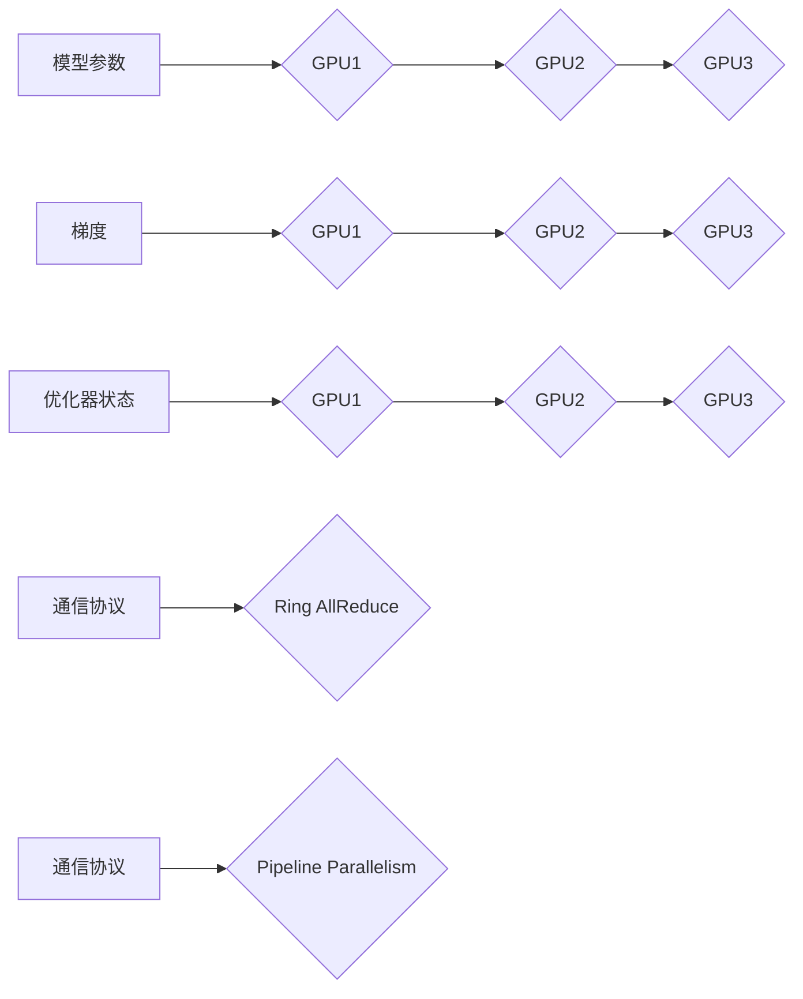

> 大语言模型，ZeRO，并行训练，模型压缩，内存效率，Transformer，深度学习

## 1. 背景介绍

近年来，深度学习在自然语言处理领域取得了显著进展，大语言模型（LLM）作为其重要代表，展现出强大的文本生成、理解和翻译能力。然而，LLM的训练和部署面临着巨大的挑战，其中内存占用和计算资源需求是主要瓶颈。

传统的训练方法通常将模型参数存储在单个GPU内存中，当模型规模不断增长时，内存限制会成为训练的瓶颈。为了解决这个问题，研究者们提出了各种模型并行和数据并行技术，例如数据并行、模型并行、混合并行等。

其中，模型并行技术将模型参数分布在多个GPU上进行训练，可以有效缓解内存压力，提高训练效率。但传统的模型并行方法存在着通信开销大、训练不稳定等问题。

为了进一步提高模型并行的效率，谷歌大脑于2020年提出了**ZeRO（Zero Redundancy Optimizer）**技术，它通过将模型参数、梯度和优化器状态进行分层压缩和存储，有效降低了内存占用，并提高了训练速度。

## 2. 核心概念与联系

ZeRO技术的核心思想是将模型参数、梯度和优化器状态进行分层压缩和存储，并利用高效的通信协议进行数据传输，从而降低内存占用和通信开销。

**ZeRO分层压缩**

ZeRO将模型参数、梯度和优化器状态分为不同的层级，并对每个层级进行压缩存储。

* **层级1：模型参数**

将模型参数存储在多个GPU上，每个GPU负责一部分参数的存储和计算。

* **层级2：梯度**

将梯度存储在每个GPU的本地内存中，并在梯度更新阶段进行聚合。

* **层级3：优化器状态**

将优化器状态存储在每个GPU的本地内存中，并在参数更新阶段进行同步。

**ZeRO通信优化**

ZeRO利用高效的通信协议进行数据传输，例如**Ring AllReduce**和**Pipeline Parallelism**，以减少通信开销。

**Mermaid 流程图**



## 3. 核心算法原理 & 具体操作步骤

### 3.1  算法原理概述

ZeRO的核心算法原理是通过分层压缩和高效通信来降低模型训练的内存占用和通信开销。

* **分层压缩：** 将模型参数、梯度和优化器状态进行分层压缩，并存储在不同的层级上。
* **高效通信：** 利用高效的通信协议，例如Ring AllReduce和Pipeline Parallelism，进行数据传输。

### 3.2  算法步骤详解

1. **模型参数分层存储：** 将模型参数按照一定的策略分布在多个GPU上，每个GPU负责一部分参数的存储和计算。
2. **梯度计算和聚合：** 在每个GPU上计算梯度，并使用Ring AllReduce等协议进行聚合，得到全局梯度。
3. **优化器状态更新：** 在每个GPU上更新优化器状态，并使用Pipeline Parallelism等协议进行同步，保证所有GPU上的优化器状态一致。
4. **参数更新：** 根据全局梯度和优化器状态，更新所有GPU上的模型参数。

### 3.3  算法优缺点

**优点：**

* **降低内存占用：** 通过分层压缩，有效降低了模型参数、梯度和优化器状态的内存占用。
* **提高训练速度：** 通过高效通信协议，减少了通信开销，提高了训练速度。
* **支持大规模模型训练：** 可以训练比传统方法更大的模型。

**缺点：**

* **复杂性增加：** ZeRO的实现相对复杂，需要对模型结构和通信协议有深入了解。
* **通信开销仍然存在：** 尽管使用了高效的通信协议，但通信开销仍然存在，可能会影响训练效率。

### 3.4  算法应用领域

ZeRO技术主要应用于大规模语言模型的训练，例如GPT-3、BERT等。

## 4. 数学模型和公式 & 详细讲解 & 举例说明

### 4.1  数学模型构建

ZeRO技术的核心数学模型是基于**分层压缩**和**高效通信**的。

* **分层压缩模型：**

假设模型参数为**W**，梯度为**G**，优化器状态为**S**。ZeRO将它们分别分为**k**层级，每个层级的参数、梯度和优化器状态分别为**W_i**、**G_i**和**S_i** (i=1,2,...,k)。

* **高效通信模型：**

假设**N**个GPU参与训练，每个GPU负责一部分参数、梯度和优化器状态。ZeRO利用**Ring AllReduce**和**Pipeline Parallelism**等协议进行数据传输，将通信开销降至最低。

### 4.2  公式推导过程

**1. 分层压缩公式：**

$$W_i = \text{compress}(W_{i-1})$$

其中，**compress**表示分层压缩函数，将上一层级的参数压缩到下一层级。

**2. 梯度聚合公式：**

$$G_k = \text{AllReduce}(G_{k-1})$$

其中，**AllReduce**表示Ring AllReduce协议，将每个GPU上的梯度聚合到全局梯度。

**3. 参数更新公式：**

$$W_{i+1} = W_i - \eta \cdot \frac{\partial L}{\partial W_i}$$

其中，**η**为学习率，**L**为损失函数。

### 4.3  案例分析与讲解

假设训练一个包含10亿参数的语言模型，使用4个GPU进行训练。

* **传统方法：** 将所有参数存储在单个GPU内存中，会导致内存溢出。
* **ZeRO方法：** 将模型参数分层存储在4个GPU上，每个GPU负责2.5亿参数。梯度和优化器状态也进行分层压缩和存储。

通过ZeRO技术，可以有效降低内存占用，并提高训练速度。

## 5. 项目实践：代码实例和详细解释说明

### 5.1  开发环境搭建

* **操作系统：** Ubuntu 20.04
* **CUDA版本：** 11.2
* **cuDNN版本：** 8.0
* **PyTorch版本：** 1.8

### 5.2  源代码详细实现

```python
import torch
import torch.nn as nn
from torch.distributed import init_process_group, destroy_process_group
from torch.nn.parallel import DistributedDataParallel

# 定义模型
class MyModel(nn.Module):
    def __init__(self):
        super(MyModel, self).__init__()
        # ... 模型结构定义 ...

    def forward(self, x):
        # ... 模型前向传播 ...

# 初始化分布式训练环境
init_process_group(backend='nccl')

# 创建模型实例
model = MyModel()

# 将模型分布到多个GPU上
model = DistributedDataParallel(model)

# ... 训练代码 ...

# 销毁分布式训练环境
destroy_process_group()
```

### 5.3  代码解读与分析

* **init_process_group()**: 初始化分布式训练环境，指定通信后端为nccl。
* **DistributedDataParallel()**: 将模型分布到多个GPU上，并实现数据并行和模型并行。
* **forward()**: 模型前向传播函数，在每个GPU上执行。

### 5.4  运行结果展示

运行上述代码，可以将模型分布到多个GPU上进行训练，并观察训练速度和内存占用情况。

## 6. 实际应用场景

ZeRO技术在实际应用场景中展现出强大的性能优势，例如：

* **大型语言模型训练：** ZeRO可以有效训练比传统方法更大的语言模型，例如GPT-3、BERT等。
* **自然语言理解任务：** ZeRO可以提高自然语言理解任务的性能，例如文本分类、情感分析等。
* **机器翻译任务：** ZeRO可以提高机器翻译任务的准确性和效率。

### 6.4  未来应用展望

ZeRO技术在未来将继续发展和完善，并应用于更多领域，例如：

* **图像识别任务：** ZeRO可以用于训练大型图像识别模型，提高识别精度和效率。
* **视频理解任务：** ZeRO可以用于训练大型视频理解模型，提高视频分析能力。
* **自动驾驶任务：** ZeRO可以用于训练大型自动驾驶模型，提高驾驶安全性和可靠性。

## 7. 工具和资源推荐

### 7.1  学习资源推荐

* **ZeRO官方文档：** https://ai.googleblog.com/2020/08/training-transformer-models-with-zero.html
* **PyTorch官方文档：** https://pytorch.org/docs/stable/index.html
* **深度学习书籍：** 《深度学习》

### 7.2  开发工具推荐

* **PyTorch：** https://pytorch.org/
* **TensorFlow：** https://www.tensorflow.org/

### 7.3  相关论文推荐

* **ZeRO: Training Massive Language Models with Zero Redundancy Optimizer:** https://arxiv.org/abs/2008.05097
* **BERT: Pre-training of Deep Bidirectional Transformers for Language Understanding:** https://arxiv.org/abs/1810.04805

## 8. 总结：未来发展趋势与挑战

### 8.1  研究成果总结

ZeRO技术为大规模语言模型的训练提供了新的思路和方法，有效降低了内存占用和通信开销，推动了大模型的规模和性能提升。

### 8.2  未来发展趋势

* **模型压缩技术：** 进一步提高模型压缩效率，降低模型大小和内存占用。
* **通信优化技术：** 开发更有效的通信协议，减少通信开销。
* **混合并行技术：** 结合数据并行、模型并行和混合并行技术，提高训练效率。

### 8.3  面临的挑战

* **模型复杂度：** 随着模型规模的不断增长，模型复杂度也会增加，对硬件和软件提出了更高的要求。
* **数据稀缺性：** 大规模模型需要大量的训练数据，而高质量的训练数据往往稀缺。
* **伦理问题：** 大规模模型的训练和应用可能带来伦理问题，例如偏见、隐私等。

### 8.4  研究展望

未来，研究者们将继续探索新的模型并行和数据并行技术，以应对大规模模型训练的挑战，并推动人工智能技术的进步。

## 9. 附录：常见问题与解答

**1. ZeRO技术与其他模型并行技术相比有什么优势？**

ZeRO技术相比其他模型并行技术，具有以下优势：

* **降低内存占用：** 通过分层压缩，有效降低了模型参数、梯度和优化器状态的内存占用。
* **提高训练速度：** 通过高效通信协议，减少了通信开销，提高了训练速度。
* **支持大规模模型训练：** 可以训练比传统方法更大的模型。

**2. ZeRO技术有哪些局限性？**

ZeRO技术也存在一些局限性：

* **复杂性增加：** ZeRO的实现相对复杂，需要对模型结构和通信协议有深入了解。
* **通信开销仍然存在：** 