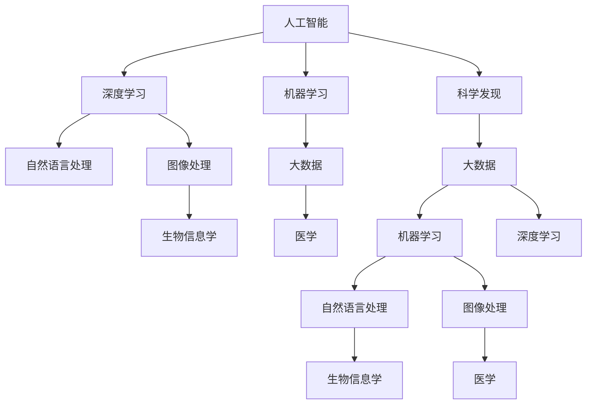

                 

# 科学与 AI：加速发现

> 关键词：AI加速,科学发现,大数据,机器学习,深度学习,自然语言处理,图像处理,生物信息学,医学

## 1. 背景介绍

### 1.1 问题由来
人工智能(AI)正以其强大的计算能力和丰富的应用场景，深刻改变着现代社会。尤其是人工智能的加速发展，进一步推动了科学研究的突破，使得科学家能够以前所未有的速度和精度进行科学发现。然而，随着AI技术的不断演进，如何充分利用AI的力量，加速科学研究的发现，成为一个值得深入探讨的问题。

### 1.2 问题核心关键点
AI加速科学发现的核心在于将人工智能的计算能力和分析能力，与科学研究的实际需求相结合。具体来说，包括以下几个关键点：

- **数据处理能力**：AI可以处理大规模、复杂的数据集，从中提取有价值的信息，辅助科学家的发现。
- **模式识别和预测**：AI能够识别数据中的模式和规律，进行预测和分类，为科学家提供参考。
- **自动化实验设计**：AI可以优化实验设计，自动生成实验方案，提高实验效率。
- **自然语言处理**：AI在处理文本数据方面具有优势，可以帮助科学家快速分析文献、数据报告等文本信息。
- **图像和信号处理**：AI在图像识别、信号分析等领域也有着广泛应用，可以帮助科学家解析复杂的数据集。
- **生物信息学和医学**：AI在基因组学、蛋白质组学、医学影像等方面也具有重要应用，辅助科学家进行研究。

### 1.3 问题研究意义
AI加速科学发现的研究意义在于：

- **提高研究效率**：通过AI的自动化处理能力，科学家可以更快地处理和分析数据，提高研究效率。
- **促进跨学科融合**：AI技术可以跨越不同学科，帮助科学家进行跨学科研究，推动科学研究的创新。
- **支持大规模研究**：AI可以处理大规模数据集，支持大科学项目的研究需求。
- **提升决策科学性**：AI可以提供更准确的预测和分析，辅助科学家进行科学决策。

## 2. 核心概念与联系

### 2.1 核心概念概述

为更好地理解AI加速科学发现的方法，本节将介绍几个关键概念：

- **人工智能(AI)**：一种模拟人类智能的技术，涵盖机器学习、深度学习、自然语言处理、计算机视觉等多个领域。
- **科学发现**：科学研究的本质是发现未知，通过实验、观察、计算等手段，提出新理论、新方法、新规律的过程。
- **大数据**：海量的数据集，通常以结构化或非结构化形式存在，用于支持复杂分析。
- **机器学习(ML)**：一种通过算法让计算机从数据中学习，并自主提升性能的技术。
- **深度学习(DL)**：机器学习的一种高级形式，通过多层神经网络进行特征提取和决策。
- **自然语言处理(NLP)**：AI在理解和生成自然语言方面的技术，应用于文本分析、信息检索等场景。
- **图像处理**：AI在图像识别、图像生成、图像分割等领域的处理技术。
- **生物信息学**：应用计算技术对生物数据进行分析和研究，应用于基因组学、蛋白质组学等领域。
- **医学**：应用AI技术进行疾病诊断、治疗方案优化、医疗影像分析等，提高医疗水平。

这些概念之间的联系可以通过以下Mermaid流程图来展示：



这个流程图展示了大规模数据处理、机器学习、深度学习、自然语言处理、图像处理、生物信息学和医学等多个AI技术如何共同作用于科学发现过程。

## 3. 核心算法原理 & 具体操作步骤
### 3.1 算法原理概述

AI加速科学发现的原理是利用AI的计算能力和分析能力，辅助科学家的研究和发现。具体来说，包括以下几个步骤：

1. **数据收集与预处理**：收集和预处理科学数据，包括结构化和非结构化数据，去除噪声，标准化数据格式。
2. **特征提取与建模**：从数据中提取特征，构建模型，如机器学习模型、深度学习模型等，进行数据拟合和预测。
3. **模式识别与预测**：通过模型识别数据中的模式和规律，进行分类和预测，辅助科学家发现新规律。
4. **自动化实验设计**：优化实验设计，生成实验方案，自动化执行实验，提高实验效率。
5. **自然语言处理**：利用NLP技术分析文本数据，提取关键信息，辅助科学家进行文献综述和研究报告撰写。
6. **图像和信号处理**：通过图像处理和信号分析技术，解析复杂的实验数据，支持科学家的研究。
7. **生物信息学和医学**：应用AI技术进行基因组学、蛋白质组学、医学影像分析等，辅助科学家进行研究。
8. **结果验证与优化**：通过实验验证和优化模型，确保研究结果的准确性和可靠性。

### 3.2 算法步骤详解

AI加速科学发现的具体操作步骤如下：

**Step 1: 数据收集与预处理**
- 收集与科学发现相关的数据，包括实验数据、文献数据、生物数据等。
- 清洗数据，去除噪声和不完整信息，标准化数据格式。

**Step 2: 特征提取与建模**
- 对数据进行特征提取，包括文本特征、图像特征、信号特征等。
- 选择合适的机器学习或深度学习模型进行建模，如线性回归、支持向量机、卷积神经网络等。
- 使用模型对数据进行拟合和预测，得到结果。

**Step 3: 模式识别与预测**
- 通过模型识别数据中的模式和规律，进行分类和预测。
- 辅助科学家发现新规律，验证假设，支持科学研究。

**Step 4: 自动化实验设计**
- 根据已有数据和理论，优化实验设计，生成实验方案。
- 自动化执行实验，提高实验效率，减少实验误差。

**Step 5: 自然语言处理**
- 利用NLP技术分析文本数据，提取关键信息。
- 辅助科学家进行文献综述和研究报告撰写，提高研究效率。

**Step 6: 图像和信号处理**
- 通过图像处理和信号分析技术，解析复杂的实验数据。
- 支持科学家的研究，提高数据的可解释性和可利用性。

**Step 7: 生物信息学和医学**
- 应用AI技术进行基因组学、蛋白质组学、医学影像分析等。
- 辅助科学家进行研究，提高研究的深度和广度。

**Step 8: 结果验证与优化**
- 通过实验验证和优化模型，确保研究结果的准确性和可靠性。
- 调整模型参数和算法，优化研究结果。

### 3.3 算法优缺点

AI加速科学发现的方法具有以下优点：

- **高效性**：通过AI的自动化处理能力，科学家可以更快地处理和分析数据，提高研究效率。
- **精确性**：AI可以通过模型精确预测和分类，辅助科学家发现新规律。
- **全面性**：AI可以处理多种类型的数据，涵盖文本、图像、信号等多种形式的数据，支持大科学项目的研究需求。
- **灵活性**：AI可以根据科学家的需求，灵活调整模型和算法，适应不同研究场景。

同时，该方法也存在一些局限性：

- **数据依赖**：AI的性能高度依赖于数据质量和数据量，数据不足或数据质量差会影响结果。
- **模型复杂性**：复杂的模型需要大量的计算资源和时间，优化和调试难度较大。
- **可解释性**：AI模型的决策过程缺乏可解释性，科学家难以理解和调试。
- **伦理问题**：AI模型可能会引入伦理问题，如数据隐私、算法偏见等。

尽管存在这些局限性，但AI加速科学发现的方法依然具有巨大的应用前景和潜力。

### 3.4 算法应用领域

AI加速科学发现的方法在多个领域都有广泛应用，包括但不限于：

- **生命科学**：在基因组学、蛋白质组学、医学等领域，AI可以辅助科学家进行数据处理、模式识别和预测，支持科学研究。
- **材料科学**：AI可以辅助科学家发现新材料、优化材料性能，推动材料科学的发展。
- **物理化学**：AI可以辅助科学家进行模拟实验、数据拟合和预测，支持物理化学研究。
- **天文学**：AI可以辅助科学家处理大量天文数据，进行图像分析、信号处理等，支持天文学研究。
- **社会科学**：AI可以辅助科学家进行社会网络分析、行为预测等，支持社会科学研究。

## 4. 数学模型和公式 & 详细讲解  
### 4.1 数学模型构建

本节将使用数学语言对AI加速科学发现的过程进行更加严格的刻画。

假设科学研究的数据集为 $D=\{(x_i, y_i)\}_{i=1}^N, x_i \in \mathcal{X}, y_i \in \mathcal{Y}$，其中 $\mathcal{X}$ 为输入空间，$\mathcal{Y}$ 为输出空间。记模型为 $M_{\theta}:\mathcal{X} \rightarrow \mathcal{Y}$，其中 $\theta \in \mathbb{R}^d$ 为模型参数。

定义模型 $M_{\theta}$ 在数据样本 $(x,y)$ 上的损失函数为 $\ell(M_{\theta}(x),y)$，则在数据集 $D$ 上的经验风险为：

$$
\mathcal{L}(\theta) = \frac{1}{N} \sum_{i=1}^N \ell(M_{\theta}(x_i),y_i)
$$

微调的优化目标是最小化经验风险，即找到最优参数：

$$
\theta^* = \mathop{\arg\min}_{\theta} \mathcal{L}(\theta)
$$

在实践中，我们通常使用基于梯度的优化算法（如SGD、Adam等）来近似求解上述最优化问题。设 $\eta$ 为学习率，$\lambda$ 为正则化系数，则参数的更新公式为：

$$
\theta \leftarrow \theta - \eta \nabla_{\theta}\mathcal{L}(\theta) - \eta\lambda\theta
$$

其中 $\nabla_{\theta}\mathcal{L}(\theta)$ 为损失函数对参数 $\theta$ 的梯度，可通过反向传播算法高效计算。

### 4.2 公式推导过程

以下我们以回归任务为例，推导最小二乘法损失函数及其梯度的计算公式。

假设模型 $M_{\theta}$ 在输入 $x$ 上的输出为 $\hat{y}=M_{\theta}(x) \in \mathbb{R}$，真实标签 $y \in \mathbb{R}$。则最小二乘法损失函数定义为：

$$
\ell(M_{\theta}(x),y) = \frac{1}{2}(y-\hat{y})^2
$$

将其代入经验风险公式，得：

$$
\mathcal{L}(\theta) = \frac{1}{N}\sum_{i=1}^N [y_i-M_{\theta}(x_i)]^2
$$

根据链式法则，损失函数对参数 $\theta_k$ 的梯度为：

$$
\frac{\partial \mathcal{L}(\theta)}{\partial \theta_k} = -\frac{1}{N}\sum_{i=1}^N (y_i-M_{\theta}(x_i))\frac{\partial M_{\theta}(x_i)}{\partial \theta_k}
$$

其中 $\frac{\partial M_{\theta}(x_i)}{\partial \theta_k}$ 可进一步递归展开，利用自动微分技术完成计算。

在得到损失函数的梯度后，即可带入参数更新公式，完成模型的迭代优化。重复上述过程直至收敛，最终得到适应科学研究的最优模型参数 $\theta^*$。

## 5. 项目实践：代码实例和详细解释说明
### 5.1 开发环境搭建

在进行AI加速科学发现实践前，我们需要准备好开发环境。以下是使用Python进行TensorFlow开发的环境配置流程：

1. 安装Anaconda：从官网下载并安装Anaconda，用于创建独立的Python环境。

2. 创建并激活虚拟环境：
```bash
conda create -n tf-env python=3.8 
conda activate tf-env
```

3. 安装TensorFlow：根据CUDA版本，从官网获取对应的安装命令。例如：
```bash
conda install tensorflow==2.8 
```

4. 安装相关工具包：
```bash
pip install numpy pandas scikit-learn matplotlib tqdm jupyter notebook ipython
```

完成上述步骤后，即可在`tf-env`环境中开始AI加速科学发现实践。

### 5.2 源代码详细实现

下面我们以生物信息学领域的基因表达数据分析为例，给出使用TensorFlow进行机器学习的PyTorch代码实现。

首先，定义基因表达数据的数据处理函数：

```python
import tensorflow as tf
from tensorflow.keras import layers

def preprocess_data(data):
    data = (data - data.mean()) / data.std()
    return data
```

然后，定义机器学习模型：

```python
model = tf.keras.Sequential([
    layers.Dense(64, activation='relu', input_shape=(10,)),
    layers.Dense(10, activation='softmax')
])
```

接着，定义训练和评估函数：

```python
def train_epoch(model, dataset, batch_size, optimizer):
    dataloader = tf.data.Dataset.from_tensor_slices(dataset).shuffle(10000).batch(batch_size)
    model.compile(optimizer=optimizer, loss='categorical_crossentropy', metrics=['accuracy'])
    model.fit(dataloader, epochs=10)
    return model
```

最后，启动训练流程并在测试集上评估：

```python
epochs = 10
batch_size = 64

train_dataset = preprocess_data(train_data)
test_dataset = preprocess_data(test_data)

optimizer = tf.keras.optimizers.Adam(learning_rate=0.001)

model = train_epoch(model, train_dataset, batch_size, optimizer)
test_loss, test_acc = model.evaluate(test_dataset)
print(f'Test Loss: {test_loss:.4f}')
print(f'Test Accuracy: {test_acc:.4f}')
```

以上就是使用TensorFlow进行基因表达数据分析的机器学习实践。可以看到，通过TensorFlow的高级API，可以轻松构建和训练机器学习模型，处理和分析基因表达数据。

### 5.3 代码解读与分析

让我们再详细解读一下关键代码的实现细节：

**preprocess_data函数**：
- 对数据进行标准化处理，去除均值，保留方差，以提高模型的鲁棒性。

**model定义**：
- 构建一个包含两个全连接层的神经网络模型，输入层有10个特征，输出层有10个分类标签。

**train_epoch函数**：
- 定义数据集生成器，将数据集打乱并划分为小批量，准备训练和验证数据。
- 使用Adam优化器，损失函数为交叉熵，训练模型10个epoch，返回训练后的模型。

**启动训练流程**：
- 对训练数据和测试数据进行预处理。
- 定义优化器和模型。
- 在训练集上训练模型，并在测试集上评估模型性能。

可以看到，TensorFlow的高效API大大简化了机器学习模型的构建和训练过程，使得开发者可以专注于算法设计和数据处理，而不必过多关注底层细节。

当然，工业级的系统实现还需考虑更多因素，如模型的保存和部署、超参数的自动搜索、更灵活的任务适配层等。但核心的机器学习流程基本与此类似。

## 6. 实际应用场景
### 6.1 生命科学

AI在生命科学领域的应用非常广泛，包括基因组学、蛋白质组学、医学影像分析等。AI可以通过分析海量的生物数据，辅助科学家进行数据挖掘、模式识别和预测，发现新规律。

**基因组学**：AI可以分析DNA序列，辅助科学家发现基因变异、基因表达模式等。例如，通过基因组关联分析(GWAS)，AI可以识别与某些疾病相关的基因位点，支持疾病诊断和治疗。

**蛋白质组学**：AI可以分析蛋白质序列和结构数据，辅助科学家发现蛋白质功能、相互作用等。例如，通过深度学习算法，AI可以从蛋白质结构中预测功能，支持新药设计。

**医学影像分析**：AI可以从医学影像中自动识别病变区域，辅助医生进行诊断和治疗。例如，AI可以自动检测肺部CT图像中的结节，支持肺癌早期筛查。

### 6.2 材料科学

AI在材料科学领域也有广泛应用，包括新材料设计、材料性能优化等。AI可以通过分析材料数据，辅助科学家进行数据挖掘、模式识别和预测，发现新材料。

**新材料设计**：AI可以模拟材料性质，辅助科学家设计新材料。例如，通过机器学习算法，AI可以预测材料的力学性能、热稳定性等，支持新材料的开发。

**材料性能优化**：AI可以优化材料性能，支持材料制备和应用。例如，通过优化算法，AI可以寻找最优的材料配比，提高材料的性能和稳定性。

### 6.3 物理化学

AI在物理化学领域也有重要应用，包括模拟实验、数据拟合和预测等。AI可以通过分析实验数据，辅助科学家进行数据挖掘、模式识别和预测，发现新规律。

**模拟实验**：AI可以模拟实验过程，辅助科学家进行数据拟合和预测。例如，通过机器学习算法，AI可以模拟化学反应过程，预测反应路径和产物。

**数据拟合和预测**：AI可以分析实验数据，辅助科学家进行数据拟合和预测。例如，通过深度学习算法，AI可以分析光谱数据，预测物质的物理化学性质。

### 6.4 天文学

AI在天文学领域也有重要应用，包括天体识别、信号处理等。AI可以通过分析天文数据，辅助科学家进行数据挖掘、模式识别和预测，发现新规律。

**天体识别**：AI可以自动识别天文图像中的天体，辅助科学家进行天文观测。例如，通过卷积神经网络，AI可以自动识别星系、行星等天体。

**信号处理**：AI可以分析天文信号，辅助科学家进行数据处理和分析。例如，通过时频分析算法，AI可以分析天文信号中的周期性变化，支持天体运动研究。

## 7. 工具和资源推荐
### 7.1 学习资源推荐

为了帮助开发者系统掌握AI加速科学发现的技术基础和实践技巧，这里推荐一些优质的学习资源：

1. 《机器学习基础》系列博文：由著名机器学习专家撰写，深入浅出地介绍了机器学习的基本概念和算法原理。

2. CS231n《卷积神经网络》课程：斯坦福大学开设的深度学习明星课程，有Lecture视频和配套作业，带你入门深度学习的基本知识。

3. 《深度学习》书籍：Ian Goodfellow等所著，全面介绍了深度学习的基本概念、算法和应用，是深度学习领域的经典教材。

4. TensorFlow官方文档：TensorFlow的官方文档，提供了丰富的API接口和详细的使用指南，是TensorFlow学习的必备资料。

5. Kaggle：全球最大的数据科学竞赛平台，提供了大量高质量的机器学习和深度学习竞赛数据集，可以用于实践和测试。

通过对这些资源的学习实践，相信你一定能够快速掌握AI加速科学发现的精髓，并用于解决实际的科学问题。
###  7.2 开发工具推荐

高效的开发离不开优秀的工具支持。以下是几款用于AI加速科学发现开发的常用工具：

1. TensorFlow：由Google主导开发的深度学习框架，生产部署方便，适合大规模工程应用。

2. PyTorch：基于Python的开源深度学习框架，灵活动态的计算图，适合快速迭代研究。

3. Keras：基于TensorFlow和Theano的高级API，简化了深度学习的模型构建和训练过程。

4. Scikit-learn：Python的机器学习库，提供了丰富的算法和工具，适合快速实现机器学习算法。

5. Jupyter Notebook：开源的交互式笔记本，支持Python、R等多种语言，适合数据科学和机器学习的开发。

6. Annotate：用于机器学习模型和数据集的可视化工具，可以生成交互式的可视化图表，支持模型调试和优化。

合理利用这些工具，可以显著提升AI加速科学发现的开发效率，加快创新迭代的步伐。

### 7.3 相关论文推荐

AI加速科学发现的研究涉及多个领域，涵盖机器学习、深度学习、自然语言处理等多个方向。以下是几篇奠基性的相关论文，推荐阅读：

1. 《深度学习》（Deep Learning）：Ian Goodfellow等著，全面介绍了深度学习的基本概念、算法和应用。

2. 《卷积神经网络》（Convolutional Neural Networks for Visual Recognition）：Fei-Fei Li等著，详细介绍了卷积神经网络在图像识别中的应用。

3. 《自然语言处理综述》（A Survey on Machine Translation with Attention Models）：NVIDIA的研究论文，介绍了自然语言处理中的注意力机制。

4. 《机器学习》（Pattern Recognition and Machine Learning）：Christopher Bishop所著，全面介绍了机器学习的基本概念和算法。

5. 《生物信息学》（Bioinformatics）：经典教材，介绍了生物信息学中的数据处理、分析方法等。

这些论文代表了AI加速科学发现研究的方向和前沿成果，通过学习这些前沿成果，可以帮助研究者把握学科前进方向，激发更多的创新灵感。

## 8. 总结：未来发展趋势与挑战

### 8.1 总结

本文对AI加速科学发现的方法进行了全面系统的介绍。首先阐述了AI加速科学发现的研究背景和意义，明确了AI在数据处理、模式识别、自动化实验设计等方面对科学研究的加速作用。其次，从原理到实践，详细讲解了AI加速科学发现的基本步骤和关键算法，给出了AI加速科学发现的完整代码实例。同时，本文还广泛探讨了AI加速科学发现的方法在多个领域的应用前景，展示了AI在生命科学、材料科学、物理化学、天文学等领域的重要作用。此外，本文精选了AI加速科学发现的各类学习资源，力求为读者提供全方位的技术指引。

通过本文的系统梳理，可以看到，AI加速科学发现的方法正成为科学研究的重要工具，极大地拓展了科学研究的边界，催生了更多的应用场景。AI加速科学发现的研究方向和前沿成果，也为科学界提供了新的思路和方法，促进了科学研究的创新和发展。

### 8.2 未来发展趋势

展望未来，AI加速科学发现的研究趋势将呈现以下几个方向：

1. **智能化与自动化**：AI技术将进一步自动化科学研究的各个环节，从数据处理、模型构建、实验设计到结果分析，实现全流程智能化。
2. **跨学科融合**：AI技术将与其他学科进行深度融合，形成跨学科的创新研究方法，推动更多领域的科学突破。
3. **数据与模型协同**：AI技术将进一步强化数据与模型的协同作用，提升科学研究的深度和广度。
4. **实时与动态**：AI技术将实现实时数据处理和动态模型优化，支持大科学项目和实时科学实验。
5. **高精度与可解释性**：AI技术将进一步提高科学研究的精度和可解释性，支持科学家进行科学决策和知识传播。
6. **伦理与隐私保护**：AI技术将加强伦理与隐私保护，确保科学研究的合法性和公正性。

以上趋势凸显了AI加速科学发现的广阔前景和潜力。这些方向的探索发展，必将进一步提升AI在科学研究中的应用价值，为人类知识探索和创新提供新的工具和方法。

### 8.3 面临的挑战

尽管AI加速科学发现的研究取得了许多进展，但在迈向更加智能化、普适化应用的过程中，仍面临诸多挑战：

1. **数据质量与数量**：AI技术的性能高度依赖于数据质量与数量，数据不足或数据质量差将影响研究结果的准确性。
2. **模型复杂性与计算资源**：复杂的模型需要大量的计算资源和时间，优化和调试难度较大。
3. **可解释性与可信性**：AI模型的决策过程缺乏可解释性，科学家难以理解和调试。
4. **伦理与隐私问题**：AI模型可能会引入伦理问题，如数据隐私、算法偏见等。

尽管存在这些挑战，但AI加速科学发现的方法依然具有巨大的应用前景和潜力。

### 8.4 研究展望

未来，AI加速科学发现的研究需要在以下几个方面寻求新的突破：

1. **数据增强与预处理**：开发更多数据增强和预处理技术，提升数据质量与数量，支持复杂研究任务。
2. **模型优化与效率**：开发更高效、更可解释的模型，优化计算资源，提高模型效率和可解释性。
3. **跨学科融合与协同**：加强跨学科的合作，形成多学科的协同创新机制，推动更多领域的科学突破。
4. **伦理与隐私保护**：加强伦理与隐私保护，确保科学研究的合法性和公正性，建立科学研究的伦理标准。

这些研究方向的探索，必将引领AI加速科学发现技术迈向更高的台阶，为科学研究提供新的工具和方法，促进人类知识探索和创新的发展。

## 9. 附录：常见问题与解答

**Q1：AI加速科学发现是否适用于所有科学领域？**

A: AI加速科学发现的方法在多个科学领域都有广泛应用，但并非所有科学领域都适用。对于一些依赖人类直觉和经验的研究领域，如哲学、社会学等，AI可能难以完全替代。此外，对于一些需要高度精确和准确性的研究领域，如天文学、物理学等，AI可能还需要进一步完善。

**Q2：AI加速科学发现是否存在数据隐私问题？**

A: AI加速科学发现的方法通常需要处理大量的科学数据，数据隐私问题不容忽视。为保护数据隐私，可以采用数据匿名化、差分隐私等技术，确保数据在处理和使用过程中不泄露个人隐私信息。

**Q3：AI加速科学发现是否存在算法偏见问题？**

A: AI加速科学发现的方法可能会引入算法偏见，如数据偏见、模型偏见等。为避免算法偏见，可以采用数据清洗、公平性评估等技术，确保模型在训练和使用过程中公平、公正。

**Q4：AI加速科学发现是否存在模型可解释性问题？**

A: AI加速科学发现的方法通常采用黑箱模型，模型的决策过程缺乏可解释性，科学家难以理解和调试。为提高模型可解释性，可以采用可解释性算法、模型可视化等技术，帮助科学家理解和调试模型。

**Q5：AI加速科学发现是否存在计算资源问题？**

A: AI加速科学发现的方法通常需要大量的计算资源，包括高性能计算资源、存储资源等。为解决计算资源问题，可以采用分布式计算、模型压缩等技术，优化计算资源的使用效率。

---

作者：禅与计算机程序设计艺术 / Zen and the Art of Computer Programming

