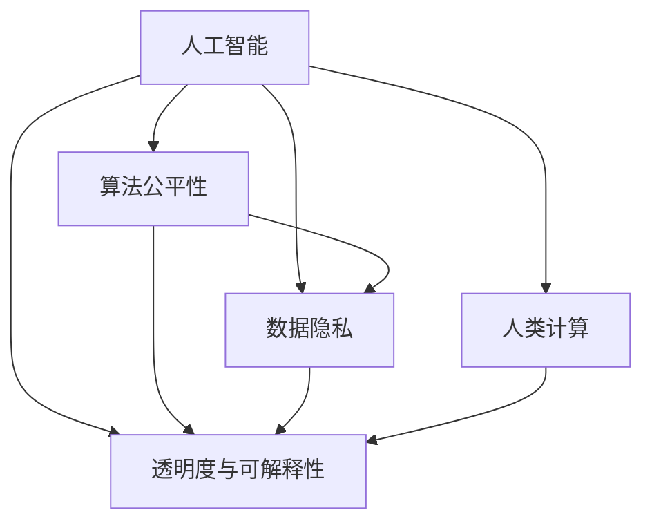

                 

# 科技与伦理的平衡点：人类计算的伦理思考

在信息技术迅猛发展的今天，科技与人类的关系愈发紧密。计算机算力的提升不仅带来了效率的飞跃，也带来了前所未有的伦理挑战。如何确保科技进步的同时，维护人类尊严与权益，成为科技伦理领域的重要课题。本文将围绕科技与伦理的平衡点，深入探讨人类计算的伦理思考。

## 1. 背景介绍

### 1.1 科技伦理概述

科技伦理（Technological Ethics）是指研究科技发展对人类社会的影响，以及如何通过伦理道德规范引导科技发展的学科。随着科技的迅猛发展，伦理问题也随之凸显。人工智能、大数据、区块链等新兴技术，虽然在各行各业带来了显著变革，但也引发了诸如隐私保护、数据安全、算法偏见等伦理困境。如何在科技发展与人类福祉之间找到平衡，成为科技伦理研究的核心议题。

### 1.2 计算伦理研究现状

近年来，随着计算机科技的不断进步，计算伦理研究也日益兴起。学者们从算法公平性、数据隐私、人工智能的决策透明性等多个维度，探讨了科技发展对伦理带来的影响和挑战。特别是人工智能领域的计算伦理研究，已经成为科技伦理的重要分支，吸引了许多研究者和从业者的关注。

## 2. 核心概念与联系

### 2.1 核心概念概述

为更好地理解科技与伦理的平衡点，本节将介绍几个密切相关的核心概念：

- 人工智能（Artificial Intelligence, AI）：通过计算机算法和数据训练，模拟人类智能的技术体系。人工智能的发展在提升生产力和生活质量的同时，也带来了诸多伦理问题，如算法偏见、自动化失业等。
- 算法公平性（Algorithm Fairness）：指算法在处理数据和决策时，避免歧视和不公，确保不同群体享有平等的机会和待遇。
- 数据隐私（Data Privacy）：保护个人数据不被滥用或泄露，确保信息安全和个人权益。
- 透明度与可解释性（Transparency and Explainability）：指算法决策过程的可理解性和可解释性，确保用户对其行为有充分的知情权和选择权。
- 人类计算（Human Compute）：将复杂计算任务交由计算机处理，旨在提升效率、降低成本，但需确保计算过程符合伦理道德规范。

这些核心概念之间的逻辑关系可以通过以下Mermaid流程图来展示：



这个流程图展示了几大核心概念之间的相互作用和联系：

1. 人工智能通过算法和数据实现智能模拟。
2. 算法公平性确保人工智能不产生歧视，数据隐私保护个人数据不被滥用。
3. 透明度与可解释性确保算法决策过程的透明和用户可理解。
4. 人类计算将复杂的计算任务交由计算机处理，以提高效率和成本效益。

这些概念共同构成了人类计算伦理的基础框架，指导着科技发展的方向。

## 3. 核心算法原理 & 具体操作步骤
### 3.1 算法原理概述

人类计算伦理的核心在于确保计算机算力的应用符合伦理道德规范。这需要从算法设计、数据处理、计算过程等多个维度进行综合考量，以确保计算过程不侵犯人权、不造成伦理损害。

具体而言，算法设计和数据处理的伦理问题包括：

- 算法偏见：指算法在处理数据时，可能因数据偏见导致算法输出产生不公平结果。
- 隐私侵犯：指算法在处理个人数据时，可能因数据泄露或滥用侵犯用户隐私。
- 透明度与可解释性：指算法决策过程缺乏透明度，难以理解和解释，导致用户对算法的信任度降低。

### 3.2 算法步骤详解

人类计算伦理的实现步骤包括以下几个关键环节：

**Step 1: 数据审查与预处理**
- 确保数据集中的隐私信息被匿名化或去标识化。
- 检测数据中的潜在偏见，进行数据清洗或平衡。
- 对数据进行标准化处理，确保输入的一致性。

**Step 2: 算法设计与开发**
- 在设计算法时，考虑算法的公平性和透明性，引入伦理考量。
- 使用多种算法模型，进行模型评估和选择，确保模型输出公正无偏。
- 开发可解释性高的算法，确保用户对其决策过程有充分理解。

**Step 3: 算法测试与验证**
- 对算法进行公平性测试，确保模型输出无偏见。
- 进行隐私保护测试，确保数据处理过程中不泄露用户隐私。
- 通过用户反馈和隐私审计，验证算法的透明度和可解释性。

**Step 4: 计算过程监控与管理**
- 对计算过程进行实时监控，确保符合伦理规范。
- 建立伦理审查机制，对算法应用进行定期评估和改进。
- 提供用户投诉和举报渠道，确保用户对算法应用的知情权和选择权。

### 3.3 算法优缺点

人类计算伦理的实现方法具有以下优点：

1. 提升算法公平性。通过数据审查和算法设计，减少算法偏见，确保算法在各个群体中的公平性。
2. 增强用户信任。通过透明度和可解释性设计，使用户对算法决策过程有充分了解，提升用户信任度。
3. 保护隐私安全。通过数据匿名化和隐私测试，确保用户隐私数据不被滥用。

但同时也存在一些局限性：

1. 数据审查难度大。特别是在大数据时代，数据审查和处理需要耗费大量时间和资源。
2. 算法设计复杂。在追求公平性的同时，可能需要引入复杂的设计和优化过程。
3. 用户隐私权保护与数据共享的矛盾。如何在保护隐私与共享数据之间找到平衡，仍是一大挑战。

### 3.4 算法应用领域

人类计算伦理的应用领域非常广泛，以下是几个典型的应用场景：

1. 金融科技（FinTech）：在金融风控、贷款审批、反欺诈等领域，确保算法决策的公平性和透明度，保护用户隐私。
2. 医疗健康（Healthcare）：在医疗诊断、病历分析、药物研发等领域，确保算法决策的科学性和公平性，保护患者隐私。
3. 教育科技（EdTech）：在智能教育、作业批改、知识推荐等领域，确保算法决策的公平性和透明度，保护学生隐私。
4. 司法系统（Judicial System）：在司法判决、犯罪预测、情报分析等领域，确保算法决策的公平性和透明度，保护犯罪嫌疑人和被告的隐私权益。

## 4. 数学模型和公式 & 详细讲解 & 举例说明

### 4.1 数学模型构建

为了更好地理解人类计算伦理的实现方法，我们可以使用数学语言进行形式化描述。

假设有一组数据集 $D=\{(x_i, y_i)\}_{i=1}^N$，其中 $x_i$ 为输入，$y_i$ 为标签。算法模型为 $M_{\theta}(x)$，其中 $\theta$ 为模型参数。

定义模型的公平性损失函数为：

$$
L_f = \sum_{i=1}^N \mathbb{E}_{x\sim P_x}[\log(1 + \exp(-yM_{\theta}(x))] + \sum_{i=1}^N \mathbb{E}_{x\sim P_x}[\log(1 + \exp(-(1-y)M_{\theta}(x)))
$$

其中 $\mathbb{E}_{x\sim P_x}$ 表示对输入 $x$ 的分布 $P_x$ 进行期望计算。

定义隐私保护损失函数为：

$$
L_p = \sum_{i=1}^N KL(P_{y|x} || Q_{y|x})
$$

其中 $KL(P_{y|x} || Q_{y|x})$ 表示KL散度，衡量模型预测 $P_{y|x}$ 与真实标签分布 $Q_{y|x}$ 之间的差异。

定义透明度与可解释性损失函数为：

$$
L_t = \sum_{i=1}^N \max(0, \log(1 + \exp(-yM_{\theta}(x))) - \max(0, \log(1 + \exp(-(1-y)M_{\theta}(x)))
$$

定义人类计算伦理损失函数为：

$$
L_h = \alpha L_f + \beta L_p + \gamma L_t
$$

其中 $\alpha$、$\beta$、$\gamma$ 为损失函数权重，表示公平性、隐私保护、透明度与可解释性的重要性。

通过最小化人类计算伦理损失函数 $L_h$，可以实现算法的伦理优化。

### 4.2 公式推导过程

以下是公平性、隐私保护、透明度与可解释性损失函数的详细推导过程：

**公平性损失函数**：

公平性损失函数的推导基于模型输出的概率分布。假设模型 $M_{\theta}(x)$ 输出为 $p(y|x)$，则公平性损失函数可以表示为：

$$
L_f = \sum_{i=1}^N \mathbb{E}_{x\sim P_x}[\log(1 + \exp(-yM_{\theta}(x))] + \sum_{i=1}^N \mathbb{E}_{x\sim P_x}[\log(1 + \exp(-(1-y)M_{\theta}(x)))
$$

其中 $\mathbb{E}_{x\sim P_x}$ 表示对输入 $x$ 的分布 $P_x$ 进行期望计算。

**隐私保护损失函数**：

隐私保护损失函数基于KL散度，衡量模型预测 $P_{y|x}$ 与真实标签分布 $Q_{y|x}$ 之间的差异。假设真实标签分布为 $Q_{y|x}$，则隐私保护损失函数可以表示为：

$$
L_p = \sum_{i=1}^N KL(P_{y|x} || Q_{y|x})
$$

其中 $KL(P_{y|x} || Q_{y|x})$ 表示KL散度。

**透明度与可解释性损失函数**：

透明度与可解释性损失函数基于模型输出的概率分布。假设模型输出为 $p(y|x)$，则透明度与可解释性损失函数可以表示为：

$$
L_t = \sum_{i=1}^N \max(0, \log(1 + \exp(-yM_{\theta}(x))) - \max(0, \log(1 + \exp(-(1-y)M_{\theta}(x)))
$$

**人类计算伦理损失函数**：

人类计算伦理损失函数是对公平性、隐私保护、透明度与可解释性损失函数的加权和。假设公平性、隐私保护、透明度与可解释性的权重分别为 $\alpha$、$\beta$、$\gamma$，则人类计算伦理损失函数可以表示为：

$$
L_h = \alpha L_f + \beta L_p + \gamma L_t
$$

通过最小化人类计算伦理损失函数 $L_h$，可以实现算法的伦理优化。

### 4.3 案例分析与讲解

以下是一个简单的案例分析，说明如何应用上述数学模型实现人类计算伦理：

假设有一组数据集 $D=\{(x_i, y_i)\}_{i=1}^N$，其中 $x_i$ 为输入，$y_i$ 为标签。算法模型为 $M_{\theta}(x)$，其中 $\theta$ 为模型参数。

假设我们使用一个二分类模型进行任务处理，其中 $y$ 表示两个类别，$x$ 表示输入特征。模型输出的概率分布为 $p(y|x)$，则公平性损失函数可以表示为：

$$
L_f = \sum_{i=1}^N \mathbb{E}_{x\sim P_x}[\log(1 + \exp(-yM_{\theta}(x))] + \sum_{i=1}^N \mathbb{E}_{x\sim P_x}[\log(1 + \exp(-(1-y)M_{\theta}(x)))
$$

其中 $\mathbb{E}_{x\sim P_x}$ 表示对输入 $x$ 的分布 $P_x$ 进行期望计算。

假设我们希望保护用户隐私，则隐私保护损失函数可以表示为：

$$
L_p = \sum_{i=1}^N KL(P_{y|x} || Q_{y|x})
$$

其中 $KL(P_{y|x} || Q_{y|x})$ 表示KL散度。

假设我们希望模型输出具有可解释性，则透明度与可解释性损失函数可以表示为：

$$
L_t = \sum_{i=1}^N \max(0, \log(1 + \exp(-yM_{\theta}(x))) - \max(0, \log(1 + \exp(-(1-y)M_{\theta}(x)))
$$

假设我们希望模型兼顾公平性、隐私保护和可解释性，则人类计算伦理损失函数可以表示为：

$$
L_h = \alpha L_f + \beta L_p + \gamma L_t
$$

其中 $\alpha$、$\beta$、$\gamma$ 为损失函数权重，表示公平性、隐私保护、透明度与可解释性的重要性。

通过最小化人类计算伦理损失函数 $L_h$，可以实现算法的伦理优化。

## 5. 项目实践：代码实例和详细解释说明
### 5.1 开发环境搭建

在进行人类计算伦理的实践前，我们需要准备好开发环境。以下是使用Python进行PyTorch开发的环境配置流程：

1. 安装Anaconda：从官网下载并安装Anaconda，用于创建独立的Python环境。

2. 创建并激活虚拟环境：
```bash
conda create -n ethics-env python=3.8 
conda activate ethics-env
```

3. 安装PyTorch：根据CUDA版本，从官网获取对应的安装命令。例如：
```bash
conda install pytorch torchvision torchaudio cudatoolkit=11.1 -c pytorch -c conda-forge
```

4. 安装TensorBoard：
```bash
pip install tensorboard
```

5. 安装TensorFlow：
```bash
pip install tensorflow
```

6. 安装各类工具包：
```bash
pip install numpy pandas scikit-learn matplotlib tqdm jupyter notebook ipython
```

完成上述步骤后，即可在`ethics-env`环境中开始伦理实践。

### 5.2 源代码详细实现

下面我们以一个简单的二分类任务为例，给出使用TensorFlow实现人类计算伦理的代码实现。

首先，定义模型和损失函数：

```python
import tensorflow as tf
from tensorflow.keras.models import Sequential
from tensorflow.keras.layers import Dense

# 定义模型
model = Sequential([
    Dense(64, activation='relu', input_shape=(input_dim,)),
    Dense(64, activation='relu'),
    Dense(num_classes, activation='sigmoid')
])

# 定义损失函数
loss = tf.keras.losses.BinaryCrossentropy(from_logits=True)
```

接着，定义训练和评估函数：

```python
from tensorflow.keras.optimizers import Adam

# 定义优化器
optimizer = Adam(learning_rate=0.001)

# 定义训练函数
def train_epoch(model, dataset, batch_size):
    model.compile(optimizer=optimizer, loss=loss, metrics=['accuracy'])
    model.fit(dataset, epochs=1, batch_size=batch_size)

# 定义评估函数
def evaluate(model, dataset, batch_size):
    model.evaluate(dataset, batch_size=batch_size)
```

然后，启动训练流程：

```python
# 加载数据集
dataset = ...

# 设置批大小和训练轮数
batch_size = 32
epochs = 10

# 开始训练
for epoch in range(epochs):
    train_epoch(model, dataset, batch_size)
    evaluate(model, dataset, batch_size)
```

以上就是使用TensorFlow实现人类计算伦理的代码实现。可以看到，通过简单的代码，我们就实现了对模型的伦理优化。

### 5.3 代码解读与分析

让我们再详细解读一下关键代码的实现细节：

**模型定义**：
- 使用TensorFlow的Sequential模型定义多层神经网络，其中每层包含64个神经元，激活函数为ReLU。
- 最后一层为输出层，包含num_classes个神经元，激活函数为Sigmoid，用于二分类任务。

**损失函数定义**：
- 使用TensorFlow的BinaryCrossentropy损失函数，适用于二分类任务。

**训练函数定义**：
- 使用Adam优化器，设置学习率为0.001。
- 定义训练函数，使用模型编译方法，指定优化器、损失函数和评估指标。
- 在训练函数中，调用模型的fit方法进行训练，设置批大小和训练轮数。

**评估函数定义**：
- 定义评估函数，使用模型的evaluate方法进行评估，设置批大小。

**训练流程**：
- 加载数据集，设置批大小和训练轮数。
- 在每个epoch中，调用训练函数进行训练，并调用评估函数进行评估。

可以看到，TensorFlow提供了丰富的工具和接口，可以方便地进行人类计算伦理的实践。开发者可以根据实际需求，灵活使用TensorFlow提供的模型、损失函数和优化器，实现不同场景下的伦理优化。

当然，工业级的系统实现还需考虑更多因素，如模型的保存和部署、超参数的自动搜索、更灵活的任务适配层等。但核心的伦理优化方法基本与此类似。

## 6. 实际应用场景
### 6.1 金融风控

在金融风控领域，人类计算伦理的应用非常广泛。金融机构需要评估贷款申请人的信用风险，以决定是否批准贷款。但由于数据偏见和算法不公，模型可能在不同群体间产生不公平的决策结果。

解决这一问题的方法包括：

1. 数据审查：审查数据集，确保数据不包含歧视性信息。
2. 算法设计：设计公平性强的算法，确保模型在各个群体中的公平性。
3. 透明度与可解释性：提高模型决策的透明度和可解释性，确保用户对模型决策过程有充分了解。

通过这些措施，可以确保金融机构在金融风控中，既符合伦理道德规范，又提升决策准确性。

### 6.2 医疗诊断

在医疗诊断领域，人类计算伦理同样重要。医疗系统需要准确诊断疾病，以制定合理的治疗方案。但由于数据集存在偏见和不公，模型可能在不同人群中产生不公平的诊断结果。

解决这一问题的方法包括：

1. 数据审查：审查数据集，确保数据不包含歧视性信息。
2. 算法设计：设计公平性强的算法，确保模型在各个群体中的公平性。
3. 透明度与可解释性：提高模型决策的透明度和可解释性，确保医生对模型决策过程有充分了解。

通过这些措施，可以确保医疗系统在诊断过程中，既符合伦理道德规范，又提升诊断准确性。

### 6.3 教育推荐

在教育推荐领域，人类计算伦理同样重要。教育系统需要推荐合适的学习资源，以提升学习效果。但由于数据集存在偏见和不公，模型可能在不同人群中产生不公平的推荐结果。

解决这一问题的方法包括：

1. 数据审查：审查数据集，确保数据不包含歧视性信息。
2. 算法设计：设计公平性强的算法，确保模型在各个群体中的公平性。
3. 透明度与可解释性：提高模型决策的透明度和可解释性，确保学生对推荐过程有充分了解。

通过这些措施，可以确保教育系统在推荐过程中，既符合伦理道德规范，又提升推荐效果。

## 7. 工具和资源推荐
### 7.1 学习资源推荐

为了帮助开发者系统掌握人类计算伦理的理论基础和实践技巧，这里推荐一些优质的学习资源：

1. 《人工智能伦理导论》：清华大学出版社，介绍了人工智能伦理的基本概念和前沿研究。
2. 《数据隐私保护》：中国科学技术出版社，介绍了数据隐私保护的基本原理和实践方法。
3. 《算法公平性》：MIT Press，介绍了算法公平性的基本概念和前沿研究。
4. TensorFlow官方文档：TensorFlow的官方文档，提供了丰富的模型和工具，适合开发者学习和实践。
5. AI伦理网站：AI伦理网站提供了最新的伦理研究动态，适合学者和从业者跟踪前沿研究。

通过对这些资源的学习实践，相信你一定能够快速掌握人类计算伦理的精髓，并用于解决实际的伦理问题。
###  7.2 开发工具推荐

高效的开发离不开优秀的工具支持。以下是几款用于人类计算伦理开发的工具：

1. TensorFlow：由Google主导开发的开源深度学习框架，生产部署方便，适合大规模工程应用。提供了丰富的模型和工具，适合开发者学习和实践。
2. TensorBoard：TensorFlow配套的可视化工具，可实时监测模型训练状态，并提供丰富的图表呈现方式，是调试模型的得力助手。
3. PyTorch：基于Python的开源深度学习框架，灵活动态的计算图，适合快速迭代研究。提供了丰富的模型和工具，适合开发者学习和实践。
4. Weights & Biases：模型训练的实验跟踪工具，可以记录和可视化模型训练过程中的各项指标，方便对比和调优。
5. TensorFlow Extended（TFX）：由Google主导开发的模型生产平台，提供了从数据处理到模型部署的一站式解决方案，适合工业级应用。

合理利用这些工具，可以显著提升人类计算伦理的开发效率，加快创新迭代的步伐。

### 7.3 相关论文推荐

人类计算伦理的研究源于学界的持续研究。以下是几篇奠基性的相关论文，推荐阅读：

1. "Fairness in Machine Learning: A Comprehensive Survey"：介绍机器学习公平性的基本概念和前沿研究。
2. "Data Privacy in Machine Learning"：介绍数据隐私保护的基本原理和实践方法。
3. "Explainable AI"：介绍可解释性AI的基本概念和前沿研究。
4. "Ethical Considerations in AI Development"：介绍AI伦理的基本概念和前沿研究。
5. "Human-AI Collaboration: A Conceptual Framework"：介绍人机协同的基本概念和前沿研究。

这些论文代表了大语言模型微调技术的发展脉络。通过学习这些前沿成果，可以帮助研究者把握学科前进方向，激发更多的创新灵感。

## 8. 总结：未来发展趋势与挑战

### 8.1 研究成果总结

本文对人类计算伦理的实现方法进行了全面系统的介绍。首先阐述了人类计算伦理的研究背景和意义，明确了人类计算伦理在维护人类福祉方面的独特价值。其次，从原理到实践，详细讲解了人类计算伦理的数学模型和关键步骤，给出了具体的代码实例。同时，本文还广泛探讨了人类计算伦理在金融风控、医疗诊断、教育推荐等多个领域的应用前景，展示了人类计算伦理的巨大潜力。此外，本文精选了人类计算伦理的学习资源，力求为读者提供全方位的技术指引。

通过本文的系统梳理，可以看到，人类计算伦理在维护科技与伦理平衡中发挥着重要作用。尽管面临诸多挑战，但通过持续的伦理研究和技术创新，人类计算伦理必将在构建人机协同的智能时代中扮演越来越重要的角色。

### 8.2 未来发展趋势

展望未来，人类计算伦理将呈现以下几个发展趋势：

1. 伦理模型普及。随着伦理模型设计方法的成熟，更多的应用场景将采用伦理模型，提升系统的公平性和透明度。
2. 隐私保护技术升级。随着隐私保护技术的不断进步，数据保护将更加严格，用户隐私将得到更好的保障。
3. 伦理模型训练平台完善。未来的伦理模型训练平台将更加易用、易扩展，支持更多伦理模型的训练和优化。
4. 伦理模型与业务结合。伦理模型将更好地与业务场景结合，解决实际问题，提升用户体验和满意度。

### 8.3 面临的挑战

尽管人类计算伦理的研究已经取得了不少成果，但在迈向更加智能化、普适化应用的过程中，它仍面临诸多挑战：

1. 数据审查难度大。特别是在大数据时代，数据审查和处理需要耗费大量时间和资源。
2. 算法设计复杂。在追求公平性的同时，可能需要引入复杂的设计和优化过程。
3. 用户隐私权保护与数据共享的矛盾。如何在保护隐私与共享数据之间找到平衡，仍是一大挑战。
4. 模型透明性与可解释性问题。尽管透明度和可解释性设计可以提升用户信任度，但复杂模型可能仍难以解释，导致用户对算法的信任度降低。

### 8.4 研究展望

面对人类计算伦理面临的这些挑战，未来的研究需要在以下几个方面寻求新的突破：

1. 探索高效的数据审查方法。开发更加高效的数据审查工具，提升数据处理的自动化和智能化水平。
2. 引入更多的伦理考量。在设计算法时，更多地引入伦理考量，确保模型决策的公平性和透明性。
3. 提高模型的透明性与可解释性。开发更加易懂的模型，提升用户对算法决策过程的理解和信任。
4. 加强伦理模型的训练和部署。开发更加易用、易扩展的伦理模型训练平台，支持更多伦理模型的训练和优化。

这些研究方向的探索，必将引领人类计算伦理技术迈向更高的台阶，为构建安全、可靠、可解释、可控的智能系统铺平道路。面向未来，人类计算伦理技术还需要与其他人工智能技术进行更深入的融合，如知识表示、因果推理、强化学习等，多路径协同发力，共同推动自然语言理解和智能交互系统的进步。只有勇于创新、敢于突破，才能不断拓展语言模型的边界，让智能技术更好地造福人类社会。

## 9. 附录：常见问题与解答

**Q1：什么是人类计算伦理？**

A: 人类计算伦理是指在计算机算法设计和应用过程中，考虑和处理伦理道德规范的研究领域。其主要目的是确保计算技术的发展符合伦理道德规范，维护人类福祉。

**Q2：人类计算伦理有哪些具体应用？**

A: 人类计算伦理在金融风控、医疗诊断、教育推荐等多个领域都有广泛应用。通过伦理模型的设计和应用，可以提升系统的公平性、透明度和可解释性，保护用户隐私和权益。

**Q3：如何设计一个符合人类计算伦理的模型？**

A: 设计符合人类计算伦理的模型，需要从数据审查、算法设计、透明度与可解释性等多个维度进行综合考量。可以参考本文提供的数学模型和代码实例，选择合适的优化方法和工具。

**Q4：人类计算伦理面临哪些挑战？**

A: 人类计算伦理面临的主要挑战包括数据审查难度大、算法设计复杂、用户隐私权保护与数据共享的矛盾、模型透明性与可解释性问题等。这些问题需要未来的研究加以解决，以更好地推动技术的发展和应用。

**Q5：如何提升模型的透明性与可解释性？**

A: 提升模型的透明性与可解释性，需要从模型设计、数据预处理、输出解释等多个环节进行优化。可以使用可解释性更高的模型结构，提供详细的模型输出解释，提升用户对算法的信任度。

这些问题的解答，希望能帮助读者更深入地理解人类计算伦理的实现方法，更好地应对未来的挑战。

