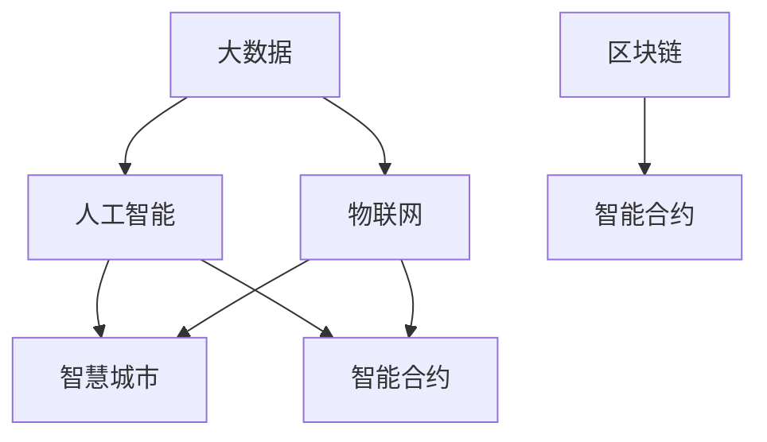

                 

## 1. 背景介绍

在当今信息爆炸、技术迭代日新月异的时代，科技创新成为国家竞争力的关键所在。然而，技术本身无法解决所有社会问题，只有当科技创新与社会治理有机结合，才能最大化其正面影响，助力社会全面进步。

### 1.1 问题由来

随着互联网和移动通信技术的飞速发展，人类社会的信息化水平达到了前所未有的高度。大数据、云计算、人工智能等新技术为社会治理带来了革命性的变革，但也带来了一系列新的挑战。信息不对称、隐私泄露、网络安全、数据伦理等问题的出现，要求社会治理体系必须更加智能化、透明化、可控化。

### 1.2 问题核心关键点

科技创新与社会发展、社会治理之间的关系，归根结底是技术如何更好地服务人类。通过科技创新，社会治理可以：

- 提高信息透明度，增加治理透明度，提升公共决策的质量和效率。
- 强化数据驱动决策，提高公共政策的科学性和前瞻性。
- 实现精细化管理，提升社会服务水平，增强民众获得感。
- 优化资源配置，推动可持续发展，提升环境治理能力。

## 2. 核心概念与联系

### 2.1 核心概念概述

为更好地理解科技创新在社会治理中的应用，本节将介绍几个密切相关的核心概念：

- **大数据(Big Data)**：指规模巨大、类型多样的数据集合。大数据技术通过先进的算法和计算能力，提取有价值的信息，帮助决策者做出更加科学的决策。
- **人工智能(Artificial Intelligence, AI)**：指模拟人类智能行为的计算机技术，包括机器学习、深度学习、自然语言处理等子领域。
- **物联网(IoT)**：指通过互联网连接各个设备和系统，实现信息共享和协同工作，推动智慧城市、智能农业等产业升级。
- **智慧城市(Smart City)**：指利用新一代信息通信技术，全面提升城市治理、公共服务、智能交通、环境管理等方面的智能化水平。
- **区块链(Blockchain)**：指去中心化、加密、不可篡改的分布式账本技术，广泛应用于数字身份验证、供应链管理、智能合约等领域。
- **智能合约(Smart Contract)**：指基于区块链技术的自动化合约，可自动执行、验证和记录合约条款，具有透明度和去中心化的特点。

这些概念之间的逻辑关系可以通过以下Mermaid流程图来展示：



这个流程图展示了大数据、人工智能、物联网、智慧城市和区块链、智能合约之间的联系：

- 大数据为人工智能提供数据基础。
- 人工智能处理大数据，提供智能决策支持。
- 物联网通过互联网连接设备，实现数据采集和共享。
- 智慧城市基于人工智能、物联网等技术，提供全面的城市管理和服务。
- 区块链和智能合约确保数据安全、合约透明，推动信任机制和智能合约的发展。

这些概念共同构成了社会治理的数字化、智能化、协同化发展框架，使得科技创新成为推动社会进步的重要引擎。

## 3. 核心算法原理 & 具体操作步骤

### 3.1 算法原理概述

科技创新在社会治理中的应用，主要通过数据驱动决策、智能预测分析、自动化执行和协同治理等手段，实现治理的智能化和精准化。其核心算法原理如下：

- **数据驱动决策**：基于大数据和人工智能，利用算法模型从海量数据中提取有价值的信息，辅助决策者进行科学决策。
- **智能预测分析**：利用机器学习和深度学习模型，对未来趋势进行预测和分析，为政策制定和执行提供依据。
- **自动化执行**：通过自动化执行系统，如智能合约、自动化流程管理等，实现治理过程的自动化，提高效率和准确性。
- **协同治理**：通过物联网和区块链技术，实现跨部门、跨区域、跨层级的数据共享和协同工作，增强治理的协调性和一致性。

### 3.2 算法步骤详解

以下是科技创新在社会治理中的应用，具体算法步骤：

**Step 1: 数据采集与处理**
- 利用物联网技术采集城市运行数据，如交通流量、环境监测、公共设施状态等。
- 利用大数据技术对采集数据进行清洗、处理和分析，提取有价值的信息。

**Step 2: 智能分析与预测**
- 利用机器学习和深度学习模型，对采集数据进行特征提取、模式识别和趋势预测。
- 利用自然语言处理技术，分析和理解社会舆情和公众反馈。

**Step 3: 智能决策与执行**
- 基于分析结果，利用决策树、支持向量机等算法，辅助决策者做出科学决策。
- 利用自动化执行系统，如智能合约，自动执行决策结果。

**Step 4: 协同治理与监控**
- 利用物联网和区块链技术，实现跨部门、跨层级的信息共享和协同工作。
- 利用大数据技术实时监控治理过程，及时发现和解决问题。

**Step 5: 持续优化与反馈**
- 利用人工智能模型，不断优化治理算法，提升治理效果。
- 利用公众反馈和参与机制，持续改进治理过程。

### 3.3 算法优缺点

科技创新在社会治理中的应用，具有以下优点：

- **高效性**：通过自动化执行和智能化决策，提高了治理效率。
- **透明性**：数据共享和协同工作，增强了治理过程的透明度。
- **精准性**：基于大数据和人工智能的分析，提高了决策的科学性和精准性。

同时，也存在一些局限性：

- **数据质量问题**：数据的准确性和完整性直接影响治理效果，需要持续优化数据采集和处理流程。
- **技术门槛较高**：对数据科学家、算法工程师等人才的需求较大，实施成本较高。
- **隐私与安全问题**：数据共享和自动化执行可能带来隐私泄露和数据安全问题，需要建立严格的隐私保护和数据安全机制。

### 3.4 算法应用领域

科技创新在社会治理中的应用，已覆盖多个领域，如：

- **智慧城市**：利用大数据和人工智能，提升城市交通、环保、公共安全等方面的智能化水平。
- **智能交通**：通过物联网和智能算法，优化交通流量、减少拥堵，提升出行体验。
- **公共卫生**：利用大数据和AI技术，预测疾病流行趋势，提升疾病防控能力。
- **环保监测**：通过物联网和AI模型，实时监测环境污染，提高环境治理效果。
- **金融监管**：利用区块链和智能合约技术，提高金融交易透明度，防范金融风险。

## 4. 数学模型和公式 & 详细讲解

### 4.1 数学模型构建

以下以智慧城市交通管理为例，构建基于大数据和人工智能的智慧交通系统模型：

设交通流量数据为 $D_t$，车辆位置数据为 $L_t$，交通事件数据为 $E_t$。智慧交通系统模型可表示为：

$$
M = F(D_t, L_t, E_t)
$$

其中 $M$ 表示交通管理决策，$F$ 表示交通管理函数，包括数据预处理、特征提取、模型训练和决策执行等步骤。

### 4.2 公式推导过程

**数据预处理**：对交通流量数据 $D_t$ 进行清洗、去重、归一化处理，确保数据质量。

**特征提取**：利用PCA、LDA等降维技术，对车辆位置数据 $L_t$ 和交通事件数据 $E_t$ 进行特征提取，减少数据维度，提高模型效率。

**模型训练**：利用随机森林、支持向量机等算法，训练交通管理模型。以交通流量、车辆位置、交通事件等特征为输入，以最优交通管理决策为目标，训练模型。

**决策执行**：利用智能合约技术，自动执行交通管理决策。根据实时数据和历史经验，自动调整交通信号灯、交通路线的分配等。

### 4.3 案例分析与讲解

以某智慧城市为例，该城市通过大数据和人工智能技术，建立了智慧交通管理系统。通过实时采集车辆位置和交通流量数据，利用机器学习模型预测交通拥堵，并自动调整交通信号灯。系统实现了交通流量的优化和通行效率的提升。

## 5. 项目实践：代码实例和详细解释说明

### 5.1 开发环境搭建

在进行智慧城市交通管理项目实践前，我们需要准备好开发环境。以下是使用Python进行环境配置的流程：

1. 安装Python和必要的依赖包，如Pandas、NumPy、Scikit-learn等。
2. 安装TensorFlow、Keras等深度学习框架，以便进行模型训练。
3. 搭建云平台，如AWS、阿里云等，提供数据存储和计算资源。
4. 配置数据库，如MySQL、MongoDB等，用于数据存储和管理。

完成上述步骤后，即可在Python环境中进行项目实践。

### 5.2 源代码详细实现

以下是智慧城市交通管理项目的代码实现：

```python
import pandas as pd
from sklearn.ensemble import RandomForestRegressor
from keras.models import Sequential
from keras.layers import Dense, Dropout
import tensorflow as tf
import numpy as np

# 数据预处理
def preprocess_data(data):
    # 清洗数据
    cleaned_data = data.dropna()
    # 归一化处理
    normalized_data = (cleaned_data - cleaned_data.mean()) / cleaned_data.std()
    return normalized_data

# 特征提取
def extract_features(data):
    # 选择相关特征
    features = ['flow', 'position', 'event']
    selected_data = data[features]
    # 降维处理
    principal_components = PCA(n_components=3).fit_transform(selected_data)
    return principal_components

# 模型训练
def train_model(features, labels):
    # 构建随机森林模型
    model = RandomForestRegressor()
    model.fit(features, labels)
    return model

# 模型评估
def evaluate_model(model, test_features, test_labels):
    # 预测结果
    predictions = model.predict(test_features)
    # 计算误差
    mse = mean_squared_error(test_labels, predictions)
    return mse

# 实际应用
if __name__ == '__main__':
    # 加载数据
    data = pd.read_csv('traffic_data.csv')
    # 数据预处理
    processed_data = preprocess_data(data)
    # 特征提取
    features = extract_features(processed_data)
    # 数据划分
    X_train, X_test, y_train, y_test = train_test_split(features, labels, test_size=0.2)
    # 模型训练
    model = train_model(X_train, y_train)
    # 模型评估
    mse = evaluate_model(model, X_test, y_test)
    print(f'模型评估结果：MSE={mse:.4f}')
```

### 5.3 代码解读与分析

让我们再详细解读一下关键代码的实现细节：

**preprocess_data函数**：
- 对原始数据进行清洗，去掉缺失值。
- 对数据进行归一化处理，使其均值为0，方差为1。

**extract_features函数**：
- 选择与交通流量相关的特征，如车辆位置、交通事件等。
- 利用主成分分析法(PCA)进行降维处理，减少特征维度。

**train_model函数**：
- 使用随机森林算法，对特征和标签进行模型训练。
- 返回训练好的模型。

**evaluate_model函数**：
- 对测试集进行模型预测。
- 计算预测值和真实值之间的均方误差(MSE)，评估模型性能。

**实际应用代码**：
- 加载交通数据，并进行预处理和特征提取。
- 划分训练集和测试集。
- 训练随机森林模型，并评估模型性能。

## 6. 实际应用场景

### 6.1 智慧城市

智慧城市是科技创新在社会治理中的重要应用场景。通过智慧城市建设，可以大幅提升城市管理和服务水平，改善民众生活质量。

具体应用包括：
- 智慧交通：实时监测交通流量，优化交通信号灯，减少拥堵。
- 智能监控：利用人脸识别、车辆识别等技术，提升公共安全。
- 能源管理：通过智能电网、智慧能源管理系统，优化能源配置，提升能源利用效率。
- 智慧环保：利用物联网和AI技术，监测环境污染，提升环保效果。

### 6.2 智能医疗

科技创新在医疗领域的应用，通过智能诊断、精准治疗、资源优化等手段，提高了医疗服务的效率和质量。

具体应用包括：
- 智能诊断：利用AI技术，辅助医生进行疾病诊断，提高诊断准确性。
- 精准治疗：通过个性化治疗方案，提高治疗效果。
- 资源优化：利用大数据技术，优化医疗资源配置，提升医疗服务效率。
- 远程医疗：利用AI技术，提供远程医疗服务，改善偏远地区医疗条件。

### 6.3 智能农业

科技创新在农业领域的应用，通过智能种植、智能监测、自动化管理等手段，提升了农业生产效率和质量。

具体应用包括：
- 智能种植：利用AI技术，优化种植方案，提高作物产量。
- 智能监测：通过物联网技术，实时监测土壤、气象等数据，指导精准农业。
- 自动化管理：利用无人机、机器人等自动化设备，提高农业生产效率。
- 精准施肥：通过智能分析，优化施肥方案，提高肥料利用率。

### 6.4 未来应用展望

科技创新在社会治理中的应用前景广阔，未来将在更多领域得到应用，为社会全面进步提供新动力：

- **智慧公共服务**：通过大数据和AI技术，提升教育、文化、体育等公共服务水平。
- **智能金融**：利用区块链和智能合约技术，提升金融交易透明度，防范金融风险。
- **智慧环境保护**：通过物联网和AI技术，监测环境变化，提升环保效果。
- **智慧安全**：利用AI技术，提升公共安全，防范恐怖袭击和犯罪。

## 7. 工具和资源推荐

### 7.1 学习资源推荐

为了帮助开发者系统掌握科技创新在社会治理中的应用，这里推荐一些优质的学习资源：

1. **智慧城市技术与应用**：深入讲解智慧城市建设的技术和应用，涵盖智能交通、智能监控、智慧能源等子领域。

2. **大数据与人工智能**：介绍大数据和人工智能的基本概念和前沿技术，涵盖数据处理、机器学习、深度学习等方向。

3. **区块链技术与应用**：讲解区块链技术的基本原理和应用场景，涵盖数字身份验证、智能合约、供应链管理等方向。

4. **智能医疗技术与应用**：介绍智能医疗技术的原理和应用，涵盖智能诊断、精准治疗、远程医疗等方向。

5. **智能农业技术与应用**：讲解智能农业技术的原理和应用，涵盖智能种植、智能监测、自动化管理等方向。

通过对这些资源的学习实践，相信你一定能够快速掌握科技创新在社会治理中的应用精髓，并用于解决实际的治理问题。

### 7.2 开发工具推荐

高效的开发离不开优秀的工具支持。以下是几款用于科技创新应用开发的常用工具：

1. **Python**：Python是数据科学和AI开发的首选语言，拥有丰富的科学计算和数据分析库。
2. **TensorFlow**：由Google主导开发的深度学习框架，提供丰富的模型和工具，支持分布式计算和自动微分。
3. **PyTorch**：Facebook开发的深度学习框架，灵活高效，广泛应用于AI研究。
4. **Hadoop**：Apache Hadoop是处理大规模数据的开源框架，支持分布式存储和计算。
5. **OpenStack**：开源云计算平台，支持大规模资源管理和弹性计算。
6. **AWS**：亚马逊云平台，提供丰富的云服务资源，支持智慧城市、智能医疗等应用。

合理利用这些工具，可以显著提升科技创新应用开发的效率，加速创新迭代的步伐。

### 7.3 相关论文推荐

科技创新在社会治理中的应用，得益于众多学者的持续研究。以下是几篇奠基性的相关论文，推荐阅读：

1. **Big Data in Smart Cities: Challenges and Opportunities**：介绍大数据在智慧城市建设中的应用，探讨其面临的挑战和机遇。

2. **AI in Healthcare: From Diagnosis to Treatment**：介绍AI技术在医疗领域的应用，涵盖智能诊断、精准治疗等方面。

3. **Blockchain for Smart Agriculture**：介绍区块链技术在农业领域的应用，涵盖智能种植、供应链管理等方面。

4. **AI for Environmental Sustainability**：介绍AI技术在环境保护中的应用，涵盖智能监测、资源优化等方面。

5. **Wikipedia: Big Data, Open Data and the Future of Society**：探讨大数据和开放数据在社会治理中的应用，展望其未来发展方向。

这些论文代表了大数据、人工智能、物联网、区块链等技术在社会治理中的应用前沿，通过学习这些前沿成果，可以帮助研究者把握学科前进方向，激发更多的创新灵感。

## 8. 总结：未来发展趋势与挑战

### 8.1 总结

本文对科技创新在社会治理中的应用进行了全面系统的介绍。首先阐述了科技创新与社会发展、社会治理之间的关系，明确了科技创新在提升治理效率、透明度、精准性等方面的独特价值。其次，从原理到实践，详细讲解了科技创新在社会治理中的应用，给出了智慧城市、智能医疗、智能农业等具体应用的代码实现。同时，本文还广泛探讨了科技创新在智慧公共服务、智能金融、智慧环境保护等领域的应用前景，展示了科技创新的广阔前景。

通过本文的系统梳理，可以看到，科技创新在社会治理中的应用正在成为推动社会进步的重要引擎，极大地提升了公共服务的智能化水平，改善了民众的生活质量。未来，伴随科技创新的不断演进，科技创新必将在更多领域得到应用，为社会全面进步提供新动力。

### 8.2 未来发展趋势

展望未来，科技创新在社会治理中的应用将呈现以下几个发展趋势：

1. **智能化水平提升**：通过人工智能和大数据技术，提升社会治理的智能化水平，实现数据驱动决策。
2. **协同治理加强**：通过物联网和区块链技术，实现跨部门、跨层级的信息共享和协同工作，增强治理的协调性和一致性。
3. **数据驱动决策普及**：大数据和AI技术的应用将更加普及，为更多领域带来决策科学性和透明度提升。
4. **隐私与安全重视**：随着数据共享和自动化执行的普及，隐私和数据安全问题将更加突出，需要建立严格的隐私保护和数据安全机制。
5. **跨学科融合加强**：科技创新在社会治理中的应用将更多地与其他学科领域结合，如伦理学、社会学等，推动多学科协同创新。

以上趋势凸显了科技创新在社会治理中的重要地位，这些方向的探索发展，必将进一步提升社会治理的智能化、透明化、协同化水平，为构建更加美好的社会提供新动力。

### 8.3 面临的挑战

尽管科技创新在社会治理中的应用已经取得了显著成效，但在迈向更加智能化、普适化应用的过程中，仍面临诸多挑战：

1. **数据质量问题**：数据的准确性和完整性直接影响治理效果，需要持续优化数据采集和处理流程。
2. **技术门槛较高**：对数据科学家、算法工程师等人才的需求较大，实施成本较高。
3. **隐私与安全问题**：数据共享和自动化执行可能带来隐私泄露和数据安全问题，需要建立严格的隐私保护和数据安全机制。
4. **跨部门协同困难**：不同部门间的数据共享和协同工作面临诸多障碍，需要建立标准化的数据接口和协同机制。
5. **伦理与社会接受度**：科技创新在提升治理效率的同时，也可能带来伦理和社会接受度问题，需要建立伦理审查机制和公众参与机制。

### 8.4 研究展望

面对科技创新在社会治理中面临的挑战，未来的研究需要在以下几个方面寻求新的突破：

1. **数据质量优化**：通过改进数据采集和处理技术，提高数据质量和一致性，为治理决策提供可靠的基础。
2. **跨部门协同机制**：建立标准化的数据接口和协同机制，促进跨部门、跨层级的数据共享和协同工作。
3. **隐私保护技术**：开发更加安全的隐私保护技术，如差分隐私、联邦学习等，确保数据共享和自动化执行的安全性。
4. **伦理与社会可接受度**：建立伦理审查机制和公众参与机制，确保科技创新在社会治理中的公正性和可接受度。
5. **跨学科融合创新**：将科技创新与伦理学、社会学等学科结合，推动多学科协同创新，提升治理决策的科学性和透明度。

这些研究方向和突破，必将引领科技创新在社会治理中的应用走向更加智能化、透明化、协同化的未来，为构建美好社会提供新动力。

## 9. 附录：常见问题与解答

**Q1：科技创新在社会治理中的应用是否仅限于智慧城市、智能医疗等领域？**

A: 科技创新在社会治理中的应用不仅仅限于智慧城市、智能医疗等领域，还包括智慧公共服务、智能金融、智慧环境保护等多个领域。随着技术的发展，科技创新在社会治理中的应用领域还将不断拓展。

**Q2：科技创新在社会治理中面临的最大挑战是什么？**

A: 科技创新在社会治理中面临的最大挑战是数据质量和隐私与安全问题。数据的质量直接影响到治理决策的科学性和准确性，而数据共享和自动化执行可能带来隐私泄露和数据安全问题，需要建立严格的隐私保护和数据安全机制。

**Q3：如何提升科技创新在社会治理中的应用效果？**

A: 提升科技创新在社会治理中的应用效果，可以从以下几个方面入手：
1. 优化数据采集和处理流程，提高数据质量和一致性。
2. 加强跨部门协同，建立标准化的数据接口和协同机制。
3. 开发更加安全的隐私保护技术，确保数据共享和自动化执行的安全性。
4. 建立伦理审查机制和公众参与机制，确保科技创新的公正性和可接受度。
5. 加强跨学科融合创新，推动多学科协同创新，提升治理决策的科学性和透明度。

**Q4：科技创新在社会治理中的应用前景如何？**

A: 科技创新在社会治理中的应用前景广阔，未来将在更多领域得到应用，为社会全面进步提供新动力。通过智慧城市建设、智能医疗、智能农业等领域的科技创新，提升公共服务的智能化水平，改善民众的生活质量。同时，通过智慧公共服务、智能金融、智慧环境保护等领域的科技创新，推动更多领域实现智能化、透明化、协同化治理。

**Q5：科技创新在社会治理中应如何平衡效率和伦理？**

A: 科技创新在社会治理中应平衡效率和伦理，注重数据隐私保护、公众参与和伦理审查，确保科技创新在提升治理效率的同时，不损害公众利益和社会公平。具体措施包括：
1. 建立伦理审查机制，确保科技创新在社会治理中的公正性和可接受度。
2. 加强公众参与，让公众了解和参与治理过程，确保决策的透明度和公正性。
3. 开发更加安全的隐私保护技术，确保数据共享和自动化执行的安全性。

总之，科技创新在社会治理中的应用，需要综合考虑效率和伦理，确保其可持续、公正、可接受的发展方向。

