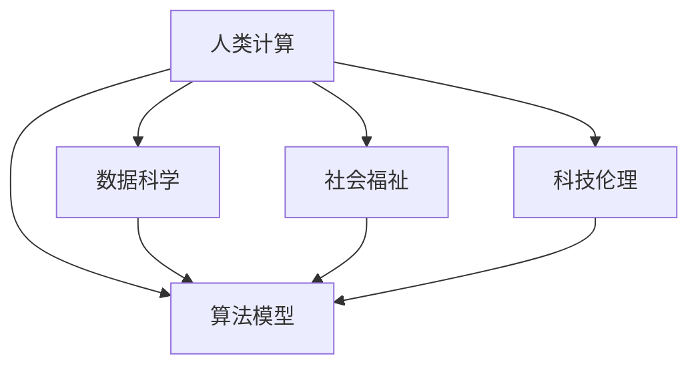

                 

# 科技向善：利用人类计算促进社会进步

> 关键词：人类计算,社会进步,科技伦理,数据科学,社会福祉

## 1. 背景介绍

### 1.1 问题由来
科技的迅猛发展在极大地改善人类生活的同时，也引发了一系列社会伦理与道德问题。从隐私泄露、算法偏见，到网络欺诈、信息过载，科技的负面效应日益凸显。如何在追求技术进步的同时，确保其带给社会的正面效益，成为当今社会亟需解决的重要课题。

### 1.2 问题核心关键点
人类计算，作为驱动科技发展的重要力量，其实质是将人类的智慧和计算能力结合，利用数据科学和算法模型来解决现实问题。在推动社会进步的过程中，人类计算不仅是技术创新的工具，更是连接人类智慧与机器智能的桥梁。

在这一过程中，科技伦理和社会福祉成为不可忽视的关键要素。如何构建公平、透明、可解释的科技体系，确保技术进步惠及全人类，成为当前科技界和社会各界共同关注的焦点。

## 2. 核心概念与联系

### 2.1 核心概念概述

为更好地理解人类计算在推动社会进步中的作用，本节将介绍几个密切相关的核心概念：

- **人类计算(Human Computing)**：指通过收集、分析和处理人类数据，利用人工智能、数据科学等技术解决社会问题，推动社会进步的过程。
- **数据科学(Data Science)**：涉及数据的收集、处理、分析和可视化，是实现人类计算的基础工具。
- **算法模型(Algorithms)**：用于处理数据、提取规律、进行预测和决策的数学模型，是人类计算的核心技术。
- **社会福祉(Social Welfare)**：指通过科技手段提升社会公平、健康、教育等领域的福祉，改善人民生活质量。
- **科技伦理(Ethics in Technology)**：研究科技发展对社会伦理和道德的影响，以及如何制定合理的科技应用准则。

这些核心概念之间的逻辑关系可以通过以下Mermaid流程图来展示：



这个流程图展示了她类概念之间的关系：

1. 人类计算利用数据科学和算法模型来解决社会问题。
2. 数据科学为人类计算提供数据支撑。
3. 算法模型是处理和分析数据的工具。
4. 社会福祉是目标，旨在提升社会整体福祉。
5. 科技伦理规范科技应用，确保其不会对社会造成伤害。

## 3. 核心算法原理 & 具体操作步骤
### 3.1 算法原理概述

人类计算的核心在于利用算法模型，从海量数据中提取有价值的知识和规律，并应用这些知识解决社会问题。这一过程包括数据收集、数据预处理、模型训练和模型应用四个阶段。

### 3.2 算法步骤详解

1. **数据收集**：从各种渠道获取与目标问题相关的数据，如问卷调查、传感器数据、社交媒体数据等。

2. **数据预处理**：清洗和处理数据，去除噪声和缺失值，进行特征工程，将原始数据转换为可供模型训练的格式。

3. **模型训练**：选择合适的算法模型，如分类、回归、聚类、强化学习等，并利用训练数据进行模型训练，调整模型参数，提高模型预测能力。

4. **模型应用**：将训练好的模型应用于实际问题，进行预测、分类、推荐等任务，并根据反馈不断优化模型。

### 3.3 算法优缺点

人类计算具有以下优点：

1. **数据驱动**：能够通过数据分析和模型训练，找到问题的本质规律，解决复杂社会问题。
2. **高度灵活**：适用于各种类型的社会问题，如疾病预测、资源分配、城市规划等。
3. **高效性**：通过自动化算法，大幅提升问题解决的效率和精度。

但同时也存在一些局限性：

1. **隐私问题**：数据收集和处理过程中可能涉及个人隐私，需要严格的数据保护措施。
2. **算法偏见**：模型训练数据可能存在偏差，导致模型输出带有偏见，需进行数据清洗和模型调整。
3. **可解释性**：复杂模型如深度学习难以解释其内部工作机制，影响模型可信度。
4. **伦理风险**：科技应用可能带来伦理问题，如隐私侵犯、数据滥用等，需严格监管。

### 3.4 算法应用领域

人类计算在多个领域都有广泛应用，以下是几个典型案例：

- **公共卫生**：利用数据科学和算法模型，预测疾病爆发趋势，优化医疗资源配置，提升公共卫生水平。
- **环境保护**：通过环境监测数据，预测污染趋势，优化资源利用，保护生态环境。
- **教育**：分析学生学习行为数据，提供个性化教学方案，提升教育质量。
- **城市管理**：利用城市运行数据，优化交通、能源、公共设施等城市资源管理，提高城市生活质量。

这些领域的应用展示了人类计算在推动社会进步中的重要作用。

## 4. 数学模型和公式 & 详细讲解 & 举例说明

### 4.1 数学模型构建

以疾病预测为例，我们可以构建如下的数学模型：

设 $D = \{(x_i,y_i)\}_{i=1}^N$ 为训练集，其中 $x_i$ 为病人年龄、性别、病情等特征向量，$y_i$ 为疾病状态（0表示未感染，1表示感染）。

目标是通过训练数据学习模型 $f(x)$，使得 $f(x)$ 能够准确预测病人是否感染某种疾病。

### 4.2 公式推导过程

我们假设模型 $f(x)$ 为线性回归模型，即：

$$
f(x) = \theta_0 + \theta_1 x_1 + \theta_2 x_2 + ... + \theta_n x_n
$$

其中，$\theta_0, \theta_1, \theta_2, ..., \theta_n$ 为模型的参数，$x_1, x_2, ..., x_n$ 为模型的输入特征。

根据最小二乘法，模型参数的求解公式为：

$$
\theta = (X^TX)^{-1}X^Ty
$$

其中 $X = [1, x_1, x_2, ..., x_n]$ 为特征矩阵，$y$ 为标签向量。

### 4.3 案例分析与讲解

以预测COVID-19疫情为例，我们可以收集病人的年龄、性别、是否接触过疫情高发区、是否有发热等症状数据，利用线性回归模型，建立预测模型，计算每位病人感染COVID-19的风险。

## 5. 项目实践：代码实例和详细解释说明
### 5.1 开发环境搭建

在进行项目实践前，我们需要准备好开发环境。以下是使用Python进行Scikit-Learn开发的环境配置流程：

1. 安装Anaconda：从官网下载并安装Anaconda，用于创建独立的Python环境。

2. 创建并激活虚拟环境：
```bash
conda create -n sklearn-env python=3.8 
conda activate sklearn-env
```

3. 安装Scikit-Learn：
```bash
conda install scikit-learn
```

4. 安装其他工具包：
```bash
pip install numpy pandas matplotlib seaborn jupyter notebook
```

完成上述步骤后，即可在`sklearn-env`环境中开始项目实践。

### 5.2 源代码详细实现

我们以预测COVID-19疫情为例，给出使用Scikit-Learn进行疾病预测的Python代码实现。

```python
from sklearn.linear_model import LinearRegression
from sklearn.metrics import mean_squared_error, r2_score
from sklearn.model_selection import train_test_split
import pandas as pd

# 加载数据
data = pd.read_csv('covid_data.csv')

# 定义特征和标签
X = data[['age', 'gender', 'contact', 'symptoms']]
y = data['infection']

# 划分训练集和测试集
X_train, X_test, y_train, y_test = train_test_split(X, y, test_size=0.2, random_state=42)

# 定义模型
model = LinearRegression()

# 训练模型
model.fit(X_train, y_train)

# 预测并评估
y_pred = model.predict(X_test)
mse = mean_squared_error(y_test, y_pred)
rmse = np.sqrt(mse)
r2 = r2_score(y_test, y_pred)

print('Mean Squared Error:', mse)
print('Root Mean Squared Error:', rmse)
print('R^2 Score:', r2)
```

### 5.3 代码解读与分析

让我们再详细解读一下关键代码的实现细节：

**数据加载**：
- 使用Pandas库读取数据文件。

**特征和标签定义**：
- 将数据集划分为特征矩阵 $X$ 和标签向量 $y$。

**模型训练**：
- 使用Scikit-Learn库的LinearRegression模型，对训练数据进行模型训练。

**预测和评估**：
- 利用训练好的模型对测试数据进行预测，并计算模型性能指标。

## 6. 实际应用场景
### 6.1 智慧城市管理

智慧城市管理是一个典型的应用人类计算的案例。通过收集和分析城市运行数据，智慧城市管理能够实现资源优化配置，提高城市生活质量。

例如，利用交通数据和传感器数据，智慧城市管理可以实时监测交通流量，调整红绿灯时长，优化交通运行效率。此外，智慧城市管理还可以分析能源消耗数据，优化能源使用，减少碳排放。

### 6.2 环境保护

环境保护是人类计算在实际应用中的另一个重要方向。通过环境监测数据和卫星图像，人类计算可以预测污染趋势，优化资源利用，保护生态环境。

例如，利用空气质量监测数据，人类计算可以预测PM2.5等有害物质的浓度变化趋势，优化工业排放，减少环境污染。此外，人类计算还可以分析海洋数据，监测海洋生态，保护海洋生物多样性。

### 6.3 精准农业

精准农业是一个将人类计算应用于农业领域的典型案例。通过收集和分析土壤、气象、作物数据，精准农业可以提高农业生产效率和产品质量。

例如，利用土壤监测数据，人类计算可以预测土壤肥力，优化施肥方案，提高作物产量和质量。此外，精准农业还可以分析气象数据，预测天气变化，指导农业生产决策，提高农产品的产量和质量。

### 6.4 未来应用展望

未来，人类计算将在更多领域得到应用，为社会进步带来更大推动力。以下是一些潜在的应用方向：

- **金融科技**：利用金融数据和算法模型，进行风险控制、信用评估、资产管理等，提升金融服务的效率和安全性。
- **教育科技**：利用学生学习行为数据，提供个性化教育方案，提升教育质量和学习效率。
- **公共安全**：利用视频监控和社交媒体数据，进行社会事件预测和预警，提升公共安全水平。

## 7. 工具和资源推荐
### 7.1 学习资源推荐

为了帮助开发者系统掌握人类计算的理论基础和实践技巧，这里推荐一些优质的学习资源：

1. 《机器学习实战》：吴恩达等人编著的经典书籍，介绍了机器学习的基本概念和算法，是入门的必读书籍。

2. 《Python数据科学手册》：Jake VanderPlas著，介绍了Python在数据科学中的应用，涵盖了Pandas、NumPy、Scikit-Learn等库的使用。

3. 《深度学习》：Ian Goodfellow等人编著的经典书籍，介绍了深度学习的基本概念和算法，是深度学习的入门读物。

4. Coursera的“Data Science”课程：由Johns Hopkins University开设的课程，涵盖了数据科学和机器学习的基本概念和实践技巧。

5. Kaggle：数据科学竞赛平台，通过参与实际竞赛，提升数据处理和模型训练能力。

通过对这些资源的学习实践，相信你一定能够快速掌握人类计算的精髓，并用于解决实际的科技问题。

### 7.2 开发工具推荐

高效的开发离不开优秀的工具支持。以下是几款用于人类计算开发的常用工具：

1. Python：简单易学的编程语言，数据科学和机器学习的主流语言。

2. R：数据科学和统计分析的重要工具，适用于复杂数据处理和统计分析任务。

3. Scikit-Learn：Python机器学习库，提供了大量的机器学习算法和工具，便于快速开发。

4. TensorFlow和PyTorch：深度学习框架，适用于构建复杂神经网络模型。

5. Jupyter Notebook：Python代码的交互式开发环境，便于数据处理和模型训练。

合理利用这些工具，可以显著提升人类计算的开发效率，加快创新迭代的步伐。

### 7.3 相关论文推荐

人类计算的发展源于学界的持续研究。以下是几篇奠基性的相关论文，推荐阅读：

1. "Human Computation: A New Paradigm for Computing with Humans" by R. Dasgupta, S. Ermon, A. Singh。

2. "Data Mining, Statistical Learning, and Statistical Reasoning" by T. Hastie, R. Tibshirani, J. Friedman。

3. "Introduction to Statistical Learning" by G. James, D. Witten, T. Hastie, R. Tibshirani。

4. "Deep Learning" by Ian Goodfellow, Yoshua Bengio, Aaron Courville。

这些论文代表了大计算的发展脉络。通过学习这些前沿成果，可以帮助研究者把握学科前进方向，激发更多的创新灵感。

## 8. 总结：未来发展趋势与挑战
### 8.1 总结

本文对人类计算在推动社会进步中的作用进行了全面系统的介绍。首先阐述了人类计算的原理和核心概念，明确了其在解决社会问题中的独特价值。其次，从原理到实践，详细讲解了人类计算的数学模型和操作步骤，给出了人类计算任务开发的完整代码实例。同时，本文还广泛探讨了人类计算在智慧城市管理、环境保护、精准农业等多个行业领域的应用前景，展示了人类计算的广阔前景。此外，本文精选了人类计算技术的各类学习资源，力求为读者提供全方位的技术指引。

通过本文的系统梳理，可以看到，人类计算在推动社会进步中的重要作用，其不仅提升了数据处理和分析的效率，还为社会问题提供了新的解决思路和方法。未来，伴随人类计算技术的不断进步，相信其在更多领域的应用将进一步深化，为社会进步贡献更大的力量。

### 8.2 未来发展趋势

展望未来，人类计算的发展趋势如下：

1. **数据规模不断扩大**：随着物联网、大数据等技术的发展，数据量将持续增加，为人类计算提供更丰富的数据支撑。

2. **算法模型不断优化**：新的算法模型和技术手段不断涌现，如深度学习、强化学习、自然语言处理等，提升人类计算的性能和效率。

3. **人机协同更加紧密**：通过将人类的智慧与机器智能相结合，人类计算将更加高效和精确，解决更多复杂的社会问题。

4. **社会福祉提升**：人类计算将更广泛地应用于社会福祉领域，提升医疗、教育、环境保护等领域的福祉水平。

5. **科技伦理重视**：科技伦理将越来越成为人类计算的重要组成部分，确保技术应用的合理性和公正性。

以上趋势凸显了人类计算的广阔前景。这些方向的探索发展，必将进一步提升人类计算的性能和应用范围，为社会进步带来更大的推动力。

### 8.3 面临的挑战

尽管人类计算在推动社会进步中发挥了重要作用，但在迈向更加智能化、普适化应用的过程中，仍面临诸多挑战：

1. **隐私保护**：数据收集和处理过程中可能涉及个人隐私，需严格的数据保护措施。

2. **算法偏见**：模型训练数据可能存在偏差，导致模型输出带有偏见，需进行数据清洗和模型调整。

3. **可解释性**：复杂模型如深度学习难以解释其内部工作机制，影响模型可信度。

4. **伦理风险**：科技应用可能带来伦理问题，如隐私侵犯、数据滥用等，需严格监管。

5. **计算资源**：处理海量数据和构建复杂模型需要高性能计算资源，需持续优化计算资源配置。

这些挑战凸显了人类计算在实际应用中的复杂性，需要学界和产业界共同努力，不断优化技术和方法，确保人类计算的可持续发展和应用。

### 8.4 研究展望

未来的研究需要在以下几个方面寻求新的突破：

1. **隐私保护技术**：开发更加先进的隐私保护技术，确保数据处理过程中的隐私安全。

2. **算法偏见消除**：研究消除算法偏见的有效方法，提高模型的公平性和透明性。

3. **模型可解释性**：开发更加可解释的模型和工具，提升模型可信度和实用性。

4. **伦理审查机制**：建立完善的伦理审查机制，确保科技应用的合理性和公正性。

5. **计算资源优化**：优化计算资源配置，提升人类计算的效率和性能。

这些研究方向的探索，必将引领人类计算技术迈向更高的台阶，为构建公平、透明、可解释的科技体系铺平道路。

## 9. 附录：常见问题与解答

**Q1：人类计算是否适用于所有社会问题？**

A: 人类计算适用于多种社会问题，但并非所有问题都适合使用数据驱动的方法解决。对于某些需要人类直觉和经验判断的问题，如伦理、道德等，人类计算可能无法完全取代人类智慧。

**Q2：如何处理人类计算中的隐私问题？**

A: 隐私保护是数据科学和机器学习的重要挑战。可以采用以下方法保护数据隐私：
1. 数据匿名化：去除或模糊化敏感信息。
2. 数据加密：对数据进行加密处理，防止未授权访问。
3. 差分隐私：在数据分析过程中加入噪声，确保个体隐私不泄露。

**Q3：人类计算中的算法偏见如何处理？**

A: 算法偏见是数据科学和机器学习中的重要问题。可以采用以下方法减少偏见：
1. 数据清洗：去除或处理带有偏见的训练数据。
2. 多样性数据集：构建多样化的训练数据集，减少模型偏见。
3. 模型评估：使用公平性评估指标，如AUC-ROC、召回率等，评估模型偏见。

**Q4：如何提升人类计算的可解释性？**

A: 提升模型可解释性是数据科学和机器学习中的重要研究方向。可以采用以下方法提升可解释性：
1. 模型可视化：使用可视化工具，展示模型内部结构。
2. 特征重要性：计算和展示特征对模型输出的贡献度。
3. 模型解释器：开发专门的解释器工具，帮助理解模型决策过程。

**Q5：人类计算中的计算资源如何优化？**

A: 优化计算资源是数据科学和机器学习中的重要挑战。可以采用以下方法优化计算资源：
1. 分布式计算：使用分布式计算框架，如Hadoop、Spark等，提升计算效率。
2. 并行计算：使用并行计算技术，提升计算速度。
3. 资源优化：优化算法和模型结构，减少计算资源消耗。

这些回答展示了人类计算在实际应用中可能面临的挑战和解决方法，为研究者提供了实用的参考。

---

作者：禅与计算机程序设计艺术 / Zen and the Art of Computer Programming

