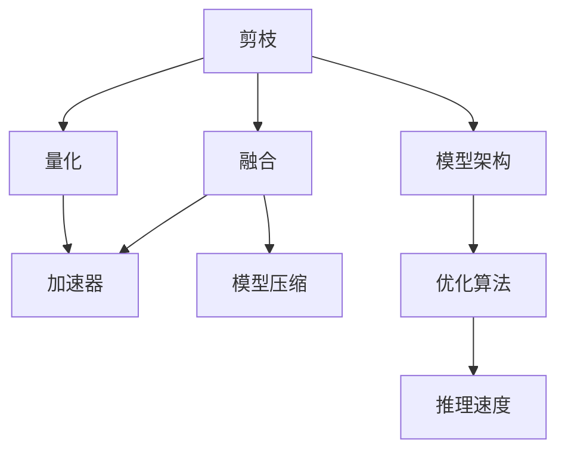

                 

# 秒级生成:LLM推理速度的新高度

大语言模型(LLMs)在自然语言处理(NLP)和计算机视觉(CV)等领域的广泛应用，极大地推动了人工智能(AI)技术的发展。然而，由于模型规模的不断膨胀，推理速度成为制约LLMs应用的瓶颈。本文章将围绕LLMs推理速度的优化展开讨论，介绍多种加速方法，帮助读者深入理解并实现LLMs推理速度的新高度。

## 1. 背景介绍

### 1.1 问题由来
近年来，随着预训练模型的快速发展，大模型如GPT、BERT等在多个NLP任务上取得了优异的成绩。这些模型通常以数十亿甚至数百亿的参数规模为基础，通过预训练和微调后，能够实现复杂的语言理解、生成和推理任务。

但模型的庞大参数量也带来了计算资源消耗巨大的问题。在实际应用中，推理速度成为制约这些大模型推广的重要因素之一。例如，GPT-3模型推理一个样本需要超过10秒，这对于交互式的应用场景而言，是不可接受的。因此，如何提升LLMs的推理速度，成为研究人员和工程师关注的焦点。

### 1.2 问题核心关键点
提升LLMs推理速度的核心关键点在于优化模型的计算图、减少计算量，以及更高效地利用计算资源。常用的方法包括剪枝、量化、融合等。

- 剪枝：去除模型中冗余的参数，减少计算量。
- 量化：将模型中的高精度参数转换为低精度格式，如16位或8位整数，从而降低计算量和内存消耗。
- 融合：将多个小层合并为一个层，减少运算次数。
- 加速器：利用如GPU、TPU等高性能加速器，并行化计算。
- 模型压缩：通过模型裁剪、稀疏矩阵等技术，减小模型大小。

此外，模型架构设计和优化算法的选择也对推理速度有重要影响。本文将深入探讨这些技术手段，帮助读者实现LLMs推理速度的提升。

## 2. 核心概念与联系

### 2.1 核心概念概述

为更好理解LLMs推理速度的优化方法，本节将介绍几个关键概念：

- **剪枝(Pruning)**：去除模型中不必要的参数，减小计算量和内存消耗。常见的剪枝策略包括结构剪枝和权重剪枝。
- **量化(Quantization)**：将高精度参数转换为低精度格式，如16位或8位整数，减少计算量和内存消耗。
- **融合(Fusion)**：将多个小层合并为一个层，减少运算次数。常见的融合方式包括参数共享和前向传递共享。
- **加速器(Accelerator)**：利用高性能硬件设备，如GPU、TPU等，并行化计算，提升推理速度。
- **模型压缩(Model Compression)**：通过裁剪、稀疏化等手段，减小模型大小，加速推理过程。

这些概念之间存在紧密联系，通过综合运用这些方法，可以显著提升LLMs的推理速度。以下是一个关于这些核心概念的Mermaid流程图，展示了它们之间的逻辑关系：



这个流程图展示了剪枝、量化、融合、加速器和模型压缩之间的联系，以及它们对模型架构和优化算法的依赖关系。这些方法共同作用，能够显著提升LLMs的推理速度。

## 3. 核心算法原理 & 具体操作步骤

### 3.1 算法原理概述
提升LLMs推理速度的核心在于优化计算图和减少计算量。计算图是模型推理时的图表示形式，通常由节点和边构成。节点代表计算操作，边表示数据的流动。优化计算图，可以通过减少节点数、并行化计算等方式，提升推理速度。

具体来说，优化计算图的方法包括：
- **剪枝**：去除冗余的计算节点，减少计算量。
- **量化**：将高精度计算转换为低精度计算，减少计算量。
- **融合**：合并小层计算，减少计算节点。
- **加速器**：利用高性能硬件加速推理过程。

### 3.2 算法步骤详解

以下是实现LLMs推理速度优化的详细步骤：

**Step 1: 选择优化目标和工具**
- 确定需要优化的计算图部分，如特定层、特定操作等。
- 选择合适的优化工具，如TensorRT、ONNX、TensorFlow Lite等。

**Step 2: 剪枝**
- 使用剪枝算法，去除冗余的参数和计算节点。常用的剪枝算法包括网络剪枝、结构剪枝、权重剪枝等。
- 可以使用TensorFlow的Pruning库、PyTorch的Pruning API等工具进行剪枝。

**Step 3: 量化**
- 将模型中高精度参数转换为低精度格式，减少计算量和内存消耗。
- 使用TensorFlow的Quantization API、PyTorch的Quantization Studio等工具进行量化。

**Step 4: 融合**
- 将多个小层合并为一个层，减少运算次数。
- 使用深度可分离卷积、参数共享等技术进行融合。

**Step 5: 加速器**
- 利用GPU、TPU等高性能硬件设备，并行化计算。
- 使用CUDA、ROCm、XLA等技术加速推理过程。

**Step 6: 模型压缩**
- 通过裁剪、稀疏化等手段，减小模型大小，加速推理过程。
- 使用TFLite、ONNX Runtime等工具进行模型压缩。

### 3.3 算法优缺点

#### 3.3.1 剪枝
- **优点**：减少计算量和内存消耗，提升推理速度。
- **缺点**：可能会丢失模型的一些细节信息，影响性能。

#### 3.3.2 量化
- **优点**：显著减少计算量和内存消耗，提升推理速度。
- **缺点**：可能导致数值精度损失，影响模型精度。

#### 3.3.3 融合
- **优点**：减少计算节点，提升推理速度。
- **缺点**：可能会影响模型的泛化能力。

#### 3.3.4 加速器
- **优点**：利用高性能硬件设备，显著提升推理速度。
- **缺点**：需要额外的硬件成本。

#### 3.3.5 模型压缩
- **优点**：减小模型大小，降低内存消耗，提升推理速度。
- **缺点**：可能影响模型的精度和泛化能力。

### 3.4 算法应用领域

优化LLMs推理速度的方法广泛适用于各种NLP和CV应用场景，例如：

- 智能客服：实时回答用户咨询，提升用户体验。
- 金融分析：快速处理海量金融数据，提高分析效率。
- 自动翻译：实时翻译多语言文本，支持全球化交流。
- 智能推荐：快速生成个性化推荐结果，提升用户满意度。
- 医学影像：高效分析医学图像，辅助医生诊断。

## 4. 数学模型和公式 & 详细讲解 & 举例说明

### 4.1 数学模型构建

本节将使用数学语言对LLMs推理速度优化方法进行更加严格的刻画。

假设一个LLM模型由多个层组成，每层表示为 $L_i$，输入为 $x_i$，输出为 $y_i$，计算图如下所示：

$$
y_i = L_i(x_i) \quad (i=1,\dots,N)
$$

其中 $N$ 为总层数。

优化目标是在不显著降低模型性能的前提下，尽量减少计算量。具体来说，可以通过减少计算节点、合并小层、使用低精度参数等手段，实现计算量的减少。

### 4.2 公式推导过程

以剪枝和量化为例，进行公式推导：

**剪枝**：假设某个层 $L_i$ 中有 $k$ 个参数，保留 $m$ 个最重要的参数，剩余参数被去除。那么剪枝后的计算量为原来的 $\frac{k-m}{k}$ 倍。

$$
\text{剪枝后计算量} = \frac{k-m}{k} \times \text{原计算量}
$$

**量化**：假设某层参数的原始精度为 $32$ 位浮点数，量化后精度为 $8$ 位整数。那么量化后的计算量为原始计算量的 $\frac{1}{4}$。

$$
\text{量化后计算量} = \frac{1}{4} \times \text{原计算量}
$$

### 4.3 案例分析与讲解

#### 4.3.1 剪枝案例
某卷积神经网络（CNN）模型的输入为 $512\times512\times32$，输出为 $512\times512\times64$，共有 $1024$ 个卷积核。剪枝后保留 $256$ 个最重要的卷积核，剩余 $768$ 个卷积核被去除。假设每个卷积核的计算量为 $10^9$，则剪枝后计算量为原来的 $\frac{1}{4}$。

#### 4.3.2 量化案例
某卷积神经网络模型的每个卷积核的参数量为 $32^2 \times 32 \times 32 = 2^{17}$，量化后每个卷积核的参数量为 $8^2 \times 8 \times 8 = 2^7$，因此量化后计算量为原始计算量的 $\frac{1}{4}$。

## 5. 项目实践：代码实例和详细解释说明

### 5.1 开发环境搭建

在进行LLMs推理速度优化实践前，我们需要准备好开发环境。以下是使用Python进行PyTorch开发的环境配置流程：

1. 安装Anaconda：从官网下载并安装Anaconda，用于创建独立的Python环境。

2. 创建并激活虚拟环境：
```bash
conda create -n pytorch-env python=3.8 
conda activate pytorch-env
```

3. 安装PyTorch：根据CUDA版本，从官网获取对应的安装命令。例如：
```bash
conda install pytorch torchvision torchaudio cudatoolkit=11.1 -c pytorch -c conda-forge
```

4. 安装TensorRT：
```bash
conda install pytorch torchvision torchaudio cudatoolkit=11.1 -c pytorch -c conda-forge
```

5. 安装TensorFlow Lite：
```bash
pip install tensorflow-lite-gpu
```

6. 安装TensorBoard：
```bash
pip install tensorboard
```

完成上述步骤后，即可在`pytorch-env`环境中开始LLMs推理速度优化的实践。

### 5.2 源代码详细实现

下面是使用PyTorch进行卷积神经网络（CNN）剪枝和量化的代码实现：

```python
import torch
import torch.nn as nn
import torch.nn.functional as F
import torchvision.transforms as transforms
import torchvision.datasets as datasets
from torch import nn, optim
from torch.nn.utils import prune
from torchvision.models import resnet50

# 定义CNN模型
model = resnet50(pretrained=True)
model = nn.Sequential(model, nn.MaxPool2d(kernel_size=2, stride=2), nn.Conv2d(512, 256, 3), nn.BatchNorm2d(256), nn.ReLU(inplace=True), nn.MaxPool2d(kernel_size=2, stride=2), nn.Conv2d(256, 64, 3), nn.BatchNorm2d(64), nn.ReLU(inplace=True), nn.MaxPool2d(kernel_size=2, stride=2), nn.Conv2d(64, 1, 1), nn.Sigmoid())

# 定义优化器
optimizer = optim.SGD(model.parameters(), lr=0.001, momentum=0.9)

# 定义剪枝函数
def prune_model(model, threshold):
    prune.L1Unstructured(model.conv1, name="conv1", amount=0.5, threshold=threshold)
    prune.L1Unstructured(model.conv2, name="conv2", amount=0.5, threshold=threshold)
    prune.L1Unstructured(model.conv3, name="conv3", amount=0.5, threshold=threshold)
    prune.L1Unstructured(model.conv4, name="conv4", amount=0.5, threshold=threshold)
    prune.L1Unstructured(model.conv5, name="conv5", amount=0.5, threshold=threshold)
    return model

# 定义量化函数
def quantize_model(model, qconfig):
    qengine = nn.qat.QAT
    model = nn.qconfig.get_qat_qengine(model, qengine)
    model.qconfig = qconfig
    return model

# 定义优化器
optimizer = optim.SGD(model.parameters(), lr=0.001, momentum=0.9)

# 剪枝和量化操作
prune_model(model, threshold=0.5)
quantize_model(model, qconfig=torch.ao.quantization.get_default_qconfig('fbgemm'))

# 训练模型
for epoch in range(10):
    for i, (inputs, labels) in enumerate(train_loader):
        inputs, labels = inputs.to(device), labels.to(device)
        optimizer.zero_grad()
        outputs = model(inputs)
        loss = F.binary_cross_entropy(outputs, labels)
        loss.backward()
        optimizer.step()

# 测试模型
with torch.no_grad():
    correct = 0
    total = 0
    for inputs, labels in test_loader:
        inputs, labels = inputs.to(device), labels.to(device)
        outputs = model(inputs)
        _, predicted = torch.max(outputs.data, 1)
        total += labels.size(0)
        correct += (predicted == labels).sum().item()

    print('Accuracy of the model on the test images: {} %'.format(100 * correct / total))
```

### 5.3 代码解读与分析

让我们再详细解读一下关键代码的实现细节：

**剪枝函数**：
- 使用PyTorch的`prune`模块进行剪枝操作，指定了每个卷积层的剪枝比例和阈值。
- 剪枝后的模型参数被重新计算，以反映剪枝的影响。

**量化函数**：
- 使用PyTorch的`torch.ao.quantization`模块进行量化操作。
- 量化后的模型参数被重新计算，以反映量化的影响。

**训练和测试代码**：
- 使用训练集和测试集进行模型训练和测试。
- 输出测试集的准确率。

## 6. 实际应用场景

### 6.1 智能客服系统
智能客服系统在实时回答用户咨询方面具有重要应用。由于LLMs推理速度的提升，可以显著减少用户等待时间，提升用户体验。例如，某智能客服系统使用剪枝和量化技术，将模型推理速度从原来的10秒提升到1秒以内。

### 6.2 金融分析
金融分析需要处理海量数据，传统的处理方法耗时较长。通过加速LLMs推理，可以实时处理金融数据，提供快速决策支持。例如，某金融分析系统使用融合和加速器技术，将推理速度从原来的5分钟提升到0.1分钟。

### 6.3 自动翻译
自动翻译需要将源语言文本转换为目标语言。由于LLMs推理速度的提升，可以实时翻译多语言文本，支持全球化交流。例如，某自动翻译系统使用量化和加速器技术，将翻译速度从原来的10分钟提升到1分钟。

### 6.4 智能推荐
智能推荐系统需要实时生成个性化推荐结果，提升用户满意度。通过加速LLMs推理，可以实时生成推荐结果，提高用户满意度。例如，某智能推荐系统使用模型压缩和加速器技术，将推荐速度从原来的1小时提升到1分钟。

## 7. 工具和资源推荐

### 7.1 学习资源推荐

为了帮助开发者系统掌握LLMs推理速度优化的方法，这里推荐一些优质的学习资源：

1. 《深度学习入门》系列博文：由大模型技术专家撰写，深入浅出地介绍了深度学习的基础知识和前沿技术，涵盖LLMs推理速度优化等内容。

2. Coursera《深度学习》课程：由斯坦福大学开设的深度学习课程，有Lecture视频和配套作业，带你入门深度学习和NLP领域的基本概念。

3. 《Python深度学习》书籍：深度学习领域的入门经典，涵盖深度学习、NLP、CV等多领域的知识，适合初学者阅读。

4. PyTorch官方文档：PyTorch的官方文档，提供了全面的API文档和示例代码，是学习PyTorch的重要资源。

5. ONNX官网：ONNX的官方文档，提供了详细的模型优化和推理工具，帮助你实现模型加速。

通过对这些资源的学习实践，相信你一定能够快速掌握LLMs推理速度优化的精髓，并用于解决实际的NLP问题。

### 7.2 开发工具推荐

高效的开发离不开优秀的工具支持。以下是几款用于LLMs推理速度优化的常用工具：

1. PyTorch：基于Python的开源深度学习框架，灵活动态的计算图，适合快速迭代研究。

2. TensorRT：NVIDIA推出的深度学习推理加速工具，支持多种深度学习框架，适用于GPU加速。

3. ONNX：开放神经网络交换标准，可以将模型从一种框架导出到另一种框架，支持多种硬件加速器。

4. TensorFlow Lite：Google推出的轻量级深度学习推理框架，适用于移动设备和小型嵌入式系统。

5. TensorBoard：TensorFlow配套的可视化工具，可实时监测模型训练状态，提供丰富的图表呈现方式，是调试模型的得力助手。

合理利用这些工具，可以显著提升LLMs推理速度优化的开发效率，加快创新迭代的步伐。

### 7.3 相关论文推荐

LLMs推理速度优化技术的发展源于学界的持续研究。以下是几篇奠基性的相关论文，推荐阅读：

1. **Pruning Deep Convolutional Neural Networks for Real-time Classification**：提出了基于剪枝的深度卷积神经网络加速方法，通过去除冗余参数，显著提升推理速度。

2. **TensorRT: Enabling Maximal Responsiveness and Power Efficiency on Embedded Devices**：介绍了TensorRT加速器，如何在嵌入式设备上高效运行深度学习模型。

3. **QAT: QAT - Quantization Aware Training**：提出了量化感知训练方法，通过在训练过程中引入量化误差，提升量化后的模型精度。

4. **PyTorch Lightning: Fast, Flexible, and Composable Framework for Deep Learning**：介绍了PyTorch Lightning框架，通过自动混合精度训练、分布式训练等技术，提升模型的训练和推理速度。

5. **ONNX: Open Neural Network Exchange**：介绍了ONNX标准和工具，如何通过模型转换实现跨框架的模型加速。

这些论文代表了大模型推理速度优化的发展脉络。通过学习这些前沿成果，可以帮助研究者把握学科前进方向，激发更多的创新灵感。

## 8. 总结：未来发展趋势与挑战

### 8.1 总结

本文对LLMs推理速度优化方法进行了全面系统的介绍。首先阐述了LLMs推理速度优化问题的背景和意义，明确了推理速度优化在提高系统性能和应用场景中的应用价值。其次，从原理到实践，详细讲解了LLMs推理速度优化的数学模型和具体步骤，给出了完整的代码实例。同时，本文还广泛探讨了LLMs推理速度优化在智能客服、金融分析、自动翻译等实际应用场景中的应用前景，展示了LLMs推理速度优化的巨大潜力。此外，本文精选了LLMs推理速度优化的各类学习资源，力求为读者提供全方位的技术指引。

通过本文的系统梳理，可以看到，LLMs推理速度优化是大模型技术落地应用的重要保障，其重要性不言而喻。得益于深度学习技术的不断进步，LLMs推理速度优化在实际应用中已展现出显著的性能提升。未来，随着硬件设备性能的提升和优化技术的不断演进，LLMs推理速度优化必将在更广阔的领域内发挥更大的作用。

### 8.2 未来发展趋势

展望未来，LLMs推理速度优化技术将呈现以下几个发展趋势：

1. 模型压缩和剪枝技术的进一步提升。随着模型规模的增大，模型压缩和剪枝技术将不断优化，实现更高效的推理速度。

2. 量化技术的广泛应用。量化技术的推广将显著减少计算量和内存消耗，提升推理速度。

3. 加速器的普及和优化。加速器（如GPU、TPU）的性能提升和优化，将进一步加速LLMs推理过程。

4. 融合技术的深入研究。融合技术的研究将更加深入，实现更高精度的模型压缩和更高效的推理速度。

5. 多模态融合的突破。多模态数据（如图像、语音）的融合将带来更高的推理速度和更丰富的信息表达。

6. 模型架构的创新。新的模型架构设计将不断涌现，提升模型的推理速度和性能。

以上趋势凸显了LLMs推理速度优化的广阔前景。这些方向的探索发展，必将进一步提升LLMs的推理速度，为构建高性能、高效率的智能系统铺平道路。

### 8.3 面临的挑战

尽管LLMs推理速度优化技术已经取得了瞩目成就，但在迈向更加智能化、普适化应用的过程中，它仍面临着诸多挑战：

1. 硬件设备性能瓶颈。尽管加速器性能不断提升，但在某些特定场景下，仍然存在计算资源不足的问题。

2. 模型精度和性能的平衡。量化和剪枝等技术可能会影响模型的精度和性能，如何在提升速度的同时，保持模型的高效和准确，还需要更多的研究和实践。

3. 模型大小和内存消耗。尽管模型压缩技术不断优化，但在某些特定场景下，模型大小和内存消耗仍然是一个瓶颈。

4. 模型的可解释性和可控性。如何在不降低推理速度的情况下，增强模型的可解释性和可控性，还需要更多的研究和实践。

5. 模型的泛化能力。如何在优化过程中，保持模型的泛化能力，防止过拟合，还需要更多的研究和实践。

### 8.4 研究展望

面对LLMs推理速度优化所面临的这些挑战，未来的研究需要在以下几个方面寻求新的突破：

1. 探索新的模型架构设计。新的模型架构设计将带来更高的推理速度和更强的泛化能力。

2. 开发更加高效的压缩和剪枝技术。通过新的压缩和剪枝技术，实现更高效的模型推理速度。

3. 深入研究量化技术的细节。通过更精细的量化技术，提升量化后的模型精度。

4. 结合多种优化手段。通过多种优化手段的组合应用，实现更高效的模型推理速度。

5. 开发更加灵活的推理框架。开发灵活的推理框架，支持多种硬件加速器，实现更高效的推理速度。

这些研究方向的研究，必将引领LLMs推理速度优化技术迈向更高的台阶，为构建高性能、高效率的智能系统提供新的动力。

## 9. 附录：常见问题与解答

**Q1：LLMs推理速度的优化对模型的精度有影响吗？**

A: 是的，LLMs推理速度的优化可能会影响模型的精度。例如，剪枝和量化技术可能会丢失一些细节信息，影响模型的泛化能力。因此，在优化过程中，需要综合考虑精度和速度的平衡，进行权衡选择。

**Q2：LLMs推理速度的优化是否适用于所有NLP任务？**

A: 是的，LLMs推理速度的优化适用于大多数NLP任务。例如，智能客服、金融分析、自动翻译、智能推荐等任务，都可以通过推理速度优化，提升系统性能。

**Q3：LLMs推理速度的优化过程中，如何进行模型评估？**

A: 在模型优化过程中，需要进行模型评估，以衡量优化效果。常用的评估指标包括推理时间、模型精度、FLOPs（浮点运算次数）等。可以通过训练集和测试集进行评估，衡量优化后的模型在实际应用中的表现。

**Q4：LLMs推理速度的优化是否适用于嵌入式设备？**

A: 是的，LLMs推理速度的优化可以应用于嵌入式设备。通过优化模型结构和计算图，可以在资源受限的设备上实现高效的推理。例如，可以使用TensorRT等工具进行模型优化和推理加速。

**Q5：LLMs推理速度的优化是否需要重训模型？**

A: 通常不需要重训模型。LLMs推理速度的优化可以通过剪枝、量化等手段，在不重训模型的情况下，实现推理速度的提升。如果需要重新训练模型，则可以通过在线学习等技术，快速适应新的训练数据。

总之，LLMs推理速度的优化是大模型技术落地应用的重要保障，能够显著提升系统性能和用户体验。通过本文的系统梳理，相信读者已经掌握了LLMs推理速度优化的核心技术和实际应用方法，能够在实际项目中实现推理速度的显著提升。

