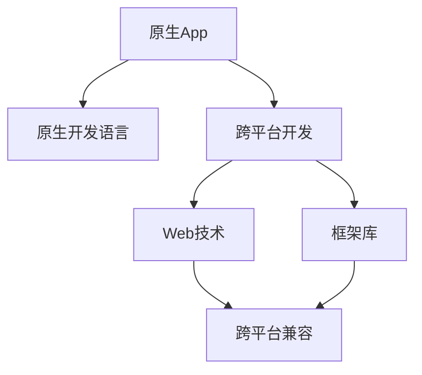

                 

# 移动端全栈开发：原生App与跨平台方案

## 1. 背景介绍

在移动应用开发领域，原生App和跨平台方案一直是两大主流技术路线。原生App通常指基于iOS和Android平台的原生应用开发，其特点是性能出色、用户体验最佳、资源占用低，但开发难度大、开发周期长、维护成本高。跨平台方案则是指通过Web技术或跨平台框架开发的应用，如React Native、Flutter等，其特点是开发效率高、跨平台兼容性好、资源消耗低，但性能和用户体验不及原生App。

### 1.1 问题由来

随着移动互联网的迅猛发展，移动应用已经成为人们日常生活中不可或缺的一部分。企业希望通过移动应用提升品牌影响力、拓展市场份额、优化客户体验，而开发者则希望在短时间内构建高质量、低成本的移动应用。然而，原生App和跨平台方案各自存在明显优缺点，如何兼顾性能、用户体验和开发效率，成为当前移动端全栈开发的核心问题。

### 1.2 问题核心关键点

移动端全栈开发需要综合考虑原生App与跨平台方案的优缺点，合理选择适合的应用场景和开发工具。关键点包括：
1. **性能与用户体验**：选择性能更高、用户体验更好的方案。
2. **开发效率与成本**：选择开发效率更高、维护成本更低的方案。
3. **跨平台兼容性**：选择跨平台兼容性好、开发难度低的方案。
4. **开发团队技能**：选择团队已有技能较多、技术门槛较低的方案。
5. **项目需求与场景**：选择符合项目需求、应用场景的方案。

## 2. 核心概念与联系

### 2.1 核心概念概述

在移动端全栈开发中，涉及多个关键概念和技术，包括原生App、跨平台方案、Web技术、框架库等。以下是几个核心概念的简单介绍：

- **原生App**：基于iOS和Android平台的原生应用开发，使用各自平台的原生编程语言和框架进行开发，具备最佳性能和用户体验。
- **跨平台方案**：使用Web技术或跨平台框架进行开发的移动应用，如React Native、Flutter等，支持iOS和Android平台，开发效率高、资源消耗低。
- **Web技术**：包括HTML、CSS、JavaScript等技术，用于开发Web应用，具有跨平台兼容性好、开发效率高的优点。
- **框架库**：用于加速开发过程的工具和库，如React Native、Flutter、Ionic等，提供丰富的组件和API，支持跨平台开发。

这些概念之间的逻辑关系可以通过以下Mermaid流程图来展示：



这个流程图展示了原生App与跨平台方案的关联，以及Web技术和框架库在跨平台开发中的作用。

## 3. 核心算法原理 & 具体操作步骤

### 3.1 算法原理概述

移动端全栈开发的算法原理，主要涉及原生App和跨平台方案的技术对比与选择。关键算法包括性能评估、用户体验比较、开发成本和效率分析等。

性能评估通常通过基准测试进行，比较原生App与跨平台方案在CPU、GPU、内存等方面的性能表现。用户体验比较则通过用户调研、A/B测试等方式，评估不同方案的用户满意度、使用率等指标。开发成本和效率分析则通过对开发周期、维护成本、团队技能等方面的统计和对比，确定各方案的综合性价比。

### 3.2 算法步骤详解

移动端全栈开发的步骤一般包括以下几个关键环节：

**Step 1: 需求分析与设计**

- 收集用户需求，明确应用功能、性能要求、用户体验目标等。
- 设计应用架构，选择适合的原生App或跨平台方案。
- 确定开发团队，评估团队技能与需求匹配度。

**Step 2: 技术选型与评估**

- 根据需求和设计结果，选择原生App或跨平台方案。
- 进行性能评估、用户体验比较、开发成本和效率分析。
- 根据评估结果，确定最终方案。

**Step 3: 开发实施**

- 根据选定的方案，选择合适的开发工具和框架库。
- 进行代码编写、测试、调试等开发工作。
- 进行前后端集成、API接口设计等。

**Step 4: 部署与测试**

- 进行应用打包、签名、发布等部署工作。
- 在iOS和Android平台上进行应用测试，确保功能完备、性能稳定。
- 进行用户测试、A/B测试等，收集用户反馈。

**Step 5: 上线与维护**

- 发布应用到应用商店，收集用户下载、使用数据。
- 根据用户反馈，进行持续优化和维护。
- 定期更新，保持应用与新系统的兼容性。

### 3.3 算法优缺点

原生App与跨平台方案各有优缺点：

- **原生App**的优点包括性能最佳、用户体验最佳、资源占用低等。缺点包括开发难度大、开发周期长、维护成本高等。
- **跨平台方案**的优点包括开发效率高、跨平台兼容性好、资源消耗低等。缺点包括性能一般、用户体验较差、部分功能实现受限等。

选择方案时需要权衡这些优缺点，根据具体项目需求和场景，综合考虑性能、用户体验、开发效率和成本等因素。

### 3.4 算法应用领域

原生App与跨平台方案在多个领域都有应用，包括社交、电商、金融、医疗等。具体应用场景包括：

- 社交应用：如微信、QQ等，原生App开发，注重用户体验和即时通信性能。
- 电商应用：如淘宝、京东等，原生App开发，注重支付、商品展示等性能。
- 金融应用：如支付宝、微信钱包等，原生App开发，注重安全性和交易效率。
- 医疗应用：如健康宝、好大夫在线等，原生App开发，注重用户隐私保护和数据安全。
- 企业应用：如企业办公套件、CRM系统等，跨平台方案开发，注重跨平台兼容性和开发效率。
- 教育应用：如在线教育平台、远程教育系统等，跨平台方案开发，注重开发效率和跨平台兼容。

## 4. 数学模型和公式 & 详细讲解 & 举例说明

### 4.1 数学模型构建

在移动端全栈开发中，数学模型主要用于评估原生App和跨平台方案的性能和用户体验。以下是几个常见的数学模型：

- **性能评估模型**：通过基准测试数据，构建性能评分模型，评估不同方案的CPU、GPU、内存等性能指标。
- **用户体验评分模型**：通过用户调研和A/B测试数据，构建用户体验评分模型，评估不同方案的用户满意度、使用率等指标。
- **开发成本与效率评估模型**：通过开发周期、维护成本、团队技能等数据，构建开发成本与效率评估模型，确定各方案的综合性价比。

### 4.2 公式推导过程

以下是性能评估模型和用户体验评分模型的公式推导过程：

**性能评估模型**：

假设原生App和跨平台方案的性能评估结果分别为PA和CA，其性能评分分别为SPA和SCA，则公式推导如下：

$$
SPA = \frac{PA}{P_{max}}
$$

$$
SCA = \frac{CA}{C_{max}}
$$

其中 $P_{max}$ 和 $C_{max}$ 分别为原生App和跨平台方案的最大性能评分，即各自平台的原生应用性能评分。

**用户体验评分模型**：

假设原生App和跨平台方案的用户体验评分分别为UEA和UEC，用户满意度分别为SUA和SUC，使用率分别为RUAA和RUC，则公式推导如下：

$$
UEA = \frac{SUA + RUAA}{S_{max} + R_{max}}
$$

$$
UEC = \frac{SUC + RUC}{S_{max} + R_{max}}
$$

其中 $S_{max}$ 和 $R_{max}$ 分别为原生App和跨平台方案的最大用户体验评分，即各自平台的原生应用用户体验评分。

### 4.3 案例分析与讲解

假设某企业开发一个金融应用，需要进行性能评估和用户体验比较。根据测试数据，原生App的CPU性能评分PA为90，跨平台方案的CPU性能评分CA为80，原生App和跨平台方案的最大性能评分分别为100和95。则根据公式推导，原生App的性能评分SPA为0.9，跨平台方案的性能评分SCA为0.84。

根据用户调研和A/B测试数据，原生App的用户满意度SUA为85，使用率RUAA为75，跨平台方案的用户满意度SUC为80，使用率RUC为65。则根据公式推导，原生App的用户体验评分UEA为0.95，跨平台方案的用户体验评分UEC为0.94。

通过综合性能评分和用户体验评分，可以得出原生App的综合评分高于跨平台方案，因此建议选择原生App进行开发。

## 5. 项目实践：代码实例和详细解释说明

### 5.1 开发环境搭建

开发原生App与跨平台方案，需要搭建相应的开发环境。以下是原生App和跨平台方案的开发环境搭建流程：

**原生App开发环境搭建**：

1. 安装Xcode和Android Studio，安装对应的SDK和插件。
2. 配置Android虚拟设备，进行模拟器测试。
3. 配置iOS模拟器，进行模拟器测试。
4. 安装必要的开发工具，如CocoaPods、FFmpeg等。

**跨平台方案开发环境搭建**：

1. 安装React Native、Flutter等框架库的开发环境。
2. 配置模拟器或真实设备，进行模拟器测试。
3. 安装必要的开发工具，如npm、pub等。

### 5.2 源代码详细实现

以下是原生App和跨平台方案的源代码详细实现示例：

**原生App源代码实现**：

```java
// 原生App实现示例
public class MainActivity extends AppCompatActivity {
    @Override
    protected void onCreate(Bundle savedInstanceState) {
        super.onCreate(savedInstanceState);
        setContentView(R.layout.activity_main);
        
        // 初始化视图
        TextView textView = findViewById(R.id.textView);
        Button button = findViewById(R.id.button);
        
        // 设置按钮点击事件
        button.setOnClickListener(new View.OnClickListener() {
            @Override
            public void onClick(View v) {
                textView.setText("Hello, world!");
            }
        });
    }
}
```

**跨平台方案源代码实现**：

```javascript
// React Native实现示例
import React from 'react';
import { Text, Button, View } from 'react-native';

export default function App() {
    return (
        <View>
            <Text>Hello, world!</Text>
            <Button title="Click me" onPress={() => console.log('Button clicked!')} />
        </View>
    );
}
```

### 5.3 代码解读与分析

原生App和跨平台方案的源代码实现思路基本一致，主要差异在于语言和框架的选用。原生App使用Java/Kotlin编写，跨平台方案使用JavaScript/React Native编写。代码的核心逻辑包括视图初始化、事件处理、数据展示等。

原生App的优点在于性能最佳、用户体验最佳，但开发难度大、开发周期长、维护成本高。跨平台方案的优点在于开发效率高、跨平台兼容性好、资源消耗低，但性能一般、用户体验较差、部分功能实现受限。

## 6. 实际应用场景

### 6.1 智能金融应用

智能金融应用需要高性能和高度安全，原生App的开发方式可以确保最佳性能和用户体验。原生App可以访问设备硬件和系统服务，提供更强大的功能支持。例如，支付应用、理财应用等，原生App开发可以保障用户数据安全、支付交易高效。

### 6.2 电商购物应用

电商购物应用需要处理海量交易数据，原生App的开发方式可以确保高效性能和稳定用户体验。原生App可以提供流畅的购物体验、实时的数据更新、高效的支付结算等。例如，淘宝、京东等电商平台，原生App开发可以提供更好的购物体验和高效的支付服务。

### 6.3 在线教育应用

在线教育应用需要跨平台兼容性和高效开发，跨平台方案的开发方式可以满足这些需求。跨平台方案可以提供统一的开发框架和组件库，开发效率高、跨平台兼容性好。例如，在线教育平台、远程教育系统等，跨平台方案开发可以提供良好的用户体验和高效的开发效率。

### 6.4 智能家居应用

智能家居应用需要与多种设备和系统兼容，跨平台方案的开发方式可以满足这些需求。跨平台方案可以提供统一的开发框架和组件库，开发效率高、跨平台兼容性好。例如，智能音箱、智能电视等设备，跨平台方案开发可以提供良好的用户体验和高效的开发效率。

## 7. 工具和资源推荐

### 7.1 学习资源推荐

为了帮助开发者系统掌握原生App与跨平台方案的开发技术，这里推荐一些优质的学习资源：

1. **Udacity《Android应用开发》课程**：提供系统化的Android应用开发课程，涵盖Android开发基础、应用架构、视图处理等。
2. **Udacity《iOS应用开发》课程**：提供系统化的iOS应用开发课程，涵盖Swift、Cocoa Touch框架、界面设计等。
3. **React Native官方文档**：React Native的官方文档，提供详细的API文档和开发指南，是学习React Native开发的最佳资源。
4. **Flutter官方文档**：Flutter的官方文档，提供详细的API文档和开发指南，是学习Flutter开发的最佳资源。
5. **Manning《React Native开发实战》书籍**：详细介绍React Native开发技术和最佳实践，是React Native开发的学习参考书。
6. **Manning《Flutter实战》书籍**：详细介绍Flutter开发技术和最佳实践，是Flutter开发的学习参考书。

通过这些学习资源，相信你一定能够快速掌握原生App与跨平台方案的开发技术，并用于解决实际的移动应用问题。

### 7.2 开发工具推荐

高效的开发离不开优秀的工具支持。以下是几款用于原生App与跨平台方案开发的常用工具：

1. **Android Studio**：Google官方提供的Android开发工具，提供丰富的开发功能、调试工具、模拟器支持等。
2. **Xcode**：Apple官方提供的iOS开发工具，提供丰富的开发功能、调试工具、模拟器支持等。
3. **React Native**：Facebook开发的跨平台开发框架，支持iOS和Android平台，提供丰富的组件和API。
4. **Flutter**：Google开发的跨平台开发框架，支持iOS和Android平台，提供高效的UI组件库和开发工具。
5. **WebStorm**：JetBrains开发的Web开发工具，支持HTML、CSS、JavaScript等技术，提供强大的代码编辑和调试功能。

合理利用这些工具，可以显著提升原生App与跨平台方案的开发效率，加快创新迭代的步伐。

### 7.3 相关论文推荐

原生App与跨平台方案的开发技术不断发展，以下是几篇奠基性的相关论文，推荐阅读：

1. **《The Architecture of Open Source Applications》**：Google开源的优秀应用架构文档，提供了大量真实应用架构设计案例，是了解原生App架构设计的最佳资源。
2. **《React Native: A Framework for Building Native Mobile Apps with JavaScript, CSS, and HTML》**：React Native官方论文，详细介绍React Native框架的技术原理和设计思路。
3. **《A Framework for Building Cross-Platform Mobile Applications with Flutter》**：Flutter官方论文，详细介绍Flutter框架的技术原理和设计思路。
4. **《Native vs. Hybrid: The Impact on User Experience》**：国际顶级会议ACM CHI论文，比较原生App和跨平台方案的用户体验差异，提供了详细的实验结果和分析。
5. **《Cross-Platform Mobile Development: A Survey and Analysis of Recent Trends》**：IEEE Xplore论文，对近年来的跨平台开发技术进行综述，提供了丰富的技术对比和分析。

这些论文代表了大规模应用开发技术的发展脉络，通过学习这些前沿成果，可以帮助研究者把握学科前进方向，激发更多的创新灵感。

## 8. 总结：未来发展趋势与挑战

### 8.1 总结

本文对原生App与跨平台方案的开发技术进行了全面系统的介绍。首先阐述了原生App与跨平台方案的开发背景和意义，明确了原生App与跨平台方案在移动应用开发中的重要地位。其次，从原理到实践，详细讲解了原生App与跨平台方案的技术对比与选择，提供了详细的开发流程和代码实现。同时，本文还探讨了原生App与跨平台方案在多个行业领域的应用前景，展示了其在移动应用开发中的巨大潜力。

通过本文的系统梳理，可以看到，原生App与跨平台方案的开发技术已经形成了一套成熟的方法论和工具链，能够满足不同应用场景的需求。原生App与跨平台方案的开发选择，需要根据项目需求和团队技能进行合理规划，力求在性能、用户体验、开发效率和成本之间找到最优平衡。

### 8.2 未来发展趋势

展望未来，原生App与跨平台方案的开发技术将呈现以下几个发展趋势：

1. **持续改进与优化**：原生App与跨平台方案的技术不断改进和优化，性能、用户体验和开发效率不断提高。开发工具和框架不断更新，提供更丰富的功能和更好的兼容性。
2. **跨平台融合**：原生App与跨平台方案的界限逐渐模糊，部分跨平台方案逐步向原生App靠拢，部分原生App则引入跨平台框架进行开发。跨平台与原生App的融合，带来更高效、更灵活的开发方式。
3. **云原生开发**：原生App与跨平台方案向云原生方向发展，提供更强大的云服务支持，如云函数、云存储、云平台等。云原生开发方式，将带来更高的开发效率和更好的资源利用率。
4. **AI与开发结合**：原生App与跨平台方案结合AI技术，提供更智能的开发和应用体验。例如，自动化测试、智能编码、自然语言处理等，提升开发效率和用户体验。
5. **低代码与无代码开发**：原生App与跨平台方案向低代码与无代码方向发展，降低开发门槛，提高开发效率。例如，通过低代码平台进行应用开发，开发人员无需编写大量代码，即可快速搭建应用。

以上趋势凸显了原生App与跨平台方案的不断发展和进步，原生App与跨平台方案的开发技术将变得更加高效、灵活和智能。

### 8.3 面临的挑战

尽管原生App与跨平台方案的开发技术已经取得显著进展，但在迈向更加智能化、普适化应用的过程中，仍面临诸多挑战：

1. **性能与用户体验的平衡**：原生App与跨平台方案在性能和用户体验方面仍存在差距，如何在两者之间找到最优平衡，仍是重要课题。
2. **开发效率与成本的优化**：原生App与跨平台方案的开发效率和成本仍需进一步优化，如何在开发效率和成本之间找到最优解。
3. **跨平台兼容性与功能实现**：跨平台方案在跨平台兼容性和功能实现方面仍需不断改进，如何在不同平台之间实现最佳兼容性和功能支持。
4. **开发工具和框架的更新**：原生App与跨平台方案的开发工具和框架不断更新，开发者需要不断学习和适应，如何保持技术领先，是重要挑战。
5. **安全与隐私保护**：原生App与跨平台方案需要保障用户数据安全和隐私保护，如何构建安全可靠的应用系统，是重要课题。

### 8.4 研究展望

面对原生App与跨平台方案的诸多挑战，未来的研究需要在以下几个方面寻求新的突破：

1. **优化性能与用户体验**：研究如何通过算法优化、技术改进等手段，提升原生App与跨平台方案的性能和用户体验，解决性能和用户体验之间的矛盾。
2. **提高开发效率与降低成本**：研究如何通过自动化测试、智能编码等技术，提升开发效率，降低开发成本，解决开发效率和成本之间的矛盾。
3. **增强跨平台兼容性与功能支持**：研究如何通过跨平台技术、云原生技术等手段，提升跨平台方案的兼容性和功能支持，解决跨平台兼容性和功能实现之间的矛盾。
4. **提升开发工具和框架的先进性**：研究如何通过技术创新、工具优化等手段，提升原生App与跨平台方案的开发工具和框架，解决开发工具和框架之间的矛盾。
5. **保障数据安全和隐私保护**：研究如何通过加密技术、安全协议等手段，保障原生App与跨平台方案的用户数据安全和隐私保护，解决安全与隐私保护之间的矛盾。

这些研究方向将引领原生App与跨平台方案的不断进步，提升应用系统的性能和用户体验，保障数据安全和隐私保护，推动原生App与跨平台方案技术的全面发展。

## 9. 附录：常见问题与解答

**Q1：原生App与跨平台方案的优缺点有哪些？**

A: 原生App的优点包括性能最佳、用户体验最佳、资源占用低等，但开发难度大、开发周期长、维护成本高。跨平台方案的优点包括开发效率高、跨平台兼容性好、资源消耗低等，但性能一般、用户体验较差、部分功能实现受限。

**Q2：如何选择原生App与跨平台方案？**

A: 选择原生App与跨平台方案需要根据项目需求和团队技能进行合理规划。原生App适合高性能、用户体验最佳、资源占用低的场景，如智能金融应用、电商购物应用等。跨平台方案适合开发效率高、跨平台兼容性好、开发成本低的场景，如在线教育应用、智能家居应用等。

**Q3：原生App与跨平台方案的开发流程是什么？**

A: 原生App与跨平台方案的开发流程一般包括以下几个关键环节：需求分析与设计、技术选型与评估、开发实施、部署与测试、上线与维护。具体流程需要根据项目需求和方案选择进行调整。

**Q4：原生App与跨平台方案的未来发展趋势是什么？**

A: 原生App与跨平台方案的未来发展趋势包括持续改进与优化、跨平台融合、云原生开发、AI与开发结合、低代码与无代码开发等。原生App与跨平台方案的开发技术将变得更加高效、灵活和智能。

**Q5：原生App与跨平台方案面临的挑战有哪些？**

A: 原生App与跨平台方案面临的挑战包括性能与用户体验的平衡、开发效率与成本的优化、跨平台兼容性与功能实现、开发工具和框架的更新、安全与隐私保护等。需要在这些方面进行不断改进和优化，才能满足用户需求。

通过本文的系统梳理，相信你对原生App与跨平台方案的开发技术有了更深入的了解。在实际开发中，需要根据项目需求和团队技能进行合理规划，选择适合的原生App或跨平台方案，力求在性能、用户体验、开发效率和成本之间找到最优平衡。同时，持续关注原生App与跨平台方案的最新进展，不断学习和应用新技术，才能在移动应用开发中保持领先地位。

