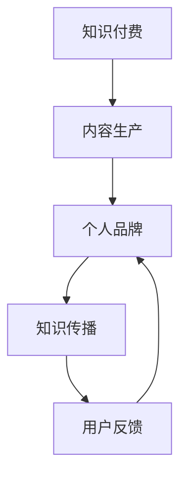

                 

# 程序员利用知识付费打造个人品牌的策略

## 1. 背景介绍

在快速发展的信息技术时代，程序员这一职业不仅是代码的编写者，更成为了知识创造和价值传递的重要力量。个人品牌的塑造，不仅能够提升程序员的职业竞争力，还能带来丰厚的经济回报。知识付费作为一种新兴的经济模式，为程序员提供了极佳的机遇。本文将探讨如何利用知识付费平台，打造个人品牌，提升影响力，并通过高效的内容产出和精准的市场定位，实现经济收益的最大化。

## 2. 核心概念与联系

### 2.1 核心概念概述

为了更好地理解程序员如何利用知识付费打造个人品牌，我们先简要介绍几个核心概念：

- **知识付费**：指用户为获取有价值的知识或信息而支付费用，这是一种基于知识内容的经济活动。知识付费平台包括知乎、Coursera、Udemy等，通过在线课程、直播讲座、电子书等形式提供专业知识。
- **个人品牌**：指个人通过特定的行为和表现，在某一领域内树立起来的独特形象和价值主张，是个人在职场和市场中的重要资产。
- **内容生产**：指个人利用自己的专业知识和技术，创造有价值的内容，包括编程教程、技术博客、编程案例等。
- **知识传播**：通过多种渠道将个人内容传播给目标受众，如社交媒体、知识付费平台、技术社区等。
- **用户反馈**：用户对个人内容的反馈和评价，有助于进一步优化内容，提高个人品牌的影响力和知名度。

这些概念之间的逻辑关系可以通过以下Mermaid流程图来展示：



这个流程图展示了一个完整的知识付费和个人品牌塑造的流程：从知识付费平台获取资源，进行内容创作，塑造个人品牌形象，通过多种渠道传播内容，并根据用户反馈优化提升。

## 3. 核心算法原理 & 具体操作步骤
### 3.1 算法原理概述

知识付费与个人品牌的塑造，本质上是一个反馈循环过程。个人通过生产高质量内容吸引用户，获得用户反馈，进而优化内容，提升品牌影响力。这一过程可以抽象为以下数学模型：

假设个人品牌的影响力为 $B$，内容质量为 $C$，用户反馈为 $F$，传播渠道数量为 $T$。则品牌影响力的提升可以表示为：

$$
B_{n+1} = B_n + k \cdot C_n \cdot F_n \cdot T_n
$$

其中 $k$ 为放大系数，表示其他变量对品牌影响力的影响程度。

### 3.2 算法步骤详解

基于上述模型，知识付费和个人品牌塑造的具体操作步骤可以分为以下几个步骤：

1. **内容定位**：
   - 确定个人擅长的技术领域，如编程语言、框架、工具等。
   - 分析目标受众的需求，选择合适的知识付费平台和传播渠道。

2. **内容生产**：
   - 制定内容创作计划，包括文章、视频、编程案例等。
   - 根据受众反馈持续优化内容质量，提高可读性和实用性。

3. **平台传播**：
   - 选择适合的知识付费平台进行内容发布，如知乎、Coursera、Udemy等。
   - 利用社交媒体、技术社区等渠道广泛传播内容。

4. **用户互动**：
   - 积极与用户互动，解答疑问，收集反馈。
   - 根据用户反馈调整内容策略，提升内容的相关性和时效性。

### 3.3 算法优缺点

知识付费平台和个人品牌塑造的算法具有以下优点：
- **低成本高回报**：相较于传统职业发展路径，通过知识付费可以以较低的成本获取高收益。
- **广泛受众**：知识付费平台具有海量的用户基础，有助于迅速扩大个人品牌影响力。
- **灵活自由**：时间、地点、形式都可以灵活安排，适合自由职业者。

但这一方法也存在一些缺点：
- **竞争激烈**：知识付费市场竞争激烈，如何脱颖而出需要独特的内容和持续的努力。
- **内容质量要求高**：只有高质量、有价值的内容才能吸引用户，持续产出优质内容需要高水平的专业知识和技能。
- **需长时间积累**：品牌影响力的提升需要较长时间的积累和不断努力。

### 3.4 算法应用领域

知识付费平台和个人品牌塑造的应用领域非常广泛，包括但不限于以下几种：

- **编程技能培训**：通过视频课程、编程案例等形式，教授编程语言、框架、工具等。
- **技术博客**：撰写技术博客，分享编程经验、项目案例、学习心得等。
- **咨询服务**：提供针对性的技术咨询和问题解答，帮助用户解决实际问题。
- **产品开发**：基于个人专长开发自有产品或工具，并通过知识付费平台进行推广。

## 4. 数学模型和公式 & 详细讲解 & 举例说明

### 4.1 数学模型构建

假设知识付费平台的用户数量为 $U$，每月付费用户数量为 $P$，平均付费金额为 $A$，则平台月收入为：

$$
R = P \cdot A
$$

其中 $P$ 和 $A$ 分别随内容质量、受众群体、市场推广等因素变化。

### 4.2 公式推导过程

个人品牌影响力的提升可以通过以下几个步骤推导：
1. **内容创作**：假设每月发布 $n$ 篇文章，每篇文章平均阅读量为 $R$，内容质量指数为 $C$，则内容总曝光量为 $n \cdot R \cdot C$。
2. **用户互动**：假设每篇文章有 $m$ 条用户评论，每条评论的用户互动率为 $f$，则总用户互动量为 $n \cdot m \cdot f$。
3. **品牌曝光**：假设每条评论和文章的平均传播量分别为 $s$ 和 $t$，则总品牌曝光量为 $n \cdot (s + m \cdot f) \cdot t$。

### 4.3 案例分析与讲解

假设某技术博客每月发布 10 篇文章，平均阅读量为 1000 次，内容质量指数为 1.2，每篇文章有 50 条用户评论，每条评论的用户互动率为 0.8，平均每条评论被传播给 5 个用户。则每月品牌总曝光量为：

$$
n \cdot (s + m \cdot f) \cdot t = 10 \cdot (1 + 50 \cdot 0.8) \cdot 5 = 2800
$$

这表明通过高质量的内容生产和积极的用户互动，个人品牌在知识付费平台上能够迅速积累起一定的曝光度和影响力。

## 5. 项目实践：代码实例和详细解释说明
### 5.1 开发环境搭建

在知识付费和个人品牌塑造的实践中，开发环境的搭建至关重要。以下是一个简单的开发环境搭建流程：

1. **开发工具**：选择适合的知识付费平台和内容管理工具，如知乎、Udemy、WordPress 等。
2. **开发环境**：安装 Python、Git、Jupyter Notebook 等开发工具，用于撰写技术博客和编程案例。
3. **测试平台**：搭建测试环境，如虚拟机或云服务，用于测试和优化内容。

### 5.2 源代码详细实现

以在 Udemy 上发布编程课程为例，代码实现过程如下：

```python
# 定义课程信息和内容结构
def create_course(course_name, course_description, course大纲):
    course = {
        'name': course_name,
        'description': course_description,
        '大纲': course大纲,
        'price': 10.99,
        'author': '姓名',
        'category': '编程语言'
    }
    return course

# 发布课程
def publish_course(course):
    course = create_course('Python 基础', '本课程介绍Python编程的基础知识', ['变量与数据类型', '控制流', '函数', '面向对象', '文件操作'])
    return course

# 获取用户反馈
def get_user_feedback(course):
    feedback = {
        '用户反馈1': '内容丰富实用',
        '用户反馈2': '推荐给初学者',
        '用户反馈3': '视频讲解清晰'
    }
    return feedback

# 根据用户反馈优化课程内容
def optimize_course(course, feedback):
    # 根据用户反馈，调整课程内容
    # 增加新的章节或更新已有内容
    course['大纲'].append('模块化编程')
    return course

# 启动发布流程
course = publish_course('Python 基础')
feedback = get_user_feedback(course)
course = optimize_course(course, feedback)

# 展示优化后的课程信息
print(course)
```

### 5.3 代码解读与分析

上述代码示例演示了如何在 Udemy 上发布编程课程，并根据用户反馈优化课程内容。

- **create_course**函数：定义课程基本信息，包括名称、描述、大纲、价格、作者、类别等。
- **publish_course**函数：调用 create_course 函数创建课程，并返回完整的课程信息。
- **get_user_feedback**函数：模拟获取用户反馈，包含具体的用户评价和建议。
- **optimize_course**函数：根据用户反馈调整课程内容，增加新的章节或更新已有内容。

代码中的函数调用和变量赋值过程，展示了知识付费平台和个人品牌塑造的具体操作步骤，包括内容创作、用户互动和品牌曝光。

### 5.4 运行结果展示

在 Udemy 上发布并优化后的编程课程，可以通过以下方式展示：

1. **课程简介**：在课程页面上展示课程名称、描述和类别，吸引潜在用户。
2. **用户评论**：展示用户反馈和评价，提升课程的可信度和吸引力。
3. **课程更新**：根据用户反馈更新课程内容，保持课程的时效性和实用性。

## 6. 实际应用场景
### 6.1 技术博客

技术博客是知识付费的重要组成部分，通过撰写技术博客，程序员可以分享编程经验、项目案例、学习心得等，建立个人品牌。例如，通过知乎、CSDN 等平台，撰写高质量的编程博客，定期更新内容，吸引大量读者和粉丝，成为技术社区中的意见领袖。

### 6.2 编程课程

编程课程是知识付费的另一重要形式，通过 Udemy、Coursera 等平台，发布编程课程，获得持续的收益。例如，撰写 Python、Java 等编程语言的教程，介绍编程语言的基础知识和应用场景，吸引编程爱好者和初学者，实现知识和技能的双重价值。

### 6.3 咨询服务

咨询服务是基于个人专长的高端知识付费形式，通过提供一对一的编程咨询和问题解答，帮助用户解决实际问题。例如，通过知乎 Live、微信公众号等平台，提供编程咨询服务，建立品牌知名度和专业信誉。

### 6.4 未来应用展望

知识付费和个人品牌塑造的未来发展趋势包括：

1. **内容多样化**：除了传统的编程教程和案例，还包括技术博客、视频讲座、直播问答等多样化形式，满足不同用户的需求。
2. **精准定位**：通过大数据分析和用户画像，实现内容精准定位，提升用户满意度和品牌影响力。
3. **国际化扩展**：利用知识付费平台的多语言支持，拓展海外市场，提升全球影响力。
4. **跨领域融合**：将知识付费与其他领域如教育、咨询、创业等相结合，形成跨领域的品牌价值链。

## 7. 工具和资源推荐
### 7.1 学习资源推荐

为了帮助程序员系统掌握知识付费和个人品牌塑造的理论基础和实践技巧，推荐以下学习资源：

1. **知乎专栏**：知乎作为知识付费平台的代表，提供大量高质量的编程和技术博客，涵盖多个技术领域。
2. **Coursera 和 Udemy**：这两个平台提供大量编程课程和在线讲座，适合系统学习编程语言和框架。
3. **Google Developers**：提供丰富的编程教程和技术文档，适合编程初学者和进阶者。
4. **GitHub 开源项目**：参与开源项目，展示编程能力和专业水平，提升个人品牌影响力。
5. **LinkedIn Learning**：提供各类职业发展课程，适合职业成长和品牌塑造。

### 7.2 开发工具推荐

知识付费和个人品牌塑造的开发工具包括：

1. **GitHub**：用于代码托管和项目管理，展示编程作品和项目案例。
2. **Jupyter Notebook**：用于编写和展示编程案例和技术博客。
3. **Hemingway Editor**：用于优化文章结构和内容，提高可读性和理解度。
4. **LaTeX**：用于撰写技术论文和博客，提供高质量的排版和格式控制。
5. **Pandoc**：用于跨格式文本转换，支持 Markdown、LaTeX、HTML 等多种格式。

### 7.3 相关论文推荐

知识付费和个人品牌塑造的研究领域涉及多个学科，以下是几篇经典论文推荐：

1. **"The Evolving Role of Technology in Knowledge Creation and Dissemination"**：探讨技术在知识生产和传播中的作用，分析知识付费平台的发展趋势。
2. **"Personal Branding in the Digital Age: A Study of Online Entrepreneurs"**：分析在线企业家如何通过个人品牌提升市场竞争力。
3. **"Content Strategy for Personal Branding: An Analysis of Online Authors"**：探讨内容策略对个人品牌的影响，提供具体策略和案例分析。
4. **"The Impact of Knowledge Sharing Platforms on Professional Development"**：研究知识分享平台对个人职业发展的贡献，分析具体案例和效果。

## 8. 总结：未来发展趋势与挑战
### 8.1 研究成果总结

本文探讨了程序员如何利用知识付费平台，通过高质量的内容创作和积极的用户互动，打造个人品牌，并实现经济收益的最大化。文章详细阐述了知识付费和个人品牌塑造的理论基础、操作步骤和实际应用场景，提供了丰富的学习资源和开发工具推荐。

### 8.2 未来发展趋势

展望未来，知识付费和个人品牌塑造的发展趋势包括：

1. **内容创新**：利用新兴技术如人工智能、增强现实等，创新内容形式，提升用户体验。
2. **多平台协同**：通过多个平台的整合，实现内容的多渠道分发和品牌的多维度传播。
3. **互动增强**：利用社交媒体和直播工具，增强与用户的互动，提升品牌粘性。
4. **国际化拓展**：利用多语言支持和国际化平台，拓展海外市场，提升全球影响力。

### 8.3 面临的挑战

知识付费和个人品牌塑造在发展过程中也面临一些挑战：

1. **竞争激烈**：知识付费市场竞争激烈，如何在众多内容创作者中脱颖而出。
2. **内容质量要求高**：高质量内容的持续产出需要高水平的专业知识和技能。
3. **用户互动难度大**：如何高效地获取用户反馈，进行内容优化。
4. **时间管理困难**：平衡知识付费和个人职业发展的时间管理问题。

### 8.4 研究展望

未来研究需要从以下几个方面进行突破：

1. **内容创新方法**：探索更多创新内容形式，提升用户参与度和品牌粘性。
2. **数据驱动策略**：利用大数据分析，制定精准的内容策略和用户画像。
3. **技术支持工具**：开发更多工具，如自动生成工具、用户反馈分析工具等，提升内容创作和用户互动的效率。
4. **国际化合作**：通过国际合作和本地化策略，拓展全球市场。

## 9. 附录：常见问题与解答

**Q1：如何选择合适的知识付费平台？**

A: 选择合适的知识付费平台需要考虑多个因素，如平台的用户基础、用户群体、付费模式、平台支持的技术栈等。可以综合考虑这些因素，选择最适合的平台进行内容发布和品牌推广。

**Q2：如何优化内容质量？**

A: 优化内容质量需要从多个方面入手，如提高文章的逻辑性和可读性，增加案例和代码示例，使用高质量的图像和视频等。同时，定期更新内容，保持其时效性和实用性，根据用户反馈进行调整和改进。

**Q3：如何提升用户互动？**

A: 提升用户互动可以通过多种方式，如在文章结尾留下讨论区，利用社交媒体平台进行互动，定期举办线上活动和直播讲座等。积极回应用户评论和反馈，保持与用户的良好互动关系。

**Q4：如何平衡工作与知识付费？**

A: 平衡工作与知识付费需要合理安排时间和任务。可以利用碎片时间进行内容创作和发布，制定详细的内容计划和日程安排。同时，利用技术工具进行高效的内容管理和用户互动，减少重复劳动。

**Q5：如何应对市场变化？**

A: 应对市场变化需要持续关注行业动态和用户需求变化，及时调整内容和策略。利用数据分析工具进行市场监测，跟踪竞争对手和用户行为，灵活调整内容定位和传播渠道。

---

作者：禅与计算机程序设计艺术 / Zen and the Art of Computer Programming

